ELSEVIER

Contents lists available at ScienceDirect

# **Applied Energy**

journal homepage: www.elsevier.com/locate/apenergy

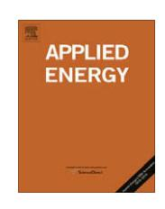

# The control of a free-piston engine generator. Part 1: Fundamental analyses

# R. Mikalsen, A.P. Roskilly \*

Sir Joseph Swan Institute for Energy Research, Newcastle University, Newcastle upon Tyne, NE1 7RU, England, UK

#### ARTICLE INFO

Article history: Received 8 December 2008 Received in revised form 21 June 2009 Accepted 23 June 2009 Available online 4 August 2009

Keywords: Free-piston Linear engine Dynamics Control

#### ABSTRACT

Free-piston engines are under investigation by a number of research groups due to potential fuel efficiency and exhaust emissions advantages over conventional technology. The main challenge with such engines is the control of the piston motion, and this has not yet been fully resolved for all types of free-piston engines. This paper discusses the basic features of a single piston free-piston engine generator under development at Newcastle University and investigates engine control issues using a full-cycle simulation model. Control variables and disturbances are identified, and a control strategy is proposed. It is found that the control of the free-piston engine is a challenge, but that the proposed control strategy is feasible. Engine speed control does, however, represent a challenge in the current design.

© 2009 Elsevier Ltd. All rights reserved.

## 1. Introduction

The fuel efficiency and exhaust gas emissions formation in internal combustion engines are under widespread investigation due to customer demands for low fuel consumption and stringent governmental emissions legislation. With the increasing availability of alternative and more environmentally friendly fuels, engine multi-fuel possibilities is also a topic of much interest. Modern engines benefit from the use of modern engine technology such as variable valve timing and electronically controlled fuel injection systems to allow optimisation of engine operation at all operating conditions.

The free-piston engine extends the possibilities for engine operational optimisation through variable compression ratio, but is significantly more complex in terms of engine control compared to conventional engines. This paper investigates the basic control of a single piston free-piston engine. More detailed investigations into the piston motion control and engine dynamics are presented in the accompanying paper [1].

## 1.1. Free-piston engines

The free-piston engine is a linear, 'crankless' combustion engine with a linear load device directly coupled to the moving piston. First proposed around 1930, free-piston engines were in use in the period 1930–1960 as air compressors and gas generators and provided some advantages over present-time conventional combustion engines and gas turbine systems. In recent years, modern

applications of the free-piston concept have been proposed for the generation of electric and hydraulic power, typically in hybrid-electric- or off-highway vehicles.

As the piston motion in free-piston engines is not restricted by a crankshaft, such engines have the potentially valuable feature of variable compression ratio. However, for the same reason, active control of piston motion is required in order to avoid excessive in-cylinder gas pressures while maintaining efficient combustion to secure engine operation. Furthermore, the free-piston engine is likely to be more sensitive to rapid load changes and cycle-to-cycle variations in the combustion process. Realising an effective engine control system is therefore the main prerequisite for this technology to be feasible.

# 1.2. Reported modern free-piston engine applications

Modern free-piston engines are mainly of the single piston or dual piston type. Illustrations of the two are shown in Fig. 1. The load device can be a hydraulic cylinder, as shown in the figures, or a linear electric machine.

Single piston hydraulic free-piston engines, similar to that illustrated in Fig. 1a, have been reported by among others Achten et al. [3] and Brunner et al. [4]. Achten et al. described the implementation of an advanced control system in the hydraulic circuit, and reported a fuel consumption advantage of 20% compared to a conventional engine-pump unit, rising to 50% at part load operation. Significant fuel efficiency advantages at part load operation were also reported by Hibi and Ito [5], who presented test results from an opposed piston hydraulic free-piston engine.

Tikkanen et al. [6] described the design of a diesel powered dual piston hydraulic free-piston engine. Experimental results showed a

\* Corresponding author. E-mail address: tony.roskilly@ncl.ac.uk (A.P. Roskilly).

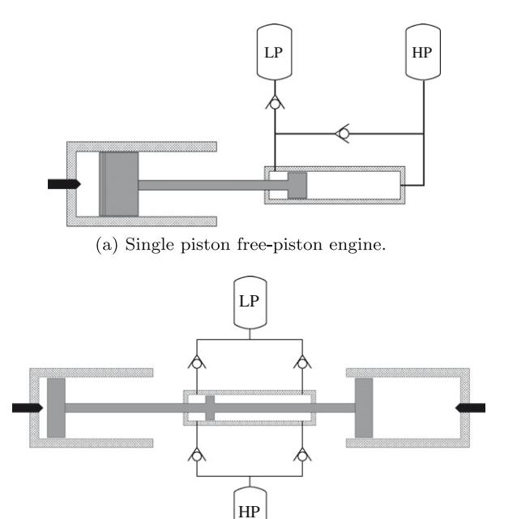

**Fig. 1.** Illustration of modern free-piston engine configurations [2]. (Note that the illustrations are simplified for clarity.)

(b) Dual piston free-piston engine.

piston motion profile different from that of conventional engines, with piston acceleration peak values reaching more than double those of comparable crankshaft engines. Cycle-to-cycle variations were reported, although not at levels critical for engine operation.

Clark et al. [7] and Famouri et al. [8] presented experimental results from a spark ignited dual piston engine generator. The engine is reported to have achieved 316 W electric power output at 23.1 Hz, with 36.5 mm bore and 50 mm maximum stroke [8]. High cycle-to-cycle variations were reported, in particular at low loads [7].

A comprehensive overview of free-piston engine history and the reported performance of such engines was presented by Mikalsen and Roskilly [2].

## 1.3. The control challenge

In conventional engines the crankshaft mechanism provides piston motion control, defining both the outer positions of the piston motion (the dead centres) and the piston motion profile. Due to the high inertia of the crankshaft system, the piston motion cannot be influenced in the timeframe of one cycle. In the free-piston engine the piston motion is determined by the instantaneous sum of the forces acting on the mover, and the piston motion is therefore influenced by the progress of the combustion process. Moreover, the piston motion profile may be different for different operating conditions. Variations between consecutive cycles due to cycle-to-cycle variations in the in-cylinder processes are also possible.

Achieving sufficient engine control over the full load range has been a reported problem in free-piston air compressors and gas generators, and a number of these engines were constant-power units with simple on/off control [2]. Other reports have described load dumping when operating at part load. Recent reports have also described significantly better engine behaviour at high loads. The performance of the controlled free-piston engine over the full operating range is therefore an area of particular interest.

#### 1.3.1. Control objectives

Control of the top and bottom dead centre (TDC and BDC) positions is crucial for the operation of the free-piston engine. The TDC position must be controlled within tight limits to ensure sufficient compression, required for fuel autoignition and efficient combustion, while avoiding excessive in-cylinder gas pressures. Similarly, as the free-piston engine in practice is restricted to the two stroke operating principle, the BDC position must be controlled to ensure efficient scavenging of the cylinder. Moreover, if the piston travels far outside these nominal dead centres, this may lead to mechanical contact between the pistons and cylinder heads, which may be fatal for the engine. The clearance between the piston and cylinder head at TDC are very small in diesel engines, typically between 1% and 2% of the stroke length.

A secondary control objective is the speed of the engine. This may be required to provide control of the fluid flow or delivery pressure in hydraulic engines, or the output voltage and electric frequency in free-piston engine generators.

Finally, in order to optimise engine operation and fully utilise the operational flexibility of the free-piston engine, a supervisory control system is required to control variables such as fuel injection timing, compression ratio setpoint and valve timing.

#### 1.3.2. Control of single piston engines

The excellent controllability of single piston hydraulic free-piston engines has been demonstrated by several authors, including Achten et al. [3]. The hydraulic cylinder acts as both load and rebound device using an advanced hydraulic control system, and the compression energy can be accurately controlled. Since the piston velocity at BDC is zero and the compression stroke starts only when the hydraulic energy is released, frequency control can be applied by pausing the piston at BDC. This "Pulse Pause Modulation" control, described in more detail in [3] and [2], allows the engine to operate at optimum conditions at all load levels, giving very high part load efficiency.

#### 1.3.3. Control of dual piston engines

Bouncing-type free-piston engines, i.e., dual piston engines or single piston engines using a bounce chamber, will have characteristics similar to those of a spring-mass system, and the control of such engines is significantly more complicated than for the hydraulic single piston engine. Since the compression energy is delivered directly or indirectly from the combustion power stroke, the combustion energy needs to be accurately controlled in order to achieve control of the compression ratio in the next cycle. Cycle-to-cycle variations in the combustion process may also be present, and this may be a problem for engine controllability and influence the performance.

Speed control of such engines may represent a further challenge. Many of the old free-piston engines were reported to be effectively constant-speed machines. If the engine speed range is limited, this may be a problem for example in hydraulic applications which require flow control. For loads where a constant speed is desired, such as electric generators, this may, however, be an advantage.

The control of a dual piston hydraulic free-piston engine was investigated by Tikkanen and Vilenius [9] using a simplified model based on energy balances. The aim of the work was to achieve compression ratio control for the engine, and it was demonstrated how acceptable performance could be achieved for moderate load changes by modifying the fuel mass flow. Cycle-to-cycle variations in dual piston free-piston engines have been reported by Tikkanen et al. [6] and Clark et al. [7], although neither reported that these were critical for engine operation.

Johansen et al. [10] derived a mathematical model of a single piston free-piston gas generator and investigated control issues in such an engine. Experimental results from a single cylinder test engine were reported and details of the engine control structure were outlined [11]. It was demonstrated how sufficient piston motion and engine optimisation control was obtained by controlling the fuel mass flow and the amount of air trapped in the bounce chamber.

## 2. The single piston free-piston engine generator

The design of a single piston free-piston diesel engine generator currently under development at Newcastle University was described by Mikalsen and Roskilly [12]. An illustration of the basic engine design is shown in Fig. 2. The performance of the unit was modelled and it was found that this engine concept possesses some potential advantages compared with conventional technology, due to reduced heat transfer and frictional losses, and enhanced operational optimisation possibilities. However, it was stated that the feasibility of this type of engine depends on an appropriate piston motion control system being realised.

Fig. 2 shows the free-piston engine design, with:

- ① Exhaust poppet valves.
- ② Scavenging ports.
- ③ Common rail fuel injection.
- 4 Linear alternator.
- ⑤ Bounce chamber.
- 6 Bounce chamber pressure control valves.
- Turbocharger compressor.
- 8 Turbocharger turbine.

The engine operates on a turbocharged two stroke direct injection compression ignition (diesel) cycle and the main design data are listed in Table 1.

# 2.1. Basic operational characteristics

The engine will have characteristics similar to a dual piston engine, as described above. However, replacing one firing cylinder

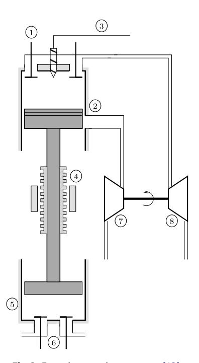

**Fig. 2.** Free-piston engine generator [12].

**Table 1**Main free-piston engine specifications and predicted engine performance [12].

| Stroke                    | 0.150 m |
|---------------------------|---------|
| Bore                      | 0.131 m |
| Mover mass                | 22 kg   |
| Nominal compression ratio | 15:1    |
| Nominal speed             | 30 Hz   |
| Output power              | 44.4 kW |
| Engine efficiency         | 0.42    |
|                           |         |

with a variable-pressure bounce chamber adds a control variable to the engine, but with the cost of reduced engine power density and higher frictional losses. Starting of the engine is done using stored electric energy and running the electric machine in motoring mode. The electric machine will drive the mover back and forth to build up sufficient compression for fuel to be injected. When running, the engine will resemble a spring-mass system; the bouncing frequency and the endpoints of the motion will depend on the moving mass and the stiffness of the springs.

## 2.2. Engine simulation model

An advanced full-cycle simulation model of the free-piston engine generator was presented in [12]. The piston dynamics are solved numerically using single-zone submodels for engine combustion, heat transfer, gas properties, frictional losses, etc. A scavenging model allows the thermodynamic consequences of poor scavenging to be taken into account, which is crucial for investigations into engine dynamic performance such as those presented here. The model accounts for factors such as the effects of varying compression ratio on ignition delay and combustion, and the effects of changes in BDC position on the scavenging and the following combustion process. The model therefore provides a powerful tool for investigating engine control issues. All investigations in this paper are based on predictions from this engine model. For further details of the model the reader is referred to [12].

# 2.3. Engine control objectives

Of the control objectives, TDC position will be that of highest importance, BDC position control is slightly less stringent, whereas engine speed is not critical for engine operation. Supervisory control objectives include the optimisation of engine operation for all load conditions.

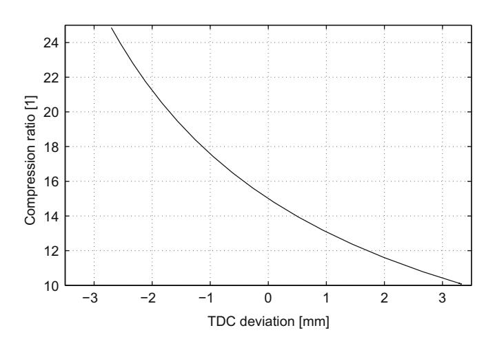

Fig. 3. Effect of varying TDC position on engine compression ratio.

#### 2.3.1. TDC control

Fig. 3 shows the effect of variations in TDC position on the compression ratio in the current engine. It can be seen that even small variations in TDC position lead to large changes in engine compression ratio. A typical clearance between the piston and cylinder head at TDC in this engine would be 2–3 mm. (It may, however, be necessary to use a piston with a flatter profile in the free-piston engine, to give more clearance and avoid critical situations during transient operation.) Accurate control of TDC position is therefore of high importance to engine operation.

Unlike in conventional engines, the TDC setpoint can in the freepiston engine be varied for varying engine load. At low loads, the compression ratio can be increased without experiencing excessive peak gas pressures. This has been demonstrated by other authors, including Tikkanen and Vilenius [9], who varied nominal compression ratio from 15:1 at full load to 30:1 at lower loads. In this work, the compression ratio setpoint was varied linearly between values of 20:1 at 10% load and 15:1 at 100% load.

#### 2.3.2. BDC control

In the lower end of the stroke, the BDC position will also have effects on engine performance. The requirements are, however, not as stringent as for TDC position, since the engine can be designed to allow some variation in BDC position without danger of mechanical damage. In the current engine, the nominal clearance distance between the bounce chamber piston and cylinder head at BDC is 10 mm, i.e., significantly higher than the clearance distance in the combustion cylinder.

In terms of engine performance, changing the BDC position will mainly influence the time and port area available for scavenging, and small variations in BDC position will not have large influence on overall engine performance. The scavenging ports height in the engine investigated in this work is 22 mm, and the critical BDC deviation, for which scavenging would completely fail, is therefore one order of magnitude higher than a typical critical deviation for TDC position.

## 2.3.3. Speed control

Speed control of the engine may be required, depending on the requirements of the load device. Unlike in hydraulic free-piston engines, where a wide speed range will be desired to allow flow control, the free-piston engine generator is likely to benefit from a close to constant operating speed. A factor of interest will therefore be if a constant speed can be achieved and maintained through the full load range for the current engine.

Furthermore, the engine investigated here is intended to be modular, in such a way that a number of units can be operated in parallel to increase the power output. If the engine speed can be accurately controlled, vibrations from the plant can be reduced or cancelled out by running the units in different phases.

#### 2.3.4. Operation optimisation

On a higher level, a supervisory control system is required to optimise engine performance for any given operating point, which in conventional combustion engines is typically achieved by adjusting variables such as fuel injection timing and valve timing. Unlike conventional engines, however, operation optimisation of the free-piston engine may include varying the compression ratio and stroke length.

## 2.4. Control structure

Like any plant, a number of inputs and outputs to the system can be defined. On the lowest level, main inputs to the engine include the signals to the fuel injection system, determining fuel injection timing and mass of fuel to be injected, and the signals

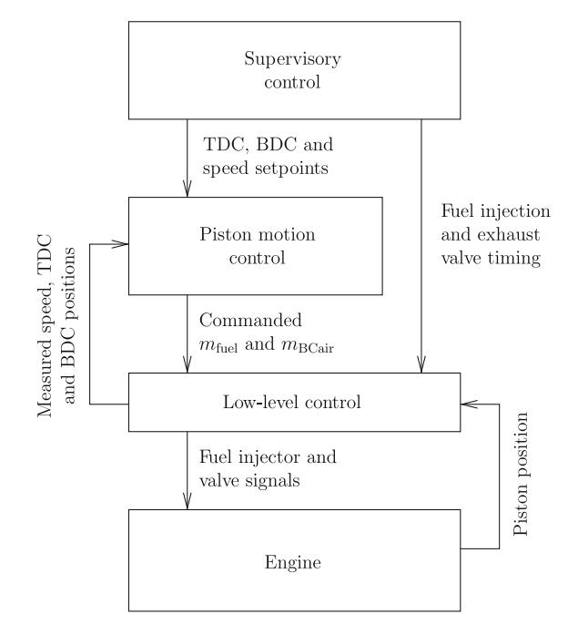

Fig. 4. Free-piston engine control structure.

to the bounce chamber pressure control valves, whose opening and closing timing determine the amount of gas trapped in the bounce chamber. These make up the available control variables for the engine. The main disturbance is the load force from the linear electric machine, which for the purpose of this investigation is assumed not to be controllable.1

Fig. 4 illustrates the proposed control structure for the free-piston engine, showing low-level control, piston motion control and supervisory control systems. The control structure is similar to that presented by Johansen et al. [11], however the current engine differs from that presented by Johansen et al. in some respects, most importantly in the interaction between the engine and the load.

The low-level control reads the piston position continuously and provides the signals for the fuel injector, pressure control valves and exhaust valves based on the commanded values. It further calculates TDC and BDC positions along with engine speed, and feeds this information to the piston motion control system.

The piston motion control system receives setpoints for TDC, BDC and engine speed from the supervisory control system and manipulates the command signals for the fuel flow and bounce chamber pressure.

Finally, the supervisory control system sets the TDC, BDC and speed setpoints according to the operating conditions (such as load and speed) of the engine. Fuel injection timing and exhaust valve timing are reserved for engine optimisation purposes and is therefore also set by the supervisory control system.

## 3. Model analyses

The control variables of the engine have been identified, and their effects on engine operation, along with those of the load force disturbance, must be investigated in order to evaluate potential control strategies.

&lt;sup>1 Some level of control of the electric machine will have to be implemented in the unit to aid starting. If sufficient engine control cannot be achieved with the control variables at hand, it may be possible to apply load control on the electric machine with the implementation of appropriate power electronics, to aid engine control.

## 3.1. Fuel mass flow

Controlling the mass of fuel injected per cycle is commonly used in conventional diesel engines to control engine speed or power output. Modern engine technology, such as electronically controlled common rail fuel injection systems, makes the implementation of fuel mass flow control straight-forward and allows high flexibility in the control of this variable.

The fuel mass control variable is discrete in nature, as it can only be varied once per engine cycle. Hence, if a disturbance occurs shortly after the fuel injector command signals are set, corrections can only begin to take action one full cycle later.

Varying the amount of fuel injected will influence the amount of energy in the combustion gases. If one considers the power stroke, the amount of combustion energy will influence the amount of compression energy stored in the bounce chamber, and the fuel mass control variable is therefore likely to influence the BDC position. Furthermore, changes in the compression of the bounce chamber gases will influence the available compression energy for the next cycle, hence a change in the subsequent TDC position is also expected from a change in fuel mass input. Finally, changes in the pressure levels in the cylinders will influence piston acceleration, and effects of this variable on engine speed are therefore also likely.

Fig. 5a shows the effect of fuel mass per cycle on engine operational variables. It is seen that changes in the fuel mass as expected have large effects on engine operation and lead to changes in stroke length, dead centre positions and engine speed.

#### 3.2. Fuel injection timing

The fuel injection timing has an influence on the TDC position, since it controls the timing of the energy release which slows down the piston and accelerates it downwards. The timing of the energy release has, however, a large influence on the in-cylinder gas temperature, and therefore also engine efficiency and emissions formation, and it is in conventional engines commonly used as a tool to optimise engine performance. It is therefore likely to be unsuitable as a main control variable for the speed or dead centre positions in the free-piston engine due to the potential penalties in exhaust gas emissions and fuel consumption.

Fig. 5b shows the steady state effects of changes in fuel injection timing. It can be seen that fuel injection timing has some effect on TDC and BDC positions, but practically no effect on engine speed. A large penalty in the temperature levels within the cylinder is, however, also seen with advanced fuel injection timing, and this will heavily influence both engine efficiency and emissions. This control variable is therefore assumed to be available only for engine optimisation purposes and not for piston motion control.

## 3.3. Bounce chamber trapped air

Variations in the amount of trapped air in the bounce chamber will change the stiffness of the bounce chamber gas spring. Considering the power expansion stroke, such variations influence the process of energy storage in the bounce chamber and the point at which the piston stops and the return motion starts. Changing the amount of air in the bounce chamber pressure is therefore likely to influence the engine BDC position. A significant influence on TDC position is not expected, since the amount of compression energy stored in the bounce chamber is determined mainly by the combustion process. Changing the pressure levels in the bounce chamber may, however, influence piston accelerations, which will influence engine speed.

The amount of air in the bounce chamber can, if a sufficient supply pressure is available, be controlled continuously throughout the stroke. Due to the high pressures in the bounce chamber when compressed it is, however, likely that control of the bounce

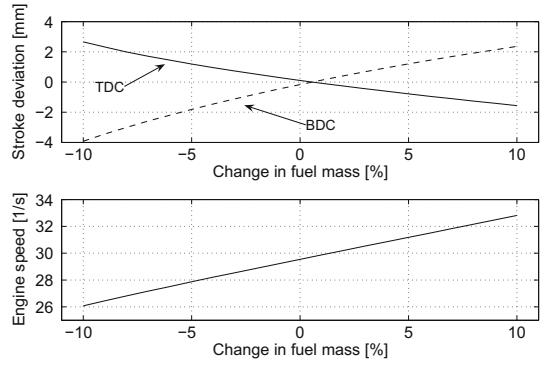

(a) Steady state engine response to changes in mass of fuel per injection.

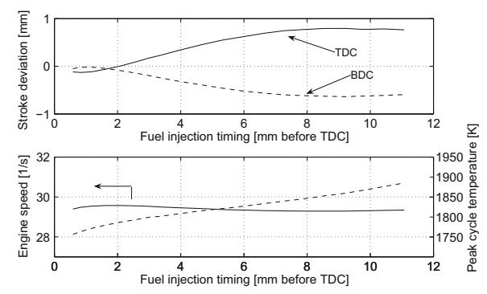

(b) Steady state effects of changes in fuel injection timing.

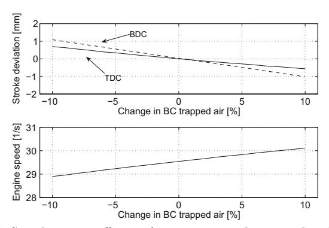

(c) Steady state effects of variations in bounce chamber trapped air.

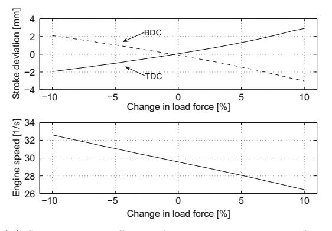

(d) Steady state effects of varying electric load force.

**Fig. 5.** Effects of plant inputs.

chamber air mass is limited to the part of the cycle when the piston is close to TDC position and the pressure in the bounce chamber is low.

Fig. 5c shows the steady state effects of changes in the amount of air trapped in the bounce chamber. It is seen that this variable has some effect on dead centre positions, with a slightly higher influence on BDC position. Having somewhat similar effects on the TDC and BDC positions, the stroke length is not largely influenced by the bounce chamber trapped air. Some influence on engine speed can also be seen.

## 3.4. Load force

The characteristics of the load force from the electric machine will depend on the type of electric machine and the electric load coupled to it. While it may be possible to control the electric load force using power electronics, the load force is in the investigations presented here treated as a disturbance only.

The amount of energy extracted through the load will heavily influence engine operation. If one considers a full engine cycle, an increase in electric load force will reduce the amount of compression energy available, leading to a lower compression ratio in both the combustion cylinder and the bounce chamber. The load force is therefore likely to influence both TDC and BDC positions, where an increased load force will lead to a shorter stroke length and vice versa. Engine speed will also be influenced due to changes in the pressure levels in the cylinders.

Fig. 5d shows the steady state effects on the engine from variations in electric load force. A high influence both on engine speed and dead centre positions is seen, with the magnitude of the engine response being comparable to that resulting from changes in fuel mass.

## 3.5. Engine dynamics

The dynamic response of the engine to changes in the disturbance and control variables is of high importance, since it determines the feasibility of given control variables to counteract disturbances sufficiently fast to avoid situations critical for engine operation

A series of tests were performed on the simulation model, introducing step changes in the input variables fuel mass, bounce chamber trapped air and load force. It was found that the responses of all output variables (TDC, BDC and speed) resembled first-order or overdamped second-order systems, except the response in BDC for changes in bounce chamber pressure, which resembled a slightly underdamped second-order system (i.e., having a minor overshoot in the response).

Examples of the engine response to a step change in fuel mass flow and electric load force are shown in Fig. 6. In both figures the change is imposed at time  $t=1\,\mathrm{s}$ . The minor delay in the engine response for the fuel mass input due to its discrete nature is seen, whereas for the load force the response is instant. It can be noted that the responses for fuel mass and load force are very similar, both in terms of steady state and dynamic response. The speed of response for the fuel mass input is slightly higher than that of the load force, however the initial delay in the response for changes in fuel mass gives an overall similar speed of response for the two. The speed of response for the bounce chamber trapped air input was found to be similar to these.

## 3.6. System nonlinearities

The system gain for all the input variables depends on the engine operating conditions, mainly the load demand, and this will be of high importance in the design of the controller. The gain de-

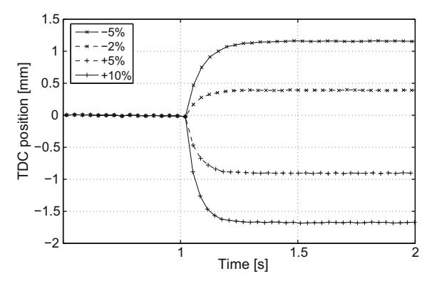

(a) Engine response to a step change in mass of fuel per injection. (Ticks show consecutive TDC position readings.)

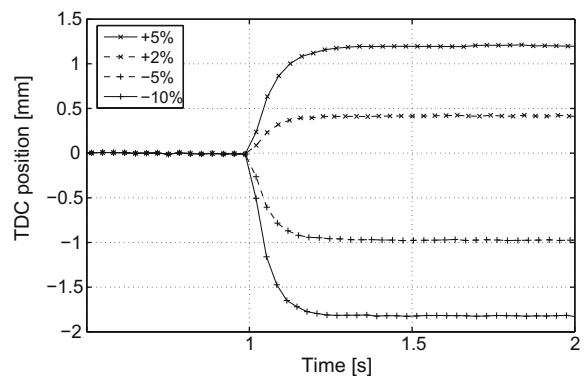

(b) Engine response to a step change in electric load force. (Ticks show consecutive TDC position readings.)

Fig. 6. Examples of engine dynamic response.

fines the ratio of the magnitude of response in an operational variable to the magnitude of change in an input variable, for example

$$\Delta TDC = k\Delta m_{\text{fuel}}$$

for the effect of fuel mass changes on TDC position, where k is the gain.

Fig. 7 shows the gain for the control variables over the engine load range. A significant degree of nonlinearity is seen for all input variables which suggests that a nonlinear controller may be necessary to achieve good performance over the full load range. The very similar influence of the load force and the fuel mass flow may, however, reduce this problem.

## 4. Controlled engine performance

It is clear that a controller is critical for engine operation. The investigations above showed that even a 10% change in the electric load force produced a TDC position error that is probably unacceptably large. The performance requirements for the control system will depend on the specific engine design, most importantly the clearance between the piston and the cylinder head at TDC.

Simulations have shown the feasibility of using the fuel mass and bounce chamber trapped air control variables to control TDC and BDC positions over the full load range (where the load was varied by varying the load force). Fig. 8a shows the steady state demand on the control variables over the load range. (The dynamic performance of the controlled engine system is studied in the accompanying paper [1].) Fig. 8b shows the resulting engine speed, for which no control variable is available. It can be seen that the speed variations over the load range are significant.

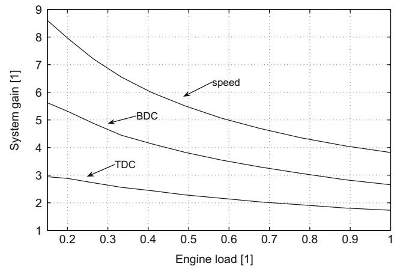

(a) Gain for fuel mass flow input.

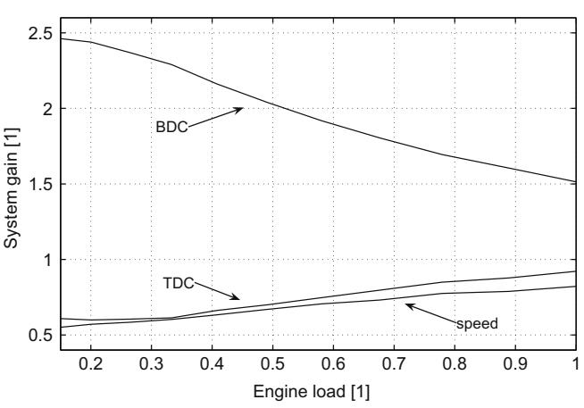

(b) Gain for bounce chamber pressure input.

Fig. 7. Plant nonlinear gain.

#### 4.1. Speed control through varying stroke length

Johansen et al. [10] suggested to vary the TDC and BDC setpoints to influence engine stroke length and thereby control engine speed, utilising the fact that the stroke length and bouncing frequency in the free-piston engine are interconnected.

The TDC position has, as mentioned above, a high influence on engine performance and control of the TDC setpoint is restricted for engine optimisation purposes. The BDC can be varied over a significantly larger range without major penalties in engine performance. In the current engine, the distance from the BDC setpoint to the point of scavenging ports opening is 22 mm, whereas the clearance distance to the bounce chamber cylinder head is 10 mm. The BDC setpoint can therefore be varied significantly without risk of damage to the engine, however such variations may influence engine performance.

Fig. 9 shows the effects of varying BDC setpoint on engine speed at different loads. It is seen that at a given load, the speed can only be varied over a very limited range with this method. A speed of for example 30 Hz would not be possible to maintain over the full load range even if large changes in BDC setpoint were allowed. Furthermore, the required changes in the BDC setpoint would lead to reduced scavenging time and port area at high loads, whereas the BDC setpoint would be below its nominal value at low loads when a reduction in scavenging performance would be more acceptable.

It is concluded that this method can be applied successfully and without major effects on engine performance only for a very limited load range, from full load and down to around 90% load.

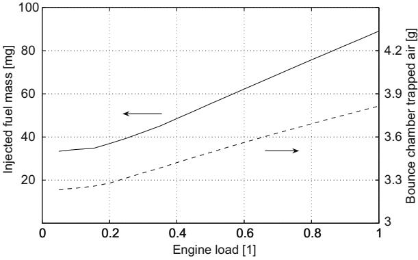

(a) Injected fuel mass per cycle and bounce chamber trapped air for the controlled engine.

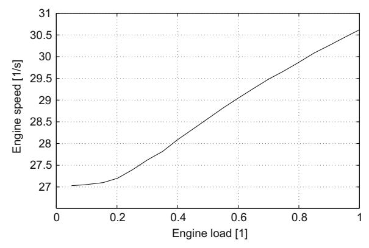

(b) Engine speed with TDC and BDC control.

Fig. 8. Controlled engine operating characteristics.

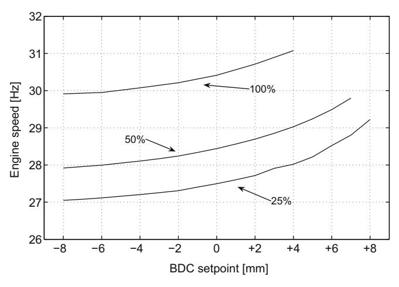

Fig. 9. Control of engine speed through varying BDC setpoint for different loads.

Hence, this method of speed control would only be feasible for constant power applications.

## 5. Conclusions

An investigation into the basic control of a free-piston engine generator was presented. Control objectives for the engine were outlined and a control strategy proposed. Control variables were identified, and their influence on engine operation investigated, along with that of engine disturbances, using a full-cycle simulation model.

It was found that suitable control variables exist for the most important control objective, namely the control of piston dead centre positions. Engine speed could not be controlled using the existing control variables. Further investigations into the dynamics of the engine is necessary, and is discussed in detail in the accompanying paper [1].

#### References

- [1] Mikalsen R, Roskilly AP. The control of a free-piston engine generator. Part 2: Engine dynamics and piston motion control. Appl Energy 2009;87(4): 1281-7
- [2] Mikalsen R, Roskilly AP. A review of free-piston engine history and applications. Appl Therm Eng 2007;27:2339–52.
- [3] Achten PAJ, van den Oever JPJ, Potma J, Vael GEM. Horsepower with brains: the design of the Chiron free piston engine. SAE paper 2000-01-2545; 2000.
- [4] Brunner H, Dantlgraber J, Feuser A, Fichtl H, Schäffer R, Winger A. Renaissance einer Kolbenmachine. Antriebstechnik 2005;4:66–70.

- [5] Hibi A, Ito T. Fundamental test results of a hydraulic free piston internal combustion engine. Proc Inst Mech Eng 2004;218:1149–57.
- [6] Tikkanen S, Lammila M, Herranen M, Vilenius, M. First cycles of the dual hydraulic free piston engine. SAE paper 2000-01-2546; 2000.
- [7] Clark N, Nandkumar S, Atkinson C, Atkinson R, McDaniel T, Petreanu S, et al. Operation of a small-bore two-stroke linear engine. Proc Fall Tech Conf ASME Internal Combust Eng Div 1998;31-1:33-40.
- [8] Famouri P, Cawthorne WR, Clark N, Nandkumar S, Atkinson C, Atkinson R, et al. Design and testing of a novel linear alternator and engine system for remote electrical power generation. In: Proceedings of IEEE power engineering society winter meeting; 1999. p. 108–12.
- [9] Tikkanen S, Vilenius M. Control of a dual hydraulic free piston engine. Int J Veh Autonom Syst 2006;4(1):3–23.
- [10] Johansen TA, Egeland O, Johannesen EA, Kvamsdal R. Dynamics and control of a free-piston diesel engine. ASME J Dyn Syst, Meas Control 2003;125:468–74.
- [11] Johansen TA, Egeland O, Johannesen EA, Kvamsdal R. Free-piston diesel engine timing and control – towards electronic cam – and crankshaft. IEEE Trans Control Syst Technol 2002;10:177–90.
- [12] Mikalsen R, Roskilly AP. The design and simulation of a two-stroke free-piston compression ignition engine for electrical power generation. Appl Therm Eng 2008: 28:589–600