Contents lists available at ScienceDirect

# **Applied Energy**

journal homepage: www.elsevier.com/locate/apenergy

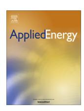

CrossMark

# A review of free-piston linear engines

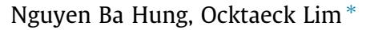

School of Mechanical Engineering, University of Ulsan, San 29, Mugeo2-dong, Nam-gu, Ulsan 680-749, Republic of Korea

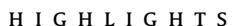

- FPLEs are classified in different designs.
- Piston dynamics, combustion, and electric power generation of FPLEs are reviewed.
- Experimental systems of FPLEs are reviewed.
- Application of FPLEs for hybrid electric vehicles is discussed.

## ARTICLE INFO

#### Article history: Received 5 March 2016 Received in revised form 27 May 2016 Accepted 11 June 2016 Available online 17 June 2016

Keywords:
Linear engine
Linear alternator
Free-piston
Two-stroke engine
Hybrid engine

#### ABSTRACT

Unlike conventional internal combustion engines, a free-piston linear engine has no a crankshaft, and thus the pistons move freely in the cylinder. This allows a free-piston linear engine to easily adjust the compression ratio and optimize the combustion process. Free-piston linear engines include two main parts: a free-piston engine and a linear alternator. The free-piston engine is classified into three main types: single piston, dual piston, and opposed piston. The linear alternator is generally categorized as flat-type or tubular-type. Free-piston linear engines can operate with multi-fuel and HCCI combustion because of their variable compression ratios. Furthermore, they are used to generate the electric power applied in hybrid electric vehicles. To promote understanding of the unique features of free-piston linear engines, this paper presents a review of their different designs and operating characteristics. We also discuss the varied experimental systems and applications of free-piston linear engines.

© 2016 Elsevier Ltd. All rights reserved.

## Contents

|    | Introduction                                   |      |
|----|------------------------------------------------|------|
| 2. | Classification of FPLEs                        | . 79 |
|    | 2.1. Number of strokes.                        | 79   |
|    | 2.2. Kind of piston                            | 80   |
|    | 2.3. Kinds of linear alternators               | 81   |
| 3. | Operating characteristics                      | . 82 |
|    | 3.1. Piston dynamics                           | 82   |
|    | 3.2. Combustion characteristics.               | 83   |
|    | 3.2.1. Spark ignition combustion               | . 83 |
|    | 3.2.2. Compression ignition combustion         | . 86 |
|    | 3.2.3. HCCl combustion                         | . 89 |
|    | 3.3. Power generating characteristics          | 91   |
| 4. | Experimental systems and applications of FPLE. | . 92 |
|    | 4.1. Experimental FPLE systems                 | 92   |

Abbreviations: FPLE, free piston linear engine; SI, spark ignition; CI, compression ignition; HCCI, homogenous charge compression ignition; CFD, computational fluid dynamics; TDC, top dead center; P–V, pressure–volume; HC, hydrocarbon;  $NO_x$ , oxides of nitrogen; DAQ, data acquisition; NI, national instrument; PXI, PCI (peripheral component interconnect) extensions for instrumentation; CNG, compressed natural gas; HEVs, hybrid electric vehicles.

E-mail address: otlim@ulsan.ac.kr (O. Lim).

\* Corresponding author.

|    | 4.2. Applications of FPLE | 95 |
|----|---------------------------|----|
| 5. | Conclusion                | 95 |
|    | Acknowledgement           | 96 |
|    | References                | 96 |

#### 1. Introduction

In general, in an internal combustion engine with a crankshaft mechanism, the combustion process occurs near its top dead center (TDC) position; thus the highest temperature and pressure are maintained for a relatively long time. Consequently, the heat loss is relatively high, which degrades the engine efficiency. In addition, friction loss is also a problem for internal combustion engines with a crankshaft mechanism because of the complicated engine structure. The friction loss includes the friction among the piston rings, cylinder wall, and piston skirt; friction in the crankshaft and camshaft bearings; and friction in the valves. The crankshaft mechanism contributes significantly to the friction loss through the formation of piston side forces that cause friction between the piston and the cylinder liner [1]. To overcome those drawbacks, researchers have developed a newer design called the free-piston engine. In a free-piston engine, the piston motion is free in the cylinder, without any constraint between the piston position and the rotating motion of a crankshaft. Pescara [2] first proposed the modern free-piston engine, and the original application was a single piston air compressor. Pescara started his work on free-piston engines around 1922 and he developed prototypes with spark ignition in 1925 and diesel combustion in 1928. The latter led to the development of the Pescara free-piston air compressor [3]. Pescara continued his work on free-piston machinery and also patented a multi-stage free-piston air compressor engine in 1941 [4]. Since then, many researchers have published studies of modern applications of the free-piston engine concept, mainly hydraulic engines and free-piston linear engines. The hydraulic engines are usually intended for off-highway vehicles, whereas the free-piston linear engines are usually intended for hybrid electric vehicles. In this paper, we review free-piston linear engine (FPLE) research because of its great potential for development and commercialization. The first FPLE was patented in 1944 [5]. Since then, many kinds of FPLE have been investigated and developed by researchers around the world. In terms of structure, FPLEs include two main components: a free-piston engine and a linear alternator. The linear alternator consists of permanent magnets and windings, in which the permanent magnets can be attached in a rotor or stator [6-11]. When the engine starts, the linear alternator receives alternating current to drive the free-piston engine through a connecting system in the motoring mode. After certain frequencies, spark plugs are activated in a spark ignition (SI) engine, or fuel is injected into the cylinder in a compression ignition (CI) engine to initiate the combustion process in the cylinder and cause a reciprocating motion of the piston. The piston movement and the connecting system then generate current in the windings of the linear alternator as the magnetic flux linked with the winding changes in the firing mode or electrical power generating mode. Electric power output depends on various specifications of the linear alternator, which we will present in the next section.

Unlike conventional internal combustion engines with a crank-shaft mechanism, FPLE pistons move freely in the cylinder, which allows the FPLE to change the compression ratio and optimize the combustion process. By changing the compression ratio, an FPLE can operate with homogeneous charge compression ignition (HCCI) combustion, which allows the engine to increase its thermal efficiency and reduce  $\mathrm{NO}_x$  and HC emissions [12]. An FPLE is also

mechanically simple, and the integrated linear alternator allows a compact design, which reduces the manufacturing costs, compared with crankshaft engines. The lack of a crankshaft significantly reduces frictional losses, and the free-piston motion makes the acceleration much larger than in a traditional internal combustion engine. According to findings from the literature [13], predicted peak piston acceleration in a free-piston engine was about 60% higher than in a conventional engine, and the free-piston engine spent less time around TDC, where the gas pressure and temperature are highest, because of its faster expansion. Therefore, the heat transfer loss in the cylinder of a free-piston engine is less than that in a conventional engine. However, freepiston motion in the cylinder does lead to variation in combustion pressure at each engine cycle [14,15]. Also, in FPLE operation, which is mainly controlled by an electronic system, the piston crown can hit the cylinder head if the piston motion is not controlled correctly [16,17], though that possibility can be eliminated by installing a damping device in the cylinder [18].

Many researchers around the world are interested in using FPLEs as advanced power sources that offer reduced emissions and increased performance over existing engines. Such research has been conducted by institutes and universities such as the Korea Advanced Institute of Science and Technology [19], Beijing Institute of Technology [20,21], University of Ulsan [22], National Taiwan University of Science and Technology [23], Shanghai Jiao Tong University [24], Nanjing University [25], Tongji University [26], Stanford University [27], West Virginia University [28], Newcastle University [29], and Sandia National Laboratories [30]. To easily classify and summarize FPLE research results, we here present a review of FPLEs with different designations and operating characteristics. We also summarize some experimental systems and varied applications of FPLEs.

#### 2. Classification of FPLEs

#### 2.1. Number of strokes

Similar to traditional internal combustion engines, FPLEs are classified into four-stroke and two-stroke engines. The strokes of a four-stroke FPLE are intake, compression, combustion, and exhaust. In a traditional internal combustion engine with a crank-shaft mechanism, the four strokes happen in two revolutions of the crankshaft, and the combustion stroke is called the power stroke. For FPLEs, the four strokes occur in the linear motion of the piston, and the intake and exhaust valves are controlled by an electronic system. Xu and Chang [31] studied the motion control of a four-stroke FPLE developed for electric power generation. The piston strokes combined with the open/close timing of the intake and exhaust valves were electronically controlled.

Even though the four-stroke principle can be applied to FPLEs, it presents greater technical challenges for motion control than two-stroke engines [31]. The technical challenges for motion control of the four-stroke FPLE include the complex control of the opening/closing times of the intake and exhaust valves vis-à-vis the linear motion of the piston. The opening/closing times of the intake and exhaust valves must be controlled correctly to prevent a collision between them and the piston crown. Therefore,

four-stroke FPLEs have been investigated less than two-stroke FPLEs, which simplify the engine structure and improve motion control. Jia et al. [32] simulated the piston dynamics and thermodynamics of a two- or four-stroke FPLE. For the two-stroke cycle, the linear generator was used only as a generator, whereas it functioned as both a motor and a generator in the four-stroke cycle. They found that the piston speed during the expansion process of the four-stroke cycle was higher than that of the two-stroke cycle. However, for the non-power strokes of the four-stroke cycle, the piston speed was much lower because of the brake force of the motor, as shown in Fig. 1. They also showed that the heat release process was more aligned with a constant volume process when the FPLE operated in two-stroke mode, and the peak cylinder pressure of four-stroke cycle was higher than that of the two-stroke cycle, as shown in Fig. 2. This can be explained by increasing of piston displacement in the four-stroke cycle. As can be seen in Fig. 1, the displacement of the piston in the four-stroke cycle was significantly longer than that in the two-stroke cycle because in the four-stroke cycle, piston movement could be controlled by optimizing the motor forces. To ensure stable and smooth engine operation using a four-stroke cycle, the authors proposed a more complex and robust control system [32]. Their simulation results also indicated that the indicated power and electric power of the two-stroke cycle were much higher than those of the four-stroke cycle with the same throttle opening, as shown in Fig. 3. Because the electric power generated in the four-stroke cycle was used to

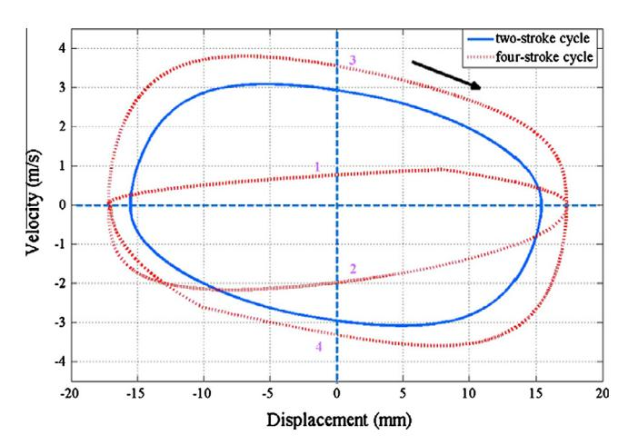

Fig. 1. Piston velocity versus displacement [32].

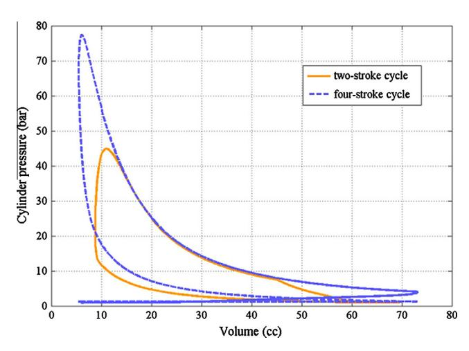

Fig. 2. Pressure-volume diagram [32].

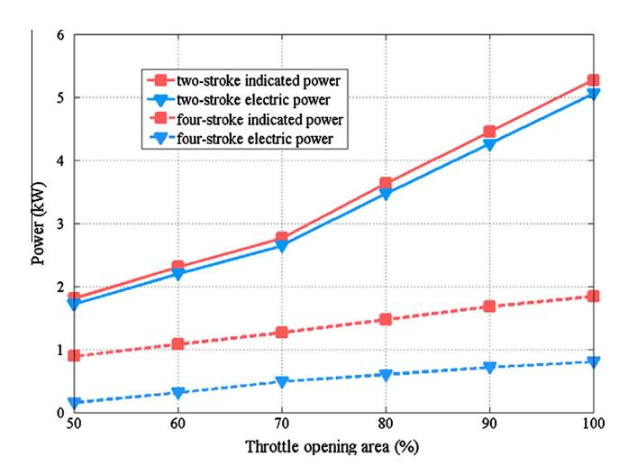

Fig. 3. Power generated with various throttle settings [32].

compensate for the overall power consumption during the motoring processes.

The strokes of the most typical two-stroke FPLE are scavenging-compression and combustion–expansion. The scavenging process occurs in different ways depending on the engine type. Goldsborough and Blarigan [33] presented an optimal study for the scavenging system of a two-stroke FPLE. They investigated a wide range of design options, including loop, hybrid-loop, and uniflow scavenging methods. The uniflow method uses the exhaust valve to liberate exhaust gas during the scavenging process. Locating the exhaust valves in the cylinder head ensures better flushing at the top of the combustion chamber, but increases the mechanical complexity of the engine because the valves must be actuated. Two-stroke FPLEs using the uniflow scavenging method are also found in other studies [34–37].

#### 2.2. Kind of piston

In general, FPLEs can be classified into three piston types: single piston, double piston (dual piston and opposed piston), and four piston (dual piston, opposed piston, and complex piston configuration), as shown in Fig. 4 [22,24,38,39]. Of those, the single-piston engine has a simple design with higher controllability than the other FPLEs; however, the dynamic balance is not good because it has only one piston. Mikalsen and Roskilly [13] proposed a prototype of a single-piston FPLE for electric power generation in large scale systems. Their engine includes a combustion cylinder, a bounce chamber cylinder, and a linear electric machine, as shown in Fig. 5. In this engine, the amount of air contained in the bounce chamber is varied by control valves to change the force coming from the bounce chamber. Tian et al. [20] replaced the bounce chamber with a rebound spring, as shown in Fig. 6. This allowed a simpler design, compared with the design of Mikalsen and Roskilly [13]. So far, the single-piston FPLE is the closest to a commercial system because it offers the simplest configuration and high controllability. Kosaka et al. [40] developed a prototype singlepiston FPLE using a cooling and lubricating system along with control system logic, which contributed significantly to commercialization of an FPLE. Their single piston FPLE used a cooling oil passage and a water-cooled cylinder head, as shown in Fig. 7.

A perfectly balanced design is the main advantage of opposedpiston configurations, but those designs make engines complicated [38]. Pontus Ostenberg presented an early opposed-piston FPLE in 1943 [5], as shown in Fig. 8. Therein, A denotes a free-piston engine with opposed pistons (piston 2 and piston 2a), and B denotes a single-phase linear alternator. In Pontus Ostenberg's engine,

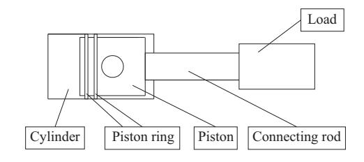

(a) Single-piston linear engine configuration

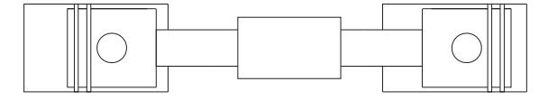

(b) Dual-piston linear engine configuration

(c) Opposed-piston linear engine configuration

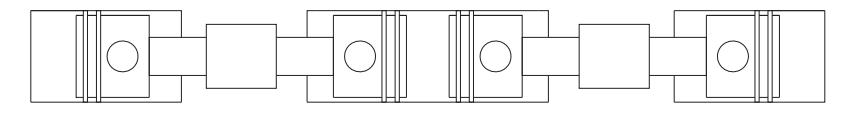

(d) Four-cylinder complex configuration

Fig. 4. Schematics of different FPLE designs [22].

cylinder 1 is surrounded by a second cylinder 3, which has an annular water chamber 5 encompassing the explosion chamber 4 of the engine. This schematic provides useful knowledge for the cooling problem in opposed-piston FPLEs. Johnson and Leick [30] presented an experimental evaluation of an opposed-piston FPLE that used a water-cooled combustion cylinder and a lubrication oil distribution system. They used a fixed volume delivery system to meter lubricating oil to the combustion chamber and each bounce chamber through small ports in the cylinder walls.

In dual-piston engines, the working piston provides the work to drive the compression process in the other cylinder, which allows a relatively simple device with a high power/weight ratio [24]. Nonetheless, the free motion of the dual pistons in the cylinders leads to variation in the combustion pressure in each cylinder as well as pressure variations at each engine cycle [14,15]. In addition, the operation of a dual-piston engine is mainly controlled by an electronic system, and the piston crown can hit the cylinder head if the control is incorrect [16,17]. Therefore, a damping device (e.g., metal spring) is needed in the cylinder of a dual-piston engine to prevent such a collision. Robinson et al. [18] used springs in his dualpiston FPLE model, as shown in Fig. 9. Based on the Otto cycle, he showed that the use of springs can raise system frequency and affect the piston dynamics toward more stable operation. The use of metal springs in a dual-piston FPLE is also mentioned in a study conducted by Hung et al. [22], as shown in Fig. 10. Many previous studies have been done for dual-piston FPLEs [14,19,22-24,26-28]; however, most of those engines used air-cooling systems, and the lubricant system for those engines has not yet drawn much interest. To commercialize dual-piston FPLEs, their cooling and lubricant problems need to be considered further. Table 1 shows a summary of the basic kinds of FPLEs with a brief history of their development.

## 2.3. Kinds of linear alternators

In an FPLE, the linear alternator is a necessary device for starting the engine (motoring mode) and generating electrical power (firing mode) [49]. In general, the linear alternator can be classified into two types: tubular and flat. Almost all of the research about dual-piston FPLE generators has used tubular-type linear alternators because their structural merits make them more reliable than flat-type linear alternators [50]. However, the magnetic ring, lamination stacked stator, and windings in a tubular alternator are hard to manufacture and assemble, and sectional areas of the windings are constrained by the magnetic ring. Li et al. [50] carried out a simulation study for both flat and tubular linear alternator FPLEs as shown in Fig. 11. They used finite element models to simulate and compare the peak voltage, current density, specific power, and efficiency of the two alternators. They found that the flat-type linear alternator was much better than the tubular one in efficiency, specific power, output voltage and current. Therefore, according to their results, the flat-type linear alternator is the most suitable option for FPLEs.

The linear alternators used for FPLEs are also classified by phase structure into single-phase and three-phase linear alternators [51]. The three-phase linear alternator requires less copper in the windings to transfer the same amount of power compared to a single-phase linear alternator. Thus, the size of a three-phase linear alternator is smaller than that of a single-phase linear alternator at the same rating. However, three-phase linear alternators are more complex and expensive than single-phase linear alternators. Many researchers have used three-phase linear alternators for high-power FPLEs [30,40,52], whereas they've found single-phase linear alternators suitable for small power FPLEs [53–55].

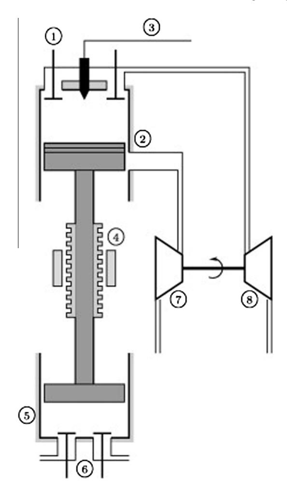

**Fig. 5.** A prototype of single-piston FPLE [13]. 1. Exhaust poppet valves. 2. Scavenging ports. 3. Common rail fuel injection. 4. Linear alternator. 5. Bounce chamber. 6. Bounce chamber pressure control valves. 7. Turbocharger compressor. 8. Turbocharger turbine.

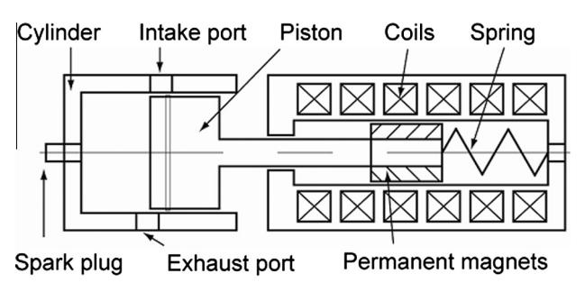

Fig. 6. A single-piston FPLE [20].

The various arrangements of magnets also differentiate various types of linear alternators, including moving-magnet, moving-iron, and moving-coil linear alternators [56], as shown in Fig. 12. The moving-magnet and moving-coil styles frequently have a lower moving mass than the moving-iron style [57]. The moving-coil linear alternator requires flexible leads, which tend to wear out, especially in high-power machines. Moreover, moving-coil linear alternators are unsuitable for any significant power generation [56]. The moving-magnet linear alternator has the lowest moving mass [57]; however, it contains the following drawbacks: large magnet leakage fields; exposure of permanent magnets to continuous vibration that could demagnetize them; constraints on power

conversion capabilities by the stroke length and the magnet length; thickness of the magnets as dictated by the air gap; and size of the magnets as limited by the mass of the moving member of the linear alternator [56].

# 3. Operating characteristics

#### 3.1. Piston dynamics

Piston dynamics are classified into two main modes: motoring and firing. The motoring mode of any internal combustion engine requires optimal compression pressure and piston speed. For a traditional internal combustion engine, the piston motion is controlled by a crankshaft to ensure the same piston TDC position in every cycle, and the starting system requires only optimal piston speed because the compression pressure is always fixed by the mechanical constraint between each piston and the crankshaft. Conversely, the piston motion in an FPLE is not restricted by a crankshaft but driven by a linear alternator that provides an induced current to make a thrust force, resulting in linear piston motion in motoring mode. Therefore, the piston motion does not follow a fixed displacement, and the TDC position of the piston varies, which means that the compression ratio of an FPLE also varies. During motoring mode, the FPLE not only ensures optimal piston speed for effective scavenging of the air/fuel mixture, but also obtains a sufficient compression pressure through an appropriate piston amplitude. Some research into starting FPLEs examined piston dynamics under various operating parameters such as induced current, and thrust force, as shown in Refs. [58–61]. Jia et al. [61] experimentally investigated the starting process of an FPLE under the effects of thrust force. They found that with higher thrust force, the achieved peak piston velocity and compression ratio were higher due to free motion of the piston in the cylinder, as shown in Figs. 13 and 14. Moreover, they indicated that the maximum velocity occurred at the middle stroke, where the thrust force was equal to the sum of compression gas force and friction force.

After starting in motoring mode, firing mode is turned on by activating the spark plugs in an SI engine or activating the injectors in a CI engine. In firing mode, piston dynamics are affected by many parameters related to each FPLE's operating and structural characteristics [53,62-66]. Li et al. [62] presented a parametric study of an FPLE under the effects of various intake pressures, moving masses, ignition positions, and resistance loads. They found that the maximum piston stroke could easily be changed by adjusting the ignition positions, moving masses, and resistance loads, as shown in Table 2. Thus, a high compression ratio was easily achieved. They also compared FPLE piston dynamics with those of a traditional internal combustion engine at the same stroke and piston frequency, as shown in Figs. 15 and 16. Curves 1 and 2 denote the piston dynamics of the FPLE and traditional internal combustion engine, respectively. Their simulation results showed that piston velocity and acceleration move more smoothly in a traditional internal combustion engine than in an FPLE. In contrast, the piston velocity in an FPLE changes greatly around TDC, forcing the acceleration to be much larger than in a traditional internal combustion engine. This has a benefit in reducing the heat transfer losses in the cylinder. Yuan et al. [63] presented a simulation study of a hydrogen fueled free-piston engine based on the combination of a zero-dimensional dynamic model and a multidimensional computational fluid dynamics model of the combustion process. Their simulation results also showed that piston velocity and acceleration move more smoothly in a traditional internal combustion engine than in an FPLE, whereas the acceleration of the FPLE was much larger than that of the traditional internal combustion engine because the piston velocity in the FPLE

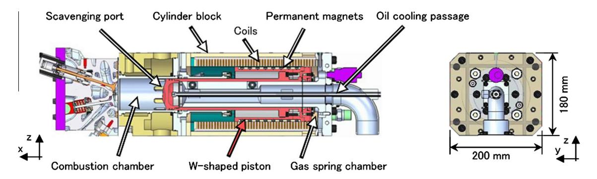

Fig. 7. Schematic diagram of a developed single-piston FPLE [40].

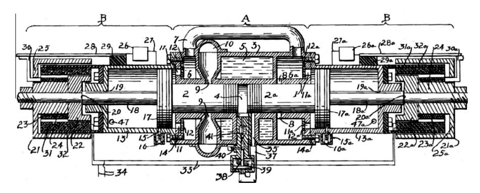

Fig. 8. An early version of opposed-piston FPLE [5].

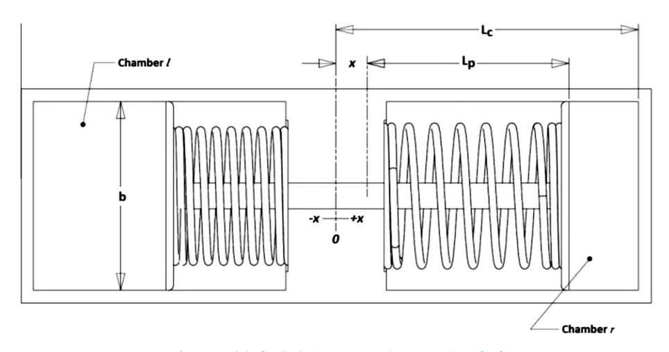

Fig. 9. Model of a dual-piston FPLE using two springs [18].

changed greatly around TDC, as shown in Figs. 17 and 18 [63]. The piston velocity and acceleration of the free-piston hydrogen engine were higher than those of the free-piston gasoline engine because of the different combustion performances with different fuels [63].

Lee et al. [53] experimentally investigated piston dynamics while changing the stiffness of a metal spring installed in each cylinder of the compressor in a two-stroke FPLE. They found that both piston velocity and displacement were easily increased by adjusting the spring stiffness, as shown in Fig. 19. The thrust force caused by the spring increased with the spring stiffness. Thus, spring stiffness has a significant influence in adjusting the compression ratio of an FPLE. This matches the results of Hung et al. [54].

#### 3.2. Combustion characteristics

#### 3.2.1. Spark ignition combustion

Similar to a traditional internal combustion engine, an SI FPLE uses spark plugs installed in the cylinder head to ignite the air/fuel mixture in the cylinder when generating power. To investigate the combustion characteristics of an SI FPLE, many studies have been conducted, including both simulations and experiments [44,53–55,67–72]. Mikalsen and Roskilly [67] compared the performance of an SI FPLE with that of a conventional engine using a computational fluid dynamics (CFD) simulation model. They showed that the FPLE obtained a slight efficiency advantage over the conventional engine at low speeds, but that the efficiency of the

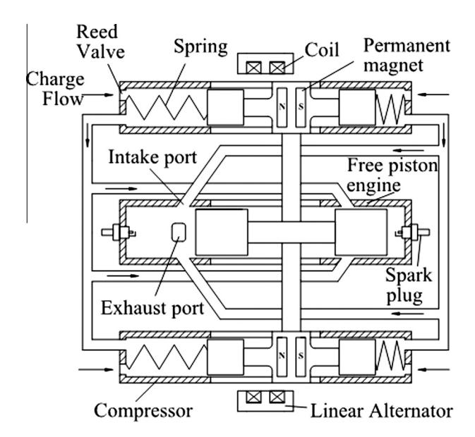

Fig. 10. Model of a dual-piston FPLE using four springs [22].

free-piston engine dropped as the speed increased because the effects of volume change during combustion were greater at higher speeds, as shown in Fig. 20. They also found that the free-piston engine had a slight benefit in NOx emissions when compared with the conventional engine, as shown in Fig. 21. Because the shorter time spent around TDC and the faster expansion in the freepiston engine influenced the NOx levels [67]. Yuan et al. [63] also showed a lower level of NO emissions in a free-piston hydrogen engine compared with a traditional hydrogen engine. Because the mean in-cylinder gas temperature of the free-piston hydrogen

Fig. 11. Linear alternator models (a) model of a tubular-type linear alternator and (b) cross-section of a flat-type linear alternator.

engine is lower than that of the traditional hydrogen engine, as shown in Fig. 22 [63].

> esting field for many institutes, universities and companies to investigate and develop; however, the lubricant system for those engines

has not yet drawn much interest

Table 1

| Kinds of basic FPLEs | Specifications                                                                                                                                                                                                                                                                                                                                                                                                                            | Brief history of the development of FPLEs                                                                                                                                                                                                                                                                                                                                                                                                                                                                                                                                                                                                                        |
|-------------------------|-------------------------------------------------------------------------------------------------------------------------------------------------------------------------------------------------------------------------------------------------------------------------------------------------------------------------------------------------------------------------------------------------------------------------------------------|------------------------------------------------------------------------------------------------------------------------------------------------------------------------------------------------------------------------------------------------------------------------------------------------------------------------------------------------------------------------------------------------------------------------------------------------------------------------------------------------------------------------------------------------------------------------------------------------------------------------------------------------------------------|
| Single-piston FPLEs  | <ul> <li>It includes a single-piston, cylinder, and rebound device</li> <li>The single-piston FPLE is mechanically simple with high controllability when compared to other FPLEs</li> <li>Dynamic balance is not good due to its one piston</li> </ul>                                                                                                                                                                                    | <ul> <li>An early version of the single-piston FPLE for electrical power generation was invented by Berlinger and Raab in 2000 [41]</li> <li>In 2007, Mikalsen et al. [13] proposed a prototype single-piston FPLE for electric power generation in large scale systems such as marine power plants</li> <li>Newer versions of single-piston FPLE were designed and developed by Kosaka et al. [40] in 2014, Feng et al. in 2015 [21] Cooling and lubricant problem for the single-piston FPLE was mentioned in the investigations conducted by Kosaka et al. [40]</li> </ul>                                                                                    |
| Opposed-piston FPLEs | <ul> <li>It consists of two single piston units with a single combustion chamber</li> <li>Its pistons are synchronized by mechanical linkages to eliminate mechanical vibration, which is not found on any other linear engines [46]</li> <li>A shared combustion chamber also reduces heat losses</li> <li>This engine is much larger than other FPLEs due to its mechanical synchronization</li> </ul>                                  | <ul> <li>The opposed-piston principle was used almost exclusively in the early free-piston engine designs (1930–1960) [38]</li> <li>An early version of opposed-piston FPLE was presented by Ostenberg in 1943 [5]</li> <li>Another version of opposed-piston FPLE was introduced in 1990 [42]</li> <li>Newer versions of opposed-piston FPLE were proposed and developed by Blarigan in 2002 [43], Huang in 2012 [44], Yan et al. [45] in 2015, and Johnson and Leick [30] in 2015. Johnson and Leick [30] developed cooling and lubricant systems for their opposed-piston FPLE, and investigated its potential for use in hybrid electric vehicles</li> </ul> |
| Dual-piston FPLEs       | <ul> <li>It consists of two combustion chamber and a dual-piston</li> <li>This engine eliminates the need for a rebound device, as the working piston provides the work to drive the compression process in the other cylinder, which allows a simple and more compact device with higher power to weight ratio [24]</li> <li>The control of piston motion is difficult</li> <li>It has high cycle-to-cycle variations [14,15]</li> </ul> | <ul> <li>An early version of dual-piston FPLE was introduced by Galitello in 1989 [47]</li> <li>A version of dual-piston FPLE with high compression ratios, short burn durations and homogeneous fuel/air mixtures in conjunction with low equivalence ratios was invented by Blarigan in 1998 [48]</li> <li>From 1998 to 2015, a great deal of research work on dual-piston FPLEs has been done by researchers around the world [14,19,22-24,26-28]. Since then, the dual-piston FPLEs are still being an inter-</li> </ul>                                                                                                                                     |

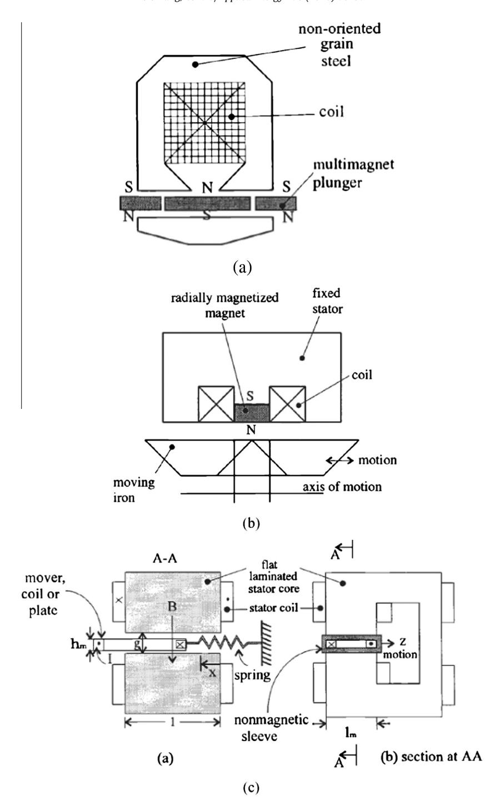

Fig. 12. Linear alternators [56] (a) a moving-magnet linear alternator, (b) a moving-iron linear alternator, and (c) a moving-coil linear alternator.

In SI combustion, spark timing is an important parameter that directly affects engine performance because it controls the start time of the combustion. In conventional crankshaft engines, spark timing is determined by the crank angle. An FPLE has no crankshaft or rotational motion; therefore, the spark timing in an FPLE is determined by the piston position in front of the cylinder head, where SI begins. Huang [44] used a numerical analysis, including thermodynamic and dynamic models, to simulate in-cylinder combustion pressure and the compression ratio in a two-stroke opposed-piston FPLE. Based on a time-based Wiebe function, he changed the ignition timing to investigate its effects on incylinder combustion pressure. His simulation results showed that

ignition advance resulted in a higher peak pressure in the cylinder, as shown in Fig. 23, because the peak heat release or peak acceleration moves with the ignition position [62]. Hung et al. [54] presented a simulation study of a two-stroke dual-piston FPLE based on the combination of three mathematical models including dynamic, thermodynamic and linear alternator models. They also used a time-based Wiebe function to simulate the combustion process under the effects of spark timing and found that the peak in-cylinder pressure increased when the spark timing was adjusted toward the cylinder head. An experimental study by Oh et al. [55] confirmed that it was easy to set an optimum in-cylinder combustion pressure for a two-stroke dual-piston FPLE by changing the

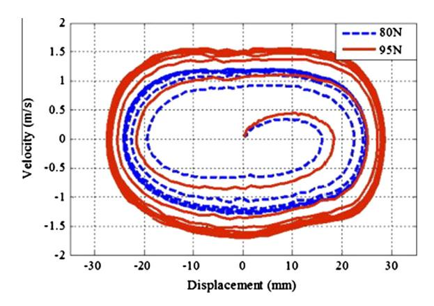

Fig. 13. Displacement and velocity [61].

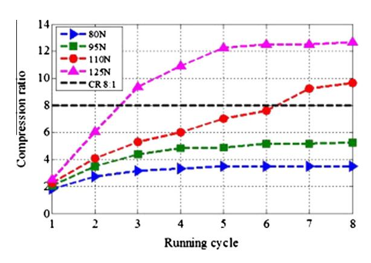

Fig. 14. Compression ratio at each running cycle [61].

**Table 2** Parametric study results [62].

|                                    | Parameter         |               |                              |                            |
|------------------------------------|-------------------|---------------|------------------------------|----------------------------|
|                                    | Intake pressure ↑ | Piston mass ↑ | Ignition position $\uparrow$ | Load ↑                     |
| Peak velocity Maximum stroke | ↑ ↑            | <b>↓</b>      | ↑ ↑                       | <u></u>                    |
| Frequency Peak pressure         | ↑ ↑            | <b>↓</b> ↑    | <b>↓</b> ↑                   | $\downarrow \\ \downarrow$ |

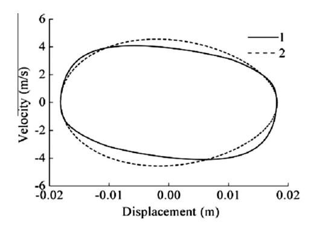

Fig. 15. Piston velocity versus displacement [62].

spark timing. In addition to the effects of spark timing, experimental studies have also found the effects of operating conditions, structural parameters, and kind of fuel on the combustion

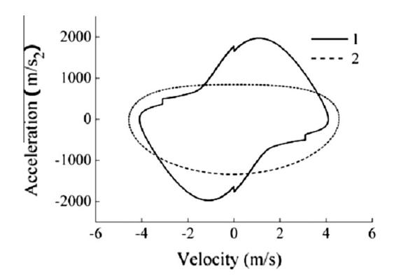

Fig. 16. Piston acceleration versus velocity [62].

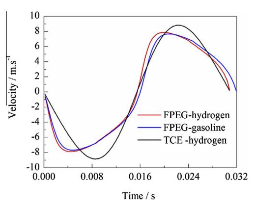

**Fig. 17.** Piston velocity profiles of the engines [63].

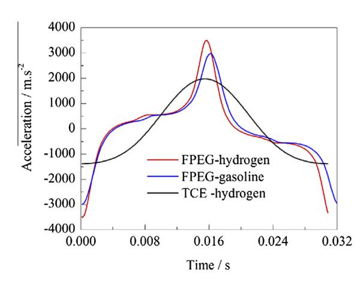

Fig. 18. Piston acceleration profiles of the engines [63].

characteristics of FPLEs [40,51,52]. Woo et al. [71] conducted an experiment on a dual-piston FPLE fueled with hydrogen and compressed natural gas (CNG). Their experimental results showed that the pressure increase was much higher in hydrogen combustion than in CNG combustion because of the high combustion speed of hydrogen, as shown in Fig. 24.

#### 3.2.2. Compression ignition combustion

CI in an internal combustion engine is a process in which the necessary high temperature is produced by compressing the air in the cylinder before the fuel is injected into the combustion chamber. For FPLEs, CI is generally investigated with diesel fuel [13,59,73–75]. Mao et al. [59] presented a simulation study of a

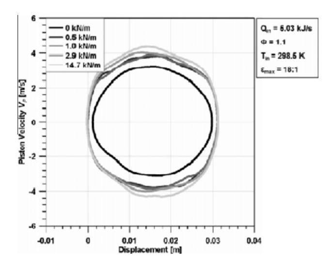

Fig. 19. The effects of spring stiffness on piston velocity and displacement [53].

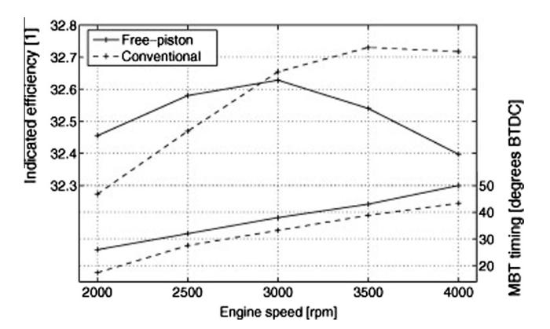

Fig. 20. Engine efficiency versus speed [67].

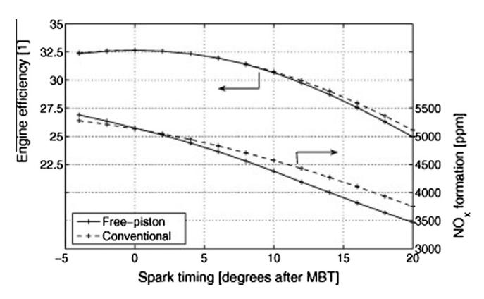

Fig. 21.  $NO_x$  emission versus spark timing [67].

free-piston diesel engine using a zero-dimensional numerical simulation combined with a CFD model (AVL-FIRE) to simulate the gas exchange and combustion processes. They used the two-stage Wiebe function to model the combustion process in time, one stage for premixed and one stage for diffusive combustion. They derived the ignition delay and combustion duration from the CFD calculation for diesel FPLE combustion. In another simulation study, Mikalsen and Roskilly [74] investigated the combustion process of a free-piston diesel engine using a CFD model (OpenFOAM) and compared the results with those from a conventional engine.

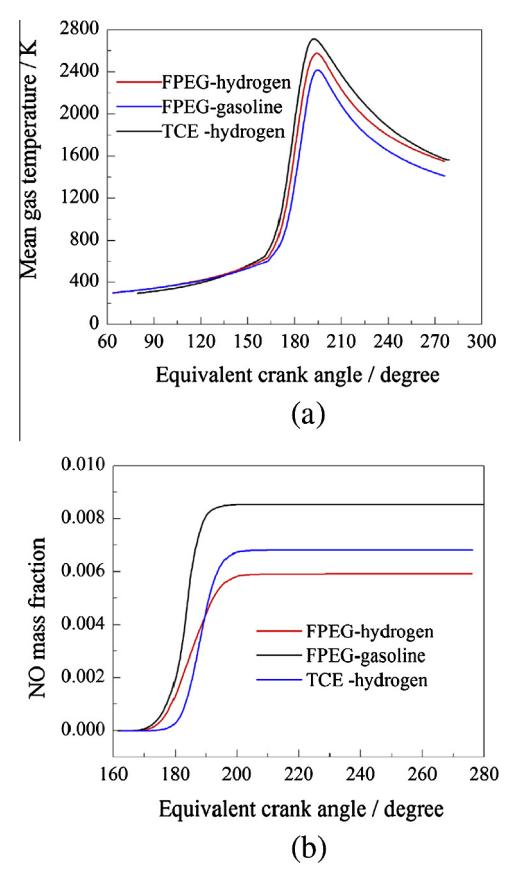

**Fig. 22.** Mean in-cylinder gas temperatures and NO concentrations of the engines [63], (a) mean in-cylinder gas temperatures and (b) NO concentrations.

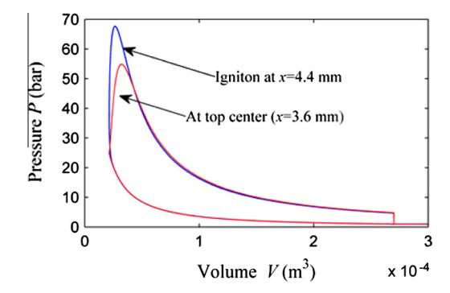

Fig. 23. P–V graph of different ignition timing [44].

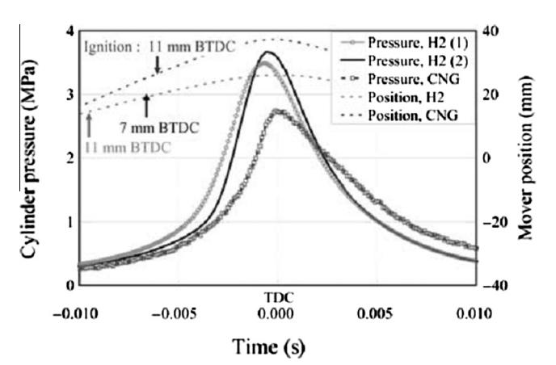

Fig. 24. Effects of ignition timing on cylinder pressure and mover position [71].

They found that the free-piston diesel engine had a higher heatrelease rate from the pre-mixed combustion phase because of an increased ignition delay, compared with the conventional engine. In another simulation study conducted by Mikalsen and Roskilly [13], they compared the simulation results of a two-stroke freepiston CI engine with those from a respective conventional CI engine. Therein, a single-zone model was used to simulate combustion, while in-cylinder heat transfer was modeled according to Hohenberg [76]. They found that the indicated efficiency of the free-piston engine was higher than that of the conventional engine because of reduced heat transfer losses and lower frictional losses, as shown in Fig. 25. Both peak gas temperature and temperature levels during expansion were lower in the free-piston engine, and that resulted in lower heat transfer losses. Yuan et al. [73] investigated the combustion characteristics of a free-piston diesel engine coupling with dynamic and scavenging models. Their coupled model shown in Fig. 26 used an empirical heat release model of the Wiebe function to calculate the piston motion profile based on the initial boundary conditions. They used a scavenging CFD model to calculate the gas exchange performances according to the calculated piston motion. They then imported the calculated scavenging results and piston motion into a combustion CFD

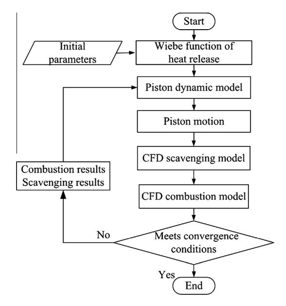

Fig. 26. Iteration simulation process for the couple model [73].

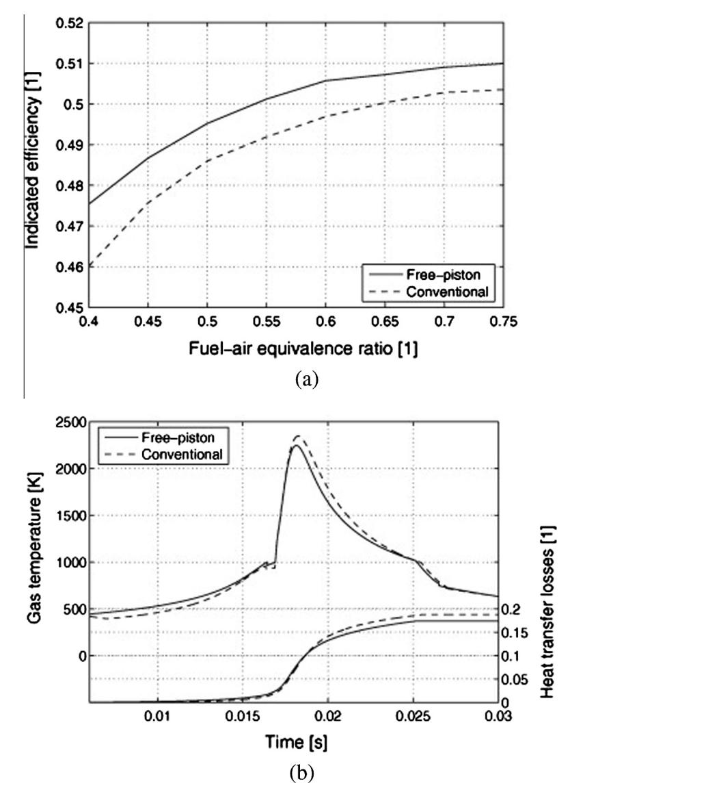

Fig. 25. Indicated efficiency, gas temperature and heat transfer losses of a diesel FPLE and a conventional engine [13], (a) efficiency of the free-piston engine compared to a conventional engine for varying loads and (b) in-cylinder gas temperature and heat transfer losses in free-piston and conventional engines.

model to calculate the combustion performances and fed those results with the gas exchange results back to the dynamic model to calculate the next iteration. Afterward, they reestablished the scavenging CFD model and calculated a new using the updated results from piston motion and combustion, repeating the procedure until they met the iterative convergence conditions. Their simulation results showed benefits for reducing temperature-dependent emissions  $(NO_x)$  because the in-cylinder average gas temperature of the free-piston engine was generally lower than that of the traditional engine, as shown in Fig. 27a and b [73]. This is also similar to the results obtained by Mikalsen and Roskilly [13]. However, Chenheng Yuan found that a free-piston engine had no advantage in particulate emissions when compared with a traditional crank engine, as shown in Fig. 27c [73]. Shoukry et al. [75]

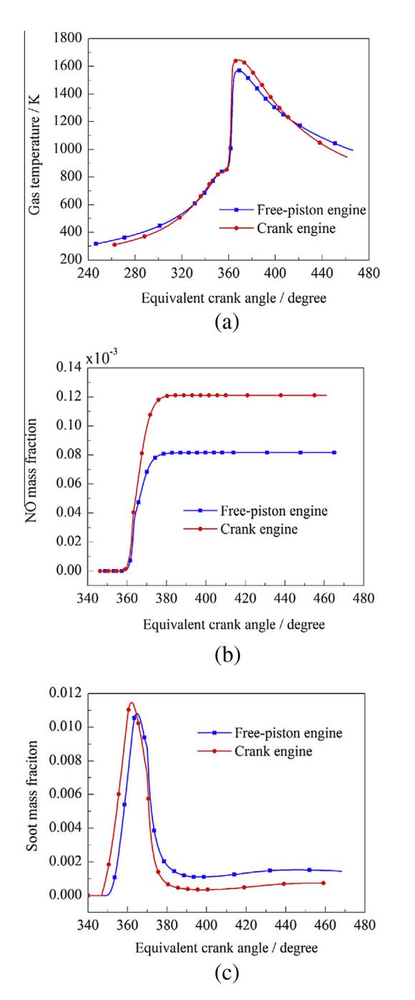

**Fig. 27.** Mean in-cylinder gas temperature, NO emissions and SOOT emissions [73], (a) mean in-cylinder gas temperature, (b) NO emissions, and (c) SOOT emissions.

presented a numerical simulation for a parametric study of a two-stroke direct-injection linear engine fueled with diesel. They investigated the effects of parameters such as load constant, reciprocating mass, injection timing, and combustion duration on the dynamic and combustion characteristics of an FPLE, defining injection timing as piston position before the maximum possible stroke. To simulate the combustion process, they used the Wiebe function converted to time and calculated the heat transfer based on the Woschni model [76]. Their simulation results showed that the increased reciprocating mass increased the piston stroke and peak in-cylinder combustion pressure by increasing the inertial force. The change of injection timing also contributed to increasing the peak in-cylinder combustion pressure, as shown in Fig. 28. Adjusting the injection timing closer to the maximum stroke led to higher in-cylinder combustion pressure because of moving the combustion event toward that of the ideal Otto case [75].

#### 3.2.3. HCCl combustion

As mentioned in the introduction, an FPLE can optimize the combustion process through variable compression ratios [13,14,22–24]. Variation of compression ratios in FPLEs allows them to operate with various kinds of fuels and HCCI combustion, which improve thermal efficiency and reduce temperature-dependent emissions [12]. Goldsborough and Blarigan [77] used

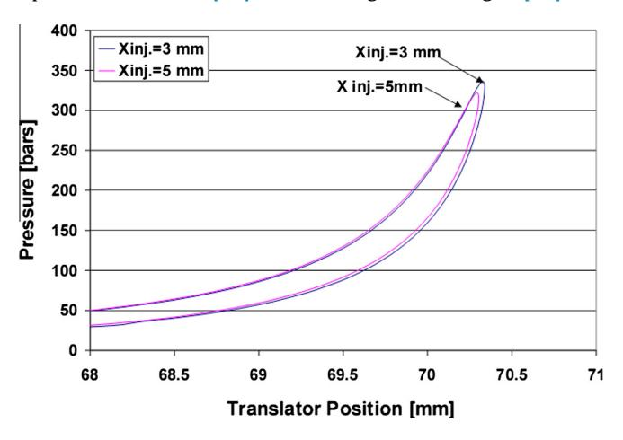

Fig. 28. Effect of varying the injection timing on pressure and piston position [75].

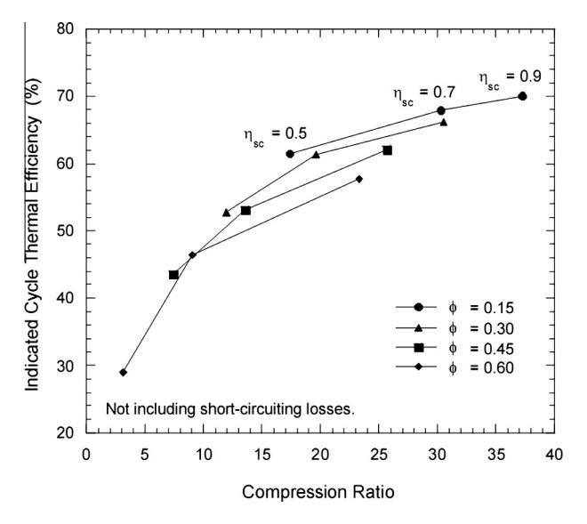

Fig. 29. Indicated cycle thermal efficiency versus compression ratio and equivalence ratio [77].

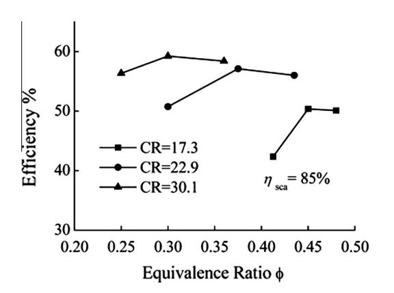

Fig. 30. Indicated thermal efficiency versus equivalence ratio and compression ratio [24].

**Table 3** Simulation results for different fuels [78].

| Case                     | Diesel | Hydrogen | Gasoline | Natural gas |
|--------------------------|--------|----------|----------|-------------|
| f (Hz)                   | 30.10  | 32.25    | 33.33    | 36.96       |
| $r_c$                    | 19.68  | 28.84    | 31.81    | 43.16       |
| P (kW)                   | 20.28  | 20.36    | 22.28    | 23.8        |
| $\eta_i$                 | 0.5413 | 0.5851   | 0.5761   | 0.5911      |
| L (mm)                   | 127.37 | 131.55   | 132.41   | 134.61      |
| $\phi$                   | 0.311  | 0.247    | 0.317    | 0.315       |
| RGF                      | 0.1170 | 0.1482   | 0.1567   | 0.2072      |
| $p_{\mathrm{max}}$ (bar) | 81.9   | 113      | 128.5    | 181         |
| $T_{\text{max}}(K)$      | 1710   | 1750     | 1800     | 1850        |
|                          |        |          |          |             |

a zero-dimensional thermodynamic model of a dual-piston FPLE to analyze steady-state operation of hydrogen-fueled HCCI at a high compression ratio ( $\sim$ 30:1) and low equivalence ratio ( $\phi$   $\sim$  0.35). The simulation results indicate a variable operating compression

ratio particularly dependent on equivalence ratio ( $\phi$ ), scavenging efficiency ( $\eta_{sc}$ ), and intake temperature. The engine's indicated cycle thermal efficiency increased with an increased operating compression ratio, as shown in Fig. 29 [77]. The increased compression ratio allowed the engine to operate with lower equivalence ratios. Furthermore, the authors showed that the engine's NOx emission levels were significantly lower than those of conventional internal combustion engines because very low equivalence ratio homogeneous-charge combustion was possible. Li et al. [24] used Matlab/Simulink, Chemkin, and the finite element method to compare the simulated performance of a two-stroke freepiston engine under HCCI combustion with that of a traditional engine. They found that the peak temperature is much lower than that of a traditional engine under the same conditions, which could reduce temperature-dependent emissions. In addition, they indicated that by changing the external load, the TDC of the engine could easily be changed. Using a lean mixture to acquire a higher compression ratio could also effectively improve the indicated thermal efficiency in the engine, as shown in Fig. 30. This is similar to the results shown in Fig. 29. Fredriksson and Denbratt et al. [78] presented a simulation study of a two-stroke FPLE using four kinds of fuel: diesel, hydrogen, gasoline, and natural gas. They used Matlab/Simulink, Boost, and Senkin to investigate engine performance under HCCI combustion and found that natural gas gave the highest compression ratio ( $r_c = 43.16$ ) and indicated efficiency  $(\eta_i = 0.5911)$  of the four fuels, as shown in Table 3. In [79], the authors used single-zone and multi-zone Chemkin models with detailed chemical kinetics and a sequential CFD/multi-zone method to analyze the combustion characteristics and performance of a two-stroke FPLE. They concluded that a higher scavenging temperature was needed to maintain the combustion phasing. As mentioned above, numerical models incorporating detailed thermo-kinetics [77,79] or reduced chemical mechanisms [78] showed the level of detail needed to accurately predict the overall process of HCCI combustion. However, that level of detail requires

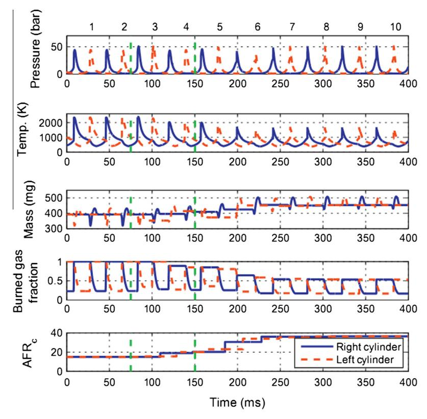

Fig. 31. Charge conditions in both cylinders during the transition from SI mode to HCCI mode through a transitional lean SI mode [82].

a large number of consecutive computations. To obtain successful HCCI combustion in an FPLE, a simplified model and cycle-tocycle coupling between piston motion and the combustion process need to be proposed. In control-oriented HCCI investigations, the single-Wiebe function can predict HCCI combustion [80-82]. One limitation of the single-Wiebe function is that it does not well predict combustion during the premix phase, as shown with a dieselfueled engine [80]. However, for gaseous engines (e.g., propanefueled engines), the single-Wiebe function seems to be the most useful option to fill the need in engine research for a simple combustion model with high computational efficiency. Shaver et al. [81] presented a simulation study of cycle-to-cycle dynamics and mode transition in a single-cylinder HCCI engine fueled with propane. They used the Wiebe function to predict SI and HCCI combustion and showed that it gave results similar to experimental data at different operating conditions. Chiang et al. [82] presented a simulation study of an SI/HCCI FPLE that used electric mechanical valves to provide the flexibility for almost instantaneous control of the valve timings during the transition from SI to HCCI combustion through a lean SI combustion mode. In other words, they controlled the opening and closing timings of the electric mechanical valves to control the scavenging process, which they considered important to obtaining successful HCCI combustion in a freepiston engine [77]. They also used the Wiebe function to predict SI and HCCI combustion. Their simulation results showed that the HCCI-FPLE achieved better efficiency and much lower peak temperature (and thus much lower NOx emissions) than the SI-FPLE, as shown in Fig. 31 [82]. Hung et al. [22] also used the Wiebe function to model SI and HCCI combustion. They found that successful HCCI combustion could be easily archived by adjusting the key parameters such as equivalence ratio, engine load, intake temperature, intake pressure, spark timing, and spring stiffness. Besides, the engine performance in HCCI combustion was higher than in SI combustion, while the in-cylinder peak temperature in HCCI combustion was much lower than that in SI combustion, which resulted in decreasing  $NO_x$  emissions [12]. Those results are similar to those presented by Chiang et al. [82]. Although many investigations have considered HCCI combustion in FPLEs, most of them used only simulations [22,24,77–82]. To further understand HCCI combustion under real conditions, experimental studies need to be conducted.

# 3.3. Power generating characteristics

As explained in the introduction, electrical power is generated by changing the flux in the windings of the linear alternator when the firing mode is activated. The electric power output of an FPLE depends on the designation of the linear alternator as well as on the operating and structural parameters of the engine [26.50.53. 55.68.72.83-85]. In a simulation study. Li et al. [26] investigated the electric power output of an FPLE under the effects of key parameters such as piston assembly mass and ignition timing. They found that the electric power output was easily optimized based on changes in those parameters. They found the optimized electric power (7.42 kW) at frequency of 39.4 Hz, corresponding to a piston assembly mass of 3.7 kg and spark timing of 2.5 mm, as shown in Fig. 32. Li et al. [50] presented a simulation study for generating electric power in an FPLE based on the effects of linear alternator design (tubular or flat) and external load. They found that the flat-type linear alternator had higher electric power and efficiency than the tubular-type linear alternator, as shown in Fig. 33. They also found that the electric power output increased significantly when they reduced the distance between the stator and rotor (air gap) and external load. Oh et al. [55] presented an experimental study of the generating power of a two-stroke FPLE using two flat-type linear alternators while experimentally changing parameters such as fuel input heat, equivalence ratio, spark timing delay, electrical resistance, and air gap length. They showed that the electric power of the FPLE increased significantly as the air

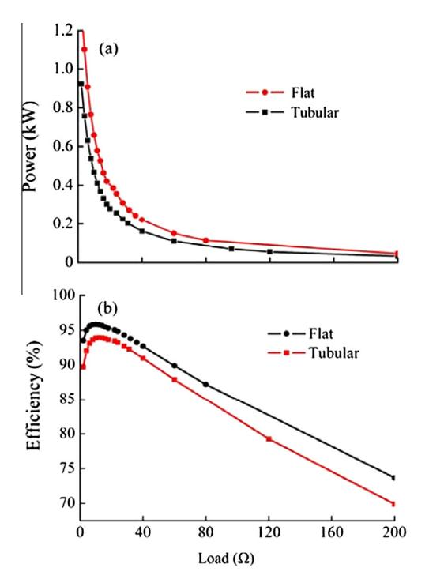

Fig. 33. Specific power (a) and efficiency (b) versus external load [50].

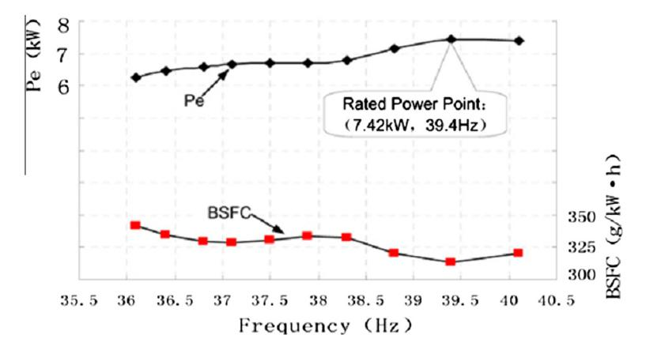

Fig. 32. Electric power of an FPLE [26].

Fig. 34. The effects of air gap length on power generation [55].

gap was reduced from 2 mm to 1 mm, as shown in Fig. 34. Their experimental results match those from a simulation study conducted by Li et al. [50]. As shown in Fig. 34, the maximum generating power was 111.3 W under the following operating conditions: equivalence ratio of 1.0, spark timing delay of 1.5 ms, electrical resistance of 30  $\Omega$ , and air gap length of 1.0 mm. A simulation study by Caresana et al. [83] examined the electric power generation of a two-stroke FPLE while changing parameters such as equivalence ratio, load constant, stroke/bore ratio, and translating mass. They found that the electric power output was considerably affected by those parameters.

#### 4. Experimental systems and applications of FPLE

#### 4.1. Experimental FPLE systems

In this section, we review some typical experimental system for FPLEs, including single-piston, opposed-piston, and dual-piston FPLEs. Researchers have conducted some experimental investigations for single-piston FPLEs using two-stroke and four-stroke

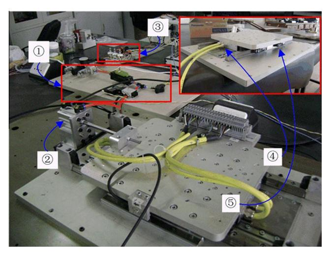

**Fig. 35.** Single piston FPLE [21]: 1. Gas intake system. 2. Gas intake cavity. 3. Load resistance. 4. Linear motor. 5. Linear alternator.

cycles [21,31,86]. Feng et al. [21] presented an experimental system to measure the electricity generating characteristics of a two-stroke single-piston FPLE, including a gas intake system, a gas intake cavity, load resistance, a linear motor, and a linear alternator, as shown in Fig. 35. The authors indicated that the electricity generating characteristics significantly influenced stable operation because piston movement resulted from the comprehensive action of different forces, such as combustion gas pressure, electromagnetic resistance, and linear motor force. Therefore, they replaced the engine cylinder with a gas intake cavity. This differs from previous studies of single-piston FPLEs, which used a combustion chamber [31,86]. The operating principle of this experimental system is that the gas pressure in the intake cavity acts on the mover, and then the mover rebounds to compress the gas in the cavity under the force of the linear motor. As a result, the reciprocating motion of the mover produces the electric power output of the linear alternator. A connection diagram of the whole system is shown in Fig. 36, in which the position signal from the encoder in the linear generator is gathered by an NI signal acquisition system. Also, the gas supply valve is controlled by a signal from the processing system.

Johnson and Leick [30] conducted a typical experimental investigation of opposed-piston FPLEs. Their experimental system included an opposed-piston FPLE with a water-cooled combustion cylinder, two tubular-type linear alternators, a lubrication oil distribution system to deliver lubricating oil to the combustion

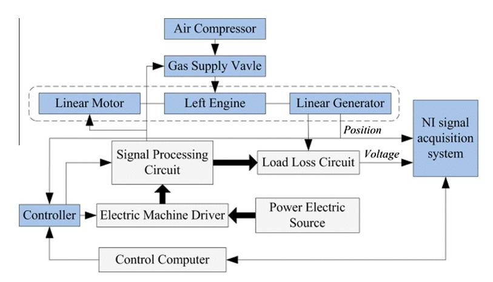

Fig. 36. Connection diagram of experimental system using a single-piston FPLE [21].

chamber and each bounce chamber through small ports in the cylinder walls, and a hydrogen supply system to the combustion chamber, as shown in Fig. 37. They used a Fastar FS5000HP variable inductor displacement sensor to measure piston position, and measured combustion chamber pressure with two redundant Kistler 6052CU20 piezoelectric transducers with a 300 bar measuring range conditioned with Kistler 5010 charge amplifiers. They measured the bounce chamber pressures with Kistler 6123 piezoelectric transducers with a 250 bar measuring range conditioned with Kistler 5004 charge amplifiers. Intake air and fuel flow rate were measured by a 15–250 scfm Omega FTB-939 turbine

flowmeter and a Sierra Instruments Smart-Trak2 Model 100 thermal mass flow meter, respectively. To measure combustion chamber intake and exhaust temperatures, they used type K thermocouples, and to measure electrical current output from the linear alternators, they used a LEM HAL 100-S instantaneous output Hall effect current transducer with ±300 A. They used a gas analyzer and a Baldwin sample conditioning system to measure the exhaust emissions of the opposed-piston FPLE, as shown in Fig. 38.

Many experimental dual-piston FPLEs have been presented in previous studies [53,55,61,68,71,72,84]. Jia et al. [61] presented

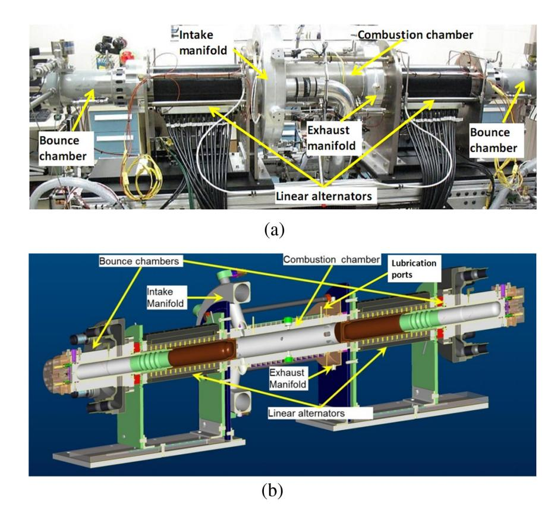

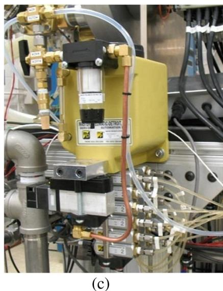

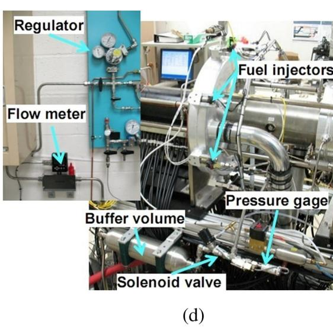

Fig. 37. Experimental system of an opposed-piston FPLE [30], (a) opposed-piston FPLE prototype, (b) cross-section of the opposed-piston FPLE, (c) lubrication oil distribution system, and (d) hydrogen supply system to the combustion chamber.

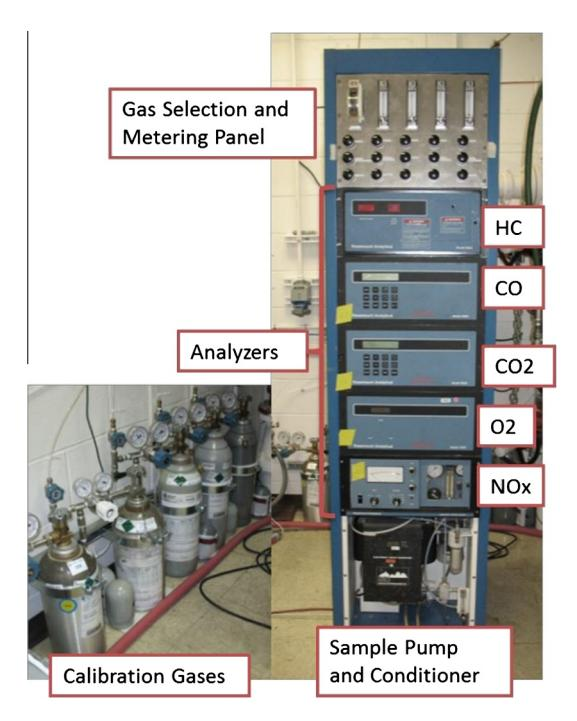

Fig. 38. Exhaust gas analysis system [30].

an experimental investigation of the starting process of a dual piston FPLE under the effects of motoring force. Their experimental system contained a two-stroke SI dual-piston FPLE using the

uniflow scavenging method, as shown in Fig. 39a. The control system of the FPLE is shown in Fig. 39b. They used a linear encoder integrated in the linear electric machine to measure piston displacement and velocity. They also installed two Kistler pressure transducers (6052 with charge amplifier 5064) in the cylinder heads on both sides to measure the in-cylinder gas pressure. To get high-speed data, they used a National Instrument PXI data acquisition (DAQ) system card (PXIe-6358) and an in-housemade LabView Real Time program. Oh et al. [55] presented an experimental investigation to examine the combustion and electrical generating characteristics of a two-stroke SI dual-piston FPLE assembled with flat-type linear alternators. Their experimental system consisted of a two-stroke SI dual-piston FPLE; an engine controller to receive, process signals and control; a displacement sensor to measure piston position; two photo sensors to detect ignition positions; an electric load device; and a DAQ system, as shown in Fig. 40. In particular, they used two compressors assembled with the dual-piston FPLE to increase intake pressure. That differs from the experimental system shown by Jia et al. [61]. In their experimental system, Oh et al. [55] measured the piston position using an optical displacement sensor (KAIS Co.; KL3A-N1), and detected the ignition signal caused by the piston movement using a photo interrupter sensor (Sharp; GP1S092HCPIF). The digital signals generated from the photo interrupter sensor were delivered to the engine controller to control spark timing through the ignition coils (Dynatek; ARC-2). To measure the incylinder pressure in the front and rear combustion chambers, they used pressure sensors (Kistler; 6052C) combined with charge amplifiers (Kistler; 5018A). All of the data obtained were saved as a text file through the DAQ board and LabView program. Woo

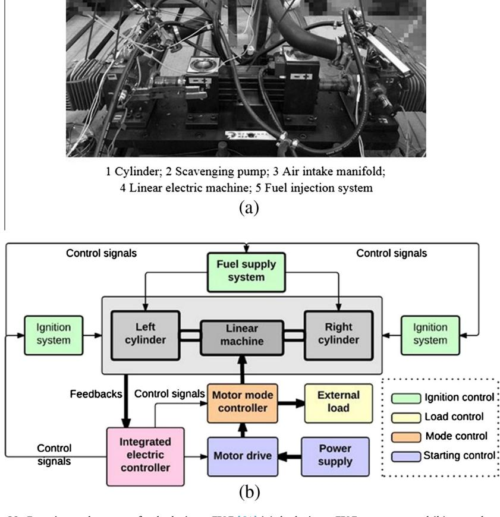

Fig. 39. Experimental system of a dual-piston FPLE [61] (a) dual-piston FPLE prototype and (b) control system.

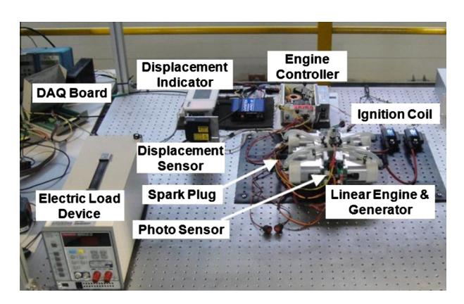

Fig. 40. Experimental dual-piston FPLE [55].

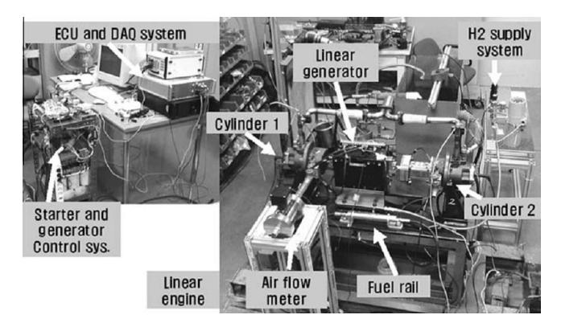

Fig. 41. Experimental dual-piston FPLE [71].

et al. [71] presented an experimental investigation to evaluate the combustion characteristics of a two-stroke SI dual-piston FPLE fueled with hydrogen and CNG. Their experimental system is shown in Fig. 41 and included a dual-piston FPLE, a hydrogen supply system, an air flow meter, a starter and generator control system, and a DAQ system.

#### 4.2. Applications of FPLE

FPLEs are used to convert chemical energy stored in fuel into electrical energy [39]. They have been investigated and developed by scientists and researchers around the world. The high efficiency of a linear alternator combined with the simple structures of a free-piston engine are prompting researchers to further develop FPLEs for hybrid electric vehicles (HEVs). A group of authors from General Motors and West Virginia University [85] provided an integrated design methodology to select a free-piston engine and linear alternator combination for use as an HEV auxiliary power unit. They developed integrated models of the engine and linear alternator and simulated the electric power output while varying system parameters. They also presented an optimization method for selecting the design that best met output voltage and power requirements. Goertz and Peng [87] reviewed feasible hybrid powertrain concepts, evaluating them based on additional weight, power per size, fuel efficiency, reliability, local emissions, production costs, comfort, safety, and development risk. They found that a free-piston engine coupled with a linear alternator and battery was the most promising candidate for a high-efficiency hybrid vehicle. In a simulation study, Huang [44] developed an opposed-piston FPLE for an HEV. The simulation results showed that the newly designed FPLE was feasible and could obtain a 15 kW average electric power output with a generating efficiency of 42.5%. Carter and

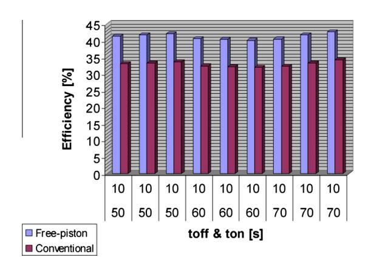

Fig. 42. System efficiency of free-piston and conventional engines [89].

**Table 4** Fuel consumption results [90].

| Vehicle                              | Strategy                                | Liters/10 km            |
|--------------------------------------|-----------------------------------------|-------------------------|
| Diesel generator vehicle             | Load following                          | 0.510                   |
| Free-piston energy converter vehicle | Load following ECMS Linear optim. | 0.473 0.414 0.385 |

Wechner [88] designed an FPLE to meet the highest levels of fuel efficiency and exhaust emissions performance in a compact size for use in HEVs. Their FPLE was a combination of a free-piston engine and an integral generator and included an integral compressor and a passive intake valve in the head of the piston, which eliminated common FPLE problems such as piston ring wear and the need for an external compressor, and allowed a significant increase in power density. Cosic et al. [89] compared the total efficiency of a 12-ton truck HEV using a conventional combustion engine and an FPLE. They found that replacing a conventional combustion engine with an FPLE increased the total efficiency of the system by 25%, as shown in Fig. 42. Hansson et al. [90] investigated the performance gain achieved by using an FPLE in a medium-sized HEV, compared with a conventional diesel-generator, and found a potential decrease in fuel consumption of up to 19% when using the equivalent consumption minimization strategy (ECMS), as shown in Table 4 [90]. A group of researchers at Toyota Central R&D Labs Inc. is developing a prototype 10 kW FPLE for electric drive vehicles with a thin and compact design, high efficiency, and high fuel flexibility [40,86]. This prototype includes a twostroke combustion chamber, a linear alternator, and a gas spring chamber. Its main feature is a stepped piston shape that Toyota calls a "W-shape" that has advantages such as decreased heat loss from the gas spring chamber, a hollow structure to ensure piston cooling, improved generating efficiency because of a small clearance between the magnet and the coil, and a heated magnet to prevent degaussing.

#### 5. Conclusion

In this paper, we have reviewed and summarized the literature on FPLEs with varied designs and operating features. For piston stroke type, two-stroke FPLEs are most-commonly investigated and developed because of their advantages in structure and control. Published results show that dual-piston FPLEs have a higher power/weight ratio than other piston arrangements. However, the combustion process occurs alternately in each cylinder in a dual-piston engine, which leads to varied combustion pressure at each cylinder and engine cycle. Meanwhile, single-piston FPLEs

have a simple design with higher controllability than the other FPLEs: however, the dynamic balance is not good because they have only one piston. Unlike single-piston FPLEs, a perfectly balanced design is the main advantage of opposed-piston FPLEs, but those designs make engines complicated. Besides description of various piston types, we also described different linear alternator designs for FPLEs. Namely, we classified linear alternators into three main groups, including linear alternator shapes (flat-type and tubular-type linear alternators), phase structure (singlephase and three-phase linear alternators), and arrangements of magnets (moving-magnet, moving-iron, and moving-coil linear alternators). In a simulation study, flat-type linear alternator is considered to be better than tubular one in efficiency, specific power, output voltage and current; however it needs to be further examined by both simulation and experiment. For phase structure, much research has shown that three-phase linear alternators are appropriate for high-power FPLEs, whereas single-phase linear alternators are suitable for small power FPLEs.

In addition to the designed features, we classified FPLEs by their operating characteristics, such as piston dynamics, combustion, and electric power generation characteristics. For piston dynamics, FPLEs decrease heat transfer loss in the cylinder by increasing piston acceleration, compared with conventional engines. The implementation of springs in FPLEs shows benefits for increasing piston velocity and engine performance. In addition to benefit of piston dynamics, published results show that the thermal efficiency of FPLEs is higher than that of conventional engines. Furthermore, the simulation results of FPLEs show benefits for reducing temperature-dependent emissions ( $NO_x$ ) because the incylinder gas temperature of FPLEs is generally lower than that of conventional engines.

The variable compression ratio in FPLEs is a great benefit for combustion. By changing the compression ratio, FPLEs can optimize the combustion process and operate with various kinds of fuels and HCCI combustion. To obtain successful HCCI combustion in a free-piston engine, simulation studies have utilized the transition from SI to HCCI combustion. Published results show that the engine performance in HCCI combustion is higher than in SI combustion, while the in-cylinder peak temperature in HCCI combustion is much lower than that in SI combustion, which results in decreasing  $NO_x$  emissions.

A free-piston engine can not only be operated as a conventional internal combustion engine. It can also be integrated with a linear alternator to generate electric power. The electric power can be optimized by adjusting parameters such as piston assembly mass, ignition timing, equivalence ratio, electrical resistance, and air gap. Much research has shown that a linear alternator with a high-efficiency power source is an excellent power-unit candidate for HEVs. With the potential offered by high-efficiency linear alternators in FPLEs, we expect integrated systems to be further developed and applied in the near future.

## Acknowledgement

This work was supported by the 2016 Research Fund of University of Ulsan, South Korea.

### References

- [1] Wakabayashi R, Takiguchi M, Shimada T, Mizuno Y, Yamauchi T. The effects of crank ratio and crankshaft offset on piston friction losses. SAE paper 2003-01-088: 2003
- [2] Pescara RP. Motor compressor apparatus. US patent no. 1,657,641; 1928.
- [3] Farmer HO. Free piston compressor engines. Proc Inst Mech Eng 1947;156:253-71.
- [4] Pescara RP. Motor compressor of the free piston type. US patent no. 2,241,957; 1941.
- [5] Ostenberg P. Electric generator. US patent 2362151 A; 1944.

- [6] Hew WP, Jamaludin J, Tadjuddin M, Nor KM. Fabrication and testing of a linear electric generator for use with a free-piston engine. In: National power and energy conference proceeding.
- [7] Wang J, West M, Howe D, Parra H, Arshad W. Design and experimental verification of a linear permanent magnet generator for a free-piston energy converter. IEEE Trans Energy Convers 2007;22:2.
- [8] Li W, Chau KT. A linear magnetic-geared free-piston generator for rangeextended electric vehicles. Asian Electric Vehicles 2010;8:1.
- [9] Ding H, Yu X, Li J. Permanent magnetic model design and characteristic analysis of the short-stroke free piston alternator. SAE Int J Fuels Lubr 2012. 2012-01-1610.
- [10] Xu Z, Chang S. Improved moving coil electric machine for internal combustion linear generator. IEEE Trans Energy Convers 2010;25:2.
- [11] Fazal I, Karsiti MN, Zulkifli SA, Ibrahim T, Rao KS. Modeling and simulation of a moving-coil linear generator. In: International conference on intelligent and advanced system.
- [12] Sherazi HI, Li Y. Homogeneous charge compression ignition engine: a technical review. In: Proceedings of the 17th international conference on automation & computing
- [13] Mikalsen R, Roskilly AP. The design and simulation of a two-stroke free-piston compression ignition engine for electrical power generation. Appl Therm Eng 2008;28:589–600.
- [14] Nguyen Ba H, Lim O, lida N. Simulation study of SI-HCCI transition in a twostroke free piston engine fuelled with propane. SAE paper 2014-01-1104.
- [15] Mikalsen R, Jones E, Roskilly AP. Predictive piston motion control in a freepiston internal combustion engine. Appl Energy 2010;87:1722–8.
- [16] Mikalsen R, Roskilly AP. The control of a free-piston engine generator. Part 1: fundamental analysis. Appl Energy 2010;87:1273–80.
- [17] Mikalsen R, Roskilly AP. The control of a free-piston engine generator. Part 2: engine dynamics and piston motion control. Appl Energy 2010;87:1281-7.
- [18] Robinson MC, Clark N. Fundamental analysis of spring-varied, free piston Otto engine device. SAE Int | Eng 2014. 2014-01-1099.
- [19] Kim J, Bae C, Kim G. Simulation on the effect of the combustion parameters on the piston dynamics and engine performance using the Wiebe function in a free piston engine. Appl Energy 2013;107:446–55.
- [20] Tian CL, Feng HH, Zuo ZX. Oscillation characteristic of single free piston engine generator. Adv Mater Res 2011;383–390:1873–8.
- [21] Feng HH, Song Y, Zuo ZX, Shang J, Wang YD, Roskilly AP. Stable operation and electricity generating characteristics of a single-cylinder free piston engine linear generator: simulation and experiments. Energies 2015:8:765–85.
- [22] Hung NB, Lim O, Iida N. The effects of key parameters on the transition from SI combustion to HCCI combustion in a two-stroke free piston linear engine. Appl Energy 2015;137:385–401.
- [23] Chiang CJ, Yang JL, Lan SY, Shei TW, Chiang WS, Chen BL. Dynamic modeling of SI/HCCI free-piston engine generators. In: 6th IEEE conference on industrial electronics and applications.
- [24] Li QF, Xiao J, Huang Z. Simulation of a two-stroke free-piston engine for electrical power generation. Energy Fuel 2008:22:3443-9.
- [25] Lin J, Xu Z, Chang S, Yin N, Yan H. Thermodynamic simulation and prototype testing of a four-stroke free-piston engine. J Eng Gas Turbines Power 2014;136:1–8.
- [26] Li L, Luan Y, Wang Z, Deng J, Wu Z. Simulations of key design parameters and performance optimization for a free-piston engine. SAE paper 2010-01-1105; 2010.
- [27] Prados MA. Towards a linear engine PhD thesis. Stanford University; 2002.
- [28] Clark NN, Nandkumar S, Famouri P. Fundamental analysis of a linear twocylinder internal combustion engine. SAE paper 982692; 1998.
- [29] Mikalsen R, Roskilly AP. The fuel efficiency and exhaust gas emissions of a low heat rejection free-piston diesel engine. Proc IMech Part A: J Power Energy 2009:223:379–84.
- [30] Johnson TA, Leick MT. Experimental evaluation of the free piston engine-linear alternator (FPLA), Sandia report no. SAND2015-2095. Albuquerque, United States: Sandia National Laboratories; 2015.
- [31] Xu Z, Chang S. Prototype testing and analysis of a novel internal combustion linear generator integrated power system. Appl Energy 2010;87:1342–8.
- [32] Jia B, Smallbone A, Zuo Z, Feng H, Roskilly AP. Design and simulation of a twoor four-stroke free-piston engine generator for range extender applications. Energy Convers Manage 2016;111:289–98.
- [33] Goldsborough SS, Blarigan PV. Optimizing the scavenging system for a twostroke cycle, free piston engine for high efficiency and low emissions: a computational approach. SAE paper 2003-01-0001; 2003.
- [34] Bergman M, Fredriksson J, Golovitchev V. CFD-based optimization of a dieselfueled free piston engine prototype for conventional and HCCl combustion. SAE paper 2008-01-2423; 2008.
- [35] Fredriksson J, Bergman M, Golovitchev V, Denbratt. Modeling the effect of injection schedule change on free piston engine operation. SAE paper 2006-01-0449: 2006.
- [36] Bergman M, Golovitchev V. CFD modeling of a two-stroke free piston energy converter using detailed chemistry. SAE paper 2005-24-074; 2005.
- [37] Xia H, Pang Y, Grimble. Hybrid modeling and control of a free-piston energy converter. In: Proceedings of the 2006 IEEE international conference on control applications.
- [38] Mikalsen R, Roskilly AP. A review of free-piston engine history and application. Appl Therm Eng 2007;27:2339–52.
- [39] Nagy CT, Clark NN. The linear engine in 2004. SAE paper 2005-01-2140; 2005.

- [40] Kosaka H, Akita T, Moriya K, Goto S, Hotta Y, Umeno T, et al. Development of free piston engine linear generator system part 1 – investigation of fundamental characteristics. SAE paper 2014-01-1203; 2014.
- [41] Berlinger WG, Raab FJ. Free piston engine with electrical power output. US patent no. 6541875 B1; April 1, 2003.
- [42] Kos J. Free-piston engine without compressor. US patent no. 4,924,956; May 15, 1990.
- [43] Blarigan PV. Advanced internal combustion electrical generator. In: Proceedings of the 2001 DOE hydrogen program review. p. 1–16.
- [44] Huang L. An opposed-piston free-piston linear generator development for HEV. SAE paper 2012-01-1021; 2012.
- [45] Yan H, Wang D, Xu Z. Design and simulation of opposed-piston four-stroke free-piston linear generator. SAE paper 2015-01-1277; 2015.
- [46] Washko FM, Winchell RA. Free piston combustion engine design analysis and challenges. SAE paper 2015-32-0768; 2015.
- [47] Galitello KA. Two stroke cycle engine. US patent no. 4876991 A; October 31, 1989.
- [48] Blarigan PV. Free-piston engine. US patent no. 6199519 B1; March 13, 2001.
- [49] Rinderknecht F. The linear generator as integral component of an energy converter for electric vehicles. In: European all-wheel drive congress, Graz.
- [50] Li QF, Xiao J, Huang Z. Flat-type permanent magnet linear alternator: a suitable device for a free piston linear alternator. J Zhejiang Univ Sci A 2009;10: 345–52.
- [51] Boldea I, Nasar SA. Permanent-magnet linear alternators part 1: fundamental equations. IEEE Trans Aerosp Electron Syst 1987;AES-23:73–8.
- [52] Hong SK, Choi HY, Lim JW, Lim HJ, Jung HK. Analysis of tubular-type linear generator for free-piston engine. In: International conference on renewable energies and power quality.
- [53] Lee J, Lim O, Kim G. An experimental study on the effects of spring stiffness on the combustion and dynamic characteristics of a linear engine. J Mech Sci Technol 2014;28:1945–50.
- [54] Hung NB, Lim O. A study of a two-stroke free piston linear engine using numerical analysis. J Mech Sci Technol 2014;28:1545–57.
- [55] Oh Y, Lim O. A study for generating power on operating parameters of powerpack utilizing linear engine. SAE paper 2012-32-0061; 2012.
- [56] Boldea I, Nasar S. Linear electric actuators and generators. IEEE Trans Energy Convers 1999;14:712–7.
- [57] Bagg SD. Linear alternator technologies used for free piston Stirling engines. Nuclear and emerging technologies for space 2012.
- [58] Zulkifli SA, Karsiti MN, Aziz AR. Starting of a free-piston linear enginegenerator by mechanical resonance and rectangular current commutation. In: IEEE vehicle power and propulsion conference.
- [59] Mao J, Zuo Z, Feng H. Parameters coupling designation of diesel free-piston linear alternator. Appl Energy 2011;88:4577–89.
- [60] Jia B, Zuo Z, Feng H, Tian G, Roskilly AP. Investigation of the starting process of free-piston engine generator by mechanical resonance. In: Internal conference on applied energy.
- [61] Jia B, Tian G, Feng H, Zuo Z, Roskilly AP. An experimental investigation into the starting process of free-piston engine generator. Appl Energy 2015;157: 798–804.
- [62] Li QF, Xiao J, Huang Z. Parametric study of a free piston linear alternator. Int J Automotive Technol 2010;11:111–7.
- [63] Yuan C, Xu J, He Y. Performance characteristics analysis of a hydrogen fueled free-piston engine generator. Int J Hydrogen Energy 2016;41:3259-71.
   [64] Xiao J, Li O, Huang Z, Motion characteristic of a free piston linear engine. Appl
- [64] Xiao J, Li Q, Huang Z. Motion characteristic of a free piston linear engine. Appl Energy 2010;87:1288–94.
- [65] Song Y, Feng H, Zuo Z, Wang M, Guo C. Comparison research on different injection control strategy of CI free piston linear generator in one-time starting process. In: The 6th international conference on applied energy.
- [66] Abidin E, Ibrahim A, Aziz A, Zulkifli S. Investigation of starting behavior of a free-piston linear generator. J Appl Sci 2012;12:2592-7.

- [67] Mikalsen R, Roskilly AP. Performance simulation of a spark ignited free-piston engine generator. Appl Therm Eng 2008;28:1726–33.
- [68] Lim O, Hung NB, Oh S, Kim G, Song H, Iida N. A study of operating parameters on the linear spark ignition engine. Appl Energy 2015;160:746–60.
- [69] Jia B, Zuo Z, Tian G, Feng H, Roskilly AP. Development and validation of a freepiston engine generator numerical model. Energy Convers Manage 2015;91:333–41.
- [70] Jia B, Smallbone A, Feng H, Tian G, Zuo Z, Roskilly AP. A fast response freepiston engine generator numerical model for control applications. Appl Energy 2016:162:321–9.
- [71] Woo Y, Lee YJ, Lee YG. The performance characteristics of a hydrogen-fuelled free piston internal combustion engine and linear generator system. Int J Low-Carbon Technol 2009;4:36–41.
- [72] Kim J, Bae C. The effects of spark timing and equivalence ratio on sparkignition linear engine operation with liquefied petroleum gas. SAE paper 2012-01-0424: 2012
- [73] Yuan C, Feng H, He Y, Xu J. Combustion characteristics analysis of a free-piston engine generator coupling with dynamic and scavenging. Energy 2016;102:637–49.
- [74] Mikalsen R, Roskilly AP. A computation study of free-piston diesel engine combustion. Appl Energy 2009;86:1136–43.
- [75] Shoukry E, Taylor S, Clark N. Numerical simulation for parametric study of a two-stroke direct injection linear engine. SAE paper 2002-01-1739; 2002.
- [76] Heywood JB. Internal combustion engine fundamentals. New York, USA: McGraw-Hill Book Company; 1998.
- [77] Goldsborough SS, Blarigan PV. A numerical study of a free piston IC engine operating on homogeneous charge compression ignition combustion. SAE paper 1999-01-0619: 1999.
- [78] Fredriksson J, Denbratt I. Simulation of a two-stroke free piston engine. SAE paper 2004-01-1871: 2004.
- [79] Xu S, Wang Y, Zhu T, Tao C. Numerical analysis of two-stroke free piston engine operating on HCCI combustion. Appl Energy 2011;88:3712–25.
- [80] Ghojel J. Review of the development and applications of the Wiebe function: a tribute to the contribution of Ivan Wiebe to engine research. Int J Engine Res 2010:11:297–312.
- [81] Shaver GM, Roelle MJ, Gerdes JC. Modeling cycle-to-cycle dynamics and mode transition in HCCI engines with variable valve actuation. Control Eng Pract 2006;14:213–22.
- [82] Chiang C, Yang J, Lan S, Shei T, Chiang W, Chen B. Dynamic modeling of a SI/ HCCI free-piston engine generator with electric mechanical valves. Appl Energy 2013;102:336–46.
- [83] Caresana F, Comodi G, Pelagalli L. Design approach for a two-stroke free piston engine for electric power generation. SAE paper 2004-32-0037; 2004.
- [84] Lim O, Hung NB, Iida N. Power generation study of a power pack based on operating parameters of the linear engine fuelled with propane. Energy Proc 2014;61:1581–4.
- [85] Cawthorne W, Famouri P, Clark N. Integrated design of linear alternator/engine system for HEV auxiliary power unit. In: Electric machines and drives conference.
- [86] Goto S, Moriya K, Kosaka H, Akita T, Hotta Y, Umeno T, et al. Development of free piston engine linear generator system part 2 – investigation of control system for generator. SAE paper 2014-01-1193; 2014.
- [87] Goertz M, Peng L. Free piston engine its application and optimization. SAE paper 2000-01-0996; 2000.
- [88] Carter D, Wechner E. The free piston power pack: sustainable power for hybrid electric vehicles. SAE paper 2003-01-3277; 2003.
- [89] Cosic A, Lindback J, Arshad WM, Leksell M, Thelin P, Nordlund E. Application of a free-piston generator in a series hybrid vehicle. In: Proceedings of the 4th international symposium on linear drives for industry applications.
- [90] Hansson J, Leksell M. Performance of a series hybrid electric vehicle with a free-piston energy converter. In: Vehicle power and propulsion conference.