ELSEVIER

Contents lists available at ScienceDirect

# **Applied Thermal Engineering**

journal homepage: www.elsevier.com/locate/apthermeng

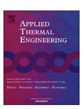

# Recent commercial free-piston engine developments for automotive applications

M. Razali Hanipah a, b, \*, R. Mikalsen A, A.P. Roskilly

- a Sir Joseph Swan Centre for Energy Research, Newcastle University, Newcastle upon Tyne NE1 7RU, United Kingdom
- b Faculty of Mechanical Engineering, Universiti Malaysia Pahang, 26600 Pekan, Pahang, Malaysia

#### HIGHLIGHTS

- Recent patents on FPE by major automotive companies are reviewed.
- Innovative solutions in these patents are highlighted.
- Key challenges in FPEG technology are identified.

#### ARTICLE INFO

Article history: Received 10 March 2014 Accepted 14 September 2014 Available online 5 October 2014

Keywords:
Free-piston engine
Linear generator
Hybrid electric vehicle
Patent

#### ABSTRACT

Free-piston engines have been under extensive investigation in recent years, however have not yet seen commercial success in modern applications. This paper reviews some of the recently reported commercial developments in free-piston engine systems particularly aimed for use in hybrid electric vehicle powertrains and discuss these in light of published research. By looking at recent publications, and in particular patent documents, from major industrial players, insight into the less widely reported commercial research efforts on free-piston engines is obtained. Further, these publications provide a useful indication as to what these developers see as the main technical challenges for this technology.

© 2014 Elsevier Ltd. All rights reserved.

## 1. Introduction

Free-piston engines provide a promising alternative to conventional engines in applications such as hybrid electric vehicles or hydraulically driven off-highway vehicles [1–3]. Such engines were in commercial use in the mid-20th century as gas generators and air compressors, generally showing advantageous properties [1]. In recent years, free-piston engines have been under development by a number of groups worldwide, both within academia and industry. One of the key drivers of these research efforts is arguably the potential of free-piston engines to provide a compact and efficient power generator for hybrid electric vehicles.

As an electrical power generator, the free-piston engine has several potential advantages over conventional crankshaft engines: It is mechanically simple and has a compact design due to the integrated generator and single moving component. On the other

E-mail address: mohdrazali@ump.edu.my (M.R. Hanipah).

hand, the crankshaft generators have crankshaft mechanisms, flywheels and mechanical couplings. The absence of a crankshaft will reduce the frictional losses significantly since there is no piston slapping resulting from the rotary to linear motion conversion and by reducing the amount of moving components, which means less contact friction in the system. Moreover, this 'crank-less' operation produces a faster expansion stroke, which reduces the in-cylinder heat transfer loss [4]. Further, a variable compression ratio can be realised for load demand control which can enable the free-piston engine to operate at its optimum cyclic speed range for maximum performance. These advantages can produce efficient prime movers with reduced emissions for the hybrid electric vehicle applications [5–8].

There is significant academic interest in the free-piston engine concept, and a number of groups reported research on various aspects around this technology; see e.g. Mikalsen and Roskilly [1] for an overview. Examples of very recent university-based free-piston engine research include work on hydraulic [9–11] and electric [12–15] free-piston engines by groups at Beijing Institute of Technology, work from National Taiwan University of Science and Technology [16], Shanghai Jiao Tong University [17], Tianjin University [18], Korea Advanced Institute of Science and Technology

\* Corresponding author. Faculty of Mechanical Engineering, Universiti Malaysia Pahang, 26600 Pekan, Pahang, Malaysia.

[19], Stanford University [20], Nanjing University [21], Universiti Teknologi PETRONAS [22,23] and Newcastle University [4,24–30].

Reports of on-going commercial free-piston engine developments are however rarer, although it is known that many large automotive players have been involved in such research (e.g. the involvement of Volvo in the EU-funded *Free Piston Energy Converter* project and that of Lotus Engineering in the *Zero Constraint Free Piston Energy Converter* project, funded by UK's Engineering and Physical Sciences Research Council (EPSRC)). One reason for the scarce amount of reported commercial free-piston engine research may be the different objectives between academic and commercial research groups; academic researchers would naturally seek to disseminate their findings more widely whereas commercial players tend to protect details of their commercial intellectual property by secrecy or by patent applications.

This paper aims to identify and review some recent developments in free-piston engine systems particularly aimed for hybrid electric vehicle powertrains. The analysis draws to a large extent on published patent information from major commercial players. This allows us to identify those free-piston engine concepts that are likely to be closest to the commercial stage. Moreover, the patent documents are likely to deal with those aspects that represent the biggest technical challenges for the free-piston engine concept, hence this material may give an indication of what these developers see as the key problems to solve for this technology to become commercially viable.

## 2. Free-piston engine recent developments

The findings presented here are based on a review focussing on recent patents and patent applications by key automotive players dealing with free-piston engine (FPE) technology. Notably, the recent interest on this technology is almost exclusively on hydraulic pump and electrical generator free-piston engines for automotive applications, as opposed to air compressor and gas generator applications, which were the focus of early developments [1].

The data material for this review was identified through patent searches done in IPC class F02B71 and using keywords. Top patent applicants were then identified based on the search results and some direct searches for known company names were also carried out within that data set. Using this strategy, we are able to catch FPE patentees broadly, eliminating any error based on legal entity

names, as well as identifying directly some commercial players known to have taken part in free-piston engine research projects.

#### 2.1. General Motors

Recent patent applications from General Motors [31,32] described opposed piston concepts operating on a two-stroke cycle in a configuration as shown in Fig. 1.

Notably, this concept is very similar to first-generation freepiston compressors and gas generators [1] such as the Sigma GS-34 gas generator illustrated in Fig. 2, but differs in that no mechanical synchronization mechanism is foreseen. Electric power output is achieved by an integrated electric machine, with the permanent magnets being incorporated in the pistons and the coil windings integrated in the cylinder housing.

Where the first-generation free-piston engines used mechanical synchronisation, this solution by GM aims to use the bounce chambers and electrical braking to synchronise and control both pistons [31]. The embedded permanent magnet piston is ensured to be at optimum temperature by having an air jacket from the scavenging chamber around the piston. The stroke can be controlled through electrical braking as well as the bounce chamber pressure control.

The absence of a flywheel has been reported as one of the main problems during the starting and the operation of a free-piston engine generator by various researchers for the dual-piston type free-piston design [1,21,22,36]. The reason for this is the direct influence the combustion in one cylinder will have on the motion profile for the next cycle and thereby the compression process in the other cylinder. Thus, variations in the compression ratio may be produced during operation, which can lead to unstable operation or even misfire.

The patent application by Holmes [37] presents a concept to solve this issue through an 'electrical flywheel'. In the system shown in Fig. 3, a linear machine (free-piston engine) is electrically connected via two sets of coils to a rotary machine (middle) and a battery source via a converter. In addition, a variable-speed motor may be mechanically connected via a gear box to the rotary machine as well as electrically connected to the whole system via two sets of coils as described in the patent.

The piston is made of ferromagnetic material. The operating principle of this system can be described as follows (for the first combustion chamber event). During starting, the battery supplies a

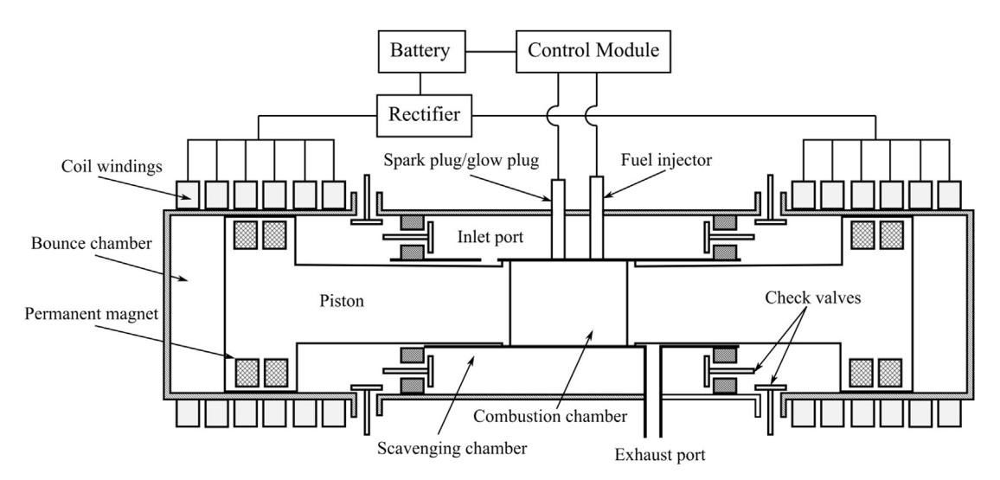

Fig. 1. Opposed piston type free piston linear alternator (FPLA) [31,32].

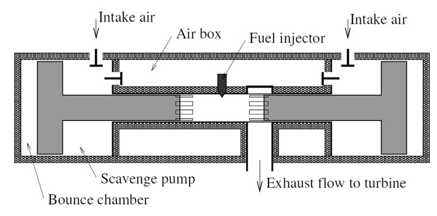

Fig. 2. Schematic of Sigma GS-34 free-piston gas generator [1] (see also London and Oppenheim [33], Flynn [34], and Huber [35]).

starting current  $(I_s)$  which reciprocates the piston and rotates the rotary machine to produce sufficient inertial energy for several cycles. When sufficient conditions in cylinder one are achieved, the fuel is injected and ignited for combustion. Upon combustion, the supplied current is switched off while the piston motion towards the second cylinder induces a first current  $(I_1)$  in the first coil. Throughout the stroke,  $I_1$  will continue to operate the rotary machine whose rotational inertia will induce a second current  $(I_2)$  in the fourth coil. The second current is used for proper positioning of the piston in the second combustion chamber via the second coil. Then, when a second combustion event occurs, this will induce the generator current  $(I_g)$  for the cyclic operation. This current will be used for charging the batteries and driving the external loads.

Through this configuration, the two machines (i.e. the linear and rotary machines) will seek to operate synchronously, hence in the case that the free-piston engine is lagging behind or advancing, the rotating inertia of the rotating machine will produce a braking or accelerating force through the coils. This can then reduce or balance out cycle-to-cycle variations in order to achieve a stable operation as well as prevent misfires. Hence, in principle, this device can function as an 'electrical flywheel', which is otherwise absent in the free piston engine generator.

Although this patent application depicts a dual combustion chamber type free-piston engine while the later patents [31,32] described previously, illustrate opposed piston type, this method can in principle be used for any type of free-piston engine.

### 2.2. Toyota

Toyota Central Research has published a number of patent applications very recently relating to free-piston engine systems. Ref. [38] describes several design variations of a single piston unit with a gas-filled bounce chamber. The use of a bounce chamber with pressure regulation is a well-known option to aid piston motion control; this was studied by e.g. Johansen et al. [39,40] and Mikalsen and Roskilly [24,28–30]. Compared to a dual piston system, in which the return stroke is driven directly by the opposite combustion cylinder, a bounce chamber is less prone to cycle-to-cycle variations, and provides some flexibility in that the stiffness of the gas spring can be regulated by controlling the amount of gas trapped. This is also verified by recent research from the German Aerospace Centre (DLR), who claimed that the gas spring configuration had been chosen since it would be easier to implement piston motion control [41].

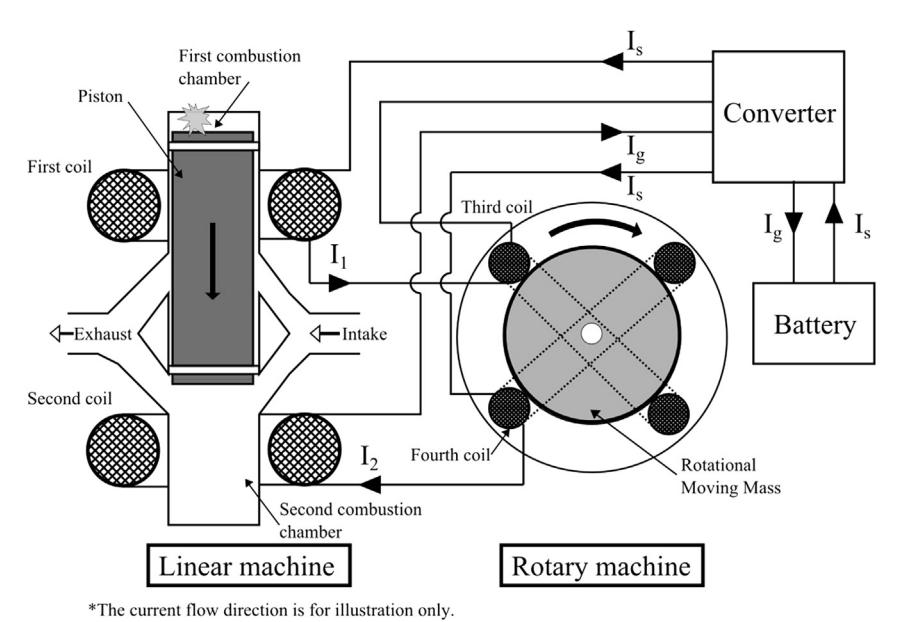

Fig. 3. Operation of the electrical flywheel system (omitting the variable-speed motor) [37].

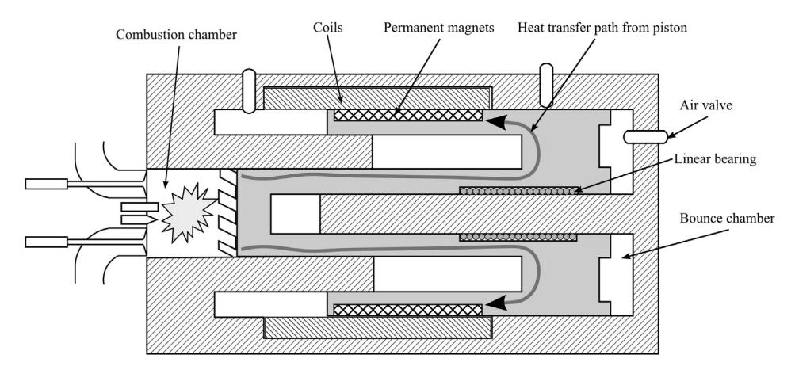

Fig. 4. Specially designed piston to dissipate heat quickly while reducing the temperature rise on the permanent magnets and coils [38].

A further patent application [38] proposes several designs to reduce heat transfer rate from the piston to the permanent magnets (to avoid magnet demagnetization and coils overheating). Special ceramic coating such as Zirconia has been proposed in another Toyota patent [42]. However, for a reliable and durable operation, a more efficient method for heat dissipation is required; one of such is depicted in Fig. 4. In this invention, the path for the heat flux to travel from the top of the piston to the permanent magnets and coils is longer and the surface area of the piston exposed to compressed air is larger. Thus, the final temperature increase on the permanent magnet assembly can be reduced significantly. This is a proven concept which has also been implemented in other applications, such as spark plug technology [43].

In another patent, the engine cooling is provided by holes on the piston for compressed air to flow in and out through corresponding holes on the cylinder as well as having a water jacket on the cylinder for efficient power generation [42].

Yoshihiro et al. [44] describes a system where two single piston with bounce chamber units operate in opposed phases (though not with a common combustion or bounce chamber, so it is not a 'true' opposed piston FPE) as shown in Fig. 5. In this configuration the pistons synchronisations are realised via electrical braking and bounce chamber pressure regulation.

Hidemasa et al. [45] describes a method for controlling a freepiston engine in order to maintain the piston speed around topdead-centre (TDC) within an appropriate range to secure good ignition for high efficiency. It is found that around TDC, the piston velocity during compression stroke is slower than the velocity during the expansion stroke. This asymmetric nature piston velocity of free-piston engines with single combustion chamber design is well known and has been described by Achten [3], Mikalsen et al. [30], and also observed by Seppo Tikkanen et al. [46] and Blarigan et al. [47]. This patent describes a control strategy to utilize the generator to increase the residence time at TDC, in order to improve ignitability of the air—fuel mixtures.

Yuichi et al. [48] illustrates a starting method for a dual-piston type direct-injection spark-ignition (DISI) FPE, utilising combustion energy to avoid having an oversized motor-generator. In this method, fuel is injected into the cylinder when the piston is within start-up range with the in-cylinder pressure at atmospheric. This start-up range is found to be 1/3 of the maximum stroke for the design specified in the patent, which uses inlet ports. The characteristic curves shown in Fig. 6 are mapped for this starting method which is based on 86 mm stroke and 86 mm bore cylinder.

The theoretical energy produced by combustion at various piston position during starting is shown by  $J_a$ , while this energy is used to overcome losses via cooling (arrow 1), combustion deterioration (arrow 2), leakage through piston rings (arrow 3) and frictional losses (arrow 4). The net energy is used as work against compression of the opposite cylinder which is depicted by  $J_b$ . According to Fig. 6,  $J_b$  is only positive from 20 to 50 mm of piston position, thus compression of the cylinder charge is possible within this range. Outside this range, there is not enough energy to move the piston.

In this proposed embodiment, the linear generator is operated as a motor to move the piston into the start-up range during starting but not as the starting device. This method will reduce the size of the motor-generator needed as the force required during starting is significantly larger.

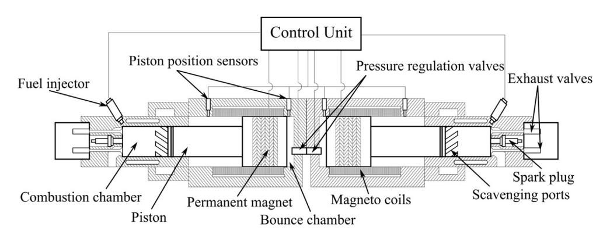

**Fig. 5.** Twin single piston system with back to back configuration [44].

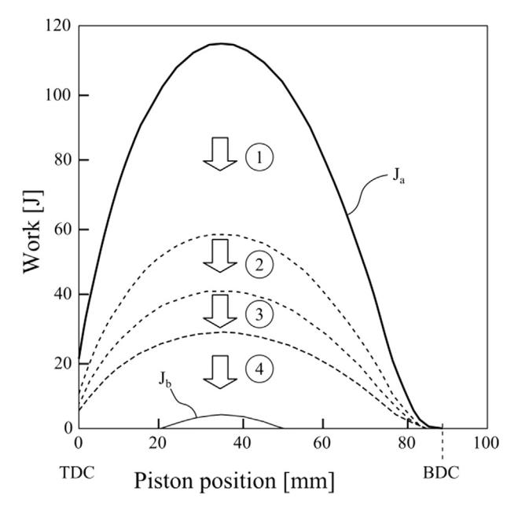

**Fig. 6.** The characteristic curves of a free-piston engine gross work produced from combustion,  $J_a$  and the resulting work,  $J_b$  at various piston position [48].

In all of the patents by Toyota [38,42,44,45,48], only single piston and dual-piston type designs have been considered. The opposed design depicted in Ref. [48] is practically a single piston with common bounce chamber configurations. In summary, the patents from Toyota have dealt with wide range of reported challenges on free-piston engine technology.

## 2.3. Volvo

Volvo Technology Corporation was involved in a European Commission funded project on free-piston engine technology together with the Royal Institute of Technology (KTH), ABB and Chalmers University. This collaboration resulted in a number of academic publications from the institutions involved, notably the reports from Arshad [49], Hansson [50], Fredriksson and Denbratt [51] and Bergman [52] as well as patent applications by Volvo Technology Corporation [53] and ABB [54].

In one patent by Lindgärde [53], a method of controlling a dualpiston type free-piston engine generator by an electromagnetic force exerted onto a moving mass is described. The free-piston engine design is shown in Fig. 7 and is a dual piston type configuration, which according to the patent is sensitive to disturbances. The reason given is that the combustion properties of the two cylinders are strongly coupled, thus any variation in one cylinder pressure will affect the other.

This type of dual-piston FPE has been studied by a significant number of other research groups, such as those from West Virginia University [55,56], Sandia National Laboratories [47,57], Czech Technical University [58,59], Universiti Teknologi PETRONAS [22,23], Shanghai Jiao Tong University [60] and Beijing Institute of Technology [13,14]. This configuration is clearly attractive due to its potential of achieving high power-to-weight ratio, having a simpler design with a minimum number of components by utilising the opposite combustion chamber as the rebound device.

Due to potential problems that can arise from the coupling of the cylinders, the patent suggested a decoupling strategy by force control [53]. The proposed control algorithm involves prediction of the electromagnetic force needed to meet the predetermined motion profile of the piston based on monitoring of the kinetic energy (or velocity) along the stroke. The whole control algorithm can be explained according to the illustration shown in Fig. 8.

At position  $x_0$ , the kinetic energy (or velocity) and cylinder pressure are measured during motion from negative displacement towards positive displacement. According to the desired motion profile, a target kinetic energy,  $E_{k-ref}$ , at a position near the end of the stroke,  $x_3$ , will be the main reference for the controller. The controller will predict the required electromagnetic force to meet the preset  $E_{k-ref}$  thus adjusting the electrical current to the linear motor accordingly. These steps are repeated at  $x_1$  and  $x_2$  then restarted for the motion from positive to negative displacement.

Reported research has also shown that predictive techniques such as this may improve the operational stability of free-piston engines quite significantly [30]. As has been noted by numerous authors, it is essential that the piston can be controlled upon combustion to meet the required trajectory for sustainable operation. The electrical nature of the free-piston generator configuration has enabled precise positioning of the piston using the motor, so the piston control can mitigate issues such as misfire and combustion variation. However, a correct sizing of the motor is equally important as the combustion pressure may render the control algorithm useless if the combustion force generated is more dominant than the braking capability of the motor, as it has been observed by Němeček and Vysoký [36] who found that the braking force by the motor is insufficient to absorb the combustion energy in their experiments.

Patent EP 1540155B1 [61] describes methods of starting and operating a free-piston energy converter with smaller energy storage. The block diagram of the system is shown in Fig. 9. It is claimed that reciprocation of the piston during starting is not needed as the capacitor can provide sufficient energy for starting in a single stroke even at low temperature condition.

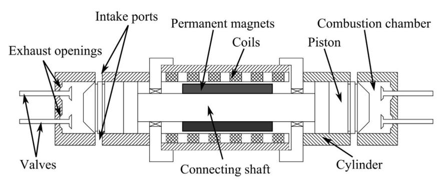

Fig. 7. Dual piston type free-piston engine generator [53].

Fig. 8. Simulation curves for the velocity servo controller motion control [53].

## 2.4. Ford

A high number of patents exist from Ford Global Tech. from the period of 2004–2006 on free-piston engines for hydraulic pump applications [62–70]. All of these early patents focus on hydraulic free-piston engines as it was claimed that "...linear generators are not particularly efficient at producing power—especially when compared to conventional rotary generators" [65]. However, it is mentioned in the patents that the hydraulic pump can be replaced by an air compressor or a linear generator [63,64,66–69].

Fig. 10 shows the simplified diagram of the invention called opposed-piston, opposed-cylinder (OPOC), which consist of two sets of pistons, inner and outer, coupled together via mechanical and hydraulic links. The operation of the engine can be described as follows: After combustion occurs in the first cylinder, the inner and outer pistons will move away from each other. The resulting inner pull rod motion will compress the hydraulic fluid which then expands the outer pull rods. The hydraulic chambers in the pump block are precisely designed such that the movement of the inner rod will result in a similar displacement of the outer rods. Thus, the

power and exhaust stroke in the first cylinder produces intake and compression stroke in the opposite cylinder. This cyclic engine operation will pump the fluid from low-pressure reservoir into high-pressure reservoir thus storing the work output of the engine in the form of pressurised fluid.

The Ford design is unlike the previously reported free-piston engines in that the inner pistons operation is similar to a dual-piston type free-piston engine while each cylinder is an opposed piston FPE which is synchronised and balanced hydraulically. The use of a hydraulic circuit for piston motion control and balancing of free-piston engines has been reported by some authors; for example, Hibi and Ito [71] explored an opposed piston hydraulic free-piston engine and discussed aspects of piston synchronisation. Also, the single piston hydraulic FPE by Innas [72] use hydraulics to achieve powerful engine control. Innas have also proposed this system for use in hydraulic hybrid vehicles (the "Hydrid") [73].

The starting strategy is described in patent US 6966280 B1 [67] and this is done in three main stages using the hydraulic pump block as the actuator. The first stage involved air induction into the first cylinder and the second cylinder in sequence. The second stage is the cyclic reciprocation of the pistons while trapping the cylinder charge by making sure that the stroke is sufficient and not to expose the intake and exhaust ports. In this way, the cylinder will behave as a mechanical spring to assist the reciprocation. During this process, both inner and outer pistons are reciprocated at a frequency similar to or close to the natural frequency of the system. The aim is to increase the compression pressure sufficiently before fuel is injected into the chamber. In the final stage, the first combustion process is initiated by a spark plug, followed by the second cylinder and both cylinders continue to operate cyclically. When both cylinders have achieved maximum cylinder pressure required for compression ignition, the spark plug is disabled and the engine will operate in HCCI mode.

The key principle of this starting method is to exploit the resonance property of the FPE with this configuration. The mechanical resonance method has been investigated in a spark ignition dual-piston type FPE by operating the integrated linear generator as the motor and with relatively low current injection the full stroke is achieved [22]. A similar strategy has been reported for starting a diesel FPE linear alternator [14].

In addition, the Ford patents cover a wide range of components and subsystems for the OPOC design including a stopper to prevent over-stroke [62], a position sensor for calibration, position and

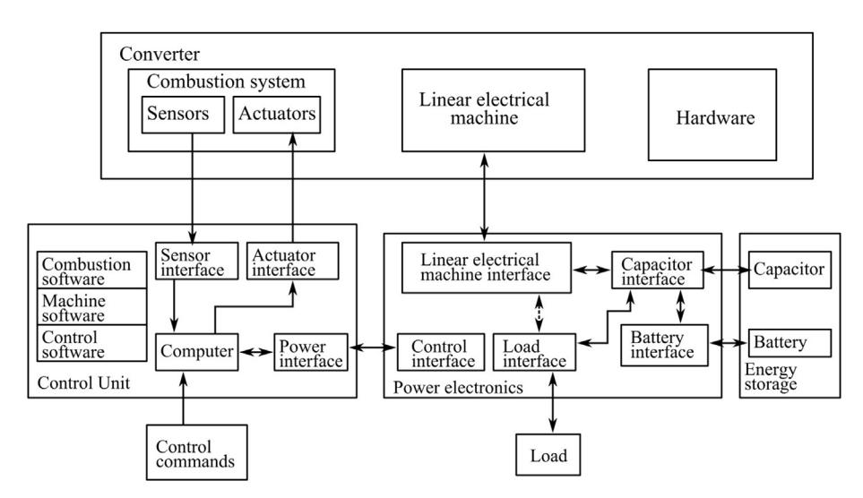

Fig. 9. Schematic of the main components and power path for the free-piston energy converter.

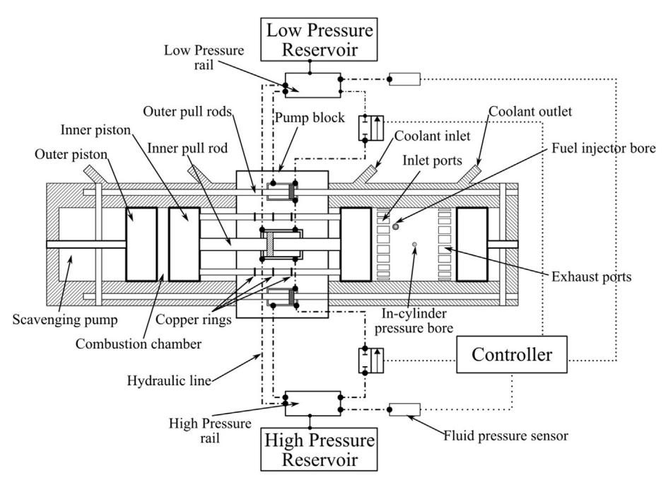

Fig. 10. Simplified diagram of the free-piston hydraulic pump by Ford [62–70].

velocity sensing [64], piston lubrication via oil misting [68], sodium piston cooling [69], the use of exhaust gas recirculation [63], and hydraulic synchronisation [70].

## 2.5. Honda

A single comprehensive patent application by Honda [74] described a four-stroke spark ignition single cylinder free-piston engine generator with a mechanical spring, shown in Fig. 11. The power stroke provides the kinetic energy which is partially stored as potential energy in the mechanical spring to be exploited during the exhaust and compression strokes respectively [74]. The induction process is not explained but could be achieved with the assistance from the linear motor.

Four-stroke cycle free-piston engines have not been widely reported in the literature, as the standard configurations of the FPE

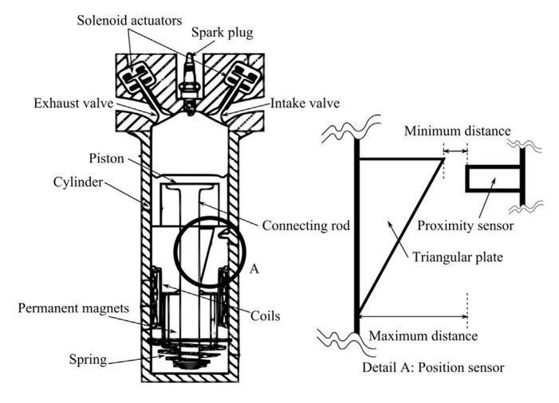

Fig. 11. Single cylinder four-stroke cycle free-piston engine generator concept by Honda [74].

are restricted to the two-stroke operation since a power stroke is required in each cycle [1]. A conceptual four-stroke free-piston engine generator was reported by Petreanu [75]; this was a complex four-cylinder, H-shaped configuration but was not built. Xu and Chang [21] described a spark ignition single cylinder four stroke cycle FPE similar to the concept presented by Honda. Combining the features of the spring and force control of the electrical machine to drive the piston assembly, a four-stroke cycle can be realised.

In a recent paper published by Lin et al. [76] this concept is further improved by testing an external boosting and intercooling system and investigating an improved thermodynamics cycle through short intake-long expansion stroke via simulations. Notably, the possibility to vary the stroke length independently between the power or exhaust and the intake or compression strokes allows implementation of alternative cycles, such as the Miller or Atkinson cycle. This further adds to the potential advantages of the free-piston engine in terms of operational flexibility and optimisation opportunity.

An interesting feature of the Honda concept is the proposed piston position sensor for linear measurement which is comprised of a triangular plate and a proximity sensor as also shown in Fig. 11.

The system works out the distance between the proximity sensor and the triangular plate, D by sensing the magnetic field intensity, which varies according to the distance to the triangular plate. When the piston is at top-dead-centre (TDC), the distance D is at its maximum;  $D_{\rm max}$  while at bottom-dead-centre (BDC) it is at its minimum;  $D_{\rm min}$ . Thus, the instantaneous piston position can be calculated continuously over the length of the stroke.

In addition, a novel piston motion control strategy is proposed based on in-cylinder pressure governing. The in-cylinder pressure control is comprised of two main parameters, namely, presumed combustion pressure and presumed piston velocity, and splits the control regime such that combustion pressure control is employed during the compression stroke while velocity control is employed during the expansion stroke. No in-cylinder pressure control is employed during intake and exhaust stroke as outlined in the flow chart from the patent.

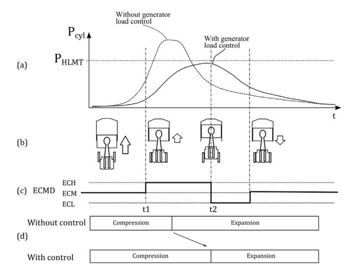

**Fig. 12.** Single cylinder four-stroke cycle free-piston engine generator concept by Honda [74].

The presumed combustion pressure,  $P_{\rm burn}$  is calculated based on intake gas volume, intake air temperature, gas temperature during compression and combustion temperature, and is compared against the target combustion pressure,  $P_{\rm obj}$ , which is calculated according to the engine operating state. If the predicted combustion pressure,  $P_{\rm burn}$  is more than  $P_{\rm obj}$ , the electrical load demand will be increased thus reducing the piston velocity and vice versa.

During the expansion stroke, the target piston speed,  $v_{\rm obj}$  is calculated in the same way as  $P_{\rm obj}$  is calculated while the piston speed  $v_{\rm pist}$  is measured based on the piston position. If  $v_{\rm pist}$  during expansion is more than the target speed, the electrical load demand will be increased thus reducing the piston velocity and vice versa.

The implementation of this control strategy can be observed in Fig. 12 where the in-cylinder pressure profiles with and without the load control are shown in Fig. 12(a). The corresponding electrical load command is shown in Fig. 12(c), where its value is increased to ECH during compression from t1 to t2 and. At t2, the piston is in expansion thus velocity control is imposed by lowering the ECMD to a lower value of ECL before returning to the standard value of

ECM. It shall be noted that the compression stroke takes shorter time when no load control is imposed as compared to when the load control is present as shown in Fig. 12(d).

#### 2.6. Mazda

Patent JP2008051059A [77] described a dual-piston type freepiston engine externally engaged with a linear generator via rackand-pinion mechanism as shown in Fig. 13. Although this design will not produce a 'truly free-piston' configuration, as the rack-andpinion mechanism will mechanically govern the piston motion and transfer load, it is still absent of a conventional crank mechanism and is structurally similar to the known dual-piston free-piston engines.

A key feature of this concept is that the horizontal force generated by the motion of the pistons assembly will be cancelled out by the linear generators motion, thus solving the vibration issue inherent in dual-piston free-piston engine designs. This is ensured by designing the engine with equal moving masses of the piston assembly and generator translators. A further advantage of this solution is that the heat generated from the combustion process is less likely to affect the permanent magnets and also the coils can be mounted with sufficient thermal insulation towards the engine. Also shown in the figure are mechanical stops A and B, which will prevent the piston from hitting the cylinder head in case of combustion instability.

Other patent publications from Mazda include patent application JP 2008-51058 [78] which described a parallel pistons concept with geared rods engaged to a pinion gear which runs a rotary generator. Each piston is out of phase from each other by 180°. It is running on the four-stroke cycle with cam actuated intake and exhaust valves via rocker arms. A similar approach as above is taken to solve the heat transfer from the engine to the generator by separating the generator from the engine; the engine and generator are connected via a mechanical linkage of rack and pinion mechanism. The main rotary shaft will not complete a full revolution but alternate in a clockwise rotation in one stroke and anticlockwise in the other.

In patent application JP 2008-57383 [79], a variable inertial mass concept is proposed to vary the piston speed according to electrical load demand. There are two rotary generators in this configuration which are coupled using a clutch mechanism.

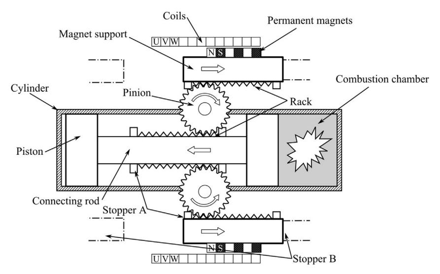

Fig. 13. Dual-piston type free-piston engine concept by Mazda [77].

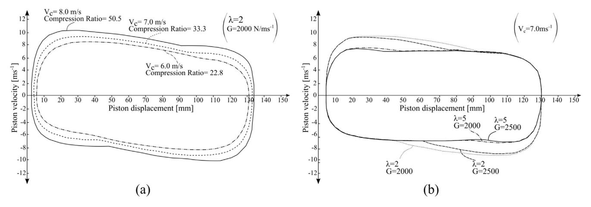

Fig. 14. Free-piston engine compression ratio control using electric load force: (a) at fix lambda and generator load, (b) at fix cut-off speed [80].

Due to the nature of free-piston engine, the compression ratio is not uniform in each cycle during operation. This variation is further affected by combustion performance and load demand. On the other hand, for any given operating condition, a certain value of compression ratio is favourable in achieving high thermal efficiency. Patent application JP 2008-223628 [80] describes how control of the compression ratio can be achieved via piston speed monitoring and generator load control. This method claimed that it can solve the problem in controlling the compression ratio during high engine speed while low speed control is achievable using electrical load manipulation. The energy taken out by the electrical generator will affect the kinetic energy of the piston assembly during the compression stroke, and thereby the final compression ratio.

In this control strategy, when the piston speed falls below the cut-off speed, power generation is stopped thus reducing the electrical braking on the translator. The cut-off speed is the piston speed below which the electrical power generation is stopped (no power extracted). At this speed, the voltage generated by the linear generator is still higher than the voltage of the battery being charged.

There are two main significant parameters highlighted in the patent, i.e. excess-air factor,  $\lambda$  and generator load, G where  $\lambda$  is a measure of lean or rich cylinder charge while G is the ratio of the motoring force to its linear speed. Fig. 14(a) shows how, at fixed  $\lambda$ 

and G, the cut-off speed,  $v_c$  alone can determine the final compression ratio; a higher speed will increase the compression ratio while lower speed will reduce it. Further, Fig. 14(b) shows what happen at constant  $v_c$ , both  $\lambda$  and G are not affecting the final compression ratio.

In another interesting aspect covered in the patent, if misfire is detected the cut-off speed is increased to increase the compression ratio to avoid future misfire while when knock is detected (usually the case at higher compression ratio) the cut-off speed is reduced to reduce the compression ratio to avoid knock in ensuing cycle.

Patent application JP 2008-223657 [81] presented an opposed piston type free-piston engine generator (FPEG) with externally linked linear generator, shown in Fig. 15. Each piston is linked to its own linear generator which is out of phase from each other to cancel the vibration. The advantages for having external generator include vibration-free operation and reduced heat transfer from the engine to the generator.

Mazda has also filed some other interesting patents following the configuration in Fig. 15 for multi-cylinder version around the operational and control aspects [82,83].

### 3. Conclusions

Free-piston engines have been under intense investigation by academic groups over the recent years, and as shown in this paper,

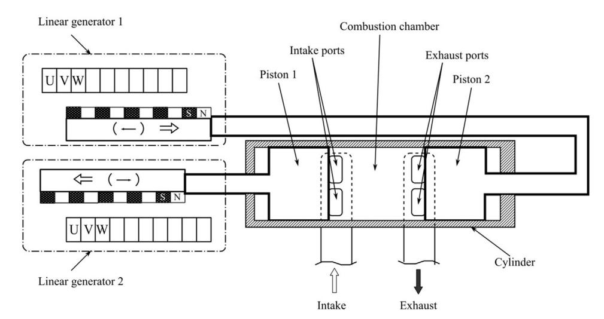

Fig. 15. Opposed piston type FPEG with externally linked linear generator [81].

there is interest in this technology also among key automotive players, as evidenced by their patents reviewed in this paper. Chronologically, the early patents presented here are by Volvo Technology Corporation-ABB and Ford Global Technologies while the more recent patents are by Mazda, Honda, GM and Toyota.

A number of challenges must be solved before the free-piston engine reaches a commercial stage. Some of these, such as piston motion control issues, seem to be in focus by both academic and industrial groups, whereas some are more prominent among the industrial reports. An example of the latter is the heat transfer issues which have been highlighted in majority of the patents.

There does not seem to be a single solution in developing a highly successful free-piston engine and no single configuration (i.e. single-piston, dual-piston or opposed-piston) of the FPE can be said to be superior to the others. Further, the two-stroke cycle does not seem to be essential for operating the FPE as demonstrated in the four-stroke solutions from some of the reviewed patents.

The vibration issue in a dual-piston type FPEG has not been emphasised as the main challenge nor has the scavenging or lubrication. The starting and energy storage solutions for continuous operation are being treated along with the piston position control and cooling of the FPEG. Thus, although the big potential advantages of the FPEG are known, the key aspects for commercialisation seem to lie in its starting, continuous operation and cooling capability.

The actual viability of the free-piston engine is currently uncertain although there is clearly a major potential, as evidenced by the interest in the concept from these commercial players. More research need to be conducted as currently most of the studies are simulation-based and there exists very little reported operational experience. Although a number of the simulation-based studies have shown promising potential in terms of efficiency and emissions, only a few prototypes had been realised, and there is currently no clear path towards commercialisation.

### References

- [1] R. Mikalsen, A.P. Roskilly, A review of free-piston engine history and applications, Appl. Therm. Eng. 27 (Oct 2007) 2339–2352.
- [2] M. Goertz, L. Peng, Free Piston Engine its Application and Optimization, 2000. SAE Technical Paper 2000-01-0996.
- [3] P.A.J. Achten, A Review of Free Piston Engine Concepts, 1994. SAE Technical Paper 941776.
- [4] R. Mikalsen, A.P. Roskilly, The fuel efficiency and exhaust gas emissions of a low heat rejection free-piston diesel engine, Proc. IMechE Part A J. Power Energy 223 (2009).
- [5] F. Rinderknecht, A highly efficient energy converter for a hybrid vehicle concept-focused on the linear generator of the next generation, in: Ecological Vehicles and Renewable Energies (EVER), 2013 8th International Conference and Exhibition on, 2013, pp. 1–7.
- and Exhibition on, 2013, pp. 1–7.
  [6] D. Carter, E. Wechner, The free piston power Pack: sustainable power for hybrid electric vehicles, SAE Int. 2003-01-3277 (2003).
- [7] J. Hansson, M. Leksell, Performance of a Series Hybrid Electric Vehicle with a Free-piston Energy Converter, 2006.
- [8] C. Tóth-Nagy, Linear Engine Development for Series Hybrid Electric Vehicles (Doctor of Philosophy), Department of Mechanical and Aerospace Engineering, West Virginia University, Morgantown, WV, 2004.
- [9] J. Hu, W. Wu, S. Yuan, C. Jing, Mathematical modelling of a hydraulic freepiston engine considering hydraulic valve dynamics, Energy 36 (2011) 6234–6242.
- [10] Z. Zhao, F. Zhang, Y. Huang, C. Zhao, F. Guo, An experimental study of the hydraulic free piston engine, Appl. Energy 99 (2012) 226–233.
- [11] Z. Zhao, F. Zhang, Y. Huang, C. Zhao, An experimental study of the cycle stability of hydraulic free-piston engines, Appl. Therm. Eng. 54 (2013) 365–371.
- [12] C.L. Tian, H.H. Feng, Z.X. Zuo, Oscillation characteristic of single free piston engine generator, Adv. Mater. Res. 383–390 (2011) 1873–1878.
- [13] J.L. Mao, Z.X. Zuo, W. Li, H.H. Feng, Multi-dimensional scavenging analysis of a free-piston linear alternator based on numerical simulation, Appl. Energy 88 (Apr 2011) 1140–1152.
- [14] J.L. Mao, Z.X. Zuo, H.H. Feng, Parameters coupling designation of diesel freepiston linear alternator, Appl. Energy 88 (Dec 2011) 4577–4589.
- [15] C.L. Tian, H.H. Feng, Z.X. Zuo, Load following controller for single free-piston generator, Appl. Mech. Mater. 157 (2012) 617–621.

- [16] C.-J. Chiang, J.-L. Yang, S.-Y. Lan, T.-W. Shei, W.-S. Chiang, B.-L. Chen, Dynamic modeling of a SI/HCCI free-piston engine generator with electric mechanical valves, Appl. Energy 102 (2013) 336–346.
- [17] J. Xiao, Q. Li, Z. Huang, Motion characteristic of a free piston linear engine, Appl. Energy 87 (2009) 1288–1294.
- [18] S. Xu, Y. Wang, T. Zhu, T. Xu, C. Tao, Numerical analysis of two-stroke free piston engine operating on HCCI combustion, Appl. Energy 88 (2011) 3712–3725.
- [19] J. Kim, C. Bae, G. Kim, Simulation on the effect of the combustion parameters on the piston dynamics and engine performance using the Wiebe function in a free piston engine, Appl. Energy 107 (2013) 446–455.
- [20] M.N. Svrcek, C.F. Edwards, Emissions from an extreme-compression, freepiston engine with diesel-style combustion, Int. J. Engine Res. 13 (2012) 238–252.
- [21] Z. Xu, S. Chang, Prototype testing and analysis of a novel internal combustion linear generator integrated power system, Appl. Energy 87 (2010) 1342–1348
- [22] S.A. Zulkifli, M.N. Karsiti, A.R.A. Aziz, Starting of a free-piston linear enginegenerator by mechanical resonance and rectangular current commutation, in: Vehicle Power and Propulsion Conference, 2008. VPPC '08, IEEE, 2008, pp. 1–7
- [23] Ezrann Zharif Zainal Abidin, Abdulwehab A. Ibrahim, A.R.A. Aziz, S.A. Zulkifli, Investigation of starting behaviour of a free-piston linear generator, J. Appl. Sci. 12 (2012) 2592–2597.
- [24] R. Mikalsen, A.P. Roskilly, The design and simulation of a two-stroke freepiston compression ignition engine for electrical power generation, Appl. Therm. Eng. 28 (Apr 2008) 589–600.
- [25] R. Mikalsen, A.P. Roskilly, Performance simulation of a spark ignited freepiston engine generator, Appl. Therm. Eng. 28 (Oct 2008) 1726–1733.
- [26] R. Mikalsen, A.P. Roskilly, Coupled dynamic-multidimensional modelling of free-piston engine combustion, Appl. Energy 86 (Jan 2009) 89–95.
- [27] R. Mikalsen, A.P. Roskilly, A computational study of free-piston diesel engine combustion, Appl. Energy 86 (Jul-Aug 2009) 1136–1143.
- [28] R. Mikalsen, A.P. Roskilly, The control of a free-piston engine generator. Part 1: fundamental analyses, Appl. Energy 87 (Apr 2010) 1273–1280.
- [29] R. Mikalsen, A.P. Roskilly, The control of a free-piston engine generator. Part 2: engine dynamics and piston motion control, Appl. Energy 87 (Apr 2010) 1281–1287
- [30] R. Mikalsen, E. Jones, A.P. Roskilly, Predictive piston motion control in a freepiston internal combustion engine, Appl. Energy 87 (May 2010) 1722–1728.
- [31] P.M. Najt, R.P. Durrett, V. Gopalakrishnan, Opposed Free Piston Linear Alternator, US 2012/112468 A1, 2012.
- [32] R.P. Durrett, V. Gopalakrishnan, P.M. Najt, Turbocompound Free Piston Linear Alternator, US 2012/112469 A1, 2012.
- [33] A.L. London, A.K. Oppenheim, The free-piston engine development present status and design aspects, Trans. ASME 74 (1952) 1349—1361.
- [34] G.J. Flynn, SAE Technical Paper 570042, Observations on 25,000 Hours of Freepiston-engine Operation, vol. 65, 1957, pp. 508–515.
- [35] R. Huber, Present state and future outlook of the free-piston engine, Trans. ASME 80 (1958) 1779–1790.
- [36] P. Němeček, O. Vysoký, Control of two-stroke free-piston generator, in: Proceedings of the 6th Asian Control Conference, vol. 1, 2006.
- [37] A.G. Holmes, Free-piston Linear Alternator Systems and Methods, US 20110012367A1, 2011.
- [38] K. Hidemasa, O. Yuichi, H. Yoshihiro, N. Kiyomi, A. Kosuke, Free-piston Type Generator (I), Japan Patent JP2012202385A, 2012.
- [39] T.A. Johansen, O. Egeland, E.A. Johannessen, R. Kvamsdal, Free-piston diesel engine dynamics and control, in: American Control Conference, vol. 6, 2001, pp. 4579–4584.
- [40] T.A. Johansen, O. Egeland, E.A. Johannessen, R. Kvamsdal, Free-piston diesel engine timing and control - toward electronic cam- and crankshaft, IEEE Trans. Control Syst. Technol. 10 (2002) 177–190.
- [41] F. Kock, A. Heron, F. Rinderknecht, H.E. Friedrich, The free-piston linear generator potentials and challenges, MTZ Worldwide 74 (2013) 38–43.
- [42] H. Yoshihiro, O. Yuichi, N. Kiyomi, Free-piston Engine Driven Linear Power Generator, Japan Patent JP2012021461A, 2012.
- [43] NGK, Heat Rating and Heat Flow Path of NGK Spark Plugs, 1 December 2013. Available: http://www.ngksparkplugs.com/tech\_support/spark\_plugs/p2.asp.
- [44] H. Yoshihiro, K. Hidemasa, N. Kiyomi, O. Yuichi, A. Kosuke, A. Tomoyuki, Freepiston Type Generator (III), Japan Patent JP2012202387A, 2012.
- [45] K. Hidemasa, O. Yuichi, H. Yoshihiro, N. Kiyomi, A. Kosuke, Free-piston Type Generator (II), Japan Patent JP2012202386A, 2012.
- [46] Seppo Tikkanen, Mika Lammila, M. Herranen, M. Vilenius, First Cycles of the Dual Hydraulic Free Piston Engine, 2000. SAE Technical Paper 2000-01-2546.
- [47] P.V. Blarigan, N. Paradiso, S.S. Goldsborough, Homogeneous Charge Compression Ignition with a Free Piston: a New Approach to Ideal Otto Cycle Performance, 1998. SAE Technical Paper 982484.
- [48] O. Yuichi, H. Yoshihiro, N. Kiyomi, A Linear Electric Power Generation Freepiston Engine and Its Start-up Method, Japan Patent JP2012031746A, 2012.
- [49] W. Arshad, A Low-leakage Linear Transverse-flux Machine for a Free-piston Generator (PhD Thesis), Royal Institute of Technology (KTH), Stockholm, 2003.
- [50] J. Hansson, Analysis and Control of a Hybrid Vehicle Powered by Free-piston Energy Converter, KTH, Stockholm, 2006.
- [51] J. Fredriksson, I. Denbratt, Simulation of a Two-stroke Free Piston Engine, 2004. SAE Technical Paper 2004-01-1871.

- [52] M. Bergman, CFD Modelling of a Free-piston Engine Using Detailed Chemistry (Licentiate Thesis), Department of Applied Mechanics, Combustion and Multiphase Flow, Chalmers University of Technology, 2006.
- [53] O. Lindgärde, Method and System for Controlling a Free-Piston Energy Converter, EP1740804B1, 2005.
- [54] W.M. Arshad, C. Sadarangani, An electrical Machine and Use Thereof, W02004017501(A1), 2004.
- [55] C.M. Atkinson, S. Petreanu, N.N. Clark, R.J. Atkinson, T.I. McDaniel, S. Nandkumar, P. Famouri, Numerical Simulation of a Two-stroke Linear Engine-alternator Combination, 1999. SAE Technical Paper 1999-01-0921.
- [56] W. Cawthorne, P. Famouri, N. Clark, Integrated design of linear alternator/ engine system for HEV auxiliary power unit, in: Electric Machines and Drives Conference, 2001, pp. 267–274.
- [57] S.S. Goldsborough, P.V. Blarigan, A Numerical Study of a Free Piston IC Engine Operating on Homogeneous Charge Compression Ignition Combustion, 1999. SAE Technical Paper 1999-01-0619.
- [58] P. Němeček, M. Šindelka, O. Vysoký, Modeling and control of linear combustion engine, in: IFAC Symposium on Advances in Automotive Control, 2003.
- [59] P. Deutsch, O. Vysoky, In-cycle thermodynamic model of linear combustion engine, in: Proceedings of the 2006 IEEE International Conference on Control Applications, 2006.
- [60] Q. Li, J. Xiao, Z. Huang, Simulation of a two-stroke free-piston engine for electrical power generation, Energy Fuels 22 (2008/09/17) 3443—3449.
- [61] E. Max, S. Lundgren, J. Somhurst, A. Höglund, G. Wirmark, L. Gertmar, I. Denbratt, Energy Converter, Sweden Patent EP 1 540 155 B1, 2005.
- [62] F. Kevin, H. Peter, Piston Stopper for a Free Piston Engine, US 2005/0284428 A1, 2005.
- [63] L. Peng, C. Carlson, Exhaust Gas Recirculation for a Free Piston Engine, US 6,925,971 B1, 2005.
- [64] H.-J. Laumen, I. G. Guerich, Position Sensing for a Free Piston Engine, US 6,948,459 B1, 2005.
- [65] P. Hofbauer, Opposed Piston Opposed Cylinder Free Piston Engine," US 6.953.010 B1, 2005.
- [66] L. Peng, P. Hofbauer, J. Yang, Fuel Injection for a Free Piston Engine, US 6,959,672 B1, 2005.

- [67] C. Carlson, Compression Pulse Starting of a Free Piston Internal Combustion Engine Having Multiple Cylinders, US 6,966,280 B1, 2005.
- [68] K. Fuqua, P. Hofbauer, Piston Lubrication for a Free Piston Engine, US 6,971,341 B1, 2005.
- [69] P. Hofbauer, A. Tusinean, Sodium Cooled Pistons for a Free Piston Engine, US 6,904,876 B1, 2005.
- [70] J. Schmuecker, I. G. Guerich, H.-J. Laumen, A. Tusinean, K. Fuqua, Hydraulic Synchronizing Coupler for a Free Piston Engine," US 7,077,080 B2, 2006.
- [71] A. Hibi, T. Ito, Fundamental test results of a hydraulic free piston internal combustion engine, Proc. Inst. Mech. Eng. Part D J. Automob. Eng. 218 (October 1, 2004) 1149–1157.
- [72] P.A.J. Achten, J.P.J.V.D. Oever, J. Potma, G.E.M. Vael, Horsepower with Brains: the design of the Chiron free piston engine, New Fluid Power Appl. Compon. SAE Tech. 2000-01-2545 (2000).
- [73] P.A.J. Achten, The Hybrid Transmission, 2007. SAE Technical Paper 2007-01-4152.
- [74] T. Osamu, S. Kohei, T. Kenichi, K. Kohei, Y. Yuji, The Control Apparatus of an Internal Combustion Engine, JP2011202621 A, 2011.
- [75] S. Petreanu, Conceptual Analysis of a Four-stroke Linear Engine, PhD, Department of Mechanical and Aerospace Engineering, West Virginia University, Morgantown, West Virginia, 2001.
- [76] J. Lin, Z. Xu, S. Chang, N. Yin, H. Yan, Thermodynamic simulation and prototype testing of a four-stroke free-piston engine, J. Eng. Gas Turbines Power 136 (2014) 051505
- [77] N. Koichi, Free-piston Engine (II), Japan Patent JP2008051059(A), 2008.
- [78] N. Koichi, Free-piston Engine (I), Japan Patent JP2008051058(A), 2008.
- [79] N. Koichi, The Control Apparatus of a Free Piston Engine (I), Japan Patent JP2008057383(A), 2008.
- [80] N. Koichi, The Control Apparatus of a Free Piston Engine (II), Japan Patent JP2008223628(A), 2008.
- [81] N. Koichi, Free-piston Engine (III), Japan Patent JP2008223657(A), 2008.
- [82] N. Koichi, Free-piston Engine and Its Control Method (I), Japan Patent JP2009008068(A), 2009.
- [83] N. Koichi, Free-piston Engine and Its Control Method (II), Japan Patent JP2009008069(A), 2009.