**EXECUTIVE SUMMARY OF THE THESIS** 

Free-Piston generator: modelling of a Spark-Ignition engine, design of the linear electric machine and active rectifier control.

TESI MAGISTRALE IN ENERGY ENGINEERING – INGEGNERIA ENERGETICA

**AUTHOR: ANDREA FACHERIS, FRANCESCO FASANA** 

ADVISOR: PROF. ALBERTO DOLARA // CO-ADVISOR: PROF. TOMMASO LUCCHINI

**ACADEMIC YEAR: 2020-2021** 

#### 1. Abstract

The Free-Piston Linear Generator (FPLG) technology is intended to be the bridge between the fossil-fueled era and the coming green power-generation one. The Internal Combustion Engine (ICE) is presented into a novel concept with the lack of the traditional crankshaft mechanism. Thanks to this peculiar structure, this engine allows to achieve high efficiencies with low vibrations and friction, a compact and modular design, to reduce the consumption and the emissions of power generation and at the same time production and maintenance costs.

Moreover, some features are distinctive of this technology, only feasible due to no constraint on the piston motion. The variable Compression Ratio (CR), for example, paves the way for fuel flexibility and for this reason can be the link between fossil derived fuels and future green hydrogen, exploiting the same hardware components.

After an introductive analysis on global warming and emissions, the applications of this new engine are investigated. The fields of deployment are broad: distributed or off-grid power generation, microgrids, marine propulsion, electric recharge stations, trucks, energy resource for drones or Range Extender (REX) applications for Electric Vehicles (EVs). The last has been at the core of this study, with the development of a single-piston Spark Ignition (SI) gasoline Free-Piston engine model in the CFD open-source OpenFOAM environment.

Furthermore, the paper focuses on the realization and analysis of a decoupled double-loop control system for an active rectifier based on Space Vector Pulse Width Modulation (SVPWM) technique. The AC-side uncontrolled balanced non-sinusoidal three-phase voltage supply is converted into a regulated high voltage 800V DC-side with a power factor close to unity.

## 2. Overview of the Technology

The Free-Piston is an engine which has been patented by Raùl Pateras Pescara in 1928 originally as a Free-Piston spark ignited air compressor. Its history has not been bright and it has never achieved a commercial success. With the modern

era and the advent of modern computers the original idea has lighted back the interest by firms and R&D laboratories.

The components belonging to the Free-Piston are a Combustion Chamber (CC), a rebound device and a load as shown in Figure 1.

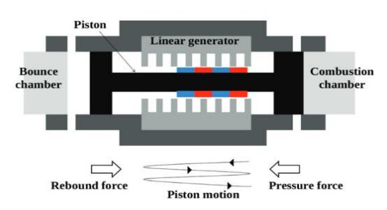

Figure 1: FPLG structure.

In the CC, the combustion can be characterized by Spark Ignition (SI), Diesel Compression Ignition (CI) and Homogeneous Charge Compression Ignition (HCCI). The gas exchange or scavenging in the meanwhile can also assume disparate classification: uniflow, loop and crossflow scavenging.

The rebound device is usually a Gas Spring (GS) or a mechanical. It is strictly necessary due to the lack of the crankshaft mechanism and acts as an energy buffer between the expansion and compression stroke.

Meanwhile, the load is here represented by a Linear Electric Machine (LEM). It can be used to slow the piston and generate electricity, control the piston trajectory and guarantee continuous oscillations even when abnormal conditions occur. The LEM has many architectures, but it is usually a permanent magnet (PM) linear machine in a single-sided, multi-sided or tubular configuration.

This kind of engine can have distinct architectures: single piston, dual piston, opposed piston, W-shape and many other viable ones. Each one having its advantages and disadvantages, but the choice of two pistons combined gives birth to a power compact and almost vibrations free system. Now, there are at least three main parameters on which to focus for the optimization of the system dynamics:

- Moving Mass: besides the technological constraints the moving mass has a direct influence on the inertia of the piston and thus its trajectory and motion.
- Compression Ratio: defined as the ratio between the volumes inside the CC (or GS)

at the Bottom Dead Center (BDC) and the Top Dead Center (TDC). In general, the higher it is, the higher the thermal efficiency of CC. It has to be properly controlled for each of the type of fuel exploited.

• *Piston's stroke and Velocity*: both have a great influence on the efficiency. In general, the bigger the stroke the higher the speed having more space to accelerate, hence the higher the power.

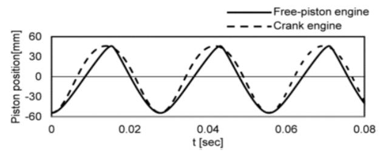

Figure 2: Free-Piston and Crank engine trajectory.

In Figure 2, the substantial difference in the piston motion of a Free-Piston and a traditional engine is displayed. Indeed, the novel engine has a faster expansion but a slower compression stroke.

Once the layout and the components have been chosen there are a great number of degrees of freedom to consider and a control logic is necessary. Many control schemes focus at the same time on piston motion and power rectification to feed the load correctly, others leave the latter aspect to the power management electronic system. This last solution is preferred especially in the automotive sector where the battery decouples the generation side and the demand and it has been in this work carried out.

# 3. Dynamic and thermodynamic model

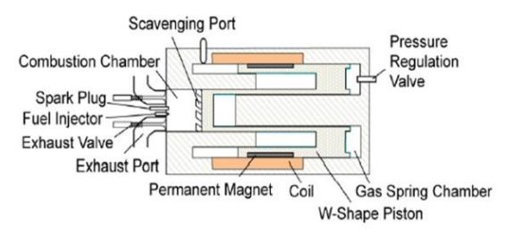

Figure 3: Model configuration (W-shaped).

The developed FPLG model in the OpenFOAM environment has been a single-piston W-shaped SI gasoline engine capable to achieve a power of 10kW.

#### 3.1. Model's architecture

The basis of the work has been the engine developed by Toyota Central R&D Labs Inc. [1]–[3]. Consequently, the goal has been to create and validate a model which is capable to simulate the Free-Piston engine dynamics with the same characteristics and reach the same level of performance.

Table 1 reports the main geometrical aspects related to the model developed in this thesis.

|                             | Values |
|-----------------------------|--------|
| Engine bore                 | 68 mm  |
| Internal stator<br>diameter | 120 mm |
| Scavenging port<br>height   | 25 mm  |
| Maximum stroke              | 100 mm |
| Total mass                  | 4.8 kg |

Table 1: Specification of the model.

Moreover, the Compression Ratios (CR) are taken equal to 10 and 4 for the CC and GS respectively.

From these first geometrical and data assumptions, some evaluations have been performed to define the piston-to-head clearance of 11 mm, with therefore the maximum height of the cylinder of 111 mm. In the same way for the gas spring the clearance results equal to 33.33 mm.

Figure 4 shows how the GS has been designed annulus shaped due to the choice of a W-shaped piston and that the simulations have been carried out on the basis of a slice of the combustion chamber equals to a peculiar angle of 2.5°.

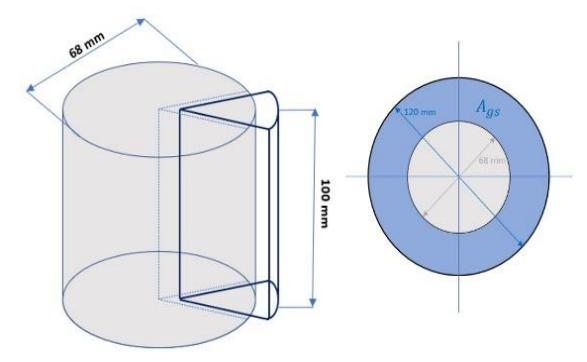

Figure 4: CC on the left and GS on the right.

On the other hand, the goals pursued are reported in Table 2. In order to get to these results, due to the lack of many data, some parameters or values have been guessed and changed through sensitivity analysis to finally obtain a steady state operation of the piston.

|                      | Values |
|----------------------|--------|
| Frequency            | 26 Hz  |
| Power                | 10 kW  |
| Thermal efficiency   | 42%    |
| Compression ratio CC | 10     |
| Compression ratio GS | 4      |

Table 2: Goals of the model.

### 3.2. Model's dynamics

According to the Newton's second law the forces acting on the cylinder are the two pressures, the friction and the magnetic force of the Linear Electric Machine reported in the equation of motion:

$$m \cdot \left(\frac{d^2x}{dt^2}\right) = -F_{comb} + F_{gs} \pm F_{LEM} \pm F_{fric} \tag{1}$$

where m is the mass, x is the piston position,  $F_{comb}$  is the force caused by combustion,  $F_{gs}$  is exerted by the gas spring,  $F_{LEM}$  by the LEM and  $F_{fric}$  is the one dissipated by friction, each taken with their respective sign, while BDC is set to be the zero reference for the piston position.

 $F_{comb}$  depends mainly on the rate of change of heat release  $\left(\frac{dQ}{dt}\right)$  by combustion which has been implemented through the Wiebe's function shown in Eq. (2).

$$\frac{dQ}{dt} = H_u g_f \eta_c \frac{d\chi_B}{dt} \tag{2}$$

where  $H_u$  is the calorific value of fuel chosen to be Octane 44  $\left[\frac{Mj}{kg}\right]$ ,  $g_f$  is the injected fuel mass per cycle,  $\eta_c$  is the combustion efficiency and  $\frac{d\chi_B}{dt}$  is the derivative of the mass fraction burned in the combustion process. [4]

For the GS,  $F_{gs}$  can be evaluated as follow:

$$P_{gs}V_{gs}^{\gamma} = const \tag{3a}$$

$$F_{gs} = A_{gs} \cdot P_{gs} \tag{3b}$$

where  $\gamma=\frac{c_p}{c_v}$  is the heat capacity ratio for an ideal gas,  $A_{gs}$  and  $P_{gs}$  are the gas spring area and pressure respectively and the instantaneous volume  $V_{gs}$  derives from piston motion.

The Linear Electric Motor (LEM) is designed to be a voltage generator. Figure 5 reports the equivalent per phase electrical scheme. [5], [6]

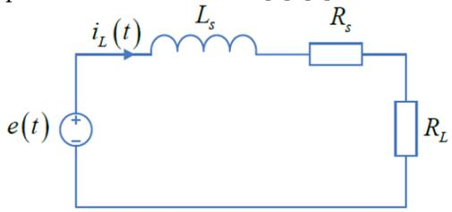

Figure 5: Electric scheme of LEM.

Equation (4) describes the induced electromotive voltage produced in the coil of one phase acting upon the piston.

$$\varepsilon_{ind} = H N_{turns} M_p \frac{\mu_0}{g_e} \frac{8}{\pi} \sin\left(\frac{\pi \tau_p}{2\tau}\right) \sin\left(\frac{\pi}{\tau}x\right) \frac{dx}{dt}$$
 (4)

in which H is the length of the coil,  $N_{turns}$  is the number of turns per coil,  $M_p$  is the peak value of the Magneto Motive Force (MMF),  $\mu_0$  the vacuum permeability,  $g_e$  the air gap length,  $\tau$  the pole pitch and  $\tau_p$  the PM's width.

Equation (5) reports the current generated.
$$i_L(t) = \frac{\varepsilon_{ind}(t)}{R_s + R_{load}} \left( 1 - e^{-\frac{R_s + R_{load}}{L_s}t} \right) \tag{5}$$

 $R_s$  and  $R_{load}$  are the resistances reported in Figure

Knowing that  $F_{LEM}$  is equal to

$$F_{LEM} = 2N_{turns}B(x)i_LH \tag{6}$$

in which B(x) is the flux density in the air gap. Substituting (5) in (6), and rearranging

$$F_{LEM} = M^* \left( 1 - e^{-\frac{R_S + R_{load}}{L_S} t} \right) \frac{dx}{dt}$$
 (7)

Where:

$$M^* = 6H^2 N_{turns}^2 B_m^2 \left( \frac{1}{R_s + R_{load}} \right)$$
 (8)

And  $L_s$  is the inductance, while for simplicity it has been defined  $B_m = \frac{\mu_0}{g_e} \frac{4}{\pi} M_p \sin\left(\frac{\pi \tau_p}{2\tau}\right)$ .

Table 3 reports the data of the LEM.

| Parameter   | Values         |
|-------------|----------------|
| τ           | 50 mm          |
| $	au_p$     | 30 mm          |
| $H_c$       | 960 A/mm       |
| $\mu_0$     | 1.257e-6 N/A^2 |
| $g_e$       | 33 mm          |
| $N_{turns}$ | 118            |
| Н           | 300 mm         |
| $R_s$       | $0.16\Omega$   |

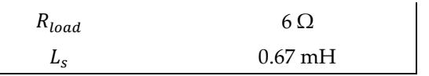

Table 3: Specific LEM values.

 $F_{fric}$ , always opposed to motion, can be expressed in absolute terms as Eq. (9)

$$F_{fric} = C_f \cdot v \tag{9}$$

in which  $C_f$  is the friction coefficient set equals to 12  $\left[\frac{Ns}{m}\right]$  and v is the piston speed.

#### 3.3. Results

|                        | Toyota | LEM   | Δ%    |
|------------------------|--------|-------|-------|
| Frequency [Hz]         | 26     | 28.32 | +8.92 |
| Power [W]              | 10000  | 9996  | -0.04 |
| Thermal Efficiency [%] | 42     | 46    | +9.52 |
| CR cc                  | 10     | 10.19 | +1.9  |
| CR gs                  | 4      | 4.01  | +0.25 |

Table 4: Model's output and validation.

Table 4 attaches the main output parameters of the simulations.

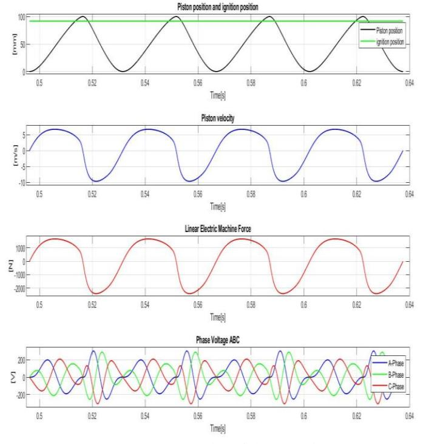

Figure 6: Main results of the simulation.

In Figure 6 are reported the piston position in black at the top, then in blue the piston velocity and right below in red the  $F_{LEM}$  and then the three-phase voltages at the bottom.

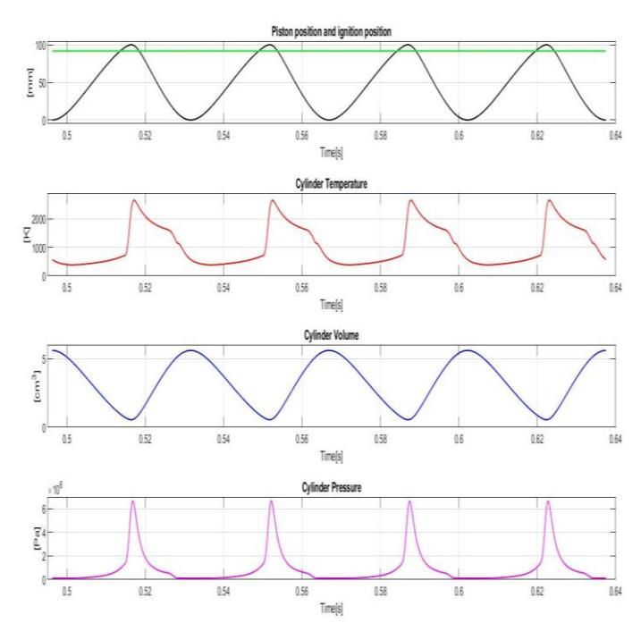

Figure 7: Thermodynamic results of the simulation.

In Figure 7, Temperature (red), Volume (blue) and Pressure (purple) of the combustion chamber are reported with respect to the piston position on top (black).

Steady-state continuous working condition has been achieved.

# 4. Active rectifier control model

A proper control logic has to be designed to regulate the output of the FPLG and to keep the DC bus link at 800V and the power factor close to one.

#### 4.1. Kirchhoff's laws

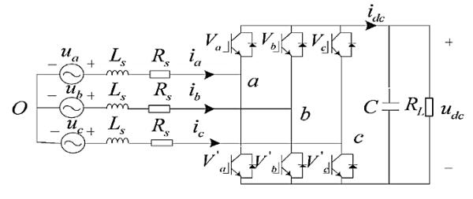

Figure 8: Schematic of the rectifier.

Starting from Figure 8, the Kirchhoff's Voltage (KVL) and current laws (KCL) can be expressed as

$$L_{s} \cdot \frac{di_{a}}{dt} = U_{a} - R_{s} \cdot i_{a} - \frac{U_{DC}}{3} (2S_{a} - S_{b} - S_{c}) \quad (10a)$$

$$L_{s} \cdot \frac{di_{b}}{dt} = U_{b} - R_{s} \cdot i_{b} - \frac{U_{DC}}{3} (2S_{b} - S_{a} - S_{c}) \quad (10b)$$

$$L_s \cdot \frac{di_c}{dt} = U_c - R_s \cdot i_c - \frac{U_{DC}}{3} (2S_c - S_a - S_b)$$
 (10c)

$$C \cdot \frac{dU_{DC}}{dt} = S_a i_a + S_b i_b + S_c i_c - \frac{U_{DC}}{R_{load}}$$
 (10d)

where  $U_{DC}$  is the DC-side voltage, C is the capacitor,  $i_k$  are the phase currents and  $S_k$  is the switch function with k = a, b, c, if  $S_k = 1$  the upper switch arm is closed and the lower is opened, and otherwise if  $S_k = 0$ .

Now, transforming the equations in the direct-quadrature-zero dq0 coordinates through the Park's transformation, from Eq.(10), it is obtained

$$U_d = (L_s s + R_s)i_d - \omega L_s i_q + V_d$$
 (11a)

$$U_a = (L_s s + R_s)i_a + \omega L_s i_d + V_a \tag{11b}$$

$$C \cdot \frac{dU_{DC}}{dt} = \frac{3}{2} \left( i_d S_d + i_q S_q \right) - \frac{U_{DC}}{R_{load}}$$
 (11c)

where  $\omega$  is the angular speed of the supply rotating vector, s is the Laplace domain complex frequency,  $S_d$  and  $S_q$  are the dq-axis switch function, and the same for the currents and voltages.

#### 4.2. Double-loop logic and SVPWM

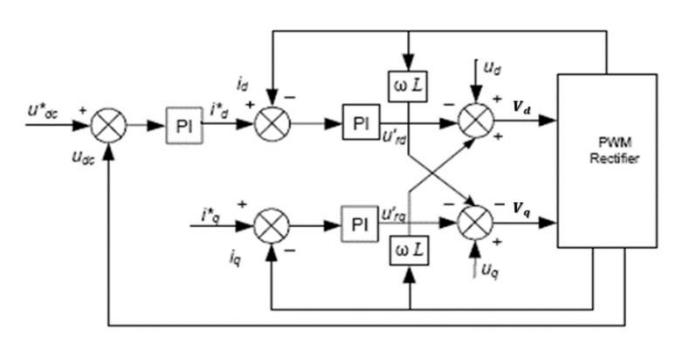

Figure 9: Double-loop schematic.

Figure 9 displays the double-loop logic implemented in the active rectifier control model. The inner current loop and the outer voltage loop allow to evaluate as in Eq. (12) the reference *dq* voltages needed by the Space Vector Pulse Width Modulation (SVPWM) to control the rectifier operation.

$$V_d = U_d - \left(K_p + \frac{K_i}{s}\right)(i_d^* - i_d) + \omega L_s i_q$$
 (12a)

$$V_q = U_q - \left(K_p + \frac{K_i}{s}\right) \left(i_q^* - i_q\right) - \omega L_s i_d \tag{12b}$$

where  $V_d$  and  $V_q$  are the reference voltages,  $K_p$  and  $K_i$  are the PI gains,  $i_d^*$  and  $i_q^*$  are the reference dq currents and  $U_{DC}^*$  is the reference DC-voltage (800V). To obtain unity of power factor  $i_q^*$  is set null.

The SVPWM technique consists initially in the definition of some reference vectors which correspond to a specific combination of the switches inside the rectifier. The space vector shown in Figure 10 is introduced. On the plane there are eight switching states,  $U_0(000)$ ,  $U_1(100)$ ,  $U_2(110)$ ,  $U_3(010)$ ,  $U_4(011)$ ,  $U_5(001)$ ,  $U_6(101)$  and  $U_7(111)$ , six of them are non-zero vectors ( $\overrightarrow{U_1}$  to  $\overrightarrow{U_6}$ ), while two are zero vectors ( $\overrightarrow{U_0}$  and  $\overrightarrow{U_7}$ ). The 1 and the 0 describe the switching state of each leg with 1 representing the upper switch closed and the lower opened and the 0 standing for the opposite. [7]

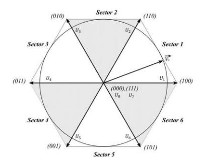

Figure 10: Space Vector.

Once the possible switching vectors are described, the focus is moved on the procedure to find their correct combination which needs to be applied in the rectifier and a symmetric modulation scheme is applied.

#### 4.3. Model and Outcomes

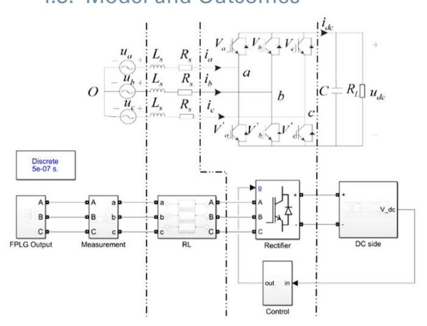

Figure 11: Electric scheme of control system.

Figure 11 reports the Simulink scheme of the whole electrical components developed for the active rectifier control.

Figure 12 is showing instead how the double-loop logic and the SVPWM is implemented in the model.

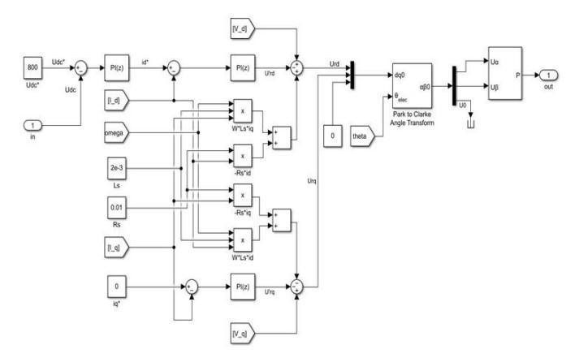

Figure 12: Block scheme of Control logic.

From the simulations, it's clear that the main challenge that the system has to faces is linked to the non-sinusoidal trend of the voltage supply. As shown by Figure 13, the resultant rotating vector rotates first clockwise, then in the second quadrant collapses to zero (TDC) and reverses its motion to the counterclockwise direction till the BDC, then repeats.

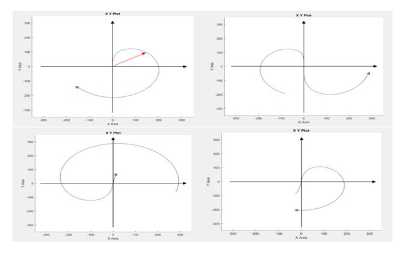

Figure 13: Supply voltage vector.

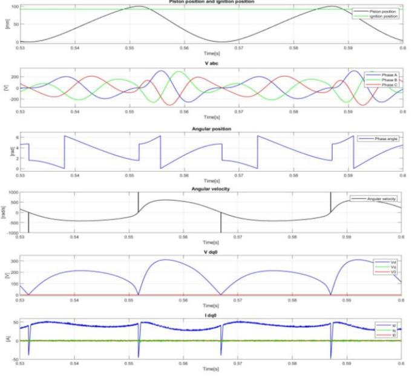

Figure 14: Control logic action.

The two inverse directions and the pulsating behavior are the straight consequence of the Free-Piston engine compression and expansion stroke, as can be seen from Figure 14. This picture depicts how in correspondence of the TDC and BDC there are discontinuities in angular position and velocity of the supply voltage vector, as well as zero crossing of Park  $V_d$  amplitude and peaks of Park  $i_d$  current.

Nevertheless, the continuous 10kW DC-side output has been achieved and the steady state of 800V has been reached as shown in Figure 15. A ripple of few *Volts* is perfectly acceptable and manageable by the capacity  $C = 20000\mu F$  which acts as a buffer.

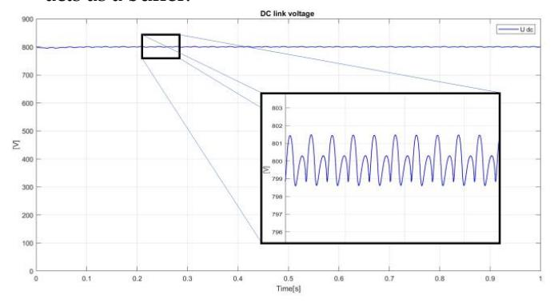

Figure 15: DC bus voltage.

Furthermore, the unity of the power factor is ensured by the currents nor leading or lagging with respect to the voltages, being so in phase with each other in the AC-side as in Figure 16 shown.

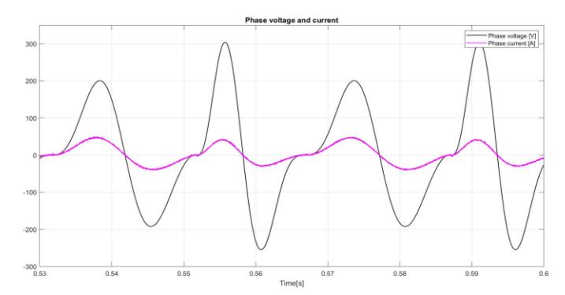

Figure 16: AC-side one-phase current (purple) and voltage(black).

#### 5. Conclusions

In conclusion a dynamic and thermodynamic model of the Free-Piston engine and its decoupled active rectifier control logic have been developed and resulted to be successful to operate in a continuous way proving their robustness.

Future works might include:

- An evolution of the proposed control system to couple both the models, focusing at the same time on piston motion and power rectification to feed the load correctly. The link between the twos can be the AC phase current which influences F<sub>LEM</sub> modifying the piston motion, hence the power generation. Furthermore, in this case motoring conditions of LEM could be simulated.
- Deep studies over transient periods such as start-up and shut-downs or combustion misfires.
- Refinements of the model or realization of a real prototype, analysis and modelling of all the components needed.

In particular, the paper should be considered as a pioneering work, a solid base from which to start the deepening of the FPLG's peculiarities.

#### References

- [1] H. Kosaka *et al.*, "Development of Free Piston Engine Linear Generator System Part 1 - Investigation of Fundamental Characteristics."
- [2] S. Goto *et al.*, "Development of Free Piston Engine Linear Generator System Part 2-Investigation of Control System for Generator."
- [3] K. Moriya, S. Goto, T. Akita, H. Kosaka, Y. Hotta, and K. Nakakita, "Development of Free Piston Engine Linear Generator System Part3 -Novel Control Method of Linear Generator for to Improve Efficiency and Stability," SAE International, Apr. 2016. doi: 10.4271/2016-01-0685.
- [4] C. Zhang *et al.*, "A free-piston linear generator control strategy for improving output power," MDPI AG, Jan. 2018. doi: 10.3390/en11010135.
- [5] P. Sun *et al.*, "Hybrid system modeling and full cycle operation analysis of a two-stroke free-piston linear generator," MDPI AG, 2017. doi: 10.3390/en10020213.
- [6] J. Mao, Z. Zuo, W. Li, and H. Feng, "Multi-dimensional scavenging analysis of a free-piston linear alternator based on numerical simulation," Elsevier Ltd, 2011. doi: 10.1016/j.apenergy.2010.10.003.
- [7] J. Schönberger, "Space Vector Control of a Three-Phase Rectifier using PLECS ®."


SCUOLA DI INGEGNERIA INDUSTRIALE E DELL'INFORMAZIONE

Free-Piston generator:
modelling of a Spark-Ignition
engine, design of the linear
electric machine and active
rectifier control.

TESI DI LAUREA MAGISTRALE IN ENERGY ENGINEERING-INGEGNERIA ENERGETICA

Authors: Facheris Andrea, Fasana Francesco

Students ID: 928351, 925541 Advisor: Prof. Dolara Alberto

Co-advisor: Prof. Lucchini Tommaso

Academic Year: 2020-21


# **Abstract**

The Free-Piston Linear Generator (FPLG) is a new concept of internal combustion engine that could help society overall to make a transition towards more sustainable and eco-friendly energy scenarios. Its working principle is based on a cylinder-piston system directly connected to a Linear Electric Machine (LEM). Even though it is still an energy conversion system based on internal combustion, the lack of the crankshaft mechanism reduces the inertia, the weight and the friction losses of the device, resulting in an increase of the conversion efficiency from chemical to mechanical energy and consequently from chemical to electric. It's moreover possible to exploit different compression ratios and thus different fuels without any hardware modification. The system turns out to be light and compact with low friction and vibrations, low emissions and environmentally compatible.

This thesis starting from the peculiar features of the FPLG, its strengths and weaknesses, aims to develop a model to describe with a good level of detail the entire energy conversion system, providing at the same time an overview of the possible applications.

Starting from the mathematical equations and formulas that dictate the behaviour of each component, the stable continuous operation of the FPLG has been simulated and achieved in OpenFOAM. A particular attention is devoted to the modelling of the linear electric machine's behaviour and its contribution to the dynamic equilibrium acting on the piston.

Once the results are validated, the focus is then moved on making induced voltages and currents suitable for a load. The control system for an active rectifier has been implemented in Simulink in order to process the direct conversion of the non-sinusoidal outputs of the LEM into regulated and stable DC-signal. A great emphasis is placed in this part on the algorithm that allows to select instant by instant the most suitable switching pattern of the rectifier's to enhance efficiency and performance.

**Key-words**: Free-Piston Linear Generator (FPLG), Linear Electric Machine (LEM), active rectifier, control logic.


# Abstract in lingua italiana

Il generatore lineare Free-Piston (FPLG) è un nuovo tipo di motore a combustione interna che potrebbe aiutare la società verso una transizione a scenari energetici più sostenibili ed ecocompatibili. Basa il suo principio di funzionamento su un sistema cilindro-pistone direttamente accoppiato con una macchina elettrica di tipo lineare (LEM). Pur essendo un sistema di conversione dell'energia ancora basato sulla combustione, l'assenza di un manovellismo riduce le inerzie in gioco, il peso e le perdite di attrito con il risultato di aumentare significativamente l'efficienza di conversione dell'energia da chimica a meccanica e di conseguenza anche da chimica ad elettrica. È inoltre possibile sfruttare diversi rapporti di compressione e dunque diverse tipologie di carburante senza alcun tipo di aggiunta o modifica strutturale. Si ottiene dunque un sistema leggero, compatto con poche vibrazioni, emissioni e compatibile a livello ambientale.

Questa tesi partendo dalle caratteristiche salienti del Free-Piston Linear Generator (FPLG), dai suoi punti di forza e dalle sue criticità, ha l'obiettivo di sviluppare un modello che permetta di rappresentare con un buon grado di dettaglio il funzionamento dell'intero sistema di conversione dell'energia, fornendo una visione d'insieme delle possibili applicazioni.

Partendo dalle equazioni matematiche e dalle formule che governano il comportamento di ogni componente, è stato quindi simulato in OpenFOAM il comportamento a regime del FPLG. Una particolare attenzione è riposta nella modellizzazione della macchina elettrica lineare e al suo contributo all'equilibrio dinamico che si instaura sul pistone.

Una volta validati i risultati, ci si è interessati poi a rendere correnti e tensioni indotte adatte all'alimentazione di un carico. È stato quindi implementato in Simulink il sistema di controllo di un active rectifier in grado di convertire le uscite non sinusoidali della macchina elettrica in un segnale stabile in corrente continua. Una grande enfasi è posta in questa parte sull'algoritmo che permette istante per istante di individuare la migliore configurazione degli interruttori in termini di efficienza e prestazioni.

**Parole chiave:** Generatore Lineare Free-Piston (FPLG), Macchina Elettrica Lineare (LEM), active rectifier, logica di controllo.


# Contents

| Abstrac | ct                               | i   |
|---------|----------------------------------|-----|
| Abstrac | ct in lingua italiana            | iii |
| Conten  | ts                               | v   |
| Introdu | ıction                           | 1   |
| 1. Ove  | erview of the technology         | 7   |
| 1.1     | Historical background            | 8   |
| 1.2     | Components                       | 10  |
| 1.2.    | 1 Combustion chamber             | 11  |
| 1.2.    | 2 Rebound device                 | 15  |
| 1.2.    | 3 Linear Electric Machine        | 16  |
| 1.3     | Architectures and configurations | 21  |
| 1.3.    | 1 Single-piston                  | 21  |
| 1.3.    | 2 Dual-piston                    | 22  |
| 1.3.    | 3 Opposite-piston                | 23  |
| 1.3.    | 4 Other configurations           | 24  |
| 1.4     | Parameters and control logic     | 25  |
| 1.5     | Advantages and drawbacks         | 29  |
| 1.6     | State of art                     | 31  |
| 1.6.    | 1 Toyota                         | 32  |
| 1.6.    | 2 SWengin (SoftWareEngine)       | 33  |
| 1.6.    | 3 Aquarius                       | 34  |
| 1.6.    | 4 Volvo                          | 34  |
| 1.6.    | 5 Honda                          | 35  |
| 1.7     | Applications                     | 36  |

vi

| 2. | Dyna  | amic and Thermodynamic model            | 39  |
|----|-------|-----------------------------------------|-----|
|    | 2.1 7 | Toyota's articles                       | 39  |
|    | 2.1.1 | First paper                             | 40  |
|    | 2.1.2 | Second paper                            | 43  |
|    | 2.1.3 | Third paper                             | 46  |
|    | 2.2 N | Model's development                     | 49  |
|    | 2.2.1 | Definition of the model's architecture  | 49  |
|    | 2.2.2 | Definition of the model's dynamics      | 53  |
|    | 2.2.3 | Definition of the model's goals         | 69  |
|    | 2.3   | Outputs                                 | 70  |
|    | 2.3.1 | Dynamic results                         | 71  |
|    | 2.3.2 | Thermodynamic results                   | 73  |
|    | 2.3.3 | Electric results                        | 76  |
| 3. | Activ | ve rectifier control Model              | 79  |
|    | 3.1 7 | Theoretical background                  | 80  |
|    | 3.1.1 | Power Electronics and rectifiers        | 80  |
|    | 3.1.2 | Clarke and Park's transformation        | 82  |
|    | 3.1.3 | PID controllers                         | 87  |
|    | 3.2 A | Analytical origin of the model          | 92  |
|    | 3.2.1 | Kirchhoff's laws                        | 92  |
|    | 3.2.2 | Active rectifier control logic          | 100 |
|    | 3.2.3 | Space Vector Pulse Width Modulation     | 104 |
|    | 3.2.4 | DC link capacitor sizing                | 109 |
|    | 3.3 N | Model's features and its implementation | 109 |
|    | 3.3.1 | FPLG Output                             | 111 |
|    | 3.3.2 | Measurements                            | 116 |
|    | 3.3.3 | Series resistor and inductor            | 118 |
|    | 3.3.4 | Rectifier                               | 119 |
|    | 3.3.5 | Control                                 | 120 |
|    | 3.3.6 | DC side                                 | 123 |
|    | 3.4 I | Results and outcomes                    | 124 |

**Contents** vii

| 3.4.1          | DC-side of the active rectifier | 124 |
|----------------|---------------------------------|-----|
| 3.4.2          | Control logic                   | 128 |
| 3.4.3          | AC-side of the active rectifier | 129 |
| Conclusio      | n and future development        | 131 |
| Appendix       |                                 | 135 |
| List of syn    | nbols                           | 139 |
| Bibliography   |                                 | 147 |
| List of figu   | ures                            | 153 |
| List of tables |                                 | 157 |
| Acknowle       | edgements                       | 159 |

During the last couple years a pandemic has hit the world and completely changed our lives overnight. The disruptive change brought by the COVID-19 disease has overwhelmed our commonness and required a big adaptation and effort by the whole society. Technology has helped us all to go through one of the events that will remain in history books and for this reason it has seen a huge leap forward in many fields. One of the most awakened feeling is the one concerning the environment and the excessive unregulated exploitation of it, at the expenses of climate, vegetation, wildlife or even ours. The world is changing at a fast pace and humanity has to adopt faster than ever. Green technologies, especially, are playing a key role in finding the solution to global warming and climate change. These green techs can potentially change the entire energy scenario and will drive society towards a cleaner and greener future where carbon neutrality is a must to guarantee our persistence on the planet.

In fact, more and more people in the world are gradually becoming aware of the great environmental challenge that the humanity will have to face in the next years. A huge change is clearly needed and at a fast pace. Global warming, pollution, the increasing number of natural disasters, heat bubbles and wildfires are only few examples of the possible consequences of maintaining the status quo.

The decade 2011-2020 was the warmest ever recorded, setting a global average temperature of 1.1°C above pre-industrial level in 2019. As stated by the scientific community human-caused global warming is steadily increasing of 0.2 °C per decade [1]. An increase of 2°C above pre-industrial level is considered the threshold not to exceed to encounter negative impacts on to the natural environment, human health and wellbeing overall. Possibly catastrophic changes in the global environment are not excluded and have to be considered. The causes linked to this human-induced global warming are clear and associated to the greenhouse gases emissions in the power generation burning coal, oil and gas, but also to deforestation, livestock farming, fertilizers and fluorinated gases emissions. 2020 documented the biggest absolute decline of emissions ever recorded in history with a possible large rebound of the economies and therefore of the energy demand, creating the risk to increase

once again greenhouse gases pollution. What happens to this trend in future years and decades depends heavily on the effort put in place by governments to boost the economies while structurally changing the power production, generation and use. Figure 0.1 realized by the International Energy Agency (IEA) shows that 2019 set the peak of CO2 global emissions and proposes two possible future scenarios for the recovery after the pandemic [2].

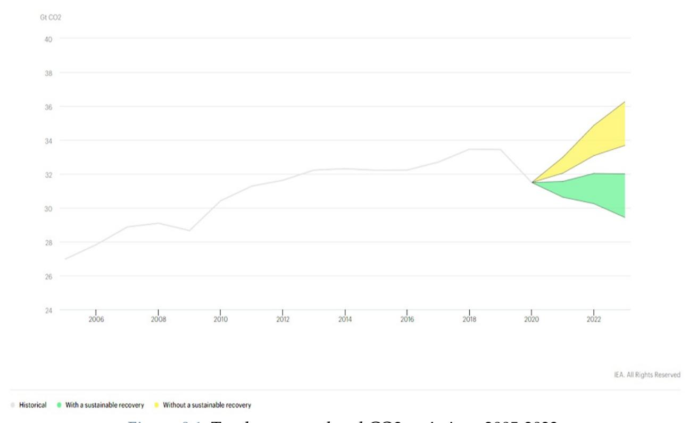

Figure 0.1: Total energy-related CO2 emissions 2005-2023.

The green path shows the emissions in the case of a sustainable recovery, while the yellow area is standing for the scenario without a sustainable recovery. Some positive signs and clues coming from last years' trend paves the way for some optimism to reverse the growing curve.

As just stated, these emissions have a direct and severe impact on the natural climate disasters occurring in a growing frequency. The United States alone has incurred about \$140 billion per year in damages from extreme weather and climate events over the past five years, and these costs are on course to accelerate as the planet continues to warm. The total cost of the last five years (2016-2021), \$691.7 billion, is nearly one-third of the disaster total cost of the last 42 years, \$2.085 trillion. Figure 0.2 displays the facts just cited and gives a glimpse of the challenge [3].

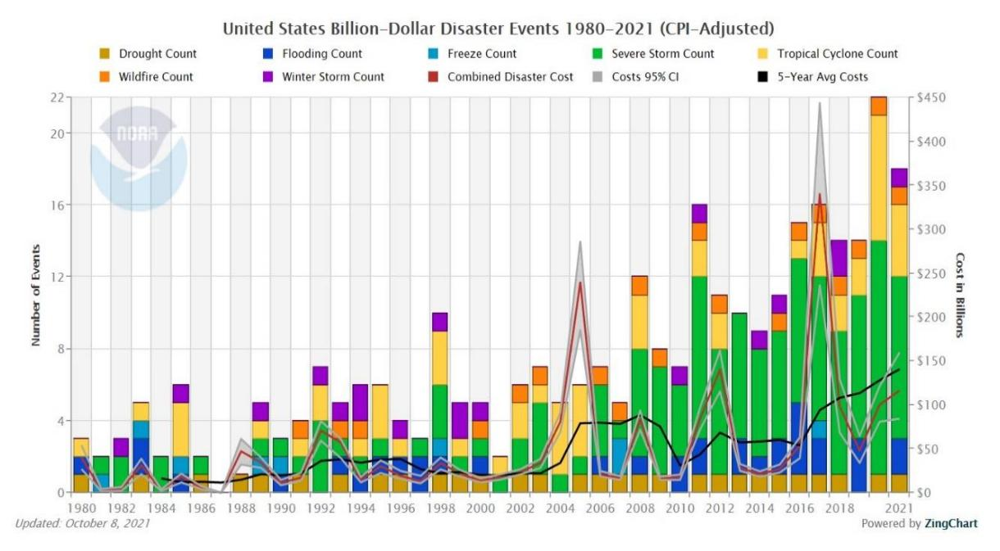

Figure 0.2: USA Billion-Dollar disaster events 1980-2021.

These numbers are astonishingly high and do not look to shrink anytime soon, in fact 2021 is off to a record pace for number of events during the first nine months of any year recorded. During the first nine months there have been a total of 18 separate billion-dollar weather and climate disaster events across the United States of America. The year 2021 in the seventh consecutive year in which 10 or more separate billion-dollar disaster events have impacted the country.

Countries all around the globe are pushing the economies to recover rapidly and are pouring big investments into the energy transition and green economies. The goal is to decarbonize the entire wealth generation and look for the increase of the GDPs with no correlation of emissions, starting from the energy sector to the transportation, industrial, housing and agriculture. For instance, starting off again from the USA, the country is pursuing to cut planet-warming emission by 50-52% below 2005 level by 2030 and to do so the White House has set the climate spending in between \$500 and \$555 billion [4]. Moving instead to Europe's European Green New Deal, the plan is considered to be the lifeline out of the COVID-19 pandemic and inside it, climate change is considered an existential threat to Europe and to the entire world [5]. The goal is to transform the continent into a modern, energy efficient and competitive economy ensuring net zero emissions by 2050 and the decouple of economic growth to the resource exploitation by focusing anyway on the inclusivity of people. To do so the European Commission has allocated one-third of the 1.8 trillion-euro investment from the NextGenerationEU Recovery Plan and the EU's seven-year budget will finance the European Green Deal. Moreover, in Italy a

huge portion of the PNRR, equals to 23.78 billion € is devoted to green technologies and energy transition towards the net zero emissions. Specifically, to electric grid, renewable energy generation, hydrogen and sustainable mobility [6].

Hydrogen is playing here a crucial role and will be at the core of this transition and revolution. In fact, in an integrated energy system, hydrogen can support the decarbonization of the entire industry, transport, power generation and building. The EU Hydrogen Strategy tackles this topic and tries to make this utopia into reality through investments, research and development, innovation and the creation of a new market [7]. This fuel can replace the traditional fossil-based fuels in sectors and fields in which the electrification is not suitable and can provide the form of long-term storage needed to balance the unpredictability of renewables. The priority is to produce it through the exploitation of excess wind and solar energy, with the support to install at least 6 GW of renewables hydrogen electrolysers in the EU and consequently produce one million tons of renewable hydrogen. From 2025 to 2030 then hydrogen aims to become an intrinsic part of the integrated European energy system with the purpose to reach at least 40 GW of renewable hydrogen electrolysers and increase the production by 10 folds. From 2030 on, the idea is to deploy the technology at large scale across all the sectors .

Figure 0.3 displays the Net Zero Emission scenario (NZE) global hydrogen demand by production technology until the year 2030: CCU refers to carbon capture and use for ammonia production and CCS refers to carbon capture and storage option [8].

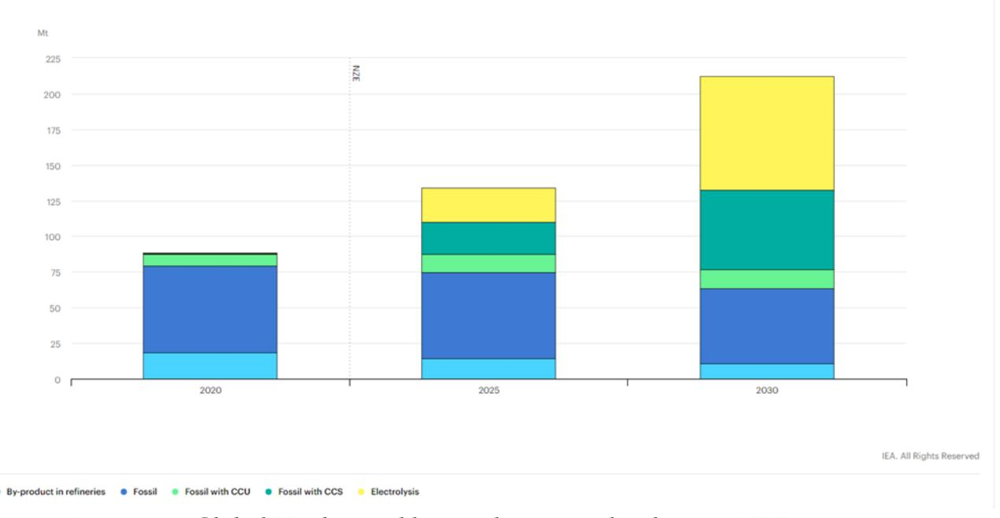

Figure 0.3: Global H2 demand by production technology in NZE 2020-2030.

Currently hydrogen is produced mainly from fossil fuels and resulting in close to 900 Mt of CO2 emissions per year, and the picture here above shows what would be needed to install to reach the Net Zero Emission scenario.

Furthermore, focusing in the transportation sector and especially in the automotive one, with the expansion of the electric vehicle fleet the electric energy demand will definitely spike and the result can be catastrophic for the electric grid. In fact, if many EVs are simultaneously plugged-in to be recharged the instantaneous power request surges and may cause a general blackout. This would be the scenario of a grid not capable of supporting the on-going revolution happening in this field, where the electricity demand to serve EVs is expected to reach at least 640 Terawatt-hours (TWh) by 2030 or even 1130 TWh in the IEA New Policies Scenario [9]. Under the IEA EV30 scenario, the total EV sale is expected to reach 44 million vehicle per year by 2030 with the global stock of electric passenger cars passing 5 million in 2018 and Europe accounting for 24% of the global fleet [10]. Meanwhile the total number of charging points already exceeded 5.2 million at the end of 2018 with the majority of these installations to be private charging points or roughly 90% of the total deployed in 2018 [11].

The global EV stock and its growth is foreseen in Figure 0.4 making evident the expected consequent growing energy demand of this sector [12].

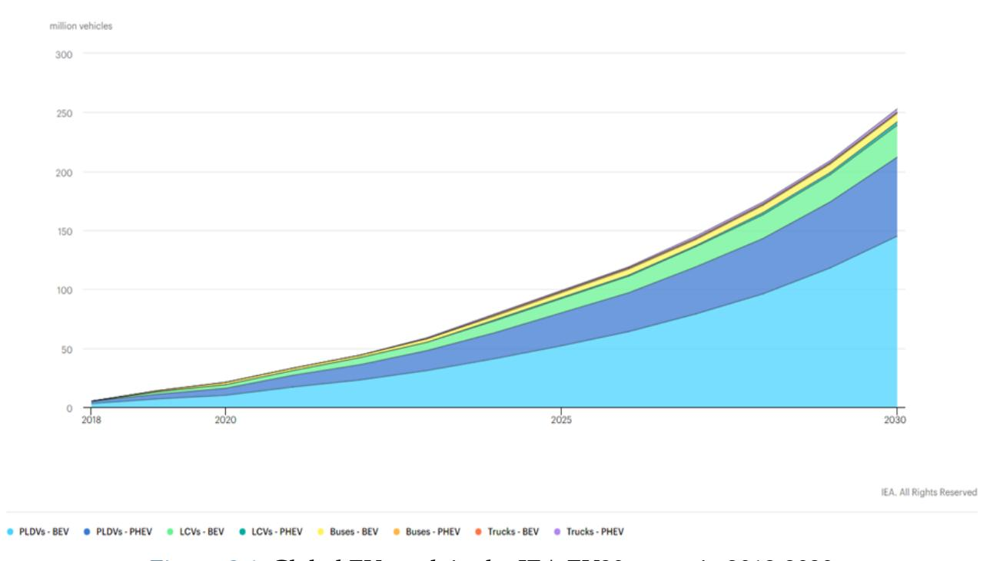

Figure 0.4: Global EV stock in the IEA EV30 scenario 2018-2030.

In the picture are represented with different colors, plug-in hybrid electric vehicles (PHEV), battery electric vehicles (BEV), Passenger Light Duty Vehicles (PLDV) and light commercial vehicles (LCV).

Undoubtedly, this will create a big stress on the grid and generate as just seen, a greater energy demand. For this reason, most of the efforts are now concentrated in distributed power generation which can help to smoothen the loads and their peaks. At the same time, many new technologies, like wind turbines and solar panels became widespread in the last decade, helping to not forget the environmental sustainability. Even though some of these innovations are really promising and guided to reduce emissions and pollution, their further diffusion is more challenging than ever due both to costs, unpredictability and reluctance of people towards what's new, or the so-called NIMBY phenomena. Moreover, it is onerous and requires huge investments to furtherly integrate these renewable techs in the electrical grid, being not dispatchable. Hence intrinsically they cannot stand as baseload power plant due to possible weather-caused unproductivity, implying the necessity of another source of energy to guarantee continuity.

So, a smooth shift between the traditional systems and new ones sounds more than ever necessary, to lower the impact of a rapid change and allow the complete redesign of the energy sector. In this scenario, the Free-Piston Linear Generator technology (FPLG), described in this thesis, seems to be a promising solution to build a bridge between the past and the future, to link in a competitive manner the old and the new, bringing a big improvement to an existing well-established process alike the one occurring inside an internal combustion engine. The higher conversion efficiency is its strong point as well as the possibility to adopt different fuels, aspect which opens the doors for the use of hydrogen and naturally derived fuels. Moreover, its versatility makes it look like a possible way to smoothen the peak power request that EVs and the continuing growth of electricity demand will generate in the future.

The design of the system is quite simple, a piston directly connected to a linear generator such that the movement imposed by the combustion can be exploited directly by the linear electric generator. This thesis is intended to analyze in detail the main aspects connected to this promising technology that have been just briefly summarized above. Specifically, chapter 1 has the purpose to describe the main features providing an overview of components, typologies, configurations and applications, strengths and weaknesses. Chapter 2 and 3 are instead devoted to the presentation of the models that have been implemented to achieve the stable continuous operations and to control of the electric power output. Finally, comments and further future development set the conclusion of the work proposed.

# 1. Overview of the technology

This chapter is intended to show the process that, starting from an ancient concept, the Free-Piston engine (FPE), have brough to the realization of a new technology aiming to play a key role in the future energy scenario of the entire world, the Free-Piston Linear Generator (FPLG).

For this reason, the description of the system's main features is anticipated by a brief historical introduction that provides the state of art of the technology before the growth of interest of the last years. The first patent is indeed close to be 100 years old and consequently many modifications have been already provided to the original concept [13].

After this brief introduction, nowadays architectures are presented, highlighting the main characteristics of the components such as the combustion chamber, the rebound device and the linear electric machine. The technology is analyzed in detail with a specific focus on the possible different choices that can be made in the design phase. As it will be clear in the following, there are several degrees of freedom that must be considered, this gives an idea of the complexity of optimization of the system for each application and at the same time of its potential.

An important section is then dedicated to the description of the main configurations that FPLGs can assume, reporting not only the most diffused but also the unusual ones. Even though, indeed, the single-piston, the dual-piston and the opposed-piston architectures are the most common, there are also some cases where specific requirements have led to different architectures.

Although each different single configuration has its peculiar characteristics, the following two sections try to summarize which parameters should be considered as general terms to control the system and to achieve stable operation. Furthermore, the strengths and weaknesses of the FPLG are pointed out to give a complete overview of the system's potential.

Finally, in the last two paragraphs of the chapter, closing the circle, the existing prototypes and the possible applications are presented, showing in this way, the

progress that this technology has undertaken from the past and the further steps that will may be able to perform in future.

## 1.1 Historical background

Despite the current growth of interest, the history of the Free-Piston Generator has been quite turbulent. Raùl Pateras Pescara (1890 – 1966) is usually credited with the invention of the Free-Piston Engine (FPE) with its patent dated in 1928. His original patent describes a single-piston spark ignited air compressor and tries to protect a vast number of applications suitable for the Free-Piston technology. The Argentine engineer developed also a diesel combustion Free-Piston air compressor and in 1941 patented a multi-stage Free-Piston air compressor engine.

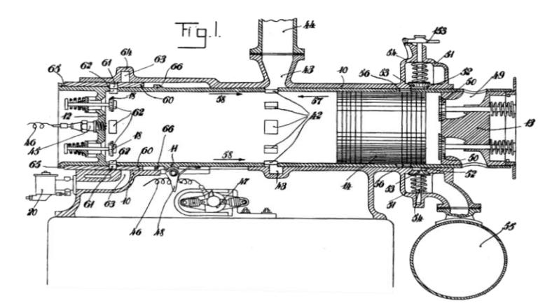

Figure 1.1: Pescara's original patent [14].

As in the actual version of this engine, the motion of the piston in the original concepts was not controlled by the position of a rotating crankshaft alike in conventional internal combustion technologies, but it just depends on the forces acting upon it. This led at the time to some major advantages but required an active control of the piston motion, thus making the system difficult to realize, especially for that historical period. Indeed, for several years, the only really successful Free-Piston concept has been the air compressor, shown in Figure 1.2, which was essentially self-regulating, hence easy to implement and at the same time able to work with good performances without vibrations.

The following period was characterized by sporadic applications of the technology and the device never became a commercial success, even though no reports of flaws and misfunctioning could be found at the time.

In the 40's, as reported in Figure 1.3, the major field of application resulted to be compressors used to run gas turbines for the marine propulsions and for stationary applications. One of the most remarkably successful engines was the one

manufactured by SIGMA (Société Industrielle Générale de Mécanique Appliquée) in France in 1944, diesel-powered for marine and industrial applications based on Pescara's patent. Also Ford and General Motors in the USA have shown interest and developed many vehicles prototypes with these kinds of engine on a small scale.

The ups and down of the technology continued till in the early 60's when gas turbines and conventional internal combustion engines (ICE) became mature enough to fade the interest in FPE.

With the beginning of the modern era and the possibility of modern computers to allow control methods which are accurate and fast, the interest in this technology has renewed once again. The advantages seem to be very promising also considering the increasing restrictions on emissions and governments pushing to reduce the dependency on fossil fuels and increase the efficiency. Many companies are currently researching in this field, especially in the automotive sector, but unfortunately, the mass market and production seems far from being a reality [13].

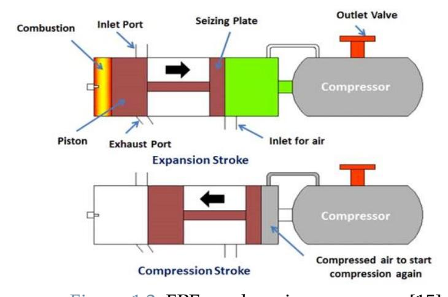

Figure 1.2: FPE used as air compressor [15].

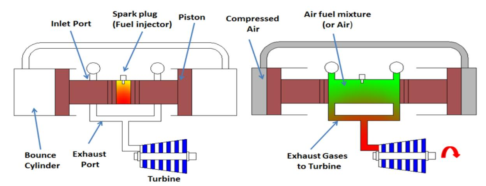

Figure 1.3: FPE used to run Gas Turbines [15].

# 1.2 Components

The Free-Piston Linear Generator (FPLG) is a new concept of energy conversion system which is mainly composed by a combustion chamber, a linear electric machine and a rebound device. The operation of the system is dictated by the equilibrium of the forces that each of these elements exerts on the central piston.

The combustion chamber works like the traditional internal combustion technology. Hence, the piston moves from the Bottom Dead Center (BDC) to the Top Dead Center (TDC), the energy released by the combustion slows it and reverses its motion. However, there is also a rebound device, usually a mechanical or gas spring, which bounces the piston back to the TDC releasing the energy absorbed during the expansion stroke of the engine. Furthermore, the presence of the bounce chamber is also required to guarantee a smooth and stable trajectory of the piston even though some combustion issues occur, such as misfires.

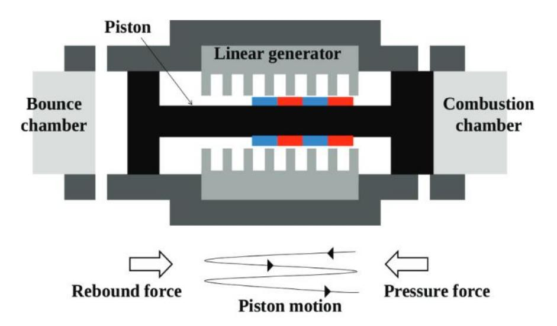

Figure 1.4: FPLG's common architecture [16].

The resultant simple, crankless and plain design, displayed in Figure 1.4, allows to achieve on paper an efficiency never seen in an internal combustion engine, in the range of 40-50%. Nevertheless, the real efficiency of conversion varies deeply based on the selected architecture and engineering choices.

What it's instead clear from the beginning is the great versatility and flexibility of the system, since the several degrees of freedom in the design phase lead to an important number of possible fields of application. Thus, here in the following, the main components will be analyzed in detail with a specific focus on the different design choices and technological aspects. The first element considered is the combustion chamber, then the rebound device and finally the electric machine.

#### 1.2.1 Combustion chamber

The combustion chamber is the part of the Free-Piston Linear Generator where the fuel is ignited to move the piston and to convert the chemical potential energy into thermal and then mechanical power. Figure 1.5 shows the general architecture of a FPLG, reporting on the right side the combustion chamber with its typical elements like the scavenging port, the exhaust valve, the fuel injector and the spark plug.

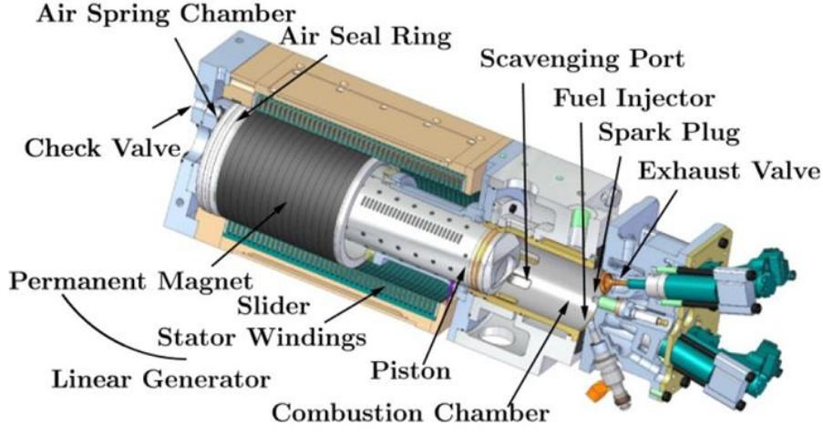

Figure 1.5: FPLG with focus on the combustion chamber [17].

The combustion chamber's layout is generally the result of several engineering considerations, first of all is the type of combustion process. For Free-Piston engines, as for traditional engines, there are several possibilities, both conventional, like Spark Ignition (SI) and Compression Ignition (CI), and advanced, like Homogeneous Charge Compression Ignition (HCCI) [18].


Figure 1.6: Traditional combustion types.

- Spark Ignition Engine (SI), as the name says, is a type of engine in which the ignition of the air-fuel mixture inside the cylinder is caused by a spark. This type of combustion has been considered in many FPLGs concepts because the spark timing influences the position of the TDC, but also the peak piston velocity and the peak in-cylinder gas pressure, so, it is an effective and practical variable which can be considered to develop a stable control of the system.
- In the *Compression Ignition Engine (CI)*, only air enters into the cylinder during suction stroke, then in a second time the fuel in injected into the chamber. As a consequence of the heat generated by the compression of the air, the fuel ignites itself. There are only few examples of Free-Piston systems with CI since, in the case of a Free-Piston engine instead of a traditional one, the power expansion stroke after TDC is faster, thus the in-cylinder pressure decrease is quicker, the duration of mixing-controlled combustion phase is shorter and the total energy release is lower. Consequently, with the same amount of fuel, the energy exploitable results lower meaning fewer electricity generation. [19]
- Homogeneous Charge Compression Ignition Engines (HCCI) are being investigated as an alternative to conventional SI and CI combustion types, such to combine the high thermal efficiency of CI with the low exhaust emissions of SI engines. In HCCI, a premixed air-fuel charge is compressed until the point of autoignition which is governed by temperature and pressure inside the cylinder. So, compared to SI combustion that is initialized by a spark and CI combustion that starts with fuel injection, there is no direct control of ignition timing. So far, this last aspect has prevented its diffusion since it imposes a narrowing of the operating conditions. Control is even more challenging during cold-starts since the cylinder temperature is different from the steady-state operating one, therefore, an HCCI engine is usually started in SI mode. However, several studies indicated that if the compression ratio could be varied in traditional ICEs, optimization of HCCI would be achieved, expanding its speed and load range of operation, thus FPLGs seem to offer a perfect architecture for this combustion type.

The variable compression ratio is also the reason why FPLG has an additional degree of freedom compared to traditional internal combustion engine: fuel flexibility. With the absence of the crankshaft mechanism, the piston's movement has no physical constraint at BDC and can achieve different positions of the TDC, thus the pressure ratio inside the cylinder can be adapted to the existing conditions just acting on the control system.

Several experiments are being performed with different types of fuels, however they are mainly related to HCCI since SI and CI engines have already reached a good

level of stability and performances with the adoption of gasoline and diesel fuels respectively.

|                   | Diesel | Hydrogen | Gasoline | Natural Gas |
|-------------------|--------|----------|----------|-------------|
| f [Hz]            | 30.10  | 32.25    | 33.33    | 36.96       |
| $CR_{cc}[-]$      | 19.68  | 28.84    | 31.81    | 43.16       |
| P[kW]             | 20.28  | 20.36    | 22.28    | 23.8        |
| $\eta_i[-]$       | 0.5413 | 0.5851   | 0.5761   | 0.5911      |
| $L_{stroke} [mm]$ | 127.37 | 131.55   | 132.41   | 134.61      |
| $P_{max}[bar]$    | 81.9   | 113      | 128.5    | 181         |
| $T_{max}[K]$      | 1710   | 1750     | 1800     | 1850        |

Table 1.1: Simulations with different fuels.

Table 1.1 [20] is an example of the simulations that are being executed. Fredriksson and Denbratt indeed studied a HCCI Free-Piston working with four different fuels: diesel, hydrogen, gasoline, and natural gas. They found that natural gas gave the highest compression ratio ( $CR_{cc}$ = 43.16) and indicated efficiency ( $\eta i$ = 0.5911) of all the four.

Another important choice to make when designing the combustion chamber is to set a two or four-strokes operation. In traditional engines, indeed, selecting the twostrokes option, the piston completes an entire cycle of intake, compression, expansion and exhaust in just one revolution or one turn of the crankshaft. On the other hand, with a four-stroke engine, there are two turns per thermodynamic cycle, resulting in a higher efficiency and lower emissions.

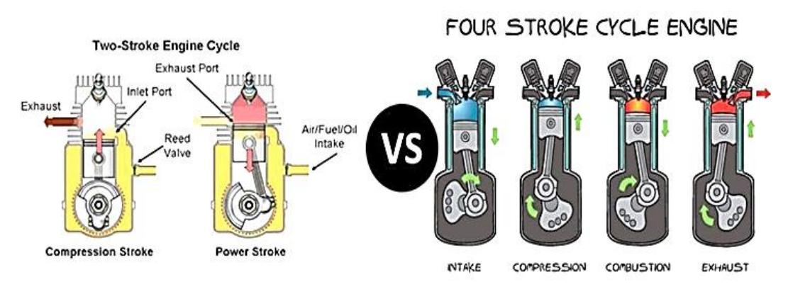

Figure 1.7: Two vs Four-stroke engines [21].

In a Free-Piston generator, even if there is no crankshaft mechanism, the distinction between two and four-stroke engines is still possible, just substituting the concept of turns with the back-and-forth movement of the piston between the BDC and the TDC. Consequently, considering this similitude, it's possible to say that the majority of the FPLG concepts present in literature are two-stroke engines [18]. The reason

behind this, it's the need of a combustion event per cycle. If indeed the engine was a four-stroke type, after combustion, the piston would be able to revert to the TDC and to eject the exhaust gases thanks to the rebound device, but it would not have enough energy for the rest of the movement related to the intake and compression phase resulting in an unstable operation and ultimate shut down. Some attempts have been made to adopt the linear generator as motor during the intake and compression strokes, but, even if the efficiency increases, the operation range reduces and the same happens for the power density.

Despite the choice of a two-stroke FPE is quite obliged, the positive aspect is that the gas exchange, or scavenging, is similar to conventional two-stroke engines, thus, as shown in Figure 1.8, it can be classified in three types: *Uniflow, Loop* and *Crossflow scavenging*. [18]

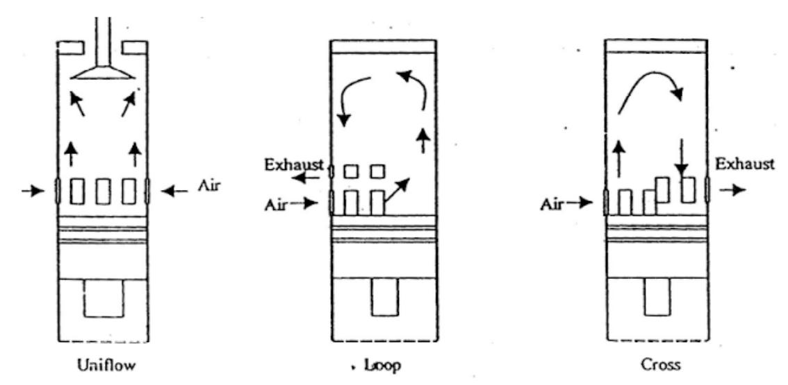

Figure 1.8: Scavenging's typologies [22].

- *Uniflow scavenging* is a design in which the fresh intake charge and exhaust gases flow are in the same direction. This requires the intake and exhaust ports to be at opposite ends of the cylinder, so that, the fresh charge enters through the ports near the bottom of the cylinder and flows upwards, pushing the exhaust gases out through poppet valves located in the cylinder head.
- Loop scavenging arrangement instead presents inlet ad exhaust port placed on the same side of the engine cylinder. This type of scavenging uses carefully designed transfer port (inlet) to loop fresh air towards the cylinder head on one side and pushes the burnt gas down out of the exhaust port installed just above the inlet.
- Crossflow scavenging utilizes intake and exhaust ports that are placed on opposite sides of the cylinder. The fresh air that enters into the engine's

cylinder is deflected upwards by a deflector and pushes the exhaust gases down on the other side.

#### 1.2.2 Rebound device

Since FPLGs lack of crankshaft mechanism, they require the adoption of a rebound device to revert the movement of the piston when it reaches the BDC and to let the generator work both in the expansion and compression phase.

Usually, gas springs are the favorite option because they can vary their stiffness allowing a variation of the piston stroke and consequently of the compression ratio. However, Free-Piston engines often operate at single frequency, therefore also metal springs can be taken into account as rebound devices. In addition, as it will be shown later on, it's important to highlight the dual-piston case where the combustion chamber on one side acts as rebound device for the opposite side.

Focusing now on the gas spring, being it the most common, it's evident that it behaves as a buffer or energy storage system. When indeed the medium in the gas spring is compressed, the kinetic energy of the piston is converted to potential energy which is then released back when the gas spring expands. The amount of energy being stored is modified by changing the stiffness. This operation can be achieved acting on two possible parameters: the mass of the medium or its volume [23].

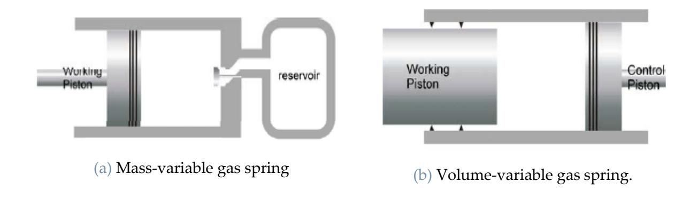

Figure 1.9: Possible gas spring layouts.

Figure 1.9(a) illustrates the operation of a mass-variable gas spring. In order to vary the mass of air during operation, a valve is installed in the cylinder head of the gas spring. This valve is opened only if the pressure inside the rebound device is at its minimum thus around the TDC of the engine and the opening causes the inner pressure of the gas spring cylinder to adapt to the reservoir's pressure.

Figure 1.9(b) instead shows a volume-variable gas spring. In addition to the working piston of the generator, there is also a second piston called control piston. Compared to the working piston, the control piston moves slowly and only when a change of the operating point is required. The main drawback of this layout is that gas losses cannot be compensated by refilling the gas spring as in the previous case. This issue requires inevitable changes in the constructive details of the system to guarantee reliable operation, massively influencing the efficiency of the gas spring.

#### 1.2.3 Linear Electric Machine

The Linear Electric Machine (LEM) is the key element of the Free-Piston Linear Generator since it allows the conversion of the piston's kinetic motion into electric energy. It is required to be compact, robust, light and, at the same time, to have a good efficiency.

Linear electric machines are basically the linear unfolding of traditional rotational machines as shown in Figure 1.10. The result of this operation leads to different possible configurations listed below.

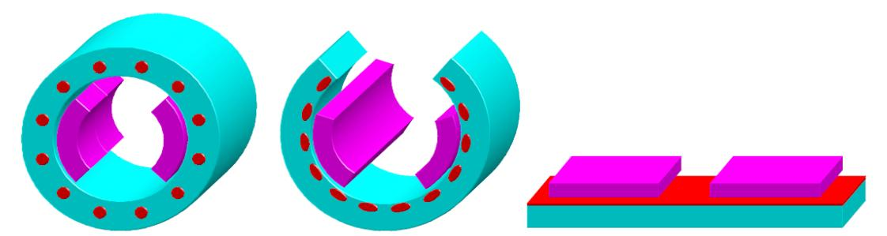

Figure 1.10: Linearization of a rotating machine [24].

• *Single-sided*. This is the simplest configuration since it is obtained just by cutting stator and rotor of a traditional machine and reporting them on a plane. This machine is characterized by the magnetic interaction on just one side of stator and mover.

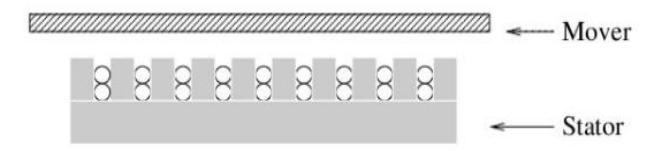

Figure 1.11: Single-sided LEM [25].

• *Double-sided*. This configuration is obtained cutting on a plane that passes through the center and then arranging the two obtained halves on planes parallel to the cutting one. In this kind of machine, the magnetic interaction occurs on both the sides.

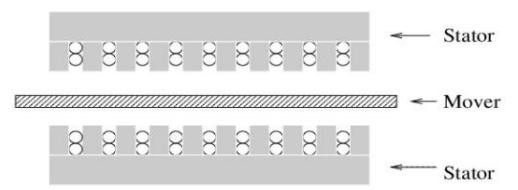

Figure 1.12: Double-sided LEM [25].

• *Multi-sided*. Further development of the previous cases where the interacting sides are more than two. This configuration has been introduced since it approximates the tubular shape and it is reported to have similar performances but less constructing difficulties of the tubular shape when four-sides are considered. [26]

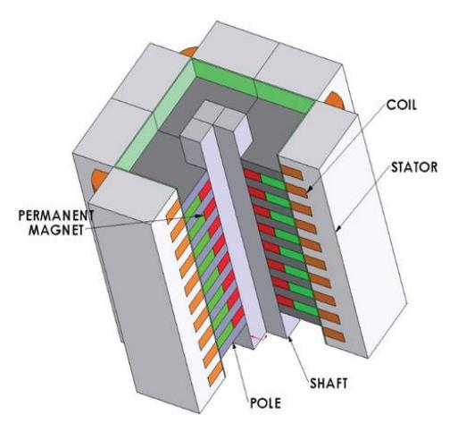

Figure 1.13: Four-sided LEM.

• *Tubular*. The procedure to obtain this configuration is similar to the one described for the single-sided but once the two halves are generated, they are rolled up in order to have a cylindrical shape. It can be seen as a multi-side configuration with infinite sides.

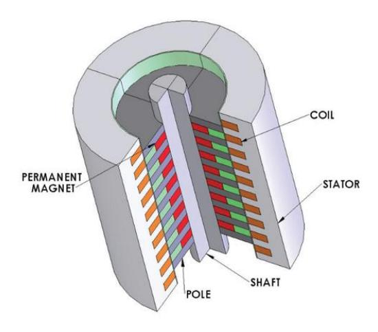

Figure 1.14: Tubular LEM [26].

Despite the configuration, a series of electromagnetic effects persist as direct consequence of the linear structure: *longitudinal edge effect, transversal edge effect* and *normal forces*. [24]

- Longitudinal edge effect is due to stator and mover's finite lengths: this indeed creates local distortions of the magnetic induction field especially at the edges and can be the origin of forces that reduce the machine's performances like cogging forces. The consequences are anyway less relevant when the machine is long and they can be furtherly reduced with a peculiar shaping.
- *Transversal edge effects* are caused by different lengths of stator and mover, anyway they have usually minor entity particularly if the tubular shape is adopted.
- *Normal forces* could be generated by the magnetic interaction of the statoric and swinging component, appearing as attraction or repulsion forces. The main risks connected are creeps and air-gap enlargements.

Several different typologies of linear electric machines have been presented through the years, but the actual state of art shows only solutions adopting Permanent Magnets (PMs). Therefore, rather than focusing on the differences among each type of LEM, the spotlight will be on the specifications of Permanent Magnets Linear Electric Machines (PMLEM). An example of PMLEM is shown below in Figure 1.15.

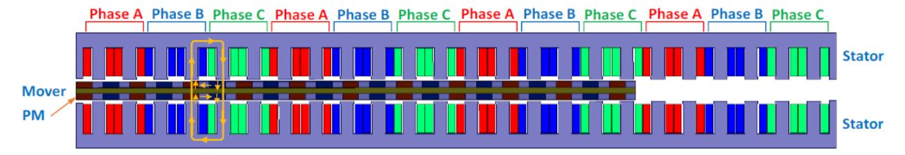

Figure 1.15: PMLEM with magnets on the mover and coils on the stator [27].

The operating principle is electromagnetic induction like in traditional rotating machines. Additionally, applying permanent magnets excitation leads to higher forces and power densities, eliminating even brushes, slip rings and copper losses of field windings. The adoption of PMs also allows to reduce the mass of the system since structural constraints can be absolved adopting lighter materials like titanium or aluminum.

There are several aspects which should be considered when designing a PMLEM [28]:

• *Flat or tubular structure*. The machines may be flat (it can be designed with different number of sides) or tubular. As seen before, if tubular is adopted, the edge effects are reduced owing to the closing form of the cylindrical geometry.

Furthermore, compared with flat machines, the utilization of PMs is improved and the copper losses, the leakage inductance and the radial forces exerted on the bearings are decreased. The main problem of the tubular structure is anyway the production cost.

- *PM on stator or mover*. Permanent magnets are usually assembled on the mover since this solution reduces the complexity of the system. With this configuration indeed, coils of each phase are not placed on the moving element and their connection with external electrical circuits is straight forward. Holds anyway true that this structure is subject to a higher risk of degaussing since magnets are mounted on the same piston that interacts with the combustion chamber at high temperatures. Indeed, during normal operation, the heat flux coming from the combustion chamber can bring the PMs to exceed the Curie temperature, i.e. the temperature above which the magnetic properties of a material are lost and this can result detrimental for the whole system that it is not able to work properly anymore.
- Long or short mover. Usually the mover is shorter than the stator since this allows to optimize the use of PMs that are rather expensive. If the length of the swinging element exceeds the one of the statoric part indeed, thus having more PMs, the efficiency of the system does not increase since some magnets do not interact with the statoric coils generating no magnetic flux.
- Longitudinal or transverse flux. According to the disposition of the magnetic flux loop with respect to the direction of motion, electric machines can be categorized into Longitudinal Flux Machines (LFM) and Transverse Flux Machines (TFM).

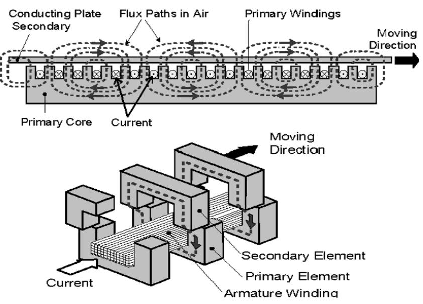

Figure 1.16: Longitudinal (upper) and Transverse (bottom) Flux Machines [29].

- ➤ In *LFMs*, as shown in the upper picture of Figure 1.16, the loop of the useful flux lies on the longitudinal or parallel plane with respect to the direction of motion. These machines are the conventional types, and they have generally distributed or concentrated windings.
- ➤ In *TFMs*, instead, as shown in Figure 1.16 at the bottom, the loops of the working flux lie on a plane transverse or perpendicular to the direction of motion and they have generally torus or ring-shaped windings. Also TFMs can be manufactured both with buried or surface mounted PMs, but the former is usually preferred due to lower leakage flux and better performance.

An important aspect that should be considered in LFM's design is the magnetization direction of PMs: it can indeed be *axial*, *radial*, *Halbach* and *quasi-Halbach* as shown in the upper portion of Figure 1.17. The bottom one instead is reported to give an idea of the potentiality of the Halbach array as well as the quasi-Halbach one in terms of generated magnetic flux density, especially in proximity of the magnets themselves.

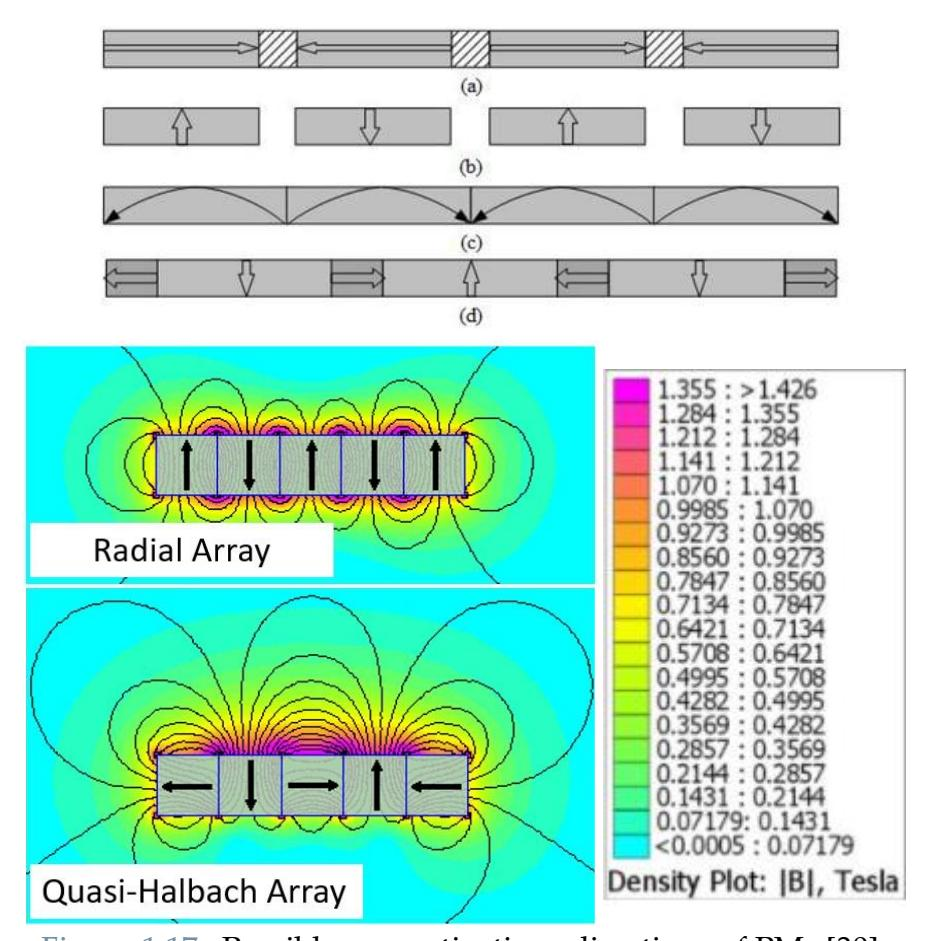

Figure 1.17: Possible magnetizations directions of PMs [30].

Going specifically in detail of each array configuration:

- (a) *Axial*. In axially magnetized structures, the permanent magnets are buried and magnetized parallel to the air gap and there are also ferromagnetic pole-pieces separating two opposing neighboring magnets.
- (b) *Radial*. In radial magnetization, the PMs are surface-mounted, a non-ferromagnetic space is considered between them, and the direction is perpendicular to the air gap. In this case, the yoke is ferromagnetic and the flux flows through it.
- (c) *Halbach*. A Halbach array is a special arrangement of permanent magnets that enhances the magnetic field on one side of the array while cancelling the field to near zero on the other side. It is reported to generate a higher and more sinusoidal air-gap flux density than the previous ones.
- (d) *Quasi-Halbach*. This is just a development of the Halbach configuration which simplifies the manufacturing and reduces the costs.
- *PMs materials*. At the actual state of art, NdFeB and SmCo alloys are being considered. Even though NdFeB alloys feature lower operating temperature (80-200°C vs up to 250°C) due to the lower Curie temperature (310-350°C vs 720°C)[24] and lower resistance to chemical corrosion, they are usually preferred since difficulties in Cobalt's extraction and processing makes SmCo alloys more expensive.
- *Iron or air-cored structures*. The induced voltage amplitude and hence the power output when the stator coils are wrapped around an iron element is considerably higher since iron has lower reluctance than air. Moreover, the heat dissipation is harder in air-cored machines due to the lack of iron in the stator. [31]

# 1.3 Architectures and configurations

Many different layouts have been proposed for the Free-Piston Linear Generator. They usually present the same basic elements just discussed in the previous section (combustion chamber, rebound device and linear machine), but the order and the number changes significantly depending on the configuration. Three are the main configurations that have been presented in literature and will be described in detail: single piston, dual-piston and opposed-piston. Some atypical architectures will be presented as well for sake of completeness.

## 1.3.1 Single-piston

The single-piston configuration represents the simplest architecture that can be realized for a FPLG. There is only one combustion chamber and one rebound device

with the linear machine in the middle. When the air-fuel mixture is ignited inside the cylinder, the piston is pushed towards the metal or gas spring on the other side and then, when the BDC is reached, it is pushed back to the initial position. The mover's back and forth movement enables the permanent magnets on it to interact with the coils present on the stator and generate electric power.

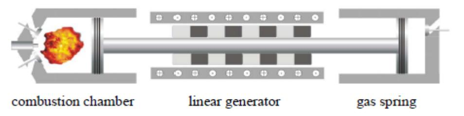

Figure 1.18: Single-piston configuration [32].

This type of layout and its simplicity allow to reduce the costs and to enhance the efficiency and, in the meanwhile, to realize an accurate control over the piston motion and the operating frequency. However, there can be issues related to noise and vibrations caused by the continuous swinging movement of the piston and the imbalance of the forces inside the assembly. Moreover, the power density can be lower compared to other configuration since the single-piston FPE cannot have more than a single combustion event per cycle.

## 1.3.2 Dual-piston

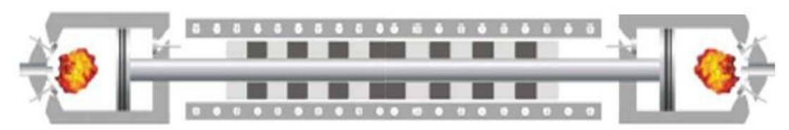

Figure 1.19: Dual-piston configuration [32].

The dual-piston configuration is just a development of the single-piston idea. Indeed, the piston is still oscillating inside the electric generator but between two opposite combustion chambers. Each of them acts as rebound device for the other and the ignition process in one cylinder provides the energy required by the compression stroke of the opposite chamber.

The absence of a proper rebound device makes the combustion's role crucial since it both pushes and reverts the motion of the piston. It can be easier to maintain the reciprocating piston motion compared to a single-piston, but the movement becomes more sensitive to misfires and other problems typical of the combustion process.

Anyway, the main advantages of this layout are related to the increased power density. Having two combustion events per cycle, the piston is pushed back to its

initial position with a higher force with respect to the one imposed by the rebound device, increasing its acceleration and average speed. Obviously, this positive aspect is mitigated by the additional fuel consumption for the combustions and consequently by the additional emissions.

## 1.3.3 Opposite-piston

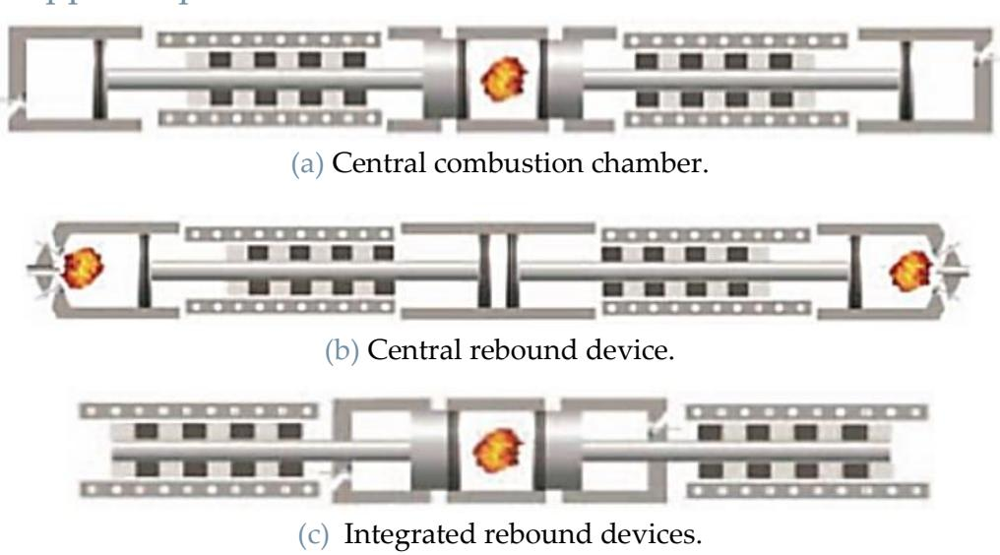

Figure 1.20: Opposite-piston configurations [33].

An opposite-piston FPLG consist of two pistons that share a common central cylinder. Three main architectures are possible as shown in Figure 1.20: central combustion chamber, central rebound device and integrated rebound devices. In the first case, the main advantage is the possibility to reduce the heat transfer losses during combustion since the cylinder head is eliminated. The second and the third layouts, instead, can be seen as attempts to increase the compactness of the system: both the configurations share at least one element and this allows to enhance the power density compared to the adoption of two separate single-piston engines.

Despite the differences among the three architectures, the adoption of two pistons instead of one provides a nearly vibration-free operation. This also tolerates a larger site for the linear machine, leaving more space to deploy a more powerful LEM increasing consequently the electric power generated or increasing the compactness of the system. Anyway, if the power is increased, the weight of the system increases as well as the frictional losses. Moreover, the control of both the pistons becomes crucial and difficult since their motions need to be synchronized. The control is even more challenging in the second configuration where a misfire in one of the combustion chambers could result in the loss of synchronism on the shared rebound device.

## 1.3.4 Other configurations

Beside the typical architectures, different layouts have been presented in the last years by research groups all over the world. Some of them are shown in the this section toghether with a brief description of their peculiarities.

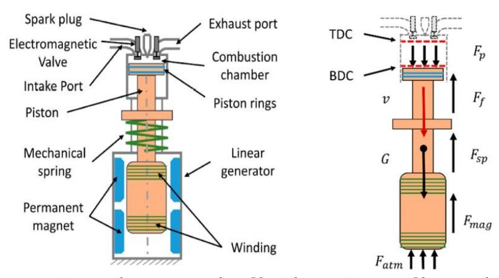

Figure 1.21: Vertical prototype by Chi Zhang, Feixue Chen and others [34].

In [34], Chi Zhang, Feixue Chen and others have studied and realized the prototype of a vertical FPLG shown in the left picture of Figure 1.21. The combustion chamber is quite common despite the vertical arrangement since it's a spark ignited two-stroke engine. The linear generator and the rebound device are instead unusual: the first is a single-phase moving-coil motor with permanent magnets on the stator, while the latter is composed by a set of mechanical springs in the center.

The piston trajectory is still set by the resultant force acting on the piston but the control system needs to be revised to consider the additional contribution of gravity that is facilitating the movement towards the BDC but playing against the compression stroke of the engine which is pointing towards the TDC. The picture above on the right is showing the movement towards the bottom dead center: combustion  $(F_p)$  and gravity (G) are counterbalanced by friction  $(F_f)$ , linear electric generator  $(F_{mag})$  and rebound devices  $(F_{sp})$  and  $(F_{sp})$  and  $(F_{sp})$  and  $(F_{sp})$  and  $(F_{sp})$  and  $(F_{sp})$  and  $(F_{sp})$  and  $(F_{sp})$  and  $(F_{sp})$  and  $(F_{sp})$  and  $(F_{sp})$  and  $(F_{sp})$  and  $(F_{sp})$  and  $(F_{sp})$  and  $(F_{sp})$  and  $(F_{sp})$  and  $(F_{sp})$  and  $(F_{sp})$  and  $(F_{sp})$  and  $(F_{sp})$  and  $(F_{sp})$  and  $(F_{sp})$  and  $(F_{sp})$  and  $(F_{sp})$  and  $(F_{sp})$  and  $(F_{sp})$  and  $(F_{sp})$  and  $(F_{sp})$  and  $(F_{sp})$  and  $(F_{sp})$  and  $(F_{sp})$  and  $(F_{sp})$  and  $(F_{sp})$  and  $(F_{sp})$  and  $(F_{sp})$  and  $(F_{sp})$  and  $(F_{sp})$  and  $(F_{sp})$  and  $(F_{sp})$  and  $(F_{sp})$  and  $(F_{sp})$  and  $(F_{sp})$  and  $(F_{sp})$  and  $(F_{sp})$  and  $(F_{sp})$  and  $(F_{sp})$  and  $(F_{sp})$  and  $(F_{sp})$  and  $(F_{sp})$  and  $(F_{sp})$  and  $(F_{sp})$  and  $(F_{sp})$  and  $(F_{sp})$  and  $(F_{sp})$  and  $(F_{sp})$  and  $(F_{sp})$  and  $(F_{sp})$  and  $(F_{sp})$  and  $(F_{sp})$  and  $(F_{sp})$  and  $(F_{sp})$  and  $(F_{sp})$  and  $(F_{sp})$  and  $(F_{sp})$  and  $(F_{sp})$  and  $(F_{sp})$  and  $(F_{sp})$  and  $(F_{sp})$  and  $(F_{sp})$  and  $(F_{sp})$  and  $(F_{sp})$  and  $(F_{sp})$  and  $(F_{sp})$  and  $(F_{sp})$  and  $(F_{sp})$  and  $(F_{sp})$  and  $(F_{sp})$ 

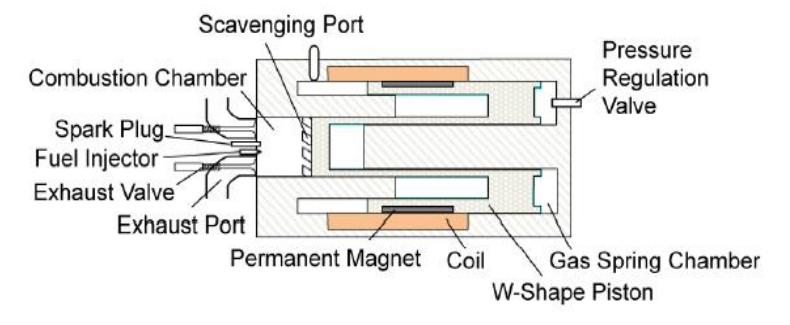

Figure 1.22: Toyota's prototype.

Toyota research group [35] has instead focused the attention on a "W-shape" Free-Piston engine, the one shown in Figure 1.22. It's a double-piston system where the movers of the linear generator are mounted on the periphery of a central hollow structure. The idea behind this architecture will be explained in detail in the following parts but is here reported just to point out the main advantages. These are related to the larger area of the gas springs and thus lower pressures required inside them, to the easier implementation of a cooling system thanks to the hollow central space and to the greater distance between combustion and permanent magnets which prevents degaussing caused by heating.

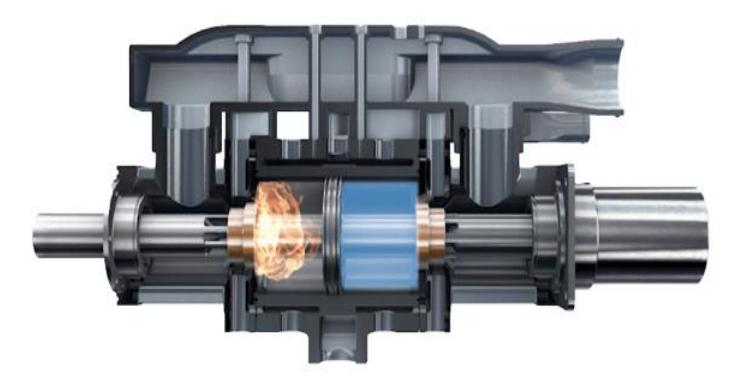

Figure 1.23: Aquarius Prototype.

In conclusion, the concept developed by the Aquarius Engines [36], a company based in Israel, is another variation on the theme. Also this solution will be furtherly detailed, but it's possible to note that the main advantage is linked to the compactness. Indeed, the central cylinder is alternatively experiencing a combustion event in one of the two halves, the compression stroke of one side corresponds to the expansion stroke of the other, leading to a reduction of the space occupied with respect to a dual or opposite-piston configuration.

# 1.4 Parameters and control logic

So far the discussion has permitted to understand the great variety of options available for the layout of the generator both in terms of components and architectures. Now, this section aims to individuate which parameters should be considered to achieve a stable operation of the system and which are the main control logics adopted in models and prototypes. As already anticipated in the introduction, each different configuration of the FPLG has peculiar characteristics which makes it difficult to discuss each case one by one, instead of a detailed analysis a general overview will be provided.

Before moving to the most influential parameters, one consideration is required: as seen in the historical introduction, the technology has been around for about a century, but it has never become a commercial success and it is still not present on the market. This aspect has been associated by several papers ([13],[37],[38]) to the difficult implementation of the control logic. Specifically, the absence of the crankshaft and the inertia intrinsically linked to this component for traditional Internal Combustion Engines (ICE), makes it hard to predict the path along which the piston will move. Indeed, in traditional ICE a flywheel is present to correct and smooth unwanted spikes of motion. Moreover, it also acts as reservoir of kinetic energy giving back the work absorbed during the expansion into the compression stroke, so that the piston is able to reverse its motion towards the TDC without other external force contributions. Thus, the replenishment of this missing element is crucial in the Free-Piston engine, entrusting the control system the fundamental role of providing the stable continuous operation of the device. Indeed, not being constrained by the crankshaft mechanism, the piston would overcome the limits imposed by the TDC and BDC if the dynamic equilibrium of the forces is not respected and this can be detrimental, meaning the complete failure and breakdown of the system.

After this necessary observation, it's now possible to move to the analysis of the main parameters that affect not only the piston kinematics but also the overall efficiency of the system. The parameters are essentially three:

• *Compression ratio*. The compression ratio (CR) is a number defined as the ratio between the volumes inside the combustion chamber at the BDC and at the TDC. Similarly, when a gas spring is adopted as rebound device, it is also defined a compression ratio for it, but in this case, the terms at numerator and denominator are flipped in order to keep the value greater than one.

One of the main advantages of the FPLG with respect to traditional internal combustion engines is the possibility to change this parameter without any hardware modification and just acting on the software or control system. This feature leads to a great flexibility not only in the engine's design phase but even during operation, giving the chance to exploit different fuels. Moreover, the higher the compression ratio, the higher the thermal efficiency of the combustion chamber since the piston remains for a longer period near the TDC. Anyway, in a spark ignition engine, once the CR increases both pressure and temperature change accordingly, hence the auto-ignition limit of the fuel can be reached and the engine may be damaged by the unexpected and uncontrolled combustion. Compression ignition engines have a clear advantage in this sense since they can work with higher CR without any relevant issue. [37]

• *Piston's stroke and velocity*. Both these parameters have a great influence on the system's operation. Even a small stroke variation can lead to a big change of the compression ratio and of the piston's velocity. Consequently, the power generated changes as well as the efficiency. The bigger the stroke, the faster the mover, having more space to accelerate, resulting in a greater equivalent generator force and thus higher electric power generation. At the same time, the frictional losses are proportional to the velocity, dissipating in this way a more relevant share of energy.

It's anyway important to note that the trajectory described by the piston in a FPLG is slightly different from a traditional internal combustion engine, as it's clear in the picture below.

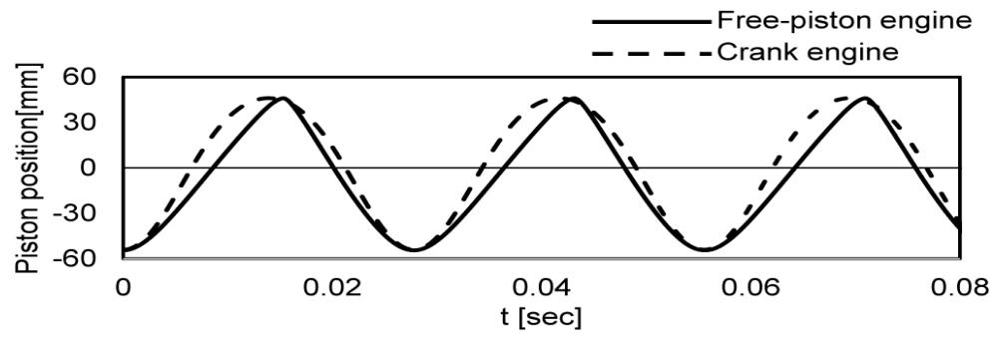

Figure 1.24: Piston trajectory in Free-Piston engine and Crank engine [37].

The Free-Piston engine indeed has a faster expansion stroke, but a slower compression phase. The acceleration is higher around the TDC, aspect which reduces the residence time at elevated temperatures and lowers heat transfer losses during combustion. However, the increased piston acceleration during the expansion stroke can reduce the combustion efficiency because of fast expansion and cooling of the working fluid. [19]

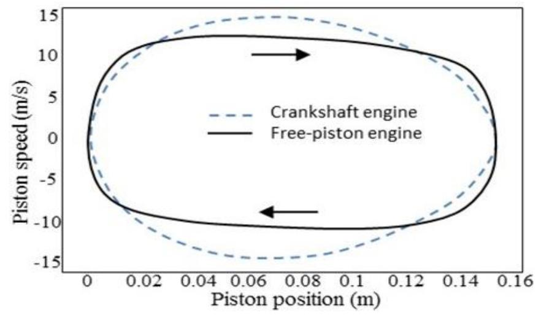

Figure 1.25: Piston speed in Free-Piston engine and Crank engine [37].

The different acceleration is made even more evident in Figure 1.25 which reports the speed of the piston in one cycle both for the Free-Piston and the traditional engine.

• Moving mass. Since the mover is the only component swinging between the TDC and the BDC, its mass has a crucial influence on the inertia of the system. Indeed, the lower the mass, the higher the acceleration of the piston. The consequences on power and efficiencies are opposite, since, being the average speed higher, the same is true for the electric power but, as just seen above, being the piston for less time near the TDC, the combustion can be too fast and the thermal efficiency is reduced. Anyway, technological constraints require a minimum weight of the piston and, usually, the lower the mass, the higher the cost since lighter material must be adopted [37].

The three parameters just considered have been selected among all the other degrees of freedom allowed by the different architectures of the FPLG since they are common to any of the configurations. It's anyway key to keep in mind that several other aspects should be considered once the layout and the components have been selected. In the previous sections, for example, the importance of the ignition position and fuel injection timing respectively in SI and CI combustion engines have already been anticipated. Moreover, it has already been seen, that some attempts have been made to adopt the linear generator also as motor during the intake and compression strokes, introducing another variable to be considered in the control logic.

Being now conscious of the great challenges behind the implementation of the control system of a FPLG, in the next page is reported an example from the literature, just to give an idea of how a control system looks like and works.

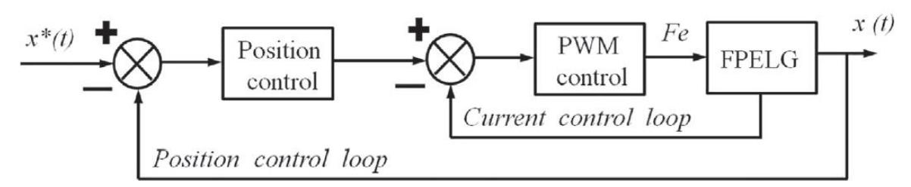

Figure 1.26: Example of the control system for a FPLG [38].

Figure 1.26 indeed shows the control strategy designed by researchers at the Czech University of Technology, which is based on an inner and an outer loop, respectively controlling the current of the linear generator and the piston position. The algorithm behind this scheme is able to "read" the position of the piston thanks to the presence of sensors inside the cylinder, to compare the obtained value with the target one and

to decide which countermeasure to adopt also considering the reported error on the current. This simple block scheme actually hides a really complex code behind it which needs to be run many times per second in order to obtain a stable operation.

Many other layouts of the control system are possible, but the general trend is to consider two loops controlling two relevant parameters of the Free-Piston. Some control schemes aim to control simultaneously the piston's motion and the power output to feed the load correctly, while others only focus on the former aspect leaving the latter to the power management electronic systems. This last solution is preferred in the automotive sector where the FPLG is usually not directly interfaced with a load but linked to a battery which works as a buffer between the generation and the rapidly changing power demand.

# 1.5 Advantages and drawbacks

A great number of details have been provided till now about the Free-Piston Linear Generator, hence, it can be beneficial at this point to specify the main advantages and weaknesses of this technology in order to have a general idea of the real potential.

The strengths of the FPLG are [39]:

- *High thermal to electric efficiency*. The absence of the crankshaft and its associated elements (conrod, gear box, ...) leads to a direct connection between the piston in the combustion chamber and the mover in the electric generator. In the meanwhile, the friction is reduced, thus the energy released by the combustion is converted into electricity with lower losses. Moreover, also reliability is enhanced since there are fewer moving parts with respect to traditional Internal Combustion Engines (ICE).
- Variable and controllable compression ratio. The crankshaft mechanism is not limiting the piston stroke anymore since there is no fixed upper constraint for the movement, in this way the compression ratio can be varied in order to always maximize efficiency even when the load changes. This feature enables the operation with different types of fuels encouraging the transition to new and clean types of propulsion, like hydrogen, which seems the greenest and most promising at the actual state of art.
- Reduction of friction and vibrations. The elimination of the mechanical transmission and crank mechanism also reduces the side forces that push the piston against the cylinder walls and the resulting fluctuating forces that are the cause of vibrations. These are the reasons why the engine requires less lubrication and generate less noise compared to traditional engines.

- Furthermore, in the presence of two pistons the system is intrinsically almost vibration-free.
- *Compact and modular*. The powertrain has fewer components, thus lower weight and occupies less space. Moreover, the modularity allows to increase the power output without changing too much the system's configuration. Many applications can be considered as consequence, the versatility may be the key strength of this new technology.
- *Reduced cost of production and maintenance*. The reduced number of components and the lower complexity of the system results in lower costs both on production and maintenance side.
- Low consumptions and emissions. The high efficiency contributes to the reduction of fuel consumption, but at the same time, the high speed of the piston near the Top Dead Center and the fast expansion process, both improve the air-fuel mixing and highly reduce the time available for heat losses and pollutants generation such as NOx.

Despite these clear advantages, there are still some uncertainties that are holding back the development and the diffusion on large scale:

- Critical and challenging piston control. The movement of the piston is no more constrained by the crank system, but it is controlled through the dynamic force equilibrium. Each instant of time the electric force of the generator has to lead the piston's motion to follow the wanted trajectory. In the case in which the equilibrium is not reached, the piston can overcome the Top Dead Center (TDC) or the Bottom Dead Center (BDC) and this can potentially result in the failure of the system. The development of a reliable mechanism to manage the operation of the engine becomes even more difficult when considering aspects like the start-up and the shutdown process, possible combustion misfires and the necessary synchronism of the opposed-piston configuration.
- Complex power output control. Since the power output is directly linked to the speed of the piston and the electric force, a sudden change of the load can have relevant impact on the stability of the engine. Even if some attempts are being made for the contemporary control of the piston motion and the power output, the complexity of the problem has led to privilege the adoption of an energy storage system, like a battery, to decouple the production and the demand. Anyway, this requires an active Power Electronics solution to convert the uncontrolled and pulsating instant power generated by the linear motor in a compatible way to the storage system.
- Linear instead of rotating electric machine. Rotating machines, made of statoric and rotating part interacting with each other, are well known, while systems with a translatory mover are just starting to be investigated. Indeed, the latter

- are more challenging to control: unlike rotating machines, linear ones reverse the direction of motion in a cyclic way. So, even if the principle on which they are based is similar, they have not reached yet the same level of efficiency and reliability.
- Necessity of cooling. The introduction of a cooling process affects the compactness of the system, but it is necessary since the linear generator is close to the combustion chamber and if its temperature increases, the degaussing phenomenon can occur. Indeed, as shown in the Figure 1.27, when the permanent magnets on the mover are heated up without adequate cooling, they can lose their magnetic properties, reducing the magnetic flux generated and consequently, compromising and affecting the performance of the engine.

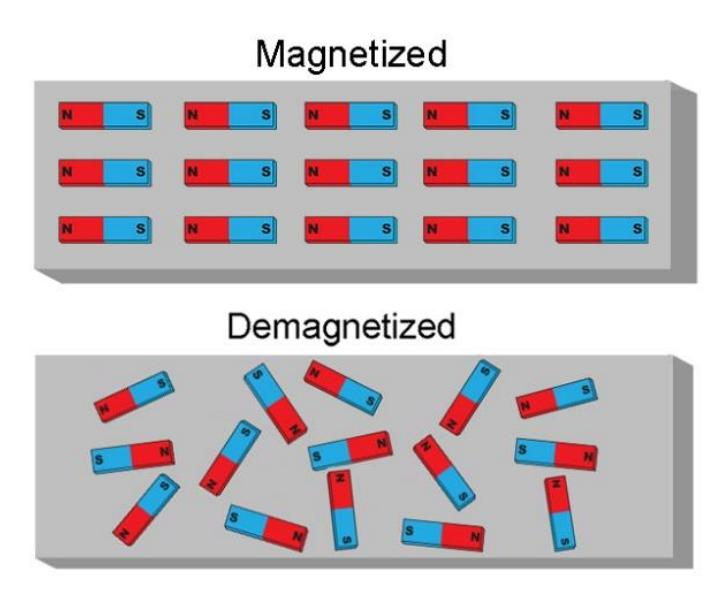

Figure 1.27: Degaussing phenomenon.

• *Few existing prototypes*. Several studies are being performed on the Free-Piston linear generator but only few of them have brought to the realization of a real prototype. It's clear that some issues cannot be discovered in numerical models, but need to be developed on field to be found and studied.

## 1.6 State of art

As just seen, the main advantages of the FPLG are its compactness and its highpower density, plus its versatility and modularity. These interesting aspects are catching a lot of interest in the industry, indeed several companies are researching and developing in this field, mainly in the automotive industry, and consequently many different prototypes are being or have been realized in the world. This section aims to describe the most advanced developed projects to provide the actual state of art of the technology and the existing engines.

## 1.6.1 Toyota

One of the first automotive firm to investigate the Free-piston Linear Generator has been Toyota. The Toyota Research and Development Laboratory has developed both models and prototypes based on this concept [35, 40, 17], their detailed descriptions will be provided in chapter 2 since one of their prototypes will be the reference for the model implemented in this thesis.

Anyway, just to give a brief overview, a single piston system has been considered, but the peculiarity of this design is the choice of a "W-shape" piston as shown in Figure 1.28.

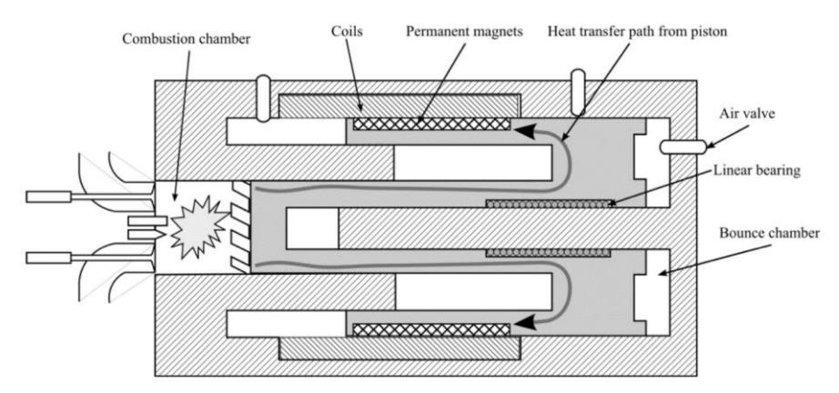

Figure 1.28: Toyota's prototype schematization [37].

At one end of the piston there is the combustion chamber with a smaller diameter, while the larger-diameter sides constitute the gas spring chamber. The exhaust gases are scavenged out through valves mounted on the cylinder head of the combustion chamber, while fresh air is coming in through ports at the side wall of the cylinder liner. Meanwhile the gas spring is made adjustable using pressure regulation valves and the permanent magnets are mounted on the outer periphery of the piston.

The main advantages associated to this shape are the following:

- The lower pressure needed to generate the force required by the gas spring thanks to the larger piston surface area of the gas spring chamber side.
- The possibility to dispose a cooling oil passage in the central column of the piston to ensure proper cooling of the system.
- The magnets of the linear generator are set far from the piston combustion chamber which means that the heat conduction path is long enough to prevent the magnets from degaussing and loosing efficiency.

### 1.6.2 SWengin (SoftWareEngine)

The SWengin is a dynamic start-up company founded in 2014 in Germany that stated: "We firmly believe that the Free-Piston represents the missing piece of the puzzle in terms of both vehicle propulsion and energy supply, that it will for the first time unify the fields of e-mobility and clean energy, and in so doing will provide an integrated concept for solving the global energy problem". [41]

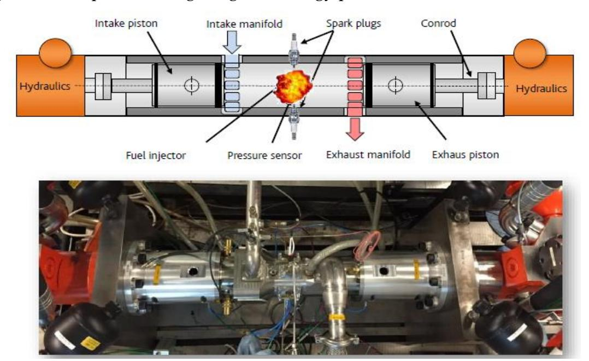

Figure 1.29: SWengin's Prototype.

Driven by this exciting belief, they have developed a working prototype based on an opposed-piston configuration with a shared combustion chamber in the central area of the system and with two pistons on the sides with their relative gas springs. As explained in the previous section, with this architecture, the role of the control system becomes fundamental to guarantee a stable and continuous operation, thus the control loop is repeated 20 to 60 times per second. They have proved that the variable compression ratio allows the exploitation of different fuels, and the low friction system leads to the achievement of very high efficiencies (43% to 47%) even at partial load.

The size of the system proposed is in the order of 15 cm flat and the module's expected power output is 30 kW. This prototype has been thought for the propulsion of any kind of hybrid vehicles and the electrification on transport in general with the introduction of a new category of vehicles: the Free-Piston Electric Vehicle (FPEV); as the company claims, FPEVs fulfil all four requirements for the future of vehicle propulsion: locally emission-free, suitable for everyday use, globally low on emissions and economical.

## 1.6.3 Aquarius

This lightweight concept [36] has been already introduced when discussing about atypical architectures of the FPLGs. It only consists of 20 components with just a single moving one, the piston. Its configuration consists of a dual piston which collapses in just one chamber divided in two parts, each one working as combustion chamber and rebound device alternatively. The compression stroke in one side correspond to the expansion stroke in the other.

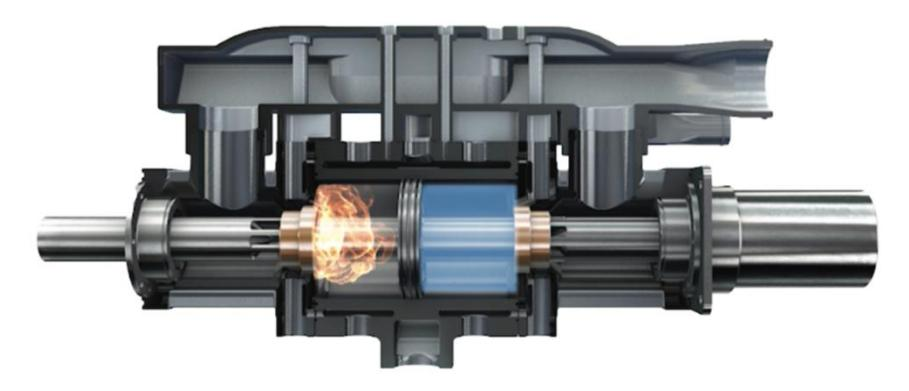

Figure 1.30: Aquarius's Prototype.

This architecture has been concretized in one prototype which is air cooled, needs no lubrication and has graphite piston rings and special coatings to reduce friction. The design includes four injectors in total, two for each cylinder head, and the main fuel of operation is hydrogen. The whole system is stated by the company that needs maintenance only once every 1000 hours of operations, thus reducing the costs of operation. These hours of operation can be translated into 50'000 miles or around 80'000 km for vehicle's propulsion.

The latest version of the Aquarius engine weights 10kg with a power output of around 30kW and a claimed fuel requirement 20% lower than traditional combustion engines, while with future improvements is foreseen to reach as much as 30%.

There is no production date for the final engine, but prototypes are already being tested in Austria.

#### 1.6.4 Volvo

Volvo Technology corporation was involved in a European Commission funded project on the free-piston Technology together with the Royal Institute of Technology (KTH), ABB and Chalmers University and the result has been a patented version of this device [37].

The Free-Piston's in this case displayed in Figure 1.31 has a dual-piston type configuration, which in accordance with what seen before, is very sensitive to the pression variations since the two cylinders are strongly coupled and thus disturbances are amplified. Anyway, this configuration can achieve very high power-to-weight ratios.

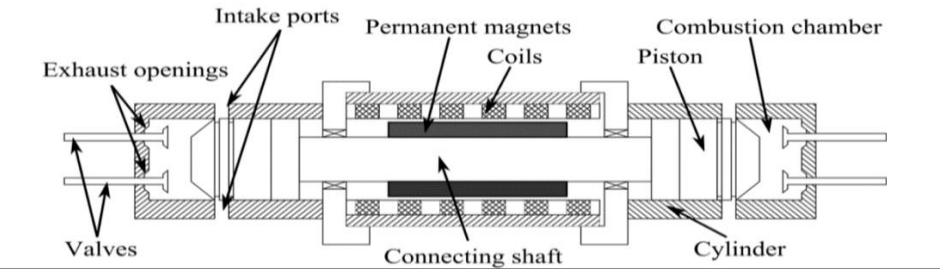

Figure 1.31: Volvo's Prototype schematization.

The patent proposes an algorithm of control which includes a prediction of the electromagnetic force needed to follow a predetermined motion profile of the piston based on the velocity along the stroke. Reported research has indeed shown that predictive control logics such as this one can significantly improve the stability of the piston motion.

#### 1.6.5 Honda

Honda's single patent [37] has instead considered a spark ignition single cylinder Free-Piston engine generator with the peculiarity of a four-stroke combustion and a mechanical spring.

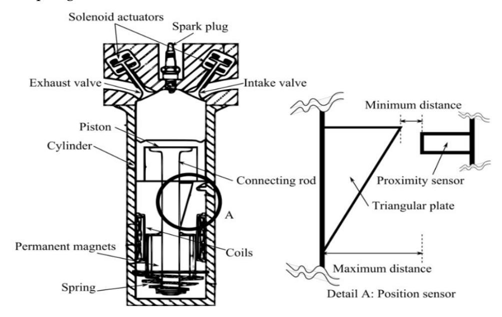

Figure 1.32: Honda's Prototype.

Another interesting feature of this concept is also the presence of a piston position sensor for a linear measurement which is composed by a triangular plate and a proximity sensor as shown in the Detail A. This sensor figures out the distance with the plate, by sensing the magnetic field intensity, which varies in accordance with the distance. When the piston is at the Top Dead Centre the distance is at the maximum while the opposite happens when the piston is at the Bottom Dead Centre. This allows the calculation of the continuous and instantaneous piston position over the length of the stroke and opens the door for better control logics over the piston motion.

# 1.7 Applications

After the introduction of the past and present state of technology, this section aims to analyze the possible future applications of the Free-Piston. Obviously, this is just a list of fields in which the FPLG is thought to or could be employed in the modern era, but different future exploitation scenarios should not be excluded [36].

- *Powertrain*. FPLGs appear as the ideal solution for electric and hybrid vehicles, even if they seem to be economically convenient only for private and light commercial ones. In these cases, an onboard Free-Piston engine would directly drive the motor or charge the battery acting as a range extender. The presence of this type of device would help to reduce the size of batteries and thus the cost of EVs, meanwhile keeping the total weight of the vehicle low requiring in this way a lower energy consumption. The compactness and power density typical of this technology seems perfectly suitable for many kinds of vehicles, also considering the strength of the modular design.
- Recharge stations. Despite the type of vehicle, it's also possible to think at this system as an alternative to power EV charging stations when the grid is overwhelmed by the huge peak in demand caused by many cars being plugged in at the same time, thus in a peak shaving application. The charge of an electric vehicle is indeed a very power-requesting process with stations requiring power outputs in the order of hundreds of kW per vehicle being plugged in. Typically batteries are deployed in charging stations not to stress too much local grids, FPLGs can be a cheaper and cleaner solution to this incoming issue.
- Trucks. Nowadays, the propulsion of heavy-duty vehicles seems not advantageous, due to the high-power demand but the FPLGs can act as auxiliary power unit or APU to support the driver's cabin or for instance, in refrigerated trucks, cool the requested area while the main engine is not operating.

- *Marine*. In this field, the Free-Piston technology may be adopted to support all the electronic systems, especially on light commercial yachts.
- *Drones*. FPLGs have been also considered to power small civil and military drones.
- Microgrids. In the transition towards a more renewably powered world, microgrids are being investigated with micro generation, which has many advantages with respect to big power plants. FPLGs may be useful as complementary power source to overcome the aleatory nature of renewables and provide a stable energy output. This idea is even more important for remote areas such as rural villages, mines, islands, etc... where the grid could be lacking, and a new system has to be thought.
- *Telecommunications centers*. Another possible field of application of the Free-Piston engines is as a backup power generator of telecommunication towers in isolated and remote locations with bad, unstable, or absent grid. This sector is indeed foreseen to expand soon due to the introduction of the 5G connection that will open new possibilities, but as always requiring additional power to be up and running.


Figure 1.33: Application of the FPLG in series hybrid vehicles [42].


# 2. Dynamic and Thermodynamic model

Once the overall working principles and a general picture of the technology are clear, the analysis moves to the development of a model describing the behaviour of such a system in stable continuous operation.

The simulation of the dynamic and thermodynamic behaviour of the FPLG are performed on the basis of three articles published by Toyota R&D's Lab in 2016 ([35],[40],[17]). These papers, starting from the investigation of the fundamental characteristics of the generator, then focus on the control logic, being this the most challenging aspect of the entire design.

The goal of the work performed in this part of the thesis is to create a model capable of simulating the Free-Piston Linear Generator's operation with the same characteristics of the prototype described in the articles and reach the same level of performance.

Consequently, after the description of the adopted general structure of the system, each component has been studied in detail, its behaviour has been investigated and converted into mathematical equations. A particular attention has been devoted to the Linear Electric Machine and to the path and scientific reasoning that have brought to the development of its final configuration, highlighting at the same time the consequences of each choice on the dynamic equilibrium acting on the piston.

The analytical description obtained has been then exploited in OpenFOAM, an opensource software widely used in the engineering field for educational purposes as well as for companies and commercial applications [43]. Despite being specific for computational fluid dynamic (CFD), it has allowed to simulate the interaction between all the different subsystem of the FPLG and to obtain consistent results, in line with the prefixed goals.

## 2.1 Toyota's articles

As mentioned above, the papers published by the Toyota central R&D Labs have been deeply analyzed and they have become the basis on which the dynamic and thermodynamic model of the FPLG have been developed ([35],[40],[17]). Indeed, the goal has been to simulate the Free Piston's behaviour with the same characteristics of the prototype described in the articles and reach the same level of performance.

Anyway, since many data were lacking and some looked too far from being realistic, many assumptions have been taken based on conventional technologies and common sense. Furthermore, many design choices have not been explained and described in the articles and this led to freely move in those fields in which no detail was reported.

So, it's crucial to understand which data are reported in the articles before moving on, in order to contextualize the environment in which the model has been developed and to have clear where it needs to be improved to provide realistic and consistent results.

## 2.1.1 First paper

The first publication [35] investigates the fundamental characteristics of the Free-Piston Linear Generator. The choice is taken on a "W-shape" opposite-piston engine (already shown in Figure 1.22) with the performance target value of 20 kW by a pair of two units, in order to be employed in the propulsion of a B/C segment vehicle at a cruising speed of 120 km/h. Anyhow, the subject of investigation is just one unit of the FPLG, thus only 10kW of power have to be achieved.

The equation of motion is described considering negligible the friction force at first glance due to no crank mechanism and thus no side forces acting on the cylinder. Here the Newton's second law is reported:

$$M \cdot \frac{d^2x}{dt^2} = P_{cc}(t) \cdot A_{cc} - P_{gs}(t) \cdot A_{gs} - F_{LEM}(t)$$
(2.1)

in which:

- *M* is the mass of the piston [*kg*];
- *t* is the time [*s*];
- *x* is the piston position [*mm*];
- $P_{cc}$  is the pressure inside the combustion chamber [Pa];
- $A_{cc}$  is the area of the combustion chamber acting on the piston  $[mm^2]$ ;
- $P_{as}$  is the pressure inside the gas spring [Pa];
- $A_{qs}$  the area of the gas spring  $[mm^2]$ ;
- $F_{LEM}$  is the force imposed by the linear electric machine acting as load or motor [N].

 $F_{LEM}$  depends on the working condition and the control strategy. As a first approximation and considering a resistive load, it can be expressed as follows:

$$F_{LEM} = c_g \cdot \frac{dx}{dt} \tag{2.2}$$

Here,  $c_g\left[\frac{N\cdot s}{m}\right]$  is a constant also called "Generating Load Coefficient" defined as the product of the generating load divided by the piston speed, which underlines a linear correlation between the force and the velocity of the piston. This has been done as first approximation.

Thus, the instant electric power generation  $P_{el,gen}$  [kW] can be expressed as:

$$P_{el,gen} = c_g \cdot \left(\frac{dx}{dt}\right)^2 \tag{2.3}$$

Once the main equations have been obtained, the analysis moves on the type of combustion which can be employed in the chamber, either the Spark Ignition (SI) and the Premixed Charge Compression Ignition (PCCI), with the latter being similar to the Homogeneous Charge Compression Ignition (HCCI) but just making use of high reactivity fuels [18]. Both conditions are assessed expecting higher efficiency of the PCCI case with respect to the SI one whereas a higher complexity and difficulty of ignition timing control. For the process of gas exchange it is assumed that the flue gases are immediately exchanged for fresh intake once the scavenging ports are opened.

The LEM in both combustion conditions has been proposed as a three-phase permanent magnet brushless generator with stationary coils, moving magnets based on neodymium-iron-boron and the stator is iron-cored. The corresponding initial value for the standard stroke reported in the table here below match with the initial compression ratios of 15.8 and 4 for the combustion chamber and the gas spring respectively.

| Parameter              | Value | Unit |
|------------------------|-------|------|
| Bore                   | 68    | mm   |
| Standard stroke        | 100   | mm   |
| Scavenging port height | 33    | mm   |

Table 2.1: Main geometrical measures.

In the case of PCCI combustion the results highlight the importance of the amount of fuel injected with respect to the load which could lead to misfire or excessive combustion due to the lack of the crank mechanism. On the other hand, in the SI combustion case, the ignition position or timing becomes crucial to fulfil the continuous working condition goal.

The achieved outputs in the simulations are here reported.

|      | Compression ratio [-] | P <sub>max</sub><br>[MPa] | Power<br>output<br>[kW] | Indicated<br>thermal<br>efficiency<br>[%] | Overall<br>efficency<br>[%] |
|------|-----------------------|---------------------------|-------------------------|-------------------------------------------|-----------------------------|
| PCCI | 19.0                  | 19.8                      | 12.7                    | 52.7                                      | 42.0                        |
| SI   | 14.5                  | 12.3                      | 10.4                    | 45.4                                      | 36.2                        |

Table 2.2: Main outputs of the simulations.

In the following part, the same article describes the prototype which has been built to validate the feasibility of the proposed structure. The combustion unit has been designed to be a uni-flow scavenging type with two-stroke gasoline engine, direct injection with SI combustion. The gas spring had a pressure regulating valve to control the amount of mass of the gas inside it. The control algorithm based on the generating load coefficient is depicted to be insufficient to avoid and prevent the most critical failures such as collision of the piston with the cylinder head and gas-spring-chamber wall, which would result in the complete break-down of the engine.

The prototype's outputs shown in the table below report an operating condition quite different from the previous model simulations, for instance the frequency reduced dramatically from 40Hz to 23Hz.

| Parameter               | Value | Unit                 |
|-------------------------|-------|----------------------|
| Operating frequency     | 23    | Hz                   |
| Actual stroke length    | 90    | mm                   |
| Amount of fuel injected | 22.7  | $\frac{mm^3}{cycle}$ |
| Ignition position       | +46   | mm                   |
| Compression ratio       | 7.2   | [-]                  |

Table 2.3: Main outputs from the prototype.

As reported in Figure 2.1, a stable combustion and operation has been accomplished for more than 4 hours with the following power generation's profile.

The experimental analysis clarifies that a precise control of ignition position is crucial for the steady operation of the FPLG, then a recovery algorithm from the misfire operation to the stable one is essential.

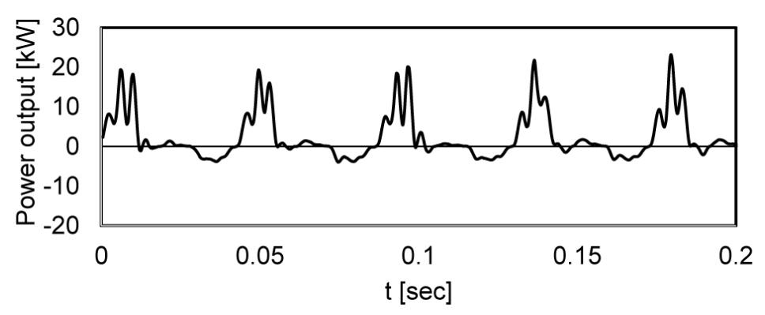

Figure 2.1: Power generation profile.

## 2.1.2 Second paper

The second article [40] focuses on the investigation of the control system for the generator. Below, a photo describing the developed FPLG is reported to better understand the layout. As explained in the paper, the three phase coils are integrated into the cylinder block while on the lateral surface of the mover are embedded the permanent magnets. The latter are far enough from the combustion chamber in order to create a long conduction path for the heat and thus not reducing the magnetic features of the material. The clearance between the magnets and the coils is tried to be maintained as small as possible to increase the efficiency of conversion.

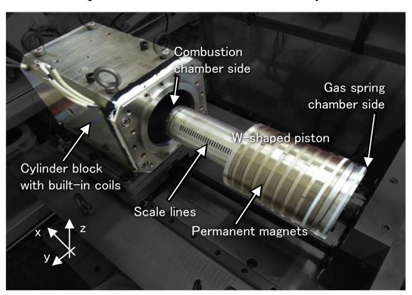

Figure 2.2: Actual prototype's layout.

The coils then are connected to a three-phase ideal inverter with 100% conversion efficiency, to enable electric conversion from AC to DC and vice versa. The former happens in the generating condition in which the piston is decelerated by the generator and induces AC current in the coils which in then converted to charge the

DC power supply. Furthermore, the generator is also capable of driving the piston and pushing it towards the needed direction, in this case the current flows in the other way around. The generator coefficient  $c_g$  is here set equals to 7.72  $\left[\frac{N \cdot s}{m}\right]$  in order to estimate the generator force from AC currents.

Piston position is also unknown due to the lack of a crank mechanism and for this reason it has to be directly measured through a linear encoder.

The controller is designed to maximize the electricity generation and stabilize the combustion acting on the position and trajectory. It controls the frequency and phases of the pistons to cancel out the vibrations in the opposed piston configuration, moreover also the TDC and BDC not to incur into a breakdown and to guarantee robust oscillation even if misfire occurs. Figure 2.3 reports the control block scheme to evaluate the reference piston position x(t) and piston velocity feedback loops so that the piston trajectory approximates the reference target waveform.

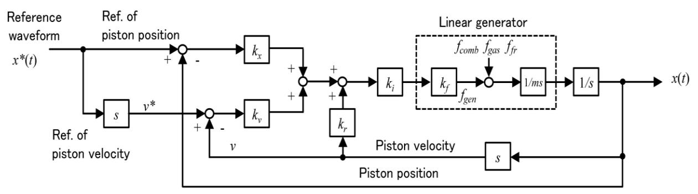

Figure 2.3: Control block scheme.

Similarly, another model based on which a simulation has been performed including friction is proposed in the paper. The dynamics equation is here reported:

$$M \cdot \frac{d^2x}{dt^2} = F_{combustion}(t) + F_{LEM}(t) + F_{gas-spring}(t) + F_{friction}(t)$$
 (2.4)

where:

- *F*<sub>combustion</sub> is the force caused by fuel's combustion [*N*];
- $F_{LEM}$  is the force applied by the linear electric machine [N];
- $F_{gas-spring}$  is the force acting on the piston due to the gas spring [N];
- $F_{friction}$  is the equivalent force caused by friction [N].

The combustion model is said to be based on a zero-dimensional model, the burned gas is assumed to be fully substituted by fresh air and the amount is set to be stoichiometric.

The frictional force  $F_{friction}$  is instead proportional to the piston's velocity through a constant set to  $100 \left[ \frac{N \cdot s}{m} \right]$ .

This whole setup is done to investigate whether the currents in the coils do not exceed the value  $100\,A_{RMS}$  which would result in the burn out of the coils. In addition, the qualitative feasibility and efficiency of the control logic has been performed and continuous oscillation for long period has been assessed feasible. The operating condition of the simulation are here listed.

| Parameter                | Value        | Unit      |  |
|--------------------------|--------------|-----------|--|
| Operating frequency      | 23           | Hz        |  |
| Stroke of reference      | 93           | mm        |  |
| TDC/BDC of reference     | +46/-47      | mm        |  |
| Amount of fuel injection | 16.8         | mm³/cycle |  |
| Combustion system        | Gasoline, SI | [-]       |  |
| DC voltage               | 220          | V         |  |

Table 2.4: Operating conditions.

And the simulation results obtained are depicted in the figure here below.

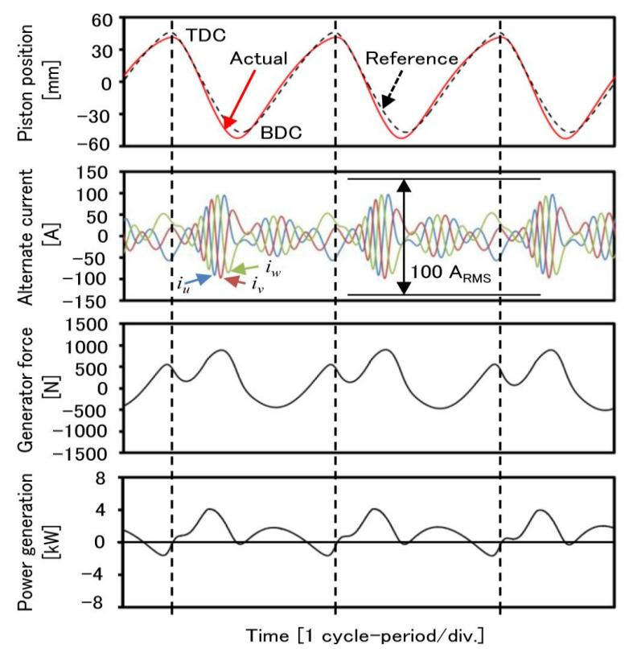

Figure 2.4: Simulation results.

## 2.1.3 Third paper

The third and last paper [17] goes through a novel control method of the FPLG to improve efficiency and stability. In the previous publication, the control method used was the target position feedback method which was not able to maintain the swinging motion of the piston once the output power was increased. The new proposed method is called Resonant Pendulum Type Control and guarantees higher stability and flexibility.

In this experiment the inverter is connected to a regenerative DC power supply at 500V and linked in parallel to a Ni-MH battery module as a buffer for the pulsations of current. This prototype consists of a different FPLG which is now a Halbach array of permanent magnets and a higher number of windings in the stator coils, with a resulting higher magnetic flux and higher induced voltage and lower current. The resulting efficiency is again improved as well as a larger force range and maximum force.

The proposed control method is based on the piston speed control, adjusting the position of the TDC and BDC. As a general idea, the purpose is to maximize the efficiency of generation, and this is high when the speed is high as well. The speed control is active only when the piston velocity finds its maximum, thus only around the middle of the piston stroke. The speed control command has a rectangular waveform which is defined by an amplitude A and an offset O calculated in the following manner:

$$A = K_A \int (E_{TDC} - E_{BDC})dt \tag{2.5}$$

$$O = K_O \int (E_{TDC} + E_{BDC}) dt \qquad (2.6)$$

in which:

- $K_A$  and  $K_O$  are feedback gains;
- $E_{TDC}$  and  $E_{BDC}$  are the position errors at the top and bottom dead centres respectively.

In fact, TDC and BDC positions are adjusted by the control system by controlling the piston speed. Basically, when both the positions of TDC and BDC exceed the commands, the amplitude A is decreased, otherwise it's increased allowing the piston to reach the positions commanded. Nevertheless, when just one the twos, TDC or BDC, is exceeded or not reached, then the control algorithm acts on the offset 0, shifting in this way the piston motion towards the positive or negative direction.

Doing so, the new values of amplitude A and offset O are calculated for the next cycle from previous values of  $E_{TDC}$  and  $E_{BDC}$  giving for granted a periodical repetition of the swing motion. A picture summarizing the abovementioned method is here reported.

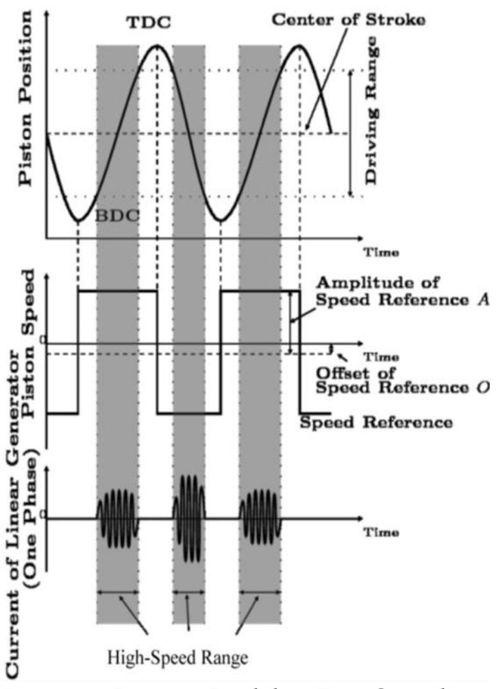

Figure 2.5: Resonant Pendulum Type Control.

The method proposed has no need to switch from motoring and firing operation modes just because is based upon the piston speed and adjusts itself accordingly. Additionally, the paper extends the control algorithm to the gas spring pressure too. This not only allows the gas spring and the generator to work together to speed up or slow down the piston motion, but also could potentially decrease the linear generator's size with the same maximum resultant force applied.

The model of the FPLG developed in this third part has been tested in Modelica and reached a frequency from 26.6 to 31.6 Hz. Afterwards, it has been concretized in a new prototype whose key parameters are shown in the next table.

| Parameter                       | Value              | Unit |
|---------------------------------|--------------------|------|
| DC input voltage                | 500                | V    |
| Inverter career frequency       | 10                 | kHz  |
| Internal diameter of the stator | 120                | mm   |
| Total mass of slider and piston | 4.8                | kg   |
| Bore                            | 68                 | mm   |
| Maximum stroke                  | 100                | V    |
| Compression ratio               | ession ratio 10.06 |      |
| Scavenging port height          | 25                 | mm   |
| Engine type                     | 2-Cycle            |      |
| Fuel                            | Gasoline           |      |
| Ignition                        | Spark Ignition     |      |

Table 2.5: Prototype's main specifications.

Generation and motoring operations are reported to work continuously with no issues for a long time, except the fact that in the former case it had to be stopped for overheating of catalyst for the exhaust gases due to high densities of unburnt components.

Important to empathize is the generation operation's frequency which is determined to be at 26Hz.

Here below Figure 2.6(a) and Figure 2.6(b) display the experimental results of the DC-side power with respect to the position of the BDC (a) and to the gas spring pressure (b).

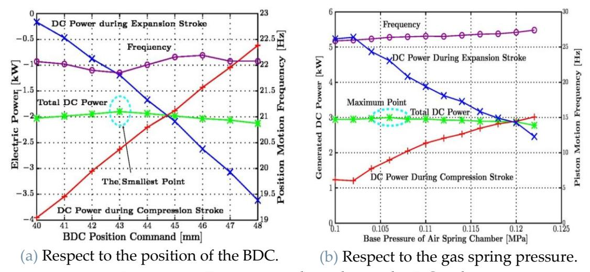

Figure 2.6: Experimental results on the DC-side.

# 2.2 Model's development

As just summarized, the three papers ([35],[40],[17]) report many interesting points, aspects and downsides of the technology. Furthermore, it is clear that the outputs are not unique and fixed but change quite significantly with the boundary conditions, which again are not set equal for all the models. This aspect of the conclusions of all the reports has led to the need of stating some hypothesis to have a starting point and targets values for the new model developed in this thesis.

Again, many inputs are lacking by the car manufacturer and thus the overall experiment cannot be fully replicated or validated. In a system in which as seen, a control method is crucial to guarantee a steady and stable operation, becomes central the definition of the layout, geometry and working constants and the overall goal of the study. Even the smallest difference in the starting point or geometrical aspects leads to a completely different outcome, consequently, for this study some assumptions have been set.

In this section the features of the model developed are shown as well as the different steps undertaken to assess the best outcome with the most realistic behaviour of the system in OpenFOAM.

### 2.2.1 Definition of the model's architecture

The selected architecture for the simulation is a W-shaped single-piston two-stroke gasoline engine with a spark ignition combustion type. The dimensions and the total mass set for the model are reported in Table 2.6 here below. In order to follow the reference of the Toyota's papers, these values have been chosen in line with the prototype presented in their third article and characterized in Table 2.5.

| Parameters                      | Value | Units |
|---------------------------------|-------|-------|
| Engine bore                     | 68    | mm    |
| Internal diameter of the stator | 120   | mm    |
| Scavenging port height          | 25    | mm    |
| Maximum engine stroke           | 100   | mm    |
| Total mass                      | 4.8   | kg    |

Table 2.6: Assumptions of the model.

It's important to note that the total mass here reported is the sum of each component taking part in the swinging movement, thus it also comprehends the piston as well as the permanent magnets of the linear electric machine.

These parameters have not been changed throughout the whole development and evolution of the model which as it is explained further on, has been improved step by step.

The overall goal was to achieve the same results as the Toyota's prototype, thus the same compression ratio for the combustion chamber ( $CR_{cc}$ ) and the gas-spring ( $CR_{gs}$ ). Consequently, the former has been set equals to 10, compatible with the SI gasoline technology, while the latter, not provided, has been considered equal to 4 as reported in the first of the car manufacturer's publications. This choice brought to the deduction of some geometrical aspects necessary for the simulations, as reported starting from formula (2.7).

$$CR_{cc} = \frac{V_{max,cyl}}{V_{min,cyl}} = \frac{\frac{\pi D_{cyl}^2}{4} \cdot H_{max,cyl}}{\frac{\pi D_{cyl}^2}{4} \cdot H_{min,cyl}} = \frac{H_{max,cyl}}{H_{min,cyl}}$$
(2.7)

In the previous formula:

- $V_{max,cyl}$  stands for the maximum volume reached by the cylinder in the thermodynamic cycle  $[mm^3]$ ;
- $V_{min,cyl}$  stands for the minimum volume reached by the cylinder in the thermodynamic cycle  $[mm^3]$ ;
- $D_{cyl}$  is the bore of the cylinder [mm];
- $H_{max,cyl}$  the maximum piston height in the stroke's path with respect to the cylinder head [mm];
- $H_{min,cyl}$  the minimum piston height in the stroke's path with respect to the cylinder head [mm].

In order to assess the "piston-to-head" clearance, which is defined as the distance between the piston and the cylinder head surface at TDC, the CR definition has to be developed such as in equation (2.8).

$$CR_{cc} = \frac{H_{max,cyl}}{H_{min,cyl}} = \frac{L_{stroke} + H_{clearance,cc}}{H_{clearance,cc}} = 1 + \frac{L_{stroke}}{H_{clearance,cc}}$$
(2.8)

In which:

- $L_{stroke}$  is the maximum length of the stroke or 100 mm as reported in Table 2.6;
- $H_{clearance,cc}$  is the height of the clearance needed in the combustion chamber to avoid the breakdown of the engine due to the piston hitting the cylinder's head [mm].

Finally, the clearance obtained is reported is formula (2.9).

$$H_{clearance,cc} = \frac{L_{stroke}}{CR_{cc} - 1} = 11.038 \, mm \tag{2.9}$$

Therefore, the maximum height of the cylinder head  $Z_{max,cyl}$ , from the BDC taken as the reference "0", can be evaluated as following:

$$Z_{max,cyl} = L_{stroke} + H_{clearance,cc} = 111.038 \, mm \tag{2.10}$$

The same operation has been performed for the gas spring (shown in Figure 2.7), knowing the external and internal diameters of the component from Table 2.6.

$$CR_{gs} = \frac{V_{max,gs}}{V_{min,gs}} = \frac{V_{min,gs} + \Delta V_{gs}}{V_{min,gs}} = 1 + \frac{L_{stroke} \cdot A_{gs}}{V_{min,gs}}$$
(2.11)

Here:

- $V_{max,gs}$  is the maximum gas spring volume reached in the cycle  $[mm^3]$ ;
- $V_{min,gs}$  stands for the minimum gas spring volume reached in the cycle  $[mm^3]$ ;
- $\Delta V_{qs}$  is the difference of the two above  $[mm^3]$ ;
- $A_{gs}$  is the annulus area of the gas spring component  $[mm^2]$ .

And therefore the  $H_{clearance,gs}$  can be extrapolated starting from (2.12).

$$CR_{gs} = 1 + \frac{L_{stroke} \cdot A_{gs}}{H_{clearance, as} \cdot A_{as}}$$
 (2.12)

The value is here reported in (2.13).

$$H_{clearance,gs} = \frac{L_{stroke}}{CR_{qs} - 1} = 33.33mm \tag{2.13}$$

Afterwards, two new constants have been defined to express in the model the ratio between the initial volumes and the areas of the gas-spring and combustion chamber. It should be noticed that in the first instant of simulation, the piston is assumed to be at the Bottom Dead Centre, thus the initial volume of the GS is smaller than the CC one.

$$C_{vol} = \frac{V_{BDC,gs}}{V_{BDC,cc}} = 0.669 (2.14)$$

$$C_{area} = \frac{A_{gs}}{A_{cc}} = 2.228 (2.15)$$

Where:

- $C_{vol}$  is the dimensionless volume constant [-];
- *C*<sub>area</sub> is the dimensionless surface constant [-];
- $V_{BDC,as}$  is the gas spring volume at the cylinder's BDC  $[mm^3]$ ;
- $V_{BDC,cc}$  is the combustion chamber volume at the cylinder's BDC [ $mm^3$ ];
- $A_{cc}$  is the area of the combustion chamber  $[mm^2]$ .

These parameters have been useful to perform the simulation in OpenFOAM, but their definition has been anticipated to provide a clear idea of how and why they have been derived: as shown below, indeed, the gas spring has an annulus-shaped area in the W-shaped piston configuration and the simulations have been performed on a slice of the piston's cylindrical shape with a peculiar angle of 2.5°. The reason behind this last aspect is the possibility to reduce the simulation time, since, all the results of the simulation, if related to the whole cylinder, can be obtained just multiplying or dividing the value of one slice by the number of slide themselves.

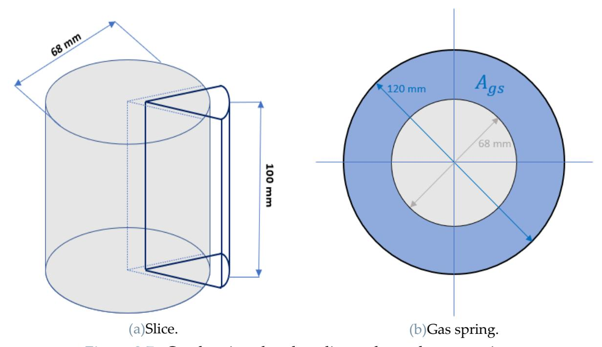

Figure 2.7: Combustion chamber slice and annular gas spring.

In addition, Figure 2.8 gives a better explanation of the whole geometrical aspects of the model defined.

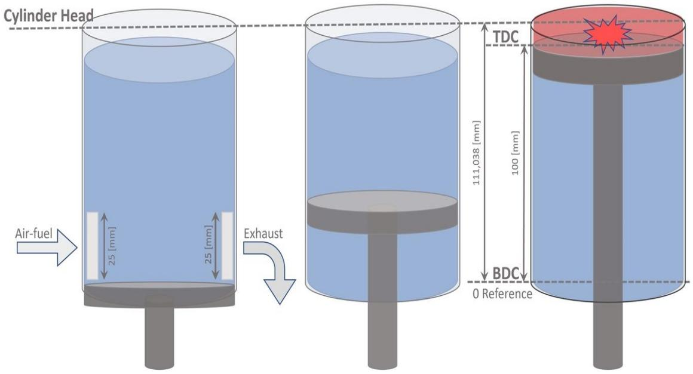

Figure 2.8: Combustion chamber slice and annular gas spring.

### 2.2.2 Definition of the model's dynamics

Now that the general structure of the model has been presented, this section aims to present the dynamics behind its operation and how each component has been analytically described through equations. Like many other softwares, OpenFOAM operates at mathematical level, the behaviour of each component must be fully characterized to perform an accurate simulation.

#### Dynamic equilibrium

It should be clear at this point that the main difference between the Free-Piston Linear Generator and the traditional internal combustion engine is the lack of the crankshaft mechanism. The absence of this element makes the control of the piston's motion more challenging, indeed, it is no longer forced to follow a precise trajectory due to a physical constraint.

Despite this, as shown in Figure 2.9, the operativity of the system is anyway dictated by the dynamic equilibrium which is established among the forces acting on the mover instant by instant. Indeed, the piston is pushed towards the BDC when the combustion occurs, but at the same time, it is decelerated by the pressure inside the gas spring, by the generator force and the friction force. On the contrary, when the movement reverses, the gas spring converts the potential energy previously stored into kinetic, pushing the piston towards the TDC, while the combustion chamber's pressure, electric machine and friction are braking it.

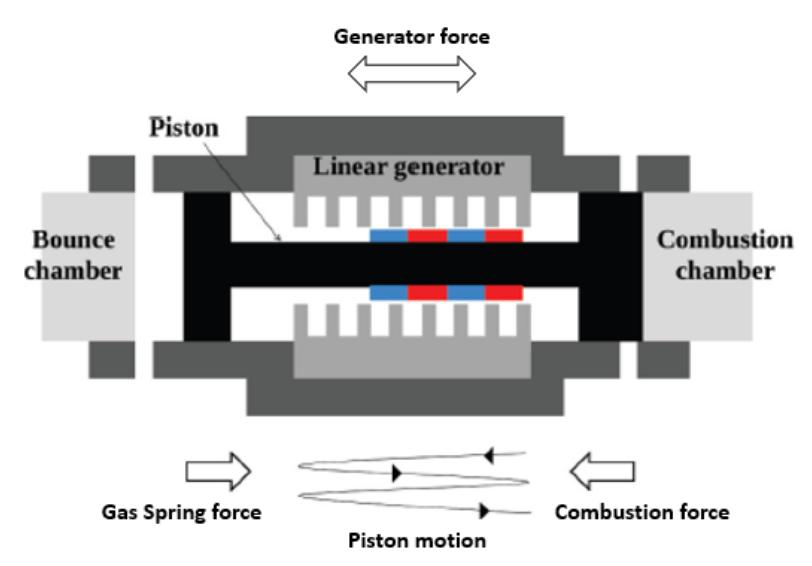

Figure 2.9: Schematic of the forces acting on the piston [16].

According to the Newton's second law, the equation which governs the movement is the following:

$$M \cdot \left(\frac{d^2x}{dt^2}\right) = -F_{combustion}(t) + F_{gas-spring}(t) \pm F_{LEM}(t) \pm F_{friction}(t) \quad (2.16)$$

where:

- *M* is the piston mass (assumed to be 4,8 *kg*);
- $\left(\frac{d^2x}{dt^2}\right)$  is the piston acceleration  $\left[\frac{m}{s^2}\right]$ ;
- $F_{combustion}$  is the force exerted by combustion on the piston [N];
- $F_{gas-spring}$  is the force exerted by the gas spring on the piston [N];
- $F_{generator}$  is the electromagnetic force exerted by the electric generator [N];
- $F_{friction}$  is the friction force [N].

The signs are derived taking as positive direction the movement from the BDC to the TDC, being the contribution of the gas spring and of combustion always in the same direction, the former is always positive while the latter is always negative. The magnetic and friction force are just dependent on the direction of the motion since they are always opposed to it, reducing the acceleration and the speed of the system.

As anticipated above, the next sections will describe how each force has been calculated. The discussion will start from the combustion chamber, then will move to the generator, the gas spring and finally the friction. In the appendix, instead, are present few extracts from OpenFOAM called "freePistonLinearGenerator" to show how equations have been concretized in the software and called "engineGeometry" which summarizes the main parameters adopted in the model.

#### Combustion chamber

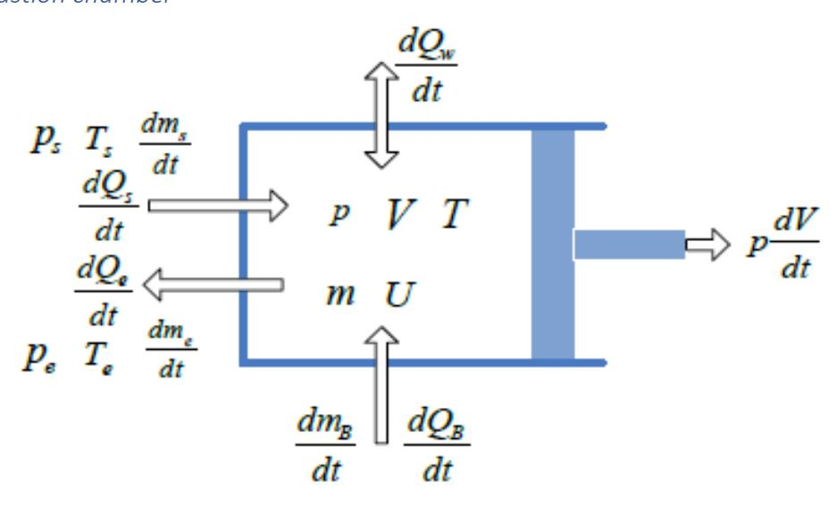

Figure 2.10: Schematic of heat and mass exchanges in the combustion chamber [27].

As it is displayed in Figure 2.10, the combustion chamber is a very complex component since many different heat and mass exchanges occur simultaneously inside the cylinder. From above, moving clockwise, each arrow represents respectively the heat exchange (1) with the walls, the mechanical work (2), the heat released by combustion and combusted mass (3), the exhaust mass, its energy and related properties (4) and the injected mass with again its energy and related properties (5).

Even if several models can be developed to describe the whole thermodynamic process, it's anyway difficult and time-demanding their accurate implementation in a software like OpenFOAM, especially for what concerns the fluid dynamics. For this reason and being the thesis' focus more on the interactions among the different components and modelling of the FPLG, the starting basis has been the combustion chamber of a conventional gasoline spark ignition engine with the implementation of a new class for the heat release of the combustion process.

This choice is justified by the fact that many different solvers and codes were already pre-implemented in the open-source software, in particular the iteration loops for the conservation laws of energy, mass and momentum. Indeed, it's quite common in Computational Fluid Dynamic (CFD) algorithms to face problems where the whole solution can be reconducted to a system of coupled differential equations, i.e. a system where the dominant variable of each equation appears also in other equations. Thus, several different methods have already been developed to find a solution, such as the so called PISO algorithm (standing for Pressure-Implicit with Splitting of Operators). In particular, when the equations are complex and non-linear

like in this case, sequential approaches are the favorite ones with respect to solving all the variables simultaneously: each equation is initially treated as if it only has a single unknown, temporarily considering the other variables as known. Once the value of one parameter is obtained, it is inserted in the definition of another one creating an iterative loop that ends only when all the equations in the system are satisfied. [44]

Now that the complexity of the system and its solving procedure has been explained, it's possible to deepen into the characteristics of the implemented class for the heat release.

Just as stated above, the conservation laws are the basis on which the process is represented in OpenFOAM. The energy equation is particularly fundamental since it allows to derive the in-cylinder pressure fluctuations along the stroke and then, multiplying it for the piston area, to derive also the force exerted by the combustion chamber on the piston. The rate of change of the heat released by the combustion  $\left(\frac{dQ}{dt}\right)$  is one of the most important terms of this relationship, thus its implementation plays a key role in the whole FPLG model accuracy.

Among the great number of functions available in literature to derive analytically this parameter, the one which has been adopted, it's the Wiebe's function. It is indeed the standard for Spark Ignition combustion and it is reported to have a good accuracy despite its relative simplicity. The main equations [34], which have been reported in the same way also in the code, can be expressed as:

$$\frac{dQ}{dt} = H_u g_f \eta_c \frac{d\chi_B}{dt}$$

$$\chi_B = 1 - \exp\left[-a\left(\frac{t - t_0}{T_C}\right)^{m+1}\right]$$
(2.17)

Where:

- $H_u$  is the calorific value of the fuel (gasoline, specifically octane: 44000  $\left[\frac{kJ}{ka}\right]$ );
- $g_f$  is the injected fuel mass per cycle  $\left[\frac{kg}{cycle}\right]$ ;
- $\eta_c$  is the combustion efficiency (assumed in first approximation equals to 1);
- $\chi_B$  is the mass fraction burned in the combustion process [-];
- *a* is the efficiency parameter (usually equals to 6.908 [34]), so-called since related to the duration of combustion;
- *t* is the time variable [*s*];

- $t_0$  is the beginning ignition time, this value is not provided directly in the implementation but is evaluated knowing that the ignition event starts approximately 4 mm before the end of the compression stroke;
- $T_C$  is the combustion duration (here adopted 0,003 s in order to have a good heat release without high instantaneous peaks, as shown in Figure 2.11(a));
- *m* is the combustion quality factor, a non-dimensional number which, for a small gasoline engines, is in the range from 0 to 3 (here assumed 2) and whose value depends on the compression ratio, the initial combustion temperature and the state of the mixture formation (influence shown in Figure 2.11(b)).

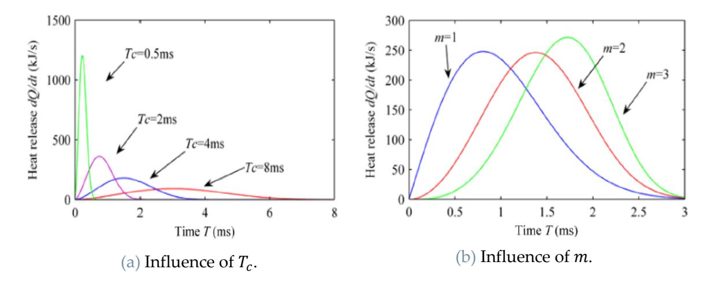

Figure 2.11: Heat release of combustion as function of  $T_c$  and m [45].

The two relationships (2.17) describe the heat released by the combustion process as function not of the entire mass of the fuel injected, but of the portion that has burned. The fraction of mass involved in the reaction is then evaluated with respect to the time considering as weights the following:

- the efficiency parameter *a*;
- the delay with respect to the beginning of the ignition  $(t t_0)$ ;
- the duration of the ignition itself  $T_c$ ;
- the combustion quality factor *m*.

It's important anyway to point out that the time-dependency is a peculiarity of the Free-Piston systems since the common shape of equation (2.17) in traditional internal combustion engine reports the crank angle dependency. For instance, usually ignition, intake and exhaust are well established by manufacturer in some narrow ranges of crank angles. An angle cannot be defined in this case, nonetheless an equivalent parameter has been introduced based upon traditional crankshaft

mechanism engines to define some peculiar time instants which then can be translated into relevant piston's positions.

It might be interesting to underline that more complex models can be developed from these equations for example to represent the slower combustion near the walls.

This is the case of the double Wiebe function [46] which defines  $\chi_B$  with more terms than equation (2.17), in order to provide a more accurate forecast of the heat release:

$$\chi_B = \lambda \left\{ 1 - exp \left[ -a \left( \frac{t - t_0}{T_C} \right)^{m+1} \right] \right\} + (1 - \lambda) \left\{ 1 - exp \left[ -a \left( \frac{t - t_0}{kT_C} \right)^{m+1} \right] \right\}$$
 (2.18)

where k is the ratio of the slow and the fast burn durations, hence close to the walls and far from them, while  $\lambda$  is the fraction of the mixture that burns in the fast combustion stage. This is beyond the purpose of this thesis and is here cited just for sake of completeness to highlight once again the general view of the work here proposed.

Another key aspect to be considered is instead related to the ignition height which is truly at the core of the combustion control, especially for the spark ignition engines. In the first Toyota paper [35], in Table 2.3, the ignition height can be deduced equals to 4 mm. Consequently, considering that the reference zero position for the vertical stroke motion of the piston is the BDC, adding in the minimum clearance  $H_{clearance,cc}$  evaluated before, the value results:

$$H_{ignition} = Z_{max,cvl} - H_{clearance,cc} - 4mm = 96mm$$
 (2.19)

This is equivalent to consider 15mm from the cylinder head.

Lastly, the intake valves and exhaust valves have been modelled as plain ports in first approximation, with a minimum pressure difference in between to better flow and scavenge fresh air and flue gases respectively. The model sets the intake [..] ports' height equals to 25 mm as reported in Table 2.5, moreover, since no indications are provided for the exhaust ones, the same is assumed also for them. Being the lower point of the ports assumed to be coincident with the Bottom Dead Centre, only when the piston is at BDC, the ports are completely opened. The scavenging process modelling implemented is the cross-flow type, with ports as intake and valves as exhaust at the opposite sides of the cylinder.

#### Linear electric machine

The Linear Electric Machine (LEM) is the key element of the FPLG. It must be able to convert with a very high efficiency the mechanical power linked to the oscillating movement of the piston into electric energy.

The analytical description of this component has followed a two-step logic with different approaches during the modelling of the system.

The first step of the modelling has been named  $C_{const}$ , since, as the name suggests correctly and it's shown in (2.20), the contribution of the LEM to the dynamic equilibrium on the piston has been described simply with constant which multiplies the piston speed.

$$F_{LEM} = c_g \cdot \frac{dx}{dt} \tag{2.20}$$

where  $c_g = 250 \left[ \frac{N \cdot s}{m} \right]$  is the constant, while  $\frac{dx}{dt}$  is the piston speed. The final value of the constant came from after many iterations and it's the value which guarantees to have a mechanical power outcome of  $10 \, kW$ . It should be noticed that this parameter was not provided for the reference Toyota's prototype, only the first paper introduces it, but anyway indicating an order of magnitude  $(1,23 \cdot 10^5 \left[ \frac{N \cdot s}{m} \right])$  that if implemented couldn't make the generator running at all.

The introduction of  $C_g$  is certainly an approximation of the real problem, anyway, it represents the exact configuration of a set of three resistors connected each to the three-phase terminals of the electric machine. In this way the power dissipated by the electric resistors is instantly equal to the one generated and directly proportional to the velocity of the mover, once the generator losses are neglected:

$$\mathbf{P}_{LEM} = c_g \cdot \left(\frac{dx}{dt}\right)^2 = \mathbf{P}_{diss} = \sum_k R_{load} \cdot i_k^2$$
 (2.21)

in which:

- $P_{LEM}$  is the power generated [kW] by the linear electric machine, evaluated remembering that is can be expressed as  $P_{LEM} = F_{LEM} \cdot \frac{dx}{dt}$ ;
- $P_{diss}$  is the dissipated power [kW];
- $R_{load}$  is set of three resistors assumed equal for simplicity  $[\Omega]$
- $i_k$  is the phase current flowing in the k resistance [A].

The arguably best improvement to the model of the Linear Electric Machine has been the case called  $C_{LEM}$  simulation, where a new class has been implemented, taking as reference an existing model [27] [47] which has been calibrated and designed to fulfil the performance requirements.

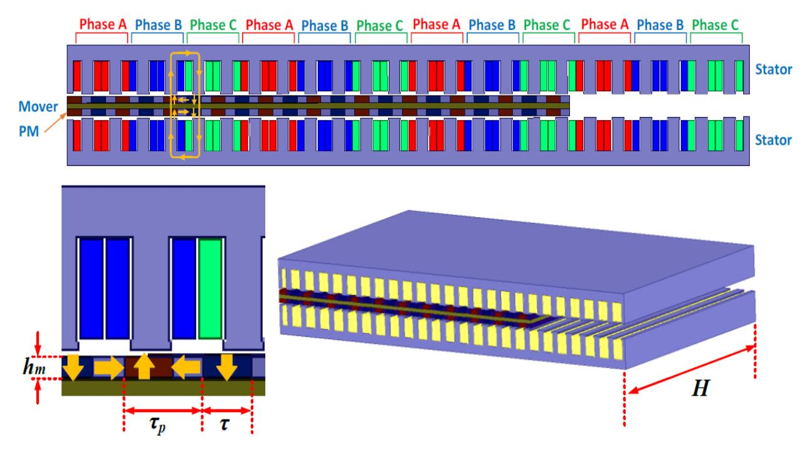

Figure 2.12: Model of the Linear Electric Generator [27].

Figure 2.12 shows the section and the 3D view of the LEM adopted as reference. The main characteristics are the following:

- Synchronous machine with two flat-type linear units combined together in a sandwich shape to increase the electric power output and the power density;
- Permanent magnets present on both the surfaces of the mover with Halbach array;
- Concentrated three-phase copper windings present on the stator (concentrated windings allows to reduce the power losses);

The layout adopted in the simulation is anyway a bit different from the one shown in Figure 2.12: indeed, as seen before, the piston considered is meant to be W-shaped. The electric generator is then divided in two parts, one on the upper side of the piston and the other on the lower side, both interacting with a set of coils. Nevertheless, this does not change the operating principle neither the performances at all, since this architecture can be obtained simply splitting apart the two flat-type sandwich units as shown in Figure 2.13.

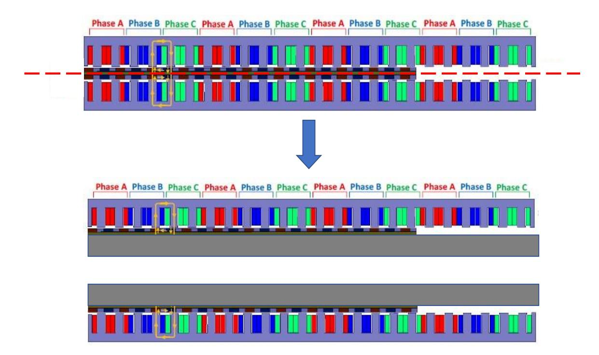

Figure 2.13: Splitting of the two flat-type units.

After the general architecture of the generator has been selected, the following step consists to understand how the system worked and to derive the fundamental equations, in particular for the induced voltage and the electric force acting on the piston, in order to create a proper new class in OpenFOAM that simulated the behaviour of the linear element.

The hypothesis here considered were few but important to mention:

- No iron losses, thus no hysteresis and eddy currents considered;
- No magnetic flux losses or stray loss;
- No dielectric losses;
- Direct connection to a fully resistive load.

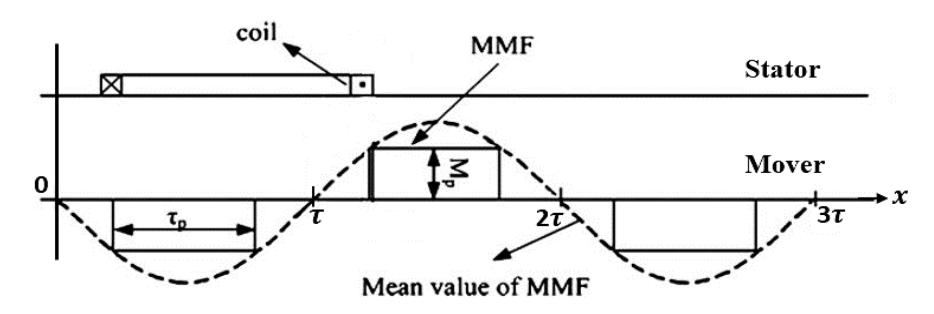

Figure 2.14: Magneto Motive Force (MMF).

The starting point of the analytical dissertation are the permanent magnets: due to their intrinsic nature, they are able to create a Magneto Motive Force (MMF) in the air gap between the stator and the winding coils shown in Figure 2.14 and which can be described by the following mathematical equations [47]:

$$M_{F}(x) = \begin{cases} 0 & 0 < x < \frac{\tau - \tau_{p}}{2} \\ -M_{p} & \frac{\tau - \tau_{p}}{2} < x < \frac{\tau + \tau_{p}}{2} \\ 0 & \frac{\tau + \tau_{p}}{2} < x < \frac{3\tau - \tau_{p}}{2} \\ +M_{p} & \frac{3\tau - \tau_{p}}{2} < x < \frac{3\tau + \tau_{p}}{2} \\ 0 & \frac{3\tau + \tau_{p}}{2} < x < 2\tau \end{cases}$$
(2.22)

Inside this system:

- *x* is the relative movement of the mover with respect to the stator [*mm*];
- $\tau$  is the pole pitch [mm];
- $\tau_p$  is the width of the permanent magnets [mm];
- $M_p = H_c \cdot h_m$  where  $H_c$  is the magnetic field strength [A/mm] and  $h_m$  is the thickness of the permanent magnet [mm].

This formulation is equivalent to say that the MMF can be seen in first approximation as a square wave curve that shows a value different from zero right where the magnet is. The fact that there is an alternance of positive and negative steps is due to the Halbach disposition of the permanent magnets.

Despite the relative simplicity of the definition, this expression is not easy to handle since it's discontinuous. The equivalent continuous approximate form of the MMF can be obtained through the single-order truncated Fourier series as:

$$M_F(x) = \frac{a_0}{2} + a_1 \cos\left(\frac{\pi x}{\tau}\right) + b_1 \sin\left(\frac{\pi x}{\tau}\right) \tag{2.23}$$

where:

•  $a_0 = \frac{1}{\tau} \int_0^{2\tau} M_F(x) dx = 0;$ 

• 
$$a_1 = \frac{1}{\tau} \int_0^{2\tau} M_F(x) \cos\left(\frac{\pi x}{\tau}\right) dx = 0$$

• 
$$a_1 = \frac{1}{\tau} \int_0^{2\tau} M_F(x) \cos\left(\frac{\pi x}{\tau}\right) dx = 0;$$
  
•  $b_1 = \frac{1}{\tau} \int_0^{2\tau} M_F(x) \sin\left(\frac{\pi x}{\tau}\right) dx = \frac{4}{\pi} M_p \sin\left(\frac{\pi \tau_p}{2\tau}\right).$ 

Then:

$$M_F(x) = \frac{4}{\pi} M_p \sin\left(\frac{\pi \tau_p}{2\tau}\right) \sin\left(\frac{\pi x}{\tau}\right)$$
 (2.24)

Knowing this, it's possible to find the flux density in the air gap due to the PM excitation as:

$$B(x) = \frac{\mu_0}{g_e} M_F(x) = \frac{\mu_0}{g_e} \frac{4}{\pi} M_p \sin\left(\frac{\pi \tau_p}{2\tau}\right) \sin\left(\frac{\pi x}{\tau}\right) = B_m \sin\left(\frac{\pi x}{\tau}\right)$$
(2.25)

where  $\mu_0$  is the vacuum permeability and  $g_e$  is the air gap length, moreover it has been defined for simplicity  $B_m = \frac{\mu_0}{g_e} \frac{4}{\pi} M_p \sin\left(\frac{\pi \tau_p}{2\tau}\right)$  since all the values are not influence by the position (x).

It's now useful to remember that the flux contained in the differential element dx can be expressed as:

$$d\Phi = \frac{d\lambda}{N_{turns}} = B(x)dA = B(x)Hdx \tag{2.26}$$

Where:

- $\Phi$  is the magnetic flux passing through one turn [Wb];
- $\lambda$  is the flux linkage of the coil [*Wb*];
- $N_{turns}$  is the number of turns in each coil [-];
- B(x) is the flux density [T];
- *H* is the length of the coil cutting the magnetic lines [*mm*].

Then rearranging this expression, the total flux contained in the coil of one phase at a random position x can be written as:

$$\lambda(x) = \int_{x-\tau}^{x} N_{turns} HB(x) dx = -\tau H N_{turns} M_p \frac{\mu_0}{g_e} \frac{8}{\pi^2} sin\left(\frac{\pi \tau_p}{2\tau}\right) cos\left(\frac{\pi}{\tau}x\right)$$
 (2.27)

As in traditional rotating machines, the principle that governs the voltage's generation is the Faraday's law which can be express as shown in (2.28).

$$\varepsilon_{ind} = -\frac{d\lambda}{dt} \tag{2.28}$$

So, substituting (2.27) inside (2.28), the induced electromotive voltage produced in the coil of one phase is:

$$\varepsilon_{ind} = H N_{turns} M_p \frac{\mu_0}{g_e} \frac{8}{\pi} sin\left(\frac{\pi \tau_p}{2\tau}\right) sin\left(\frac{\pi}{\tau}x\right) \frac{dx}{dt}$$
 (2.29)

For sake of completeness, the three-phase voltage's equations are gathered in the following system:

$$\begin{cases} U_{a} = HN_{turns}M_{p}\frac{\mu_{0}}{g_{e}}\frac{8}{\pi}\sin\left(\frac{\pi\tau_{p}}{2\tau}\right)\sin\left(\frac{\pi}{\tau}x\right)\frac{dx}{dt} \\ U_{b} = HN_{turns}M_{p}\frac{\mu_{0}}{g_{e}}\frac{8}{\pi}\sin\left(\frac{\pi\tau_{p}}{2\tau}\right)\sin\left(\frac{\pi}{\tau}x - \frac{2}{3}\pi\right)\frac{dx}{dt} \\ U_{c} = HN_{turns}M_{p}\frac{\mu_{0}}{g_{e}}\frac{8}{\pi}\sin\left(\frac{\pi\tau_{p}}{2\tau}\right)\sin\left(\frac{\pi}{\tau}x + \frac{2}{3}\pi\right)\frac{dx}{dt} \end{cases}$$
(2.30)

Assuming now that the load is resistive, the induced current can be derived by the phase equivalent circuit shown in Figure 2.15 [27] as:

$$i_{L}(t) = \frac{\varepsilon_{ind}(t)}{R_{s} + R_{load}} \left( 1 - e^{-\frac{R_{s} + R_{load}}{L_{s}}} t \right)$$

$$e(t) \stackrel{i_{L}(t)}{\longrightarrow} R_{s}$$

$$R_{L}$$

$$(2.31)$$

Figure 2.15: Equivalent per phase circuit.

Moreover, the electromagnetic force which opposes to the piston movement can be expressed with the Ampere's Law, so it's possible to derive the following equation:

$$F_{LEM} = 2N_{turns}B(x)i_LH$$

$$= 4H^2N_{turns}^2B_m^2\frac{\left(1 - e^{-\frac{R_s + R_{load}}{L_s}t}\right)}{R_s + R_{load}}\left(\sin\left(\frac{\pi x}{\tau}\right)\right)^2\frac{dx}{dt}$$
(2.32)

The LEM is designed to be a voltage generator thus the voltage is induced on the coils from the PM's magnetic flux moving back and forth. Consequently, the current is the only element which links the electrical world with the mechanical one, due to the straight consequence of its presence in  $F_{LEM}$  as shown in Eq (2.32). For this reason, a properly designed control system has to be capable of controlling the load apparent resistance seen by the electric machine and thus the current flowing in the circuit, to optimize the piston motion behaviour with the aim of sticking around the best efficiency point (BEP).

The expression just obtained is valid anyway only for one phase, so a further step is needed to derive the total force acting on the piston.

First of all, it's possible to re-write Equation (2.32) also for the other two phases, just adding the 120° phase shift leading and lagging:

$$F_{LEM} = 4H^{2}N_{turns}^{2}B_{m}^{2}\frac{\left(1 - e^{-\frac{R_{s} + R_{load}}{L_{s}}t}\right)}{R_{s} + R_{load}}\left(\sin\left(\frac{\pi x}{\tau}\right) - \frac{2}{3}\pi\right)^{2}\frac{dx}{dt}$$

$$F_{LEM} = 4H^{2}N_{turns}^{2}B_{m}^{2}\frac{\left(1 - e^{-\frac{R_{s} + R_{load}}{L_{s}}t}\right)}{R_{s} + R_{load}}\left(\sin\left(\frac{\pi x}{\tau}\right) + \frac{2}{3}\pi\right)^{2}\frac{dx}{dt}$$
(2.33)

Then, the total electromagnetic force produced by the three-phase linear generator will be just the sum of the contribution of each phase:

$$F_{LEM} = 4H^{2}N_{turns}^{2}B_{m}^{2}\frac{\left(1 - e^{-\frac{R_{s} + R_{load}}{L_{s}}t}\right)}{R_{s} + R_{load}}\frac{dx}{dt}\left(\left(\sin\left(\frac{\pi x}{\tau}\right) - \frac{2}{3}\pi\right)^{2} + \left(\sin\left(\frac{\pi x}{\tau}\right)\right)^{2} + \left(\sin\left(\frac{\pi x}{\tau}\right) + \frac{2}{3}\pi\right)^{2}\right)$$

$$= 6H^{2}N_{turns}^{2}B_{m}^{2}\left(1 - e^{-\frac{R_{s} + R_{load}}{L_{s}}t}\right)\frac{1}{R_{s} + R_{load}}\frac{dx}{dt}$$
(2.34)

In conclusion, defining for simplicity  $M^* = 6H^2N_{turns}^2B_m^2\left(\frac{1}{R_s+R_{load}}\right)$ , it's possible to derive equation (2.35), which clearly recalls equation (2.20): indeed, since the dependency from the time is weak in the parathesis, the force can still be seen as a constant multiplied by the piston speed.

$$F_{LEM} = M^* \left( 1 - e^{-\frac{R_S + R_{load}}{L_S} t} \right) \frac{dx}{dt}$$
 (2.35)

So, summarizing, the procedure just shown has allowed to derive the analytical formulations of the induced voltages (2.30) and of the electromotive force acting on the piston (2.35). These expressions have been implemented in this exact way in OpenFOAM creating a new class called "LEMGeneratorModel" which is partially reported in the appendix.

Here below, it's instead presented a table of the values adopted for the modelling. The majority of these has been assumed equal to the reference papers ([27] [47]), the only exception is the number of the turns in each coil which has been calculated in order to obtain the same effect on the piston's dynamic as an electric constant of  $250 \left[ \frac{N \cdot s}{m} \right]$ .

| Parameter   | Value         | Unit    |
|-------------|---------------|---------|
| τ           | 50            | mm      |
| $	au_p$     | 30            | mm      |
| $H_c$       | 960           | A/mm    |
| $h_m$       | 12            | mm      |
| $\mu_0$     | $1,257e^{-6}$ | $N/A^2$ |
| $g_e$       | 33            | mm      |
| $N_{turns}$ | 118           | _       |
| Н           | 300           | mm      |
| $R_s$       | 0.16          | Ω       |
| $R_{load}$  | 6             | Ω       |
| $L_{S}$     | 0.67          | тН      |

Table 2.7: Main parameters of the LEM model.

It should be noticed that the choice of the resistance  $R_{load}$  is crucial to have a stable continuous operation of the electric machine. Indeed, the smaller the load resistance, the higher the current flowing inside the coils, resulting in a bigger  $F_{LEM}$  and consequently also lowering the piston velocity. In this way the change in resistance has a direct impact on the piston motion, reducing in this case the frequency, the power output and the overall thermal efficiency. Eventually if the load is too big, and thus the resistance too small, the engine stops generating due to the  $F_{LEM}$  being oversized with respect to the engine power output's capability.

#### ➢ Gas-spring

As previously seen, the Free-Piston Linear Generator usually adopts a gas spring as rebound device, so this is also the choice performed in the model.

Figure 2.16 shows the heat and mass possible exchanges for this element: from above, moving clockwise, each arrow represents respectively the heat losses from walls (1), the injected mass, its energy and related properties (2), the extracted mass, its energy and related properties (3) and the mechanical work (4). The second and third contribution are related to the losses with the walls and to the valve opening.

Indeed, the compression of the air can determine a temperature increase inside the chamber. Moreover, it may be necessary to variate the spring stiffness when the compression ratio is changed as consequence for example of the exploitation of a different fuel. Anyway, since the heat losses are small and the valve is usually closed during stable operation, these contributions can be negligible, thus adopting an approach which involves the conservations laws can be meaningless.

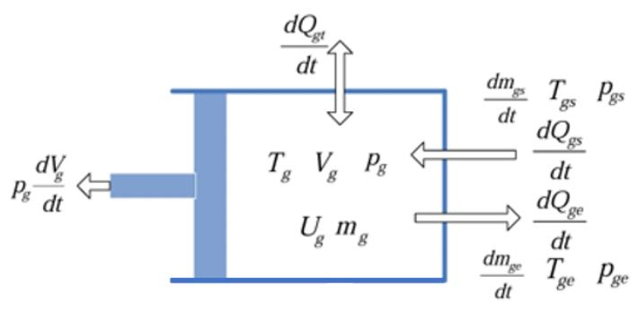

Figure 2.16: Schematic of main heat and mass exchanges inside the gas spring [27].

For this reason, the procedure that has been followed to implement the gas spring behaviour inside OpenFOAM is different. It is based on the hypothesis that air can be seen as an ideal gas and that the process that undergoes inside the chamber is adiabatic. Moreover, it is assumed to know the pressure of the rebound device at the first instant of the simulation.

Going now more in detail in the definition of the force exerted by the gas spring on the piston, the starting point is the observation that the initial volume of the gas spring can be evaluated knowing the gas spring compression ratio:

$$CR_{gs} = \frac{V_{max,gs}}{V_{min,gs}} = \frac{V_{min,gs} + \Delta V_{gs}}{V_{min,gs}} = \frac{V_{min,gs} + L_{stroke} \cdot A_{gs}}{V_{min,gs}}$$

$$= 1 + \frac{L_{stroke} \cdot A_{gs}}{H_{clearance,gs} \cdot A_{gs}} = 1 + \frac{L_{stroke}}{H_{clearance,gs}}$$
(2.36)

$$V_{min,gs} = H_{clearance,gs} \cdot A_{gs} = \frac{L_{stroke}}{CR_{gs} - 1} \cdot A_{gs}$$
 (2.37)

where:

- $V_{max,gs}$  is the final volume of the gas spring (at the TDC)  $[mm^3]$ ;
- $V_{min,gs}$  is the initial volume of the gas spring (at the BDC)  $[mm^3]$ ;
- $\Delta V_{gs}$  is the volume variation from BDC to TDC [ $mm^3$ ];
- $L_{stroke}$  is the piston stroke [mm];
- $A_{gs}$  is the gas spring area [ $mm^2$ ]; it should be remembered that the gas spring has a peculiar shape in this model (shown in Figure 2.7), so it must be

evaluated as  $A_{gs} = \pi \frac{D_{ext}^2 - D_{int}^2}{4}$  where  $D_{ext}$  and  $D_{int}$  are respectively the external and internal diameter [mm];

•  $H_{clearance,gs}$  is the clearance of the gas spring, i.e. the distance between the piston and the cylinder head at the TDC [mm].

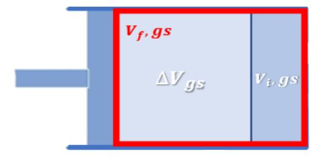

Figure 2.17: Gas spring's initial and final volumes.

Another possible consideration which can be made, it's that the instantaneous variation of the volume can be related to the piston displacement making use of the following relationship:

$$\Delta V_{as}(t_1, t_2) = A_{as} \cdot (\Delta x(t_1, t_2)) \tag{2.38}$$

where:

- $\Delta V_{gs}(t_1, t_2)$  is the volume variation of the gas spring between instant  $t_1$  and  $t_2$  [ $mm^3$ ]:
- $A_{gs}$  is the gas spring area [ $mm^2$ ];
- $\Delta x(t)$  is the variation of piston's displacement between instant  $t_1$  and  $t_2$  [mm].

So this expression is just saying that the volume inside the gas spring increases when the piston displacement increases too, hence when the piston moves towards the TDC, otherwise it decreases.

Once the instantaneous volume of the rebound device is known as  $V_{gs}(t_2) = V_{gs}(t_1) + \Delta V_{gs}$ , it's possible to derive the pressure at the same instant of time remembering that, under the abovementioned hypothesis, it holds true the law:

$$pV^{\gamma} = constant \tag{2.39}$$

where  $\gamma$  is heat capacity ratio [-] which is defined as  $C_p/C_v$  and for an ideal gas can be assumed constant.

Once the pressure is obtained, the force exerted by the gas spring on the piston can be easily evaluated as:

$$F_{aas-spring} = P_{as} \cdot A_{as} \tag{2.40}$$

| Parameter        | Value  | Unit   |
|------------------|--------|--------|
| Initial volume   | 0,2696 | $dm^3$ |
| Initial pressure | 0,99   | МРа    |
| Area             | 0,808  | $dm^2$ |
| $\gamma_{air}$   | 1,4    | _      |

In the following table are reported the main values adopted for the modelling.

Table 2.8: Main parameters of the gas spring model.

#### > Friction

The last term of Equation (2.16) which needs to be defined is  $F_{fric}$ , i.e. the contribution to the dynamic equilibrium of the friction force. This phenomenon mainly occurs between the mover and the cylinder walls and, as its definition claims, it always opposes to the motion, thus it continuously tries to brake the piston both in the compression and in the expansion phase.

Friction can be assumed to be proportional to the velocity of the mover as follows:

$$F_{friction} = C_f \cdot \frac{dx}{dt} \tag{2.41}$$

- $C_f$  is the friction coefficient  $\left[\frac{N \cdot s}{m}\right]$ ; the friction coefficient has been assumed to be  $12 \frac{N \cdot s}{m}$  through a trade-off procedure, considering that a value too low may cause the piston to overcome the TDC and hit the cylinder head being at the same time not close to reality, while a value too high can result in a shutdown of the system since the stroke may end up to continuously decrease in time;
- $\frac{dx}{dt}$  is the piston's speed  $\left[\frac{m}{s}\right]$ .

It should be noticed that the force always has a sign opposite to the piston speed, so its contribution to the dynamic equilibrium depends on the direction of the piston's movement. Anyway, it results to be small with respect to the other terms of Equation (2.16) with the maximum absolute value reached in the middle of the stroke before the piston starts to decelerate and revert its motion.

## 2.2.3 Definition of the model's goals

The purpose of the whole model is to validate in the most confident way the results obtained by the Japanese manufacturer for the prototype reported in the third paper [17]. Thus, Table 2.9, the expected outcomes of the OpenFOAM simulation are reported.

| Parameter            | Value | Unit |
|----------------------|-------|------|
| Operating frequency  | 26    | Hz   |
| Power                | 10    | kW   |
| Thermal efficiency   | 42    | %    |
| Compression ratio CC | 10.06 | [-]  |
| Compression ratio GS | 4     | [-]  |

Table 2.9: Model's goals.

Since many parameters affect such a complicated system like the model in this work proposed, a small variation of the initial values or external conditions was then resulting in a very different working and output scenarios. In order to fully characterize the model, many inputs and data which were lacking from the papers ([35],[40],[17]) have been reasonably guessed or changed through sensitivity analysis.

# 2.3 Outputs

All the previous sections were the basis of the scientific reasoning and the mathematical processes that led to these results and conclusions. The continuous iterations and deep investigation in the nature of the phenomena occurring in this kind of system led to the development of a proper specific knowledge and the consequent management of it. This section represents the first milestone of this thesis and goes through the results of the simulations concerning the dynamic and thermodynamic model of the FPLG. The outcomes will then be commented and deeply analyzed to the eye of the reader, highlighting all the expected results and data

|                        | Toyota | Developed<br>Model | Δ    | Δ%    |
|------------------------|--------|--------------------|------|-------|
| Frequency [Hz]         | 26     | 28.32              | 2.32 | +8.92 |
| Power [W]              | 10'000 | 9'996              | 4    | -0.04 |
| Thermal Efficiency [%] | 42     | 46                 | 4    | +9,52 |
| CR combustion chamber  | 10     | 10.19              | 0.19 | +1.9  |
| CR gas spring          | 4      | 4.01               | 0.01 | +0.25 |

Table 2.10: Developed model vs Toyota.

**Error! Reference source not found.** reports the remarkable outcomes of the model s imulations compared to the expected data from the Toyota's prototype. Not only the differences are negligible but if there are, they show a better performance with respect to the values reported in the papers. For instance, the frequency is 2.32 *Hz* higher in the model developed and this value remains constant after the initial

settlement of the engine to steady state until the end of the simulation time. This outcome is translated into a 8.92% mean increase in piston's speed over the Toyota's prototype, meaning an overall better performance. As a consequence, the thermal efficiency sees a 9,52% jump with almost the same mechanical power output and relative compression ratios for both the gas spring and the combustion chamber. Despite the high efficiency obtained, especially if compared to conventional internal combustion engines, it's anyway meaningful to remind that the model is neglected or approximating some aspects of the system, consequently the actual thermal efficiency on the field is expected be a bit lower than the achieved result.

In the following sections, dynamic, thermodynamic and electric results will be analyzed in detail, highlighting once more, the outstanding achievements that have been possible thanks to the reasonings and refinements brought to the model through the whole developing process.

## 2.3.1 Dynamic results

The dynamic of the system and the overall piston's path and trajectory has been precisely refined to fulfil the constraints on the TDC and BDC while at the same time to maximize the performance of the engine. This final outcome embraces all the wanted aspects of the system: matches perfectly with the prototype built by Toyota and determines once for all the validity of the model here developed.

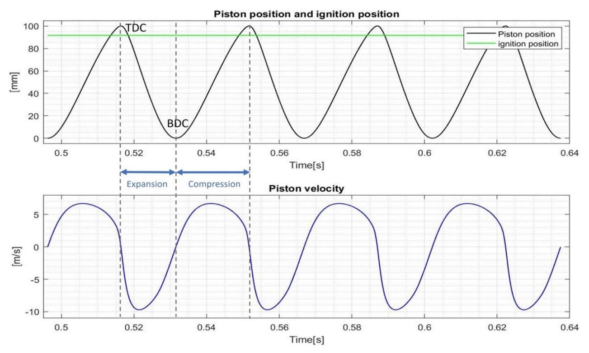

Figure 2.18: Piston position and velocity.

In Figure 2.18 the charts are displaying the piston position in black in the upper portion together with the ignition position in green, both expressed in [mm], while in the lower portion of the chart, in blue, the piston velocity is reported in  $\left[\frac{m}{s}\right]$ . The x-axis is reporting the time.

By looking at the behavior of the charts, it's unequivocal how the trajectory is non-sinusoidal and shows peaks at the TDC and BDC and therefore, the velocity in those instants drops quickly to zero reversing its direction. This overall shape of motion is the typical and characteristic swinging nature of the FPLG as it is shown in chapter 1.

After a first transient, the motion reaches a steady state dynamic at time t=0.2s. The beginning and the end of the time windows shown are respectively at t=0.49s and t=0.64s and the steady state dynamic is already fully developed. The simulation has been performed for a longer period of time and produces no differences once it settles in steady state operation. On the other hand, the thin dotted lines are underlining the two salient points of the motion, the TDC and BDC, which then repeat themselves throughout the cycles. Moreover, the two blue arrows in between the two charts are stressing the timeframe of expansion and compression strokes.

Observing the piston position, it can be recognized that the expansion stroke requires less time than the compression one and consequently the slope is higher in absolute terms. In fact, once the motion bounces back from the TDC, the piston velocity gets negative and reaches in absolute terms the highest value of all the cycle, this is definitely the correct behavior due to the violent energy released right after the combustion process has occurred. The overall goal has also been to try to push the absolute value of the velocity to the maximum in order to reach the highest performances achievable by this configuration, not only power-wide but also efficiency-wide. Furthermore, the peak of the blue line, the velocity, comes exactly when the piston position is in the middle of the stroke as it is expected.

Figure 2.19 shows instead in red color, the electric machine force  $F_{LEM}$  which is expressed in [N].

It is following the same trend of the piston velocity, therefore being proportional to the latter, it has the overall same shape and bigger peaks after combustion in absolute terms. Appropriate to point out is the noticeable difference of trajectory followed in the different cycle's strokes. The direction and sign of the force is here represented as the same of the blue chart of the velocity even if it is the exact opposite, this decision has been purely aesthetical to make it look very intuitive. In the reality of the physics behind, the force has the purpose to slow down the piston and therefore to work against its speed direction.

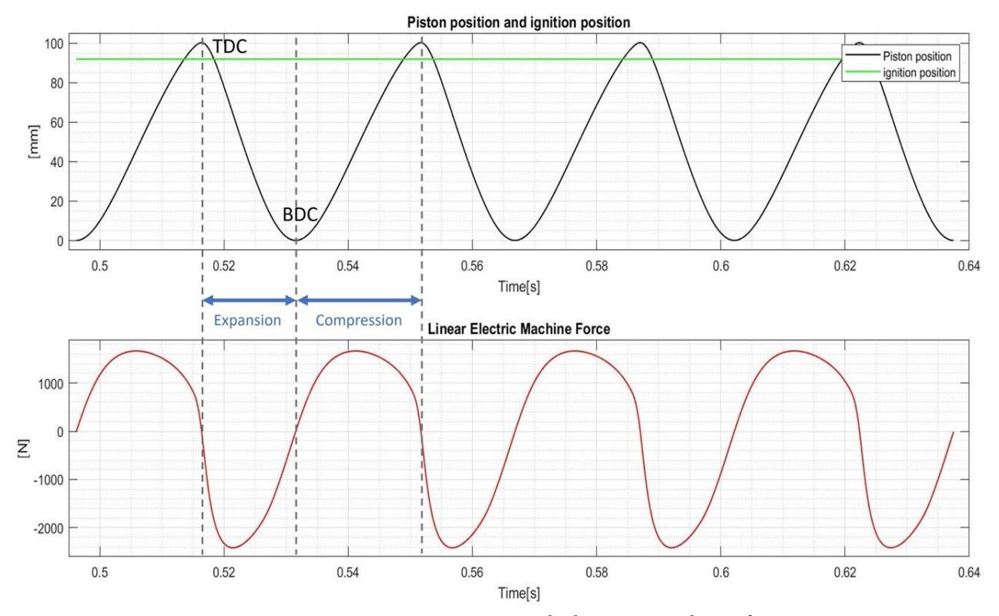

Figure 2.19: Piston position and electric machine force.

## 2.3.2 Thermodynamic results

The focus in now moved to the thermodynamic conditions achieved by the model inside the combustion chamber and the gas spring.

Figure 2.20 displays once again in the first upper portion in black and green the piston's position and the ignition position to give a reference to the reader. The three charts below instead are representing different thermodynamic variables concerning the combustion chamber: in a red color the in-cylinder temperature is reported in Kelvin degrees [K], in blue line the graph showing the in-cylinder volume expressed in  $[cm^3]$  and in violet the graph displaying the corresponding in-cylinder pressure in [Pa].

The grey dotted lines once again are circumscribing the positions of TDC and BDC. In the correspondence of the top position, it is firmly coherent that the values of the in-cylinder pressure and volume are in their nearly respective maximum and minimum, and vice-versa happens at the Bottom Dead Centre. Now what is also important to accentuate, is the pressure drop right before the BDC which strengthen

the model robustness by making clear that the gas scavenging is taking place adjusting the pressure to the external intake pressure. Again, the maximum peak of the last, skyrockets to the value of roughly 6.5*MPa* or in other words 65 *bar* right when combustion occurs, which is in line with conventional technologies.

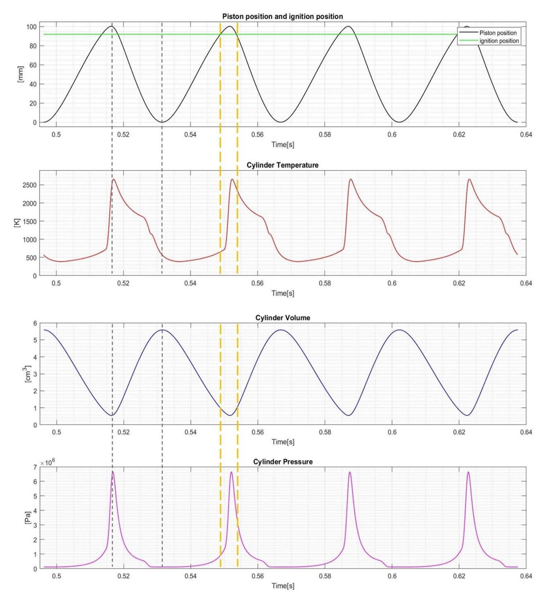

Figure 2.20: Position, cylinder temperature, in-cylinder volume and pressure.

The fact that the volume's path over the cycle is continuous and stable and the trajectory shows no ripples means that the simulation runs fluently and smoothly. Evident is also the inverse proportionality of the volume with respect to the piston position due to the zero-reference frame set at the BDC, thus when the maximum volume of roughly  $403 \ cm^3$  is achieved. The minimum is reached at the TDC and its value sticks around  $40 \ cm^3$ , i.e. the product of  $H_{clearance,cc}$  and the  $A_{cc}$ . Everything is coherent and behaves as foreseen and commanded.

The thick yellow lines are marking the beginning and the end of the combustion process once triggered by the spark. In between those lines, when the volume of the combustion chamber is at its minimum, the values of pressure and temperature reach their positive peaks as the physics phenomenon rules.

The next step about the cylinder is to check whether or not the temperatures inside it  $(T_{cyl})$  are somehow manageable values and do not exceed the boundaries related to the internal combustion engine technology, laying around conventional engines' temperatures. In Figure 2.20 the heat release model implemented by the Wiebe's equation is guaranteeing, in the right way, a proper energy release to stop the piston and push it back towards the opposite direction. The maximum temperature reaches and overcomes the instantaneous value of 2500 K but this threshold is not of concern and can be easily sustained for a long steady operation. Interesting is also the overall shape of the  $T_{cyl}$ , the first portion of the graph after the fresh air intake following the BDC position, is the result of the compression of the air-fuel mixture. Then, once reached the ignition position, the mixture is triggered by a spark and releases the heat resulting in a big spike. Right after that, the expansion stroke occurs reducing significantly the temperature to around 1600 K and is then followed by the scavenging process which makes the curve drop to the minimum value.

It can be furtherly noted in the upper graph, one of the peculiarities of the Free-Piston technology: following ignition, as previously stated the expansion stroke is faster than the one usually obtained in traditional crank mechanisms and for this reason the resident time of the piston at the TDC is much smaller. Hence, the thermal losses of combustion are generally higher, slightly disadvantaging the efficiency but reducing the available time for pollutants formations resulting in lower emissions [19].

These overall behaviors can be extrapolated for the gas spring as well, giving once for all an idea of the working conditions inside the bounce chamber opposed to combustion chamber motion. Here, in Figure 2.22, the gas spring volume  $[cm^3]$  in the upper chart is reported in a blue line as well as the gas spring pressure [Pa] with a violet color right below it.

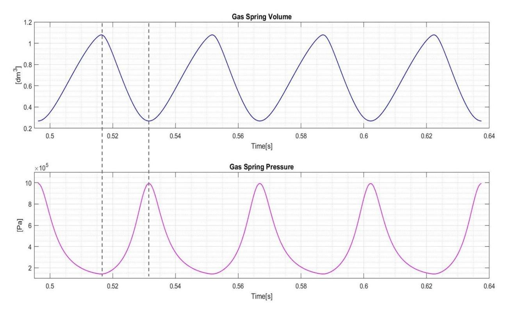

Figure 2.21: Gas spring pressure and volume.

As reported the gas spring volume is expressed in  $[dm^3]$  and reaches the maximum value of  $1.13 \ dm^3$  proportionally to the piston position, which in the instant in which reaches the top, represents the biggest expansion moment of the gas spring. The value can be obtained by multiplying the  $A_{gs}$ , reported in Table 2.8, to the  $L_{stroke}$ . The volume's behaviour is inversely proportional to the pressure's and both of these parameters are not exceeding some particular threshold and result in this way perfectly manageable.

At the starting time t = 0s, the piston is set at the BDC in which also the piston position is at the zero-reference position. From there, the piston starts going up towards the top, due to the gas spring being set in the start-up phase to an inner pressure equals to  $9.95 \cdot 10^5 \, Pa$ . This start-up procedure is done only to achieve the steady-state condition which is then reached few cycles later. Here all the graphs show no transient periods since they all start from t = 0.49s, thus the transient is not interfering with the results and the steady state working condition has already been achieved.

#### 2.3.3 Electric results

The final analysis of the outputs is focusing on the three-phase voltage waveforms [V] resulting from the linear electric generator proposed and analyzed in previous

sections as well as the instant electric power output [kW] of the generator. In Figure 2.22, the second chart is reporting the induced voltage waveform while in Figure 2.23 is displaying the power, both repeating the piston trajectory to give a better understanding of the electrical outcomes.

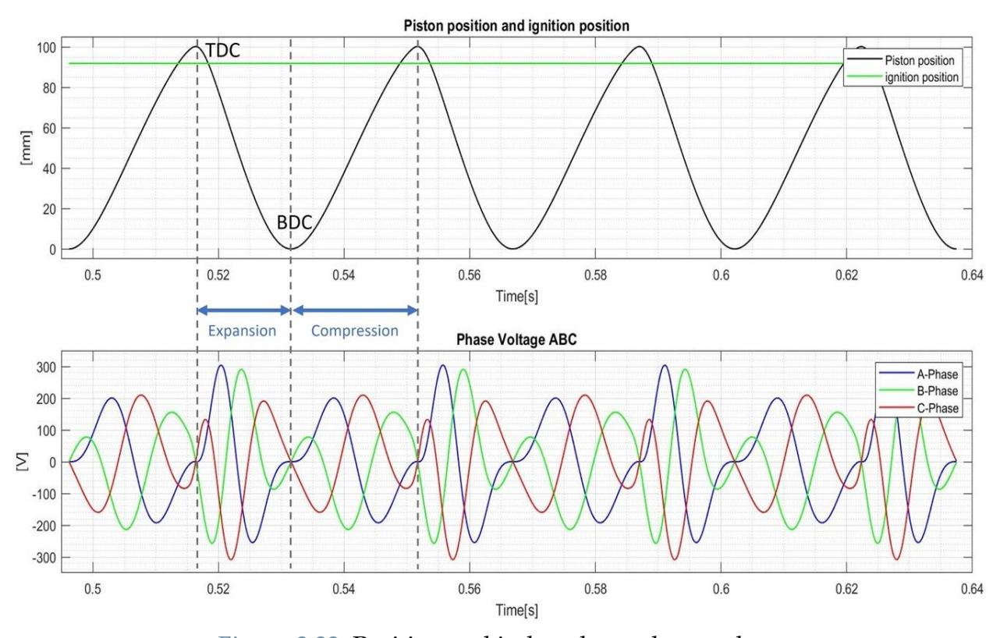

Figure 2.22: Position and induced per phase voltage.

The thin grey dotted lines in this case underline the big differences between the compression and expansion stroke. The phase line to neutral voltage expressed in the analytical section is here reported and makes it clear how the waveform is non-sinusoidal. Besides the analytical expression, being the piston speed not constant, the three phases are not repeating themselves but shifted, instead the waveform has different spikes and oscillations depending on the phase and the stroke movement. It is distinct how the expansion stroke right after the combustion is characterized by bigger spikes in absolute terms with respect to the compression stroke. This a logical consequence of the higher velocities of the piston due to the heat released. The values reached by the linear generator proposed are in the order of 300V and 250V for the two different cycle's phases.

The instantaneous electric power is related to this peculiarity once again, as shown by the orange line's graph of Figure 2.23. Here the maximum values get close to 25kW and 12kW respectively for the expansion and compression stroke. However,

being the mechanic to electric efficiency of the linear electric machine close to one, it's possible to verify that the average electric power over time is close to 10kW.

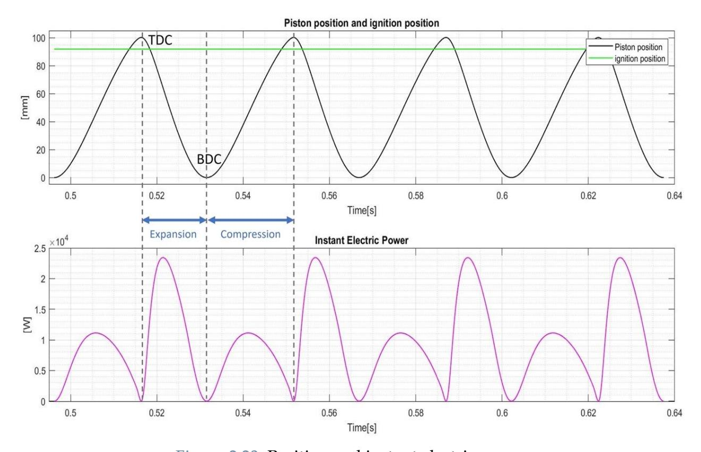

Figure 2.23: Position and instant electric power.

In Figure 2.22 and Figure 2.23 the induced voltage waveform and the relative instant electric power output of the FPLG are reported. These are the straight result coming from Newton's second law of motion (2.16) and the LEM implemented which generated the peculiar piston trajectory of Figure 2.18. In order to properly feed a DC-bus a control strategy is needed.

# 3. Active rectifier control Model

In the Free-Piston Linear Generator, the power released inside the cylinder is directly delivered to the piston becoming kinetic energy, this determines a relative motion between the coils in the stator and the permanent magnets on the mover of the linear electric generator, generating a variable magnetic flux and inducing a voltage in the coils and consequently, the current starts to flow together with the power exchange.

Anyway, the three-phase non-sinusoidal electric output obtained from the steady state simulation is not suitable to feed a load. In particular, being correlated to the fluctuating piston velocity, the voltage waveforms are far from a sinusoidal shape. A power processor, based on one or more power electronics converters, is then necessary to feed the DC bus in a controlled way.

In the context of FPLG, one of the most promising application is in the automotive sector, utilized as power unit or range extender in hybrid electric vehicles, where a 400 V or 800 V DC bus architecture interfaces with the battery, propulsion inverters or other DC loads. For this reason, the power converter configuration adopted is the three-phase active rectifier, i.e. a converter which is able to produce a controlled DC electric output from an unregulated AC three-phase input. This operation is performed making use of feedback control algorithms which can be implemented with different control strategies such as constant DC voltage, constant DC power or more.

This chapter aims to describe the model developed in the Simulink software for the control of the active rectifier. Simulink, indeed, is a MATLAB-based graphical programming environment for modelling, simulating and analyzing multidomain dynamical systems [48]. It allows to create a block chain which simulates the behavior of each component of the system, providing, specifically in the case of electrical networks, an accurate representation of the expected outputs. It also gives the chance to understand the response of the device to different input signals and thus the robustness of the control system.

The steps followed to develop the model are described and the final results are discussed in detail. A brief theoretical reminder about Power Electronics, Clarke and

Park's transformations and PID controllers' is also included into this chapter in order to give to the reader a concise review about these notions fundamental for the comprehension of the chapter.

## 3.1 Theoretical background

This section aims to provide a brief review of some scientific topics necessary to implement the control of three-phase machines and power converters. The analysis starts with an introduction on Power Electronics and specifically on rectifiers, showing the main characteristics and operating principles. Then, the focus moves to Clark and Park's transformations, useful and clever methods widely used in AC three-phase machines and systems to handle in an easier way the equations which describe the behavior of a given component or device. Finally, the last paragraph is devoted to the analysis of the working principles and the calibration of the PID controllers, i.e. the elements of the control systems which have the role to generate the control signals according to the error between the reference and actual input signal, its integral and its time derivative.

#### 3.1.1 Power Electronics and rectifiers

Power Electronics is the branch of electrical engineering that deals with the processing of voltages and currents to deliver power with the desired conditions in a stable and reliable way. The task of Power Electronics is to process and control the flow of electric energy by supplying voltages and currents in a shape that is optimally suited for user loads.

The general structure of a power electronic converter is well-described by the block diagram in Figure 3.1 and Figure 3.2. The output of the power processor is continuously compared with a given refence, so that the error between the two is exploited in the controller's algorithm to change the state of the power semiconductor devices into the converters. [49]

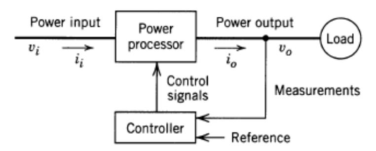

Figure 3.1: Typical architecture of a Power Electronics device.

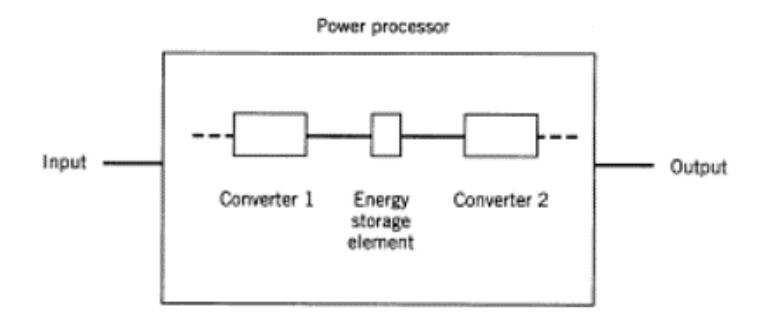

Figure 3.2: Typical architecture of a Power processor.

FPLGs usually exploit inverters operated as active rectifiers, i.e. the power flow is from the AC to the DC side. Inverters are indeed intrinsically reversible power electronic converters and this feature can be relevant to regulate the piston motion in some unusual operations like the starting phase, misfires or any kind of transient.

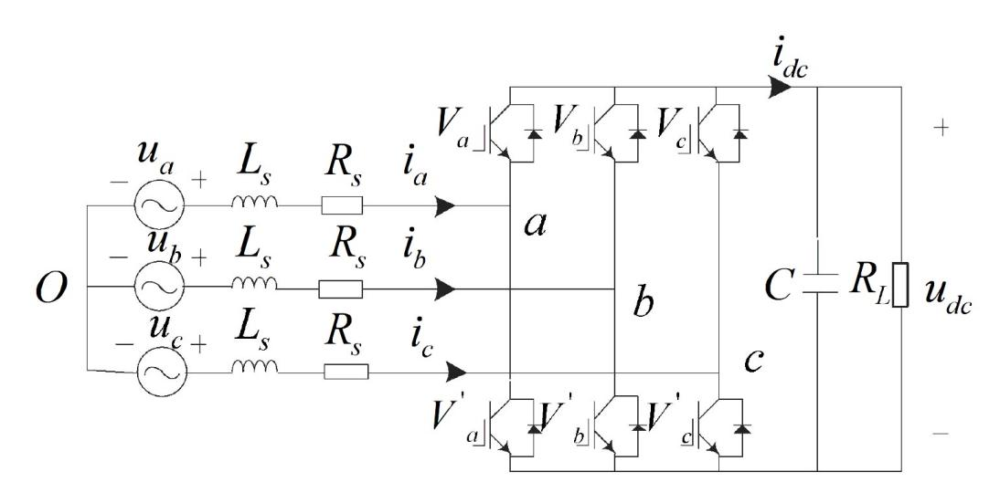

Figure 3.3: Typical electrical scheme of a 3-phase active rectifier [50].

The circuit in Figure 3.3 is modelling the three-phase Linear Electric Machine, the three-phase active rectifier and the DC equivalent load, where:

- $u_a, u_b, u_c$  are the three-phase induced voltages in the coils of the generator;
- $L_s$  and  $R_s$  are representing the leakage inductance and resistance of the stator;
- $i_a$ ,  $i_b$ ,  $i_c$  are the phase currents on the AC-side;
- $V_a, V_b, V_c$  and  $V'_a, V'_b, V'_c$  are the voltages in each switch unit composed by a unidirectional controllable switch and its antiparallel diode;
- *C* is the DC-side capacitor;
- $R_{load}$  is the load apparent resistance.

The presence in each switch unit both of a unidirectional controllable switch and an antiparallel diode is the key for the device's reversibility. Indeed, when the switch

unit is in the ON state, current can flow either into the switch or through the diode according to its direction, thus depending on whether the power flux is from AC to DC or vice versa.

The state of each switch unit is regulated by an external control system which usually operates through feedback-loops. Hence, from the so-called "error signal", that is the difference between the actual output and the reference setpoint, the control algorithm is able to individuate the switches that must be closed or opened. Because of the control, this kind of power converter is usually referred to as "active" rectifier, to clearly distinguish it from the line frequency rectifiers where, as the name says, the state of the power semiconductor device, namely the diodes, depends only on the voltages into the circuit and it cannot be controlled since it is a "passive" control system.

#### 3.1.2 Clarke and Park's transformation

In the study of three-phase systems, it is often convenient to replace a set of phase variables with another one more suitable to handle the equations which describe the behavior of a given component or device. The two sets of variables, the original and the new one, can be related either by an appropriate invertible transformation matrix or by real non-zero scalar quantities. As the transformation matrices are invertible or the scalar quantities are non-zero, the solution of the equations of the transformed model will obviously yield the unknowns of the original model. [51]

In this context, Clarke and Park's transformations can be adopted to simplify the analysis of 3-phase electrical systems and, specifically, to manage equations which make use of terns of instantaneous values. In the following subsections, both transformations are analyzed and then the analysis moves to the implications and adoption for the developed model.

#### Clarke's Transformation

Clarke's transformation, also called Park's transformation on fixed axes, is a linear transformation with real constant coefficients which can be applied to time-variable terns like voltages and currents. It can be seen as a particular case of the more generic Park's transformation.

A generic tern of instantaneous and balanced phase values, like  $v_a(t), v_b(t), v_c(t)$  if voltages are considered, can be represented by the projection, of a rotating vector centered in the origin, along three axes displaced 120° apart. The vector is usually called "Clarke vector" and in the most general case, it has variable module and variable rotational speed. This same vector can be also described with a fixed

reference system which has one axis (called  $\alpha$ ) oriented as the a-phase axis, while the other (called  $\beta$ ) orthogonal to it in the positive sense of the rotation, set to be counterclockwise. For sake of simplicity and compactness,  $\alpha$  and  $\beta$  axis usually correspond to the real and imaginary axis of a complex plane. In this way Clarke vector is uniquely identified by a time varying complex number. Moreover, if the system is not balanced, thus the sum of the phase variables is instantaneously different than zero, the projections on  $\alpha$  and  $\beta$  axis are not enough to correctly describe the original phase variables, an additional fictitious-axis component is needed to take into account the average value: this component is called homopolar or zero-sequence.

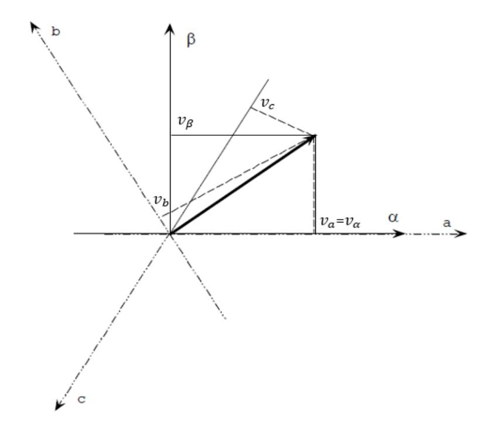

Figure 3.4:  $\alpha$ - $\beta$  transformation for a balanced 3-phase system.

The transformation matrix [52], i.e. the matrix which allows the transformation from the phase variables a, b, c to Clarke's variables  $\alpha$ ,  $\beta$ , 0, can be written as:

$$T_{0} = \begin{bmatrix} \sqrt{\frac{2}{3}} & -\frac{1}{\sqrt{6}} & -\frac{1}{\sqrt{6}} \\ 0 & \frac{1}{\sqrt{2}} & -\frac{1}{\sqrt{2}} \\ \frac{1}{\sqrt{3}} & \frac{1}{\sqrt{3}} & \frac{1}{\sqrt{3}} \end{bmatrix} = \sqrt{\frac{2}{3}} \begin{bmatrix} 1 & -\frac{1}{2} & -\frac{1}{2} \\ 0 & \frac{\sqrt{3}}{2} & -\frac{\sqrt{3}}{2} \\ \frac{1}{\sqrt{2}} & \frac{1}{\sqrt{2}} & \frac{1}{\sqrt{2}} \end{bmatrix}$$
(3.1)

Thus, the following holds true:

$$\begin{bmatrix} v_{\alpha}(t) \\ v_{\beta}(t) \\ v_{0}(t) \end{bmatrix} = T_{0} \begin{bmatrix} v_{a}(t) \\ v_{b}(t) \\ v_{c}(t) \end{bmatrix}$$
(3.2)

 $T_0$  is an orthogonal matrix since the inverse coincides with the transpose one. This is an important property because it can be demonstrated [51],[52],[53] that ensures the invariance of power, energy and vectors' modules, but at the same time, it allows to derive Equation (3.3):

$$\begin{bmatrix} v_a(t) \\ v_b(t) \\ v_c(t) \end{bmatrix} = T_0^t \begin{bmatrix} v_\alpha(t) \\ v_\beta(t) \\ v_0(t) \end{bmatrix}$$
(3.3)

#### Park's Transformation

As already anticipated, Clarke's transformation is just a particular case of the more generic Park's transformation. Resuming the graphical representation of the problem shown above (Figure 3.4), Park's transformation introduces an additional step: the axes of the Clarke reference plane (previously called  $\alpha$  and  $\beta$ ) are no longer fixed, but they rotate with a certain rotational speed  $\omega'$  which can generally be different from the one of the rotating vector  $\omega$ . The axes of the rotating frame are referred to as d and q, standing for direct and quadrature-axis, while Clarke vector in this plane is instead called "Park vector".

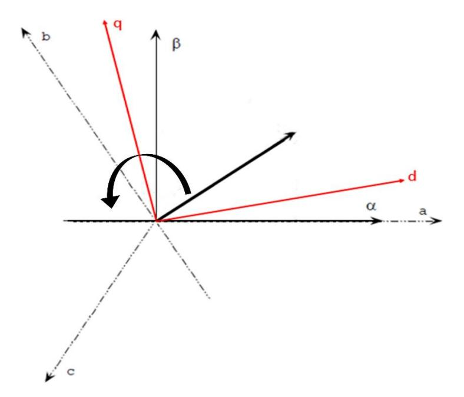

Figure 3.5:  $\alpha$ - $\beta$  and d-q transformations for a balanced 3-phase.

Figure 3.5 shows the evolution of the problem naming differently the fixed axes ( $\alpha$  and  $\beta$ ) and the rotating ones (d and q). Exactly as in the previous case, a zero-sequence has to be introduced if the set of phase variables is not balanced.

The Park transformation matrix [53] is still orthogonal and results:

$$T(\theta') = \sqrt{\frac{2}{3}} \begin{bmatrix} \cos(\theta') & \cos\left(\theta' - \frac{2\pi}{3}\right) & \cos\left(\theta' + \frac{2\pi}{3}\right) \\ -\sin(\theta') & -\sin\left(\theta' - \frac{2\pi}{3}\right) & -\sin\left(\theta' + \frac{2\pi}{3}\right) \\ \frac{1}{\sqrt{2}} & \frac{1}{\sqrt{2}} & \frac{1}{\sqrt{2}} \end{bmatrix}$$
(3.4)

Knowing matrix  $T(\theta)$ , it holds true that:

$$\begin{bmatrix} v_d(t) \\ v_q(t) \\ v_0(t) \end{bmatrix} = T(\theta') \begin{bmatrix} v_a(t) \\ v_b(t) \\ v_c(t) \end{bmatrix}$$
(3.5)

and:

$$\begin{bmatrix} v_a(t) \\ v_b(t) \\ v_c(t) \end{bmatrix} = (T(\theta'))^t \begin{bmatrix} v_d(t) \\ v_q(t) \\ v_0(t) \end{bmatrix}$$
(3.6)

It's visible that now the matrix terms are not constant anymore but functions of  $\theta'(t)$ , i.e. the time-dependent angular parameter of the dq rotating axis which differentiate from the equivalent term of the abc rotating vector called  $\theta(t)$ . Both the angles  $\theta'(t)$  and  $\theta(t)$  are referred to the a-phase taken positive in the counterclockwise direction. The former and its time derivative  $\omega'$  can be interpreted respectively as the position and the angular velocity of axes d and q with respect to the fixed reference defined by  $\alpha$  and  $\beta$  axes. As consequence, it's also straightforward that when  $\theta'$  is constant, Park's transformation reduces to the particular case with fixed axes. Anyway, to reach the same form of Clarke's matrix, the angle  $\theta'(t)$  must be equal to zero, otherwise an angular displacement remains between  $\alpha\beta$  and dq frames. In light of this observation,  $T(\theta'(t))$  can alternatively be seen as:

$$T(\theta'(t)) = H(\theta'(t)) * T_0$$
(3.7)

where  $T_0$  is Clarke's transformation matrix, while  $H(\theta'(t))$  is the rotational matrix

$$H(\theta'(t)) = \begin{bmatrix} \cos(\theta'(t)) & \sin(\theta'(t)) & 0\\ -\sin(\theta'(t)) & \cos(\theta'(t)) & 0\\ 0 & 0 & 1 \end{bmatrix}$$
(3.8)

This last matrix imposes a rotation of d and q components of an angle of  $\theta'(t)$ , while leaving the homopolar unaltered.

The transformation on rotating axes allows often drastic simplifications in the equations' structure. A meaningful particular case is the one involving a sinusoidal symmetric tern with  $\theta = \omega t$ , where  $\omega$  is the angular speed. Being the voltage balanced, the zero-sequence component can be neglected because it is always zero. Being sinusoidal though, the resulting vector is rotating with constant velocity  $\omega$  and its module does not change in time. Moreover, knowing that  $\theta' = \omega' t$ , the following can be imposed:

$$\omega' = \frac{d\theta'}{dt} = \frac{d\theta}{dt} = \omega \tag{3.9}$$

This means that d and q axes are imposed rotating at the same angular speed as the vector, thus the Park vector results constant, since it is described by the same constant-value components and the time dependency is lost. Figure 3.6 is showing exactly this aspect assuming that d'q' are the position in a time-instant t > 0 of the dq axes (in t = 0) after a rotation of the same angle of the blue Park vector.

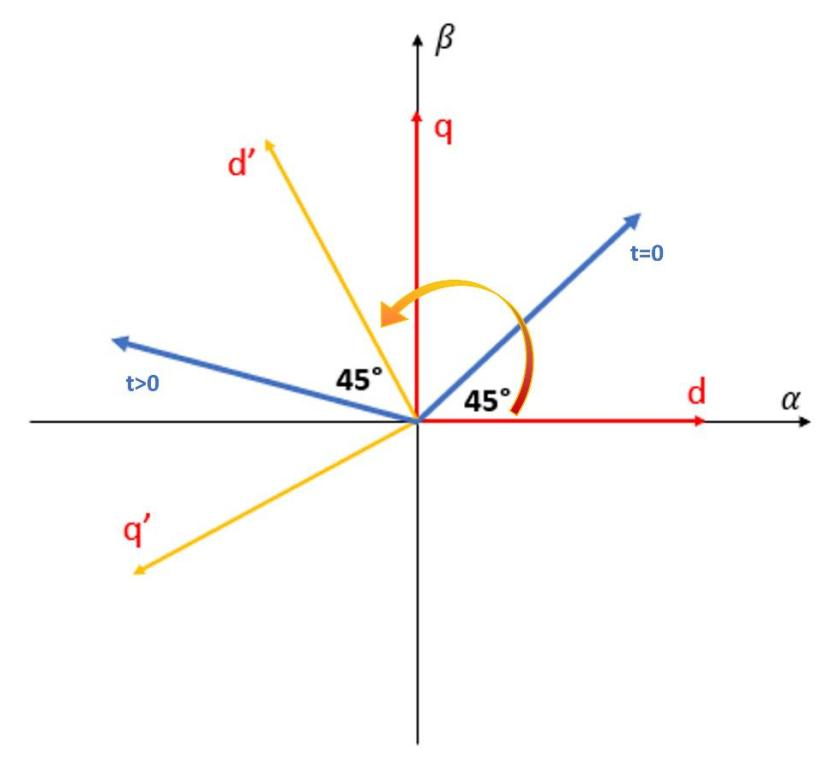

Figure 3.6: Park's transformation applied to a symmetrical sinusoidal tern.

It's clear that under the circumstances of this example the transformations can remarkably reduce the complexity of the analytical dissertation, allowing to represent a set of time-varying voltages or currents with a constant complex number.

In the case of a non-sinusoidal tern instead, the resulting Park vector does not have constant module and constant rotating speed. However, if the initial angular position of the dq plane is chosen such that the quadrature component is null and the axis are rotating as the Park vector, the q-component is continuously kept equal to zero. Undoubtedly, differently from the sinusoidal case, the d-component does not remain constant since the vector's module is changing as well due to power fluctuations. Figure 3.7 is representing this condition, displaying d'q' in a time-instant t > 0 as the new position of the dq axes (in t = 0) after a rotation of the same angle of the blue Park vector.

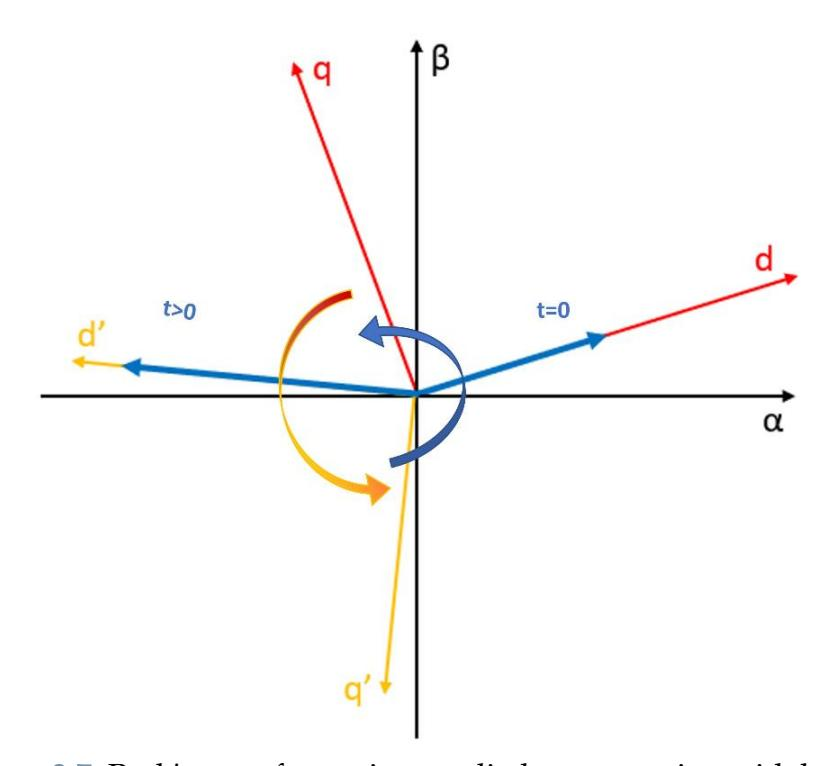

Figure 3.7: Park's transformation applied to a non-sinusoidal tern.

The result just obtained has relevant implications in the control of the active rectifier. In fact, the voltage induced by the magnetic flux inside the Linear Electric Machine is non-sinusoidal and the adoption of Park's transformation allows to implement a control logic able to keep the DC bus constant and the power factor close to one.

#### 3.1.3 PID controllers

A Proportional-Integral-Derivative controller (PID) is a feedback control mechanism widely adopted in industrial applications to keep the output of a system close to the desired value. It operates on the difference between the expected (reference) and the actual output of a process. Indeed, it generates a corrective action on the system according to the error signal, its time integral and time derivative. The name of the

controller comes from the fact that the correction can be executed acting on three parameters: Proportional (P), Integral (I) and Derivative (D).

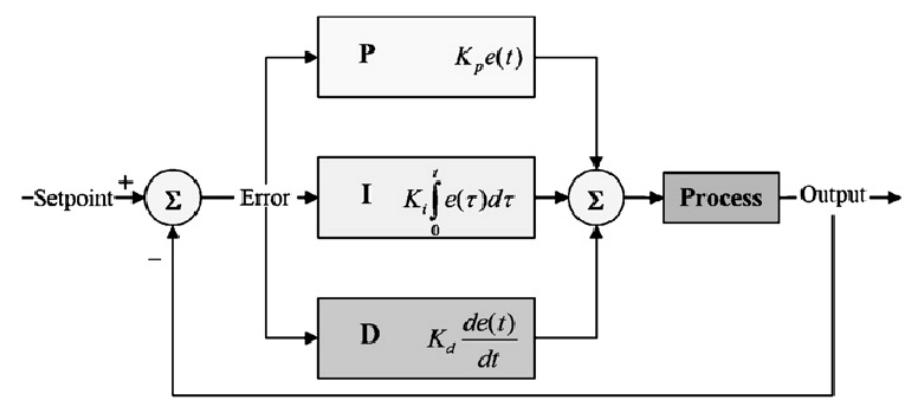

Figure 3.8: A block diagram of PID controller.

Despite the logic being the same, some PID controllers can vary in the way they correlate the input, which is the error, to the output, also called actuating signal. Not always indeed the correction is performed acting on all the three parameters as shown in Figure 3.8, but sometimes just on a single one or a combination of them. In these cases, it is common to refer to the controller not as PID but with the letter corresponding to the terms adopted (P, I and/or D), the developed active rectifier control logic, for instance, only exploits PI controllers.

Going now in detail of each contribution [54]:

• *Proportional control* linearly correlates the controller output to the error between the measured signal and the setpoint. The mathematical expression which describes this behaviour is the following:

$$ouput(t) = K_p * error(t)$$
 (3.10)

where  $K_P$ , the proportional controller gain, can be expressed as:

$$K_p = \frac{\Delta \ output}{\Delta \ input} \tag{3.11}$$

Obviously, if the output parameter varies more than the input one,  $K_p$  will be greater than 1, otherwise it will be lower. Ideally, if  $K_p$  was tending to infinity, even zero error would result in a relevant output, however this condition is never really applied since the loop becomes unstable and does not reach a steady state. Differently from I and D-controls, proportional control works on the actual value of the error and the system's response is quite fast, hence it is frequently adopted in controllers, sometimes just by itself.

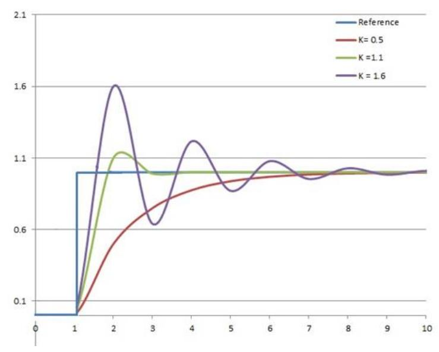

Figure 3.9: Influence of  $K_p$  variation.

Figure 3.9 is showing the response of a PID controller to a step change of the setpoint for three values of Kp, holding Ki and Kd constant. It's clear that an increase of Kp can be beneficial to reduce the time response of the system, but if the value is too high, this leads to an output presenting large oscillations before reaching convergence.

• *Integral control* affects the system responding to cumulated past errors. The idea behind this control is to respond proportionally to the cumulative sum of the deviations' magnitude, thus the integral taken with respect to time. This behaviour can be illustrated mathematically as:

$$ouput(t) = K_i \int_0^t e(\tau)d\tau$$
 (3.12)

where  $K_i$  is called integral gain.

Because of the time integral, it takes longer than P-control for the algorithm to determine the proper response. This is the reason why often the Integral control is used in combination with P or PD types. Despite being slower, the main advantage of adding I-control to the controller is the possibility to eliminate systematic offsets in the output signal, allowing it to remain within a narrow range of variation.

As in the previous picture,

Figure 3.10 is representing the response of a PID controller to a step change of the setpoint, but this time  $K_i$  is varied while the others kept constant. Again, if the

integral gain value is taken too big, the setpoint is reached through large oscillations, while if too small, the response is steadier but takes longer.

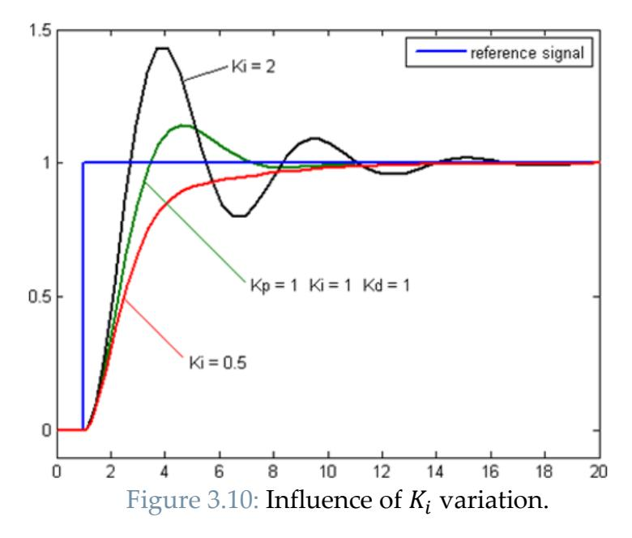

• Derivative control, unlike P-only and I-only controls, is a form of feed forward control, meaning that it anticipates the process conditions by analyzing the rate of change of the error. The larger the error's derivative with respect to time, the more pronounced the response will be. This can be traduced in the following expression:

$$ouput(t) = K_d \frac{de(t)}{dt}$$
(3.13)

where is referred to as  $K_d$  derivative gain.

Unlike proportional and integral controllers, derivative ones do not guide the system to steady state, but anyway they are able to adapt to changes in the system, most importantly to oscillations. D-only controls do not exist since they are limited to the measurement of the change in the error without knowing where the setpoint is fixed, so this type of control must be adopted in conjunction with another methods, such as P-only or a PI combination. However, in general derivative control is only applied for processes with rapid changes that need a fast response time but the controller can result to be too sensitive to noise and is required to have higher computational power.

Differently from  $K_p$  and  $K_i$  response to a step change of the setpoint, as shown in Figure 3.11 above, the influence of a  $K_d$  variation on the output signal is less evident. An increase of this parameter indeed does not significantly change

the amplitude of the oscillations, but their frequency before reaching the expected value.

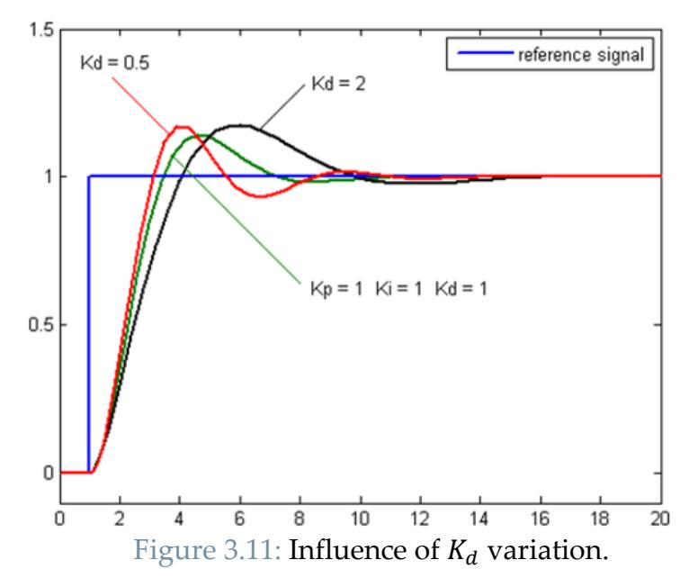

Finally, summarizing, the output signal of a PID controller in its most generic configuration can be written as:

$$output(t) = K_p e(t) + K_i \int_0^t e(\tau) d\tau + K_d \frac{de(t)}{dt}$$
(3.14)

As it is clear from this expression, the operation of a PID controller depends mainly on the gains,  $K_p$ ,  $K_i$  and  $K_d$ . The procedure which allows to derive the value of these parameters is also called calibration of the controller and is generally based on engineering experience and trial-and-error solutions. However, there are also heuristic methods, the most known is the Ziegler–Nichols here briefly reported [55]:

- $K_i$  and  $K_d$  are initially set to zero, while  $K_p$  is gradually increased from zero until it reaches the ultimate gain  $K_u$ , the value at which the output of the control loop has stable and consistent oscillations.
- $K_u$  and the oscillation period  $T_u$  are then used as shown in the table to set the three gains depending on the type of controller adopted.

| Control Type | $K_p$       | $K_i$         | $K_d$        |
|--------------|-------------|---------------|--------------|
| P            | $0.5K_u$    | _             | _            |
| PI           | $0.45K_{u}$ | $0.54K_u/T_u$ | _            |
| PID          | $0.6K_u$    | $1.2 K_u/T_u$ | $3K_uT_u/40$ |

Table 3.1: Ziegler-Nichols method.

Despite the simplicity of heuristic methods like the Ziegler–Nichols, it's important to remark that often they are approximated, thus not completely reliable for a precise calibration. However, in combination with a minimal knowledge of the expected influence of each gain on the system's response, they can be a good starting point for further investigations.

As already anticipated, the control system of the active rectifier model developed in Simulink works with PI controllers. They are implemented both in the voltage and current loop and allow to achieve the desired output setpoint on the voltage equals to 800 *V*. A detailed description of their implementation in the model is provided in the next section together with a case-specific analysis on the influence of the gains on the system's response.

# 3.2 Analytical origin of the model

In order to assess the best and most suitable model for the active rectifier and control system, there has to be an analytical study as the starting point to develop and deeply understand the physics behind the problem. The overall goal is to control the output of the active rectifier in a precise manner.

In this section, the mathematical description of each component of the model is deduced, making use of the Kirchhoff's laws of the circuit, of the Double-Loop control system and of the Space Vector Pulse Width Modulation (SVPWM) technique.

#### 3.2.1 Kirchhoff's laws

The Kirchhoff's laws are the starting point for any modelling approach based on an electrical circuit.

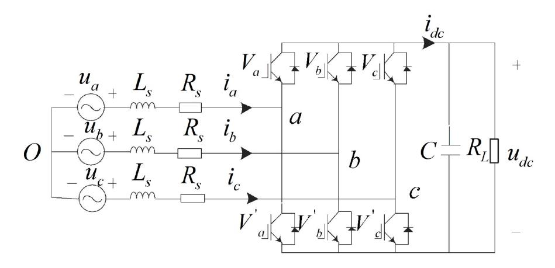

Figure 3.12: Schematic of the rectifier's circuit [50].

Figure 3.12 is representing a sketch of the Linear Electric Machine, the power converter and the load. As it can be seen in the circuit, the three-phase inverter is composed by three diode-IGBT legs. The IGBT switches have to be controlled and managed properly as it is described afterward when dealing with the switching pattern and the SVPWM.

Kirchhoff's Voltage Laws (KVL) on the AC side of the active rectifier are:

$$\begin{cases} U_a - L_s \cdot \frac{di_a}{dt} - R_s \cdot i_a = V_{a0} \\ U_b - L_s \cdot \frac{di_b}{dt} - R_s \cdot i_b = V_{b0} \\ U_c - L_s \cdot \frac{di_c}{dt} - R_s \cdot i_c = V_{c0} \end{cases}$$

$$(3.15)$$

in which:

- $U_a$ ,  $U_b$ ,  $U_c$  are the induced voltages into the Linear Electric Machine [V];
- $i_a$ ,  $i_b$ ,  $i_c$  are the phase currents [A];
- $L_s$  is the leakage-inductance of the stator [mH];
- $R_s$  is the self-resistance of the stator  $[\Omega]$ ;
- $V_{a0}$ ,  $V_{b0}$ ,  $V_{c0}$  are the phase to neutral voltages [V].

Now it can also be written that [56]:

$$\begin{cases}
V_{a0} = V_{an} - V_{n0} \\
V_{b0} = V_{bn} - V_{n0} \\
V_{c0} = V_{cn} - V_{n0}
\end{cases}$$
(3.16)

where:

- $V_{an}$ ,  $V_{bn}$ ,  $V_{cn}$  are the voltages across the k leg (where k = a, b, c) and the negative terminal of the DC side [V];
- $V_{n0}$  is the voltage across the negative DC side and the neutral reference [V].

Thus:

$$V_{a0} + V_{b0} + V_{c0} = V_{an} + V_{bn} + V_{cn} - 3V_{n0}$$
(3.17)

And, due to constructive reasons, knowing that the system and the three-phase back-Electro-Magnetic-Forces (EMF) are balanced:

$$V_{a0} + V_{b0} + V_{c0} = 0 (3.18)$$

$$V_{an} + V_{bn} + V_{cn} - 3V_{n0} = 0$$
$$V_{n0} = \left(\frac{V_{an} + V_{bn} + V_{cn}}{3}\right)$$

In this way the phase to neutral voltages can also be expressed as follow:

$$\begin{cases} V_{a0} = V_{an} - \left(\frac{V_{an} + V_{bn} + V_{cn}}{3}\right) = \frac{2}{3}V_{an} - \frac{1}{3}V_{bn} - \frac{1}{3}V_{cn} \\ V_{b0} = V_{bn} - \left(\frac{V_{an} + V_{bn} + V_{cn}}{3}\right) = \frac{2}{3}V_{bn} - \frac{1}{3}V_{an} - \frac{1}{3}V_{cn} \\ V_{c0} = V_{cn} - \left(\frac{V_{an} + V_{bn} + V_{cn}}{3}\right) = \frac{2}{3}V_{cn} - \frac{1}{3}V_{an} - \frac{1}{3}V_{bn} \end{cases}$$
(3.19)

Which can then be substituted in Eq. (3.15) to obtain:

$$\begin{cases} U_{a} - L_{s} \cdot \frac{di_{a}}{dt} - R_{s} \cdot i_{a} - \frac{1}{3} (2V_{an} - V_{bn} - V_{cn}) = 0 \\ U_{b} - L_{s} \cdot \frac{di_{b}}{dt} - R_{s} \cdot i_{b} - \frac{1}{3} (2V_{bn} - V_{an} - V_{cn}) = 0 \\ U_{c} - L_{s} \cdot \frac{di_{c}}{dt} - R_{s} \cdot i_{c} - \frac{1}{3} (2V_{cn} - V_{an} - V_{bn}) = 0 \end{cases}$$
(3.20)

Now, in order to simplify the expression, a switch function  $S_k$  is introduced in a way that is shown in Eq. (3.21).

$$V_{kn} = \begin{cases} 0 & \text{if } S_k = 0 \\ U_{DC} & \text{if } S_k = 1 \end{cases}$$
 (3.21)

Here  $U_{DC}$  is the DC side voltage and consequently,  $S_k = 1$  means that the upper switch is on while the lower one is off, and the opposite happens if  $S_k = 0$  (where k = a, b, c). In this way we can re-write the Eq. (3.20).

$$\begin{cases} L_{s} \cdot \frac{di_{a}}{dt} = U_{a} - R_{s} \cdot i_{a} - \frac{U_{DC}}{3} (2S_{a} - S_{b} - S_{c}) \\ L_{s} \cdot \frac{di_{b}}{dt} = U_{b} - R_{s} \cdot i_{b} - \frac{U_{DC}}{3} (2S_{b} - S_{a} - S_{c}) \\ L_{s} \cdot \frac{di_{c}}{dt} = U_{c} - R_{s} \cdot i_{c} - \frac{U_{DC}}{3} (2S_{c} - S_{a} - S_{b}) \end{cases}$$
(3.22)

The next step is to write the Kirchhoff's Current Law (KCL) at the upper node of the capacitor C.

$$i_{DC} = i_{capacitor} + i_{load}$$

$$i_{capacitor} = i_{DC} - i_{load}$$
(3.23)

where:

- $i_{DC}$  is the current flowing towards the DC bus [A];
- $i_{capacitor}$  is the current going into the capacitor  $C[\mu F]$ ;
- $i_{load}$  is the portion of current flowing into the load represented by the apparent resistance  $R_{load}$  [A].

Now once introduced the switch function  $S_k$  shown in equation (3.21), then the  $i_{DC}$  can be expressed in this way:

$$i_{DC} = S_a i_a + S_b i_b + S_c i_c (3.24)$$

The obvious conclusion is that the contribution of the phase currents to the DC current is there only if  $S_k$  is equal to 1.

The other terms can be instead expressed as:

$$i_{capacitor} = C \cdot \frac{dU_{DC}}{dt}$$

$$i_{load} = \frac{U_{DC}}{R_{load}}$$
(3.25)

Combining in this way all the terms and substituting in Eq. (3.23), the KCL is:

$$C \cdot \frac{dU_{DC}}{dt} = S_a i_a + S_b i_b + S_c i_c - \frac{U_{DC}}{R_{load}}$$
(3.26)

In this way to summarize the mathematical steps just performed, Eq. (3.27) represents the set of equation needed to fully describe the mathematical model of the three-phase voltage source rectifier.

$$\begin{cases} L_{s} \cdot \frac{di_{a}}{dt} = U_{a} - R_{s} \cdot i_{a} - \frac{U_{DC}}{3} (2S_{a} - S_{b} - S_{c}) \\ L_{s} \cdot \frac{di_{b}}{dt} = U_{b} - R_{s} \cdot i_{b} - \frac{U_{DC}}{3} (2S_{b} - S_{a} - S_{c}) \\ L_{s} \cdot \frac{di_{c}}{dt} = U_{c} - R_{s} \cdot i_{c} - \frac{U_{DC}}{3} (2S_{c} - S_{a} - S_{b}) \\ C \cdot \frac{dU_{DC}}{dt} = S_{a}i_{a} + S_{b}i_{b} + S_{c}i_{c} - \frac{U_{DC}}{R_{load}} \end{cases}$$
(3.27)

Now, this system has to be transformed in the rotary dq frame through a 3s/2r transformation. The 3s/2r abbreviation comes from the idea that any three-phase variable can be transformed from the three-phase stationary reference frame (3s) to a two-phase rotating reference frame (2r) by the constant power Park's transformation as shown in the theoretical section.

In order to perform the transformation, the KVL in Eq. (3.27) are written down in matrix shape as:

$$L_{s} \cdot \frac{d}{dt} \begin{bmatrix} i_{a} \\ i_{b} \\ i_{c} \end{bmatrix} = \begin{bmatrix} U_{a} \\ U_{b} \\ U_{c} \end{bmatrix} - R_{s} \begin{bmatrix} i_{a} \\ i_{b} \\ i_{c} \end{bmatrix} + U_{DC} \begin{bmatrix} -\frac{2}{3} & \frac{1}{3} & \frac{1}{3} \\ \frac{1}{3} & -\frac{2}{3} & \frac{1}{3} \\ \frac{1}{3} & \frac{1}{3} & -\frac{2}{3} \end{bmatrix} \begin{bmatrix} S_{a} \\ S_{b} \\ S_{c} \end{bmatrix}$$
(3.28)

Substituting the *abc* tern with the *dq*0 one as follows:

$$\begin{bmatrix}
i_a \\
i_b \\
i_c
\end{bmatrix} = T(\theta)^{-1} \begin{bmatrix}
i_d \\
i_q \\
i_0
\end{bmatrix} 
\begin{bmatrix}
U_a \\
U_b \\
U_c
\end{bmatrix} = T(\theta)^{-1} \begin{bmatrix}
U_d \\
U_q \\
U_0
\end{bmatrix} 
\begin{bmatrix}
S_a \\
S_b \\
S_c
\end{bmatrix} = T(\theta)^{-1} \begin{bmatrix}
S_d \\
S_q \\
S_0
\end{bmatrix}$$
(3.29)

It's possible to obtain:

$$L_{s} \cdot \frac{d}{dt} \left( T(\theta)^{-1} \begin{bmatrix} i_{d} \\ i_{q} \\ i_{0} \end{bmatrix} \right) = T(\theta)^{-1} \begin{bmatrix} U_{d} \\ U_{q} \\ U_{0} \end{bmatrix} - R_{s} T(\theta)^{-1} \begin{bmatrix} i_{d} \\ i_{q} \\ i_{0} \end{bmatrix} + U_{DC} \begin{bmatrix} -\frac{2}{3} & \frac{1}{3} & \frac{1}{3} \\ \frac{1}{3} & -\frac{2}{3} & \frac{1}{3} \\ \frac{1}{3} & \frac{1}{3} & -\frac{2}{3} \end{bmatrix} T(\theta)^{-1} \begin{bmatrix} S_{d} \\ S_{q} \\ S_{0} \end{bmatrix}$$
(3.30)

The first left term can be developed as:

$$L_{s} \cdot \frac{d}{dt} \left( T(\theta)^{-1} \begin{bmatrix} i_{d} \\ i_{q} \\ i_{0} \end{bmatrix} \right) = L_{s} \cdot \left( \left( \frac{d}{dt} T(\theta)^{-1} \right) \begin{bmatrix} i_{d} \\ i_{q} \\ i_{0} \end{bmatrix} + T(\theta)^{-1} \frac{d}{dt} \begin{bmatrix} i_{d} \\ i_{q} \\ i_{0} \end{bmatrix} \right)$$
(3.31)

By direct computation, it can be verified [57] that:

$$\frac{d}{dt}T(\theta)^{-1} = -T(\theta)^{-1}\mathcal{W} \tag{3.32}$$

with

$$\mathcal{W} = \begin{bmatrix} 0 & \frac{d}{dt}\theta & 0 \\ -\frac{d}{dt}\theta & 0 & 0 \\ 0 & 0 & 0 \end{bmatrix}$$
 (3.33)

Thus assuming  $\omega$  as the angular velocity of the phase angle, which is not constant nor linear by any mean in the FPLG's output since the voltage source is non sinusoidal, it can be evaluated also as:

$$\omega = \frac{d\theta}{dt} \tag{3.34}$$

So, it's possible to express W as:

$$\mathcal{W} = \begin{bmatrix} 0 & 1 & 0 \\ -1 & 0 & 0 \\ 0 & 0 & 0 \end{bmatrix} \cdot \omega \tag{3.35}$$

Substituting back all the terms in Eq. (3.30), it ends up in:

$$-L_{s}T(\theta)^{-1}W\begin{bmatrix}i_{d}\\i_{q}\\i_{0}\end{bmatrix} + L_{s}T(\theta)^{-1}\frac{d}{dt}\begin{bmatrix}i_{d}\\i_{q}\\i_{0}\end{bmatrix} = T(\theta)^{-1}\begin{bmatrix}U_{d}\\U_{q}\\U_{0}\end{bmatrix} -$$

$$-R_{s}T(\theta)^{-1}\begin{bmatrix}i_{d}\\i_{q}\\i_{0}\end{bmatrix} + U_{DC}\begin{bmatrix}-\frac{2}{3} & \frac{1}{3} & \frac{1}{3}\\\frac{1}{3} & -\frac{2}{3} & \frac{1}{3}\\\frac{1}{3} & \frac{1}{3} & -\frac{2}{3}\end{bmatrix}T(\theta)^{-1}\begin{bmatrix}S_{d}\\S_{q}\\S_{0}\end{bmatrix}$$

$$(3.36)$$

Removing the zero component 0, also called Homopolar, due to the balanced system, it becomes:

$$-L_s \mathcal{W} \begin{bmatrix} i_d \\ i_q \end{bmatrix} + L_s \frac{d}{dt} \begin{bmatrix} i_d \\ i_q \end{bmatrix} = \begin{bmatrix} U_d \\ U_q \end{bmatrix} - R_s \begin{bmatrix} i_d \\ i_q \end{bmatrix} + U_{DC} \begin{bmatrix} -\frac{2}{3} & \frac{1}{3} \\ \frac{1}{3} & -\frac{2}{3} \end{bmatrix} \begin{bmatrix} S_d \\ S_q \end{bmatrix}$$
(3.37)

Or better displayed:

$$L_{s} \frac{d}{dt} \begin{bmatrix} i_{d} \\ i_{q} \end{bmatrix} = \begin{bmatrix} U_{d} \\ U_{q} \end{bmatrix} + L_{s} \begin{bmatrix} 0 & 1 \\ -1 & 0 \end{bmatrix} \omega \begin{bmatrix} i_{d} \\ i_{q} \end{bmatrix} - R_{s} \begin{bmatrix} i_{d} \\ i_{q} \end{bmatrix} + U_{DC} \begin{bmatrix} -\frac{2}{3} & \frac{1}{3} \\ \frac{1}{3} & -\frac{2}{3} \end{bmatrix} \begin{bmatrix} S_{d} \\ S_{q} \end{bmatrix}$$
(3.38)

This can be expressed in the same way of Eq. (3.22) for the KVL but in the rotary dq two-coordinates transformation:

$$\begin{cases} L_s \cdot \frac{di_d}{dt} = U_d + \omega L_s i_q - R_s i_d - S_{d*} U_{DC} \\ L_s \cdot \frac{di_q}{dt} = U_q - \omega L_s i_d - R_s i_q - S_{q*} U_{DC} \end{cases}$$

$$(3.39)$$

where  $S_d$ ,  $S_q$  and  $U_d$ ,  $U_q$  are the switch functions and the generator back-EMFs in dq-axes respectively, and  $\omega$  is the angular frequency of the back-EMF. The "\*" in  $S_{d*}$ ,  $S_{q*}$ 

stands for the multiplication of  $S_q$ ,  $S_q$  by matrix  $\begin{bmatrix} -\frac{2}{3} & \frac{1}{3} \\ \frac{1}{3} & -\frac{2}{3} \end{bmatrix}$  as in eq. (3.38).

Now:

$$L_{s} \frac{d}{dt} \begin{bmatrix} i_{d} \\ i_{q} \end{bmatrix} = \begin{bmatrix} U_{d} \\ U_{q} \end{bmatrix} + L_{s} \omega \begin{bmatrix} i_{q} \\ -i_{d} \end{bmatrix} - R_{s} \begin{bmatrix} i_{d} \\ i_{q} \end{bmatrix} - \begin{bmatrix} V_{d} \\ V_{q} \end{bmatrix}$$
(3.40)

In which  $\begin{bmatrix} V_d \\ V_q \end{bmatrix}$  are the output voltage components of the three-phase in the dq axis and can be expressed as follow:

$$V_d = S_{d*} U_{DC}$$

$$V_q = S_{q*} U_{DC}$$
(3.41)

Introducing now s, which is the complex frequency of the Laplace domain, it is possible to furtherly simplify the equations above as shown in eq. (3.42).

$$\begin{bmatrix} U_d \\ U_q \end{bmatrix} = L_s \cdot s \begin{bmatrix} i_d \\ i_q \end{bmatrix} - L_s \omega \begin{bmatrix} i_q \\ -i_d \end{bmatrix} + R_s \begin{bmatrix} i_d \\ i_q \end{bmatrix} + \begin{bmatrix} V_d \\ V_q \end{bmatrix} \\
\begin{bmatrix} U_d \\ U_q \end{bmatrix} = \begin{bmatrix} (L_s \cdot s + R_s)i_d - (L_s \cdot \omega)i_q \\ (L_s \cdot \omega)i_d + (L_s \cdot s + R_s)i_q \end{bmatrix} + \begin{bmatrix} V_d \\ V_q \end{bmatrix} \\
\begin{bmatrix} U_d \\ U_q \end{bmatrix} = \begin{bmatrix} L_s \cdot s + R_s & -L_s \cdot \omega \\ L_s \cdot \omega & L_s \cdot s + R_s \end{bmatrix} \begin{bmatrix} i_d \\ i_q \end{bmatrix} + \begin{bmatrix} V_d \\ V_q \end{bmatrix} \tag{3.42}$$

Hence these are the ultimate KVLs for the dq axis and the same has to be performed for the KCL.

Remembering the Eq. (3.26):

$$C \cdot \frac{dU_{DC}}{dt} = \begin{bmatrix} i_a & i_b & i_c \end{bmatrix} \begin{bmatrix} S_a \\ S_b \\ S_c \end{bmatrix} - \frac{U_{DC}}{R_L} = \begin{bmatrix} i_a \\ i_b \\ i_c \end{bmatrix}^T \begin{bmatrix} S_a \\ S_b \\ S_c \end{bmatrix} - \frac{U_{DC}}{R_{load}}$$
(3.43)

substituting Eq. (3.29), it becomes:

$$C \cdot \frac{dU_{DC}}{dt} = \left(T(\theta)^{-1} \begin{bmatrix} i_d \\ i_q \\ i_0 \end{bmatrix}\right)^T \left(T(\theta)^{-1} \begin{bmatrix} S_d \\ S_q \\ S_0 \end{bmatrix}\right) - \frac{U_{DC}}{R_{load}}$$

$$C \cdot \frac{dU_{DC}}{dt} = \begin{bmatrix} i_d \\ i_q \\ i_0 \end{bmatrix}^T (T(\theta)^{-1})^T T(\theta)^{-1} \begin{bmatrix} S_d \\ S_q \\ S_0 \end{bmatrix} - \frac{U_{DC}}{R_{load}}$$
(3.44)

It can be verified that [57]:

$$(T(\theta)^{-1})^T T(\theta)^{-1} = \frac{3}{2} \begin{bmatrix} 1 & 0 & 0 \\ 0 & 1 & 0 \\ 0 & 0 & 2 \end{bmatrix}$$

And thus, focusing on the second term of eq. (3.43):

$$\begin{bmatrix} i_a & i_b & i_c \end{bmatrix} \begin{bmatrix} S_a \\ S_b \\ S_c \end{bmatrix} = \frac{3}{2} \begin{bmatrix} i_d \\ i_q \\ i_0 \end{bmatrix}^T \begin{bmatrix} 1 & 0 & 0 \\ 0 & 1 & 0 \\ 0 & 0 & 2 \end{bmatrix} \begin{bmatrix} S_d \\ S_q \\ S_0 \end{bmatrix} = \frac{3}{2} \begin{bmatrix} i_d \\ i_q \\ i_0 \end{bmatrix}^T \begin{bmatrix} S_d \\ S_q \\ -2S_0 \end{bmatrix}$$
(3.46)

Finally, assuming the balance of the system it is possible to remove the zero-sequence component and get the final KCL.

$$C \cdot \frac{dU_{DC}}{dt} = \frac{3}{2} \left( i_d S_d + i_q S_q \right) - \frac{U_{DC}}{R_{load}}$$
(3.47)

Eq. (3.48) are summarizing the whole analytical part until this point.

$$\begin{cases} U_{d} = (L_{s}s + R_{s})i_{d} - \omega L_{s}i_{q} + V_{d} \\ U_{q} = (L_{s}s + R_{s})i_{q} + \omega L_{s}i_{d} + V_{q} \\ C \cdot \frac{dU_{DC}}{dt} = \frac{3}{2} (i_{d}S_{d} + i_{q}S_{q}) - \frac{U_{DC}}{R_{load}} \end{cases}$$
(3.48)

For sake of completeness the instant power analytical evaluation and dq0 transformation is reported below in the hypothesis of no losses in the active rectifier.

$$P_{DC} = i_{DC} U_{DC} = \begin{bmatrix} U_a & U_b & U_c \end{bmatrix} \begin{bmatrix} i_a \\ i_b \\ i_c \end{bmatrix} = P_{AC}$$
 (3.49)

$$P_{DC} = i_{DC} U_{DC} = \left( T(\theta)^{-1} \begin{bmatrix} U_d \\ U_q \\ U_0 \end{bmatrix} \right)^T T(\theta)^{-1} \begin{bmatrix} i_d \\ i_q \\ i_0 \end{bmatrix}$$

$$= \begin{bmatrix} U_d \\ U_q \\ U_0 \end{bmatrix}^T (T(\theta)^{-1})^T T(\theta)^{-1} \begin{bmatrix} i_d \\ i_q \\ i_0 \end{bmatrix} = P_{AC}$$
(3.50)

$$P_{DC} = i_{DC} U_{DC} = \frac{3}{2} \begin{bmatrix} U_d \\ U_q \\ U_0 \end{bmatrix}^T \begin{bmatrix} 1 & 0 & 0 \\ 0 & 1 & 0 \\ 0 & 0 & 2 \end{bmatrix} \begin{bmatrix} i_d \\ i_q \\ i_0 \end{bmatrix} = \frac{3}{2} (U_d i_d + U_q i_q) = P_{AC}$$
 (3.51)

#### 3.2.2 Active rectifier control logic

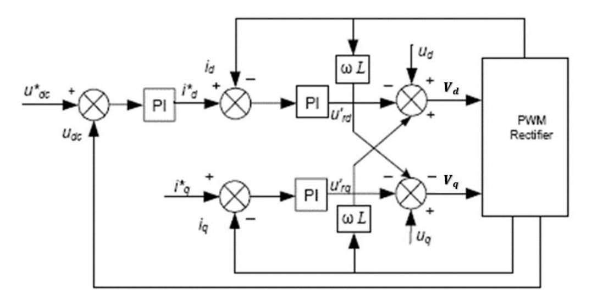

Figure 3.13: Active rectifier control logic [58].

The need to control the DC output requires a proper active rectifier control scheme which has to ensure the unity power factor of the electric machine and constant DC side voltage. The widely adopted control scheme is the current controller-based scheme which consists of an inner high bandwidth current control loop and an outer low bandwidth DC voltage regulation loop. The reference for the current controller is formed by comparing the DC voltage regulator output and the DC reference voltage, increasing the bandwidth of the system. The low bandwidth is done on purpose to avoid the input current distortions, as a result though, a poor dynamic response of the DC bus voltage is inevitable against the load disturbances.

Figure 3.13 is showing the whole double-loop control scheme which has been adopted in the implementation of the active rectifier control logic.

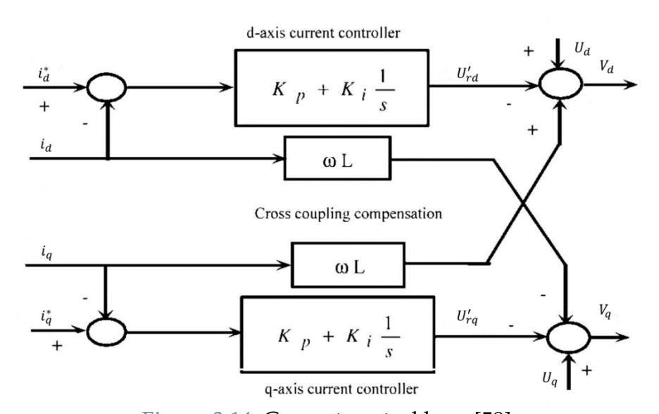

Figure 3.14: Current control loop [59].

In Figure 3.14 is depicted instead a zoom of the previous block scheme highlighting the contribution of the PI controllers and the cross-coupling compensations in the current control loop.

From this last picture, the following equation can be derived:

$$\begin{cases}
U'_{rd} = \left(K_{p_i} + \frac{K_{i_i}}{S}\right)(i_d^* - i_d) \\
U'_{rq} = \left(K_{p_i} + \frac{K_{i_i}}{S}\right)(i_q^* - i_q)
\end{cases}$$
(3.52)

in which:

- $K_{p_i}$  represents the proportional gain of the current controller [-];
- $K_{i_i}$  represents the integral gain of the current controller [-];
- $i_d^*$  is the reference d-axis current [A];

- $i_q^*$  is the reference q-axis current [A];
- $U'_{rd}$  is the amplified direct error signal by the PI [V];
- $U'_{rq}$  is the amplified quadrature error signal by the PI [V].

Moreover, from Figure 3.14 we can furtherly deduce:

$$\begin{cases}
U'_{rd} = U_d + \omega L_s i_q - V_d \\
U'_{rg} = U_g - \omega L_s i_d - V_g
\end{cases}$$
(3.53)

It's then possible to observe that  $U'_{rd}$  and  $U'_{rq}$  of eq. (3.53) are equivalent to ( $L_s s + R_s$ ) $i_d$  and ( $L_s s + R_s$ ) $i_q$  of the KVL in equation (3.48). Hence, making use of equation (3.52), the next can be derived:

$$\begin{cases}
U_d = \left(K_{p_i} + \frac{K_{i_i}}{S}\right)(i_d^* - i_d) - \omega L_s i_q + V_d \\
U_q = \left(K_{p_i} + \frac{K_{i_i}}{S}\right)(i_q^* - i_q) + \omega L_s i_d + V_q
\end{cases}$$
(3.54)

These equations show that under ideal cross-coupling compensation, the two axis currents can be independently controlled such that the direct axis current loop regulates the DC bus voltage while the quadrature axis current control loop regulates the power factor. In particular,  $i_q$  represents the current component responsible for the nonactive AC-side power generation, since the synchronous reference has been chosen to have the Park vector lying on the d axis. Finally, to guarantee zero nonactive power generation on the AC side of the active rectifier, its reference  $(i_q^*)$  has been set equals to zero.

Moving to the voltage control loop, shown on the left as the outer loop in Figure 3.13, the focus is set on the power flowing into the rectifier. Equation (3.51) shows the first step on evaluating the power transfer from the AC side to DC one. Now, as it is shown in the next section, the dq axes frame is aligned with the rotating voltage vector of the supply.

Then through the whole control system and monitoring the parameters by measuring the supply, the goal is to make the dq components of the voltage source equal to their references as following:

$$\begin{cases}
U_d = E_m \\
U_q = 0
\end{cases}$$
(3.55)

where  $U_q$ , as above-mentioned for  $i_q$ , is set to zero to delete the nonactive power, while  $E_m$  is the amplitude of the phase voltage which is here not constant but instead pulsating.

The last unknown and reference value wanted is the direct axis current  $i_d^*$ , which is the result of the power balance between the two sides of the rectifier. Remembering what just seen for the q-axis voltage and current, their values will be close to zero while their references will be exactly null. Consequently, the achieved active and nonactive power that characterize the Linear Electric Machine are:

$$P_{AC} = \frac{3}{2} E_m i_d {(3.56)}$$

$$Q_{AC} = 0 (3.57)$$

This can be said ignoring the power losses of the active rectifier, in this way, the power supplied will instantaneously balance the power flowing through the DC-bus to keep a constant DC link voltage to the load.

So, Equation (3.51) can be re-written as:

$$P_{AC} = \frac{3}{2} E_m i_d = U_{DC} i_{DC} = P_{DC}$$
 (3.58)

Taking then into consideration equation (3.23) and rearranging in this way the DC current:

$$P_{AC} = U_{DC}C\frac{dU_{DC}}{dt} + U_{DC}i_{load}$$
(3.59)

Then according to last equation, the active reference current  $i_d^*$  is evaluated as:

$$i_d^* = i_d = \frac{U_{DC}C\frac{dU_{DC}}{dt}}{\frac{3}{2}E_m} + \frac{U_{DC}i_{load}}{\frac{3}{2}E_m} = i_{d1}^* + i_{d2}^*$$
(3.60)

$$i_{d1}^* = \frac{2U_{DC}}{3E_m} C \frac{dU_{DC}}{dt}$$
 (3.61)

$$i_{d2}^* = \frac{2U_{DC}}{3E_m}i_{load} = \frac{2U_{DC}^2}{3E_mR_{load}}$$
(3.62)

with:

- $i_{d1}^*$  is the portion of current flowing through the DC link capacitor C[A];
- $i_{d2}^*$  represents the feedforward current component corresponding to the current drawn by the load on the DC bus [A].

The capacitor *C* acts as an energy buffer and in this way, since the supply is non sinusoidal by any mean, this component provides power when the power is lacking and absorbs it when the power generated by the FPLG exceeds the power demand of the load.

What seen until this point for  $i_d^*$  is then adopted in the active rectifier control logic, where a conventional PI DC voltage regulator is employed to maintain a constant voltage to provide the reference current, such that it's possible to rewrite equation (3.60) as:

$$i_d^* = K_{p_v}(U_{DC}^* - U_{DC}) + K_{i_v} \int (U_{DC}^* - U_{DC}) dt$$
 (3.63)

where:

- $K_{p_v}$  is the proportional PI voltage gain [-];
- $K_{i_v}$  is the integral PI voltage gain [-];
- $U_{DC}^*$  is the reference DC bus voltage wanted [V].

All the unknows of equation (3.53) have been obtained with the exception of  $V_d$  and  $V_q$ , which can be easily evaluated from the other parameters as:

$$\begin{cases} V_d = U_d - \left( K_p + \frac{K_i}{S} \right) (i_d^* - i_d) + \omega L_s i_q \\ V_q = U_q - \left( K_p + \frac{K_i}{S} \right) (i_q^* - i_q) - \omega L_s i_d \end{cases}$$
(3.64)

 $V_d$  and  $V_q$  represent the outputs of the double-loop control logic and, once transformed in  $\alpha\beta$  components through a Park-to-Clarke transformation, they become the inputs of the Space Vector Pulse Width Modulation control.

## 3.2.3 Space Vector Pulse Width Modulation

Space Vector Pulse Width Modulation (SVPWM) control is utilized to produce the switching signal of the IGBTs for the power converter. The goal of the controlled Voltage Source Rectifier (VSR) is to absorb AC input current in phase with the input voltage and to keep the DC output voltage at its reference and constant value.

The SVPWM technique consists initially in the definition of some reference vectors which correspond to a specific combination of the switching states. There are eight switching states according to the switching functions,  $U_0$  (000),  $U_1$  (100),  $U_2$  (110),  $U_3$ (010),  $U_4$ (011),  $U_5$ (001),  $U_6$ (101) and  $U_7$ (111), six of them are non-zero vectors ( $\overrightarrow{U_1}$  to  $\overrightarrow{U_6}$ ), while two are zero vectors ( $\overrightarrow{U_0}$  and  $\overrightarrow{U_7}$ ). The 1 and the 0 describe the switching state of each leg with 1 representing the upper switch closed and the lower opened

and the 0 standing for the opposite. The vectors representing the switching signals divide the space vector in six sectors shown in Figure 3.15.

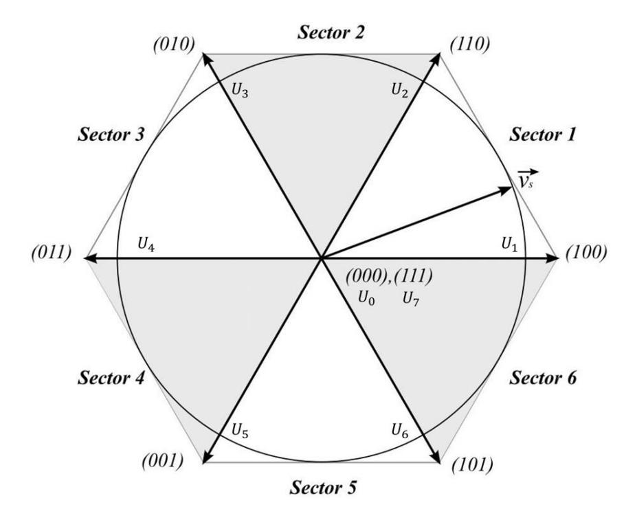

Figure 3.15: Space vector [60].

Figure 3.16 in fact, shows a possible sequence of the switching combination. In the figure, combinations (100) and (110) are applied to the active rectifier. In the switching state (100) the line voltages end up being  $V_{ab} = U_{DC}$ ,  $V_{bc} = 0$  and  $V_{ca} = -U_{DC}$ , while in (110),  $V_{ab} = 0$ ,  $V_{bc} = U_{Dc}$  and  $V_{ca} = -U_{DC}$ .


Figure 3.16: Two possible switching combinations.

The resultant switching vector for the abovementioned states can be derived in the space vector by the sum of the line voltages vectors as shown in Figure 3.17.

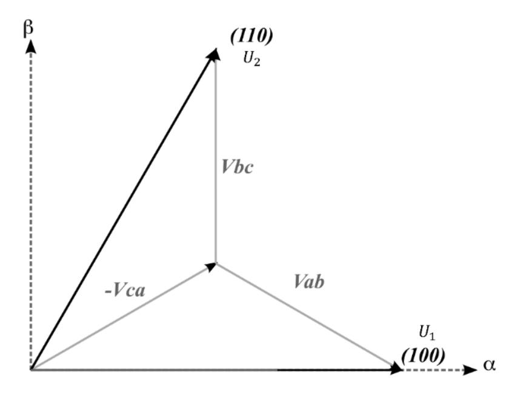

Figure 3.17: Derivation of two switching vectors.

Once the possible switching vectors are described, the focus is moved on the procedure to find their correct combination which needs to be applied in the rectifier instant by instant.

So, taking  $V_{\alpha}$  and  $V_{\beta}$  obtained from the transformation of the  $V_d$  and  $V_q$  components from the double-loop control logic, the space vector control follows the Clarke vector generated by their combination. Specifically, it creates a space vector  $\overrightarrow{V}_s$  which represents the reference AC-side voltage for the converter needed to achieve the desired DC side conditions:

$$\overrightarrow{V_s} = V_\alpha^* + jV_\beta^* \tag{3.65}$$

As represented in Figure 3.18, if the vector  $\overrightarrow{V_s}$  is laying in the first sector, it is expressed by the synthesis of  $\overrightarrow{v_1}$ ,  $\overrightarrow{v_2}$  and  $\overrightarrow{U_0}$  (or  $\overrightarrow{U_7}$ ) and resolved by time-averaging the available switching vectors  $\overrightarrow{U_1}$ ,  $\overrightarrow{U_2}$  and  $\overrightarrow{U_0}$  (or  $\overrightarrow{U_7}$ ).

$$\overrightarrow{V_s} = \overrightarrow{v_1} + \overrightarrow{v_2} + \overrightarrow{U_0} \tag{3.66}$$

$$\overrightarrow{V_s} = \frac{t_1}{t_s} \overrightarrow{U_1} + \frac{t_2}{t_s} \overrightarrow{U_2} + \frac{t_0}{t_s} \overrightarrow{U_0}$$
(3.67)

$$\overrightarrow{V_s} = \tau_1 \overrightarrow{U_1} + \tau_2 \overrightarrow{U_2} + \tau_0 \overrightarrow{U_0} \tag{3.68}$$

where  $t_1$ ,  $t_2$  and  $t_0$  are on-time for the switching positions of respective vectors and  $t_s$  is the whole switching period, resulting in corresponding duty ratios  $\tau_1$ ,  $\tau_2$  and  $\tau_0$ .

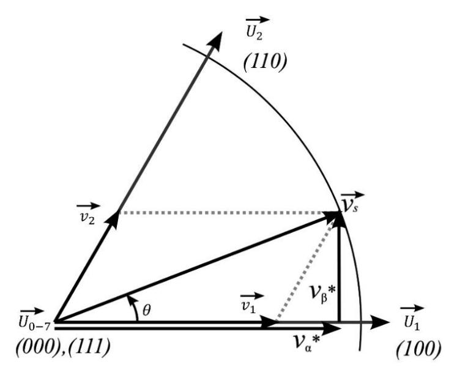

Figure 3.18: Derivation of the duty ratios.

From here, it's possible to derive that:

$$\begin{cases} |Vs| \cdot \cos\theta = \tau_1 |U_1| + \tau_2 |U_2| \cos\left(\frac{\pi}{3}\right) \\ |Vs| \cdot \sin\theta = \tau_2 |U_2| \sin\left(\frac{\pi}{3}\right) \end{cases}$$
(3.69)

with  $\theta$  standing for the angle between the fixed  $\alpha$ -axis and  $\vec{V}_s$ . Noteworthy is the fact that the decomposition of the space vector  $\vec{V}_s$  in eq. (3.69) is specifically for the sector considered.

Furthermore, it is important to note that the amplitudes of the voltage vectors  $\overrightarrow{U_1}$  and  $\overrightarrow{U_2}$  are bond by the relationship [50]:

$$\left|\overrightarrow{U_1}\right| = \left|\overrightarrow{U_2}\right| = \sqrt{\frac{2}{3}} U_{DC} \tag{3.70}$$

Substituting (3.70) into (3.69), the on-time of each switching combination can be obtained as:

$$\begin{cases} \tau_1 = m^* \cdot \sin\left(\frac{\pi}{3} - \theta\right) \\ \tau_2 = m^* \cdot \sin\theta \\ \tau_0 = 1 - \tau_1 - \tau_2 \end{cases}$$
(3.71)

where  $m^*$ , the modulation factor of the SVPWM, is:

$$m^* = \sqrt{3} \frac{|\overrightarrow{V_S}|}{U_{DC}} \tag{3.72}$$

Now, the space vector  $\overrightarrow{V_s}$  is generated by applying the switch vectors  $\overrightarrow{U_1}$ ,  $\overrightarrow{U_2}$  and  $\overrightarrow{U_0}$  not only for a given time with respect to the PWM switch cycle but also in a given sequence for their respective on-time values. The order in which the switching vectors are applied is referred to as the modulation strategy also called switching sequence. Two of these strategies are commonly used and implemented in the space vector modulator, either an alternative zero vector strategy or a symmetrical modulation strategy. The latter, as shown in

Figure 3.19, is the one that has been chosen in this work and is characterized by a lower THD content of output voltage, but higher switching losses.

In the symmetrical modulation both zero vectors (000) and (111) are applied during a single switching cycle, one during the beginning and the end of the cycle while the other in the middle of it, resulting in seven-time subdivisions. Additional PWM time thresholds  $T_1$ ,  $T_2$  and  $T_3$  are required for this symmetrical modulation and are evaluated as shown in equation (3.73).

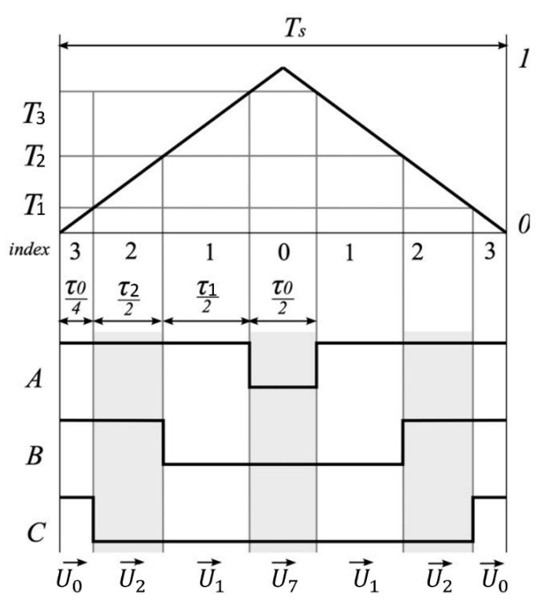

Figure 3.19: Symmetrical modulation [60]

$$\begin{cases}
T_1 = \frac{\tau_0}{2} \\
T_2 = \frac{\tau_0}{2} + \tau_2 \\
T_3 = \frac{\tau_0}{2} + \tau_2 + \tau_1
\end{cases}$$
(3.73)

## 3.2.4 DC link capacitor sizing

The capacitor *C* on the DC link operates as an energy buffer between the AC and the DC side of the active rectifier. It also stabilizes the voltage across the DC link, thus the DC load, and reduces the voltage harmonics on the DC-side. Theoretically if the DC voltage wants to be changed through the operation to another value, the capacity has to be small enough to adapt and track the voltage as soon as possible. This may be done to feed different loads or by having a variable voltage load, but it's not the case in this study. The architecture thought for the type of application of the FPLG requires the U\_DC to be equal to 800V and thus the capacity has to be big enough to satisfy the stability of the output. Moreover, it must constrain the dynamic drop on the DC-side caused by any disturbance of the load and on the supply generation since the power generation is in this case fluctuating quite significantly, due to the weird piston motion and trajectory.

In Eq. (3.74) is shown the capacitor in the DC-side and its constraint applied in the model [50].

$$C \ge \frac{T_{i,max} \Delta P_{L,max}}{2U_{DC} \Delta U_{DC,max}} \tag{3.74}$$

with:

- $T_{i,max}$  is the maximum value of the inertial time constant of the voltage source rectifier [s];
- $\Delta P_{L,max}$  is the maximum value of the power variation [kW];
- $\Delta U_{DC,max}$  is the maximum variation of the DC bus voltage [V];
- $U_{DC}$  is the DC side constant voltage set to 800V.

# 3.3 Model's features and its implementation

This section describes the implementation in Simulink of the whole electrical system. The active rectifier must be capable of converting the non-sinusoidal voltage generated by the FPLG into a constant DC output to feed a load, like a battery.

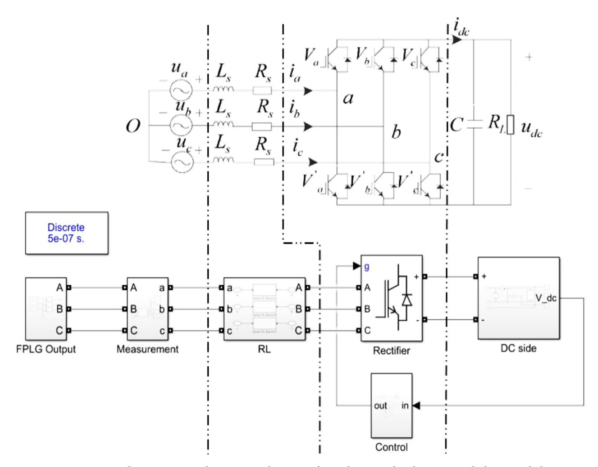

Figure 3.20: Comparison between the rectifier electrical scheme and the model.

The model has been designed taking as reference the equivalent electrical circuit of the whole system, thus Figure 3.20 reports both the representations, highlighting in this way, their correspondent general structure:

- The left side is the AC side, i.e. where the electrical ports of the linear generator would be connected in a real prototype, thus the inputs of this section coincide with the outputs of the Free-Piston system. As a first approximation, the Linear Electric Machine is represented by an ideal voltage source corresponding to its back-EMF, while leakage inductance and winding resistance have been here avoided.
- Following the power flow, so, moving to the right, the model presents a measurement section that is not shown in the electrical scheme, but that is necessary to obtain the instantaneous values of  $V_a$ ,  $V_b$  and  $V_c$ , as well as the values of  $I_a$ ,  $I_b$  and  $I_c$ . The content of this block is detailed later.

- After measurements, each phase reports a resistor and an inductor in series, called respectively  $R_s$  and  $L_s$ . These elements represent the series inductor that is necessary to connect the electric machine to the AC terminals of the active rectifier.
- Moving again towards the right direction, the active rectifier is found. Even though, indeed, the name "active rectifier" is usually adopted to refer to the whole device, the actual part that performs the rectification, i.e. the passage from AC to DC, is just the one composed by three legs, each one with two switch-antiparallel diode units. The Simulink block represents this structure and simulates its behavior. It should be noticed anyway that this section has four inputs, A,B and C and g, where the first three are just the wires, while the last is representative of the signal generated by the control system to command the opening or closure of the switches.
- Just below the rectifier's block, the control subsystem is represented. This is the part of the model where the algorithm developed in the analytical part is implemented. As for the measurement section, also the content of this block is detailed later.
- The last section on the right represents the DC side. The main elements are the DC link capacitor, a measurement subsystem and the DC load. The measurement section is necessary to measure the DC link voltage, that is the input of the active rectifier regulator. The load is represented with a resistor.

## 3.3.1 FPLG Output

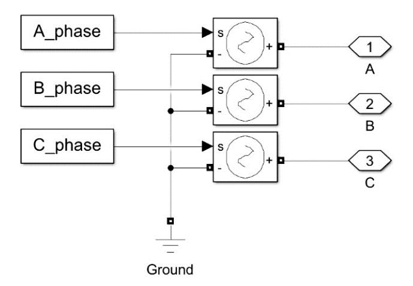

Figure 3.21: FPLG Output block.

This part of the model represents the AC side of the converter.  $A\_phase$ ,  $B\_phase$  and  $C\_phase$  are two-column matrixes where the first column is the time, discretized with

a step equal to  $5 * 10^{-7}$ , while the second column is composed by the correspondent values of the induced voltages in the coils coming from the OpenFOAM simulation. These matrixes are taken from Simulink as reference to create the voltage source of each phase.

Obviously, the signal exiting from this section is the same as the linear generator, Figure 3.22 shows the results achieved and reports also a zoomed picture.

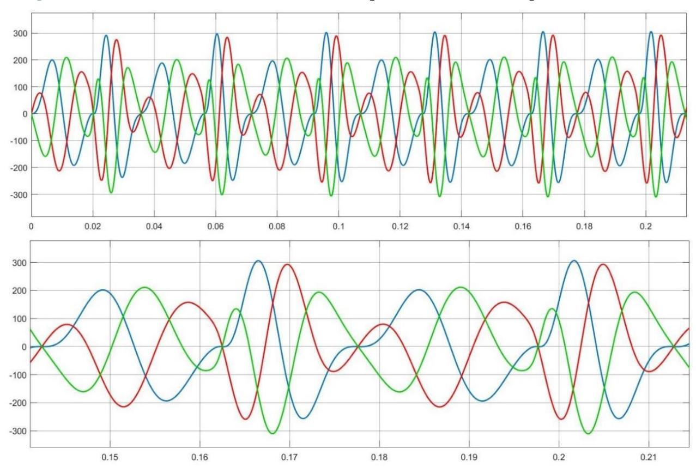

Figure 3.22: Induced voltage in the statoric coils.

Looking at these graphs, it's evident that the signal is periodic but non sinusoidal. This observation is fundamental for the correct implementation of the control logic since it implies that the resulting vector is rotating with a variable module and variable angular speed in the  $\alpha\beta$  plane. Moreover, interesting to see is the vector's direction of rotation, which changes during the cycle. In fact, during compression stroke the tern moves clockwise and once the TDC is reached, the module goes to zero and the vector reverses its motion towards the counterclockwise direction. After this the cycle repeats. Figure 3.23, taken from the outputs of the AC measurement section which presented later, is showing exactly this aspect. Figure 3.24 instead, displays the angular speed  $\omega$  trend and its discontinuities: when the vector instantaneously jumps from the second to the fourth quadrant or from the third to

the first quadrant, besides the module getting null, the angle reports a discontinuity which is then reflected in the phase speed.

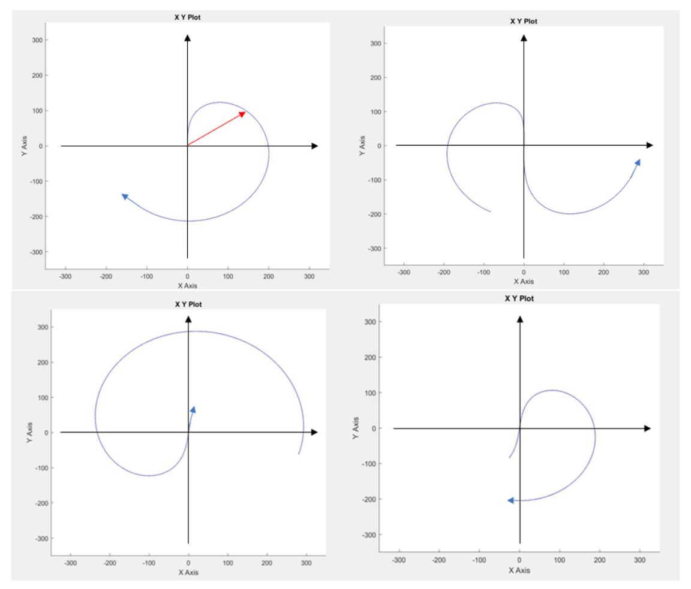

Figure 3.23: Variation with time of the resulting rotating vector.

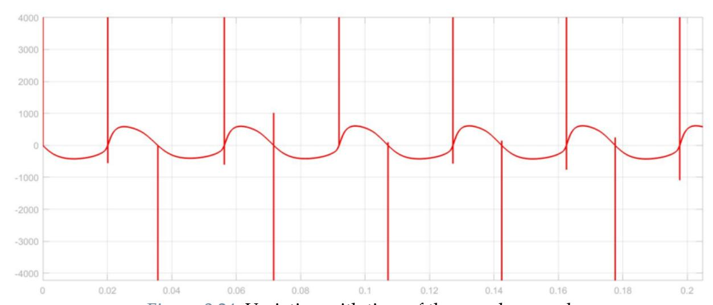

Figure 3.24: Variation with time of the angular speed.

Anyway, another interesting consideration is related to the fact that the three-phase voltages are balanced. Indeed, as it's evident from Figure 3.25 that each phase has a peculiar trend with peaks of different amplitude and differently spaced inside the same period but the overall sum of the instantaneous values is null.


Figure 3.25: Voltage trend of each phase.

The analysis of these graphs highlights the big harmonic content of the generated voltages which are far from being sinusoidal. This aspect is made even more evident

from Figure 3.26 which shows the harmonics distribution of each phase taking as period a full compression and expansion cycle.

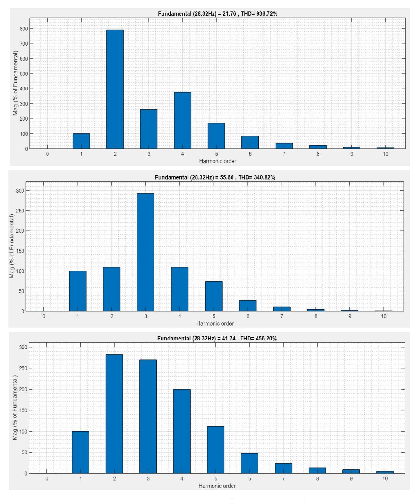

Figure 3.26: Harmonics distribution in each phase.

The spectrum clearly presents peaks centered in the integer multiples of the fundamental harmonic (28.32Hz), relevant from one to seven. In fact, a first version of the model assumed a 3-phase balanced sinusoidal voltage as input with a frequency of 200Hz (7 \* 28.32 = 198.24Hz). Indeed, being the distortion of this signal the major challenge to be faced in the control algorithm, it was reasonable to assume that if the simulation had worked in the sinusoidal conditions, then it would have done it also with the actual FPLG waveform with minor adjustments of the model. Obviously, this was a simplified first approach since, this implied that the module and the angular speed of the resulting vector didn't change in time, but anyway it has been especially useful to perform a first calibration of the PI controllers in the control system.

#### 3.3.2 Measurements

Figure 3.27 shows in detail the measurement block, i.e. the part of the model where all the main parameters needed by the control system are evaluated. The first input on bottom left,  $V_abc$ , is initially saved for subsequent operations and is then converted through a Clarke's transformation. The current instead,  $I_abc$ , after being saved, is directly sent to the visual block named V&I, fundamental to understand if the simulation has been performed correctly. Showing in fact, at the same time voltage and current, it allows to point out whether they are in phase or not, then if the power factor is close to one. This is one of the main aspects analyzed in the output section.

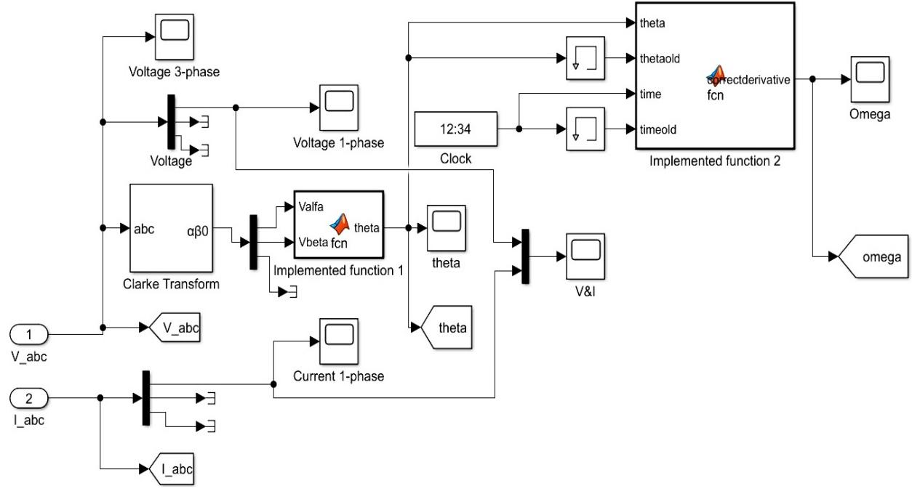

Figure 3.27: Measurement block.

Going now more in detail of the Clarke's transformation, this provides the  $\alpha$ ,  $\beta$  and 0 components of the input voltage. The zero-sequence can be neglected since the voltage coming from the Linear Electric Machine is balanced, while the projection on the fixed axes is inserted in a first function called "Implemented function 1". As shown in Figure 3.28 here below, this function calculates the arctangent of  $\left(\frac{V_{\beta}}{V_{\alpha}}\right)$  in order to evaluate the angular position  $\vartheta$  of the instantaneous rotating vector such that it results between 0 and  $2\pi$ , the MATLAB's function atan2 instead, would give as output a value between  $-\pi$  and  $\pi$ . The result is shown in Figure 3.29.

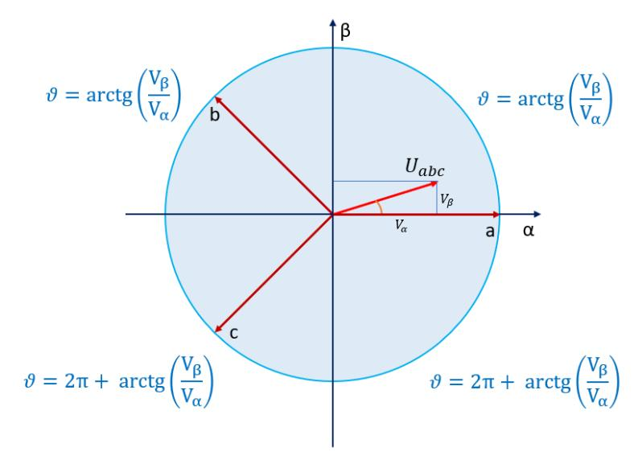

Figure 3.28: Implemented function 1.

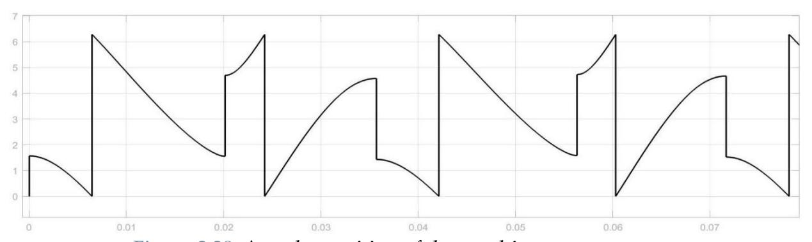

Figure 3.29: Angular position of the resulting space vector.

It's clear that the behavior is discontinuous in time, but this was expected due to the vector's motion reversing. Indeed, recalling Figure 3.23, it can be observed that, besides the module's variation, the sense of rotation is changing too. Thus, a clockwise rotation corresponds to a reduction of the angle, while a counterclockwise to an increase. Furthermore, the concavity of the waveform of the phase angle is the consequence of the acceleration or deceleration of the piston motion. The discontinuities just reflect the instantaneous variation of the angular position when

there is the reversal of motion, the actual piston velocity goes to zero and thus the module of the Clarke vector become zero as consequence.

The obtained trend of  $\theta$ , after being plotted and saved for subsequent operations, is sent to a second function called "Implemented function 2" which has the role to evaluate the derivative with respect to time, i.e. the instantaneous angular velocity  $\omega$ . In this case, it has been preferred to implement a function instead of using the existing block for the derivative in order to face the problem which arises with the passage of the angle from 0 to  $2\pi$  and vice versa. Indeed, Simulink does not see the two values corresponding to the same angular position, in fact performing the derivative as  $\Delta\theta/\Delta t$  and being  $\Delta t$  very small  $(5 \cdot 10^{-7})$ , the resulting angular speed ends up being very big, tending not realistically to infinity. Hence, to solve this problem, only in correspondence of the two discontinuities, the following procedure is performed:

| Case                                                            | Operation                               |
|-----------------------------------------------------------------|-----------------------------------------|
| For the passage $	heta_{old} = 0  ightarrow 	heta_{new} = 2\pi$ | $\theta_{old} = \vartheta_{old} + 2\pi$ |
| For the passage $\theta_{old}=2\pi  ightarrow  \theta_{new}=0$  | $\theta_{new} = \theta_{new} + 2\pi$    |

Table 3.2: Implemented function 2.

Just for completeness, the digital clock is the Simulink block to import inside the model the simulation-time information, while the symbol  $\square$  provides the value of the input parameter at the previous instant of the simulation time by having it saved.

The resulting trend of  $\omega$  has been already presented in Figure 3.24. Looking to this graph, it's evident that some discontinuities are still present because of the reversing motion. This is again an expected behavior since in those points the module goes to zero, but the angular position instantaneously changes and consequently the derivative has a peak and a discontinuity.

#### 3.3.3 Series resistor and inductor

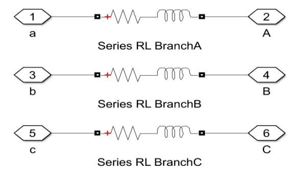

Figure 3.30: RL block.

Each phase presents two elements in series called  $R_S$  and  $L_S$ , which represent the AC input resistor and inductor of the active rectifier. This filter is necessary to connect the Linear Machine with the active rectifier, in fact two elements that are voltage sources cannot be connected together in parallel otherwise.

The values of resistance and inductance are assumed to be the same for all the three phases and are shown in the next table.

| Parameter | Value | Unit |
|-----------|-------|------|
| $R_S$     | 0.01  | Ω    |
| $L_S$     | 2     | тH   |

Table 3.3: Series resistance and inductance.

### 3.3.4 Rectifier

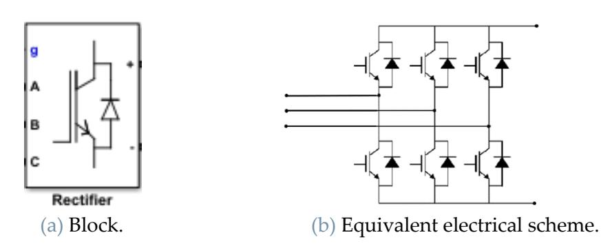

Figure 3.31: Rectifier block and its content.

In this case, the block's content is a pre-implemented Simulink block available in the library (Universal Bridge) and the equivalent electrical scheme is reported here for clarity.

The selected switches for this application are IGBTs, the power semiconductor devices shown in Figure 3.32.

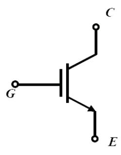

Figure 3.32: Schematic of an IGBT [60].

The I-V curve of the IGBTs implemented in the model is the linear piecewise approximation. Both the internal resistance of the device,  $R_{on}$ , and the forward

voltages of IGBTs and diodes,  $V_f$  and  $V_{fd}$ , have been set with the Simulink's default values as shown in Table 3.4.

| Parameter | Value | Unit |
|-----------|-------|------|
| Ron       | 0.001 | Ω    |
| $V_f$     | 0.8   | V    |
| $V_{fd}$  | 0.8   | V    |

Table 3.4: Numerical assumptions for the rectifier block.

#### 3.3.5 Control

The control system, shown in Figure 3.33, concretizes the analytical discussion presented in section 3.2 and generates the signals which control the IGBTs in the rectifier's block.

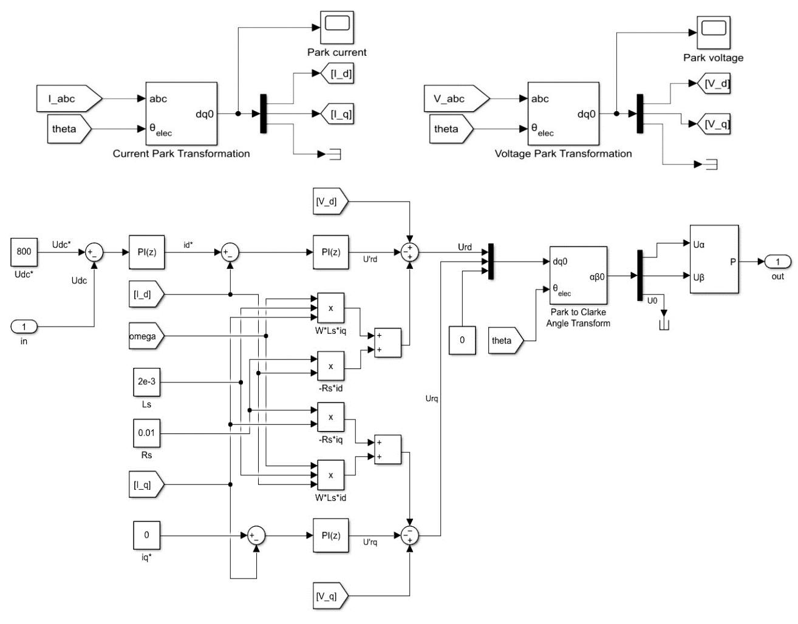

Figure 3.33: Control block.

It can be divided in four main parts:

- 1. Current Park's transformation;
- 2. Voltage Park's transformation;
- 3. Generation of the reference space vector;
- 4. Space Vector Pulse Width Modulation.

Part 1 and 2 just convert the 3-phase voltage and current obtained in the measurement block from a,b,c coordinates into d,q,0 through a Park's transformation. As already anticipated in the theoretical part, if the instantaneous angular speed of the rotating axes is fixed equal to the one of the resulting rotating vector and the initial axes' position coincides with the  $\alpha\beta$  plane, this allows to have a constant null quadrature component. In this condition indeed, the d- axis follows the movement of the vector and the relative angle between the two is always zero.

It should be noticed that the Park's transformations do not receive as input the angular speed, instead Simulink requires to indicate the instantaneous electrical angle between the a-phase and the d-axis or between the a-phase and the q-axis. So, after the choice of the d-axis alignment, the input has been set  $\theta(t)$ .

Both d and q components of voltage and current are adopted for the generation of the reference space vector  $\overrightarrow{V_s}$ . Starting from the error on the measured voltage of the DC side, these components are in fact used to determine  $U_{\alpha_{ref}}$  and  $U_{\beta_{ref}}$  through the Park-to-Clarke transformation shown in the analytical part (Eq. (3.15) to (3.73)).

The last part of the control system to be analyzed is the Space Vector Pulse Width Modulation (SVPWM). Also the logic behind this block has already been presented in detail in the analytical part and it allows to obtain the duty ratios of each IGBT present inside the rectifier.

It should be highlighted that the only values assumed in this section of the model are relative to the DC voltage setpoint and the PI controllers. They are summarized in the following table where it should be noticed that  $K_P$  and  $K_I$  have been assumed to have the same values in the two branches of the current loop:

| Parameter            | Value | Unit       |
|----------------------|-------|------------|
| V <sub>DC</sub>      | 800   | V          |
| $K_P$ (Voltage loop) | 8     | [-]        |
| $K_I$ (Voltage loop) | 160   | $[s^{-1}]$ |
| $K_P$ (Current loop) | 200   | [-]        |
| $K_I$ (Current loop) | 300   | $[s^{-1}]$ |

Table 3.5: Numerical assumptions for the control block.

As already anticipated the choice of 800V as reference for the DC voltage has been done considering the probable application of the FPLG the automotive field. In this sector, the electric motor is usually fed by a battery that acts as reservoir of energy and decouples the production with the consumption. The standard for this type of batteries is either 400V or 800V, but in the specific conditions sets by this model, only the latter voltage is acceptable. Indeed, the AC-side and DC-side are strictly linked in such a way that once set the  $U_{DC}$ , the AC-side line-to-line voltage can only be lower than or equal to this value. Hence, looking at the FPLG's output of the proposed LEM, the maximum line-to-line voltage is greater than 400V, imposing in this way the choice of a higher voltage.

For what concerns the PI calibration instead, this has been achieved mainly through a trial-and-error procedure where the initial values have been found adopting the Ziegler-Nichols method presented in the theoretical part. The research of the right gains has been guided then by the indications provided by reference [61] which specifically studied the influence of each value on the double control loop of an active rectifier. The main outcomes from the paper can be summarized as follows:

- The increase of  $K_P$  of the voltage loop can improve the response speed of the active rectifier, shortening the settling time and decreasing the overshoot of the voltage setpoint, but it has no influence on the current overshoot. A value too high of this parameter can anyway make the system unstable.
- The increase of  $K_I$  of the voltage loop implies an increase also in the settling time both of the voltage and current controllers, but decreases the overshoot in  $V_{DC}$ .
- As  $K_P$  of the voltage loop, an increase of  $K_P$  of the current loop can shorten the settling time and decrease the overshoot of the voltage setpoint, but it can also improve the response speed of the current controller. However, the current controller itself can become unstable and the distortion of the AC side current can be high as a consequence.
- Differently from  $K_I$  of the voltage loop, a small increase of  $K_I$  of the current loop can shorten the settling time both of the voltage and current controllers and decrease the overshoot in  $V_{DC}$ . Anyway, if this parameter is larger than a specified value, the effect would be the opposite and the instability would arise.

It should be underlined that the assumed values for the proportional and integral gains are in line with the principle that in a chained iterative procedure, the internal cycle must always be faster. In fact, it has to get to convergence for each iteration of the outer loop, then it has to perform more operations per time not to become a bottleneck of the control. Moreover, the outer voltage loop would work misleadingly on the transient of the inner loop and give a wrong result.

#### 3.3.6 DC side

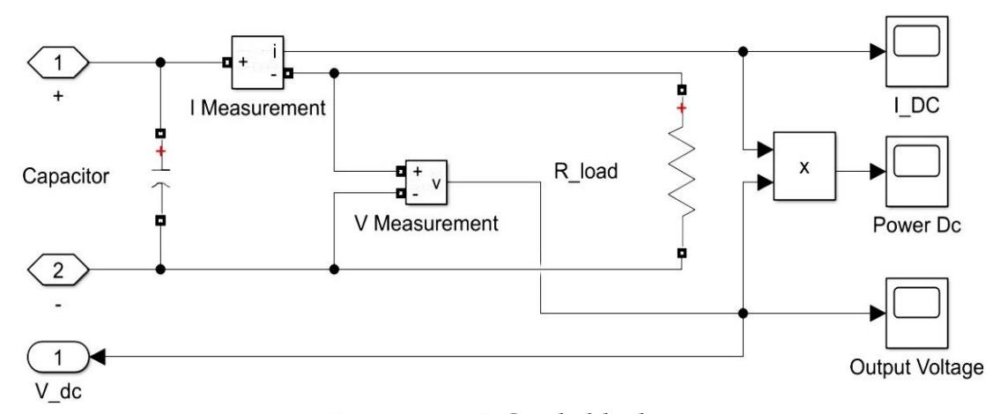

Figure 3.34: DC side block.

The last part of the model represents the DC side, i.e. the DC link capacitor and the DC load. A measurement section has been included to derive the signal needed by the PI controller on the voltage loop.

The DC load is here designed as an apparent resistor, thus an element whose function it's merely to introduce a constant proportionality between voltage and current. This choice is clearly in line with the approach followed in the model which aims to be as general as possible.

In this block three numerical values have been assumed and they are the capacitance, the voltage value and the load resistance. They are reported in the following table:

| Parameter            | Value | Unit |
|----------------------|-------|------|
| С                    | 20000 | μF   |
| $V_{capacitor}(t=0)$ | 800   | V    |
| R <sub>load</sub>    | 64    | Ω    |

Table 3.6: Numerical assumptions for the DC side block.

The load resistance has been sized considering to have a power output of  $10 \, kW$ . Indeed, the voltage drop on the resistor can indeed be defined as:

$$V_{DC} = RI_{DC} \tag{3.75}$$

The power delivered to the load is instead:

$$P_{DC} = V_{DC}I_{DC} \tag{3.76}$$

So, rearranging the two expressions, once the DC-bus voltage and the DC power output are selected, the resistance is fixed:

$$R = \frac{V_{DC}}{I_{DC}} = \frac{V_{DC}}{\frac{P_{DC}}{V_{DC}}} = \frac{V_{DC}^2}{P_{DC}}$$
(3.77)

Despite the designed power output is 10KW, the actual one would be lower because of the losses both in the FPLG and in active rectifier. Anyway, this is not an issue since the system would just react changing the current, keeping the voltage constantly close to 800V.

### 3.4 Results and outcomes

This section shows the results concerning the analysis performed in Simulink of the whole electrical system. Moreover, it aims to highlight that the steady state operation has been achieved and the active rectifier control logic is properly designed and validated. This is an outstanding achievement considering the high distortion of the induced three-phase voltage coming from the Free-Piston Linear Generator and the limited information available in literature regarding the regulation of non-sinusoidal signals.

#### 3.4.1 DC-side of the active rectifier

Figure 3.35 is showing the voltage  $U_{DC}$  across the load in a 1-second simulation.

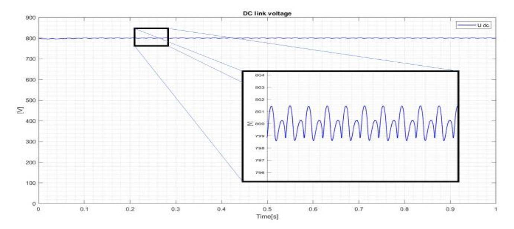

Figure 3.35: DC Voltage.

The controller is able to keep the DC-bus voltage at its reference value of 800 *V* with a ripple that does not exceed 2.5*V*, just the 0.31% of the setpoint. The small oscillations are a consequence of the control logic operation and are greatly acceptable.

The initial transient ends in 0.1s, clearly in line with the fast response characteristic required by electrical circuits. The rapid settlement of the voltage is facilitated by the pre-charge of the DC link capacitor, which, at the same time, also avoids big undesired current peaks on the load.

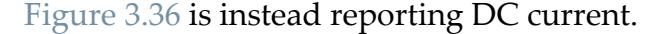

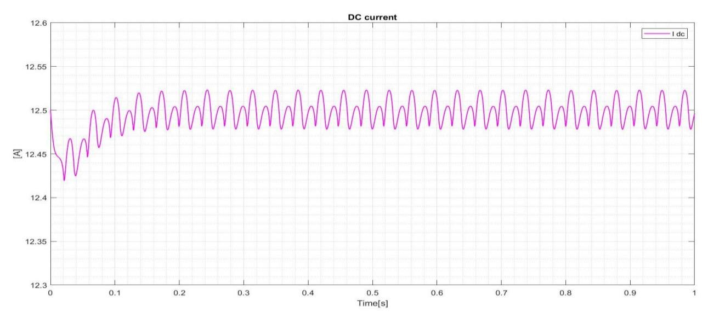

Figure 3.36: DC current.

The trend is the same as voltage. This is a consequence of Ohm's relationship V = RI, being the DC load designed as an apparent resistor.

To reach  $10 \, kW$  of power generation, the target value has been fixed equals to  $12.5 \, A$ , obtaining again a negligible ripple which does not exceed  $0.04 \, A$  or 0.32% of the setpoint. These are extremely acceptable values and could be furtherly reduced by implementing a bigger capacitor C which buffers more energy and reduce even more the ripples on the DC-side or by also including in the circuit a more complex DC passive filter.

The initial transient is here more evident just because of the smaller scale adopted. The same can be said for Figure 3.37 where the DC power is represented.

Also the power follows the same curve of the voltage and current, being related by the relationship P = VI. The direct consequence of the DC power definition is the summation of the relative errors on voltage and current, which anyway results to a

ripple smaller than 0.65%, corresponding to a maximum fluctuation of 65 W against a pursued value of 10000 W.

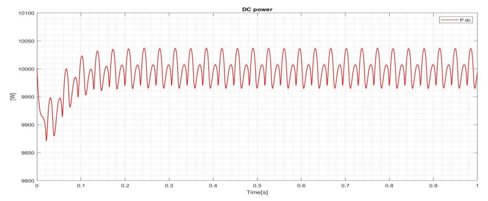

Figure 3.37: DC power.

The robustness of the model has been proved also for small variations of the DC voltage or of the DC power setpoints as shown in Figure 3.38Figure 3.41. In the first case, it has been sufficient to change the reference voltage in the control loop and update the initial charge of the DC-link capacitor, while in the latter, to act on the value of the apparent DC resistance. As it clear from the graphs, the steady state operation is reached and the control system works properly, but the amplitude of the oscillations changes, especially for the power. This aspect is clearly due to the PI calibration that has been performed just for the 800 *V*-10 *kW* case and which needs to be updated every time that one of the two parameter is modified.

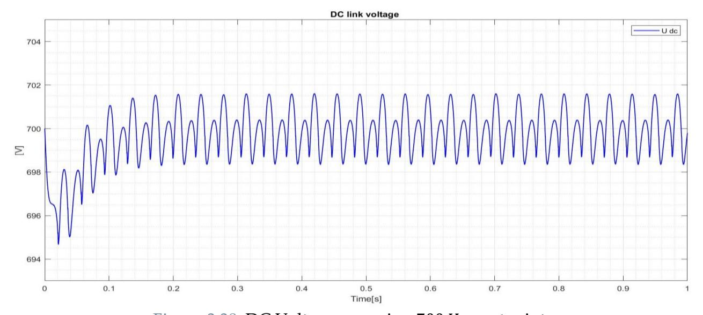

Figure 3.38: DC Voltage assuming 700 *V* as setpoint.

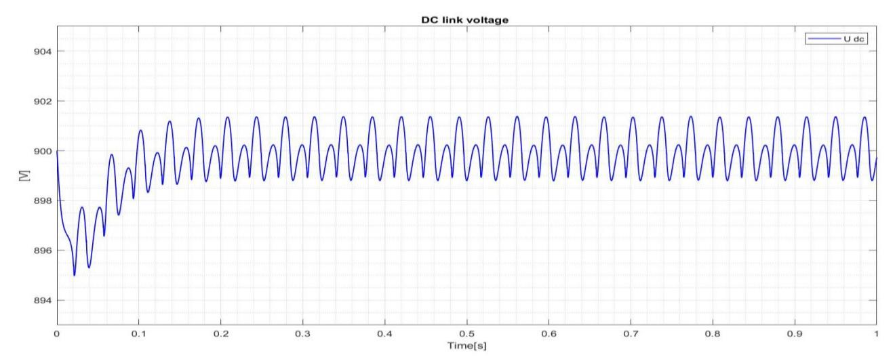

Figure 3.39: DC Voltage assuming 900 V as setpoint.

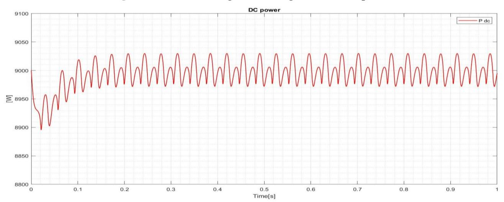

Figure 3.40: DC power assuming 9 kW as setpoint.

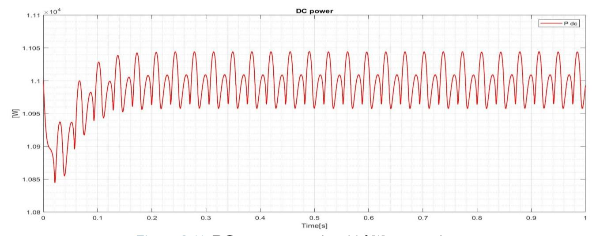

Figure 3.41: DC power assuming 11 kW as setpoint.

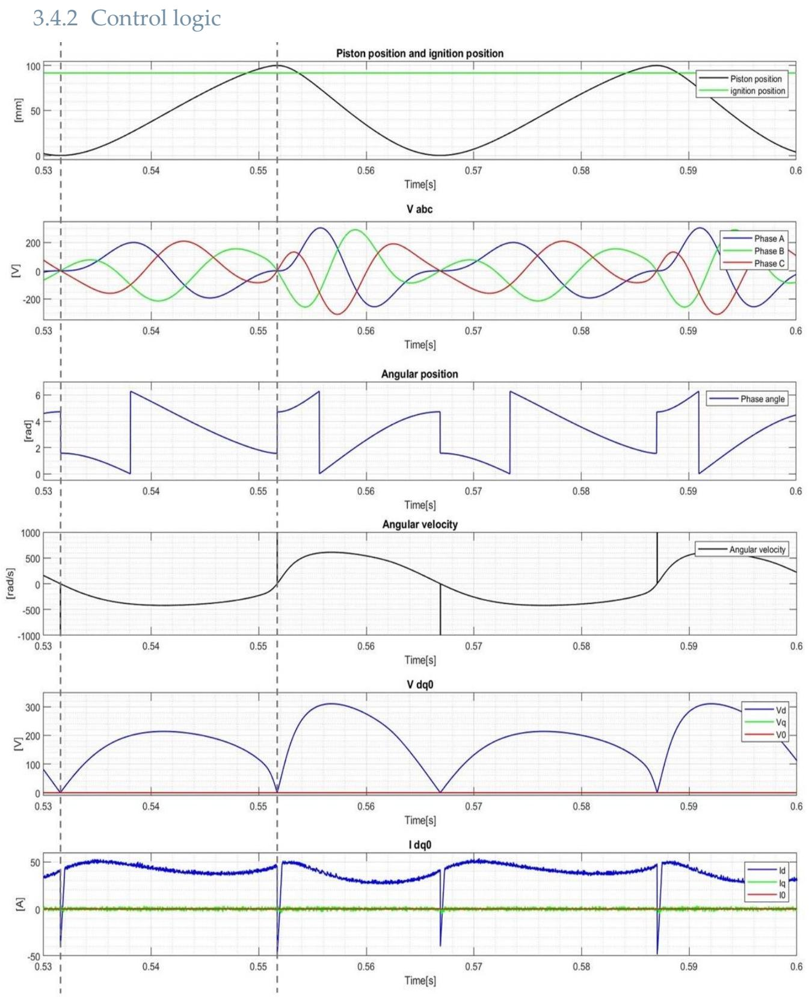

Figure 3.42: Main parameters involved in the control of the active rectifier.

The active rectifier control logic is working properly based on the outcomes shown above. In Figure 3.42, in particular, is displayed the main parameters of the control simulation with respect to the piston position in FPLG reported in the first upper graph. In fact, the other charts below this reference show the induced three-phase voltages, the angular position and angular velocity of the supply tern and, finally, the Park voltage and current dq0 components on the AC side.

The grey dotted lines are highlighting the key points of the piston trajectory, the BDC and TDC respectively. In correspondence of both of these positions, the piston speed gets null due to the piston motion reversing and, for this reason, there are no threephase voltages induced. Furthermore, recalling Figure 3.23, the supply voltage vector moves in the opposite quadrant of the  $\alpha\beta$  plane, thus its angular position displays a discontinuity, moreover it also modifies the sense of rotation, so the speed changes sign. Looking then at the Park voltage, as predicted in the design phase,  $V_a$ and  $V_0$  are null, confirming that the reference dq frame is rotating with the exact same angular velocity of the vector generated by the *abc* phase voltages coming from the FPLG.  $V_d$  is instead pulsating due to the module variation of the Park vector and the points which go to zero are exactly in correspondence of the Top and Bottom Dead Centers. The piston approaching these positions is also the reason behind the current behavior, in fact,  $i_0$  is always null,  $i_q$  presents a small ripple and  $i_d$  shows some narrow peaks. The active rectifier control system indeed requires time to react to the sudden instability, thus, as soon as the perturbation is perceived, the quadrature component is forced to stick around the null value, while the direct one is brought back to the wanted path.

The abovementioned case is peculiar to the FPLG, in fact in traditional internal combustion generators, the crank mechanism together with the flywheel ensures a continuous rotation of the shaft and consequently of the electric rotating machine. In particular, the condition caused by the piston reversing at the TDC or BDC and the consequences for the linear machine, are the main challenges which the control system has to face. Anyway, the current fast and consistent response proves a correct action of the control. Based on these results, it's clear that the implemented logic is robust enough to solve the problem and reach the steady state.

#### 3.4.3 AC-side of the active rectifier

Besides keeping the DC-bus voltage of the active rectifier at a constant value, the control logic has been implemented to guarantee that the power factor was as close as possible to unity and, as consequence, the nonactive power close to zero. This result is fully achieved as it's evident from Figure 3.43 where are shown the phase voltage and current waveforms.

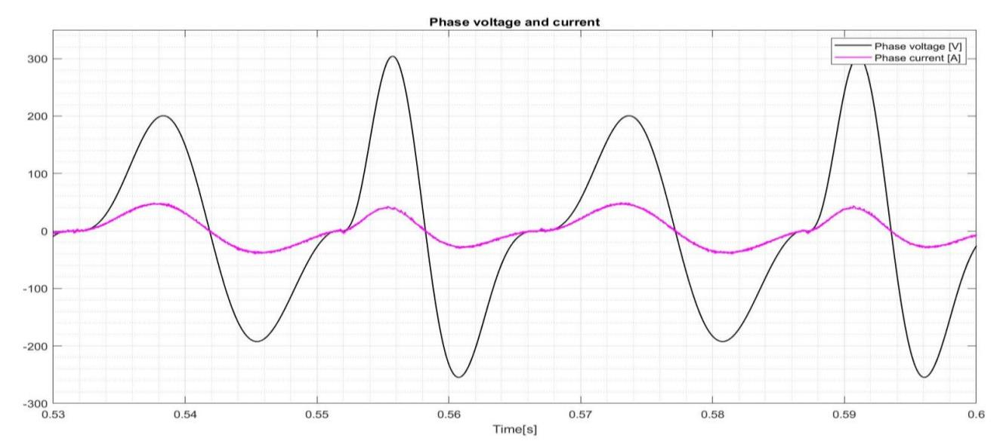

Figure 3.43: Phase AC voltage and current.

There is almost no delay or lag of the current with respect to the voltage. The only source of disturbance is in correspondence of the zero-crossing of the voltage which introduces a negligible ripple in the current response as abovementioned.

# Conclusion and future development

The final chapter has the purpose to finalize the conclusion of the thesis and to describe and introduce possible future development of the presented work.

The beginning of the thesis has presented possible different layouts of the FPLG with all the advantages and drawbacks of the machinery and its configurations. The history of the technology has been quite tumultuous and has never brought it to a full development and to be widespread on the market. The idea is smart and the concept seems promising while real working applications and deployment haven't been up with the hype of the technology. The scientific know-how and technical knowledge of nowadays seems to be a fertile moment in history to give birth to a new kind of internal combustion engines and finally raise the bar in terms of efficiency and flexibility.

This work has then shown how the simulation over the mechanical and electrical aspects have proven that the system can operate and generate power in different viable fields of application. The 10kW continuous power generation has been achieved indeed for a generic resistive load starting from the papers of the R&D laboratories of Toyota ([17],[35],[40]). It has been replicated a single-piston Free-Piston spark ignition gasoline engine in a CFD environment, designing at the same time an appropriate model for the linear electric machine. Many improvements and refinements over the literature studies have been performed and showed consistent results. Besides validating the articles published by the manufacturer, incurring in many different choices and advancement over the model briefly described in section 2.2, the resulting developed model is quite general, conceding large degrees of freedom for many different improvements and variations over the original concept.

OpenFOAM has allowed to manage and keep control of the huge number of variables and boundary conditions that appear in these kinds of physics phenomena while opening to the opportunity of analyzing all the aspects related to the topic. From the thermal phenomenon, the residual analysis and fluid-dynamic of the airfuel mixture to the linear electric machine and its induced voltage, the open-source software has been the right environment to work in.

Once the stable continuous operation of the FPLG has been obtained from the complete modelling of such a complicated system, its outcomes have been properly studied and analyzed. Thermal, mechanical and electrical results all appear coherent and in line with the expected trajectories following logical trends. Specifically, the wanted and most studied outcome of the voltage waveform has a shape strictly linked to the piston's velocity which, as seen, the higher it is the better, resulting as direct consequence to aim for the maximum frequency of the oscillating mass. In general, the boundary conditions which enable and influence the piston's motion and its overall speed have been deeply investigated, scrutinized and understood to get to the promising results and state the feasibility of the machine overall.

The achieved working conditions have then been proved and controlled to feed a DC-bus in a proper form. A model in Simulink has been designed to feed a high voltage resistive DC-load of 800V to decrease the ohmic losses of the system and increase efficiency, being at the same time compatible with the LEM model proposed and its final application. The control system has in this way the duty to follow the signal coming as input from the mechanical behavior of the system, analyze it and transform it through Park and Clarke transformations and provide the correct switching pattern to have the lowest ripple on the DC-side and feed the load in different power conditions. For this reason, the current is controlled to maximize the power factor and minimize the reactive power generation, it is set to be in phase with the voltage on the AC-side, having in this way no delay over it. The model developed has shown big robustness and solid foundations whatever the input waveform has been, from sinusoidal to FPLG non-sinusoidal trajectory. Rearranging the frequency windows, increasing the switching frequency and retuning the PIDs the control system can be comfortably deployed in other applications or adapt to different scenarios.

In light of what shown both for the thermodynamic and electric models, this thesis should be considered as a pioneering work, a solid base from which to start the deepening of the FPLG's peculiarities. The idea has been to keep the dissertation as general as possible in order to give the possibility to easily introduce modifications or specific improvements without getting lost and only focusing on the several degrees of freedom that this technology offers. Thus, the results are promising and meet the goal of the presented work, representing a big achievement for the comprehension of the technology and its peculiarities. The whole system is not covering each possible aspect fully realistically tough and can always be improved.

The following points are reported and stand for few of the possible future improvement that could be implemented into the model to try to stick to reality even better and could improve the system's flexibility and introduce new features:

- First of all, the selected system's architecture can be modified not only in its general structure, but also in detail of its components. Obviously, this can introduce new variables or aspects that have not been in this work considered, but the thesis guides towards an optimization of the whole technology through simulations and continuous iterations of the single-piston layout. The introduction of a second piston, for instance, can be a feasible improvement of the thermodynamic model since the opposite-piston is the most power dense configuration, anyway, the addition of the second opposed swinging mass also introduces the issue of controlling the motion in the wanted manner to stabilize and control the vibrations and noise coming from the generator. Looking instead to the components and specifically to the combustion chamber, an interesting alternative to the SI system adopted, it's the HCCI engine whose operation could be studied also making use of different fuels, exploiting the peculiar flexibility of FPLG. Different fuels, anyway, require different storage systems such as tanks and valves able to withstand different pressures and separate refill mechanisms, thus the control system has to be adapted to various heat release rates and compression ratios. Moreover, scavenging ports and intake valves as well as exhaust and intake's ducts should be properly designed for the system once the overall geometry is definitive.
- The model can also be updated and improved according to the level of accuracy required. For example, if transients like start-up and shutdown processes were considered, it would be necessary to operate the linear electric machine as motor for a limited time-period, while to turn it off, the combustion would need to be stopped inside the cylinder and the motion controlled properly. The same would be true if typical combustion issues like misfires were studied, the control system needs to be designed to react fast and precisely to the new conditions, smoothening the undesired effects on the piston's dynamic. Optimization of the LEM is another strategic move, it not only includes the permanent magnets material's choice which strengthen the magnetic flux to the maximum but also incorporates their disposition and layout, requiring in addition a FEM analysis on the entire machine.

The possible refinements are not only related to the thermodynamic part. It could be very interesting, for instance, to introduce in the active rectifier control logic adaptive tuning PID controllers. As the name says, they are able to adapt the gains, if the external conditions change. Moreover, the load should be properly sized taking into account the selected application of the FPLG, including also the battery management system (BMS) as well as the charging and discharging curves once a battery technology is chosen.

- The models of the Free-Piston Linear Generator and the active rectifier are linked, but they have been treated separately. This was mainly due to OpenFOAM and Simulink offering different useful potentials, being one more focused on CFD simulations while the other on electrical schemes. Anyway, it should be observed that both the thermodynamic and the electrical parts base their operation on differential equations which can be easily solved by the two software. This implies that it's possible to create a unique model of the engine able to describe the energy and power flow from the combustion chamber to the electrical terminals of the load. This upgrade provides many benefits to the study of the entire simulation and introduces the possibility of an integrated active control system able to change the current in the rectifier based upon the power requested by the load. This would result into a variable force applied on the piston by the linear electric machine. Indeed, the force  $F_{LEM}$  has a direct impact on the piston motion and by controlling it, the piston can be accelerated, decelerated or even forced to follow the wanted trajectory. Depending on the load condition, different trajectory profiles may be preimplemented to satisfy the load and feed it in the correct manner.
- Last but not least, it would be beneficial to realize a proper real prototype. The studies on the FPLG are indeed still quite theoretical and have not seen till now many concretizations of the concept, delaying in this way its mass diffusion and its proof of feasibility. Obviously, building a mock-up would require reconsidering many aspects that in the developed model have been neglected or simplified, also re-evaluating some of the choices already made. Two clear examples are lubrication and cooling which have not been considered in the model but that can become very relevant in a real system to guarantee the correct operation and to avoid failures.

In conclusion, the picture is much more complicated than a plain piston moving back and forth. The system can be exponentially integrated with many different components and features that nowadays are requested by consumers and firms more than ever. The future of this technology looks bright and might be part of the huge transformation undergoing in the energy sector and change the way we perceive and generate power. This thesis offers a scientific contribution to possible future progress in this field and to the concretization of this technology and its immense potentialities.

#### Algorithm 1 freePistonLinearGenerator

```
1:
2:
      scalar volFrac = angleOfSector / ( 2.0 * constant::mathematical::pi );
3:
4:
      forAll (pistonPatch, facei)
5:
6:
        pistonArea += pistonPatch.magSf () [facei] / volFrac;
7:
        pistonForce += pistonPatch.magSf() [facei] *
        p.boundaryField () [pistonPatchID] [facei] / volFrac;
8:
9:
      scalar gasSpringArea = pistonArea * cGasSpring_;
      scalar deltaVGasSpring = gasSpringArea * ( -actualPistonPosition_);
10:
11:
      VGasSpring_ = V0GasSpring_ + deltaVGasSpring;
      pGasSpring_ = p0Gas_* pow (( V0GasSpring_)/ VGasSpring_, kGasSpring_);
12:
13:
      scalar gasSpringForce = pGasSpring_* gasSpringArea;
14:
      scalar Ffric = - ( Cf ) * pistonVel ;
15:
      scalar timeVal = this -> value ();
16:
     Fel = linearGenerator_ -> FGen ( pistonVel_ , timeVal_ );
17:
     e1_ = linearGenerator_ -> E1 ( actualPistonPosition_, pistonVel_);
18:
     e2_ = linearGenerator_ -> E2 ( actualPistonPosition_ , pistonVel_ );
19:
     e3_ = linearGenerator_ -> E3 ( actualPistonPosition_ , pistonVel_ );
20:
      i_ = linearGenerator_ -> C ( actualPistonPosition_, pistonVel_, timeVal_);
21:
      p_ = linearGenerator_ -> Power ( actualPistonPosition_, pistonVel_, timeVal_);
22:
      scalar Ftot = - ( gasSpringForce - pistonForce - Ffric - Fel );
23:
      scalar deltaT = this -> deltaTValue ();
24:
      scalar pistonVel0 = pistonVel ;
      pistonVel_ += Ftot / pistonMass () * deltaT;
25:
```

```
26: actualPistonPosition_ += pistonVel_ * deltaT;
27: oldPistonPosition_ = actualPistonPosition_;
28: return actualPistonPosition_;
29: ...
```

### Algorithm 2 engineGeometry

```
1:
2:
     cVolGasSpring 0.669;
3:
     cGasSpring 2.228;
4:
     pistonMass 4.8;
5:
     p0Gas 9.9e5;
6:
     kGasSpring 1.4;
7:
     Cf 12;
8:
     linearGeneratorModel LEMGeneratorModel;
9:
     freePiston
10:
11:
      LEMGeneratorModelData
12:
13:
        H 0.3;
14:
        N 118;
15:
        Rs 0.16;
16:
        R1 6;
17:
        Ls 0.67e-3;
18:
        Mu 1.256e-6;
19:
        ge 0.033;
20:
        Hc 960e3;
21:
        hm 0.012;
22:
        Tau 0.05;
23:
        Taup 0.03;
24:
25:
       heatRelease WiebeYCCV;
26:
       WiebeYCCVData
27:
        cellZoneName pistonCells;
28:
29:
        a 6.908;
30:
        m 2;
31:
        AFRatio 15;
        fuelHi 4.4e+7;
32:
```

```
33: combEff 1;
34: dtComb 0.003;
35: }
36: ...
37: }
```

#### Algorithm 3 LEMGeneratorModel

```
1:
     scalar LEMGeneratorModel::FGen ( scalar pistonVel, scalar time ) const
2:
3:
       Bm = (Mu /ge )*(4/Foam::constant::mathematical:pi)*Hc *hm
4:
        * Foam::sin( Foam::constant::mathematical::pi * Taup / (2 * Tau ));
       M_{=} 6.0 * sqr (H_{*}N_{*}Bm_{}) * (1.0 / (Rs_{+}Rl_{}));
5:
        return - M_* (1 - Foam::exp (-(Rs_+Rl_)*(time/-Ls_))) * pistonVel;
6:
7:
     }
     scalar LEMGeneratorModel::E1 (scalar position, scalar pistonVel) const
8:
9:
        return H_* N_* Hc_* hm_* (Mu_/ ge_) *(8/Foam::constant::mathematical::pi)
10:
        * Foam::sin (Foam::constant::mathematical::pi * Taup_/(2 * Tau_)) *
        Foam::sin (Foam::constant::mathematical::pi * position / Tau ) * pistonVel;
11:
12:
     scalar LEMGeneratorModel::E2 (scalar position, scalar pistonVel) const
13:
       return H * N * Hc * hm * (Mu / ge ) * (8/Foam::constant::mathematical::pi)
14:
        * Foam::sin (Foam::constant::mathematical::pi * Taup / (2 * Tau )) *
        Foam::sin (( Foam::constant::mathematical::pi * position / Tau_ ) - (2 *
        Foam::constant::mathematical::pi / 3 )) * pistonVel;
15:
16:
     scalar LEMGeneratorModel::E3 (scalar position, scalar pistonVel) const
17:
        return H * N * Hc * hm * (Mu / ge ) * (8/Foam::constant::mathematical::pi)
18:
        * Foam::sin (Foam::constant::mathematical::pi * Taup_/(2 * Tau_)) *
        Foam::sin (( Foam::constant::mathematical::pi * position / Tau ) + (2 *
        Foam::constant::mathematical::pi / 3 )) * pistonVel;
19:
20:
     scalar LEMGeneratorModel::C (scalar position, scalar pistonVel, scalar time) const
21:
        v_=H_*N_*Hc_*hm_*(Mu_/ge_)*(8/Foam::constant::mathematical::pi)
22:
```

```
* Foam::sin (Foam::constant::mathematical::pi * Taup_/(2 * Tau_)) *
        Foam::sin (Foam::constant::mathematical::pi * position / Tau ) * pistonVel;
        return (v_{/}(Rs_{+}Rl_{)})*(1 - Foam::exp((-(Rs_{+}Rl_{)}/Ls_{)}*time));
23:
24:
     scalar LEMGeneratorModel::Power ( scalar position, scalar pistonVel, scalar time)
25:
     const
26:
        v_=H_*N_*Hc_*hm_*(Mu_/ge_)*(8/Foam::constant::mathematical::pi)
27:
        * Foam::sin (Foam::constant::mathematical::pi * Taup_/(2 * Tau_)) *
        Foam::sin (Foam::constant::mathematical::pi * position / Tau_) * pistonVel;
        current_{=} (v_{/}(Rs_{+}Rl_{)})*(1-Foam::exp((-(Rs_{+}Rl_{)}/Ls_{)}*time));
28:
        return 1.732 * v_ * current_;
29:
30:
```

| Variable         | Description                                 | SI unit |
|------------------|---------------------------------------------|---------|
| 0                | Zero-sequence                               | -       |
| $\boldsymbol{A}$ | Speed control amplitude                     | -       |
| а                | Combustion efficiency parameter             | -       |
| $A_{cc}$         | Area of the combustion chamber              | m^2     |
| $A_{gs}$         | Area of the Gas Spring                      | m^2     |
| В                | Air gap flux density                        | T       |
| $B_m$            | Maximum value of magnetic flux              | T       |
| C                | DC link capacitor                           | F       |
| Carea            | Surface constant                            | -       |
| <b>C</b> f       | Friction coefficient                        | N*s/m   |
| $c_g$            | Generating load coefficient                 | N*s/m   |
| $CR_{cc}$        | Compression ratio of the combustion chamber | -       |
| $CR_{gs}$        | Compression ratio of the gas spring         | -       |
| $C_{vol}$        | Volume constant                             | -       |

| Variable                | Description                                        | SI unit  |
|-------------------------|----------------------------------------------------|----------|
| d                       | Park's direct axis                                 | -        |
| $oldsymbol{D}_{cyl}$    | Inner cylinder Diameter                            | m        |
| E <sub>BDC</sub>        | Speed control position error at BDC                | -        |
| Етос                    | Speed control position error at TDC                | -        |
| $F_{\it combustion}$    | Force cause by fuel combustion                     | N        |
| $F_{\mathit{friction}}$ | Equivalent force caused by friction                | N        |
| $F_{gas	ext{-}spring}$  | Force acting on the piston due to the gas spring   | N        |
| $F_{LEM}$               | Linear Electric Machine force acting on the piston | N        |
| $g_e$                   | Air gap length                                     | m        |
| <b>g</b> f              | Injected fuel mass per cycle                       | Kg/cycle |
| Н                       | Leght of coil                                      | m        |
| $H(\theta)$             | Rotational matrix                                  | -        |
| $H_c$                   | Magnetic field strength                            | A/m      |
| Hclearance,cc           | Combustion chamber's clearance                     | m        |
| Hclearance,gs           | Gas spring's clearance                             | m        |
| $H_{ignition}$          | Ignition height                                    | m        |
| $h_m$                   | Thickness of the permanent magnet                  | m        |
| Hmax,cyl                | Maximum piston height                              | m        |

| Variable             | Description                                 | SI unit |
|----------------------|---------------------------------------------|---------|
| Hmin,cyl             | Minimum piston height                       | m       |
| $H_u$                | Calorific value of the fuel                 | J/g     |
| $oldsymbol{i}_{abc}$ | Phase current                               | A       |
| $oldsymbol{i}_{dq0}$ | Park's components of current                | A       |
| <b>i</b> capacitor   | Currrent flowing into the DC link capacitor | A       |
| $oldsymbol{i^*_d}$   | Reference d-axis current                    | A       |
| <b>i</b> DC          | DC-side current                             | A       |
| <b>i</b> l           | Current flowing in the coil                 | A       |
| <b>i</b> load        | Current flowing in the load                 | A       |
| $i^*_q$              | Reference q-axis current                    | A       |
| Ka                   | Amplitude speed control feedback gain       | -       |
| $K_d$                | Derivative gain                             | S       |
| $K_i$                | Integral gain                               | 1/s     |
| $K_o$                | Offset speed control feedback gain          | -       |
| $K_p$                | Proportional gain                           | -       |
| $K_u$                | Ultimate gain                               | -       |
| $L_s$                | SeriesInductance                            | Н       |
| $L_{stroke}$         | Maximum length of the stroke                | m       |

| Variable             | Description                            | SI unit |
|----------------------|----------------------------------------|---------|
| m                    | Combustion quality factor              | -       |
| m*                   | SVPWM Modulation factor                | -       |
| $M_F$                | Magneto motive force                   | A       |
| $N_{turns}$          | Number of turns in a coil              | -       |
| 0                    | Speed control offset                   | -       |
| $P_{AC}$             | AC-side power                          | W       |
| $oldsymbol{P}_{cc}$  | Pressure inside the combustion chamber | Pa      |
| $oldsymbol{P}_{DC}$  | DC-side power                          | W       |
| $P_{diss}$           | Dissipated electric power              | W       |
| $P_{el,gen}$         | Electric power generation              | W       |
| $P_{gs}$             | Pressure inside the gas spring         | Pa      |
| $oldsymbol{P}_{LEM}$ | Linear Electric Machine power output   |         |
| Q                    | Heat released by combustion            | J       |
| q                    | Park's quadrature axis                 | -       |
| $Q_{AC}$             | Rectifier's input nonactive power      | W       |
| Rload                | Load resistance                        | Ω       |
| $R_{on}$             | Internal resistance IGBT               | Ω       |
| $R_s$                | Series resistance                      | Ω       |
| $S_k$                | Switch function                        | -       |

| Variable              | Description                                     | SI unit |
|-----------------------|-------------------------------------------------|---------|
| t                     | Time                                            | s       |
| $T(\theta)$           | Park's transformation<br>matrix                 | -       |
| to                    | Beginning of ignition time                      | s       |
| To                    | Clark transformation<br>matrix                  | -       |
| $T_c$                 | Combustion duration                             | s       |
| $T_{cyl}$             | Inner cylinder<br>temperature                   | K       |
| Ti,max                | Maximum inertial time constant of source        | S       |
| $T_u$                 | Oscillation period                              | s       |
| $U^\prime_{rd}$       | Reference direct signal after PI on current     | V       |
| $U'_{rq}$             | Reference quadrature signal after PI on current |         |
| $U_{abc}$             | Phase voltage                                   | V       |
| $U_{dq0}$             | Park's voltage                                  | V       |
| <b>U</b> abc          | Induced voltage                                 | V       |
| $U_{DC}$              | DC-side voltage                                 | V       |
| $U^*$ DC              | Target DC voltage                               | V       |
| v                     | Piston velocity                                 | m/s     |
| Vabc                  | Phase voltage                                   | V       |
| $V_{a,b,c0}$          | Phase to neutral voltage                        | V       |
| $V_{\mathit{BDC,gs}}$ | Volume of the gas spring at the BDC             | m^3     |

| Variable          | Description                                 | SI unit |  |
|-------------------|---------------------------------------------|---------|--|
| $V_{BDC,cc}$      | Volume of the combustion chamber at the BDC | m^3     |  |
| $V_{d,q}$         | Reference SVPWM signal                      | V       |  |
| Vdq0              | Park's component of voltage                 | V       |  |
| $V_{a,b,cn}$      | Phase to negative voltage                   | V       |  |
| $V_f$             | Forward voltage IGBT                        | V       |  |
| $V_{\mathit{fd}}$ | Forward voltage diode                       | V       |  |
| $V_{\it max,cyl}$ | $V_{max,cyl}$ Maximum cylinder volume (BDC) |         |  |
| $V_{\it max,gs}$  | Maximum gas-spring volume (TDC)             | m^3     |  |
| Vmin,cyl          | , Minimum cylinder<br>volume (TDC)          |         |  |
| $V_{\it min,gs}$  | Minimum gas-spring volume (BDC)             |         |  |
| $V_{n0}$          | Negative to neutral voltage                 |         |  |
| $V_s$             | Reference voltage vector                    | V       |  |
| <b>V</b> αβ0      | Clarke's components for voltage             |         |  |
| x                 | Piston position                             | m       |  |
| Zmax,cyl          | Maximum height of the cylinder head         | m       |  |
| $\alpha$          | Fixed real axis                             | -       |  |
| β                 | Fixed imaginary axis                        | -       |  |

| Variable              | Description                   | SI unit |
|-----------------------|-------------------------------|---------|
| γ                     | Heat capacity ratio           | -       |
| E ind                 | Induced electromotive voltage | V       |
| γ                     | Heat capacity ratio           | -       |
| E ind                 | Induced electromotive voltage | V       |
| $oldsymbol{\eta}_{c}$ | Combustion efficiency         | -       |
| heta                  | Angular position              | Rad     |
| λ                     | Flux linkage of the coil      | Wb      |
| <b>µ</b> 0            | Vacuum permeability           | H/m     |
| τ                     | Pole pitch                    | m       |
| $	au_{p}$             | Width of the permanent magnet | m       |
| <b>T</b> 1,2,0        | Duty ratio                    | -       |
| Φ                     | One turn magnetic flux        | Wb      |
| $\chi_{b}$            | Burned mass fraction          | -       |
| ω                     | Angular speed                 | Rad/s   |


- [1] "Causes of climate change." https://ec.europa.eu/clima/climate-change/causes-climate-change\_en (accessed Nov. 13, 2021).
- [2] "Total energy related CO2 emissions with and without a sustainable recovery, 2005-2023 Charts Data & Statistics IEA." https://www.iea.org/data-and-statistics/charts/total-energy-related-co2-emissions-with-and-without-a-sustainable-recovery-2005-2023 (accessed Nov. 13, 2021).
- [3] "Time Series | Billion-Dollar Weather and Climate Disasters | National Centers for Environmental Information (NCEI)." https://www.ncdc.noaa.gov/billions/time-series (accessed Nov. 13, 2021).
- [4] Colman Zack and Barròn-Lòpez Laura, "White House sets climate spending at up to \$555B POLITICO." Accessed: Nov. 13, 2021. [Online]. Available: https://www.politico.com/news/2021/10/26/climate-spending-555-billion-517295
- [5] "A European Green Deal | European Commission." https://ec.europa.eu/info/strategy/priorities-2019-2024/european-green-deal\_en (accessed Nov. 13, 2021).
- [6] "Piano Nazionale di Ripresa e Resilienza #nextgenerationitalia."
- [7] "Communication COM/2020/301: A hydrogen strategy for a climate-neutral Europe." https://knowledge4policy.ec.europa.eu/publication/communication-com2020301-hydrogen-strategy-climate-neutral-europe\_en (accessed Nov. 13, 2021).
- [8] "Global hydrogen demand by production technology in the Net Zero Scenario, 2020-2030 Charts Data & Statistics IEA." https://www.iea.org/data-and-statistics/charts/global-hydrogen-demand-by-production-technology-in-the-net-zero-scenario-2020-2030 (accessed Nov. 13, 2021).
- [9] "World Energy Model Analysis IEA." https://www.iea.org/reports/world-energy-model (accessed Nov. 13, 2021).

[10] "New CEM campaign aims for goal of 30% new electric vehicle sales by 2030 - News - IEA." https://www.iea.org/news/new-cem-campaign-aims-for-goal-of-30-new-electric-vehicle-sales-by-2030 (accessed Nov. 13, 2021).

- [11] "Global EV Outlook 2019 Analysis IEA." https://www.iea.org/reports/global-ev-outlook-2019 (accessed Nov. 13, 2021).
- [12] "Electric vehicle stock in the EV30@30 scenario, 2018-2030 Charts Data & Statistics IEA." https://www.iea.org/data-and-statistics/charts/electric-vehicle-stock-in-the-ev3030-scenario-2018-2030 (accessed Nov. 13, 2021).
- [13] R. Mikalsen and A. P. Roskilly, "A review of free-piston engine history and applications."
- [14] "US1657641A Pescara's original patent Google Patents" Accessed: Nov. 13, 2021. [Online]. Available: https://patents.google.com/patent/US1657641A/en?oq=us1657641
- [15] Mishra Pankaj, "How Free Piston Engine Works? Mechanical Booster." https://www.mechanicalbooster.com/2017/12/free-piston-engine.html (accessed Nov. 13, 2021).
- [16] U. J. Seo, B. Riemer, R. Appunn, and K. Hameyer, "Design considerations of a linear generator for a range extender application," De Gruyter Open Ltd, Dec. 2015. doi: 10.1515/aee-2015-0043.
- [17] K. Moriya, S. Goto, T. Akita, H. Kosaka, Y. Hotta, and K. Nakakita, "Development of Free Piston Engine Linear Generator System Part3 -Novel Control Method of Linear Generator for to Improve Efficiency and Stability," SAE International, Apr. 2016. doi: 10.4271/2016-01-0685.
- [18] Y. Zhou, A. Sofianopoulos, B. Lawler, and S. Mamalis, "Advanced combustion free-piston engines: A comprehensive review," SAGE Publications Ltd, Sep. 2020. doi: 10.1177/1468087418800612.
- [19] C. Yuan, H. Feng, Y. He, and J. Xu, "Combustion characteristics analysis of a free-piston engine generator coupling with dynamic and scavenging," Elsevier Ltd, May 2016. doi: 10.1016/j.energy.2016.02.131.
- [20] Fredriksson Jakob and Denbratt Ingemar, "Simulation of a Two-Stroke Free Piston Engine," SAE International, 2003.
- [21] "2-stroke-engine-vs-4-stroke-engine." https://engineeringinsider.org/wp-content/uploads/2018/08/2-stroke-engine-vs-4-stroke-engine-990x495.jpg (accessed Nov. 13, 2021).

- [22] "Scavenging marine diesel engine." http://marineinfobox.blogspot.com/2016/12/scavenging-marine-dieselengine.html (accessed Nov. 13, 2021).
- [23] F. Kock and F. Rinderknecht, "A high efficient energy converter for a hybrid vehicle concept-gas spring focused," 2012. [Online]. Available: https://www.researchgate.net/publication/225025958
- [24] Dall'Ora Luca, "Analisi di generatori lineari tubolari a magnete permanente per mezzo di reti magnetiche equivalenti."
- [25] R. B. Arreola, "Non linear control design for a magnetic levitation system," 2003.
- [26] Oprea C.A., Martis C. S., Jurca F. N., Fodorean D., and Szabò L., "Permanent Magnet Linear Generator for Renewable Energy Applications: Tubular vs. Four-Sided Structures," IEEE, 2011.
- [27] P. Sun *et al.*, "Hybrid system modeling and full cycle operation analysis of a two-stroke free-piston linear generator," MDPI AG, 2017. doi: 10.3390/en10020213.
- [28] J. Faiz and A. Nematsaberi, "Linear electrical generator topologies for direct-drive marine wave energy conversion an overview," Institution of Engineering and Technology, Jul. 2017. doi: 10.1049/iet-rpg.2016.0726.
- [29] J. Y. Lee, J. P. Hong, and D. H. Kang, "Analysis of permanent magnet type transverse flux linear motor by coupling 2D finite element method on 3D equivalent magnetic circuit network method," 2004. doi: 10.1109/IAS.2004.1348755.
- [30] L. Yan, L. Zhang, L. Peng, and Z. Jiao, "Comparative Study of the Dual Layer Magnet Array in a Moving-Coil Tubular Linear PM Motor," Multidisciplinary Digital Publishing Institute, Jun. 2018. doi: 10.3390/S18061854.
- [31] R. Vermaak and M. J. Kamper, "Design aspects of a novel topology air-cored permanent magnet linear generator for direct drive wave energy converters," Institute of Electrical and Electronics Engineers Inc., 2012. doi: 10.1109/TIE.2011.2162215.
- [32] Heron Alex and Rinderknecht Frank, "Comparison of Range Extender Technologies for Battery Electric Vehicles."
- [33] Schneider Stephan and Friedrich Horst E., "Experimental Investigation and Analysis of Homogeneous Charge Compression Ignition in a Two-Stroke Free-Piston Engine."

[34] C. Zhang *et al.*, "A free-piston linear generator control strategy for improving output power," MDPI AG, Jan. 2018. doi: 10.3390/en11010135.

- [35] H. Kosaka *et al.*, "Development of Free Piston Engine Linear Generator System Part 1 Investigation of Fundamental Characteristics."
- [36] "Homepage Aquarius Engines." https://www.aquariusengines.com/ (accessed Nov. 13, 2021).
- [37] Hanipah Mohd Razali, "Development of a spark ignition free-piston engine generator."
- [38] C. Guo, Z. Zuo, H. Feng, B. Jia, and T. Roskilly, "Review of recent advances of free-piston internal combustion engine linear generator," Elsevier Ltd, Jul. 2020. doi: 10.1016/j.apenergy.2020.115084.
- [39] M. Goertz and L. Peng, "Free Piston Engine Its Application and Optimization," 2018.
- [40] S. Goto *et al.*, "Development of Free Piston Engine Linear Generator System Part 2- Investigation of Control System for Generator."
- [41] "The Free-Piston Linear Generator FPLG by SWENG IN."
- [42] A. Cosic, J. Lindbäck, W. M. Arshad, M. Leksell, P. Thelin, and E. Nordlund, "Application of a Free-Piston generator in a series hybrid vehicle," 2003. [Online]. Available: https://www.researchgate.net/publication/237555924
- [43] "OpenFOAM | Free CFD Software | The OpenFOAM Foundation." https://openfoam.org/ (accessed Nov. 13, 2021).
- [44] F. Piscaglia, "Politecnico di Milano Master of Science in Aeronautical Engineering Computational Techniques for Thermochemical Propulsion p-U Coupling in OpenFOAM."
- [45] L. Huang and Z. Xu, "An opposed-piston free-piston linear generator development for HEV," SAE International, 2012. doi: 10.4271/2012-01-1021.
- [46] J. Liu and C. E. Dumitrescu, "Single and double Wiebe function combustion model for a heavy-duty diesel engine retrofitted to natural-gas spark-ignition."
- [47] J. Mao, Z. Zuo, W. Li, and H. Feng, "Multi-dimensional scavenging analysis of a free-piston linear alternator based on numerical simulation," Elsevier Ltd, 2011. doi: 10.1016/j.apenergy.2010.10.003.
- [48] "Simulink Simulazione e progettazione Model-Based MATLAB & Simulink." https://it.mathworks.com/products/simulink.html (accessed Nov. 14, 2021).

[49] A. Dolara, "Politecnico di Milano - Master of Science in Energy Engineering - Electric Conversion From Green Sources Of Energy - Introduction to Electric Power Conversion."

- [50] L. Mao, C. Zhang, Y. Gao, P. Sun, J. Chen, and F. Zhao, "DC bus voltage control of a Free-Piston Linear Generator," Institute of Electrical and Electronics Engineers Inc., May 2016. doi: 10.1109/EVER.2016.7476378.
- [51] R. Marconato, "Electric Power System- Main Transformations of Variables Used in Power System Studies,"
- [52] G. Superti Furga, "Lezioni di Elettrotecnica III Trasfomazione di Park,"
- [53] G. Superti Furga, "Modellistica dei sistemi elettromeccanici Trasformazione di Park,"
- [54] P. Woolf, "University of Michigan P, I, D, PI, PD and PID control," Accessed: Nov. 14, 2021. [Online]. Available: https://eng.libretexts.org/Bookshelves/Industrial\_and\_Systems\_Engineering/Book%3A\_Chemical\_Process\_Dynamics\_and\_Controls\_(Woolf)/09%3A\_Proporti onal-Integral-Derivative\_(PID)\_Control/
- [55] J. G. Ziegler and N. B. Nichols, "Optimum settings for automatic controllers."
- [56] H. L. Bui, S. Huang, and D. C. Pham, "Modeling and Simulation of Voltage Source Inverter with Voltage Drop and Its Application for Direct Torque Control of Induction Motors," 2016. doi: 10.17706/IJCEE.2016.8.5.294-303.
- [57] Y. Levron and J. Belikov, "Israel Institute of Technology Tallin University of Technology The direct-quadrature-zero (DQ0) transformation."
- [58] M. Deva Darshanam and R. Hariharan, "Research on three-phase voltage source PWM rectifier based on direct current control," Blue Eyes Intelligence Engineering and Sciences Publication, Oct. 2019. doi: 10.35940/ijeat.A2989.109119.
- [59] Z. Zhou, P. J. Unsworth, P. M. Holland, and P. Igic, "Design and analysis of a feedforward control scheme for a three-phase voltage source pulse width modulation rectifier using sensorless load current signal," Jul. 2009. doi: 10.1049/iet-pel.2008.0058.
- [60] J. Schönberger, "Space Vector Control of a Three-Phase Rectifier using PLECS ®."
- [61] X. Kong, Y. Yuan, P. Li, Y. Wang, and J. Lin, "The design and analysis of the PI regulator of three-phase voltage source PWM rectifier," Institute of Electrical and Electronics Engineers Inc., Jan. 2016. doi: 10.1109/TENCON.2015.7372891.


# List of figures

| Figure 0.1: Total energy-related CO2 emissions 2005-2023                     | 2  |
|------------------------------------------------------------------------------|----|
| Figure 0.2: USA Billion-Dollar disaster events 1980-2021                     | 3  |
| Figure 0.3: Global H2 demand by production technology in NZE 2020-2030       | 4  |
| Figure 0.4: Global EV stock in the IEA EV30 scenario 2018-2030               | 5  |
| Figure 1.1: Pescara's original patent [14]                                   | 8  |
| Figure 1.2: FPE used as air compressor [15].                                 | 9  |
| Figure 1.3: FPE used to run Gas Turbines [15]                                | 9  |
| Figure 1.4: FPLG's common architecture [16].                                 | 10 |
| Figure 1.5: FPLG with focus on the combustion chamber [17]                   | 11 |
| Figure 1.6: Traditional combustion types.                                    | 11 |
| Figure 1.7: Two vs Four-stroke engines [21]                                  | 13 |
| Figure 1.8: Scavenging's typologies [22].                                    | 14 |
| Figure 1.9: Possible gas spring layouts                                      | 15 |
| Figure 1.10: Linearization of a rotating machine [24].                       | 16 |
| Figure 1.11: Single-sided LEM [25].                                          | 16 |
| Figure 1.12: Double-sided LEM [25]                                           | 17 |
| Figure 1.13: Four-sided LEM.                                                 | 17 |
| Figure 1.14: Tubular LEM [26]                                                | 17 |
| Figure 1.15: PMLEM with magnets on the mover and coils on the stator [27]    | 18 |
| Figure 1.16: Longitudinal (upper) and Transverse (bottom) Flux Machines [29] | 19 |
| Figure 1.17: Possible magnetizations directions of PMs [30].                 | 20 |
| Figure 1.18: Single-piston configuration [32].                               | 22 |

154 List of figures

| Figure 1.19: Dual-piston configuration [32]                                 | 22 |
|-----------------------------------------------------------------------------|----|
| Figure 1.20: Opposite-piston configurations [33].                           | 23 |
| Figure 1.21: Vertical prototype by Chi Zhang, Feixue Chen and others [34]   | 24 |
| Figure 1.22: Toyota's prototype                                             | 24 |
| Figure 1.23: Aquarius Prototype                                             | 25 |
| Figure 1.24: Piston trajectory in Free-Piston engine and Crank engine [37]  | 27 |
| Figure 1.25: Piston speed in Free-Piston engine and Crank engine [37]       | 27 |
| Figure 1.26: Example of the control system for a FPLG [38]                  | 28 |
| Figure 1.27: Degaussing phenomenon                                          | 31 |
| Figure 1.28: Toyota's prototype schematization [37]                         | 32 |
| Figure 1.29: SWengin's Prototype.                                           | 33 |
| Figure 1.30: Aquarius's Prototype                                           | 34 |
| Figure 1.31: Volvo's Prototype schematization                               | 35 |
| Figure 1.32: Honda's Prototype                                              | 35 |
| Figure 1.33: Application of the FPLG in series hybrid vehicles [42]         | 37 |
| Figure 2.1: Power generation profile.                                       | 43 |
| Figure 2.2: Actual prototype's layout                                       | 43 |
| Figure 2.3: Control block scheme.                                           | 44 |
| Figure 2.4: Simulation results.                                             | 45 |
| Figure 2.5: Resonant Pendulum Type Control                                  | 47 |
| Figure 2.6: Experimental results on the DC-side.                            | 48 |
| Figure 2.7: Combustion chamber slice and annular gas spring                 | 52 |
| Figure 2.8: Combustion chamber slice and annular gas spring                 | 53 |
| Figure 2.9: Schematic of the forces acting on the piston [16].              | 54 |
| Figure 2.10: Schematic of heat and mass exchanges in the combustion chamber | 55 |
| Figure 2.11: Heat release of combustion as function of $Tc$ and $m$ [47]    | 57 |
| Figure 2.12: Model of the Linear Electric Generator [27]                    | 60 |
| Figure 2.13: Splitting of the two flat-type units.                          | 61 |
| Figure 2.14: Magneto Motive Force (MMF)                                     | 61 |

| Figure 2.15: Equivalent per phase circuit.                                    | 64  |
|-------------------------------------------------------------------------------|-----|
| Figure 2.16: Schematic of main heat and mass exchanges inside the gas spring  | 67  |
| Figure 2.17: Gas spring's initial and final volumes.                          | 68  |
| Figure 2.18: Piston position and velocity.                                    | 71  |
| Figure 2.19: Piston position and electric machine force                       | 73  |
| Figure 2.20: Position, cylinder temperature, in-cylinder volume and pressure  | 74  |
| Figure 2.21: Gas spring pressure and volume                                   | 76  |
| Figure 2.22: Position and induced per phase voltage.                          | 77  |
| Figure 2.23: Position and instant electric power.                             | 78  |
| Figure 3.1: Typical architecture of a Power Electronics device                | 80  |
| Figure 3.2: Typical architecture of a Power processor.                        | 81  |
| Figure 3.3: Typical electrical scheme of a 3-phase active rectifier [51]      | 81  |
| Figure 3.4: $\alpha$ - $\beta$ transformation for a balanced 3-phase system   | 83  |
| Figure 3.5: $\alpha$ - $\beta$ and d-q transformations for a balanced 3-phase | 84  |
| Figure 3.6: Park's transformation applied to a symmetrical sinusoidal tern    | 86  |
| Figure 3.7: Park's transformation applied to a non-sinusoidal tern            | 87  |
| Figure 3.8: A block diagram of PID controller.                                | 88  |
| Figure 3.9: Influence of <i>Kp</i> variation.                                 | 89  |
| Figure 3.10: Influence of <i>Ki</i> variation.                                | 90  |
| Figure 3.11: Influence of <i>Kd</i> variation                                 | 91  |
| Figure 3.12: Schematic of the rectifier's circuit [51].                       | 92  |
| Figure 3.13: Active rectifier control logic [60].                             | 100 |
| Figure 3.14: Current control loop [59].                                       | 101 |
| Figure 3.15: Space vector [61]                                                | 105 |
| Figure 3.16: Two possible switching combinations                              | 105 |
| Figure 3.17: Derivation of two switching vectors.                             | 106 |
| Figure 3.18: Derivation of the duty ratios.                                   | 107 |
| Figure 3.19: Symmetrical modulation [61]                                      | 108 |
| Figure 3.20: Comparison between the rectifier electrical scheme and the model | 110 |

156 List of figures

| Figure 3.21: FPLG Output block                                               | 111 |
|------------------------------------------------------------------------------|-----|
| Figure 3.22: Induced voltage in the statoric coils                           | 112 |
| Figure 3.23: Variation with time of the resulting rotating vector            | 113 |
| Figure 3.24: Variation with time of the angular speed                        | 113 |
| Figure 3.25: Voltage trend of each phase.                                    | 114 |
| Figure 3.26: Harmonics distribution in each phase                            | 115 |
| Figure 3.27: Measurement block.                                              | 116 |
| Figure 3.28: Implemented function 1                                          | 117 |
| Figure 3.29: Angular position of the resulting space vector                  | 117 |
| Figure 3.30: RL block                                                        | 118 |
| Figure 3.31: Rectifier block and its content.                                | 119 |
| Figure 3.32: Schematic of an IGBT [50]                                       | 119 |
| Figure 3.33: Control block.                                                  | 120 |
| Figure 3.34: DC side block                                                   | 123 |
| Figure 3.35: DC Voltage                                                      | 124 |
| Figure 3.36: DC current                                                      | 125 |
| Figure 3.37: DC power                                                        | 126 |
| Figure 3.38: DC Voltage assuming 700 V as setpoint.                          | 126 |
| Figure 3.39: DC Voltage assuming 900 V as setpoint.                          | 127 |
| Figure 3.40: DC power assuming 9 kW as setpoint                              | 127 |
| Figure 3.41: DC power assuming 9 kW as setpoint                              | 127 |
| Figure 3.42: Main parameters involved in the control of the active rectifier | 128 |
| Figure 3.43: Phase AC voltage and current.                                   | 130 |

# List of tables

| Table 1.1: Simulations with different fuels.             | 13  |
|----------------------------------------------------------|-----|
| Table 2.1: Main geometrical measures.                    | 41  |
| Table 2.2: Main outputs of the simulations.              | 42  |
| Table 2.3: Main outputs from the prototype.              | 42  |
| Table 2.4: Operating conditions                          | 45  |
| Table 2.5: Prototype's main specifications.              | 48  |
| Table 2.6: Assumptions of the model.                     | 49  |
| Table 2.7: Main parameters of the LEM model              | 66  |
| Table 2.8: Main parameters of the gas spring model.      | 69  |
| Table 2.9: Model's goals                                 | 70  |
| Table 2.10: Developed model vs Toyota.                   | 70  |
| Table 3.1: Ziegler-Nichols method.                       | 91  |
| Table 3.2: Implemented function 2.                       | 118 |
| Table 3.3: Series resistance and inductance.             | 119 |
| Table 3.4: Numerical assumptions for the rectifier block | 120 |
| Table 3.5: Numerical assumptions for the control block   | 121 |
| Table 3.6: Numerical assumptions for the DC side block   | 123 |

# Acknowledgements

Vorremmo dedicare questo spazio a chi ha contribuito alla realizzazione di questo elaborato insieme a noi. Un ringraziamento particolare va al nostro relatore Alberto Dolara che ci ha seguito, con la sua infinita disponibilità, in ogni passo della realizzazione dell'elaborato, fin dalla scelta dell'argomento. Grazie anche al nostro correlatore Tommaso Lucchini per i suoi preziosi consigli e per averci aiutato in tutta la prima parte della nostra tesi. Un sentito ringraziamento, inoltre, al nostro collega Michele Rigamonti che ha lavorato insieme a noi per diversi mesi e che ci ha sicuramente dato una grossa mano per risolvere piccoli e grandi problemi che ci siamo trovati ad affrontare.

Desideriamo quindi ringraziare singolarmente alcune persone speciali che con la loro vicinanza ci hanno permesso di raggiungere questo obiettivo.

#### A nome di Andrea:

"Ringrazio infinitamente mia madre e mio padre, senza i loro insegnamenti e senza il loro supporto, questo lavoro di tesi non esisterebbe nemmeno.

Ringrazio mio fratello Stefano, augurandogli il meglio per il suo futuro, anche se, sfortunatamente, da ingegnere gestionale.

Ringrazio mia nonna per avermi supportato e aver creduto in me fin da quando ero piccolo.

Grazie a tutti i veri amici che ho trovato grazie all'esperienza di BergamoScienza, entrare a far parte di questo gruppo è stata la scelta migliore che abbia fatto dal primo anno di università e continua ad esserla.

Grazie a chi ha migliorato le mie giornate al Poli, tra i banchi, magari semplicemente durante una partita a carte tra una lezione e l'altra, ma anche durante gli interminabili viaggi in treno.

Ovviamente anche un immenso grazie al mio collega e amico Francesco per avermi supportato e sopportato in questi anni, per tutte le giornate passate a ripetere insieme prima degli esami, per tutte le videochiamate fatte per la tesi e per tutti i momenti vissuti insieme che mi hanno permesso di arrivare a questo traguardo serenamente."

#### A nome di Francesco:

"Grazie innanzitutto ai miei genitori, Marzia e Luigi, per aver sempre creduto in me e avermi stimolato a raggiungere un traguardo tanto importante dandomi cieca fiducia. Grazie per i consigli, le riflessioni, la fermezza e dolcezza che vi contraddistinguono e per i valori che mi avete trasmesso.

Grazie alla mia nini e al mio nonno. Senza di voi tutto questo non sarebbe stato possibile. Vi ringrazio per la particolare dedizione e passione che hanno sempre caratterizzato il vostro essere e che ho sempre ammirato e preso come fonte di ispirazione. Siete il mio esempio di perseveranza e tenacia, di generosità e amore. Desidererei tanto condividere questo momento con voi e spero di avervi reso orgoglioso.

Grazie a mia sorella Carola, per avermi sempre ricordato di ricercare una prospettiva alternativa, emotiva ed autentica. Mi hai insegnato una gran resilienza e a cogliere sempre una sfumatura artistica.

Grazie a Giorgia, la ragazza con cui voglio vivere altre infinite avventure. Mi hai supportato e sopportato capendo sempre le mie difficoltà, sei stata al mio fianco giorno e notte, dai momenti più gioiosi e spensierati a quelli più bui e dolorosi. Mi hai mostrato come credere in sé stessi, come essere consapevoli delle proprie forze e debolezze per affrontare gli ostacoli a testa alta.

Ringrazio infine i cugini Marco e Rachele, tutti gli amici, compagni di studi, in particolare Andrea, e compagni di sport o avventure. Mi siete stati vicini e mi avete aiutato in ogni piccola o grande difficoltà".