### Alexandria University

## **Alexandria Engineering Journal**

#### REVIEW

# A review of free piston engine control literature— Taxonomy and techniques

Ahmed T. Raheem a,b,\*, A. Rashid A. Aziz a,b,\*, Saiful A. Zulkifli a,c, Abdalrazak T. Rahem d, Wasiu B. Ayandotun a,b,e

Received 23 November 2020; revised 7 November 2021; accepted 8 January 2022 Available online 02 February 2022

#### **KEYWORDS**

Free piston engine; Piston motion control; Linear electric machine; Internal combustion; Hybrid engine Abstract The free piston engine linear generator (FPELG) is a simple structure engine with only two main parts, i.e., the linear generator and a free piston engine, which has less friction, low emission, high thermal efficiency, and multi-fuel engine. However, the pistons move freely; thus, piston motion control (PMC) is a crucial technical challenge that affects both the performance and stability of FPELG. This review addresses different control techniques and operation parameters of FPELG. Through this review, a new taxonomy method is proposed based on two main groups of control strategies, i.e., the linear-FPE and others-FPE control. The linear-FPE control is classified into the PMC, linear electric machine control, switching control, and combined control. According to this taxonomy, a selection of previous studies was thoroughly analyzed to identify new research directions related to FPELG. The statistical analysis and observations demonstrate that very few studies have used advanced control techniques, e.g., fuzzy logic, neural network, and PID with the genetic algorithm controls, for the FPELG. Some operation parameters require further investigation. Therefore, based on this review, researchers can explore new research directions and select a suitable technique to solve PMC issues of FPELG. This review thus constitutes a useful reference for researchers.

© 2022 THE AUTHORS. Published by Elsevier BV on behalf of Faculty of Engineering, Alexandria University. This is an open access article under the CC BY license (http://creativecommons.org/licenses/by/

4.0/).

E-mail addresses: Ahmed\_19000341@utp.edu.my, a.t.utp3@gmail.com (A.T. Raheem), rashid@utp.edu.my (A.R. A. Aziz). Peer review under responsibility of Faculty of Engineering, Alexandria University.

&lt;sup>a Center for Automotive Research and Electric Mobility (CAREM), Universiti Teknologi PETRONAS, 32610 Seri Iskandar, Perak, Malaysia

&lt;sup>b Department of Mechanical Engineering, Universiti Teknologi PETRONAS, 32610 Seri Iskandar, Perak, Malaysia

&lt;sup>c Department of Electrical & Electronics Engineering, Universiti Teknologi PETRONAS, 32610 Seri Iskandar, Perak, Malaysia

&lt;sup>d College of Electrical and Electronic Technology, Middle Technical University, Baghdad, Iraq

&lt;sup>e Mechanical Engineering Department, The Federal Polytechnic, P.M.B. 1012, Kaura Namoda, Zamfara State, Nigeria

\* Corresponding authors at: Center for Automotive Research and Electric Mobility (CAREM), University Teknologi PETRONAS, 32610 Seri Iskandar, Perak, Malaysia.

#### Contents

| 1. | Introduction                                                          | 7878   |
|----|-----------------------------------------------------------------------|--------|
| 2. | Review and survey of a FPE control                                    | 7879   |
| 3. | Free piston engine linear generator                                   | 7880   |
|    | 3.1. FPELG working principle and experimental procedure               | 7880   |
|    | 3.2. FPELG and conventional engine comparison                         |        |
|    | 3.2.1. Friction losses and control technique                          | . 7887 |
| 4. | FPE control                                                           | 7892   |
|    | 4.1. Linear FPE control                                               | 7892   |
|    | 4.1.1. Linear piston motion control                                   | . 7894 |
|    | 4.1.2. LEM control                                                    | . 7898 |
|    | 4.1.3. Switching control of linear FPE                                | . 7900 |
|    | 4.1.4. Combined control strategy of linear FPE                        | . 7901 |
|    | 4.2. Other types of FPE control                                       | 7902   |
| 5. | Statistical analysis and observations                                 | 7904   |
|    | 5.1. Distribution based on publication years of articles              | 7904   |
|    | 5.2. Distribution based on operation parameters                       | 7904   |
|    | 5.3. Distribution based on control technique                          | 7905   |
|    | 5.4. Features of control techniques                                   |        |
|    | 5.4.1. Control techniques comparison                                  |        |
|    | 5.4.2. Impact of the linear FPE control techniques on other FPE types | . 7907 |
|    | 5.5. Recommendations                                                  | 7907   |
|    | 5.6. Future direction of research.                                    | 7908   |
| 6. | Conclusion                                                            | 7909   |
| 7. | Contribution of study                                                 |        |
|    | Declaration of Competing Interest                                     | 7909   |
|    | Acknowledgments                                                       |        |
|    | Compliance with ethical standards                                     |        |
|    | Informed consent                                                      |        |
|    | Funding                                                               |        |
|    | References                                                            | 7910   |
|    |                                                                       |        |

#### 1. Introduction

The free piston engine (FPE) is a new engine design to overcome the limitations of conventional engines, e.g., the amount of fuel required, emissions, friction, pressure, and heat release, all of which are not sufficiently efficient compared to the power output i.e., the performance, emissions, efficiency, and stability of the engine. In FPE, piston motion is free in the cylinder because without a crankshaft [1-5]. In 1922, the first FPE design was developed by Pescara as a single-piston (SP) air compressor [6]. In 1925, Pescara built prototypes supported by spark ignition (SI), followed by diesel combustion support in 1928. FPE development was further advanced by researchers using advanced ideas and applications such as hydraulic and free piston linear engines. The two main components in a free piston engine linear generator (FPELG) are the free piston engine and linear alternator, wherein different linear alternator designs comprising permanent magnets and windings are available [7,8]. As soon as the engine starts running, alternating current flows through the linear electric machine (LEM) to impulse the piston between the bottom dead center (BDC) and top dead center (TDC) by switching the system into motoring mode. Bypassing certain frequencies, combustion begins, and electricity is generated during the combustion process after switching the system into generating mode [9]. One crucial technical challenge in FPELG operation is increasing

the piston speed from zero to combustion speed in the initial process and overcoming the compression force that allows combustion to occur with stable and continuous operation [10]. According to the literature [11], 60% of the predicted peak piston acceleration in FPELG is higher than that of conventional engines; this is because the high gas pressure and temperature in FPELG increase expansion, rendering the loss of heat transfer in the FPELG's cylinder less than that of a conventional engine. However, variation in combustion pressure at each cycle is observed in FPELG because the piston moves freely inside the cylinder [12]. Owing to this free piston movement, an electronic control system must be used to prevent pistons from hitting the head of the cylinder [13]; knowing that installing a damping device in the cylinder could prevent such an action [14]. The key to solving the FPELG issues is to identify and investigate the parameters that influence on piston motion of FPELG then design and develop a suitable control strategy for these parameters to improve the performance and stability of FPELG. Some parameters were identified and studied by researchers, from these parameters such as the intake temperature, ignition timing delay, equivalence ratio, air gap length, engine load, electrical resistance, intake pressure, and input energy were studied and defined as FPELG parameters that influence on piston motion [4,15–17]. Moreover, in [18] the influence of combustion fluctuation on the gas exchange stability of the FPELG was investigated. Thus, the combustion duration and ignition position were defined

as parameters that influence piston motion. While in [19.20] the parameters such as injection position, and injection rate were investigated. The results showed that the combustion characteristic was influenced by these parameters, thus the control for such of these parameters is important. FPELGs are a modern power source characterized by several advantages compared to conventional internal combustion engines (ICEs) such as a different design architecture (simple mechanical structure), high thermal efficiency, less friction, low emission, and multi-fuel engine [21-30]. In terms of thermal efficiency, the FPELG has achieved approximately 55% under the range of compression ratios from 20:1 up to 70:1, and the FPELG was fueled by hydrogen [22]. While the simulation results of the FPELG have shown that the thermal efficiency could reach 65% when the engine was set to work with homogeneous charge compression ignition (HCCI) combustion, compression ratios value of about 30:1, and by using hydrogen as a fuel [31]. The comparison between FPELG (with the optimal piston trajectories) and conventional ICEs for NOx emission and indicated thermal efficiency was done by Zhang and Sun in [32]. They found the FPELG has high indicated thermal efficiency and less emission compared to conventional ICE. Furthermore, the thermal efficiency reached about 56% for the FPELG working using natural gas or propane as fuel at different initial temperatures (25 °C, 50 °C, and 70 °C), and at a low equivalence ratio (0.35) [33]. Several studies [13,34,35] have developed a control strategy to solve control complexity in the FPELG; however, they found that controlling piston movement between the BDC and TDC is a considerable challenge for linear FPEs because free piston motions have no mechanical limits. Many studies have investigated FPELGs from various perspectives, including combustion, injection, heat transfer, and control perspectives, but still few studies compared to a lot of challenges of that in the FPELG. Piston motion control (PMC) is deemed the main challenge in the use of FPELG because the engine works without a crankshaft. Therefore, herein, we reviewed articles focused on FPELG control using a new classification method. This taxonomy method is proposed two main groups of control strategies, i.e., the linear-FPE and others-FPE control. The linear-FPE control is classified into four groups of control strategies: PMC, linear electric machine (LEM) control, switching control (SC), and combined control. In addition, both PMC and LEM control strategies were classified into motoring and generating modes. On the other hand, the second main group, i.e., other FPE control is classified into five groups, namely, free-piston Stirling engine (FPSE), semi-free piston rotary generator (SFPRG), micro FPE, totally free piston (TFP) as a pulsed compressor, and free piston linear compressor (FPLC). This new classification method and survey provide an easy approach to understand the literature map related to FPELG control. Using this classification method, control strategies that focus on techniques used in FPELGs were reviewed. The results demonstrate that further investigation into operation parameters is required. The distribution based on article publication year indicates an increase in FPELG publications related to the control field, revealing it to be a hot topic. In addition, the distribution based on operation parameters identifies important parameters that will be advantageous in future research. Furthermore, the distribution based on technique identifies the techniques used in FPELG control along with the strengths and weaknesses of these techniques. Additionally, this distribution reveals that only few studies have investigated advanced techniques and multi-techniques of the controller such as hybrid control, Fuzzy logic control and neural control techniques. Thus, this review can act as a useful reference for FPELG control techniques to aid researchers in FPELG development and commerce.

#### 2. Review and survey of a FPE control

The main goal of this FPE review is to understand the previous thinking applied in this domain and identify future research needs associated with topics under FPE control strategies research that have been overlooked thus far. During this review, we observed the research patterns, identified general article categories, and refined the classification into a literature taxonomy (Fig. 1). Noted that several potentially overlapping subcategories were also identified. The classification parts are reviewed based on control techniques that the researchers used in FPE. As shown in Fig. 1, a taxonomy of FPE control literature was established and plotted onto a simple map to describe this field. This taxonomy identifies two main groups of FPE related articles, specifically focusing on FPELG control. The first main group is classified into four groups of FPELG related articles. The first main group is linear PMC studies. We found that this group of articles focused on piston movement between the TDC and BDC and the control of input parameters, e.g., the amount of fuel and starting force. In addition, we identified two distinct research directions related to linear PMC. The first research direction is represented by articles that focused on the period of the engine running from cycle zero until combustion began (referred to as the motoring mode) because the LEM is not used for generating current at this stage but used as a motor in certain prototypes. The second research direction focused on the period of the engine running under combustion cycles, which is referred to as the generating mode because the LEM generates current

The second group of articles is represented by LEM control studies. These studies focused on LEM performance and how to use LEM in multi-function implementation, e.g., switching between the motoring and generating modes. We also found that LEM related studies can be classified into two subgroups. In the first sub-group, researchers studied the LEM as a motor to push the pistons between the TDC and BDC and help the engine attain combustion force. Other studies investigated LEM as a generator and how to control the output current to realize continuous running. The third group of articles includes the switching control studies. These studies focused on the best time and piston position for the FPELG to switch from the motoring mode into the generating mode while maintaining a stable engine and high performance. The time taken for the operation of the switching control strategy is very short compared to PMC and LEM control operation time in FPELG; this period is called the intermediate mode. In the fourth and last group of articles related to linear FPE control, combined control of linear PMC and LEM control was studied. These studies explored the linear PMC and in the same time how to use LEM for working as an assisting to improve engine running, reducing misfires, and decrease cycle-to-cycle variation. On the other hand, the second main group, i.e., other FPE control is classified into five groups,

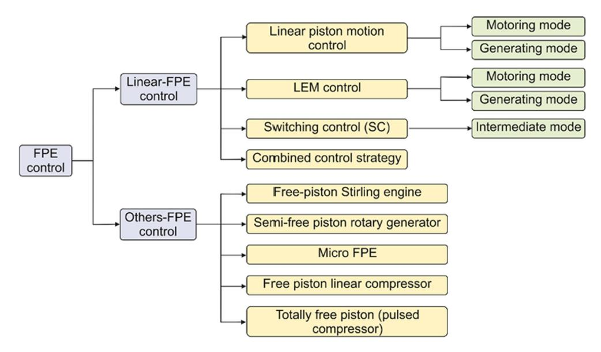

Fig. 1 Taxonomy of FPE control literature.

namely, free-piston Stirling engine (FPSE), semi-free piston rotary generator (SFPRG), micro FPE, totally free piston (TFP) as a pulsed compressor, and free piston linear compressor (FPLC).

#### 3. Free piston engine linear generator

#### 3.1. FPELG working principle and experimental procedure

The FPELG concept is explored in this section by reviewing the different experimental procedures of FPELG and identifying its working principle. The working principle of FPELGs can be classified on the basis of the concepts of the twostroke engine and four-stroke engine. The two-stroke engine can be described as follows. (1) Compression stroke: As a first step, after the control system provides a signal to close the exhaust valve, another signal is sent to close the intake valve when the piston moves from BDC to TDC. For the second step, once the piston reaches TDC, the air and fuel inside the cylinder is mixed and compressed. At this point, the required compression ratio (CR) of the system is achieved. (2) Power stroke: The power stroke is initiated when the control system provides a signal to the ignition system to ignite the compressed mixture. Then, the burned mixture is expanded to push the piston back to BDC. As the piston travels from TDC to BDC, the exhaust and intake valves are opened to clean the cylinder of residual gases and provide a new charge of air-fuel mixture for the next cycle. Current is generated when these stages are continuously repeated [24,27,36,37,236].

The four-stroke FPELG works similarly to a generator in conventional engines; that is, to complete a single power stroke, two oscillation cycles of the piston assembly are required. The four-stroke FPELG can be described as follows. (1) Intake stroke: The stroke starts at the piston of TDC and ends at BDC. When the piston reaches at TDC the control system provides a signal to open the intake valve. A fresh charge of the mixture is provided, and the maximum duration time is determined between TDC and BDC. (2) Compression stroke:

The control system provides a signal to close the intake valve and exhaust valve, and then the piston is moved from BDC to TDC. The mixture is compressed during this stage. (3) Power stroke: When the piston reaches TDC, the control system provides a signal to the ignition system to ignite the air–fuel mixture. The expanding exhaust gases push the piston back from TDC to BDC. During this stage, the current is generated by the kinetic energy of the moving mass. (4) Exhaust stroke: The control system provides a signal to open the exhaust valve during the piston movement from BDC to TDC. The maximum duration time is determined between BDC and TDC where the process ends. By repeating these stages, current is generated [27,36,38,39].

The difference between the two-stroke and the four-stroke engines can be summarized on the basis of previous research. The PMC of the four-stroke FPELG was developed by Xu and Chang [38], whereas a comparison between the two-stroke and four-stroke engines based on simulation results was studied by Jia et al. [36]. Fig. 2 shows the piston velocity

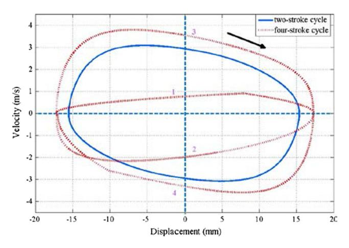

Fig. 2 Piston velocity against displacement [36]

against displacement plot for the two-stroke and four-stroke engines. It can be seen from the figure the piston velocity of the four-stroke is higher compared with the two-stroke engine during the expansion process. By contrast, during the compression stroke, the piston velocity of the four-stroke engine is lower than that of the two-stroke engine, which can be explained by the brake force of the motor. Moreover, Fig. 3 shows the two-stroke engine has a higher indicated power compared with the four-stroke engine given a similar throttle opening. In the case of the four-stroke engine, a certain power is subtracted from the generated electric power when the piston moves during the motoring process.

Similarly, different experimental procedures can be derived from the literature review. For instance, the SP FPELGs with the two-stroke and four-stroke engines were experimentally investigated by researchers [34,38,40]. Fig. 4 shows an experimental setup for determining the electricity-generating characteristics of SP FPELG with two strokes. According to previous studies, the piston movement of the two-stroke SP FPELG is generally based on forces, such as linear motor force, incylinder pressure (combustion gas pressure), and electromag-

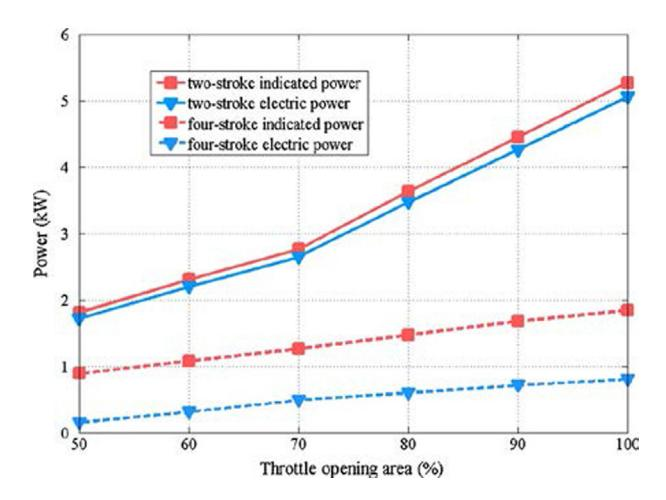

Fig. 3 Power with different throttle settings [36]

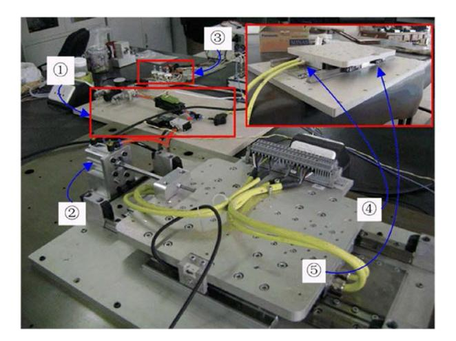

**Fig. 4** SP FPELG experimental setup [40]: (1) gas intake system, (2) gas intake cavity, (3) load resistance, (4) linear motor, and (5) linear alternator.

netic resistance. The previous results showed that stable operation is influenced by the electricity generator. In this case, the linear motor works as a rebound device to generate force that to push the piston from BDC to TDC and on the other side the combustion force to push the piston from TDC to BDC [40].

Other previous studies found that the mechanical spring or gas spring is a good alternative to the combustion cylinder as a rebound device. In this case, the force is produced by the trapped gas inside the cylinder after being compressed by the force of the linear motor for the starting stage and the combustion force for the stable operation. Thus, this generated force from the rebound device works to push the piston from BDC to TDC. While another side (combustion side) works to generate force that to push the piston from TDC to BDC [34,38]. Consequently, a resonance movement between TDC and BDC is produced by the generated forces of the linear motor, mechanical spring, or gas spring as rebound device from one side and in-cylinder pressure of the combustion form another side. During this resonance movement, the output power is produced by the linear generator (LG). Fig. 5 shows the diagrams of the SP FPELG with different rebound devices (linear motor, mechanical spring, or gas spring chamber). The piston position signal originates from an encoder that is fixed to the generator, and then the system is operated using the main controller. In this manner, the signals for opening/closing the valves (i.e., the operating parameters) and the output power can be controlled.

An FPELG, including its parts and connections, is shown in Fig. 6. The fabricated two-stroke FPELG (GX-5) with a single piston engine configuration has an LG linked between the left and right cylinders. One of the cylinders works as a combustion chamber, whereas the other cylinder works as a rebound device. The two cylinders are linked to a highcompression tube that can withstand the high pressure originating from the air tank after being charged by the compressor. Sensors are used to determine certain factors, such as temperature, pressure, piston position, and airflow. The data are collected using a data acquisition system (DAS). Then, the engine is initialized (e.g., inputting the parametric values, monitoring, and data collection) using the LabVIEW interface. The LabVIEW program, which can operate in real time, is specifically built for the system control and DAS. The engine is initialized when signal is provided via the LabVIEW interface software on a PC. Subsequently, the signal is sent to the main control unit (MCU), which functions as the primary controller. The MCU collects all signals produced by the engine sensors and the sub-controller (e.g., response signal) and processes these signals. Once the signal is processed, it is sent back to the sub-controller; in this manner, the signals corresponding to the parameters of each cycle can be controlled [24,41].

An industrial PC platform (PXI-8186)-entrenched controller (National Instrument) powered by Pentium 4 and 2.2. GHz was built following the required specifications of the MCU. The unit specifications are as follows: an SCXI-6602 eight-channel amplifier for handling the analogue input values of current and pressure and a PXI-6602 eight-channel timer/counter unit for the main sensor input, gate—drive output signal, and linear encoder input (i.e., for locating the piston position). The units for current, starting, piston position, throttle, piston speed, fuel quantity, injection position, bounce pressure, pressure calculation, ignition time, and flushing time are all measured using sub-controllers (Fig. 7). Other main

Fig. 5 Diagrams of the SP FPELG with different rebound devices: (a) SP FPELG with a gas spring chamber as a rebound device [34], (b) SP FPELG diagram a mechanical spring as a rebound device [38], and (c) SP FPELG with a linear motor as a rebound device [40].

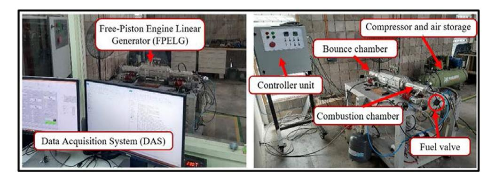

Fig. 6 SP FPELG experimental setup [24]

instrumentations, such as air tank, pressure sensor valves, and compressors are used in the FPELG [24,41]. The basic parameters of the experimental platform are listed in Table 1.

As for the opposed-piston FPELG, the opposed-piston FPELG has been experimentally investigated [22]. The experimental setup comprised different parts. In particular, the middle part of the engine involved two opposing pistons, each one

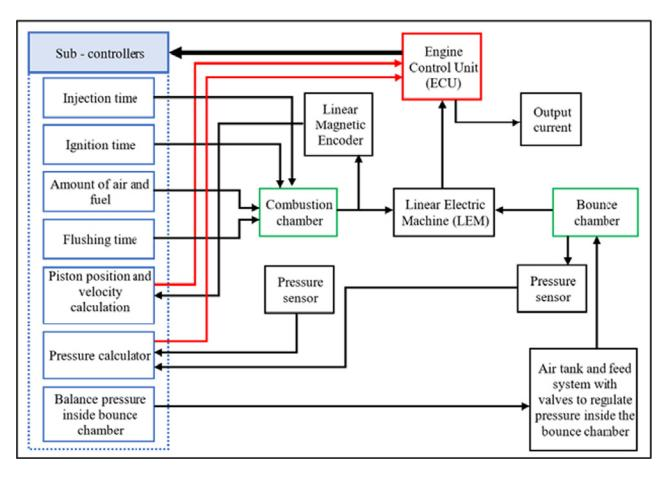

Fig. 7 Control system and instrumentation diagram of the SP FPELG [24]

| Parameter                      | Value    |
|--------------------------------|----------|
| Combustion chamber bore        | 56 mm    |
| Bounce chamber bore            | 56 mm    |
| Maximum stroke                 | 96 mm    |
| Effective stroke               | 84 mm    |
| Piston and connecting rod mass | 7 kg     |
| External load resistance       | 4.7 O    |
| Intake pressure                | 8 bar    |
| Number of cylinders            | 2        |
| Intake valve opening time      | 5–100 m  |
| Cylinder displacement volume   | 221 cc   |
| Engine frequency               | 30 Hz    |
| Fuel injection duration        | 16.79 ms |
| Ignition position BTDC         | 7 mm     |
| Injection position BTDC        | 59 mm    |

connected with tubular-type linear alternators. In addition, each generator was connected to a rebound device from the external side. A water-cooling system was used in the combustion chamber, while the lubrication system was delivered oil to the rebound devices and combustion cylinder. The engine was set to run with hydrogen fuel. Fig. 8 shows the details of the experimental procedure. Kistler 6052CU20 piezoelectric transducers (with a 300-bar measuring range) coupled with Kistler 5010 charge amplifiers were used to measure the pressure in the combustion cylinder. An inductor (Fastar FS5000HP) was used to measure the piston displacement.

The dual-piston FPELG was also experimentally investigated [15,16,42–45]. In particular, the starting process of a dual-piston FPELG was studied [43]. The experimental procedure of the SI dual-piston FPELG is shown in Fig. 9.

The uniflow scavenging method was implemented for the prototype. A linear encoder was used to measure the position and velocity of the piston. The encoder was located in the LEM. For the pressure sensors, 6052 Kistler pressure transducers connected to a 5064-charge amplifier were utilized. Two pressure sensors were used for each sensor connected to a one-cylinder head to instantaneously measure the pressure inside the cylinder. PXIe-6358 (National Instrument) PXI

DAS card and LabView were used to process all signals originating from the sensors and collect real-time data from the experiment. As for the LEM, the tubular and flat types were the two most commonly used in the previous studies [27,42,46,47]. The advantages of tubular LEM are its no end-windings and the zero net radial force between the stator and mover. However, the tubular LEM is more difficult to manufacture and assemble compared with the flat LEM, which is relatively simple [27].

Fig. 10 depicts the structure of the compression-ignited (CI) diesel FPELG by Yuan et al. [48]. The ELM, which is located between two combustion cylinders, is also presented to describe the FPELG parts. The FPELG has a single-moving part that is controlled by the motoring force and pressure forces originating from the combustion process, and they affect the two pistons. The gas exchange is a standard scavenging system that includes an exhaust conduit, three transfer conduits, and a plenum box. The exterior compressor produces high-pressure air within the tank to ensure the best scavenging performance. The air-spring behavior and the classic resonance mechanism are used for the FPELG starting method. When the engine starts to work, the alternator is operated as a motor to produce a drive force, thus pushing the translator assembly while maintaining the driving force along the translator motion direction.

The force pushing the pistons between TDC and BDC increases gradually to build a mechanical resonance movement until the combustion conditions are reached. Then, the starting ignition is actualized, as illustrated by Fig. 10 [48].

The experimental of a proposed FPELG prototype is shown in Fig. 11. The prototype can synchronize the mechanism of the self-designed FPELG with a direct electrical alternator. The engine was built with dual cylinders in a two-stroke. An Air-cooling system was used to cool the engine cylinder. A combustion bowl, which was designed with a shallow dish structure, was positioned at the head of the piston. A loopscavenging system with a fixed pressure was used to control the exhaust and intake. A standard direct injection system was devised to deliver the correct fuel amount. A commercial permanent magnet was used as the linear alternator or LEM. The maximum current could nominally reach 34 A. The allowable motion amplitude of the translator was 180 mm. Moreover, a programmable controller and a commercial driver were chosen to control the LEM and deliver manageable currents. The gauge system was developed with the NI-PXIe-6358 card and a few sensors that were operated using the LabVIEW software. Two pressure sensors were selected, one for each cylinder located at the cylinder head. The model of these sensors was Kistler 6052C. Scavenging box pressure sensors (Kistler-4007BA5) were utilized to control and measure the pressure. These pressure sensors were used to measure the pressure within the cylinder and collect pressure data. A linear sensor (encoder) was used to measure the piston displacement/ piston position. The piston's position data were collected by the encoder. The basic specification of the experimental platform is shown in Table 2 [48–50].

As for LEM, a modeling study was conducted for tabularand flat-alternator FPLEs (Fig. 12). A finite element model was utilized to study the LEM characteristics, such as maximum voltage, specific power, efficiency, and current density, to compare the two linear alternator types. Results showed that the flat alternator was better than the tabular alternator

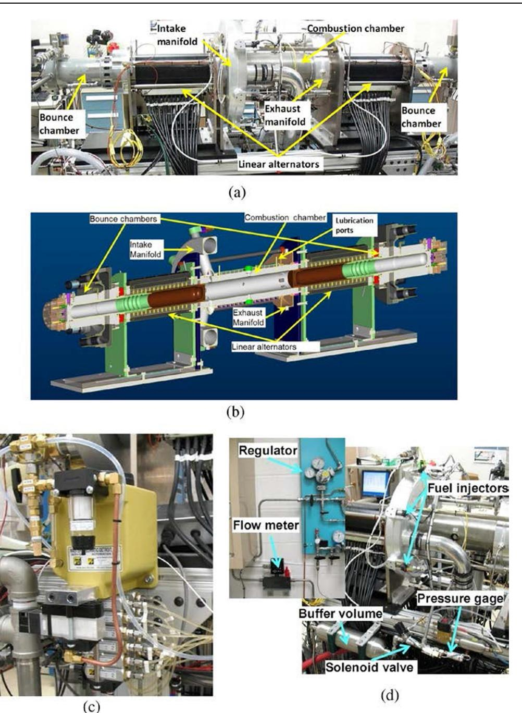

**Fig. 8** Experimental setup of Sandia's FPELG prototype [22]: (a) and (b) prototype and cross-section of the opposed-piston FPLE respectively, (c) lubrication system and (d) fuel supply system.

in terms of efficiency, current, output voltage, and specific power, suggesting its appropriateness for FPLEs [46].

The linear alternators utilized for FPELGs were grouped into two main groups of phase structure as follows: single-phase and three-phase LEMs [51]. The three-phase LEM needs less copper within the windings to convert an equal amount of current compared with that for a single-phase LEM. Findings indicate that the single-phase LEM is larger than three-phase LEM when the same output power magnitude is utilized,

whereas the three-phase LEM is more expensive and complex. Therefore, three-phase LEMs were used in many studies to take advantage of the small size and high output power [22,52,53] even if results showed that single-phase LEMs are more suitable for low-power FPELGs [5,42]. Li et al. [46] investigated the effects of design and external load on electric power of both tubular and flat LEMs via simulation analysis. Results showed that the flat LEM was more efficient and has greater electric power compared with the tubular LEM

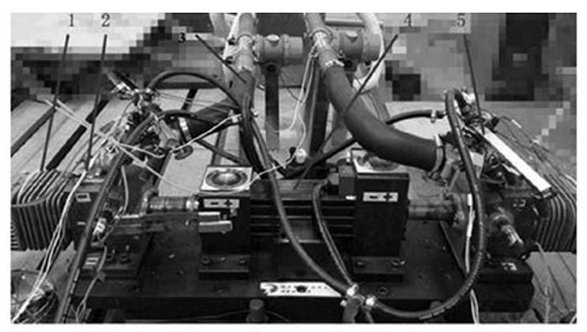

1 Cylinder; 2 Scavenging pump; 3 Air intake manifold; 4 Linear electric machine; 5 Fuel injection system (a)

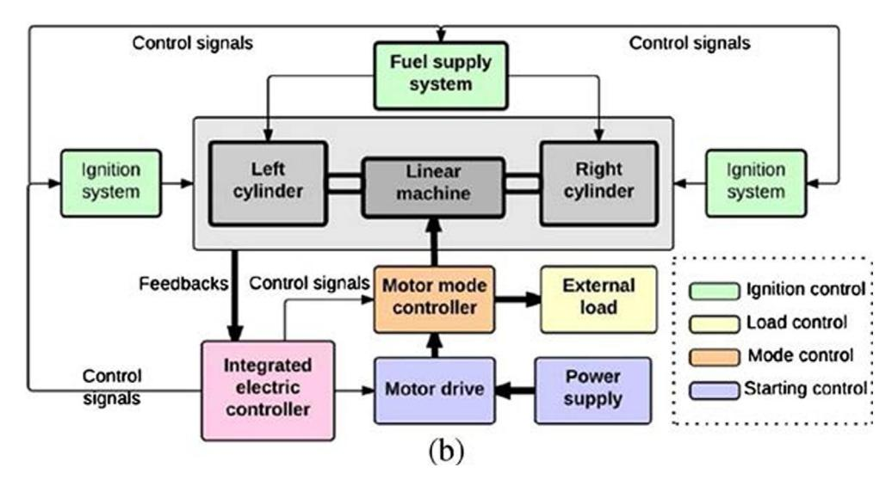

Fig. 9 Experimental setup of the dual-piston FPELG [43]: (a) prototype and (b) control system.

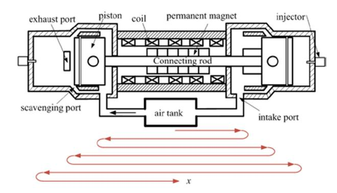

**Fig. 10** Mechanical resonance movement for the starting process of the FPELG [48]

(Fig. 13). The electric power output of the flat LEM improved considerably when the distance between the air gap (rotor) and stator and the external load was reduced.

Another study [42] investigated the characteristics of combustion and electrical generation for the two-stroke SI dual-

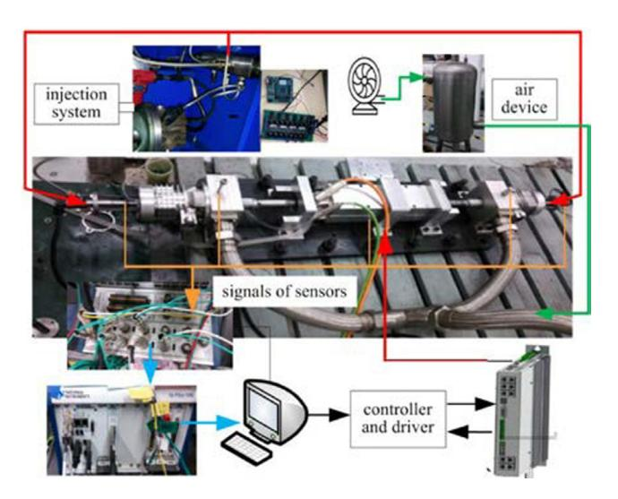

Fig. 11 Dual-piston FPELG experimental setup [48]

| Table 2 Basic specification of the experimental setup [48] |          |  |
|------------------------------------------------------------|----------|--|
| Specifications                                             | Value    |  |
| Cylinder bore                                              | 60 mm    |  |
| Nominal stroke length                                      | 90 mm    |  |
| Nominal compression ratio                                  | 16       |  |
| Nominal effective stroke length                            | 62 mm    |  |
| Mass of piston assembly                                    | 5.4 kg   |  |
| Exhaust port height                                        | 25 mm    |  |
| Scavenging port height                                     | 15 mm    |  |
| Valve overlapping distance                                 | 13 mm    |  |
| Peak force of alternator                                   | 2163 N   |  |
| Continuous force of alternator                             | 673 N    |  |
| Peak velocity of alternator                                | 5.9 m/s  |  |
| Alternator force constant                                  | 89.9     |  |
| Allowed motion range                                       | 0–180 mm |  |

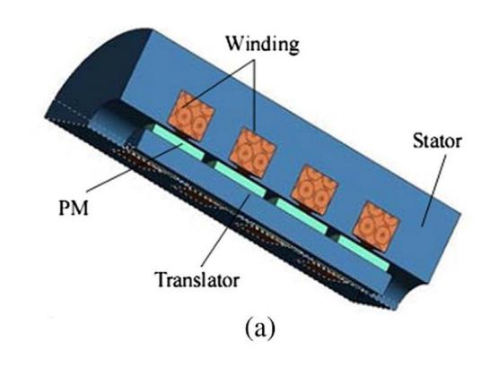

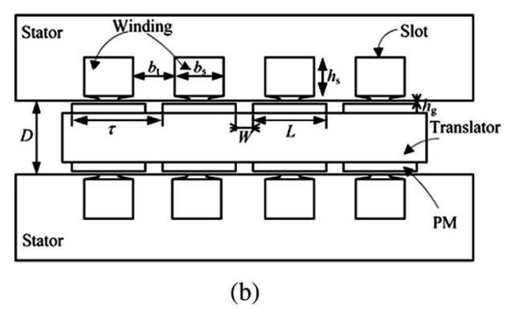

Fig. 12 Model of a linear alternator (cross-section) [46]: (a) tubular linear alternator type and (b) flat linear alternator type.

piston FPELG. The flat-type LEM was utilized for this prototype. Fig. 14 illustrates the experimental setup. An optical sensor (KL3AN1, KAIS Co.) was used to determine the piston position. A photo interrupter sensor was utilized for the ignition system. The digital signals produced by the photo interrupter sensor (GP1S092HCPIF, Sharp) was utilized to control the ignition timing after processing through the controller. Dynatek-ARC-2 was used as the ignition coil to generate spark pulses after receiving signals from the photo-interrupter sensor. Kistler-6052C and Kistler-5018A were used for the pressure sensor and charge amplifiers, respectively, to measure the pressure within the cylinders. DAS and LabView were used to process all signals originating from the sensors and collect real-time data from the experiment.

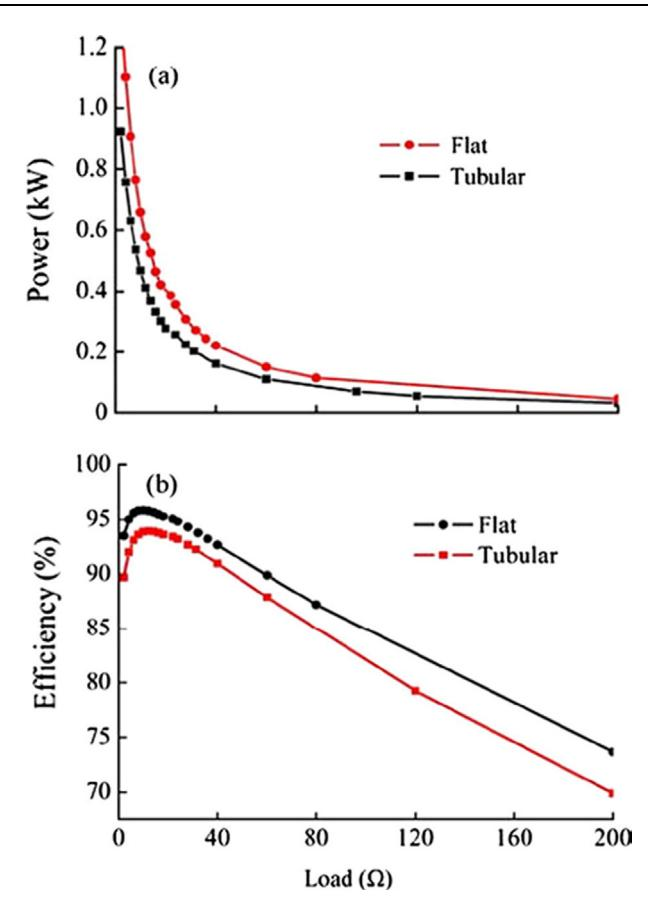

Fig. 13 Comparison between flat and tubular LEM [46]: (a) Power against external load and (b) efficiency against external load.

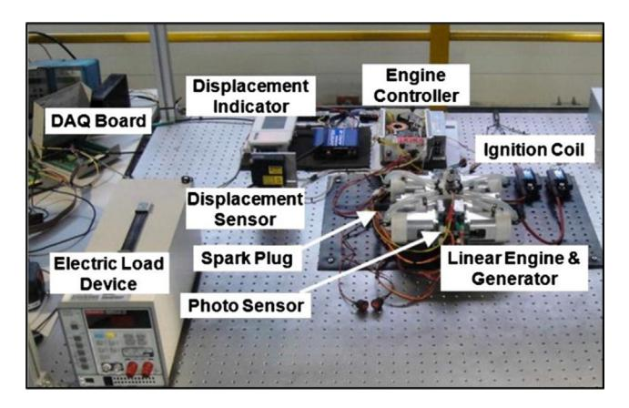

Fig. 14 Dual-piston FPELG experimental setup [42]

#### 3.2. FPELG and conventional engine comparison

The most important advantages of FPELG, such as thermal efficiency, dynamic and friction losses, should be understood. In this section, the comparison between the FPELG and conventional crank shaft engine (CSE) is reviewed and determined on the basis of their dynamic and thermodynamic characteris-

tics and their friction forces. Regarding the dynamic and thermodynamic characteristics, the comparison between FPE and CSE for the piston velocity against displacement (dynamic characteristics) is shown in Fig. 15 [54].

Mikalsen and Roskilly [55] evaluated the combustion process of a diesel FPELG via CFD modeling and then compared the findings with those of CSE (conventional engine) under similar operation conditions. The comparative results indicate that the heat release rate (HRR) of FPELG was higher in the premixed combustion phase. This finding may be attributed to the ignition delay, which was higher in FPELG compared with that in CSE. In another study, Mikalsen and Roskilly [11] compared the simulation results of the two-stroke CI FPELG and the corresponding CI CSE. The model was built on the basis of the Hohenberg [56] model for in-cylinder heat transfer, but the parts pertaining to the combustion model and the other sub-models were developed. Their results showed that FPELG has a higher indicated efficiency compared with CSE. They found the possible reason is that FPELG entails lower frictional losses and lower heat transfer losses compared with CSE, as illustrated in Fig. 16. The maximum gas temperature during the expansion of FPELG was less than that of CSE, indicating that the heat transfer losses were also lower.

The simulation results further demonstrate the advantages of decreasing the temperature dependent releases (NOx). The in-cylinder gas temperature of FPELG is generally lower than that of CSE (conventional engine), as illustrated in Fig. 17 (a) to (c) [57]. The obtained results are concurrent with those in the research of Mikalsen and Roskilly [11]. Therefore, FPELG has a more significant effect on emission gases, which can be decreased by combustion control, compared with CSE.

On the other hand, the piston velocity and acceleration are higher around the TDC of FPELG compared with those of CSE, as the efficiency can be increased under low engine speeds given the lower losses in heat transfer. However, when the engine speed of CSE exceeds 3000 r/min, the indicated efficiency also increases and subsequently surpasses that of FPELG, as shown in Fig. 18. This finding can be attributed to the short duration time of residence at the high temperature and balance the heat transfer that to reflect on the motion of

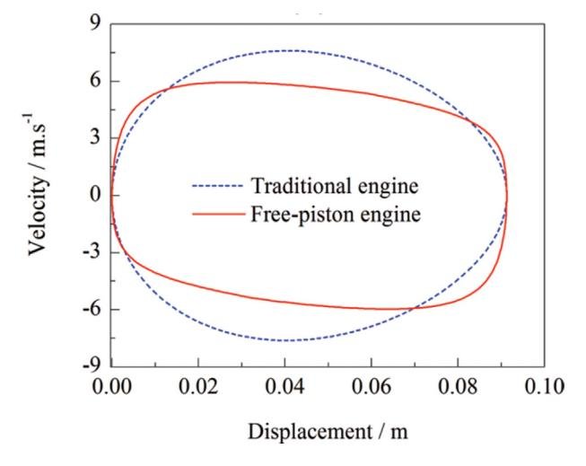

Fig. 15 Velocity vs. displacement profile for CSE and FPELG [54]

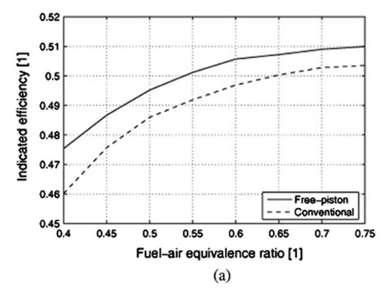

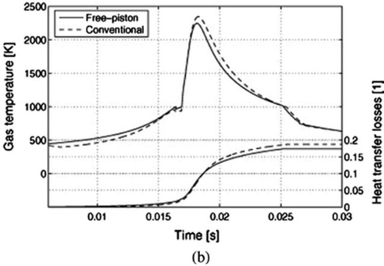

**Fig. 16** Comparison between CSE and FPELG [11]: (a) indicated efficiency against fuel—air equivalence ratio and (b) incylinder gas temperature and heat transfer losses.

the free piston. By contrast, the maximum brake torque (MBT) of FPELG is superior to that of CSE [58,59].

#### 3.2.1. Friction losses and control technique

The simplicity of the FPELG is one of its important advantages as opposed to the CSE. This simplicity can be particularized into low frictional losses, low maintenance, reduced manufacturing costs and compactness. The comparison of friction forces between FPELG and CSE can be divided as follows. First, the main important parameters are ring friction characteristics, piston ring friction and piston skirt friction. Second, a comparison of the total friction between FPELG and CSE should be considered. The friction mechanisms (FMs) of the diesel and SI engines were studied by Heywood [56]. The total friction force was considered to be 100%, and this percentage can be categorized into the following: (1) friction force of the accessories at approximately 15%, (2) friction force of the piston assembly at approximately 50%, (3) friction force of the crankshaft bearings at approximately 10% and (4) friction force of the valves at approximately 25%. However, the CSE has higher friction compared with FPELG due to the crank mechanism. Therefore, the friction within the wrist pin, crankshaft, big end, valve mechanism pulleys or gears, belts and camshaft bearings for driving the engine is eliminated

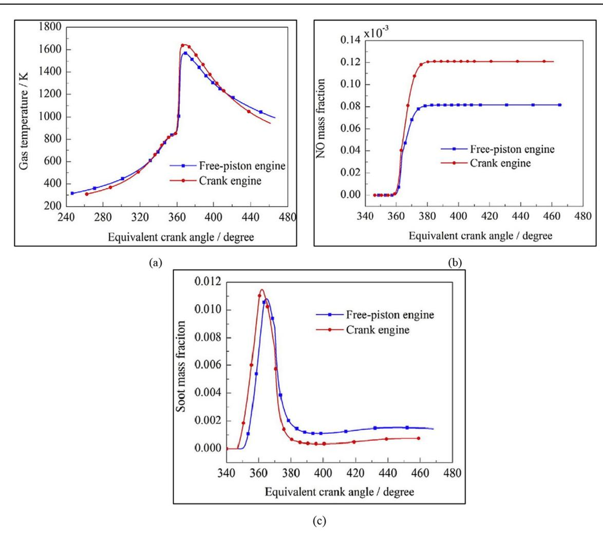

Fig. 17 Comparison between CSE and FPELG [57]: (a) mean in-cylinder gas temperature, (b) NO emission and (c) soot emission.

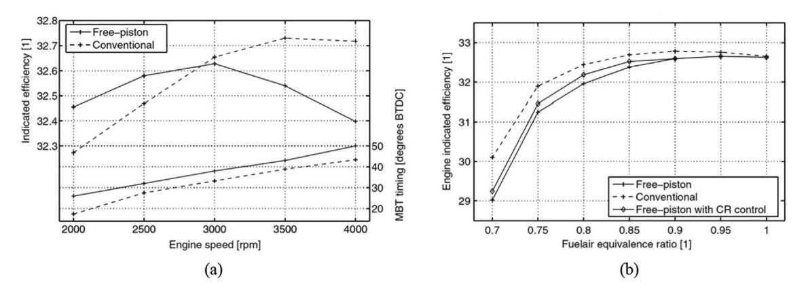

Fig. 18 Comparison between CSE and FPELG in terms of (a) indicated efficiency and MBT timing vs. engine speed and (b) indicated efficiency vs. fuel-air equivalence ratio [58,59]

in FPELG [60,61]. Furthermore, in FPELG system modeling, the model of friction is usually simplified in contrast to CSE system modeling. In general, the highest friction force originates from the friction between the piston rings and cylinder wall, which differs from the other parts in FPELGs. Friction can be further categorized into the left and right cylinders,

denoted by  $(F_{fl})$  and  $(F_{fr})$ , respectively. Then, the friction force originates from the friction between the LEM and piston assembly  $(F_{fm})$ . While the friction force originating from the piston skirt entails a very small value, it was neglected in the model development in the past studies. Here, the equation for total friction force  $(F_f)$  is given by [36,62]

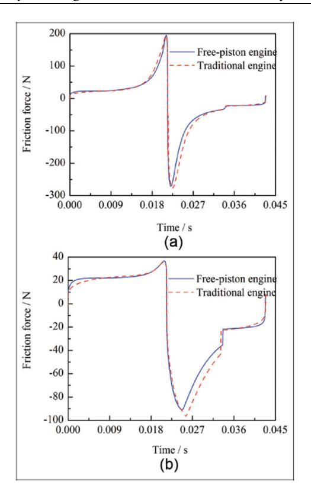

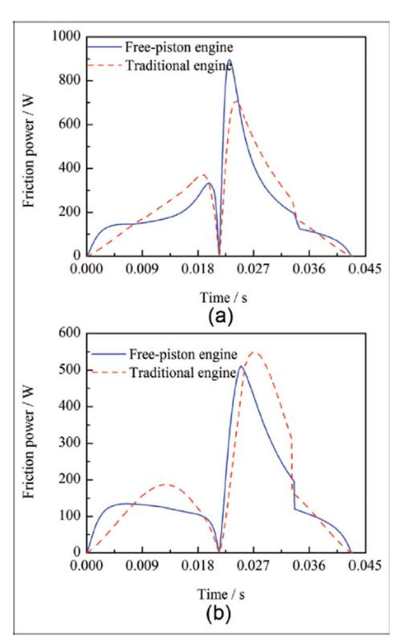

Fig. 19 Comparison between CSE and FPELG in terms of friction force and friction power [54]: (a) top ring and (b) bottom ring.

$$F_f = F_{fr} + F_{fl} + F_{fm} \tag{1}$$

The friction characteristics of piston rings of the FPELG was investigated by Yuan et al. [54,63]. Reynolds equation was used to describe the oil film thickness and pressure distribution. Moreover, the FPELG was compared with CSE in terms of the influence of piston dynamics on lubrication and friction force. The friction forces of the piston ring against time and the friction power loss against time for the FPELG and CSE engine types are shown in Fig. 19 (a) and (b), respectively [54]. As can be seen from figure, the friction power and friction force of the piston rings of FPELG are both lower than those of CSE because of the improved lubrication in the termini region. However, the friction power of the FPELG rises with the multiplication of fuel mass or load. The efficiency of friction variation is correlated with the load of the generator, but the ideal friction efficiency can be attained by either intensifying or lessening those from a particular generator load. According to evaluation results on the tribological characteristics of the piston rings of the FPELG, the friction power and force of the two engines are practically comparable. However, the peak of friction power of FPELG is greater than that of CSE. The results further indicate that the friction force of the piston rings in the CSE was higher than that in the FPELG. They found the possible reason for this result is the good lubrication of FPELG. The friction loss of CSE and FPELG are presented in Table 3 [54].

On the other hand, can be concluded that the leakage mass of FPELG is lower than that of CSE. The leakage power losses are 4.4% and 4.6% of the indicated power for FPELG and CSE, respectively, as shown in Fig. 20 [63].

**Table 3** Comparison between CSE and FPELG in terms of friction loss [54]

| Friction performance                    | CSE     | FPELG   |
|-----------------------------------------|---------|---------|
| Friction work of top ring               | 10.7 J  | 9.9 J   |
| Friction work of bottom ring            | 8.1 J   | 7.5 J   |
| Friction loss efficiency of top ring    | 3.63%   | 3.53%   |
| Friction loss efficiency of bottom ring | 2.73%   | 2.45%   |
| Average friction power of top ring      | 254.8 W | 235.7 W |
| Average friction power of bottom ring   | 192.9 W | 178.6 W |

FMs were compared and reviewed by considering similar sizes of FPELG and CSE. The crank, piston assembly (including piston rings and piston skirt), bearing system and valve train system were identified as the main FM of CSE. By contrast, the piston assembly, LEM and valve train system were identified as the main FM of FPELG. The friction loss with respect to the FMs was measured and analyzed. Strobeck diagram was used to simulate the friction of piston rings at certain stages, such as mixed lubrication, hydrodynamic lubrication and boundary conditions. The results showed that unlike CSE, the FPELG did not improve of the friction characteristics of the piston ring, but also high frictional loss is produced. However, owing to the lack of a crank system in FPELG, the total friction loss was lower than that in CSE. The results further showed that the frictional loss was approximately 5% of the indicated power of FPELG compared with approximately 10% for the conventional engine [62]. This finding is similar to the results reported by another study [64] in which the total

Fig. 20 Comparison between CSE and FPELG for leakage flow rate profile of the piston ring chamber [63].

friction loss of CSE is nearly double of that of FPE. Moreover, previous studies found that friction force was much lower than the pressure force produced from the combustion, and it did not have strong effect on the dynamic characteristics. Thus, the friction force (with its notably low value) was ignored, the building of zero/one-dimensional numerical models for FPELGs was not considered [61]. Meanwhile, other studies used a constant value for friction loss to enhance model accuracy. This constant value was accounted for in the piston movement with the translator of the LEM, whilst the friction force direction was assumed to be opposite with that of the piston movement [11,65,66]. The range value of this constant (friction force) was assumed to be from 60 to 100 N [62]. Finally, the frictional losses were calculated and compared for both FPE and CSE. The details are shown in Table 4 [64].

Removing the crankshaft from the FPELG entails certain advantages. First, the few moving parts in FPELGs implies low friction, further suggesting low lubrication requirements. Second, as FPELG has fewer parts than CES, its maintenance cost is lower. With the few number of parts, the manufacturing cost is expectedly low. Finally, the size and weight of FPELG is smaller than that of CES, hence a more compact unit. The FPELG is also known for its long lifetime. Some researchers developed different methods to overcome the issue of friction losses. One of the most important methods is the active tribology or tribotronic. In order to achieve the mechanical systems with more compact including high thermo-mechanical loads

**Table 4** Comparison between CSE and FPELG in terms of friction loss [64]

| Parameters [Unit]                                 | CSE    | FPELG  |
|---------------------------------------------------|--------|--------|
| Piston rings frictional loss [W]                  | 2299.4 | 2489   |
| Piston skirt frictional loss [W]                  | 810.2  | 0      |
| Crank and bearing frictional loss [W]             | 1508.9 | 0      |
| Valve train system [W]                            | 1724.4 | 1724.4 |
| Linear electric generator frictional loss [W]     | 0.0    | 265.4  |
| Total frictional loss [W]                         | 6342.9 | 4478.8 |
| Engine indicated power [W]                        | 44,070 | 50,064 |
| % of total frictional loss to indicated power [%] | 14.4   | 8.9    |

and high power densities a novel tribological systems is required.

A tribological system is an active control and monitoring system to control certain losses, such as wear and friction losses. The concept of tribology science can be summarized as follows. When motion occurs between any two contacted surfaces, wear and friction are produced. Machine efficiency resulting from energy loss is adversely influenced by friction force. In addition, the lifetime of machines is significantly decreased by wear, leading to machine failure, followed by massive losses because of poor performance. In this case, lubrication is usually used to minimize the impact of wear and friction. However, the best design of lubricated contact surfaces entails the control and minimization of losses by using tribological systems [67-72]. Therefore, the tribotronic can be described as a novel concept in which the actuators and sensors are used to dynamically control the machine and subsequently improve its performance. Artificial intelligence and decision making can be used in the tribotronic system to improve performance, such as when a machine is programmed to control itself and monitor the system. Thus, the feedback of parameters, such as lubrication and wear, are used in the tribotronic system to ensure improvement [69]. Fig. 21 shows the tribotronic system, including the sub-components, developed by Sergei and Erik [70]. In their work, the concept of tribotronic was also presented. They found that smart tribotronic systems can be used in a great variety of machines to improve products, i.e. more reliable, flexible and efficient products.

In terms of the sensing and actuating parts of the tribological system, for example large sensors are needed for conformal contact. However, for both cases of conformal and nonconformal contact, the most important aspect of tribotronic systems is the selection of suitable sensors [70]. The sensors are used in the system to monitor problems. Decision-making algorithms of the modern monitoring type can help to improve the tribotronic system [67,70]. Meanwhile, thin films of oil or other fluid types, such as water, or even air, are widely used between any two moving surfaces to prevent mechanical contact and subsequently minimize wear and friction. The wear can be prevented using the aforementioned methods, but friction can only be decreased because it is affected by other parameters, such as the viscous shear forces

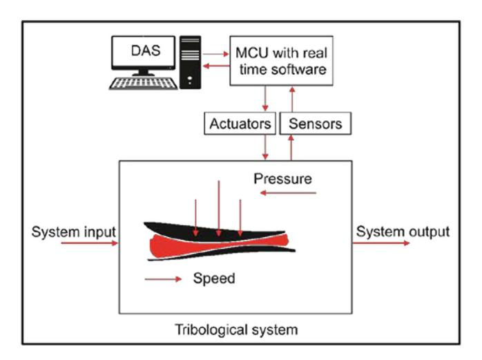

Fig. 21 A tribotronic system, including its sub-components.

of lubrication [70]. By controlling together certain parameters, such as applied load, lubricant viscosity and sliding speed, the main tribological problem can be solved [67,68,70,71]. Thus, the tribological system has wide applications in ensuring the performance of typical hydrostatic bearings and tilting-pad bearings. Some researchers have attempted to improve the tilting-pad bearing by adopting different methods, such as replacing the conventional fixed pad with piezoelectric actuators [73] or utilizing pressurized hydraulic cylinders [74]. In another study, the mechanical device was used to change the pad slop to be able to improve the film geometry [75].

Some researchers also found that the compression rings affect engine power losses. The friction mean effective pressure (FMEP) is one of the most important parameters used to decrease power losses. A model [69] was developed using the automatic control strategy to control the FMEP. The Reynolds equation was adopted in the model to predict the pressure distribution on the ring (i.e. width and face), and a proportional integral derivative (PID) control was used to compute the maximum pressure. Finally, the obtained results were compared with those of the cavitation model. Findings showed that FMEP is an effective parameter in the tribotronic design of CSE [69].

ICEs are known to influence different economic fields, such as the operation of power plants and transportation [76,77]. Fuel and oil consumption are considered the main important resources associated with engines. One of the most critical issues affecting engine performance and lifetime is the one associated with piston rings. The top compression ring can be affected by rapidly changing loads, such as changing speed and pressure and a pure lubricant environment (temperature) [78,79]. On the other hand, some researchers have studied the influence of the ring—bore contact to produce an optimized design of the piston assembly. Thus, high quality piston rings are required during manufacturing [78,79].

For the lubricant flow, many tribologists have also investigated lubricant flow within contact points. Various numerical approaches have been proposed to compare the different results of cavitation models [80–82]. Results showed that heat transfer, generated friction and load-carrying capacity are influenced by cavitation. Moreover, a 3D model of the ring was built, and the numerical results of this model after valida-

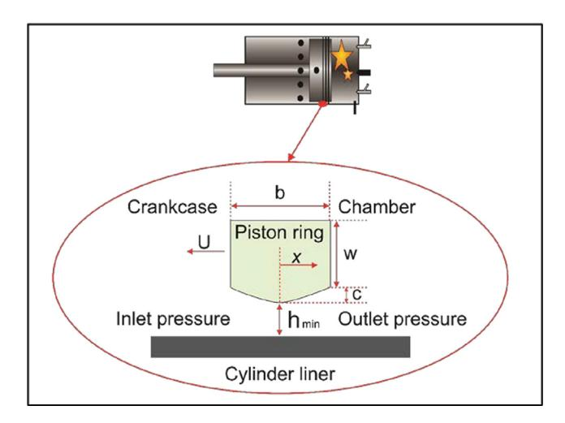

Fig. 22 Basic parameters of the ring-liner conjunction.

tion were further investigated on the basis of the experimental data. Findings showed that certain parameters, such as the twisting or fluttering in the piston groove, affect the ring's sealing [83,84]. Their findings showed that the total engine power loss is 20%, in which approximately 30% and 40% of the total percentage originates from the top compression ring [85].

The ring-bore environment is one of the most complex parts that need to be studied because it has to change certain operation conditions, including the contact and lubrication characteristics [86]. The ring-liner system was studied experimentally by Furuhama in 1960 [87]. The results showed that transient lubrication, including the parameters such as temperature and load, affect the ring-liner contact characteristics. Moreover, the mechanism of the piston ring-liner via both experimental and numerical modeling were studied [88-90]. Frictional losses and film thickness were measured on the basis of Reynolds lubrication theory. Their results showed that engine power losses were affected by certain main parameters, such as speed, in-cylinder pressure and viscosity. In the other studies, the piston ring-liner was investigated using numerical models and CFD [91–93]. Their results showed that fuel consumption and generated friction were affected by the parameters of flow conditions of the lubrication and ring-cylinder

Researchers [94] have studied the control of lubricating films based on a well-established theory. Using this method, the lubricant leakage, temperature and power loss were controlled and adjusted. Their results showed that lubricating film thickness is a limitation because it cannot be directly measured. In another study, the pin-on-disc tribometer was developed as part of the tribotronic system [95]. By using a load cell, the friction could be measured via the system. Other researchers have studied the concept of active tribology or tribotronic. The applications of smart machine concepts were also discussed [70]. While in another study focused on the implementation of novel nano-electromechanical devices for sensing applications. The nano-electromechanical devices could be classified as tribotronic because the semiconductor was coupled with triboelectricity [96]. In summary, an increasing number of researchers in recent years have developed tribotronic systems in a variety of fields, especially those involving ICEs. Engine performance can still be improved by controlling the FMEP, and more specifically, the compression piston ring [69].

As for the ring-liner lubrication equations, a 2D model of the ring-bore conjunction was proposed [97]. In addition, the fluid film between the cylinder liner and piston ring was modeled on the basis of the Reynolds equation, which can be expressed as follows [98]:

$$\frac{d}{dx}(h^3\frac{dp}{dx}) + \frac{d}{dy}(h^3\frac{dp}{dy}) = 6\mu \bigsqcup \frac{dh}{dx} + \frac{dh}{dt},$$
 (2)

Where X represents the flow in the entraining motion direction, y represents the side-leakage from the contact, p represents the pressure and h represents the film shape under the assumed isothermal conditions. The Reynolds equation can be solved on the basis of the boundary conditions. Atmospheric pressure is one of the boundary conditions. Fig. 22 shows the basic design parameters of the ring—liner conjunction. From the figure can be seen that the lubricant film distribution is directly associated with the ring face, and it is expressed as follows:

$$h(x, y, t) = h_{min}(t) + h_s(x, y), \tag{3}$$

where  $h_{min}$  (t) represents the minimum oil thickness of the ring-cylinder conjunction, and  $h_s$  represent the ideal parabola shape, which is calculated by

$$h_s(x,y) = \frac{cy^2}{(b/2)^2}.$$
 (4)

The tribotronic device based on mechanical sensing and logic operation was studied via numerical simulations and analytical calculations. The results verify the effectiveness of the developed tribotronic device design for the coupling effect [68]. The concept presented above can be used to highlight the important basics parameters of the ring-liner lubrication and friction losses. By using controls, such as PID, the tribotronic system can be designed with respect to the FMEP.

The review above has presented the concept of 'FPELG and its advantages over CSE. In most two-stroke FPELGs, the combustion at TDC is needed to push back the piston to the BDC. However, the piston acceleration around the TDC is higher than that in CSE. In FPELGs, the compression ratio and stroke of each engine cycle can be adjusted using a controller because of the absence of a crank system. Thus, FPELGs can easily handle different fuel types. However, cycle-to-cycle variation is a significant issue that needs to be solved with the robust controller. SI/HCCI combustion modes for CSEs can be operated experimentally, in which the engine flywheel, which generally saves energy, can be handled between these two modes. By contrast, FPELGs cannot save energy because the energy storage device (flywheel) is removed; thus, the variations for both heat release and piston position are produced in a cycle-to-cycle manner. On the basis of this limitation, further investigation is needed to enhance the ability of FPELGs to work in SI/HCCI combustion modes. Furthermore, on the basis of the combustion mode, different gas exchange processes can be produced for FPEs. Thus, the high scavenging efficiency is required for both diesel and SI combustions, but the emission characteristics and combustion efficiency can only be improved by maximizing the trapping efficiency. In view of controlling the compression ratio and the stroke of each engine cycle in FPELGs, the main parameter involves the determination of the positions of TDC and BDC. In this manner, the cycle-to-cycle variation can be decreased. Consequently, a new control strategy focusing on high accuracy with high response time is required to solve the cycle-to-cycle variation issue. On the other hand, the exhaust gas emission of FPELGs can also be controlled and reduced. While for the wear and friction losses of FPELG, the tribotronic system is suitable and regarded to be an effective technique for decreasing losses, such as wear and friction. However, only a few studies have focused on the tribotronic system, especially for FPELGs.

#### 4. FPE control

#### 4.1. Linear FPE control

Because the FPELG has no crankshaft, piston movement is exclusively determined by the forces generated from engine cylinders. Some kinds of engines have one or two cylinders such as the linear compressor FPE and hydraulic FPE, while other types have more than two cylinders. Moreover, some FPELG types have a combustion chamber and rebound device, and other types have only combustion chambers. Table 5 shows the different designs of the main FPELG types with specifications [17,21,29,99–101]. Thus, because the pistons move freely, therefore, consistency of the motion trajectory and dead center positions (TDC and BDC positions) cannot be guaranteed for each cycle, which, subsequently causes cycle-to-cycle variations. In addition, the input and output energy conversions are also affected by various parameters such as piston displacement, TDC position, BDC position, and velocity [102,103]. According to the literature, trajectory tracking control is one type of control strategy. Therein, piston movement is controlled to follow a determined trajectory while the engine is running [32,34,52,104,105]. Balancing the load and combustion parameters present another type of control

Table 5 Design and specifications of different linear FPE types.

#### Specifications

- 1- Single-piston linear FPEs: the components include the cylinder, single-piston, and rebound device. The mechanical specification is simple with high controllability when compared to other linear FPEs. As only one piston is present, the dynamic balance is unsatisfactory [11,29].
- **2- Dual-piston linear FPEs:** the components include a dual-piston and two combustion chambers, and no rebound device is present. High compression ratio and a more compact device with a higher power to weight ratio are also involved [99]. Control of the piston motion is difficult, and high cycle-to-cycle variations are therefore produced [12,29,112].
- **3- Opposed-piston linear FPEs:** the components include a single combustion chamber with two single piston units. The pistons are connected by mechanical linkages to remove mechanical vibration [113]. Low heat losses are achieved by using a shared combustion chamber. This type of linear FPE is bigger than other FPEs [27,29].
- **4- Four-cylinder complex linear FPEs:** this type is characterized by a more complex design, high output power, and more complex controllability [17,27].

#### Representation

| Institution and university names                                                       | Linear-FPE prototype design                      |  |
|----------------------------------------------------------------------------------------|--------------------------------------------------|--|
| Korea Advanced Institute of Science and Technology [115]                               | Dual piston FPELG                                |  |
| Sandia National Laboratories [22,33,116]                                               | Opposed piston FPELG                             |  |
|                                                                                        | Dual piston FPELG                                |  |
| Nanjing University of Science and Technology [38,117]                                  | Single piston, four stroke engine, mechanical    |  |
|                                                                                        | spring respond device                            |  |
| Universiti Teknologi PETRONAS (UTP) in Centre for Automotive Research and              | SI-dual piston FPELG                             |  |
| Electrical Mobility (CAREM) [24,41,118,236]                                            | SI-single piston FPELG                           |  |
| Newcastle University [23,43,119]                                                       | Single piston FPELG                              |  |
|                                                                                        | Dual piston FPELG                                |  |
| University of Ulsan [17,42]                                                            | Dual piston FPELG                                |  |
| Shanghai Jiao Tong University [99]                                                     | SI- dual piston FPELG                            |  |
| Beijing Institute of Technology [25,26,40]                                             | Single piston FPELG                              |  |
|                                                                                        | Dual piston FPELG                                |  |
| Tongji University [120]                                                                | Dual piston FPELG                                |  |
| German Aerospace Center [121–125]                                                      | Single piston FPELG                              |  |
|                                                                                        | Opposed piston FPELG                             |  |
| Libertine FPE Ltd [126]                                                                | Dual piston FPELG                                |  |
| Toyota Central R&D Labs [34,52]                                                        | Single piston FPELG                              |  |
| Korea Institute of Energy [44]                                                         | SI-dual piston FPELG                             |  |
| West Virginia University [127]                                                         | Dual piston FPELG                                |  |
| General Motors [128–130]                                                               | Opposed piston FPELG                             |  |
| General Motors and West Virginia University [131]                                      | Dual piston FPELG                                |  |
| Korea Advanced Institute of Science and Technology and Korea Institute of Energy [132] | Dual piston FPELG                                |  |
| University of Minnesota [133]                                                          | Dual piston FPELG                                |  |
| Ford Motor Company [134]                                                               | Opposed piston FPELG                             |  |
| Norwegian University of Science and Technology [135]                                   | Single piston FPELG                              |  |
| Toyohashi University of Technology [136,137]                                           | Single piston FPELG                              |  |
|                                                                                        | Opposed piston FPELG                             |  |
| Dutch company, Innas BV [138]                                                          | Single piston hydraulic FPE                      |  |
| Technische Universität Dresden (German university) [139,140].                          | Single piston hydraulic FPE                      |  |
| Institute of Hydraulics and Automation at Tampere University of Technology [141]       | Dual piston FPELG                                |  |
| Tampere University of Technology [142]                                                 | Single piston hydraulic FPE                      |  |
| University of California [143]                                                         | Monopropellant-Driven free piston hydraulic pump |  |
| Vanderbilt University [144]                                                            | Free piston engine compressor                    |  |
| Zhejiang University [145]                                                              | Single piston hydraulic FPE                      |  |
| Tianjin University [146]                                                               | Opposed piston hydraulic FPE                     |  |
| Jilin University [107]                                                                 | Dual piston FPELG                                |  |
| Czech Technical University [147]                                                       | Dual piston FPELG                                |  |
| Pempek Systems Company in Australia [148].                                             | SI- Dual piston FPELG                            |  |
| Volvo [149–154]                                                                        | Dual piston FPELG                                |  |
| Ford Global Tech [155,156]                                                             | Opposed piston FPELG                             |  |
|                                                                                        | D. 1 EDELC                                       |  |

strategy [13,37,62,106–109]. The third type of control strategy is controlling the output current with stable operation using a determined reference current profile [7,40,110,111].

Mazda [157]

Note that input energy without losses (the indicated work) and output energy must be balanced, wherein input energy is generated by burning fuel and output energy is generated from the resultant force in the cycle. Therefore, imbalanced input and output energies may cause the piston to collide with the cylinder head or cause the engine to stop, misfire, or produce a different compression ratio. These issues result in unstable operations. Consequently, input and output energy control should be considered in controller design. Most importantly, the energy of input and output changes is based on the FPELG phase, i.e., the starting or power generation stages [101]. Zhang and Sun [32] found that the parameters such as in-cylinder pressure, combustion phase, and in-cylinder temperature can be adjusted by using the piston trajectory-based combustion

control method. Thus, according to this concept, the model of FPELG including the different piston trajectories was developed. The result showed that the thermal efficiency of FPELG can be increased (to become higher than conventional ICEs) and the emissions such as CO and NOx can be decreased by using suitable piston trajectories in an FPELG. However, according to this method, the control strategy based on different piston trajectories may require further study. On the other hand, T. N. Kigezi and J. F. Dunne [114] proposed the incylinder pressure observer. Based on the heat release and piston position the control strategy was used to reset the incylinder pressure. The simulation results showed that the observer was efficient and can be used. The error of observer at high FPE frequencies was in the acceptable range (error convergence). Thus, the observer is considered very important to improve EPFLG stability and performance. However, the development of observer-based on air-fuel ratio is required.

Dual piston FPELG

Several groups of researchers including at the institutions, universities, and industrial centers conducted similar research and they successfully developed the linear FPE prototype, some of these prototypes are listed in Table 6.

Because there are lots studied related to FPELG and to cover the most studies that fully developed linear FPE prototype can be summarized as follows: As shown in Table 6 some of institutions and universities whose researchers have successfully developed and demonstrated different FPELG prototypes. West Virginia University [127] successfully developed a gasoline-fueled SI linear FPE with an LG system. The power output could reach 316 W at 79 V for an engine operating with a full load. As for the no-load engine, although the voltage could reach 132 V, the frequency increased to 25 Hz. However, high cycle-to-cycle variations were reported. Sandia National Laboratories [116] developed a dual-piston FPELG with an output power of 40 KW. The engine was designed to work with hydrogen, and the homogeneous charge compression ignition (HCCI) was adopted. Sandia National Laboratories [22,33] also developed an opposed-piston FPE. Different types of linear alternators, such as the linear generator with two tubular-type LGs and flat LGs, were considered. The CAREM Center of UTP [118] successfully developed a dual-piston SI FPE coupled with an LEM that could operate as a motor at the starting stage. In the motoring mode, the system would push the piston between TDC and BDC until initiate a combustion. Then, in the generating mode, the LEM would switch into the generator in the stable combustion process. CAREM [24,41] also developed a single-piston SI FPE prototype coupled with an LG. The Nanjing University of Science and Technology [38,117] developed a four-stroke single-piston FPE prototype whose efficiency and power output were 32% and 2.2 kW, respectively. Several researcher groups developed dual piston FPE one of these groups at the Newcastle University, particularly the group of Jia et al. [43], developed a dualpiston FPE. The starting stage of a SI dual-piston FPE was also tested. In addition, Newcastle University [23,119] developed the single-piston FPE. The Korea Institute of Energy [44] demonstrated a dual-piston FPE prototype, while the Norwegian University of Science and Technology [135] developed an FPE whose engine was a single-piston gas generator. The Toyohashi University of Technology in Japan [136,137] developed single-piston and opposed-piston hydraulic FPEs. The Technische Universität Dresden in Germany [139,140] built a single-piston hydraulic FPE, while the Institute of Hydraulics and Automation at the Tampere University of Technology [141] developed a dual-hydraulic FPE. The Czech University of Technology [147] successfully built an SI FPE prototype with a direct injection system whose output power, frequency, and efficiency were 0.35 KW, 27 Hz, and 10%, respectively. The Pempek Systems Company in Australia [148] built an SI dual FPE prototype with a two-stroke direct-injection engine operating at 30 Hz and output power peak of 40 KW. The prototype had a small size with high efficiency and low emission. An increasing number of institutions and organizations (e.g., University of Ulsan, Shanghai Jiao Tong University, Tongji University, Libertine FPE Ltd., Korea Institute of Energy, Korea Advanced Institute of Science and Technology and Korea Institute of Energy, University of Minnesota, and Jilin University) have focused on addressing the different issues of FPELGs by experimentally analyzing dual-piston prototypes; in Beijing, the Institute of Technology developed a single-piston hydraulic and dualpiston FPE [25,26,40].

Other researchers in industrial centers, such as the Toyota Central R&D Labs [34,52], developed FPELG prototypes. The power output of the Toyota prototype is 10 KW and subsequently considered for hybrid electric vehicle application. With an SI two-stroke engine-fueled gasoline direct injection, the prototype also has a gas spring as a rebound device. High efficiency, high fuel flexibility, and good design with small size are some of its specifications. In addition, the W-shaped piston of the Toyota prototype offers good cooling and can also decrease heat loss. Moreover, the efficiency of the generator can be improved because of the small clearance between the coil and magnet. General Motors [128] built an opposed FPE, while a partnership between General Motors and West Virginia University [131] allowed for the development of a dual FPE. Ford [134] also developed an opposed FPE. The Aerospace Center of Germany [121–125] developed both the single-piston engine and opposed-piston FPELGs. One of the most important companies in engine development, the Dutch company Innas BV [138] developed a single-piston hydraulic FPE. Volvo Technology Corporation [149–154], one of the top car manufacturers in the European Union, has collaborated with institutions and universities, such as Chalmers University and Royal Institute of Technology (KTH); it also collaborated with ABB for patent applications. Similarly, Ford Global Technologies LLC has collaborated with institutions and universities to build FPELGs. Several patents on FPEs for hydraulic pump applications were applied by Ford between 2004 and 2006 [155,156]. Finally, Mazda Motor Corporation developed a dual FPELG [157].

#### 4.1.1. Linear piston motion control

Generally, the starting process is initiated by operating the linear electric machine as a motor; however, once the system is operating at a steady state, the machine will be switched to generator mode. Switching between motor and generator modes is managed using an active controller that supports the current vector control system, which drives the piston assembly in real time to ensure stable operation and achieve the target compression ratio and power output. Without rotational motion and a corresponding camshaft timing system, the engine uses an alternative control system for independent intake and exhaust linear actuated valves [158]. During the starting process, some mechanical forces acting on the pistons of each cylinder are identified as gas forces originating from the right and left cylinders, friction, linear motor force, and inertial force of the mover [65]. In summary, piston movement between the BDC and TDC with the accuracy required to achieve stable operation and high FPELG performance is known as PMC. Finally, based on Newton's second law, the mover dynamic equation and piston motion for the motoring mode have been derived in equation (5) [10]. While the mover dynamic equation and piston motion for the generating mode have been derived in equation (6) [18].

$$F_m + F_l - F_r - F_f = m \frac{d^2 x}{dt^2} \tag{5}$$

$$F_l - F_r - F_f - F_g = m \frac{d^2 x}{dt^2} \tag{6}$$

Here,  $F_m$  represents the electrical force produced by the LEM when it acted as a motor (unit: N);  $F_l$  and  $F_r$  represent the pressure force of the left and right cylinders(N), respectively;  $F_f$  represents the frictional force between the piston components and cylinders (N); m represents the mass of the piston assembly (kg); x represents the piston movement displacement (m); and  $F_g$  represents the resistance force from the LEM when it acted as a generator (N).

The free body diagram in Fig. 23 (a) shows the dynamic model of the FPELG when the LEM is working as a motor in the motoring mode. Where the motoring force assists in pushing the piston into the right side by assuming that the movement starts from the left to the right side. Moreover, the force of the gas pressure from the left chamber will push

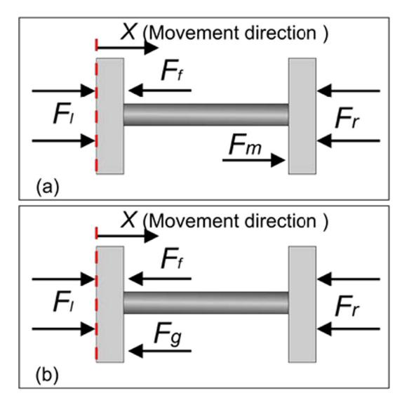

**Fig. 23** Free body diagram of FPELG (a) LEM is working as a motor in the motoring mode, and (b) LEM is working as a generator in the generating mode.

the piston in the same direction of the motoring force, i.e., from the left to the right side. The friction force between the piston assembly and cylinders, and the force of the gas pressure from the right chamber will be in the opposite direction. While Fig. 23 (b) shows the dynamic model of the FPELG when the LEM is switching to work as a generator in the generating mode. Assuming that the movement starts from the left to the right side, where the force generated by the combustion or the in-cylinder gas pressure in the left chamber will push the piston into the right side, while the generator force, friction force, and the force of gas pressure in the right chamber will be in opposite direction.

4.1.1.1. Linear piston motion control in motoring mode. In the motoring mode, an external force is required to move the piston between dead centers (TDC and BDC positions) from the stop state into the acceleration state to compress the air-fuel mixture in the cylinder. In this stage, pressure power is used to push the piston, which can be generated using a rebounding device. Here, different FPELG designs use different configurations, e.g., single-cylinder, dual-cylinder, and opposed-cylinder configurations. For a single-cylinder configuration, the appropriate velocity and compression ratio are obtained for each cycle using the rebound device and/or LEM. As shown in Fig. 24, a mechanical spring is utilized to push the piston into the TDC [38,110,111,159,160]. In the starting stage, during the piston's intake stroke, the mechanical spring is compressed, and elastic potential energy is partially stored. Then, elastic force is released to push the piston in the compression stroke. Fuel-burning occurs when the driving force is sufficient to compress the air-fuel mixture with enough compression ratio inside the combustion chamber. Other types of rebound devices, including hydraulic systems, gas springs, or LEM, mechanical similar to spring [40,100,111,119,160]. The function of the rebound device is to save energy and release it to build mechanical resonance movement for producing combustion conditions.

Jia et al. [9,10] built a closed-loop control strategy using the PID controller based on the mechanical resonance method.

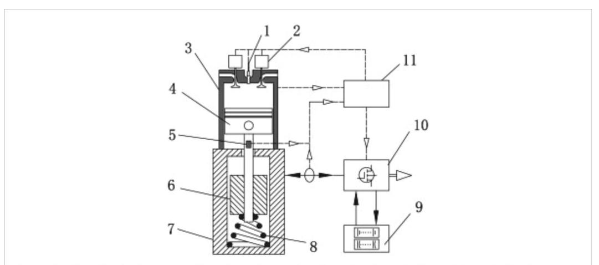

1. spark plug, 2. electromagnetic valves, 3. combustion chamber, 4. free-piston, 5. displacement sensors, 6. mover of linear generator, 7. stator of linear generator, 8. kickback device, 9. reversible electric energy storage device, 10. power converter, and 11. electronic control unit.

Fig. 24 Basic structure of the free piston engine linear generator (FPELG) [38]

They selected the piston position and velocity as feedback parameters to attain a compression ratio of 9:1 (Fig. 25). Yuan et al. [161] used the same starting method and found that the closed-loop controller has a more rapid response than the open-loop controller; however, the PID control parameters substantially impacts the current magnitude. Notably, if the piston is close to the TDC and BDC, the real current increases. Therefore, further investigation is required to address this issue.

In [162], the control strategy for the motoring mode of hydraulic FPE was presented, wherein the piston position feedback control technique based on compression pressure and reset valve frequency was used. In contrast, in [106,163], an injection control technique based on the piston position signal and the velocity signal was proposed. The results therein showed that the compression-ignition (CI) FPELG (in the starting process) attained higher performance by using the velocity strategy rather than the piston position strategy. In addition, an FPELG with an opposed cylinder design (Fig. 26 (a)) was developed [22] to maintain continuous movement of the piston in the motoring mode. Therein, a bounce chamber was used to obtain sufficient pressure force to push the piston back after feeding high-pressure gas into the bounce chamber. However, the LEM was not utilized during the motoring mode; thus, producing high gas pressure is essential to prevent friction, electromagnetic drag force, and gas pressure to reach the target compression ratio. Furthermore, the mechanical spring has been used as a rebound device [164]. In the opposed-cylinder FPELG (Fig. 26 (b)), the LEM was switching into motor during the motoring mode. This working concept is similar to the concept of a mechanical spring in a single-cylinder FPELG. However, piston synchronization for the opposed-cylinder FPELG requires further study.

4.1.1.2. Linear piston motion control in generating mode. After the motoring mode stage, the FPELG will switch to the generating mode stage. Note that the piston position between TDC and BDC must be controlled when attempting to obtain a fixed compression ratio. During this stage, the fuel is burned, com-

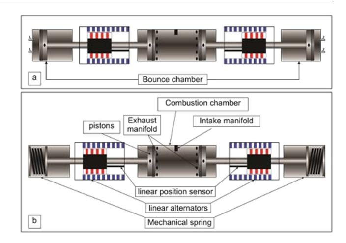

**Fig. 26** Opposed-piston free piston linear a) FPE with a bounce chamber b) FPE with a mechanical spring for the rebound device.

bustion occurs, and the output current is produced in this stage. Thus, the control parameters are affected by the combustion characteristics, which can be used to control piston motion. Ignition time, fuel mass, air-fuel ratio, and compression ratio are considered to be combustion parameters. However, the LEM is used to produce output power in the generating stage. Basic FPELG control (including the combustion cylinder, bounce chamber cylinder, and LEM) was investigated by Mickelsen and Roskilly [13,119]. They used control variables such as on/off time for bounce pressure valves, injection timing for fuel, and the amount of fuel. In another study, the dynamic performance of the TDC and compression ratio were improved using the predictive piston motion method (Fig. 27) [112]. Therein, piston velocity was considered an input value for the TDC estimator. Simulation results indicate that this control technique provided decent control performance for linear FPEs.

As shown in Fig. 28, three main control units exist in an linear FPE: supervisory control, PMC, and low-level control.

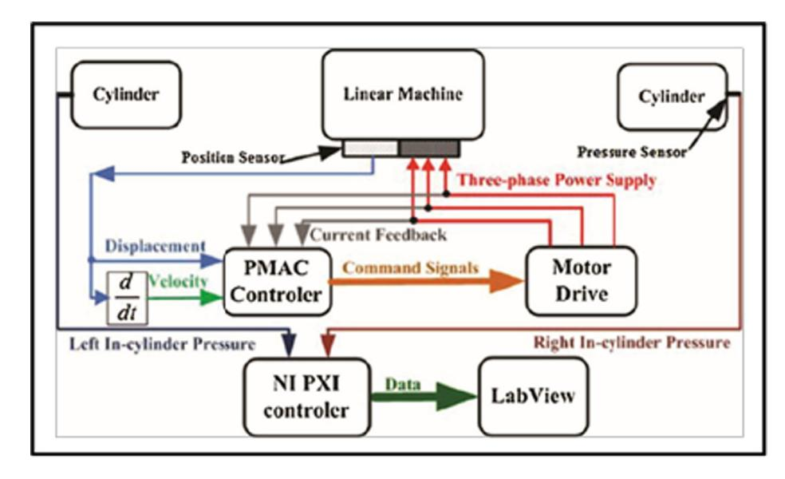

Fig. 25 Block diagram of the control system setup at Beijing Institute of Technology [9]

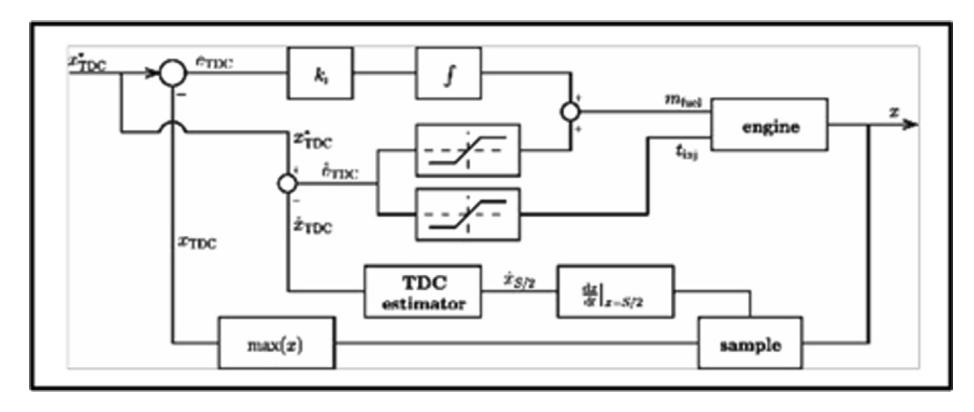

Fig. 27 Estimation and control system of the linear free piston engine [112]

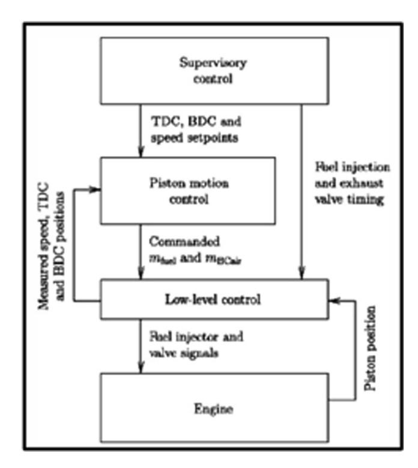

Fig. 28 linear FPE control structure [119]

Several studies have modified and implemented such a control framework in the logical structure of the multilayer control system to control free piston movement [38,102,108,119].

Jia et al. [37,61] designed the cascade control strategy to replace a previous simple control, as shown in Fig. 29. PID controllers were designed for both the inner and outer loops to measure the TDC of the previous cycle and piston velocity during the current cycle, and subsequently used in feedback values. This control strategy demonstrated good performance and faster response compared with a single-loop control strategy. Moreover, in [60], a fast-response numerical model was proposed using the proportional integral (PI) feedback controller design to investigate potential disturbances of FPELG. However, the error cannot be directly detected in the current cycle using these strategies; it was thus assumed that the load force from the LEM was disturbance, and the load coefficient was constant.

In [165], the control-oriented model was used to control piston movement at the TDC and BDC positions (peaks of piston position) as shown in Fig. 30. Moreover, the feedback control technique was used rather than the open-loop technique to improve stability in the track of a target piston position. The simulation results show that the accuracy of the piston turnaround position (during a load change) was  $\pm$  0.5 mm of the target. In [166], the neural control technique used to adjust piston motion, the results of which exhibited good PMC and a stable engine during simulation.

In [167], the efficiency of FPELG depends on its generation and thermal efficiency. Because the generation at the end of the expansion stroke is lower than that at the piston position during the expansion stroke, the simulation results show that the generation efficiency was improved to 97% using the PI control technique based on the generation signal at the edge of the expansion stroke. In [168,169], the control strategies for

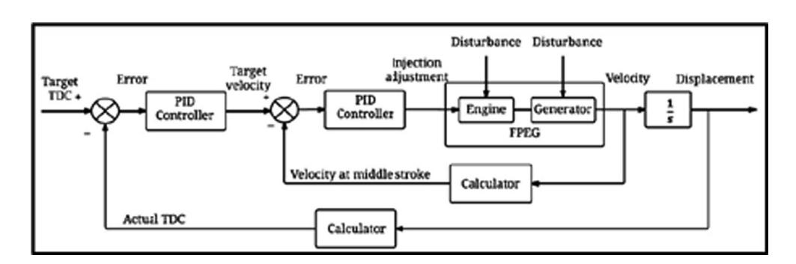

Fig. 29 Block diagram of an FPELG coupled with cascade control [37]

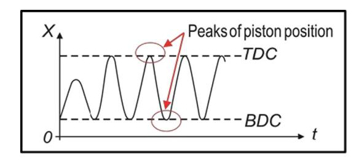

**Fig. 30** Peaks of piston position of the FPELG displacement—time profile.

both PMC and fuel injection of hydraulic FPE were investigated to attain good performance and operation for this engine. The closed-loop control technique was utilized based on fuel injection timing to make the BDC position steady, similar to that in [113,170–172]; however, they used the PID control technique. Their results show that the stability and performance of hydraulic FPE were improved by using the fuel injection control strategy. Moreover, the closed-loop control was used for electromagnetic valves in FPELG to study the influence of the intake and exhaust (opening time) on the operation characteristics [173]. For piston motion tracking, a feedback control technique based on stabilized dynamic inversion was modeled [174–176]. In contrast, in [39], the cascaded control structure was proposed based on the forwarded technique to adjust the FPELG's stroke trajectory.

In [177,178], the PID control technique based on the frequency to adjust the flow rate and pressure was studied and compared with similar control techniques that were based on the displacement of hydraulic FPE. Those simulation results show that various flow rates were produced in the same load pressure, indicating that the hydraulic FPEs are efficient and have flexibility based on these methods. In [179-182], the control of the HCCI on the combustion phasing was studied. A feedback controller technique based on varying the trajectories was implemented by the chemical reaction mechanisms control. Therein, good piston trajectory control was realized by adjusting the combustion phasing. Moreover, in [183], the PI and linear quadratic regulator (LQR) controller technique based on a piston position to produce a steady compression ratio were designed and described. The results showed that the FPELG worked with steady output power by using these two controllers. In contrast, in [184], the PID control technique based on the feedback of the compression ratio was simulated. In [185], the PID and pseudo derivative feedback (PDF) controls based on compression ratio were used to control the cycle-to-cycle variation and produce stable operation. Other researchers focused on feedforward and feedback control techniques based on in-cylinder pressure; these techniques were designed for compression ratio tracking of FPELG. The PI controller has been used for comparison purposes in a precise simulation model. The simulation results show that the combined controller has better performance [186]. Moreover, the feedforward control algorithm combined with a conventional feedback control algorithm was used for the hydraulic actuator driven to work under high frequencies [187]. To balance the output energy and engine stability, the feedback control technique based on fuel injection amount with changeable load was implemented. The results showed that the engine response will be obtained after at least three cycles [188]. In another study, the feedforward control technique was used to control piston movement between TDC and BDC [146]. The results show a satisfactory response for the proposed control. Here, various parameters, e.g., fuel mass and pressure in the bounce chamber, were used to control piston motion. However, if burning does not complete inside the combustion chamber, the engine will not be stable because the piston position and velocity vary in each cycle; thus, the dead center (TDC and BDC positions) error will increase. Therefore, control performance is limited by combustion fluctuations, and the combustion parameters require further study to develop a new control design that carefully considers combustion parameters.

#### 4.1.2. LEM control

The linear generator has many functions in a linear FPE, e.g., electricity generation, working as a rebound device, and piston frequency balance. When the engine starts running, the LEM is fed by the source current to push the piston between the TDC and BDC by switching the system into motoring mode. Passing certain frequencies, combustion will initiate, and electricity will be generated during the combustion process [9]. The crucial technical challenge in FPELG operation is attaining combustion speed in the initial process in less time and overcoming the compression force that enables combustion with stable and continuous operation [10]. Generator force limitation is a crucial issue in realizing commercial engines [52].

4.1.2.1. LEM in motoring mode. LEM during the motoring mode is employed as motoring to push the piston between the TDC and BDC of FPELG [1]. A novel single-cylinder FPELG design that used the LEM as a rebound device was proposed by Feng et al. [40]. In this stage, the current is fed into the LEM, inducing a magnetic field to produce mechanical force that pushes the piston between the dead centers (TDC and BDC positions). Fig. 31 illustrates this motor force [189].

Rectangular current commutation is a new approach designed by Zulkifi [189]. There are two main aspects in this new design: LEM control and using a strategy to achieve mechanical resonance. Therefore, the next cycle is assisted by absorbing compression energy during the current cycle and storing it for use in the next cycle to increase the pressure force in the combustion chamber to obtain the pressure required to initiate combustion. Fig. 32 shows the mechanical resonance for FPELG starting and spring mass representation [189]. Both simulation and experimental testing were implemented for FPELG based on the starting strategy. An open-loop con-

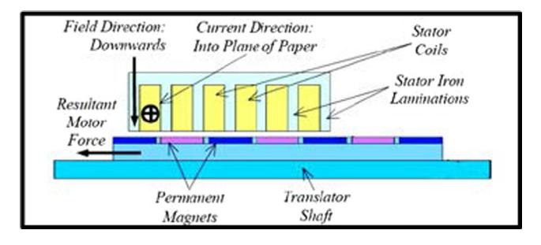

Fig. 31 Magnetic field interactions used to generate linear motoring force [189]

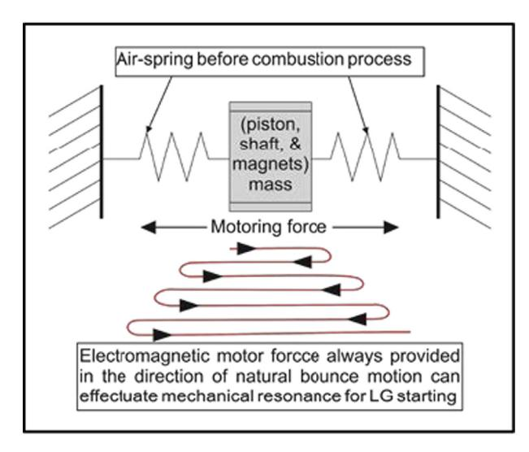

Fig. 32 Mechanical resonance for FPELG starting and spring mass representation.

trol technique for LEM was utilized to increase the small amplitudes of the initial current. During the resonating motion, the piston movement gradually built until it attained the required combustion force. The investigation shows that the open-loop control produced good steady-state operation [190]. However, using open-loop control, the compression ratio will not be high, and the compression energy will progressively increase [118,191].

Several studies have investigated the motoring mode stage using the piston position as a feedback value for FPELG with two cylinders [25,102,106,189]. The piston motion (under the motoring mode) based on the feedback control technique was studied by using both piston position tracking and velocity tracking as parameter signals [192]. Unfortunately, to reach the combustion stage, sufficient pressure force cannot be generated through a single cycle; however, after some cycles, the pressure force progressively increases. In contrast, the coil parameters and design affect the motor force. Additionally, when the compression ratio increases, more electromagnetic force is required. Therefore, a rebound device is required to assist LEM in this stage.

4.1.2.2. LEM in generating mode. During the generating mode, the LEM is utilized to control piston movement and output power. In addition, the combustion parameters are not used as control variables directly; rather, they are used to control the output energy. A recovery control strategy for a two-stroke FPELG was proposed by Sun et al. [193], as shown in Fig. 33. Therein, when a misfire occurs while the engine is running, the recovery process begins to switch the LEM into motoring mode and assists the piston to complete the current cycle. However, this control strategy requires time to recover from each misfire to return to stable operation, which can be achieved by switching the control between the generating and motoring modes. Thus, conducting an experimental test is necessary.

In [194] the novel linear generator control method was proposed. In general, the output current is proportional with piston velocity, in another hand, the velocity of the piston is about zero at the TDC and BDC positions, while the velocity

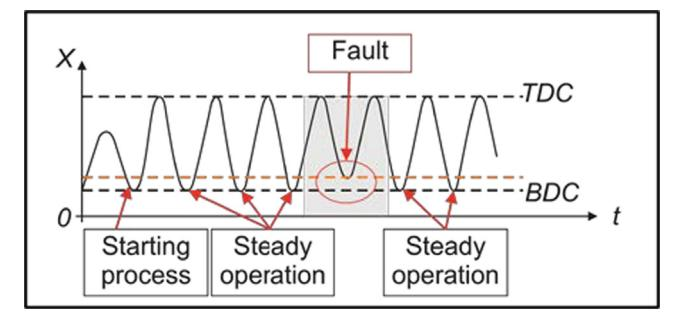

Fig. 33 Various operation states of FPELG including fault recovery.

of the piston at the middle of the stroke reaches a maximum. Thus, the control based on the speed commands for the linear generator was used to adjust the piston position at TDC and BDC. The one-dimensional model was developed to investigate this control. The simulation results showed that the control method was efficient and accurate. A certain transient period (Fig. 34) occurs during the continuous operation of FPELG to solve this issue wherein transient control was used and tested based on the virtual trajectory technique. The result showed that FPELG can work without a transient period after using transient control [181,182].

In a previous study [34], the control logic was developed using constant combustion parameters as shown in Fig. 35. Where the Kr is the load coefficient, which is proportional to the velocity. In addition, the feedback loops technique was used based on the piston position and velocity to adjust piston trajectory with predefined trajectory. This control logic can work under unsuccessful combustion conditions because the feedback loop has a function to adjust the TDC position, BDC position, and frequency by comparing the real value with the reference (predefined trajectory). Therein, the result curves were the same as the sinusoidal curves with good control precision for TDC position, BDC position, and piston motion. In addition, clearance control was used to prevent issues related to hitting the cylinder head. However, the operation behaviors were not satisfied if there was some variation in combustion parameters. A hierarchical hybrid control system for fourstroke-type free piston engines has been developed (Fig. 36) [38,193–195]. Therein, to control piston movement and generate current power, a moving coil linear generator (MCLM) was developed and fabricated. The MCLM demonstrates fas-

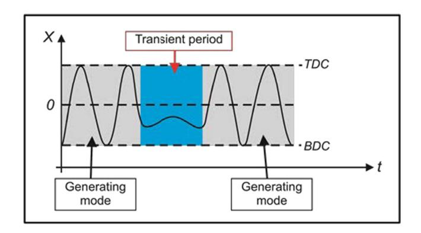

Fig. 34 Illustration of the transient period.

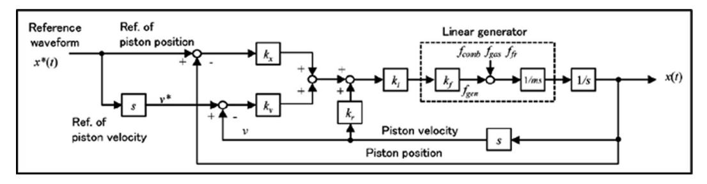

Fig. 35 Block diagram of the control logic [34].

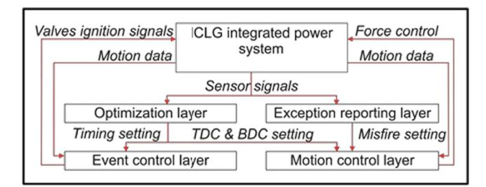

**Fig. 36** Control strategy of internal combustion linear generator (ICLG).

ter response, good control ability, and less moving mass compared with the existing design. However, the output power for two-stroke engines is higher than that of four-stroke engines.

The velocity curve against displacement can be clearly seen in Fig. 37, which shows there are four zones (Z1, Z2, Z3, and Z4). In general, the operation process shows that the piston velocity increases in each of Z1 and Z3 (the acceleration occurs), while the piston velocity decreases in each of Z2 and Z4 (the deceleration occurs). The output power improved when the average piston velocity (Fig. 37, profile-b) was increased. On the other hand, the current was produced by LEM during generator mode. Thus, the electromagnetic force tried to resist the piston acceleration as it worked in the opposite direction to piston acceleration. If the electromagnetic force is decreased in Z1 and Z3 and increased in Z2 and Z4 (with the same operating conditions), the average piston veloc-

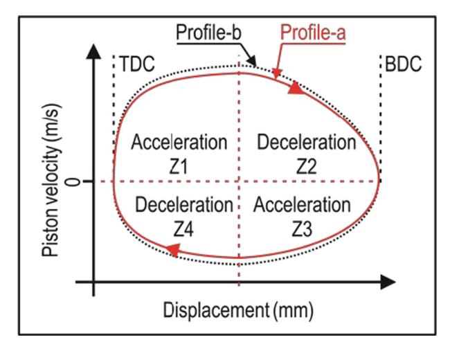

Fig. 37 Phase trajectory of FPELG.

ity will increase, and thus the same with the output power. In conclusion, this concept shows that the output power could be improved by using a controller to control the electromagnetic force.

Based on the above concept, the control strategy was fabricated [102,103] using the acceleration and deceleration characteristics of piston movement to control TDC and BDC. Therein, the electromagnetic force was used as a ladder-like control strategy reference. Simulation results demonstrated that this system could provide improved output power. A similar technique was used in [196], The nonlinear dynamic model was derived based on force and energy balance. The simulation and experiment data were used to verify the dynamic model. Using the PID control technique, the controller was designed by adjusting the electromagnetic force. The compression ratio (CR) variable was used for the stable operation control of FPELG after converting the real-time piston displacement feedback into real-time CR. Thus, the electromagnetic controller adjusts the load coefficient when there exists a difference between real-time CR and predefined CR. The results showed that the piston was adjusted at a predefined position in a fast response time.

To control piston motion, linear electric machine control is considered not only efficient but the best strategy. To adjust the target current, a PID control technique based on the pulse-width modulation (PWM) algorithm was used. The simulation results showed that the generating efficiency of the FPELG was 40.8% and the LEM conversion efficiency was 92% [197]. However, output power, LEM efficiency, and combustion efficiency are not directly related to piston motion; therefore, engine efficiency for these strategies may be suboptimal. In addition, LEM control will be affected by variable combustion parameters and output power.

#### 4.1.3. Switching control of linear FPE

4.1.3.1. Intermediate mode. When the FPELG starts to run in the motoring mode the piston moves between TDC and BDC, and the force created by this resonance gradually increases until it attains combustion force. After the motoring force attains combustion force, combustion begins and LEM switches to the generating mode. In summary, there are three stages including the motoring mode, switching process or intermediate mode, and generating mode to complete engine running [43]. In terms of the intermediate mode, studies have focused on the best time and piston position at which the FPELG can be switched from the motoring mode into the generating mode (Fig. 38) while maintaining a stable engine and high performance. The period in which the switching control strategy works is very short compared to the time taken in

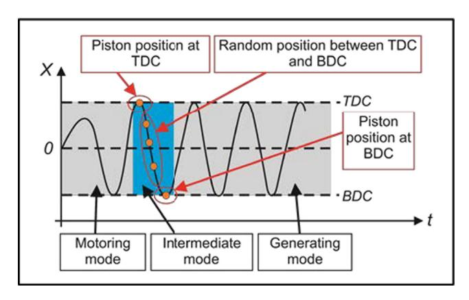

Fig. 38 Illustration of the intermediate mode and different piston positions (at TDC, BDC, and random position).

PMC and LEM control [23]. Different switching control strategies were tested and simulated for the intermediate mode. The intermediate control technique based on the switching position and response time was designed and built accordingly. FPELG performances before and after the switching control strategies occur were compared and analyzed [23,25]. The results show that the FPELG operated more stably and smoothly when the intermediate mode is used between the motoring and generating modes. Furthermore, researchers found that the switching position at the TDC or BDC was better compared with that at the random position between TDC and BDC, as shown in Fig. 38. However, most studies related to FPELG control focused on the motoring mode and generating mode, and only few studies have investigated the intermediate mode.

#### 4.1.4. Combined control strategy of linear FPE

The combined control strategy was designed based on the LEM and combustion parameters. Nonlinear control was studied by Gong et al., who proposed a strategy for FPELG with a dual-piston configuration and model predictive control (MPC) [107–109,198]. Based on energy equations, they designed control-oriented and nonlinear models. The main parameters used in that model are PMC and cylinder head clearance control. In addition, Newton's law was used to measure the TDC and BDC positions in the current stroke. Other parameters, including electrical load and fuel mass, were used as control variables (Fig. 39). Thus, this control strategy can be used to prevent cylinder head crashes and misfires. Simulation

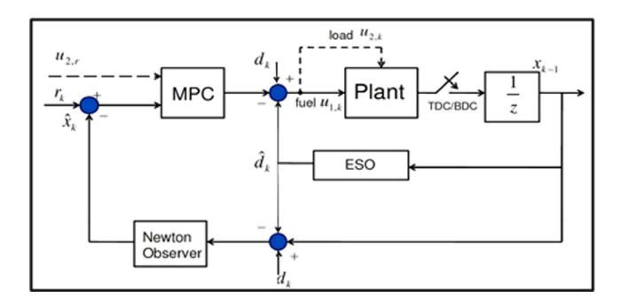

Fig. 39 Control scheme of model predictive control [108]

results demonstrated that good performance was achieved when tracking the TDC and BDC under different transient loads. However, this approach was only evaluated through simulation. Therefore, this approach is considered important for understanding the combined control strategy concept to produce new designs that include the LEM and combustion parameters of PMC [112].

A virtual crankshaft has been used in some studies as a reference trajectory to design the control strategy of the piston motion for the FPELG, as shown in Fig. 40 (a). In addition, depending on expansion and compression operations, the reference trajectory could be modified for different cycles (Fig. 40 (b)) [32,104,105,199–201], and, by adjusting the reference trajectory parameters, emissions can be reduced [32,133,202].

The PMC of the hydraulic FPE based on the predefined reference trajectory was proposed. The closed-loop control technique was used for both the motoring and generating modes to improve the startup running of the engine and decrease cycleto-cycle variations by following a predefined reference trajectory, respectively [203]. A similar technique was used in [66], including the ignition time control to produce the ignition signal at the right timing based on the piston position. While Graef et al. [204] proposed the control strategy including piston motion control. The time of valves and injector was controlled using this control strategy to determine the generator force. Besides, the optimization layer control and supervisor control were also designed, to control piston motion and thermodynamic. However, hardware development and investigation of FPLG performance are required. Furthermore, in [205], the PID algorithm was developed to control the FPELG current. Based on PWM, the target current of the system was adjusted for different prototype operation stages such as the misfire, starting process, and unstable operation. The control technique based on the piston turnaround position at TDC and BDC was designed. Hu et al. [206] studied the piston motion behavior by using the on-off control technique. In [207], the feedback control technique was used to adjust hydraulic FPE for the starting operation, generating operation, and misfire operation. Moreover, Ferrari and Friedrich [121] presented the FPELG methodology including three stages i.e. first the combustion chamber, linear generator, and gas spring were tested separately using a hydraulic actuator (HA), the second stage the three subsystems were tested on the rig of FPELG after combined with HA, and in the third stage, the FPELG was run in a fully autarkic mode after removed HA. The results showed that the engine was able to run in a quasi-autarkic operating mode. However, further development of a fully autarkic operating mode is required. Kock et al. [123] developed and studied the PI control technique based on LEM and combustion parameters to control the piston movement of FPELG. Wang et al. [208] studied the control technique based on the current value signal comes from LEM or from the coaxial magnetic grid to calculate the ignition position of the FPELG. Pang and Xia [209] designed the control unit of FPELG by using a hybrid control technique divided into a supervisory controller based on switching action and a continuous controller based on electromagnetic force. In [210], MATLAB/Simulink was used to test the control strategy based on the energy storage system model (ESS). The PID control technique based on some parameters such as power flow and dynamic model was used. The results showed good accuracy of this control strategy. Zang et al. [211] studied the com-

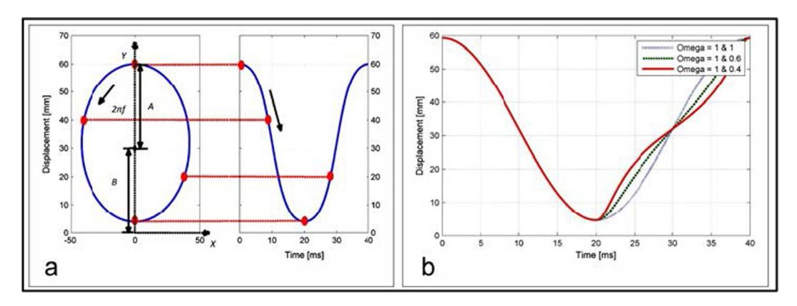

Fig. 40 (a) Piston motion description; (b) various piston trajectories with different omega values [32]

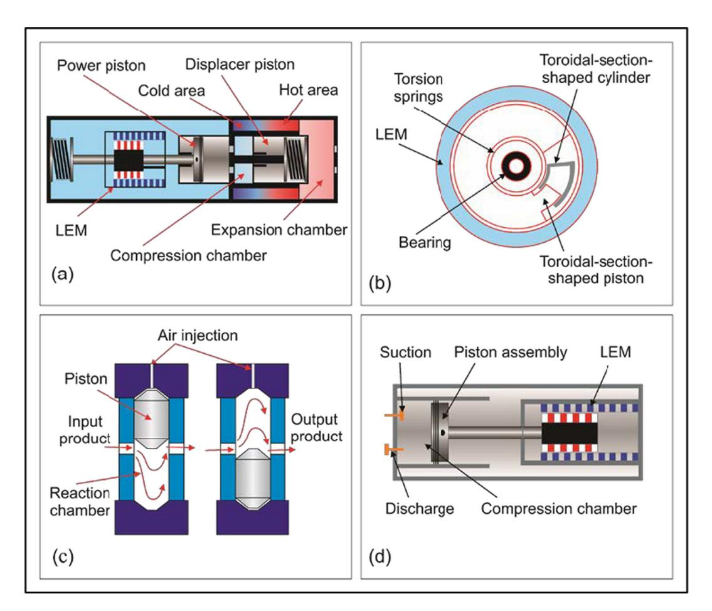

Fig. 41 Schematics of different FPE designs (some parts e.g., injectors, disc balancing arrangements, generator windings are not shown), (a) free-piston Stirling engine, (b) semi-free piston rotary generator, (c) totally free piston, and (d) free piston linear compressor.

bined control strategies for the motoring and generating processes based on the variable electromagnetic resistance of LEM. The results showed that the piston trajectory between TDC and BDC was stable and high combustion efficiency of different fuels could be achieved using this control strategy. Thus, the combination of LEM and combustion parameters as input variables in PMC design is deemed the best strategy. Consequently, various characteristics, including engine efficiency and thermal efficiency, could be high. Thus, the variable reference trajectory combines two performances the control of

combustion parameters and LEM output. This control structure is a promising PMC method for FPELG.

#### 4.2. Other types of FPE control

The other kinds of FPE are classified and identified to give a clear image of what the similarity and the advantages of control techniques between the FPE types. Moreover, useful guidance can be provided on improving FPEs according to how the control techniques of linear FPE can reflect in other FPE

types. Therefore, the FPEs can be classified into five groups. namely, FPSE, SFPRG, micro FPE, TFP as a pulsed compressor, and FPLC. all of which are considered the main other FPE types. Consequently, the operating principle and control techniques of these types of engines can be summarized as follows: the operating principle of the FPSE indicates that a specific amount of gas is trapped inside the engine. Where the heat is supplied to the trapped gas inside the engine from an external source, i.e., fuel-burning outside the cylinder. Thus, the FPSE is an external combustion engine rather than the internal combustion engine [212]. Fig. 41(a) shows the schematics diagram of the FPSE. In the previous studies, J. Zheng et al. [213] designed the FPSE model. The control strategy was proposed on the basis of the output voltage and by using a current feedback decoupling control. In addition, this control strategy was built according to the double closed-loop generation system. Thus, by using the proposed control strategy, the power system performance was improved. While P. Zheng et al. [214] put forward a control strategy based on the linear-generator system of FPSE. The control strategies for both starting and generating modes were investigated. Thus, in the first stage, the LEM works as a motor to drive the piston by using the battery. In the second stage, the control switches to change the LEM from motoring mode to generator mode when the engine reaches a certain frequency. Using a closed-loop control technique, the control strategy including the current loop, position loop, and velocity loop was studied. On the other hand, the genetic-fuzzy control was also applied to obtain a hybrid intelligent converter and stable FPSE operation. In order to achieve the optimum engine performance at the specific frequency, the open-loop control technique was employed. However, the optimal frequency is influenced by some parameters, e.g., power piston mass, spring stiffness, and temperatures. Thus, to solve this issue, an intelligent fuzzy control unit on the basis of a genetic algorithm was used to control the multi-parameters. The results showed that the advanced fuzzy controller was able to control the changes of the power piston mass by controlling the frequency of the operating system. Furthermore, the intelligent fuzzy control technique was efficient for obtaining stable FPSE operation [215]. While the PI control technique including an optimization algorithm coupled with a double closed-loop control strategy was applied to improve the system efficiency with the best power output and the stability of FPSE [216].

The SFPRG is considered one of the FPEs with unique features in the operating concept. The operating principle of the semi free-piston rotary generator is that the cylinder and toroidal segment piston rotating on another part which is the generator disks. Some torsion springs are used to connect these parts to create a system with a balanced mass-elastic capable of rotating. When combustion occurs, the resonant motion of the disks is produced as a result of the in-cylinder pressure [217]. Fig. 41(b) shows the schematics diagram of the SFPRG. However, for the control system, J. F. Dunne [217] designed and simulated the control strategy based on two parts. In the first part, the combustion gas pressure was assumed as a function of time when the engine started to run. Thus, torque control was produced on the basis of the stroke velocity feedback. In the second part, the control strategy was built according to the piston TDC position to improve the stability. Moreover, the fuel injection and in-cylinder pressure were considered as control strategy parameters. The results showed that the piston motion was more stable, and the piston TDC position error was under 1%. While T. Kigezi et al. [218] proposed a PI controller including a control-oriented engine model to improve the stability and energy balance of the SFPRG. A closed-loop control system in line with a maximum compression ratio coupled with the piston TDC position feedback was employed. The outcomes revealed that the stability of the engine operating was improved with a constant compression ratio by using this type of control.

The operation principle of a TFP impulse compression device is that the free piston quickly compresses the reactants. The reactants are heated and react because high compression occurs and fast process. The first side is used for injecting reactor products through the input port and the other side is used to remove products through the output port. During the piston moves between the specified positions at both device ends, the input and output processes occur. The schematics diagram of the totally free piston (TFP) is shown in Fig. 41(c). The difference of the TFP compared to other FPE are load on the piston is absent. While the FPE has some degree of control, thus, the piston velocity, operating frequency, and compression ratio in FPE are decreases when the load is increased. On the other hand, the TFP has a different design compared to FPE, such as tight tolerances for sealing, while the piston in the FPE has piston rings [219–221].

For the free piston driven by a linear motor or linear compressor (LC) as shown in Fig. 41(d), the dynamic concept is similar to that of linear FPE but some differences arise in the control strategy for this engine because the engine works without a combustion chamber. The linear motor control such as the control of the input current and voltage are considered the important parameters for improving the efficiency of this engine. on the other hand, the stability and output energy of this engine depends on the linear motor. The frequency also has a significant effect on the LC. Therefore, the control strategy such as high-frequency operations and changeable frequency operations optimize engine efficiency [222–225].

The linear micro FPE is another type of FPE. This FPE type has a similar operating principle to that of the linear FPE but on a small scale. The main challenges of this engine are the combustion reaction time and heat losses by flame quenching. Therefore, to solve this problem, the HCCI combustion of the FPE is expected to be the best solution. Thus, the control of the parameters such as ignition timing and compression ratio were considered the significant parameters that affect the combustion characteristics [11,226-229]. Some studies were focused on developing the modelling of the micro FPE according to combustion parameter control such as of the ignition timing and compression ratio. While the control strategy was built using the same FPE control strategies such as the Wiebe function, dynamic, thermodynamic, and PMC [227-229]. However, most of the FPEs used a similar concept of PMC; some have rotational piston movement, and others have linear FPE. Moreover, the control techniques such as PI, PID, and fuzzy logic that are used in these types of FPEs is almost similar to the control technique employed in the linear FPE.

#### 5. Statistical analysis and observations

In this section, the statistical analysis and corresponding observations including the findings and future direction of research

are presented. The statistical results, i.e., distribution based on article publication year, distribution based on operation parameters, and distribution based on control technique, are presented for the FPELG. The primary contribution of this study is an overall survey and taxonomy of works related to FPELG control. Thus, this study aims to present the latest updated studies of control strategies for the FPELG according to the year of publication. In addition, this study attempts to highlight the research trends in this field. The present review differs from previous reviews because we also propose a new literature taxonomy method for FPELG control, specifically focusing on techniques used in the FPELG controller. We found that several advantages are introduced by developing this taxonomy. First, publications are organized by classifying the published studies such as based on years, parameters, and techniques. New researchers studying FPELG controllers may be overwhelmed by the numerous related articles. The proposed taxonomy is expected to help researchers obtain a clear map of related work. In addition, this type of classification helps identify research trends. For example, the proposed taxonomy indicates that researchers are disposed to propose and develop PMC and LEM separately, but the combined control

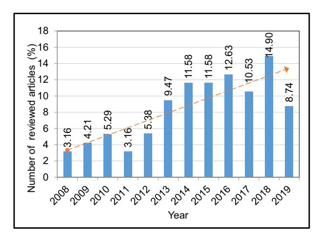

**Fig. 42** Percentage of reviewed articles relative to the publication years related to FPELG control studies.

strategy is a better strategy. With the proposed taxonomy, new researchers can easily find new study directions to develop. The proposed taxonomy can also reveal gaps in FPELG control research. In addition, it covers a wide range of FPELG control technologies and highlights the strengths and weaknesses of such technologies.

#### 5.1. Distribution based on publication years of articles

Fig. 42 shows the number of articles (in percentage) relative to the publication year that contributed to FPELG control research. During our literature review conducted from January 2008 to January 2020, we found numerous studies on FPE but very few articles focused on the PMC of the linear FPEs. Therefore, we explored and reviewed FPELG control articles to introduce points that researcher can focus on in the future.

As shown in Fig. 42, we found an increasing number of research papers on the control of different types of linear FPE. Note that the rate of research in 2011 was lower than that in 2010, and similar observations can be made when comparing data from 2017 with those of 2016. The overall percentage from January 2008 to January 2020 shows a tremendous increase. The control system of FPELG is considered an important part because there is no crankshaft to determine piston movement between the TDC and BDC. In addition, according to the literature, most researchers found control in the FPELG to be a significant challenge. Thus, control studies in FPELG can considered a hot research area that must be further studied.

#### 5.2. Distribution based on operation parameters

The literature reviewed in this study deal with articles related to the control of linear FPE over the last few years. According to this literature, we found 13 main operation parameters that affect engine performance and stability (Fig. 43). According to published articles, piston motion and tracking has the highest percentage compared to other parameters (33.3%). In addition, in FPELG, the engine does not have a crankshaft and the pistons move freely between the TDC and BDC; thus, most studies focused on piston motion and tracking. Although pis-

| Parameters                                               | Articles number (in percentage) |
|----------------------------------------------------------|---------------------------------|
| Piston motion and tracking                               | 33.30%                          |
| Electromagnetic force                                    | 8.70%                           |
| Mechanical resonance force - (spring , bounce pressure ) | 4.70%                           |
| Ignition time                                            | 4.70%                           |
| Injection (fuel mass and/or injection timing )           | 14.80%                          |
| Valve (open /close)                                      | 4.70%                           |
| Combustion                                               | 8.70%                           |
| Hydraulic                                                | 4.70%                           |
| Airflow                                                  | 1.60%                           |
| Multi-layer control system for multi- parameters         | 4.70%                           |
| Output power                                             | 4.70%                           |
| Switching mode (motor /generator )                       | 3.10%                           |
| Frictional force                                         | 1.60%                           |

Fig. 43 Number of articles (in percentage) relative to FPELG operating parameters.

ton motion is a challenge in such engines, there are many other parameters affecting piston motion in FPELG, e.g., injection time, amount of fuel injection, airflow, combustion characteristics, and ignition time.

Fig. 43 shows that the percentage of articles related to frictional force and airflow was 1.6% each. In addition, we found that the percentage of articles for the switching mode was 3.10%. Thus, further investigation in these areas is required to achieve high performance and stable engine operation. For the ignition time, mechanical resonance force, valve, hydraulic, output power, and multilayer control system was 4.7% each. In contrast, other studies focused on injection with fuel mass and/or injection time because this directly influences on combustion characteristics and in-cylinder pressure. The percentage of articles focusing on injection was 14.80%. Finally, the percentage of articles on combustion and electromagnetic force was 8.70% each. However, in summary, we found that many studies have investigated various FPELG control-related subjects. Unfortunately, this broad body of work has not solved all issues related to FPELG control. Thus, focusing on parameters that have been overlooked is necessary to improve the performance and stability of the FPELG and provide new knowledge.

#### 5.3. Distribution based on control technique

In this section, the statistics result of the control techniques are analyzed to provide a clear map and important information on control techniques. We found that the distribution by control technique results provide an indication for researchers about previous techniques used to solve issues and improve FPELG performance. In addition, these results highlight important and advanced techniques that can be used. Fig. 44 shows the percentage of articles about control techniques. We found different percentages of articles for each technique because researchers selected suitable techniques depending on the available equipment. In addition, most researchers (25.0%) used feedback control strategies to solve issues or improve FPELG performance. The second most used (21.4%) tech-

nique is the PID technique. In addition, the PI and PD have similar basic workings and some differences compared to PID, and they were ranked 8.0% and 1.2%, respectively. Other techniques, including the PDF and neural techniques, were ranked 1.780% each. However, the neural control technique is one of the most advanced techniques; thus, only 1.780% of articles is a very small percentage compared to other techniques. The open-loop control and inner loop techniques were ranked 4.40% each. The feedforward technique was represented in 8.9% of articles, the closed-loop control technique was 9.8%, the outer loop technique was 2.67%, switching control technique was 5.30%, and the digital signal processors (DSP) and fuzzy-logic techniques were 0.90% each. Finally, the hybrid control technique, which is considered one of the most advanced techniques, was represented in only 3.60% of articles. In addition, other advanced techniques were very few represented in the reviewed literature, e.g., the fuzzylogic and other techniques. In summary, the goal of this analysis to give an indication for researchers about advanced techniques that they can focus on with less literature to explore and new knowledge.

#### 5.4. Features of control techniques

According to the literature review performed in this study, performance and stability are the main existing challenges to FPELG research. Besides, given that FPELGs do not have a crankshaft, several technical issues involving the control of piston motion have been reported. Many researchers and developers have studied different control techniques to solve piston-motion issues. However, the optimal solutions to all these issues have yet to be obtained. The findings of this review (Fig. 44, and the comparison in Table 7), may help researchers find a suitable control technique and develop approaches to solve FPELG issues. Furthermore, can be concluded that the objectives of these techniques are to control one or more parameters influencing piston motion. In addition to producing an accurate signal with a fast response time to achieve the goal, i.e., stability and high performance of FPELGs.

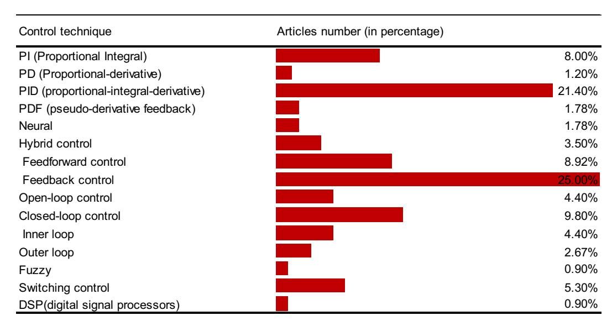

Fig. 44 Number of articles (in percentage) relative to FPELG control technique.

| Features                                | Open-loop | Closed-loop | PID      | ANN      | FLC      |
|-----------------------------------------|-----------|-------------|----------|----------|----------|
| Recovery rate speed of the disturbances | ▼         | •           | •        | <b>A</b> |          |
| Improvements with time (by training)    | ▼         | ▼           | ▼        | <b>A</b> | <b>A</b> |
| Structure simplicity                    | <b>A</b>  | <b>A</b>    | <b>A</b> | ▼        | ▼        |
| Accuracy                                | ▼         | •           | •        | <b>A</b> | <b>A</b> |
| Response time                           | •         | •           | •        | <b>A</b> | <b>A</b> |
| Nonlinear control                       | ▼         | ▼           | •        | <b>A</b> | <b>A</b> |

Thus, the features of different control techniques are discussed in this section to find control strategies that could achieve the objectives. As shown in Fig. 44, various techniques could be employed used to solve issues related to FPELGs. Some studies selected a single technique to solve FPELG-related problems. For example, T. Ahmed and O. Lim [230] tested exhaust emissions and performance by using three various algorithms of the artificial neural network (ANN) with experimental data. Results showed that the ANN technique is accurate and efficient enough to predict results. While D. N. Vu and O. Lim [231] used fuzzy logic control (FLC) technique to improve the dual-FPE performance. Experimental data were used to validate the simulation model. The results showed that the FLC technique is efficient in terms of fast response and is more accurate compared to PID. In addition, the results showed that the FLC is a powerful technique to decrease cycleto-cycle variations in order to improve the stability of FPELGs. On the other hand, the open-loop control technique has been used to solve issues related to LEM in motoring mode [118,189,190]. Whereas K. Zaseck et al. [175] also used the same technique i.e., open-loop control technique but to solve issues related to PMC in motoring mode. Thus, can be concluded from these studies, the specifications of the open-loop control technique are stable and easy to construct. However, because the feedback signal is absent, it hardly detects errors and is slower than ANN and FLC in terms of solving complex problems or big data processing. Another control technique, i.e., the closed-loop control technique was used to solve different issues of FPELG [1,66,169,173,203]. The closed-loop control technique takes feedback signals into account and features an error detector; thus, it is considered more accurate than the open-loop control technique. However, closed-loop control may become unstable, and the response time in complex systems is limited. Several authors have sought to solve LEMrelated issues by using the hybrid control technique [38,110,209,232]. While K. Moriya et al. [194] utilized the DSP control technique that related to solve LEM-related issues in generating mode. Other studies employed the switching control technique to solve such issues [25,193]. Whereas K. Li et al. [105] used the feed-forward control technique, which is similar to the open-loop control technique specifications that can use a multi-input system. Despite its benefits, however, the output results must be predicted because this type of technique does not include a feedback loop. Therefore, the feedforward control technique must be combined with other techniques to be able to solve issues such as the issues related to the combined control strategy and simultaneously offer stability and accuracy. Many authors prefer to use the feedback control technique to solve different issues related to FPELG [2,34,103,106,162,165,176,179,188,192,199,200,207]. The specifications of the feedback control technique are similar to those of the closed-loop control technique; thus, for any error that comes from the input signals are identified using feedback control based on the output signals to enable further adjustments. The PI and PD control techniques have also been used [167,183,233]. Consequently, the specifications of the PI and PD techniques can be summarized as basic control techniques and have easy structural specifications. Engine operation is more stable when the PD control technique is used because this technique combines feedforward and feedback signals. Because PI control is similar to feedback control, this method must be combined with D-control to obtain fast response times with good stability. Therefore, the PID control technique was used in several studies [102,170,171,178,184,210]. The PID specifications are considered similar to those of any basic control technology because it has a simple structure compared with those of advanced controllers. PID control could be used for nonlinear processes with a limited operating range but is rather efficient when used for linear processes. According to the literature review, the features of the PID controller have no generalization and must be returned for processing when setpoint changes. Thus, the technique a poor recovery rates compared to ANN that has a good generalization property with no return of process but only one training. ANN is characterized by fast recovery and adjusts rapidly with changes in inputs. Moreover, in contrast to PID control, in which the performance does not improve over time because its results depend on the output, while the performance of ANN improves over time after retraining.

All of the techniques described above could be applied to solve issues in different areas related to FPELG. This discussion clarifies some issues of the control technique implemented. We can therefore conclude that the issues of control techniques described in previous studies may be related to either the accuracy of the output signals or the response time. These factors could remarkably influence piston motion and, thus, affect the stability and performance of FPELGs. Therefore, presently, the attention of researchers to the use of advanced control techniques to solve FPELG problems is gradually increasing. In contrast, other studies have selected multiple techniques to solve control issues related to the piston motion of FPELGs. A strong benefit of targeting a multi-technique is that multiple issues can be solved, e.g., processing multiparameters or obtaining high accuracy with faster signals. In addition, some techniques process input values quickly, but other techniques provide high accuracy when solving complex

input values. However, during our review, we found not that means using multi-techniques better than using a single technique, vice versa.

#### 5.4.1. Control techniques comparison

The typical control technique of FPELG can be selected according to the main criteria such as response time, accuracy, complexity (ability to solve complicated problems). On the other hand, the application characteristics (system parameters) are one of the most important considerations used to select the control strategy for example some systems have one input while other systems have multi-input, and so on with respect to outputs. Thus, to find suitable control, one must understand the application behavior, needs, and the expected results from the control system in order to determine the required properties of the controller. The most important controller features, starting from the very basic controller such as total input/output (I/O) required, to the advanced specifications such as big data processing capabilities, thinking, artificial intelligence, and decision making. Therefore, based on the literature reviewed in this study especially the groups as classified in section 4.4, the control techniques comparison as used in an FPELG are as follow: the main techniques include the basic and advanced control techniques such as open-loop, closedloop, PID, ANN, and FLC, as listed in Table 7, for comparison. In general, the limitations of the basic control techniques including the overshoot and undershoots in the output, involve response time that is not fast enough, not 100% stable because the output slightly diverges, poor recovery rate, and reset is necessary when the load disturbances occur. Therefore, Presently, the researchers increased attention to use ANN, PID with the genetic algorithm, and FLC in many applications as it has properties such as very fast recovery, adjusts rapidly with changes in inputs, efficient in terms of fast response, efficient applicability with nonlinear systems, high accuracy, and powerful technique in terms of processing big data.

## 5.4.2. Impact of the linear FPE control techniques on other FPE types

The According to the operating principle of each FPE type, the impact of linear FPE control strategies on the other FPE types can be determined. To summarize, the dynamic concept of the FPLC and of the linear micro FPE are similar to that of the linear FPE [224,228]. Thus, the control strategies of the linear FPE could exert a good impact for improving these types of FPE. Moreover, some control strategies, such as the trajectory control strategy, can improve the linear micro FPE performance because the linear micro FPE has limitations in the combustion reaction and heat losses [32,133,183,202]. On the one hand, any piston motion control technique used in linear FPE such as PID and PI or the advanced control techniques such as fuzzy logic, PID with the genetic algorithm, and hybrid control could have a satisfactory impact on improving piston motion for both FPEs types [61,112,166,234]. Thus, the stability and performance of the linear compressor and linear micro FPE could be enhanced by using linear FPE control techniques.

The operating principle of the SFPRG is quite different from that of the linear FPE. However, the concept of the combustion process is similar for any internal combustion engine. Thus, the control strategies used in linear FPE related to the combustion process (such as the Wiebe function, heat transfer, and thermodynamic strategy) could be effective for the SFPRG. For example, the advanced control-oriented models based on piston trajectories could improve engine efficiency [32,183,201,202]. In addition, the dynamic control strategies of linear FPE could also be used after modification to fit well with SFPRG. Finally, the operating principle of the FPSE is also quite relative to that of the linear FPE, and one of their differences is the FPSE external combustion engine. Nevertheless, some similarity arises in the dynamic process between the FPSE and linear FPE. Consequently, some control strategies, e.g., a hybrid control strategy, used in FPELG could improve the piston motion of the FPSE [110,209].

#### 5.5. Recommendations

The PMC control challenges were considered the significant challenges for FPELG to become a highly efficient commercial engine [13]. However, the improvement of the FPELG performance and stability is possible by developing control strategies and using suitable control techniques. Moreover, the enhancement of the FPELG compression ratio is also possible by improving the cylinder head and piston design. Optimization of the FPELG parameters is also possible for advancing engine performance and emission reduction by controlling parameters including changing the engine speed, load and input parameters such as ignition timing and injection timing. Additionally, a control strategy that works for different fuel types, particularly low emission fuels (e.g., biofuel and hydrogen) for achieving a multi-fuel engine is recommended [11,38,169]. Considering a multi-zone model is necessary for decreasing the inhomogeneity combustion inside the cylinder. Thus, future esearch must cover modern control techniques such as the advanced control-oriented models based on piston trajectories to achieve optimization in terms of best engine efficiency and minimum emission production [133,179,200,201]. On the other hand, the proposed hierarchical hybrid control strategy is applicable for other FPELG types, e.g., the. hydraulic FPE and two-stroke FPE; moreover, the strategy is efficient to use for the dynamic of the model of FPELG [110,209]. The neural adaptive PID decoupling control system is an efficient approach for controlling the piston motion, in addition, the combination between intelligent algorithms such as fuzzy logic, neural network, or basic PID with the genetic algorithm is recommended for improving piston motion control [166,234]. In order to achieve a more stable engine operation during the intermediate mode, the switching control strategy was recommended [23,25]. While a fast-response numerical model design based on the PID feedback control technique has significant influence for decreasing the disturbances and must be considered in a new FPE control system [60]. In addition, the possible reason for the cycle-to-cycle variation in several parameters e.g., ignition, injection timing, and air/fuel mixture; thus, the implementation of control for these parameters is recommended to improve engine stability [43,112,191]. On the basis of fuzzy control, these parameters are possible for efficient controlling [112]. Moreover, a fault recovery control strategy based on the switching technique is recommended when any misfire occurs during the engine running [193,199]. Finally, the implementation of a hierarchical control strategy is recommended on the electromagnetic force of the LEM to further enhance the power output [232].

#### 5.6. Future direction of research

The analysis and review indicate that the control system in the FPELG is the main unit with a significant effect on the stability and performance of FPELGs. In this section, we focus on addressing the main challenges and the most critical issues of FPELGs. A new direction is also proposed. PMC is considered to be the main challenge in using FPELGs because of the absence of a crankshaft in the engine. The PMC issue can be addressed by classifying it into three aspects: the PMC issue related to the starting operation of FPELG, the PMC issue related to the intermediate stage, and the PMC issue related to stabile operation

For the FPELG's starting operation, many researchers have attempted to solve the issue. The various works can be summarized as follows. An essential technical challenge in FPELG operation is knowing how piston speed can attain a value required for the combustion processes to overcome the compression force issue at a short time, thus ensuring a stable combustion with continuous operation [10]. Researchers have attempted to resolve this issue by using different control strategies, such as rectangular current commutation and the mechanical resonating strategy [118]. However, the initial force increases gradually and takes time to reach the combustion force (i.e., the combustion occurs only after a few cycles). Thus, a new strategy for ensuring a short time for the starting stage is required. In addition, a robust control technique for ensuring a fast-response control at the starting stage is required.

Another challenge is related to the intermediate stage. Researchers found that engines may stop running while switching the LEM from the motoring mode to the generation mode. A control strategy was considered to be sufficient in this case, and a switching control technique was proposed to solve the issue of the intermediate stage. However, the following issues of the intermediate control strategy still need to be addressed: (1) the switching position problem and (2) the low response time of the control, which is affected by the extremely short duration time of the intermediate stage [23,25].

As for the stable operation of FPELGs, several studies [13,34,35] have developed a control strategy to solve the control complexity of the FPELG. However, they found that the controlling of the piston movement between BDC and TDC is a critical challenge when handling linear FPEs because free piston motion has no mechanical limit. The free-piston movement may cause the following problems: (1) hitting the head of the cylinder, (2) low operation stability of the engine and cycleto-cycle variations, and (3) low engine performance. An electronic control system can help to prevent pistons from hitting the head of the cylinder [13]. Several researchers have attempted to solve this issue. Robinson and Clark [14] found that installing a damping device in the cylinder can prevent the aforementioned action, while Mikalsen et al. [112] found that a control strategy can prevent cylinder head crashes. Particularly for the control strategies, some researchers found that the trajectory tracking control, predefining the reference trajectory based on the current profile, and balancing the energy flow by adjusting the parameters of combustion and load factor can help to solve the PMC challenge, e.g., hitting the cylinder head, inconsistent cycle-to-cycle variation, and low engine performance [7,13,32,34,52,62,104-111,204]. Other researchers studied the effects of piston displacement, TDC position, BDC position, and velocity on some parameters such as input/output energy conversion [102,103]. Some other parameters were identified and studied by researchers, from these parameters such as the intake temperature, ignition timing delay, equivalence ratio, air gap length, engine load, electrical resistance, intake pressure, and input energy. All these parameters (i.e., FPELG parameters) also influence on piston motion [4,15– 17]. In addition, combustion duration and ignition position were defined as parameters that can affect piston motion because they cause combustion fluctuation [18]. Other researchers found by adjusting some parameters, such as injection position, and injection rate, can help to solve the PMCrelated issue [19,20]. In summary, certain parameters can be considered for adopting a suitable and robust control strategy with good response time to solve some issues related to PMC.

Misfiring is also one of the most critical issues in FPELG because of the freely oscillating piston between TDC and BDC, unlike that in conventional engines in which flywheels can organize the continuous movement of an engine during misfiring [100]. To overcome this issue in FPELG some researchers found a good control system with high response time can be adopted [204]. Many researchers found that the control system of FPELGs can significantly affect engine stability and performance. The proper handling of certain parameters via different control strategies and techniques may help to solve the PMC concern. In summary, energy accumulation covering several cycles is considered to be the main method for handling the PMC in the starting operation of FPELGs. For the intermediate stage of FPELG, the switching strategy can be adopted as the main method. Findings indicate that the gradual switching technique is better than the immediateswitching technique for the switching strategy. Meanwhile, for the stable operation of FPELG, the proper handling of piston trajectory and motor force can be utilized as the control strategy. In conclusion, the FPELG challenges are mainly related to the starting processes, PMC, and cycle-to-cycle variations, as certain conditions lead to poor volumetric efficiency, low precise load control, misfire, and improper fuel mixture [28,29]. However, according to this analysis and review, we found that very few studies are related to the advanced techniques, e.g., hybrid control techniques, neural techniques, and fuzzy logic techniques as shown in Fig. 44. Furthermore, we found that control for each parameter in FPELG is very important for the piston motion to achieve high performance and stability in commercial engines [11,21,27,38,100,101,169]. Besides, some control techniques e.g., fuzzy logic, hybrid control strategy, and ANN was recommended to control of some operating parameters such as ignition timing, injection timing, and air/fuel mixture of FPELG [110,112,209]. We conclude that according to the distribution by parameters the ignition timing, injection duration or valve (open/close), and injection position as parameters in FPELG were not controlled based on such advanced techniques (FLC and ANN). While these parameters most important for the PMC to achieve high performance and stability of the FPELG [2,24,112,168,235]. Therefore, the fuzzy logic controller technique based on the optimum input parameters (ignition timing, injection duration, and injection position) to control piston motion can be identified as a new research direction to enhance the stability and performance of FPELG. Moreover, the optimization study of the operating parameters (ignition timing, injection timing,

and injection duration) of FPELG using ANN for performance (such as IMEP, in-cylinder pressure, power, thermal efficiency, mechanical efficiency, heat release, combustion efficiency) is required to determine the optimum input parameters values, that, which will be the focus of our study. In addition, further study is also required for advanced control techniques of other FPELG parameters that influence on PMC.

For the wear and friction losses of FPELG, the tribotronic system is suitable and regarded to be an effective technique for decreasing losses, such as wear and friction. However, tribotronic systems are still not completely efficient, and more development by tribologists and electronic/software engineers is required. More advanced mathematical models based on decision making are also needed for the tribomechanical systems. Furthermore, response time is another important parameter that is required in tribological systems, and hardware development (i.e. an electronic control system or a tribomechanical system) is necessary. Combining all of these aspects (actuators, sensors and models) in actual tribotronic systems can help to improve the efficiency of machines. FPELGs have less total friction losses compared with CSEs. However, the studies focusing on tribotronic systems, especially for FPELGs, are rare. The tribotronic system technique used for CSEs are known to improve machine performance and decrease losses (wear and friction), and it can be adopted in FPELGs to achieve the same purpose. Therefore, the tribotronic system is another new research direction for decreasing wear and friction losses, consequently enhancing the performance of FPELGs. Finally, according to the four main control groups (i.e., PMC, LEM, SC, and combined control strategies), we reviewed control techniques in FPELG, and we identified some limitations, which are summarized as follows.

- 1. In the first group, some control techniques were used to solve FPELG issues related to PMC. However, it is difficult to control the pressure inside the bounce chamber and the pressure inside the combustion chamber during the starting operation. This leads to difficulty in control piston motion to achieve stable operations. In addition, they noted fluctuations and misfires during generating mode.
- 2. In the second group, it is easy to realize stable operation using control techniques that are related to LEM. However, there is limited force to push piston between the TDC and BDC. In addition, combustion performance has been predetermined because the trajectory is predefined.
- 3. In In the third group, the best time and piston position at which the FPELG can be switched from the motoring mode into the generating mod was considered the important parameters in order to maintain a stable engine and high performance. However, only a few studies have investigated the SC strategies in the intermediate mode. The intermediate mode further requires tests and investigation. This will involve using different control techniques to find a suitable SC with high performance that can lead to high stability and performance of FPELG.
- 4. In the last group, we found that combined control strategies can be used to achieve high-frequency motion. However, some combustion parameters, e.g., air—fuel ratio, were not studied extensively and require more in-depth investigation using advanced techniques. Therefore, the combination of combustion control and active LEM control is an attractive

area relative to satisfying the control requirements of high-frequency reciprocating motion and precise compression ratio

#### 6. Conclusion

FPELG is considered a new energy convertor or hybrid engine that combines a combustion engine and electric machine in a single engine with high efficiency. Therefore, many studies have investigated FPELGs in recent years, especially linear PMC because this is considered a crucial technical challenge to achieve high performance and stable operation. Therefore, in this review, different FPELG control techniques have been reviewed and summarized comprehensively. In addition, a new taxonomy method was proposed to review FPELG studies. This new taxonomy method and survey provide an easy approach to understand the literature map related to FPELG control. This literature has been classified based on two main groups of FPE control, i.e., the linear-FPE control and others-FPE control. The linear FPE control sub-divided into four groups of control strategies, i.e., PMC, LEM control, SC, and combined control. While others-FPE control is classified into five groups, namely, namely, FPSE, SFPRG, micro FPE, TFP as a pulsed compressor, and FPLC. The linear-FPE control strategy limitations of the previous studies were summarized.

The statistical analysis and observations indicate an increasing number of studies on FPELG control. We found that the distribution based on operation parameters of FPELG, e.g., ignition timing, injection duration, injection position, output power, and friction force, are limited in the literature; thus, further investigation is required in this area. We also found that many researchers and developers have conducted studies on different controller techniques to solve issues related to PMC of FPELGs. However, very few studies have examined advanced techniques, e.g., fuzzy logic, neural network, and PID with the genetic algorithm to achieve high performance and stable operation of FPELG. Therefore, a new significant research direction that related to PMC of FPELG was identified. Moreover, based on this study, researchers can easily select a suitable technique to solve various PMC issues of FPELG. Finally, this review has summarized the operation parameters and techniques presented in related literature, thereby introducing a useful reference for researchers.

#### 7. Contribution of study

The main contribution of this study is that a survey and review of studies related to the free piston engine control strategies with a comprehensive summary of these studies were carried out. A new taxonomy method was proposed, and the limitations of the previous studies were summarized, which has a positive effect to explore a new research direction that relates to PMC of FPELG. This study direction is considered the key to optimizing the performance of an FPELG.

#### **Declaration of Competing Interest**

The authors declare that they have no known competing financial interests or personal relationships that could have appeared to influence the work reported in this paper.

#### Acknowledgments

The authors gratefully acknowledge the support of this work by the Centre for Automobile and Electric Mobility (CAREM), Universiti Teknologi PETRONAS, 32610 Seri Iskandar, Perak, Malaysia Perak, Malaysia.

#### Compliance with ethical standards

All procedures performed in studies involving human participants were in accordance with the ethical standards of the institutional and/or national research committee and with the 1964 Helsinki declaration and its later amendments or comparable ethical standards.

#### Informed consent

Informed consent was obtained from all individual participants included in the study.

#### **Funding**

This work was supported by the Petroleum Research Fund (PRF) Grant (grant numbers 0153AB-A34); Centre for Automobile and Electric Mobility (CAREM), Universiti Teknologi PETRONAS.

#### References

- [1] K. Martin, J. Bernhard, A. Dirk, B. Joachim, P. Heinz, A. Thivaharan, Nonlinear Model Predictive Control for the Starting Process of a Free-Piston Linear Generator, International Federation of Automatic Control 51 (2018) 8.
- [2] Y. Wang, L. Chen, B. Jia, A.P. Roskilly, Experimental study of the operation characteristics of an air-driven free-piston linear expander, Appl. Energy 195 (2017) 93–99, https://doi.org/ 10.1016/j.apenergy.2017.03.032.
- [3] Sergei Gusev, Davide Ziviani, and Michel De Paepe, "Model predictive control of a free piston compressor/expander with an integrated linear motor/alternator," presented at the International Conference on Compressors and their Systems 2019, 2019, 11.
- [4] N.B. Hung, O.T. Lim, A study of a two-stroke free piston linear engine using numerical analysis, J. Mech. Sci. Technol. 28 (4) (2014) 1545–1557, https://doi.org/10.1007/s12206-014-0141-3.
- [5] N.B. Hung, S. Jaewon, O. Lim, A Study of the Scavenging Process in a Two-stroke Free Piston Linear Engine using CFD, Energy Procedia 142 (2017) 1353–1360.
- [6] R.P. Pescara, Motor compressor apparatus (1928).
- [7] X. Zhaoping, C. Siqin, Improved Moving Coil Electric Machine for Internal Combustion Linear Generator, IEEE Trans. Energy Convers. 25 (2) (2010) 281–286, https://doi.org/ 10.1109/tec.2009.2038368.
- [8] H. Ding, X. Yu, J. Li, Permanent Magnetic Model Design and Characteristic Analysis of the Short-stroke Free Piston Alternator, SAE Int. J. Fuels Lubr. 5 (3) (2012) 1004–1009, https://doi.org/10.4271/2012-01-1610.
- [9] B. Jia, Z. Zuo, H. Feng, G. Tian, A. Smallbone, A.P. Roskilly, Effect of closed-loop controlled resonance based mechanism to start free piston engine generator: Simulation and test results, Appl. Energy 164 (2016) 532–539, https://doi.org/10.1016/j. apenergy.2015.11.105.

- [10] B. Jia, Z. Zuo, H. Feng, G. Tian, A.P. Roskilly, Investigation of the Starting Process of Free-piston Engine Generator by Mechanical Resonance, Energy Procedia 61 (2014) 572–577, https://doi.org/10.1016/j.egypro.2014.11.1173.
- [11] R. Mikalsen, A.P. Roskilly, The design and simulation of a two-stroke free-piston compression ignition engine for electrical power generation, Appl. Therm. Eng. 28 (5–6) (2008) 589–600, https://doi.org/10.1016/j.applthermaleng.2007.04.009.
- [12] H. Nguyen Ba, O. Lim, N. Iida, Simulation Study of SI-HCCI Transition in a Two-Stroke Free Piston Engine Fuelled with Propane, presented at the SAE Technical Paper Series, 2014.
- [13] R. Mikalsen, A.P. Roskilly, The control of a free-piston engine generator. Part 2: Engine dynamics and piston motion control, Appl. Energy 87 (4) (2010) 1281–1287, https://doi.org/10.1016/ j.apenergy.2009.06.035.
- [14] M.C. Robinson, N. Clark, Fundamental Analysis of Spring-Varied, Free Piston, Otto Engine Device, SAE Int. J. Engines 7 (1) (2014) 195–220, https://doi.org/10.4271/2014-01-1099.
- [15] O. Lim, N.B. Hung, N. Iida, A Power Generation Study of a Power Pack Based on Operating Parameters of the Linear Engine Fuelled with Propane, Energy Procedia 61 (2014) 1581– 1584, https://doi.org/10.1016/j.egypro.2014.12.176.
- [16] O. Lim, N.B. Hung, S. Oh, G. Kim, H. Song, N. Iida, A study of operating parameters on the linear spark ignition engine, Appl. Energy 160 (2015) 746–760, https://doi.org/10.1016/j. apenergy.2015.08.035.
- [17] N.B. Hung, O. Lim, N. Iida, The effects of key parameters on the transition from SI combustion to HCCI combustion in a two-stroke free piston linear engine, Appl. Energy 137 (2015) 385–401, https://doi.org/10.1016/j.apenergy.2014.10.001.
- [18] C. Yuan, Y. Jing, Y. He, Coupled dynamic effect of combustion variation on gas exchange stability of a free piston linear engine, Appl. Therm. Eng. 173 (2020), https://doi. org/10.1016/j.applthermaleng.2020.115201.
- [19] C. Han, C. Yuan, Y. He, and Y. Liu, "Effect of fuel injection rate shapes on mixture formation and combustion characteristic in a free-piston diesel engine generator," Adv. Mech. Eng. vol. 10, no. 5, 2018, doi: 10.1177/ 1687814018775242.
- [20] C. Yuan, J. Li, L. He, Y. He, Effect of injection position on fuel spray and mixture preparation of a free-piston linear engine generator, Proc. Inst. Mech. Eng. Part A J. Power Energy 234 (8) (2020) 1161–1174, https://doi.org/10.1177/ 0957650919900101.
- [21] C. Guo, Z. Zuo, H. Feng, B. Jia, T. Roskilly, Review of recent advances of free-piston internal combustion engine linear generator, Appl. Energy 269 (2020), https://doi.org/10.1016/j. apenergy.2020.115084.
- [22] T.A. Johnson, M.T. Leick, R.W. Moses, "Experimental Evaluation of a Prototype Free Piston Engine - Linear Alternator (FPLA), System," presented at the SAE Technical Paper Series, 2016.
- [23] C. Guo, H. Feng, B. Jia, Z. Zuo, Y. Guo, T. Roskilly, Research on the operation characteristics of a free-piston linear generator: Numerical model and experimental results, Energy Convers. Manage. 131 (2017) 32–43, https://doi.org/10.1016/j. enconman.2016.11.010.
- [24] A. T. Raheem, A. R. A. Aziz, S. A. Zulkifli, W. B. Ayandotun, E. Z. Zainal, and S. M. Elfakki, "Experimental Analysis for the Influence of Ignition Time on Combustion Characteristics of a Free Piston Engine Linear Generator," in *Journal of Physics: Conference Series*, 2021, vol. 1793, no. 1: IOP Publishing, p. 012051.
- [25] H. Feng, C. Guo, B. Jia, Z. Zuo, Y. Guo, T. Roskilly, Research on the intermediate process of a free-piston linear generator from cold start-up to stable operation: Numerical model and

- experimental results, Energy Convers. Manage. 122 (2016) 153–164, https://doi.org/10.1016/j.enconman.2016.05.068.
- [26] H. Feng et al, Research on combustion process of a free piston diesel linear generator, Appl. Energy 161 (2016) 395–403, https://doi.org/10.1016/j.apenergy.2015.10.069.
- [27] N.B. Hung, O. Lim, A review of free-piston linear engines, Appl. Energy 178 (2016) 78–97, https://doi.org/10.1016/j. apenergy.2016.06.038.
- [28] V. Raide, R. Ilves, A. Küüt, K. Küüt, J. Olt, Existing state of art of free-piston engines, Agronomy Res. 15 (S1) (2017) 1204– 1222
- [29] S. Rathore, S. Mishra, and M. Paswan, "A Review on Design and Development of Free Piston Linear Generators in Hybrid Vehicles," in *IOP Conference Series: Materials Science and Engineering*, 2019, vol. 691, no. 1: IOP Publishing, p. 012053.
- [30] A. Warade, M. Dhawade, Comparison between free piston and conventional internal combustion engine: A REVIEW, International Journal on Recent and Innovation Trends in Computing and Communication 4 (4) (2016) 3.
- [31] S.S. Goldsborough, P. Van Blarigan, A numerical study of a free piston IC engine operating on homogeneous charge compression ignition combustion, SAE Trans. (1999) 959–972.
- [32] C. Zhang, Z. Sun, Using variable piston trajectory to reduce engine-out emissions, Appl. Energy 170 (2016) 403–414, https://doi.org/10.1016/j.apenergy.2016.02.104.
- [33] P. Van Blarigan, N. Paradiso, and S. Goldsborough, "Homogeneous charge compression ignition with a free piston: A new approach to ideal Otto cycle performance," SAE Technical Paper, 0148-7191, 1998.
- [34] S. Goto et al, Development of Free Piston Engine Linear Generator System Part 2 - Investigation of Control System for Generator, presented at the SAE Technical Paper Series, 2014.
- [35] A.A. Ibrahim, A.R. AbdulAziz, A.E.Z.B. Zainal, S.A. Zulkifli, The Operation of Free Piston Linear Generator Engine Using MOSFET and IGBT Drivers, J. Appl. Sci. 11 (10) (2011) 1791– 1796, https://doi.org/10.3923/jas.2011.1791.1796.
- [36] B. Jia, A. Smallbone, Z. Zuo, H. Feng, A.P. Roskilly, Design and simulation of a two-or four-stroke free-piston engine generator for range extender applications, Energy Convers. Manage. 111 (2016) 289–298.
- [37] B. Jia, R. Mikalsen, A. Smallbone, Z. Zuo, H. Feng, A.P. Roskilly, Piston motion control of a free-piston engine generator: A new approach using cascade control, Appl. Energy 179 (2016) 1166–1175, https://doi.org/10.1016/j.apenergy.2016.07.081.
- [38] Z. Xu, S. Chang, Prototype testing and analysis of a novel internal combustion linear generator integrated power system, Appl. Energy 87 (4) (2010) 1342–1348, https://doi.org/10.1016/ j.apenergy.2009.08.027.
- [39] Andreas Gerlach, Hermann Rottengruber, and Roberto Leidhold, "Control of a directly driven four-stroke free piston engine," *IEEE*, p. 6, 2018
- [40] H. Feng, Y. Song, Z. Zuo, J. Shang, Y. Wang, and A. Roskilly, "Stable Operation and Electricity Generating Characteristics of a Single-Cylinder Free Piston Engine Linear Generator: Simulation and Experiments," *Energies*, vol. 8, no. 2, pp. 765-785, 2015, doi: 10.3390/en8020765.
- [41] W.B. Ayandotun et al, Investigation on the combustion and performance characteristics of a DI free piston linear generator engine fuelled with CNG-CO2 blend, Appl. Therm. Eng. 198 (2021), https://doi.org/10.1016/j.applthermaleng.2021.117441.
- [42] Y. Oh, O. Lim, G. Kim, N. Iida, A Study for Generating Power on Operating Parameters of Powerpack Utilizing Linear Engine, presented at the SAE Technical Paper Series, 2012.
- [43] B. Jia, G. Tian, H. Feng, Z. Zuo, A.P. Roskilly, An experimental investigation into the starting process of freepiston engine generator, Appl. Energy 157 (2015) 798–804, https://doi.org/10.1016/j.apenergy.2015.02.065.

- [44] Y. Woo, Y. Lee, Y. Lee, The performance characteristics of a hydrogen-fuelled free piston internal combustion engine and linear generator system, Int. J. Low-Carbon Technol. 4 (1) (2009) 36–41, https://doi.org/10.1093/ijlct/ctp003.
- [45] J. Kim, G. Kim, and C. Bae, "The effects of spark timing and equivalence ratio on spark-ignition linear engine operation with liquefied petroleum gas, SAE paper," 2012.
- [46] Q.-F. Li, J. Xiao, Z. Huang, Flat-type permanent magnet linear alternator: A suitable device for a free piston linear alternator, J. Zhejiang University-SCIENCE A 10 (3) (2009) 345–352.
- [47] J. Wang, M. West, D. Howe, H. Zelaya-De La Parra, W.M. Arshad, Design and experimental verification of a linear permanent magnet generator for a free-piston energy converter, IEEE Trans. Energy Convers. 22 (2) (2007) 299–306.
- [48] C. Yuan, H. Ren, J. Xu, Experiment on the ignition performances of a free-piston diesel engine alternator, Appl. Therm. Eng. 134 (2018) 537–545, https://doi.org/10.1016/j. applthermaleng.2018.02.034.
- [49] C. Yuan, J. Xu, Y. He, Parametric study on the starting of a free-piston engine alternator, Int. J. Engine Res. 19 (4) (2017) 411–422, https://doi.org/10.1177/1468087417712161.
- [50] C. Yuan, H. Feng, Y. He, An experimental research on the combustion and heat release characteristics of a free-piston diesel engine generator, Fuel 188 (2017) 390–400, https://doi. org/10.1016/j.fuel.2016.10.057.
- [51] I. Boldea, S.A. Nasar, Permanent-magnet linear alternators part 1: Fundamental equations, IEEE Trans. Aerosp. Electron. Syst. 1 (1987) 73–78.
- [52] H. Kosaka et al, Development of Free Piston Engine Linear Generator System Part 1 - Investigation of Fundamental Characteristics, presented at the SAE Technical Paper Series, 2014.
- [53] S.-K. Hong, H.-Y. Choi, J.-W. Lim, H.-J. Lim, H.-K. Jung, Analysis of tubular-type linear generator for free-piston engine, in *International conference on renewable energies and power* quality, 2007.
- [54] C. Yuan, J. Xu, H. Feng, Y. He, Friction characteristics of piston rings in a free-piston engine generator, Int. J. Engine Res. 18 (9) (2016) 871–885, https://doi.org/10.1177/ 1468087416683076.
- [55] R. Mikalsen, A. Roskilly, A computational study of free-piston diesel engine combustion, Appl. Energy 86 (7–8) (2009) 1136– 1143.
- [56] J.B. Heywood, Internal combustion engine fundamentals, McGraw-Hill Education, 2018.
- [57] C. Yuan, H. Feng, Y. He, J. Xu, Combustion characteristics analysis of a free-piston engine generator coupling with dynamic and scavenging, Energy 102 (2016) 637–649.
- [58] R. Mikalsen, A. Roskilly, Performance simulation of a spark ignited free-piston engine generator, Appl. Therm. Eng. 28 (14– 15) (2008) 1726–1733.
- [59] R. Mikalsen, A. Roskilly, Coupled dynamic-multidimensional modelling of free-piston engine combustion, Appl. Energy 86 (1) (2009) 89–95.
- [60] B. Jia, A. Smallbone, R. Mikalsen, H. Feng, Z. Zuo, A.P. Roskilly, Disturbance analysis of a free-piston engine generator using a validated fast-response numerical model, Appl. Energy 185 (2017) 440–451, https://doi.org/10.1016/j.apenergy.2016.10.143.
- [61] B. Jia, A. Smallbone, H. Feng, G. Tian, Z. Zuo, A.P. Roskilly, A fast response free-piston engine generator numerical model for control applications, Appl. Energy 162 (2016) 321–329, https://doi.org/10.1016/j.apenergy.2015.10.108.
- [62] B. Jia, Z. Zuo, G. Tian, H. Feng, A.P. Roskilly, Development and validation of a free-piston engine generator numerical model, Energy Convers. Manage. 91 (2015) 333–341, https:// doi.org/10.1016/j.enconman.2014.11.054.

[63] C. Yuan, H. Feng, Z. Zuo, Y. Li, Tribological Characteristics of Piston Ring in a Free-piston Engine for Linear Generator, Energy Procedia 61 (2014) 979–983, https://doi.org/10.1016/ j.egypro.2014.11.1008.

- [64] B. Jia, R. Mikalsen, A. Smallbone, A.P. Roskilly, A study and comparison of frictional losses in free-piston engine and crankshaft engines, Appl. Therm. Eng. 140 (2018) 217–224, https://doi.org/10.1016/j.applthermaleng.2018.05.018.
- [65] J. Mao, Z. Zuo, H. Feng, Parameters coupling designation of diesel free-piston linear alternator, Appl. Energy 88 (12) (2011) 4577–4589, https://doi.org/10.1016/j.apenergy.2011.05.051.
- [66] B. Jia, Z. Zuo, H. Feng, G. Tian, A.P. Roskilly, Development Approach of a Spark-Ignited Free-Piston Engine Generator, presented at the SAE Technical Paper Series, 2014.
- [67] H. A. Spikes, "Triboelectrochemistry: Influence of Applied Electrical Potentials on Friction and Wear of Lubricated Contacts," Tribol. Lett. vol. 68, no. 3, 2020, doi: 10.1007/ s11249-020-01328-3.
- [68] Y. Liu, S. Niu, and Z. L. Wang, "Theory of Tribotronics," Adv. Electronic Mater. vol. 1, no. 9, 2015, doi: 10.1002/aelm 201500124
- [69] K. Tsatsoulis, A. Zavos, P.G. Nikolakopoulos, Tribotronic Analysis of Internal Combustion Engine Compression Ring, Tribology Online 16 (2) (2021) 125–137, https://doi.org/ 10.2474/trol.16.125.
- [70] S. Glavatskih, E. Höglund, Tribotronics—Towards active tribology, Tribol. Int. 41 (9–10) (2008) 934–939, https://doi. org/10.1016/j.triboint.2007.03.001.
- [71] P.K. Cooper, H. Li, M.W. Rutland, G.B. Webber, R. Atkin, Tribotronic control of friction in oil-based lubricants with ionic liquid additives, Phys Chem Chem Phys 18 (34) (2016) 23657– 23662, https://doi.org/10.1039/c6cp04405k.
- [72] E. Ciulli, Tribology and Sustainable Development Goals, in: International Workshop IFToMM for Sustainable Development Goals, Springer, 2021, pp. 438–447.
- [73] D. Deckler, R. Veillette, M. Braun, F. Choy, Output-feedback control of an active tilting-pad journal bearing, Proceedings of the 10th ISROMAC, 2004.
- [74] I.F. Santos, On the adjusting of the dynamic coefficients of tilting-pad journal bearings, Tribol. Trans. 38 (3) (1995) 700– 706.
- [75] J.K. Martin, D.W. Parkins, Testing of a large adjustable hydrodynamic journal bearing, Tribol. Trans. 44 (4) (2001) 559–566.
- [76] K. Holmberg, A. Erdemir, Influence of tribology on global energy consumption, costs and emissions, Friction 5 (3) (2017) 263–284.
- [77] P. Ragupathi, D. Barik, G. Vignesh, S. Aravind, Electricity Generation from Exhaust Waste Heat of Internal Combustion Engine Using Al2O3 Thermoelectric Generators, J. Appl. Sci. Eng. 23 (1) (2020) 55–60.
- [78] S.C. Tung, M.L. McMillan, Automotive tribology overview of current advances and challenges for the future, Tribol. Int. 37 (7) (2004) 517–536.
- [79] R. Ferreira, J. Martins, Ó. Carvalho, L. Sobral, S. Carvalho, F. Silva, Tribological solutions for engine piston ring surfaces: an overview on the materials and manufacturing, Mater. Manuf. Processes 35 (5) (2020) 498–520.
- [80] C. Arcoumanis, M. Duszynski, H. Flora, P. Ostovar, Development of a piston-ring lubrication test-rig and investigation of boundary conditions for modelling lubricant film properties, SAE Trans. (1995) 1433–1451.
- [81] J.T. Sawicki, B. Yu, Analytical solution of piston ring lubrication using mass conserving cavitation algorithm, Tribol. Trans. 43 (3) (2000) 419–426.
- [82] H. Shahmohamadi, R. Rahmani, H. Rahnejat, C.P. Garner, P. King, Thermo-mixed hydrodynamics of piston compression ring conjunction, Tribol. Lett. 51 (3) (2013) 323–340.

- [83] T. Tian, Dynamic behaviours of piston rings and their practical impact. Part 2: oil transport, friction and wear of ring/liner interface and the effects of piston and ring dynamics, Proc. Inst. Mech. Eng. Part J J. Eng. Tribol. 216 (4) (2002) 229–248.
- [84] C. Baker, S. Theodossiades, R. Rahmani, H. Rahnejat, and B. Fitzsimons, "On the transient three-dimensional tribodynamics of internal combustion engine top compression ring," J. Eng. Gas Turbines Power, vol. 139, no. 6, 2017.
- [85] D.E. Richardson, Review of power cylinder friction for diesel engines, J. Eng. Gas Turbines Power 122 (4) (2000) 506–519.
- [86] D. Dowson, P. Economou, B. Ruddy, P. Strachan, A. Baker, Piston ring lubrication. Part II: theoretical analysis of a single ring and a complete ring pack, in: Energy Conservation through fluid film lubrication technology: Frontiers in research and design, 1979, pp. 23–52.
- [87] S. Furuhama, A dynamic theory of piston-ring lubrication: 2nd report, experiment, Bulletin of JSME 3 (10) (1960) 291–297.
- [88] Y.-R. Jeng, Theoretical analysis of piston-ring lubrication Part I—fully flooded lubrication, Tribol. Trans. 35 (4) (1992) 696– 706.
- [89] M. Priest, D. Dowson, C. Taylor, Theoretical modelling of cavitation in piston ring lubrication, Proc. Inst. Mech. Eng. Part C J. Mech. Eng. Sci. 214 (3) (2000) 435–447.
- [90] M. Ma, E. Smith, I. Sherrington, Analysis of lubrication and friction for a complete piston-ring pack with an improved oil availability model: Part 2: Circumferentially variable film, Proc. Inst. Mech. Eng. Part J: J. Eng. Tribol. 211 (1) (1997) 17–27.
- [91] P.G. Nikolakopoulos, Simulation of deposits effect on cylinder liner and influence on new and worn compression ring of a turbocharged DI engine, Simul. Model. Pract. Theory 106 (2021) 102195.
- [92] R. Rahmani, H. Rahnejat, B. Fitzsimons, D. Dowson, The effect of cylinder liner operating temperature on frictional loss and engine emissions in piston ring conjunction, Appl. Energy 191 (2017) 568–581.
- [93] S. Bewsher et al, Effect of cylinder de-activation on the tribological performance of compression ring conjunction, Proceedings of the Institution of Mechanical Engineers, Part J: Journal of Engineering Tribology 231 (8) (2017) 997–1006.
- [94] I. Sherrington and E. H. Smith, "Algorithmic Control of Lubrication in Tribotronic Systems," 2018.
- [95] M. S. Bahrudin, S. F. Abdullah, and M. R. B. Khan, "Friction measurement system using load cell for Tribotronic system on Pin-On-Disc (POD) tribometer," in *IOP Conference Series: Earth and Environmental Science*, 2013, vol. 16, no. 1: IOP Publishing, p. 012114.
- [96] C. Zhang, Z.L. Wang, Tribotronics—A new field by coupling triboelectricity and semiconductor, Nano Today 11 (4) (2016) 521–536.
- [97] N. Morris, R. Rahmani, H. Rahnejat, P. King, B. Fitzsimons, Tribology of piston compression ring conjunction under transient thermal mixed regime of lubrication, Tribol. Int. 59 (2013) 248–258.
- [98] O. Reynolds, IV. On the theory of lubrication and its application to Mr. Beauchamp tower's experiments, including an experimental determination of the viscosity of olive oil, Philos. Trans. R. Soc. Lond. 177 (1886) 157–234.
- [99] Q. Li, J. Xiao, Z. Huang, Simulation of a two-stroke freepiston engine for electrical power generation, Energy Fuels 22 (5) (2008) 3443–3449.
- [100] R. Mikalsen, A.P. Roskilly, A review of free-piston engine history and applications, Appl. Therm. Eng. 27 (14–15) (2007) 2339–2352, https://doi.org/10.1016/j. applthermaleng.2007.03.015.
- [101] X. Wang, F. Chen, R. Zhu, G. Yang, and C. Zhang, "A Review of the Design and Control of Free-Piston Linear Generator," *Energies*, vol. 11, no. 8, 2018, doi: 10.3390/ en11082179.

- [102] C. Zhang et al., "A Free-Piston Linear Generator Control Strategy for Improving Output Power," Energies, vol. 11, no. 1, 2018, doi: 10.3390/en11010135.
- [103] C. Feixue et al, "A novel stable control strategy of single cylinder free-piston linear generator," presented at the IEEE 8th International Conference on CIS & RAM, Ningbo, China, 2017.
- [104] C. Zhang, K. Li, Z. Sun, Modeling of piston trajectory-based HCCI combustion enabled by a free piston engine, Appl. Energy 139 (2015) 313–326, https://doi.org/10.1016/j. apenergy.2014.11.007.
- [105] K. Li, C. Zhang, Z. Sun, Precise piston trajectory control for a free piston engine, Control Eng. Pract. 34 (2015) 30–38, https:// doi.org/10.1016/j.conengprac.2014.09.016.
- [106] H. Feng, Y. Guo, Y. Song, C. Guo, and Z. Zuo, "Study of the Injection Control Strategies of a Compression Ignition Free Piston Engine Linear Generator in a One-Stroke Starting Process," *Energies*, vol. 9, no. 6, 2016, doi: 10.3390/en9060453.
- [107] G. Xun, Z. Kevin, K. Ilya, C. Hong, Dual-loop Control of Free Piston Engine Generator, presented at the International Federation of Automatic Control, 2015.
- [108] G. Xun, Z. Kevin, K. Ilya, C. Hong, "Modeling and predictive control of Free Piston Engine Generator," presented at the 2015 American Control Conference, IL, USA, Chicago, 2015.
- [109] Y. Rongbin, G. Xun, H. Yunfeng, and C. Hong, "Motion control of free piston engine generator based on LQR," presented at the Proceedings of the 34th Chinese Control Conference, Hangzhou, China, 2015.
- [110] X. Zhaoping and C. Siqin, "Hierarchical hybrid control of a four-stroke free-piston engine for electrical power generation," in *International Conference on Mechatronics and Automation*, Changchun, China, August 9 - 12 2009, p. 4045.
- [111] P. Sun *et al.*, "Hybrid System Modeling and Full Cycle Operation Analysis of a Two-Stroke Free-Piston Linear Generator," *Energies*, vol. 10, no. 2, 2017, doi: 10.3390/ en10020213.
- [112] R. Mikalsen, E. Jones, and A. P. Roskilly, "Predictive piston motion control in a free-piston internal combustion engine," Appl. Energy, vol. 87, no. 5, pp. 1722-1728, 2010, doi: 10.1016/j.apenergy.2009.11.005.
- [113] S. Zhang, Z. Zhao, C. Zhao, F. Zhang, S. Wang, Experimental study of hydraulic electronic unit injector in a hydraulic free piston engine, Appl. Energy 179 (2016) 888–898, https://doi. org/10.1016/j.apenergy.2016.07.051.
- [114] T.N. Kigezi, J.F. Dunne, in: IEEE, 2018, pp. 1564-1569.
- [115] J. Kim, C. Bae, G. Kim, Simulation on the effect of the combustion parameters on the piston dynamics and engine performance using the Wiebe function in a free piston engine, Appl. Energy 107 (2013) 446–455, https://doi.org/10.1016/j. apenergy.2013.02.056.
- [116] P. Van Blarigan, "Advanced internal combustion electrical generator," in *Proc*, 2002: Citeseer, pp. 1-16.
- [117] J. Lin, Z. Xu, S. Chang, N. Yin, and H. Yan, "Thermodynamic Simulation and Prototype Testing of a Four-Stroke Free-Piston Engine," *Journal of Engineering for Gas Turbines and Power*, vol. 136, no. 5, 2014, doi: 10.1115/1.4026299.
- [118] A.Z. Saiful, N.K. Mohd, A.A. AbdulRashid, "Rectangular current commutation and open-loop control for starting of a free-piston linear engine-generator," presented at the 2nd IEEE International Conference on Power and Energy, Johor Baharu, Malaysia, 2008.
- [119] R. Mikalsen, A.P. Roskilly, The control of a free-piston engine generator. Part 1: Fundamental analyses, Appl. Energy 87 (4) (2010) 1273–1280, https://doi.org/10.1016/j. apenergy.2009.06.036.
- [120] Y. Luan, L. Li, Z. Wang, "Simulations of key design parameters and performance optimization for a free-piston engine, SAE Paper," (2010).

- [121] C. Ferrari and H. E. Friedrich, "Development of a free-piston linear generator for use in an extended-range electric vehicle," 2012
- [122] R. Virsik, F. Rinderknecht, and H. E. Friedrich, "Free-piston linear generator and the development of a solid lubrication system," in *Internal Combustion Engine Division Fall Technical Conference*, 2016, vol. 50503: American Society of Mechanical Engineers, p. V001T07A002.
- [123] F. Kock, J. Haag, and H. E. Friedrich, "The free piston linear generator-Development of an innovative, compact, highly efficient range-extender module," SAE Technical Paper, 0148-7191, 2013.
- [124] F. Kock, A. Heron, F. Rinderknecht, H.E. Friedrich, The freepiston linear generator potentials and challenges, MTZ worldwide 74 (10) (2013) 38–43.
- [125] J. Haag, C. Ferrari, J. H. Starcke, M. Stöhr, and U. Riedel, "Numerical and Experimental Investigation of In-Cylinder Flow in a Loop-Scavenged Two-Stroke Free Piston Engine," presented at the SAE Technical Paper Series, 2012.
- [126] M. Usman, A. Pesyridis, S. Cockerill, and T. Howard, "Development and testing of a free piston linear expander for organic rankine cycle based waste heat recovery application," 2010
- [127] P. Famouri et al., "Design and testing of a novel linear alternator and engine system for remote electrical power generation," in *IEEE Power Engineering Society*. 1999 Winter Meeting (Cat. No. 99CH36233), 1999, vol. 1: IEEE, pp. 108-112.
- [128] A. Underwood, "The GMR 4-4 "HYPREX" engine a concept of the free-piston engine for automotive use," SAE Technical Paper, 0148-7191, 1957.
- [129] P. M. Najt, R. P. Durrett, and V. Gopalakrishnan, "Opposed free piston linear alternator," ed: Google Patents, 2013.
- [130] R. P. Durrett, V. Gopalakrishnan, and P. M. Najt, "Turbocompound free piston linear alternator," ed: Google Patents, 2014.
- [131] W. Cawthorne, P. Famouri, and N. Clark, "Integrated design of linear alternator/engine system for HEV auxiliary power unit," in *IEMDC 2001. IEEE International Electric Machines and Drives Conference (Cat. No. 01EX485)*, 2001: IEEE, pp. 267-274.
- [132] J. Kim, C. Bae, G. Kim, The operation characteristics of a liquefied petroleum gas (LPG) spark-ignition free piston engine, Fuel 183 (2016) 304–313, https://doi.org/10.1016/ j.fuel.2016.06.060.
- [133] C. Zhang, Z. Sun, Trajectory-based combustion control for renewable fuels in free piston engines, Appl. Energy 187 (2017) 72–83, https://doi.org/10.1016/j.apenergy.2016.11.045.
- [134] D. N. Frey, P. Klotsch, and A. Egli, "The automotive freepiston-turbine engine," SAE Technical Paper, 0148-7191, 1957.
- [135] T.A. Johansen, O. Egeland, E.A. Johannessen, R. Kvamsdal, Dynamics and Control of a Free-Piston Diesel Engine, J. Dyn. Syst. Meas. Contr. 125 (3) (2003) 468–474, https://doi.org/ 10.1115/1.1589035.
- [136] A. Hibi, T. Ito, Fundamental test results of a hydraulic free piston internal combustion engine, Proceedings of the Institution of Mechanical Engineers, Part D: Journal of Automobile Engineering 218 (10) (2004) 1149–1157.
- [137] A. Hibi, S. Kumagai, Hydraulic free piston internal combustion engine: test result, Hydraulic pneumatic mechanical power drives, transmissions and controls 30 (357) (1984) 244–249.
- [138] 摇Achten, V. D. O. J. PAJ, and J. Potma, "Horsepower with brains: the design of the CHIRON free piston engine," in 椅 Inter 鄄 national Off 鄄 Highway & Powerplant Congress & Exposition, US: SAE, 2000.
- [139] H. Brunner, A. Winger, A. Feuser, J. Dantlgraber, and R. Schäffer, "Thermohydraulische Freikolbenmaschine als

Primäraggregat für mobilhydraulische Antriebe," in 4th Intl Fluid Power Conference, Dresden, 2004.

- [140] H. Brunner, J. Dantlgraber, A. Feuser, H. Fichtl, R. Schaeffer, A. Winger, Renaissance einer Kolbenmachine, Antriebstechnik 4 (2005) 66–70.
- [141] S. Tikkanen, M. Lammila, M. Herranen, and M. Vilenius, "First cycles of the dual hydraulic free piston engine," SAE Technical Paper, 0148-7191, 2000.
- [142] R. S. Tikkanen and M. Vilenius, "Hydraulic free piston enginethe power unit of the future?," in *Proceedings of the JFPS International Symposium on Fluid Power*, 1999, vol. 1999, no. 4: The Japan Fluid Power System Society, pp. 297-302.
- [143] T.G. McGee, J.W. Raade, H. Kazerooni, Monopropellant-Driven Free Piston Hydraulic Pump for Mobile Robotic Systems, J. Dyn. Syst. Meas. Contr. 126 (1) (2004) 75–81, https://doi.org/10.1115/1.1649972.
- [144] J. A. Willhite, C. Yong, and E. J. Barth, "The High Inertance Free Piston Engine Compressor—Part I: Dynamic Modeling," *Journal of Dynamic Systems, Measurement, and Control*, vol. 135, no. 4, 2013, doi: 10.1115/1.4023759.
- [145] H.-B. Xie, H.-L. Ren, H.-Y. Yang, J.-F. Guo, Influence of Pressure Build-Up Time of Compression Chamber on Improving the Operation Frequency of a Single-Piston Hydraulic Free-Piston Engine, Adv. Mech. Eng. 5 (2015), https://doi.org/10.1155/2013/406807.
- [146] Y. Zhu et al, The control of an opposed hydraulic free piston engine, Appl. Energy 126 (2014) 213–220, https://doi.org/10.1016/j.apenergy.2014.04.007.
- [147] P. Němeček, M. Šindelka, and O. Vysoký, "Ensuring steady operation of free-piston generator," SYSTEMICS, CYBERNETICS AND INFORMATICS, pp. 19-23, 2006.
- [148] D. Carter and E. Wechner, "The free piston power pack: Sustainable power for hybrid electric vehicles," SAE Technical Paper, 0148-7191, 2003.
- [149] W. Arshad, "A low-leakage linear transverse-flux machine for a free-piston generator," Elektrotekniska system, 2003.
- [150] J. Hansson, "Analysis and control of a hybrid vehicle powered by free-piston energy converter," KTH, 2006.
- [151] J. Fredriksson and I. Denbratt, "Simulation of a two-stroke free piston engine," SAE Technical Paper, 0148-7191, 2004.
- [152] M. Bergman, "CFD Modelling of a Free-Piston Engine Using Detailed Chemistry," 2006.
- [153] O. Lindgarde, "Method and system for controlling a freepiston energy converter," ed: Google Patents, 2010.
- [154] W. Arshad and C. Sadarangani, "An electrical machine and use thereof," WO2004017501 (A1), 2004.
- [155] A. Tusinean, L. Peng, P. Hofbauer, "Piston stopper for a free piston engine," ed. Google Patents (2005).
- [156] P. Hofbauer, "Opposed piston opposed cylinder free piston engine," ed: Google Patents, 2005.
- [157] N. Koichi, Free-piston Engine and Its Control Method (I), Japan Patent JP2009008068 (A) (2009).
- [158] Rikard Mikalsen and Anthony Paul Roskilly, "Free-piston internal combustion engine," United States Patent US 9,032,918 B2 Patent Appl. 13/698,569, 2015.
- [159] D. A. Kurt, B. S. David, and W. Jim, "Miniature\_Internal\_Combustion\_Engine-Generator\_for High Energy Density Portable Power," Aerodyne Research, Inc. 2008.
- [160] M. N. M. Jaffry et al., "Bouncing phenomena of free piston linear generator at starting process," 2018.
- [161] C. Yuan, H. Feng, Y. He, J. Xu, Motion characteristics and mechanisms of a resonance starting process in a free-piston diesel engine generator, Proceedings of the Institution of Mechanical Engineers, Part A: Journal of Power and Energy 230 (2) (2015) 206–218, https://doi.org/10.1177/ 0957650915622343.

- [162] F. Guo, Y. Huang, C.L. Zhao, J. Liu, Z.Y. Zhang, Study on Operation Control Strategy of Single Piston Hydraulic Free-Piston Diesel Engine, Appl. Mech. Mater. 128–129 (2011) 1044–1049, https://doi.org/10.4028/www.scientific.net/ AMM.128-129.1044.
- [163] Y. Song, H. Feng, Z. Zuo, M. Wang, C. Guo, Comparison Research on Different Injection Control Strategy of CI Free Piston Linear Generator in One-time Starting Process, Energy Procedia 61 (2014) 1597–1601, https://doi.org/10.1016/ j.egypro.2014.12.180.
- [164] L. Huang, "An opposed-piston free-piston linear generator development for HEV," SAE Technical Paper, 0148-7191, 2012.
- [165] K. Zaseck, M. Brusstar, I. Kolmanovsky, Stability, control, and constraint enforcement of piston motion in a hydraulic free-piston engine, IEEE Trans. Control Syst. Technol. 25 (4) (2016) 1284–1296.
- [166] Y.M. Lu, X.F. Huang, J.P. Wang, Z.Q. Zhu, Motion Control in a Free Piston Energy Converter Based on a Neural Adaptive PID Decoupling Controller, Appl. Mech. Mater. 416–417 (2013) 454–460, https://doi.org/10.4028/www.scientific.net/ AMM 416-417 454
- [167] M. Sato, M. Nirei, Y. Yamanaka, H. Murata, Y. Bu, and T. Mizuno, "Examination of a free-piston engine linear generator system with generation control for high efficiency," in 2017 11th International Symposium on Linear Drives for Industry Applications (LDIA), 2017: IEEE, pp. 1-4.
- [168] F. Guo, C.-L. Zhao, Y. Huang, J. Liu, Study on Piston Motion Control Strategy of Single Piston Hydraulic Free-piston Engine, presented at the 2012 Second International Conference on Intelligent System Design and Engineering Application, 2012.
- [169] K. Zaseck, I. Kolmanovsky, M. Brusstar, Extremum Seeking Algorithm to Optimize Fuel Injection in a Hydraulic Linear Engine, IFAC Proceedings Volumes 46 (21) (2013) 477–482.
- [170] S. Zhang, Z. Zhao, C. Zhao, F. Zhang, and Y. Liu, "Design approach and dimensionless analysis of a differential driving hydraulic free piston engine," SAE Technical Paper, 0148-7191, 2016.
- [171] S. Zhang, C. Zhao, Z. Zhao, D. Yafei, and F. Ma, "Simulation Study of Hydraulic Differential Drive Free-piston Engine," SAE Technical Paper, 0148-7191, 2015.
- [172] S. Wang, Z. Zhao, S. Zhang, J. Liu, and Y. Liu, "Three-Dimensional CFD Analysis of Semi-Direct Injection Hydraulic Free Piston Engine," SAE Technical Paper, 0148-7191, 2016.
- [173] Y. Tian et al, Development and validation of a single-piston free piston expander-linear generator for a small-scale organic Rankine cycle, Energy 161 (2018) 809–820, https://doi.org/ 10.1016/j.energy.2018.07.192.
- [174] K. Zaseck, M. Brusstar, and I. Kolmanovsky, "Constraint enforcement of piston motion in a free-piston engine," in 2014 American Control Conference, 2014: IEEE, pp. 1487-1492.
- [175] K. Zaseck, I. Kolmanovsky, and M. Brusstar, "Adaptive control approach for cylinder balancing in a hydraulic linear engine," in 2013 American Control Conference, 2013: IEEE, pp. 2171-2176.
- [176] X. Gong, I. Kolmanovsky, E. Garone, K. Zaseck, and H. Chen, "Constrained control of free piston engine generator based on implicit reference governor," *Science China Information Sciences*, vol. 61, no. 7, 2018, doi: 10.1007/s11432-017-9337-1.
- [177] K. Liu, C. Zhang, Z. Sun, Independent Pressure and Flow Rate Control Enabled by Hydraulic Free Piston Engine, IEEE/ ASME Trans. Mechatron. 24 (3) (2019) 1282–1293, https://doi. org/10.1109/tmech.2019.2906611.
- [178] K. Liu, C. Zhang, and Z. Sun, "Free Piston Engine Based Mobile Fluid Power Source," in *Dynamic Systems and Control*

- Conference, 2016, vol. 50701: American Society of Mechanical Engineers, p. V002T17A004.
- [179] C. Zhang, K. Li, and Z. Sun, "A control-oriented model for piston trajectory-based HCCI combustion," in 2015 American Control Conference (ACC), 2015; IEEE, pp. 4747-4752.
- [180] C. Zhang and Z. Sun, "Realizing Trajectory-Based Combustion Control in a Hydraulic Free Piston Engine via a Fast-Response Digital Valve," in *Dynamic Systems and Control Conference*, 2018, vol. 51906: American Society of Mechanical Engineers, p. V002T27A004.
- [181] K. Li, C. Zhang, Z. Sun, Transient motion control for a freepiston engine, Proc. Inst. Mech. Eng. Part D: J. Automob. Eng. 231 (12) (2017) 1709–1717, https://doi.org/10.1177/ 0954407016684739.
- [182] K. Li, C. Zhang, and Z. Sun, "Transient Control of a Hydraulic Free Piston Engine," in *Dynamic Systems and Control Conference*, 2013, vol. 56123: American Society of Mechanical Engineers, p. V001T12A006.
- [183] T. N. Kigezi and J. F. Dunne, "A Model-Based Control Design Approach for Linear Free-Piston Engines," J. Dynam. Syst. Measurem. Control, vol. 139, no. 11, 2017, doi: 10.1115/ 1.4036886
- [184] J. Larjola, J. Honkatukia, P. Sallinen, J. Backman, Fluid dynamic modeling of a free piston engine with labyrinth seals, J. Therm. Sci. 19 (2) (2010) 141–147, https://doi.org/10.1007/ s11630-010-0141-2.
- [185] M. Bade, N. Clark, P. Famouri, P. Guggilapu, M. Darzi, and D. Johnson, "Sensitivity Analysis and Control Methodology for Linear Engine Alternator," SAE International Journal of Advances and Current Practices in Mobility, vol. 1, no. 2019-01-0230, pp. 578-587, 2019.
- [186] L. Lin, Z. Wang, P. Zang, Compression Ratio Control of Free Piston Linear Generator with In-Cylinder Pressure Feedforward, SAE Int. J. Alternative Powertrains 7 (2) (2018) 129–138, https://doi.org/10.4271/08-07-02-0008.
- [187] F. Kock and C. Ferrari, "Flatness-Based High Frequency Control of a Hydraulic Actuator," J. Dynam. Syst. Measurem. Control, vol. 134, no. 2, 2012, doi: 10.1115/1.4005047.
- [188] C.L. Tian, H.H. Feng, Z.X. Zuo, Load Following Controller for Single Free-Piston Generator, Appl. Mech. Mater. 157–158 (2012) 617–621, https://doi.org/10.4028/www.scientific.net/ AMM.157-158.617.
- [189] S. A. Zulkifli, M. N. Karsiti, and A. R. A. Aziz, "Starting of a free-piston linear engine-generator by mechanical resonance and rectangular current commutation," in 2008 IEEE Vehicle Power and Propulsion Conference, 2008: IEEE, pp. 1-7.
- [190] S. A. Zulkifli, M. N. Karsiti, and A.-R. A.-. Aziz, "Investigation of linear generator starting modes by mechanical resonance and rectangular current commutation," in 2009 IEEE International Electric Machines and Drives Conference, 2009: IEEE, pp. 425-433.
- [191] D. Petrichenko, A. Tatarnikov, and I. Papkin, "Approach to Electromagnetic Control of the Extreme Positions of a Piston in a Free Piston Generator," Mod. Appl. Sci. vol. 9, no. 1, 2014, doi: 10.5539/mas.v9n1p119.
- [192] C. Sun, Z. Wang, Z. Yin, and T. Zhang, "Investigation of control method for starting of linear internal combustion engine-linear generator integrated system," SAE Technical Paper, 0148-7191, 2015.
- [193] P. Sun, C. Zhang, L. Mao, D. Zeng, F. Zhao, and J. Chen, "Fault recovery control strategy of a two-stroke free-piston linear generator," in 2016 Eleventh International Conference on Ecological Vehicles and Renewable Energies (EVER), 2016: IEEE, pp. 1-6.
- [194] K. Moriya, S. Goto, T. Akita, H. Kosaka, Y. Hotta, and K. Nakakita, "Development of free piston engine linear generator system part3-novel control method of linear generator for to

- improve efficiency and stability," SAE Technical Paper, 0148-7191, 2016.
- [195] Z.P. Xu, S.Q. Chang, Development of a Single-Cylinder Four-Stroke Free-Piston Generator, Adv. Mater. Res. 772 (2013) 436–442, https://doi.org/10.4028/www.scientific.net/ AMR.772.436.
- [196] B. Yang, C. Yuan, and J. Li, "Control of Magnetoelectric Load to Maintain Stable Compression Ratio for Free Piston Linear Engine Systems," Int. J. Struct. Stab. Dynam. vol. 21, no. 02, 2020, doi: 10.1142/s0219455421500176.
- [197] J. Lin and S. Chang, "Modeling and simulation of a novel internal combustion-linear generator integrated power system using Matlab/Simulink," in 2012 IEEE International Conference on Power and Energy (PECon), 2012: IEEE, pp. 435-439.
- [198] F. Xu, H. Chen, X. Gong, Q. Mei, Fast Nonlinear Model Predictive Control on FPGA Using Particle Swarm Optimization, IEEE Trans. Ind. Electron. 63 (1) (2016) 310– 321, https://doi.org/10.1109/tie.2015.2464171.
- [199] K. Li, A. Sadighi, Z. Sun, Active Motion Control of a Hydraulic Free Piston Engine, IEEE/ASME Trans. Mechatron. 19 (4) (2014) 1148–1159, https://doi.org/10.1109/ tmech.2013.2276102.
- [200] C. Zhang and Z. Sun, "A New Approach to Reduce Engine-Out Emissions Enabled by Trajectory-Based Combustion Control," in *Dynamic Systems and Control Conference*, 2015, vol. 57243: American Society of Mechanical Engineers, p. V001T11A002.
- [201] C. Zhang and Z. Sun, "A Control-Oriented Model for Trajectory-Based HCCI Combustion Control," *Journal of Dynamic Systems, Measurement, and Control*, vol. 140, no. 9, 2018, doi: 10.1115/1.4039664.
- [202] C. Zhang and Z. Sun, "A Framework of Control-Oriented Reaction-Based Model for Trajectory-Based HCCI Combustion With Variable Fuels," in *Dynamic Systems and Control Conference*, 2017, vol. 58295: American Society of Mechanical Engineers, p. V003T34A005.
- [203] K. Li, A. Sadighi, and Z. Sun, "Motion control of a hydraulic free-piston engine," in 2012 American Control Conference (ACC), 2012: IEEE, pp. 2878–2883.
- [204] M. Graef, P. Treffinger, S.-E. Pohl, F. Rinderknecht, Investigation of a high efficient Free Piston Linear Generator with variable Stroke and variable Compression Ratio A new Approach for Free Piston Engines, World Electric Vehicle Journal 1 (1) (2007) 116–120.
- [205] D. Liu, Z. Xu, L. Liu, L. Zhang, H. Zhou, in: IEEE, 2018, pp. 2316–2321.
- [206] J. Hu, W. Wu, S. Yuan, C. Jing, On-off motion of a hydraulic free-piston engine, Proc. Inst. Mech. Eng. Part D J. Automobile Eng. 227 (3) (2012) 323–333, https://doi.org/ 10.1177/0954407012453238.
- [207] W. Wu, S. Yuan, J. Hu, C. Jing, Design approach for single piston hydraulic free piston diesel engines, Front. Mech. Eng. China 4 (4) (2009) 371–378, https://doi.org/10.1007/s11465-009-0069-y.
- [208] D.J. Wang, Y.T. Jiang, F.S. Liu, Design of Electronic Control System for Free-Piston Engine Generator, Appl. Mech. Mater. 538 (2014) 417–420, https://doi.org/10.4028/www.scientific.net/ AMM.538.417.
- [209] Y. Pang, H. Xia, Hybrid controller design of a free-piston energy converter, Int. J. Appl. Electromagnet Mech 46 (4) (2014) 751–762, https://doi.org/10.3233/jae-141971.
- [210] G. Ren, MATLAB/Simulink-Based Simulation and Experimental Validation of a Novel Energy Storage System to a New Type of Linear Engine for Alternative Energy Vehicle Applications, IEEE Trans. Power Electron. 33 (10) (2018) 8683–8694, https://doi.org/10.1109/tpel.2017.2784563.

- [211] P. Zang, Z. Wang, C. Sun, Investigation of Combustion Optimization Control Strategy for Stable Operation of Linear Internal Combustion Engine-Linear Generator Integrated System, SAE Int. J. Alternative Powertrains 5 (2) (2016) 382– 390, https://doi.org/10.4271/2016-01-9144.
- [212] M. Delgado Filho, N. Araújo, F. Maia, G.M. Tapia, A BRIEF REVIEW ON THE ADVANTAGES, HINDRANCES AND ECONOMIC FEASIBILITY OF STIRLING ENGINES AS A DISTRIBUTED GENERATION SOURCE AND COGENERATION TECHNOLOGY, Revista de Engenharia Térmica 17 (1) (2018) 49–57.
- [213] J. Zheng, J. Chen, P. Zheng, H. Wu, and C. Tong, "Research on Control Strategy of Free-Piston Stirling Power Generating System," *Energies*, vol. 10, no. 10, 2017, doi: 10.3390/ en10101609.
- [214] P. Zheng, B. Yu, S. Zhu, Q. Gong, J. Liu, in: IEEE, 2014, pp. 2300–2304.
- [215] A.P. Masoumi, A.R. Tavakolpour-Saleh, A. Rahideh, Applying a genetic-fuzzy control scheme to an active free piston Stirling engine: Design and experiment, Appl. Energy 268 (2020), https://doi.org/10.1016/j.apenergy.2020.115045.
- [216] T.T. Lie, J. Xu, Y. Zhang, M. Eissa, E. Calabrò, β Style Free-Piston Stirling Engine Control System Research, MATEC Web of Conferences 55 (2016), https://doi.org/10.1051/matecconf/20165501005.
- [217] J. F. Dunne, "Dynamic Modelling and Control of Semifree-Piston Motion in a Rotary Diesel Generator Concept," J. Dynam. Syst. Measurem. Control, vol. 132, no. 5, 2010, doi: 10.1115/1.4001794.
- [218] T. Kigezi, J. G. Anaya, and J. Dunne, "Stochastic stability assessment of a semi-free piston engine generator concept," in *Journal of Physics: Conference Series*, 2016, vol. 744, no. 1: IOP Publishing, p. 012061.
- [219] T. Roestenberg, M. J. Glushenkov, A. E. Kronberg, and T. H. vd Meer, "On the controllability and run-away possibility of a totally free piston, pulsed compression reactor," *Chemical Engineering Science*, vol. 65, no. 16, pp. 4916-4922, 2010, doi: 10.1016/j.ces.2010.05.034.
- [220] Y. Slotboom, S. Roosjen, A. Kronberg, M. Glushenkov, S.R. A. Kersten, Methane to ethylene by pulsed compression, Chem. Eng. J. 414 (2021), https://doi.org/10.1016/j.cej.2021.128821.
- [221] T. Roestenberg, M. J. Glushenkov, A. E. Kronberg, H. J. Krediet, and T. H. vd Meer, "Heat transfer study of the pulsed compression reactor," *Chemical Engineering Science*, vol. 65, no. 1, pp. 88-91, 2010, doi: 10.1016/j.ces.2009.01.057.
- [222] S.-H. Park, J.-W. Choi, Control of linear compressor system using virtual AC capacitor, J. Electr. Eng. Technol. 12 (6) (2017) 2317–2323.
- [223] Z. Zhang, K. W. E. Cheng, and X. Xue, "Study on the performance and control of linear compressor for household refrigerators," in 2013 5th International Conference on Power Electronics Systems and Applications (PESA), 2013: IEEE, pp. 1-4.

- [224] T.-W. Chun, J.-R. Ann, J.-Y. Yoo, and C.-W. Lee, "Analysis and control for linear compressor system driven by PWM inverter," in 30th Annual Conference of IEEE Industrial Electronics Society, 2004. IECON 2004, 2004, vol. 1: IEEE, pp. 263-267.
- [225] K. Liang, A review of linear compressors for refrigeration, Int. J. Refrig 84 (2017) 253–273, https://doi.org/10.1016/j. ijrefrig.2017.08.015.
- [226] Q. Wang, J. H. Yang, J. Bai, J. J. Chen, and Z. Chen, "Research of Micro Free-Piston Engine Generator Performance," in *Advanced Materials Research*, 2011, vol. 199: Trans Tech Publ, pp. 198–202.
- [227] I. Sher, D. Levinzon-Sher, E. Sher, Miniaturization limitations of HCCI internal combustion engines, Appl. Therm. Eng. 29 (2–3) (2009) 400–411, https://doi.org/10.1016/j.applthermaleng.2008.03.020.
- [228] H.T. Aichlmayr, D.B. Kittelson, M.R. Zachariah, Micro-HCCI combustion: experimental characterization and development of a detailed chemical kinetic model with coupled piston motion, Combust. Flame 135 (3) (2003) 227–248, https://doi.org/10.1016/s0010-2180(03)00161-5.
- [229] Q. Wang, L. Dai, K. Wu, J. Bai, Z. He, Study on the combustion process and work capacity of a micro free-piston engine, J. Mech. Sci. Technol. 29 (11) (2015) 4993–5000, https://doi.org/10.1007/s12206-015-1047-4.
- [230] T. Ahmed, O. Lim, A two stroke free piston engine's performance and exhaust emission using artificial neural networks, J. Mech. Sci. Technol. 30 (10) (2016) 4747–4755, https://doi.org/10.1007/s12206-016-0946-3.
- [231] D.N. Vu, O. Lim, Piston motion control for a dual free piston linear generator: predictive-fuzzy logic control approach, J. Mech. Sci. Technol. 34 (11) (2020) 4785–4795, https://doi.org/ 10.1007/s12206-020-1035-1.
- [232] X. Zhaoping, C. Siqin, Modelling and control of an internal combustion linear generator integrated power system, Int. J. Modelling, Identification and Control 7 (2009) 7.
- [233] M. Alrbai, M. Robinson, N. Clark, Multi Cycle Modeling, Simulating and Controlling of a Free Piston Engine with Electrical Generator under HCCI Combustion Conditions, Combust. Sci. Technol. (2019) 1–25, https://doi.org/10.1080/ 00102202.2019.1627340.
- [234] L. Chun-Liang, J. Horn-Yong, S. Niahn-Chung, GA-based multiobjective PID control for a linear brushless DC motor, IEEE/ASME Trans. Mechatron. 8 (1) (2003) 56–65, https:// doi.org/10.1109/tmech.2003.809136.
- [235] H.C. Li, Z. Wang, Z.L. Yin, T. Zhang, Effect of Ignition Timing on the Starting Characteristics for Linear Engine, Adv. Mater. Res. 724–725 (2013) 1413–1416, https://doi.org/ 10.4028/www.scientific.net/AMR.724-725.1413.
- [236] A.T. Raheem, A. Rashid, A. Aziz, S.A. Zulkifli, M.B. Baharom, A.T. Rahem, W.B. Ayandotun, Optimisation of operating parameters on the performance characteristics of a free piston engine linear generator fuelled by CNG–H2 blends using the response surface methodology (RSM), International Journal of Hydrogen Energy (2021).