Review

# A Comprehensive Review of the Free Piston Engine Generator and Its Control

Patrick Brosnan1, Guohong Tian1,\*, Umberto Montanaro1, and Sam Cockerill2

- 1 School of Mechanical Engineering Sciences, University of Surrey, Surrey GU2 7XH, UK
- 2 Libertine FPE Ltd., Sheffield S9 1DA, UK
- \* Correspondence: g.tian@surrey.ac.uk; Tel.: +44-1483-300-800

Received: 2 February 2023 Accepted: 10 March 2023 Published: 23 March 2023

Doi: https://doi.org/10.53941/ijamm0201006

Abstract: The Free Piston Engine (FPE) is a unique machine with a higher thermal efficiency than its counterpart, the Conventional Reciprocating Piston Engine (CPE). The unique piston motion of the FPE is not constrained *kinematically* like the CPE with its connecting crankshaft and rotational inertial masses. Moreover, when directly coupled to the Linear Electric Machine (LEM) to harness electric energy production, the Free Piston Engine Generator's (FPEG) characteristic motion, now being *dynamically* constrained, permits an extensive range of piston trajectory profiles to be exploited during operation. In addition, exploring varied piston trajectories during the development stages may be vital in reducing incylinder combustion emissions through strategies such as Low-Temperature Combustion (LTC) and Homogeneous Charge Compression Ignition (HCCI). This review paper will focus on the key motivations and drivers for continued FPEG development. It will also highlight and review its distinct advantages and challenges in being a viable solution as a future *zero-carbon* engine technology. Finally, FPE fundamentals, alongside its rich history, will be introduced, clearly presenting how academia and industry have described and controlled its intrinsic *non-linear* dynamics.

Keywords: Free Piston Engine Generator (FPEG); Linear Electric Machine (LEM); recent research progress

# 1. Introduction

Modern times have been a motivational driver and enabler of *low-carbon* emissions technology development. Global carbon emissions reduction can be considered a worldwide challenge, with industry and academia actively developing a viable solution. In the modern era, with the rapid technological advances in low-carbon solutions, renewed interest and development in future thermal propulsion technologies such as the Free Piston Engine (FPE) has increased [1–3].

Current predictions from the Automotive Council indicate that the thermal propulsion system will become a part of a hybrid system rather than the sole propulsion method [4]. Additionally, in the short to medium term, mild and full hybrids may be a more cost-effective solution to lower Carbon Dioxide (CO2) and pollutant emissions than pure Electric Vehicles (EV). Therefore, to meet emissions targets from 2025 onward, with an expected 15% reduction in CO2 by 2025 and a further 30% reduction in CO2 by 2030, future thermal hybrid propulsion technology development will likely gain momentum and interest from all sectors.

Technological institutes and industries led by private companies are investigating the applications and usefulness of the FPE as a practical solution to reduce in-cylinder combustion emissions. Furthermore, applications ranging from transportation, as an Auxiliary Power Unit (APU) in Range Extender Electric Vehicles (REEV), to industrial, as a Combined Heat and Power (CHP) system in off-highway power generation, have spurned novel developments in this technology.

### 2. Free Piston Engine Fundamentals

The FPE is a unique thermal hybrid propulsion machine inherently with a higher thermal efficiency than its counterpart, the Conventional Reciprocating Piston Engine (CPE). The unique piston motion of the FPE is not constrained *kinematically* like the CPE with its connecting crankshaft and hence the rotational inertial masses. In addition, the absence of the conventional kinematics to constrain the piston motion allows the systems *dynamics* to influence its trajectory, now directly via its coupled translational loads [5]. Moreover, the *dynamically* constrained FPE can inherently explore an extensive range of piston motion profiles and trajectories during its development and operation, which may be vital in reducing and, in part eliminating incylinder combustion emissions.

Figure 1 below presents the direct comparison between the CPE (a) and FPE (b), illustrating how each is constrained. Whereby in the case of the CPE, the piston is kinematically constrained by the rotational masses, in direct contrast to the FPE piston being dynamically constrained by its coupled translational loads.

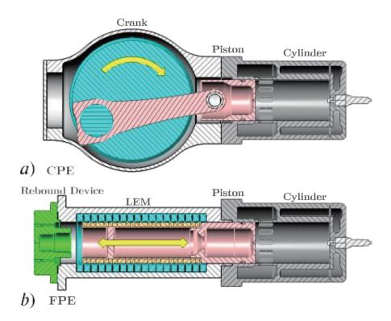

**Figure 1.** Engine Comparison: *a*) Conventional Reciprocating Piston Engine (CPE) and *b*) Free Piston Engine (FPE).

## 2.1. Architectures

FPEs can be categorized into three distinct architectures or types as listed below [6]:

- a) Single-piston with a single combustion chamber.
- b) Dual-piston with a dual combustion chamber.
- c) Opposed-piston with a single combustion chamber.

Figure 2 below highlights and illustrates the three fundamental components of the FPEG, the cylinder, the Linear Electric Machine (LEM) and the rebound device. In addition, Aichlmayr's [7] comprehensive study highlighted the operational process and their respective functions, which are presented below in Figure 3.

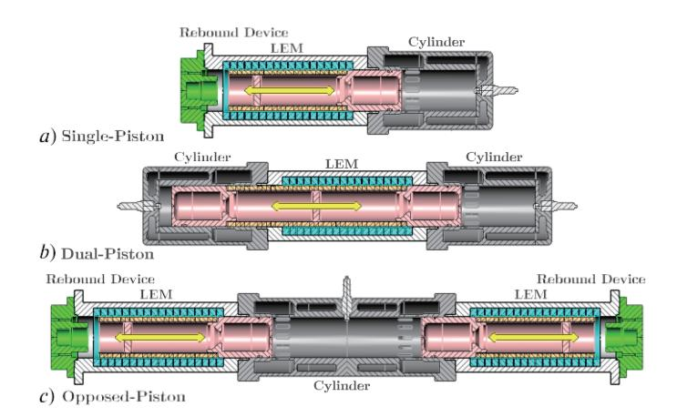

**Figure 2.** FPE Architectures: *a*) Single-Piston, *b*) Dual-Piston, and *c*) Opposed-Piston.

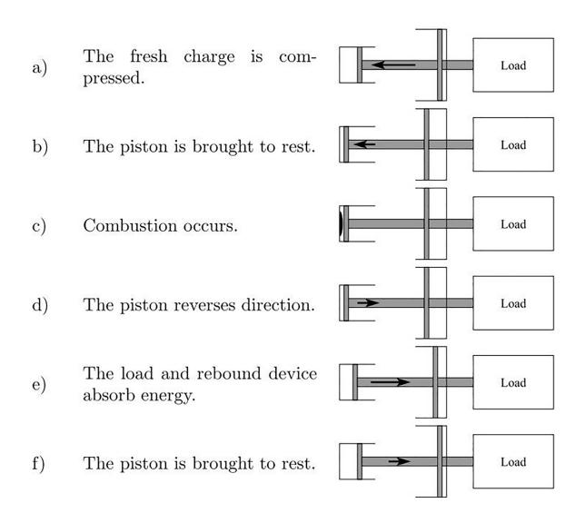

Figure 3. FPE Operation. Reprinted with permission from [7].

The operational process first presents the cylinder, which provides energy in and out of the system via the addition of fuel in the form of chemical energy during a combustion event (i.e., generating mode: steps a, b, c and d). And then the energy in the form of pneumatic energy and heat energy during a non-combustion event (i.e., motoring mode: steps a, b and d). Second, the LEM, in this case, a Permanent Magnet Linear Synchronous Machine (PMLSM) provides both electrical energy in and out of the system during the motoring mode and the generating mode respectively (steps e and f). Finally, the rebound device provides both energies in and out of the system, in this case, pneumatic energy. However, it has the same functionality independent of the operational mode (motoring and generating), thereby providing a net positive translational mechanical energy input during the compression stroke of the cycle (steps b and e). Furthermore, the rebound device provides a translational force to return the piston to a desired Top Dead Center (TDC) piston position.

The distinct advantages and challenges of each FPE architecture are presented below:

- a) The single-piston is a relatively simple architecture with moderately easy control. Research indicates that robust compression ratio control to yield relatively low in-cylinder emissions and low Brake Specific Fuel Consumption (BSFC) are achievable [8,9].
- b) The dual-piston has a high power density, with a compact architecture with no requirement of an additional rebound device. However, inherently an unbalanced design due to no opposing piston mass, the engine's vibration can be challenging to address if the installation is not combined with a second engine to provide a balanced design [9].
- c) The opposed-piston is inherently well-balanced, ideally vibration-free, with equal prime mover masses. However, challenges include the requirement for robust piston synchronization if the mechanical synchronization linkage is omitted in the design. Consequently, to apply a proxy synchronization, recent studies have presented the requirement for an elaborate multi-layered controls strategy [10–12].

# 2.2. Coupled Translational Loads

FPEs are, in general, described as translational machines with linear motion characteristics. Thereby highlighting the requirement for coupling to a translational load. The translational load will have key requirements to convert the combustion energy to useful work and energy during power generation. The requirements are summarized below [13]:

- 1) The translational load must have the minimum energy conversion losses for overall system efficiency.
- 2) The load must tolerate high accelerations and velocities.
- 3) The load must tolerate high non-linear forces from the cylinder combustion process.
- 4) The load must tolerate heat transfer from the cylinder combustion process.
- 5) The intended coupled load sizing, load mass and load dynamics are complementary and congruent to

the intentional design and operational parameters of the FPE.

The piston motion can be thought of as influenced and shaped dynamically by the FPE architecture through a balance of forces. Aichlmayr [7] presented the coupled loads as a free-body diagram, as illustrated below in Figure 4.

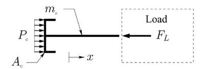

Figure 4. Free-Body Diagram. Reprinted with permission from [7].

Where m is the translator mass, x the translator position, P the in-cylinder pressure, A the piston area and  $F_L$  the coupled load respectively. Additionally, Aichlmayr considered the non-linear and linear relationships between the various translational load forces, as shown below in Figure 5. Another significant effect of the coupled loads is their influence on the FPE's frequency which is a function of the net dynamic forces exerted upon the translator mass.

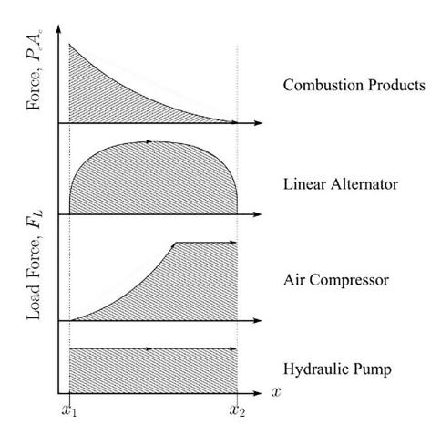

Figure 5. FPE Translational Coupled Loads. Reprinted with permission from [7].

The analysis of a CPE generally uses crank angle measured in degrees. However, the FPE uses a translational position instead of an angular position. The convention of Equivalent Crank Angle (ECA) was introduced to compare the two engine types and defined as  $ECA = 360 \ tf$  [7], where t is time and f is frequency respectively (i.e.,  $15 \ Hz < f < 30 \ Hz$ ).

Moving on now to consider the key advantages and inherent challenges of free-piston engine technology, they are summarized below:

Advantages:

- 1) Lower vibration than the CPE in the opposed-piston and dual-piston types due to the piston mass force being negated by the opposing piston mass.
- Lower frictional losses than the CPE due to the elimination of rotating components and reduced mating surfaces.
- 3) Higher mechanical and thermal efficiency compared to CPE due to the elimination of moving masses such as the flywheel and crankshaft, reducing inertial forces. In addition, lower heat transfer losses (opposed-piston especially) as pistons accelerations are more significant than conventional engines, converting the heat energy into work four times faster [2].
- 4) Multi-fuel options due to the ability to alter the piston motion and trajectory and utilization of variable Compression Ratio (CR) modes during operation, thereby permitting Low-temperature Combustion (LTC) and Homogeneous Charge Compression Ignition (HCCI) combustion modes.
- 5) Compact design relative to its counterpart, the CPE, due to elimination of cylinder head (opposed-piston specifically), valve gear drive (uni-flow scavenging) and crankshaft.
- 6) Lower Nitrogen Oxide (NOx) formation due to lower peak combustion temperature is from the altered

piston motion profile at and approaching Top Dead Center (TDC), albeit once utilizing variable CR modes. *Challenges*:

- 1) Increase in cycle-to-cycle combustion variability due to lack of kinematic constraints and elimination of rotational inertia of the prime mover relative to the CPE.
- 2) Requirement for robust and accurate piston tracking (i.e., controller) due to eliminating the kinematic constraints on the piston motion.
- 3) Requirement for robust piston synchronization if the mechanical synchronous linkage is omitted in the design (i.e., opposed-piston type).
- 4) Increase in the probability of piston-to-cylinder head contact if piston tracking control is not achieved during operation (i.e., single-piston type).

# 3. Free Piston Engine (FPE) Design

The design history of the FPE can be divided into two categories [3]. Initially, the first generation included free-piston air compressors and gas generators (Circa 1925 to 1950). This initial development spurred the second generation of FPEs (Circa 1944 to present), including free-piston electrical generators, free-piston Sterling engines, free-piston hydraulic machines and free-piston expanders as illustrated below in Figure 6.

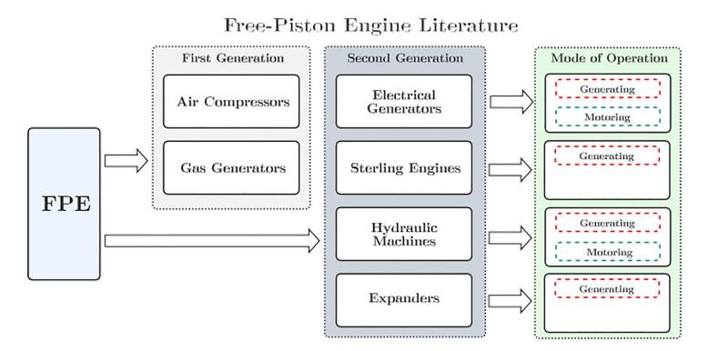

Figure 6. FPE Literature Flow Diagram.

1928 saw the introduction of the Free Piston Engine (FPE), which was the utilization of combustion to provide useful work, when the Frenchman, R. Pescara patented its use as a motor-compressor apparatus (widely credited as the inventor) [14]. Initially conceived in 1922 (as a single-piston engine) whilst investigating a solution for a lightweight machine and compressor combination to provide compressed air for helicopter rotor propulsion [1]. Unable to find a commercially available solution, like any inventor, he developed his design. His endeavors resulted in an FPE diesel compressor system as shown below in Figure 7.

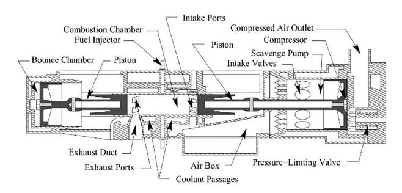

Figure 7. FPE Twin Stage Air Compressor. Reprinted with permission from [7].

Pescara assembled a group of capable engineers and designers in the preceding years. Amongst them was R. Huber, who became the technical director of the manufacturing organization Societe Industrielle General de Mechanique Appliquee (SIGMA). He additionally manufactured the GS-34 (Gas Generator) and the P-13 (Diesel Compressor).

### 3.1. Air Compressors

The first generation of the FPE introduced the reciprocating engine work being absorbed by a pneumatic compressor as presented above in Figure 7. This simplification was accomplished by constructing the engine piston and compressor into one single assembly [1]. Professor Junkers and the German Navy utilized this solution for a compact FPE four-stage air compressor aboard its submarines to propel its torpedoes. To explicitly illustrate the low vibration of the Junkers four-stage compressor, in 1936, at the Leipzig Fair in Germany, the compressor was suspended by a single rope while operating at total capacity, delivering 2 m³ of air, compressed to 370 pounds gauge pressure at 44% efficiency. A pencil, balanced on the housing, indicated the absence of vibration, noise and movement to the astonished viewers [2]. However, with Junker's efforts steered towards supplying the German Navy, Junkers halted the development of the FPE.

#### 3.2. Gas Generators

A continuing development effort by Pescara and SIGMA on the FPE as an air compressor witnessed the FPE evolving to its utilization as a gas generator. Whereby the moving mass piston was not attached to the load directly. In this configuration, the piston work is absorbed by the supercharger turbine, with exhaust gas's high back pressure flow being the moving fluid for a power gas turbine. Therefore, there was no requirement for the mechanical connection of the reciprocating piston and rotational turbine components. Instead, a fluid coupling was realized, as shown in Figure 8.

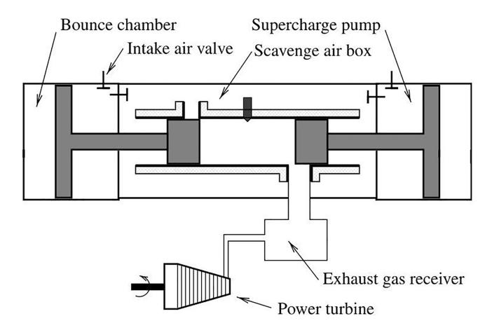

**Figure 8.** FPE Gas Generator. Reprinted with permission from [15].

During the latter stages of World War II, the development of the FPE in the United States (US) commenced after the US Navy acquired a Junker's air compressor. The initial US Navy study led to a development contract with the Baldwin Owens Hamilton Corp, a division of General Machinery Corp (GMC). As a result, several gas generator models were developed, including a two-stage generator and a single turbine unit of 1000 kW, which underwent extensive testing by the US Navy.

Post World War II development of the FPE as a gas generator and air compressor unit waned, understandably, reflecting the well-established CPE utilized in both marine and automotive and emerging propulsion with turbo jets in the aerospace industries.

# 3.3. Electrical Generators

The second generation of FPE development presented its translational coupling to an electrical load. In 1944 a coupling of a free piston engine (opposed-piston) to a translational and linear electric generator was proposed by P. Ostenberg, with his electric generator patent filed in 1943 [16]. Ostenberg's novel architecture is illustrated below in Figure 9.

One modern-day key enabling technology for coupling the FPE to electrical loads (i.e., electrical motors and generators) is the advancement of Permanent Magnets (PM). Although the literature shows that the earliest electric machines utilized PMs, their capacity and efficiency were drastically reduced by the lack of magnetic flux strength of the magnets available at that time in their development [17]. The rapid development of PMs has spurned increased interest in coupling the FPE to the LEM.

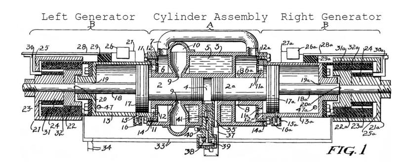

Figure 9. FPE Electric Generator. Reprinted with permission from [16].

# 3.4. Sterling Engines

W. Beale, in the late 1950s, first presented the utilization of the Sterling engine in a translational FPE configuration. With the dynamics of the Sterling FPE being dynamically constrained, Beale developed numerous small FPE demonstrators such as a water pump, electrical generator, and a refrigeration pump [18].

E. H. Cooke-Yarnborough developed the Harwell Thermo-mechanical Generator (TMG) in 1967, intended as a low-cost remote electrical power generator with an indicated power of 170 W at a high operating frequency of 110 Hz [19]. However, this low-cost TMG was limited by the relatively low thermal to mechanical efficiency of 10%, and is illustrated in Figure 10.

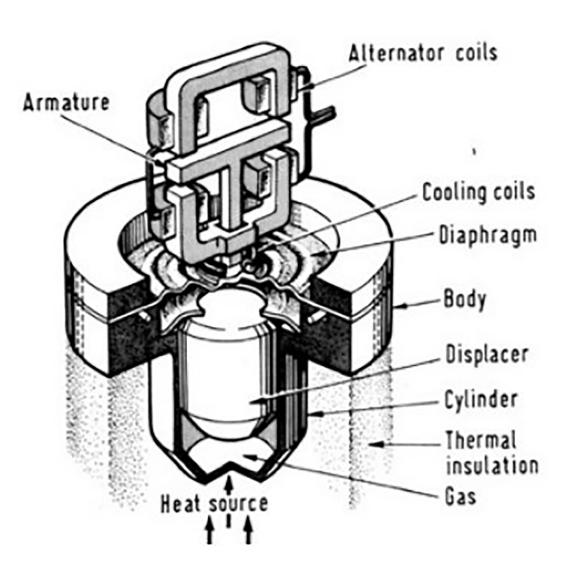

Figure 10. Stirling Generator. Reprinted with permission from [19].

# 3.5. Hydraulic Machines

As introduced by P. Achten in 1994, working alongside Innas BV, an engineering company in the Netherlands, the group started initial development on a diesel-fuelled Direct Injection (DI) single-piston FPE coupled to a hydraulic load, with development starting as early as 1987. With three prototypes being built and tested, the FPE is termed the Innas Free Piston Engine (IFP) [8].

Developed as a replacement for diesel-hydraulic drives, such as used in off-highway equipment, forklift truck and buses, this diesel-hydraulic engine with diesel fuel energy used on the combustion side and hydraulic energy on the load side indicated promising performance. With a total piston mass of 3 kg a net effective hydraulic power demonstrated to be 30 kW with a maximum fluid flow of 79 L/min. Continued development of the Innas hydraulic FPE with Dutch company NAOX produced the CHIRON. The authors state that the energy from the combustion process is almost directly converted to hydraulic energy [20]. Achtens schematic of the novel CHIRON engine, including the fluid pressure accumulator layout by which fluid energy is stored, is shown below in Figure 11.

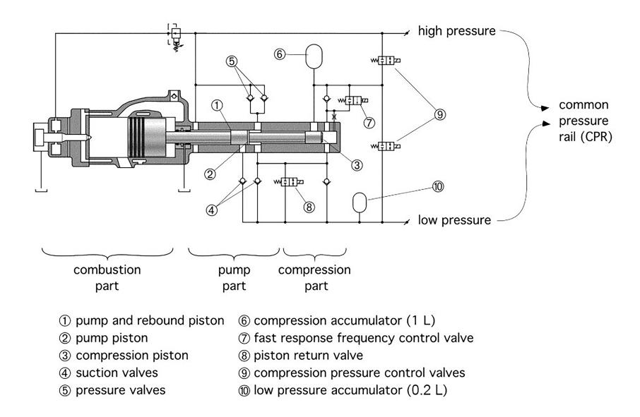

Figure 11. FPE Hydraulic Machine. Reprinted with permission from [20].

# 3.6. Expanders

The recovery of waste energy from the combustion cycle in rotary turbines, scroll expanders, crankshaft piston expanders and vane expanders has been extensively presented in the literature [21]. However, the literature presenting energy extraction for small-scale linear expanders is limited. Heyl et al.'s [22] 1999 study concluded that the application of a linear expander-compressor could improve the thermodynamic efficiency of the transcritical CO2.

Furthermore, a linear expander coupled to the LEM was presented by Weiss et al. [23], who developed a linear expander designed to produce power from low-temperature energy sources, in this case, steam. Whereby the energy recapture efficiency was shown to be approximately 88% for the scenarios considered. Li et al.'s [24] 2019 study presented a dual-acting single-piston linear expander (small-scale Rankine cycle using dry air) coupled to a LEM and concluded that peak power of 2.5 W and thermodynamic to the electrical conversion efficiency of 31% where observed at a relatively high resistive load of 80  $\Omega$ . Figure 12 below illustrates Li et al.'s prototype linear expander.

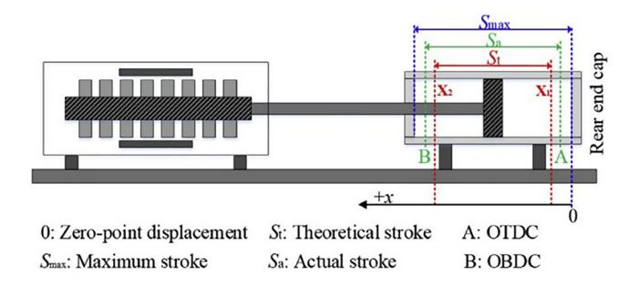

Figure 12. Linear Expander. Reprinted with permission from [24].

This section has attempted to provide a summary of the literature relating to the design history of the FPE when coupled in-directly to loads, such as in the case of the hydraulic machine or directly as in the case of the electric generator. The following section will present the recent development progress of the FPE in extracting useful work.

# 4. FPE Development

As far as recent FPE development is concerned, the literature indicates that the dual-piston dominates recent efforts, both in industry and academia, with approximately 80% of total papers reviewed considering the design, development and experimental test being the dual-piston architecture, as illustrated in Figure 13.

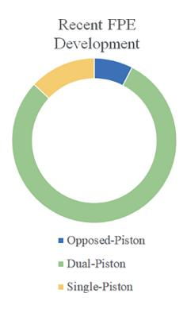

Figure 13. FPE Development.

With the removal of the crankshaft mechanism, the FPE piston motion profile fundamentally differs from that of the CPE, as presented below in Figures 14 and 15. These differences have been highlighted by numerous influential authors, including Goldsborough et al. [25] and Mikalsen et al. [26]. Whereby the piston motion not being constrained mechanically leads to the lack of direct control of the desired piston position and the compression ratio. Being kinematically constrained, in effect, enables the highly non-linear and turbulent combustion process to be damped. As a direct comparison, the CPE's inertial influence of the crankshaft, although allowing a pseudo-stable combustion process, will limit design flexibility for piston motion, compression ratio and temperature history. Consequently, the system dynamics of FPEs now influence the piston motion, advantages of which can lead to the optimization of several operational modes, in contrast to just one, as in the case of the CPE [9,10].

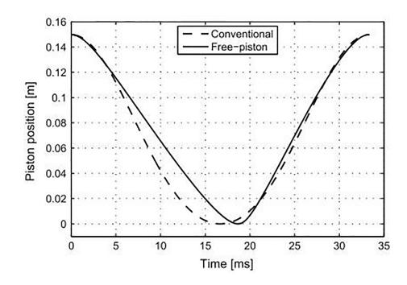

Figure 14. Piston Position Comparison. Reprinted with permission from [26].

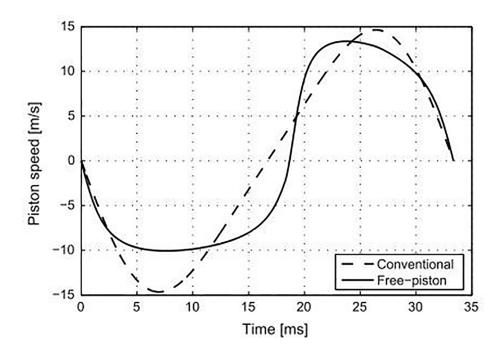

Figure 15. Piston Velocity Comparison. Reprinted with permission from [26].

A more detailed account of recent FPE development is given in the following sections.

# 4.1. FPE Numerical Methodology

On the question of numerically describing the system dynamics, in general, the models are simplified to reduce their computational cost. This section will introduce the vital numerical methodologies presented in the literature [6,15,25].

## 4.1.1. Piston Dynamics

Forces acting on the piston can be equated to those from the combustion forces, LEM, from the rebound device and parasitic loads such as friction. Piston dynamics can therefore be generalized using Newton's 2nd law of motion. This generalized approach is presented by numerous authors, including Goto et al. [27] and Feng et al. [28] in their respective physics-based modelling studies:

$$\sum F \Rightarrow m \frac{d^2x}{dt} = \begin{cases} -F_{comp} - F_{fr} - F_{rd} + F_{mot}, & The motoring process \\ F_{comb} - F_{fr} - F_{rd} - F_{gen}, & The generating process \end{cases}$$
(1)

where the forces acting upon the piston (i.e., translator) in motoring and generating modes are shown as  $F_{comp}$  due to compression,  $F_{comb}$  due to combustion,  $F_{fr}$  due to friction,  $F_{rd}$  due to rebound device,  $F_{mot}$  due to the electric motoring and  $F_{gen}$  due to the electric generator respectively.

#### 4.1.2. Linear Electric Machine

Established FPE LEM theory considers a generalized approach that describes the net voltage across the stator itself and a series connected and idealized resistive load, as shown below and illustrated in Figure 16 by Li et al. [29]:

$$\epsilon(t) = ri(t) + \frac{di(t)}{dt} + Ri(t)$$
 (2)

where  $\epsilon$  is the equivalent electrical circuit voltage, *i* the circuit current, *L* the stator inductance, *r* the stator resistance and *R* the idealized resistive load respectively.

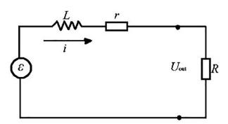

Figure 16. Idealized Electrical Circuit. Reprinted with permission from [29].

Subsequently, during the transient engine motoring period, the LEM is utilized as a motor, enabling a sufficiently high in-cylinder pressure to allow for initial combustion. The simplified motoring force *Fmot* is generally shown as the following [30,31]:

$$F_{mot} = K_t i_q \tag{3}$$

where  $K_t$  is described as the force constant of the linear electric machine and proportional to the stator current, in this case, the q-axis stator winding current  $i_q$  (i.e., when simplified in the dq0-axis rotational frame).

The LEM is utilized as a generator during steady-state power generation, which can be described as a resistance or damping force. An idealized generating force *Fgen* description is typically used, which is shown as follows [32,28]:

$$F_{gen} = \mu_e x \dot{} \tag{4}$$

where  $\mu_e$  is the generator coefficient, which is also described as the Back Electromotive Force (EMF) and is proportional to the piston velocity x; however, the above description may fail to capture the inherent nonlinear stator winding cross-coupling. Furthermore, it may neglect the influence of rectifying the generated Alternating Current (AC) to Direct Current (DC) on the motor force and any subsequently induced harmonics.

# 4.1.3. In-Cylinder

Integrating the governing differential equations representing the system in a multi-dimensional modelling approach is relatively computationally heavy. In comparison, a computational cheap zero-dimensional (0-D) approach cannot identify more subtle features, such as in-cylinder gas dynamics and their influence on emissions formation. However, a 0-D thermodynamics approach can be employed for initial engine performance evaluation and piston dynamic characterization, as presented in Mao et al.'s [33] computational study and illustrated in Figure 17.

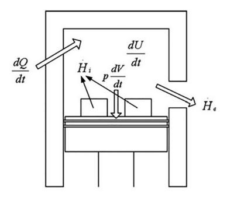

Figure 17. FPE 0-D Thermodynamics. Reprinted with permission from [33].

One can use single-zone models to describe the in-cylinder gas temperature, pressure, mass and energy, assuming the composition to be uniform and homogeneous. The heat-release rate from adding fuel to the incylinder gases can be captured with a zero-dimensional approach.

A single-zone approach represented mathematically assumes the in-cylinder gases obey the ideal gas law, plus the specific heat constant Cv and the gas constant R are constant throughout the process and are presented as:

$$\frac{dU}{dt} = \frac{dQ}{dt} - P\frac{dV}{dt} + \sum \dot{H}_i - \sum \dot{H}_e$$
 (5)

where  $\frac{dU}{dt}$  is the time derivative of internal energy,  $P\frac{dV}{dt}$  is the time derivative of volumetric work,  $\frac{dQ}{dt}$  is the time derivative of heat addition and loss of the system,  $\dot{H}_i$  is the inlet charge enthalpy and  $\dot{H}_e$  is the exhaust gas enthalpy respectively. In general, the inlet and exhaust flow enthalpy are omitted to simplify the expression.

# 4.1.4. Combustion

The *combustion* process heat release in Spark Ignition (SI) and Compression Ignition (CI) combustion can be described by the mass fraction burnt (i.e., Wiebe Function) and is appropriate for describing the heat release rate in a single-zone and multi-zone modelling approach. However, a double Wiebe function may be employed for increased numerical precision. The time derivative of the heat release due to combustion  $Q_{Comb}$  is defined as the following. It has been presented by numerous authors, including Mikalsen et al.'s [34] computational study on diesel combustion:

$$\frac{dQ_{Comb}}{dt} = Q_{in} \frac{d\chi(t)}{dt} \tag{6}$$

where  $Q_{Comb}$  is the combustion process energy,  $Q_{in}$  is the chemical heat energy input and  $\chi$  is the Wiebe function. The chemical heat energy is shown as the following:

$$Q_{in} = Q_{iln} \eta_c m_f \tag{7}$$

where  $Q_{lhv}$  is the fuels lower heat value,  $\eta_c$  is the combustion efficiency (~95–98%) and  $m_f$  is the fuel mass. A direct comparison of the in-cylinder pressure evolution between the CPE and FPE is presented below in Figure 18.

Figure 18. In-Cylinder Pressure Comparison. Reprinted with permission from [34].

# 4.1.5. Rebound Device

The force exerted by the rebound device force on the translator mass can be created by a mechanical spring and a pneumatic air spring and has been investigated and described by numerous authors. These include Kigezi et al.'s [32] study on a model-based control design approach, where the relationships are shown as the following:

$$F_{rd} = \begin{cases} k_s x_p \\ P_{bc} A_p \end{cases} \tag{8}$$

where  $k_s$  is the mechanical spring constant (i.e., mechanical spring),  $P_{bc}$  is pressure in the pneumatic bounce chamber (i.e., pneumatic air spring) and  $A_p$  is the piston surface area.

# 4.2. Critical Developments

Moving on to consider current critical developments, the following section will introduce studies that have moved the literature forward.

# 4.2.1. Single-Piston

Moriya et al. [27] from Toyota Central R&D Laboratories conducted a thorough numerical simulation and experimental investigation of a single-piston FPE with a pneumatic single-acting chamber as a rebound device. The numerical modelled scheme used a physics-based description of the piston dynamics. In addition, the combustion models employed an idealized zero-dimensional SI and Premixed Charged Compression Ignition (PCCI) approach.

Interestingly they used a W shaped piston, with the smaller diameter side of the piston for combustion and the larger diameter side for the rebound device. Furthermore, they were utilizing a two-stroke cycle, whereby the in-cylinder gas exchange process exploited uni-flow scavenging, in turn employing conventional poppet valves in the cylinder head. A commercially available magnetic field analysis software solution was used to describe and understand the LEM behavior. Experimental results show that the SI & PCCI generated a power output of 10 kW and 13 kW, respectively. In the case of PCCI, the indicated thermal efficiency was 42%. This investigation was extended by Goto et al. [35,36] to include a novel control method to improve the machine's efficiency and stability. The experimental single-piston FPE is shown below in Figure 19.

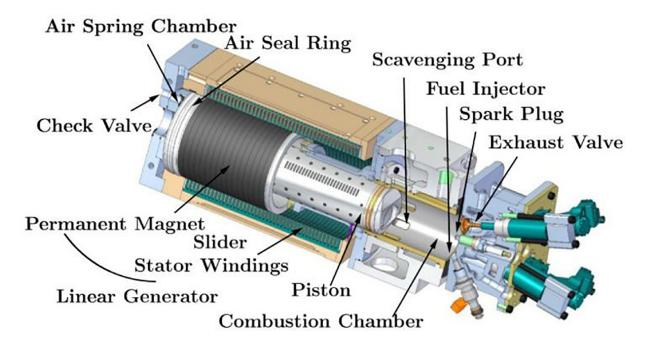

Figure 19. Toyota Single-Piston FPE. Reprinted with permission from [35].

#### 4.2.2. Dual-Piston

The development of the dual-piston FPE has been extensively presented by academia, including Mikalsen et al. [34,37,38] and Jia et al. [31,39,40]. However, Van Blarigan et al. [41] at the Sandia National Laboratories (SNL) conducted a seminal investigation on a new approach to the ideal Otto cycle, utilizing a dual-piston FPE operating on HCCI combustion coupled to a LEM. In this study, the LEM produced electrical energy yet also aided control of the compression ratio by varying the electrical load and hence the rate of energy production. Various fuels were investigated, including natural gas, hydrogen, methanol and gasoline-reduced mechanisms such as n-heptane and iso-octane operating at a relatively high CR (i.e., 30:1) and low equivalence ratio (i. e., 0.34). The experimental results for propane and natural gas indicated an

increase in measured thermal efficiency value of 56%, whilst  $NO_x$  emissions were comparatively low (<10 ppm). Figure 20 below illustrates the singular piston and central LEM.

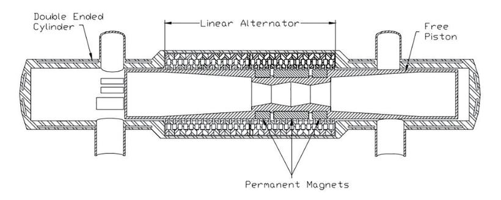

Figure 20. Sandia National Laboratories (SNL) Dual-Piston FPE. Reprinted with permission from [25].

The above study was extended to include a numerical investigation into HCCI combustion of Hydrogen [25], also presenting a simulation study characterizing the piston motion exhibited by the FPE, which was in direct comparison to the CPE. Thereby presenting that the FPE spends less time at TDC than the CPE.

## 4.2.3. Opposed-Piston

A novel FPE type described as an Opposed-Piston Opposed-Cylinder (OPOC) was presented by Li et al. [42] at the University of Minnesota, yielding numerical, experimental and control studies in the coupling of this unique cylinder configuration (donated by Ford Motor Company) to a hydraulic load. The group presented a physics-based control-oriented modelling approach with a zero-dimensional numerical description of the piston and in-cylinder dynamics. The investigation considered the interactions between the combustion, scavenging process, piston, and hydraulic dynamics under various load conditions. Multi-fuel simulations utilized HCCI combustion (i.e.,  $8 \le CR \le 25$ ), which included diluting the in-cylinder charge with Exhaust Gas Re-circulation (EGR) to aid HCCI combustion efficiency by retaining the in-cylinder gas temperature.

The initial engine firing test indicated that the 0.6 L engine exhibited unstable combustion at various operating points. With a continued development effort, Zhang et al. [43 – 45] addressed these inherent instabilities, where a robust and effective controller solution for piston tracking was investigated and presented, described as a *virtual crankshaft* which effectively guided the piston to track a pre-defined trajectory. This novel FPE type, which includes hydraulic servo valves feeding the low-pressure and high-pressure accumulators, is shown in Figure 21.

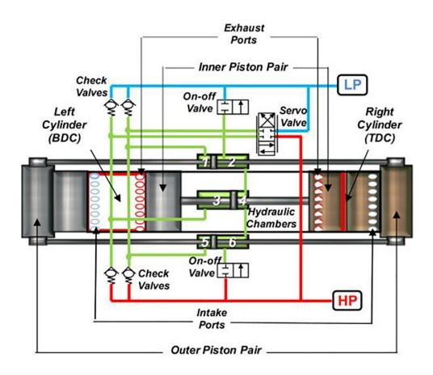

Figure 21. Opposed-Piston Opposed-Cylinder (OPOC) Hydraulic FPE. Reprinted with permission from [42].

# 4.3. FPE Development Progress

The subsections above have presented the current literature relating to critical developments. To conclude this section, Table 1 below summarizes the current FPE development progress.

Table 1. FPE Development Progress.

| FPE Type          | Research Group                                                                  | Year      | Combustion Mode | Fuel Type       | Rebound Device | Research Methodology       | Control Considered     |
|-------------------|---------------------------------------------------------------------------------|-----------|--------------------|-----------------|----------------|----------------------------|------------------------|
|                   | Toyohashi University [46]                                                       | 2004      | SI-DI              | Gasoline        | Hydraulic      | Simulation, Experimental   | No                     |
|                   | Nanjing University of Science [10,47-49]                                        | 2011-2020 | HCCI               | Gasoline        | Mechanical     | Simulation                 | No                     |
| Opposed-          | Sandia National Laboratories [11]                                               | 2015      | HCCI               | Hydrogen        | Pneumatic      | Simulation, Experimental   | Yes-Multi-Level        |
| Piston            | University of Minnesota [42-44,50-53]                                           | 2014-2018 | HCCI               | Multiple        | Hydraulic      | Simulation                 | Yes-Multi-Level        |
|                   | University of Sussex [5]                                                        | 2019      | SI                 | Gasoline        | Mechanical     | Simulation, Experimental   | No                     |
|                   | Harbin Institute of Technology [54]                                             | 2022      | SI                 | Gasoline        | Mechanical     | Experimental               | Yes-Model Based        |
|                   | Sandia National Laboratories [25,41,55]                                         | 1998-2003 | HCCI               | Multiple        | Combustion     | Experimental               | No                     |
|                   | University of West Virginia [56-61]                                             | 1998-2016 | SI-CI              | Diesel-Gasoline | Mechanical     | Simulation, Experimental   | No                     |
|                   | Pempek Systems [62]                                                             | 2003      | DI                 | Multiple        | Combustion     | Experimental               | No                     |
|                   | Chalmers University [63-65]                                                     | 2004-2009 | HCCI               | Diesel          | Combustion     | Simulation, Experimental   | No                     |
|                   | University of Sheffield [66]                                                    | 2005      | n/a                | n/a             | n/a            | Simulation                 | No                     |
|                   | KTH [67]                                                                        | 2006      | HCCI               | Gasoline        | Combustion     | Simulation, Experimental   | Yes-Model-Based        |
|                   | Petronas University [68]                                                        | 2008      | Motoring           | n/a             | Combustion     | Simulation                 | No                     |
|                   | Shanghai Jiao Tong University [29,69]                                           | 2008-2014 | HCCI               | n-heptane       | Combustion     | Simulation                 | No                     |
|                   | Beijing Institute of Technology [9,13,28,31,33,39,40,70-83]                     | 2011-2021 | SI-HCCI            | Multiple        | Combustion     | Simulation, Experimental   | Yes-Multi-Level        |
| Dual-Piston       | University of Newcastle [15,31,34,37-40,71-78,80,84]                            | 2008-2020 | SI-HCCI            | Multiple        | Combustion     | Simulation, Experimental   | Yes-Multi-Level        |
|                   | KIER [85]                                                                       | 2012      | DI                 | Hydrogen        | Combustion     | Experimental               | No                     |
|                   | German Aerospace Center [86]                                                    | 2013      | SI-HCCI            | Gasoline        | Combustion     | Simulation, Experimental   | Yes-Model-Based        |
|                   | National Taiwan University [30]                                                 | 2013      | SI-HCCI            | Gasoline        | Combustion     | Simulation                 | No                     |
|                   | Jiansing University [69]                                                        | 2014      | HCCI               | Methane         | Combustion     | Simulation                 | No                     |
|                   | University of Michigan [87]                                                     | 2017      | SI                 | Gasoline        | Combustion     | Simulation                 | Yes-Model-Based        |
|                   | University of Ulsan [88]                                                        | 2017      | n/a                | n/a             | Combustion     | CFD                        | No                     |
|                   | Chongqing Jiaotong University [74,89,90]                                        | 2016-2019 | HCCI               | Hydrogen        | Combustion     | Simulation, CFD            | No                     |
|                   | Institute of Automatic Control [91]                                             | 2021      | SI                 | Gasoline        | Combustion     | Simulation                 | Yes-Model Based        |
|                   | Zhengzhou School of Mechanical Engineering [92]                                 | 2022      | CI                 | Hydrogen        | Combustion     | Simulation                 | No                     |
|                   | Innas BV [20]                                                                   | 1994-2000 | DI                 | Diesel          | Hydraulic      | Simulation, Experimental   | Yes-Multi-Level        |
|                   | German Aerospace Center [93,94]                                                 | 1999-2016 | SI-HCCI            | Gasoline        | Pneumatic      | Simulation, Experimental   | No                     |
|                   | Norwegian University [95,96]                                                    | 2002      | DI                 | Diesel          | Pneumatic      | Simulation, Experimental   | Yes-Multi-Level        |
|                   | FEV Engine Technology [97]                                                      | 2005      | DI                 | Diesel          | Hydraulic      | Experimental               | No                     |
| 0.000             | Toyota [36,27,35]                                                               | 2014-2016 | SI-PCCI            | Gasoline        | Pneumatic      | Simulation, Experimental   | Yes-Model-Based        |
| Single- Piston | Ningbo Institute [98]                                                           | 2016      | SI                 | Gasoline        | Pneumatic      | Simulation                 | No                     |
| I ISIOII          | Stony Brook University [99,100]                                                 | 2017      | HCCI               | Gasoline        | Mechanical     | Simulation                 | No                     |
|                   | Beijing University of Technology [24,101]                                       | 2019-2020 | Expander           | n/a             | None           | Simulation, Experimental   | No                     |
|                   | Nanjing University [49]                                                         | 2020      | Motoring           | Gasoline        | Mechanical     | Simulation                 | No                     |
|                   | Shanghai Jiao Tong University [102] Harbin Institute of Technology [103-105] | 2022      | SI                 | Gasoline        | Mechanical     | Simulation Experimental | No Vec. Model Based |
|                   | material institute of recimology [103-103]                                      | 7707      | 10                 | Casolille       | INICCIIAIIICAI | Expermental                | I CS—IVIOUCI DASCU     |

### 4.4. Fuel Development

Alternative fuels development within FPE research is gaining moment, driven by a global low-carbon objective as highlighted above in Section 1 [4]. Furthermore, achieving net-zero CO2 emissions by 2050, as first presented by the IPCC report on the impacts of global warming of 1.5 °C above pre-industrial levels, has spurred renewed interest in alternative fuelled FPEs [106]. The FPE is a crucial enabler motivating further research into fuels such as hydrogen and ethanol, which is critical in addressing gaseous combustion emissions of thermal hybrid propulsion technologies.

Hydrogen has been investigated in numerical and experimental FPE studies from Sandia National Laboratories (SNL), including seminal dual-piston numerical studies led by Van Blarigan et al. [41] and opposed-piston experimental work led by Johnson et al. [11]. Furthermore, one indicated the advantage of hydrogen compared to Hydrocarbon (HC) based fuels includes a substantial increase in specific energy with 33.3 kWhkg-1 compared to 12.8 kWhkg-1 for gasoline. Furthermore, SNL's work included using multiple fuels in their investigation into employing HCCI, whereby the indicated thermal efficiency of propane and natural gas combustion were approximately 56% ( $\eta$ ).

Bai et al. [69] studied methane HCCI combustion in a micro FPE. The numerical simulation results of methane combustion allowed the group to deduce a mathematical relationship for critical initial kinetic energy to ensure successful combustion.

Ngwaka et al.'s [84] recent work investigated hydrogen fuel in a dual-piston FPE prototype. The study compared both the 2-stroke operation and 4-stroke operation processes of the SI hydrogen engine. Experimental results indicated the thermal efficiency of the 2-stroke operating between 5 Hz to 11 Hz to be 32.3%, at an equivalence ratio of 0.38, with NOx emissions at 44 ppm.

This section has shown the current FPE fuel development progress. In addition, these studies are summarized below in Table 2.

| FPE Type    | Research Group                                     | Year          | Combustion Mode | Fuel Type | Research Methodology     | Real-Time Control |
|-------------|----------------------------------------------------|---------------|--------------------|--------------|-----------------------------|----------------------|
| Opposed-    | Sandia National Laboratories [11]                  | 2015          | HCCI               | Hydrogen     | Simulation, Experimental | Yes                  |
| Piston      | University of Minnesota [45]                       | 2017          | HCCI               | Multiple     | Simulation                  | No                   |
|             | Sandia National Laboratories [41,25]               | 1998          | HCCI               | Multiple     | Simulation                  | No                   |
|             | Chalmers University [63]                           | 2004          | HCCI               | Multiple     | Simulation                  | No                   |
|             | Department of Energy Efficiency, KIER [9]       | 2012          | SI                 | Hydrogen     | Experimental                | No                   |
| Dual-Piston | Jiangsu University [69]                            | 2014          | CI                 | Methane      | Simulation                  | No                   |
| Duai-Piston | Chongqing Jiao tong University [89,90]             | 2017- 2019 | SI                 | Hydrogen     | Simulation                  | No                   |
|             | University of Newcastle [84]                       | 2020          | SI                 | Hydrogen     | Experimental                | Yes                  |
|             | Zhengzhou School of Mechanical Engineering [92] | 2022          | CI                 | Hydrogen     | Experimental                | No                   |

Table 2. FPE Fuel Development Progress.

# 5. Control Development

The current literature indicates that 72% of control development efforts are steered towards the dual-piston architecture, highlighting similarities to the general development efforts as presented in Section 4. However, the above analysis may highlight the inherent advantages of the dual-piston in having a greater specific power output due to the load extracting energy on every piston stroke and the disadvantages of the other types, as highlighted in Section 2.2. Furthermore, the critical disadvantages of piston synchronization in the opposed piston and the characteristic unbalanced nature of the single-piston may influence the recent development efforts.

The key challenges and requirements of FPE control common to all FPE types, considering the omission of the kinematic constraint and inertial masses in its design, are summarized below:

1) The challenge of a stable combustion process during power generation, with the critical requirement for minimal cycle-to-cycle combustion and emissions variability via implementation of a proposed

robust combustion control strategy.

2) The challenge of a stable compression process during motoring with the critical requirement of achieving a predefined in-cylinder pressure for a robust initial combustion process via the implementation of a proposed robust motoring control strategy.

In recent years, industry and academia have championed the challenges of describing, controlling and optimizing the characteristic dynamics of the FPEs. These are summarized and presented below in Table 3.

Table 3. FPE Controls Development Progress.

| FPE Type        | Research Group                                          | Date      | Research Methodology     | Motoring Control Approach | Generating Control Approach | Control Objective | Keal-1 me Control |
|--------------------|---------------------------------------------------------|-----------|--------------------------|------------------------------|--------------------------------|----------------------|----------------------|
|                    | Sandia National Laboratories [11]                       | 2015      | Experimental             | Propriety, Pneumatic         | Fuel Flow                      | Piston Position      | Yes                  |
|                    |                                                         |           | Simulation, Experimental | Hydraulic Load               | Hydraulic Load, Fuel Flow      | Piston Trajectory    | Yes                  |
| 0000               | Inivaments of Minnacota [12 50 5)                       | 2017 2018 | Simulation, Experimental | Hydraulic Load               | Hydraulic Load, Fuel Flow      | Piston Trajectory    | Yes                  |
| Opposed- Piston | Omversity of Minnesota [42,50-52]                       | 2014-2010 | Simulation, Experimental | Hydraulic Load               | Hydraulic Load, Fuel Flow      | Piston Trajectory    | Yes                  |
| TORELL             |                                                         |           | Simulation, Experimental | Hydraulic Load               | Hydraulic Load, Fuel Flow      | Piston Trajectory    | Yes                  |
|                    | University of Sussex [5]                                | 2019      | Simulation, Experimental | Propriety, Electric          | Fuel Flow, RD Stiffness        | Energy Balance       | No                   |
|                    | Nanjing University of Science and Technology [54]       | 2022      | Simulation               | Electric, Fuel Flow          | None                           | In-Cylinder Pressure | No                   |
|                    | University of West Virginia [107]                       | 2000      | Simulation, Experimental | Electric                     | Fuel Flow                      | Piston Position      | No                   |
|                    | Royal Institute of Technology (KTH) [67]                | 2006      | Simulation               | None                         | Electrical Load, Fuel Energy   | Generated Power      | No                   |
|                    | Chalmers University [65]                                | 2009      | Simulation, Experimental | None                         | Electrical Load                | Piston Position      | No                   |
|                    |                                                         |           | Simulation               | None                         | Fuel Flow                      | Piston Position      | No                   |
|                    | University of Newcastle [9,13,26,38,73,76,108]          | 2009-2016 | Simulation               | None                         | Fuel Flow, Electric Load       | Piston Position      | No                   |
|                    |                                                         |           | Simulation               | None                         | Fuel Flow                      | Piston Position      | No                   |
|                    | German Aerospace Center [86]                            | 2013      | Simulation, Experimental | None                         | Propriety, Electric Load       | Piston Position      | No                   |
|                    |                                                         |           | Simulation               | None                         | Fuel Flow, Electric Load       | Piston Position      | No                   |
| Duel Dieton        | Duel Bieten Lilin Ilnivereity [100 112]                 | 2015 2018 | Simulation               | None                         | Fuel Flow                      | Piston Position      | No                   |
| Dual-1 IStoll      | Juli Oniversity [107-112]                               | 0107-0107 | Simulation               | None                         | Fuel Flow                      | Piston Position      | No                   |
|                    |                                                         |           | Simulation               | None                         | Fuel Flow                      | Piston Position      | No                   |
|                    |                                                         |           | Simulation, Experimental | Propriety, Electric          | Fuel Flow                      | Piston Position      | Yes                  |
|                    |                                                         |           | Simulation, Experimental | Electric                     | Fuel Flow                      | Piston Position      | No                   |
|                    | Beijing Institute of Technology [9,13,73,76]            | 2016      | Simulation, Experimental | None                         | Fuel Flow                      | Piston Position      | Yes                  |
|                    |                                                         |           | Simulation, Experimental | None                         | Fuel Flow                      | Piston Position      | Yes                  |
|                    |                                                         |           | Simulation, Experimental | Propriety                    | None                           | Piston Position      | Yes                  |
|                    | University of Michigan [87]                             | 2017      | Simulation               | None                         | Fuel Flow                      | Piston Position      | No                   |
|                    | Institute of Automatic Control [91]                     | 2021      | Simulation               | None                         | Fuel Timing, Valve Timing      | Piston Position      | No                   |
|                    | Nominarian Hairemiter of Science and Technology [05 06] | 2002 2002 | Simulation, Experimental | None                         | Fuel Timing, Valve Timing      | Piston Position      | Yes                  |
|                    | INOTWESTALL CHINESTRY OF SCIENCE AND TECHNOLOGY [75,70] | 2002-2002 | Simulation, Experimental | None                         | Fuel Flow, RD Flow             | Piston Position      | Yes                  |
|                    |                                                         |           | Simulation, Experimental | None                         | Fuel Flow, Electric Load       | Piston Trajectory    | No                   |
|                    | Toyota [36,27,35]                                       | 2014-2016 | Simulation, Experimental | None                         | Fuel Flow, Electric Load       | Piston Trajectory    | Yes                  |
| Sinc. S            |                                                         |           | Simulation, Experimental | Electric                     | Fuel Flow, Electric Load Fuel  | Piston Trajectory    | Yes                  |
| Single- Piston  | Shanghai University [113]                               | 2017      | Simulation               | Electric Current             | Timing, Electric Load          | Piston Position      | No                   |
|                    | Ningbo Institute of Materials Technology [114,115]      | 2018-2022 | Simulation, Experimental | None                         | Electric Load                  | Piston Trajectory    | No                   |
|                    | University of West Virginia [116]                       | 2019      | Simulation               | None                         | Electric Load                  | Energy Balance       | No                   |
|                    | Nanjing University [49]                                 | 2020      | Simulation, Experimental | Electric Current             | Electric Load                  | Piston Position      | Yes                  |
|                    | Shanghai Jiao Tong University [117]                     | 2022      | Experimental             | None                         | Electric Load                  | Piston Position      | No                   |
|                    | Harbin Institute of Technology [103-105]                | 2022      | Experimental             | None                         | Electric Load                  | Piston Position      | No                   |

### 5.1. Control Objectives

As presented in the above sections, the FPE can characteristically explore an increasingly wide range of piston motion profiles and trajectories during operation. However, this presents fundamental control challenges as highlighted above in Section 5. The control objectives of the FPE have primarily been to maintain absolute TDC and Bottom Dead Center (BDC) positions. Hence, accurate control of the piston position may permit the desired CR. Furthermore, once implemented, stable combustion and energy production may be feasible. In addition, the current literature presented several specific and unique control requirements for each FPE architecture as summarized below in Table 4 [13].

**Table 4.** Control Objectives for FPE Architectures [13].

| EDE Tomo       | Control Goals                            |                                  |  |  |  |
|----------------|------------------------------------------|----------------------------------|--|--|--|
| FPE Type       | Common Goal                              | Specific Goal                    |  |  |  |
|                | Top Dead Center (TDC) Set-point Tracking | Piston Synchronization           |  |  |  |
| Opposed-Piston | Compression Ratio (CR) Control           | Rebound Device Control           |  |  |  |
|                | Avoid Mechanical Contact                 | Engine Operating Speed           |  |  |  |
| Dual-Piston    | Timing Control                           | Bottom Dead Center (BDC) Control |  |  |  |
| C: 1 D: 4      |                                          | Rebound Device Control           |  |  |  |
| Single-Piston  | Energy Demand Set-point                  | Engine Operating Speed           |  |  |  |

# 5.2. Control Strategies

This section presents current progress on stabilizing and controlling the inherently non-linear piston dynamics, highlighting two control strategy solutions, *piston position* and *piston trajectory*.

#### 5.2.1. Piston Position Control

The literature indicates that the TDC and BDC position dominant as the primary control objective. Critical developments investigating this approach in motoring and power generation are presented below.

A numerical model describing the energy balance of a prototype diesel-fuelled, single-cylinder FPE Gas Generator (GG), in conjunction with a multi-level supervisory control structure termed an *electronic* crankshaft, and *electronic* camshaft was first proposed and investigated by Johansen et al. [95, 96]. The prototype architecture of the FPE was indirectly coupled to a power turbine to extract useful work (i.e., gas generator). The satisfactory control of both the BDC position (via regulation of the fuel flow rate) and the TDC position (via regulation of the air-flow rate of the rebound device) was presented. Control was implemented by two linear Single Input Single Output (SISO) controllers, the higher-level SISO controlling piston motion and the lower-level SISO controlling valve and fuel timing. Experimentally, the results indicated adequate piston position control. However, FPE and control system design challenges remain, including achieving sufficiently high reliability, fault tolerance, and robustness [95].

Bergman et al. [65] published a thorough Computation Fluid Dynamics (CFD) based optimization study on a dual-piston FPE, in which they introduced a control system that regulates the electric force applied during power generation and initial motoring, with the control objective of achieving a desired CR. However, as referenced in the paper, the control design was developed by Volvo. Consequently, a detailed description of this novel control strategy was omitted from the paper.

Mikalsen et al. [26] presented a predictive control system, essentially a piston motion controller, which coupled the fuel flow rate and injection timing to the TDC position error. The TDC controller consisted of two elements, a position measurement system and the TDC estimator, which provided outputs to control the fuel flow and timing (Figure 22). The proposed control strategy predicted the TDC position during the compression stroke. In addition, it regulated the fuel flow rate based on the predicted value rather than the measured value to increase the controller's transient performance. Results indicate superior performance compared to the previously studied PI controller by the authors [108].

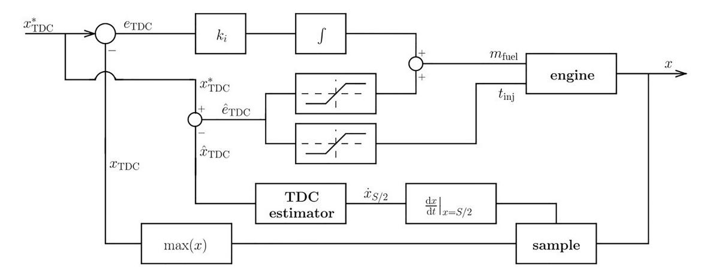

Figure 22. Predictive Control. Reprinted with permission from [26].

Johnson et al. [11] conducted an experimental evaluation on a hydrogen-fuelled prototype opposed-piston FPE, operating during both the motoring and generating phases of the cycle, which provided a detailed description of an innovative pneumatic motoring system, which determines and regulates the supply pressure delivered to the rebound device. However, the prototype was directly controlled via proprietary software during its testing. Therefore, the control structure was not described in detail.

FPE Linear Generator (LG) position control during motoring presenting its operational stability and state estimation was recently investigated by T. Kigezi [5], which included a thorough analytical approach to determine an optimal starting strategy, terming the strategy as *mechanical resonant*. Furthermore, mechanical resonant as a starting strategy has been proposed and investigated by various other authors, which include Jia et al.'s [76] study on the effects of closed-loop controlled resonance of an FPE LG and Zulkifli et al.'s [68] study on a mechanical resonance and rectangular current commutation strategy of an FPE LG. Both author's starting strategies provided an electromagnetic force to reciprocate the piston assembly during the initial starting phase [68], without the need for an oversized LEM.

A Model Predictive Control (MPC) approach was proposed by Gong et al. [111] in controlling a dual-piston FPE LG during power generating. Presenting a physics-based (to capture the non-linear FPE dynamics) and a control-orientated modelling approach, an MPC design was proposed to manage the system constraints and control the TDC position via regulating the fuel flow and electrical load. For state observation, a TDC estimator, using Newton's method alongside an Extended State Observer (ESO), was implemented in the feedback control structure (Figure 23). The simulations demonstrated that the MPC controller achieved satisfactory performance in TDC position tracking during transient load transitions.

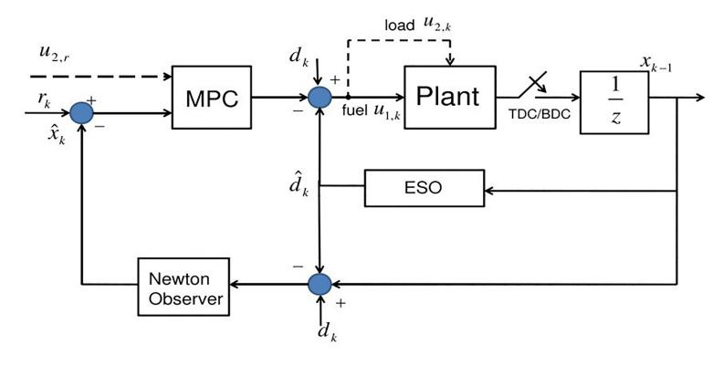

Figure 23. Model Predictive Control (MPC) Feedback Control. Reprinted with permission from [111].

Jia et al. [13] presented a cascade control structure of a dual-piston LEM FPE during generating, with the control objective of achieving stable piston position tracking at both TDC and BDC. A simplified numerical description of the dual-piston FPE was presented. In the control-orientated approach, the piston dynamics were described as a forced mass-spring-damper system, excited by an external force (determined

by the combustion heat release process). The paper presented a linear cascaded control structure that considered a target TDC position as the input reference and a commanded fuel injection flow as the output command (Figure 24). The study and investigation indicated that TDC position is influenced by injected fuel mass and electric load, and engine speed is influenced by injected fuel mass alone. The presented validation results indicate improved transient performance of the controller compared to a single-loop strategy, highlighting a reduced control latency, peak error and settling time.

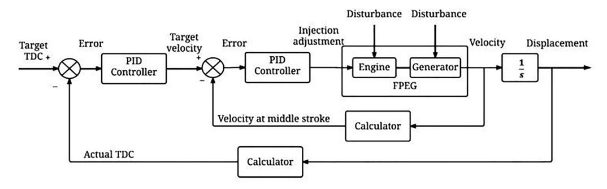

Figure 24. FPEG Cascaded Control. Reprinted with permission from [13].

Zaseck et al. [87, 112] highlighted the requirement for stabilizing feedback control for robust piston motion during the power generating of a four-stroke, dual-piston hydraulic FPE and considering both a high-fidelity and control-orientated model in their approach. A high-fidelity numerical model that could accurately capture the piston dynamics, gas exchange process and hydraulic load were first developed, followed by a control-oriented model that simplifies and implicitly characterizes the TDC and BDC positions using an energy-balance description of the Otto cycle. Validation of the reference governor controller on the control-oriented model indicates satisfactory piston position tracking performance during transient load conditions, whereby the TDC position is the control objective.

Toyota Central R&D Laboratories [27,36] presented power-generating control of a single-piston FPE LG. A numerical simulation of the single-piston FPE with a pneumatic single-acting chamber as a rebound device was implemented in Modelica and considered a rudimentary multi-domain approach. Moreover, the multi-domain simulation approach considered a simplified description of the LEM dynamics. A linear negative feedback control structure for power generating control considered CR as the control objective, achieved by regulating the electrical load coefficient. Experimentally, the results indicate satisfactory control of the TDC and BDC positions.

Furthermore, the group extended the existing linear controller design to include a combined motoring and generating control strategy, termed *pendulum type control* [35]. This strategy utilizes piston velocity to regulate the TDC and BDC positions. The rectangular speed reference is defined by a calculated reference amplitude and offsets using the errors captured at TDC and BDC (Figure 25). In addition, rebound device pressure was regulated to assist in BDC control. Unfortunately, the proposed control strategy did not present the controller architecture and simulation implementation. Nevertheless, simulation and experimental studies validate stable operation in motoring and generating.

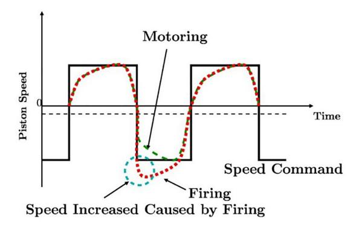

Figure 25. Speed Control. Reprinted with permission from [35].

Recent developments in controlling the absolute dead-center positions include a *force* control strategy proposed by Chen et al. [103]. In this approach, the q-axis reference current was regulated to vary the force produced by the LEM. The current reference profiles were rectangular waveforms to simplify this approach and reduce the computational requirements, whereby an established Field Orientated Control (FOC) scheme was utilized (i.e.,  $i_d = 0$ ). In addition, feedback control was introduced to achieve convergence of the dead-center errors (Figure 26). The proposed control strategy was verified experimentally on a dual-piston FPE, which omitted the cylinder assembly using two mechanical springs to provide a functional force input to the LEMs translator. The test results presented the TDC, and BDC errors were constrained to be no more than 0.25 mm. Although the inherent non-linearity of the in-cylinder process was omitted in the experimental verification, this approach can be extended to include piston trajectory control, as presented in the following section.

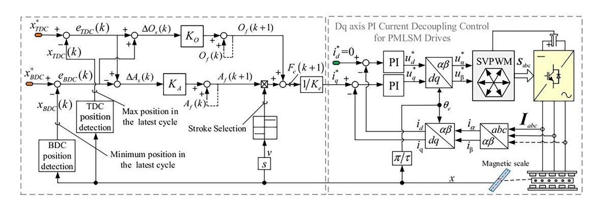

Figure 26. Force Control. Reprinted with permission from [103].

Controlling the absolute dead-center positions by regulating the LEM stator current and hence varying the FPEs electromagnetic force was also adopted by Zhao et al. [118] in a recent study (Figure 27). However, this approach divides the piston movement into two distinct stages. The first stage varies the engine load with a constant electromagnetic force, and the second adopts *on-line* trajectory tracking. Furthermore, the piston velocity was established at the mid-point of the expansion stroke to account for variations in the combustion process. Finally, the reference trajectory is optimized iteratively by the dead-center errors seen. A simulation analysis to demonstrate the performance of the proposed online trajectory tracking strategy presented errors in TDC and BDC in 0.20 mm and 0.50 mm under a fuel mass variation of 15%, which are comparable to Chen et al.'s study.

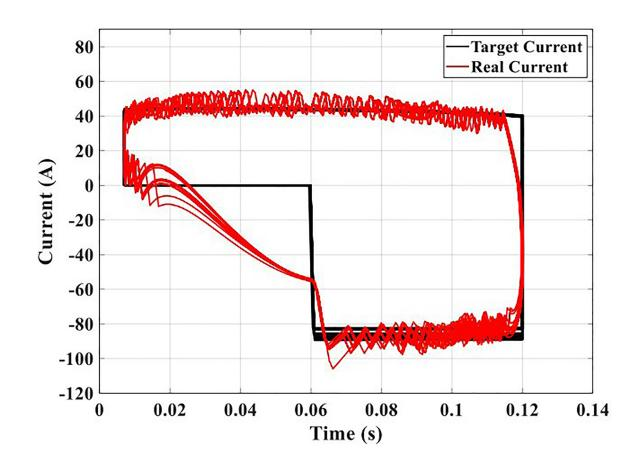

Figure 27. Stator Current. Reprinted with permission from [118].

# 5.2.2. Piston Trajectory Control

More recently, literature has emerged identifying advancements in piston trajectory control compared to piston position control. This novel approach considers *how* the piston approaches the TDC and BDC positions concerning its geometrical trajectory and is presented below.

As presented above in Section 4.2, Li et al. [42,50] proposed a novel model-based *active* controller for a prototype OPOC hydraulic FPE, whereby the controller effectively acts as a *virtual* crankshaft, termed *active motion* control by way of imposing a proxy CPE kinematic constraint on the system. These proxy constraints were implemented via the hydraulic servo forces, regulating the fluid pressure delivered by the high-pressure accumulator, acting as a varying load on the FPE. In addition, a low-order and linear control-orientated model was presented to reduce the computational expense of the physics-based model, which used an established system-identification approach inferred from the simulated data captured from the physics-based model. The system identification process yielded a best-fit linear model with relatively low order. However, prior to the identification of a linear model, a Proportional Integral Derivative (PID) controller was used to stabilize the physics-based model, using a relatively large control gain. It is worth noting that this approach did not account for the effects of the exogenous control on the low-order model dynamics.

The proposed control strategy characterizes the elliptical trajectory of the piston in Cartesian coordinates, including the minor to major axis ratio  $\Omega$  (Figure 28). Despite using a robust linear proportional feedback control architecture to stabilize the piston tracking performance, additional control was required by employing a repetitive controller, as repetitive control characteristics typically included rapid and precise reference tracking capabilities.

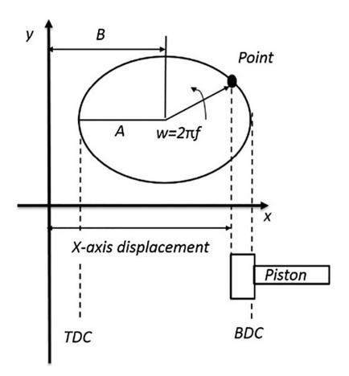

Figure 28. Piston Trajectory. Reprinted with permission from [43].

Continued group development [43,50,51] presented promising controller performance with satisfactory piston trajectory tracking, with trajectory-based combustion control being implemented in further experimental testing. Zhang et al. concluded that the proposed strategy can affect the combustion process by varying the ellipse profile, thereby directly altering the in-cylinder gas pressure, temperature history and indicated work.

In this section, it has been presented that piston position and piston trajectory control may be critical in the development of the FPE as a viable future thermal propulsion technology. The section that follows summarizes the findings and literature presented in this paper.

# 6. Literature Review Summary

Most of the existing FPE LEM development recognizes that a linear mathematical description of the FPE is computationally cheap and can be used in a control-orientated approach. However, naturally, they may fail to fully describe the characteristic non-linear and *multi-directional* load interactions and their subsequent impact on the system-level performance.

Controlling the inherent non-linear dynamics of the FPE is challenging as the machine is dynamically

constrained. Whereby controlling the absolute piston position at its dead centers dominates the literature. In so doing, regulating the fuel, LEM and rebound device energy inputs into the system can vary the piston profile, hence the dead center positions. Emerging strategies include regulating the electromagnetic force load to vary the piston trajectory *between* the dead center positions have been presented. Although the characteristic behavior of the FPE is non-linear, employing established linear control architectures (such as PID feedback) shows robust piston position control performance. However, besides MPC, non-linear control schemes have not been investigated sufficiently to assess their viability in piston position control.

As highlighted above in Section 5.2.1, there is limited knowledge in the literature for controlling the piston trajectory of an FPE during its motoring and generating phases. Nevertheless, piston trajectory tracking and optimization may be viable and promising control objectives to address inherent combustion instabilities of the FPE and its influence on the coupled loads. Furthermore, a development strategy considering system-level and control design has not been investigated sufficiently.

In summary, describing and capturing the non-linear and multi-directional nature of the FPE in an approach that considers system-level and control design is required to further the knowledge in this novel field of study.

**Author Contributions:** Conceptualization, P.B.; writing—original draft preparation, P.B.; writing—review and editing, G.T. and U.M.; supervision, G.T. and S.C. All authors have read and agreed to the published version of the manuscript.

Funding: This research received no external funding.

Data Availability Statement: Not applicable.

Conflicts of Interest: The authors declare no conflict of interest.

## References

- London, A. L. Free-piston and turbine compound engine-status of the development. SAE Transactions 1954, 62, 426–436.
- 2. Coutant, J.G. Four-stage free-piston compressor. The Military Engineer, 1960, 52(348), 302–304.
- 3. Scott, P.L. Construction of Junkers engine. SAE Transactions 1917, 12, 404-424.
- APC. The roadmap report-towards 2040: a guide to automotive propulsion technologies. *Technical report*, Automotive Council UK, Coventry, 2020. Available Online: http://www.apcuk.co.uk/roadmaps/ (Accessed on 17 March 2023)
- 5. Kigezi, T.N. Stability, control, and state estimation of free-piston engine generators. Brighton: University of Sussex, *Brighton*, UK, 2019.
- 6. Guo, C.D.; Zuo, Z.X.; Feng, H.H.; et al. Review of recent advances of free-piston internal combustion engine linear generator. *Applied Energy*, **2020**, *269*, 115084.
- 7. Aichlmayr, H.T. Design considerations, modeling, and analysis of micro-homogeneous charge compression ignition combustion free-piston engines. Ph.D. Thesis, University of Minnesota, Minneapolis, MN, USA, 2002.
- 8. Achten, P.A.J. A review of free piston engine concepts. SAE Transactions 1994, 103, 1836–1847.
- 9. Feng, H.H.; Guo, Y.Y.; Song, Y.; et al. Study of the injection control strategies of a compression ignition free piston engine linear generator in a one-stroke starting process. *Energies*, **2016**, *9*(6), 453.
- 10. Huang, L. An opposed-piston free-piston linear generator development for HEV. SAE Technical Paper 2012, 2012-01-1021. doi: https://doi.org/10.4271/2012-01-1021
- 11. Leick, M.T.; Moses, R.W. Experimental evaluation of the free piston engine-linear alternator (FPLA). Livermore: Sandia National Laboratories, 2015.
- 12. Regner, G.; Herold, R.; Wahl, M.; et al. The Achates power opposed-piston two-stroke engine: performance and emissions results in a medium-duty application. *SAE International Journal of Engines*, **2011**, 4(3), 2726–2735.
- 13. Jia, B.R.; Mikalsen, R.; Smallbone, A.; et al. Piston motion control of a free-piston engine generator: a new approach using cascade control. *Applied Energy*, **2016**, *179*, 1166–1175.
- 14. Pescara, R.P. Motor compressor apparatus: US1657641A. 1928-01-31.
- 15. Mikalsen, R.; Roskilly, A.P. A review of free-piston engine history and applications. *Applied Thermal Engineering*, **2007**, *27*(14/15), 2339–2352.
- 16. Ostenberg, P. Electric generator: US2362151A.
- Simone, D.J. Modeling a linear generator for energy harvesting applications. PhD thesis, Naval Postgraduate School, Monterey, CA, USA, 2014.
- 18. Walker, G. Stirling engines. Oxford University Press: New York, NY, USA, 1980.
- 19. Berchowitz, D. A personal history in the development of the modern Stirling engine. Athens: Global Cooling Inc., Athens, OH, USA, 2018.
- 20. Achten, P.A.J.; van den Oever, J.P.J.; Potma, J.; et al. Horsepower with brains: the design of the CHIRON free piston engine. SAE International: New York, NY, USA, 2000.
- 21. Du, Y.H.; Tian, G.H.; Pekris, M. A comprehensive review of micro-scale expanders for carbon dioxide related power

- and refrigeration cycles. Applied Thermal Engineering, 2022, 201, 117722.
- 22. Heyl, P.; Quack, H. Free piston expander-compressor for CO2: design, applications and results. In Proceedings of the 20th International Congress of Refrigeration: Refrigeration into the Third Millennium, Sydney, Australia, 19–24 September 1999, 2612–2619.
- 23. Weiss, L.W. Study of a MEMS-based free piston expander for energy sustainability. *Journal of Mechanical Design*, **2010**, *132*(9), 091002.
- 24. Li, J.; Zhang, H.G.; Tian, Y.M.; et al. Performance analysis of a single-piston free piston expander-linear generator with intake timing control strategy based on piston displacement. *Applied Thermal Engineering*, **2019**, *152*, 751–761.
- 25. Goldsborough, S.S.; van Blarigan, P. A numerical study of a free piston IC engine operating on homogeneous charge compression ignition combustion. SAE International: New York, NY, USA, 1999.
- 26. Mikalsen, R.; Jones, E.; Roskilly, A.P. Predictive piston motion control in a free-piston internal combustion engine. *Applied Energy*, **2010**, *87*(5), 1722–1728.
- 27. Goto, S.; Moriya, K.; Kosaka, H.; et al. Development of free piston engine linear generator system part 1-Investigation of control system for generator. SAE International: New York, NY, USA, 2014.
- 28. Feng, H.H.; Zhang, Z.Y.; Jia, B.R.; et al. Investigation of the optimum operating condition of a dual piston type free piston engine generator during engine cold start-up process. *Applied Thermal Engineering*, **2021**, *182*, 116124.
- 29. Li, Q.F.; Xiao, J.; Huang, Z. Simulation of a two-stroke free-piston engine for electrical power generation. *Energy and Fuels*, **2008**, *22*(5), 3443–3449.
- 30. Chiang, C.J.; Yang, J.L.; Lan, S.Y.; et al. Dynamic modeling of a SI/HCCI free-piston engine generator with electric mechanical valves. *Applied Energy*, **2013**, *102*, 336–346.
- 31. Jia, B.R.; Zuo, Z.X.; Tian, G.H.; et al. Development and validation of a free-piston engine generator numerical model. *Energy Conversion and Management*, **2015**, *91*, 333–341.
- 32. Kigezi, T.N.; Dunne, J.F. A model-based control design approach for linear free-piston engines. *Journal of Dynamic Systems, Measurement, and Control*, **2017**, *139*(11), 111010.
- 33. Mao, J.L.; Zuo, Z.X.; Li, W.; et al. Multi-dimensional scavenging analysis of a free-piston linear alternator based on numerical simulation. *Applied Energy*, **2011**, *88*(4), 1140–1152.
- 34. Mikalsen, R.; Roskilly, A.P. A computational study of free-piston diesel engine combustion. *Applied Energy*, **2009**, *86* (7/8), 1136–1143.
- 35. Moriya, K.; Goto, S.; Akita, T.; et al. Development of free piston engine linear generator system part 3-novel control method of linear generator for to improve efficiency and stability. SAE International: New York, NY, USA, 2016.
- 36. Goto, S.; Moriya, K.; Kosaka, H.; et al. Development of free piston engine linear generator system part 2-Investigation of control system for generator. SAE International: New York, NY, USA, 2014.
- 37. Mikalsen, R.; Roskilly, A.P. The design and simulation of a two-stroke free-piston compression ignition engine for electrical power generation. *Applied Thermal Engineering*, **2008**, 28(5/6), 589–600.
- 38. Mikalsen, R.; Roskilly, A.P. The control of a free-piston engine generator. Part 1: fundamental analyses. *Applied Energy*, **2010**, *87*(4), 1273–1280.
- 39. Jia, B.R.; Zuo, Z.X.; Feng, H.H.; et al. Development approach of a spark-ignited free-piston engine generator. SAE International: New York, NY, USA, 2014.
- 40. Jia, B.R.; Smallbone, A.; Zuo, Z.X.; et al. Design and simulation of a two- or four-stroke free-piston engine generator for range extender applications. *Energy Conversion and Management*, **2016**, *111*, 289–298.
- 41. van Blarigan, P.; Paradiso, N.; Goldsborough, S. Homogeneous charge compression ignition with a free piston: a new approach to ideal otto cycle performance. SAE International: New York, NY, USA, 1998.
- 42. Li, K.; Sadighi, A.; Sun, Z.X. Active motion control of a hydraulic free piston engine. *IEEE/ASME Transactions on Mechatronics*, **2014**, *19*(4), 1148–1159.
- 43. Zhang, C.; Li, K.; Sun, Z.X. Modeling of piston trajectory-based HCCI combustion enabled by a free piston engine. *Applied Energy*, **2015**, *139*, 313–326.
- 44. Zhang, C.; Sun, Z. X. Optimization of trajectory-based HCCI combustion. In Proceedings of the *ASME 2016 Dynamic Systems and Control Conference*, Minneapolis, Minnesota, USA, 12–14 October 2016, V002T20A005.
- 45. Zhang, C.; Sun, Z.X. Trajectory-based combustion control for renewable fuels in free piston engines. *Applied Energy*, **2017**, *187*, 72–83.
- 46. Hibi, A.; Ito, T. Fundamental test results of a hydraulic free piston internal combustion engine. *Proceedings of the Institution of Mechanical Engineers, Part D: Journal of Automobile Engineering*, **2004**, *218*(10), 1149–1157.
- 47. Xu, S. Q.; Wang, Y.; Zhu, T.; et al. Numerical analysis of two-stroke free piston engine operating on HCCI combustion. *Applied Energy*, **2011**, *88*(11), 3712–3725.
- 48. Lin, J.M.; Xu, Z.P.; Chang, S.Q.; et al. Thermodynamic simulation and prototype testing of a four-stroke free-piston engine. *Journal of Engineering for Gas Turbines and Power*, **2014**, *136*(5), 051505.
- 49. Lu, J. K.; Xu, Z. P.; Liu, D.; et al. A starting control strategy of single-cylinder two-stroke free-piston engine generator. *Journal of Engineering for Gas Turbines and Power*, **2020**, *142*(3), 031020.
- 50. Li, K.; Zhang, C.; Sun, Z.X. Precise piston trajectory control for a free piston engine. *Control Engineering Practice*, 2015, 34, 30–38.
- 51. Zhang, C.; Sun, Z.X. Using variable piston trajectory to reduce engine-out emissions. *Applied Energy*, **2016**, *170*, 403–414
- 52. Zhang, C.; Sun, Z.X. A control-oriented model for trajectory-based HCCI combustion control. *Journal of Dynamic Systems Measurement and Control*, **2018**, *140*(9), 091013.

- 53. Zhang, C.; Sun, Z. X. Realizing trajectory-based combustion control in a hydraulic free piston engine via a fast-response digital valve. In Proceedings of the ASME 2018 Dynamic Systems and Control Conference, Atlanta, Georgia, USA, 30 September-3 October 2018, V002T27A004.
- 54. Chen, L. M.; Xu, Z. P.; Liu, L. Combustion control of an opposed-piston free-piston engine during the cold start process. SAE International: New York, NY, USA, 2022: pp. 1–10.
- 55. Goldsborough, S.S.; van Blarigan, P. Optimizing the scavenging system for a two-stroke cycle, free piston engine for high efficiency and low emissions: a computational approach. SAE International: New York, NY, USA, 2003.
- 56. Nandkumar, S. Two-stroke linear engine. PhD thesis, West Virginia University, Morgantown, WV, USA, 1998.
- 57. Atkinson, C. M.; Petreanu, S.; Clark, N. N.; et al. Numerical simulation of a two-stroke linear engine-alternator combination. SAE International: New York, NY, USA, 1999.
- 58. Shoukry, E.; Taylor, S.; Clark, N.; et al. Numerical simulation for parametric study of a two-stroke direct injection linear engine. SAE International: New York, NY, USA, 2002.
- 59. Robinson, M.C.; Clark, N. Fundamental analysis of spring-varied, free piston, otto engine device. *SAE International Journal of Engines*, **2014**, *7*(1), 195–220.
- 60. Robinson, M.C.; Clark, N.N. Effect of combustion timing and heat loss on spring-assisted linear engine translator motion. *SAE International Journal of Engines*, **2016**, *9*(1), 546–564.
- 61. Robinson, M. C.; Clark, N. N.; Famouri, P. Resonance of a spring opposed free piston engine device. *SAE International Journal of Engines*, **2016**, *9*(1), 576–587.
- 62. Carter, D.; Wechner, E. The free piston power pack: sustainable power for hybrid electric vehicles. SAE International: New York, NY, USA, 2003.
- 63. Fredriksson, J.; Denbratt, I. Simulation of a two-stroke free piston engine. SAE International: New York, NY, USA, 2004.
- 64. Fredriksson, J.; Bergman, M.; Golovitchev, V.I.; et al. Modeling the effect of injection schedule change on free piston engine operation. SAE International: New York, NY, USA, 2006.
- 65. Bergman, M.; Fredriksson, J.; Golovitchev, V. I. CFD-based optimization of a diesel-fueled free piston engine prototype for conventional and HCCI combustion. *SAE International Journal of Engines*, **2009**, *I*(1), 1118–1143.
- Wang, J.B.; Howe, D. A linear permanent magnet generator for a free-piston energy converter. In Proceedings of the IEEE International Conference on Electric Machines and Drives, 2005. San Antonio, TX, USA, 15 May 2005, 1521– 1528
- 67. Hansson, J. Analysis and control of a hybrid vehicle powered by a free-piston energy converter. KTH Royal Institute of Technology: Stockholm, Sweden, 2006.
- 68. Zulkifli, S.A.; Karsiti, M.N.; Aziz, A.R.A. Starting of a free-piston linear engine-generator by mechanical resonance and rectangular current commutation. In Proceedings of the 2008 IEEE Vehicle Power and Propulsion Conference, Harbin, China, 3–5 September 2008, 1–7.
- 69. Bai, J.; Wang, Q.; He, Z.X.; et al. Study on methane HCCI combustion process of micro free-piston power device. *Applied Thermal Engineering*, **2014**, *73*(1), 1066–1075.
- 70. Wu, W.; Hu, J.B.; Yuan, S.H. Semi-analytical modelling of a hydraulic free-piston engine. *Applied Energy*, **2014**, 120, 75–84.
- 71. Jia, B.R.; Tian, G.H.; Feng, H.H.; et al. An experimental investigation into the starting process of free-piston engine generator. *Applied Energy*, **2015**, *157*, 798–804.
- 72. Jia, B.R.; Zuo, Z.X.; Feng, H.H.; et al. Investigation of the starting process of free-piston engine generator by mechanical resonance. *Energy Procedia*, **2014**, *61*, 572–577.
- 73. Jia, B.R.; Smallbone, A.; Feng, H.H.; et al. A fast response free-piston engine generator numerical model for control applications. *Applied Energy*, **2016**, *162*, 321–329.
- 74. Yuan, C. H.; Feng, H. H.; He, Y. T.; et al. Combustion characteristics analysis of a free-piston engine generator coupling with dynamic and scavenging. *Energy*, **2016**, *102*, 637–649.
- 75. Jia, B.R. Analysis and control of a spark ignition free-piston engine generator. PhD thesis, Newcastle University, Newcastle, UK, 2016.
- 76. Jia, B.R.; Zuo, Z.X.; Feng, H.H.; et al. Effect of closed-loop controlled resonance based mechanism to start free piston engine generator: simulation and test results. *Applied Energy*, **2016**, *164*, 532–539.
- 77. Guo, C.D.; Feng, H.H.; Jia, B.R.; et al. Research on the operation characteristics of a free-piston linear generator: numerical model and experimental results. *Energy Conversion and Management*, **2017**, *131*, 32–43.
- 78. Zhang, Z.W.; Guo, C.D.; Song, Y.; et al. Research on the engine combustion characteristics of a free-piston diesel engine linear generator. *Energy Conversion and Management*, **2018**, *168*, 629–638.
- 79. Zhang, S.L.; Zhao, C.L.; Zhao, Z.F. Stability analysis of hydraulic free piston engine. *Applied Energy*, **2015**, *157*, 805–813.
- 80. Miao, Y.X.; Zuo, Z.X.; Feng, H.H.; et al. Research on the combustion characteristics of a free-piston gasoline engine linear generator during the stable generating process. *Energies*, **2016**, *9*(8), 655.
- 81. Feng, H.H.; Guo, C.D.; Jia, B.R.; et al. Research on the intermediate process of a free-piston linear generator from cold start-up to stable operation: numerical model and experimental results. *Energy Conversion and Management*, **2016**, *122*, 153–164.
- 82. Jia, B.R.; Smallbone, A.; Mikalsen, R.; et al. Disturbance analysis of a free-piston engine generator using a validated fast-response numerical model. *Applied Energy*, **2017**, *185*, 440–451.
- 83. Guo, C.D.; Song, Y.; Feng, H.H.; et al. Effect of fuel injection characteristics on the performance of a free-piston

- diesel engine linear generator: CFD simulation and experimental results. *Energy Conversion and Management*, **2018**, *160*, 302–312.
- 84. Ngwaka, U.; Smallbone, A.; Jia, B.R.; et al. Evaluation of performance characteristics of a novel hydrogen-fuelled free-piston engine generator. *International Journal of Hydrogen Energy*, **2020**, *46*(66), 33314–33324.
- 85. Woo, Y.; Lee, Y.J. Free piston engine generator: technology review and an experimental evaluation with hydrogen fuel. *International Journal of Automotive Technology*, **2014**, *15*(2), 229–235.
- 86. Kock, F.; Haag, J.; Friedrich, H.E. The free piston linear generator-development of an innovative, compact, highly efficient range-extender module. SAE International: New York, NY, USA, 2013.
- 87. Zaseck, K.; Brusstar, M.; Kolmanovsky, I. Stability, control, and constraint enforcement of piston motion in a hydraulic free-piston engine. *IEEE Transactions on Control Systems Technology*, **2017**, *25*(4), 1284–1296.
- 88. Hung, N.B.; Jaewon, S.; Lim, O. A study of the scavenging process in a two-stroke free piston linear engine using CFD. *Energy Procedia*, **2017**, *142*, 1353–1360.
- 89. Yuan, C.H.; Han, C.J.; Xu, J. Numerical evaluation of pilot-ignition technology used for a hydrogen fuelled free piston engine generator. *International Journal of Hydrogen Energy*, **2017**, *42*(47), 28599–28611.
- 90. Yuan, C.H.; Jing, Y.; Liu, C.Z.; et al. Effect of variable stroke on fuel combustion and heat release of a free piston linear hydrogen engine. *International Journal of Hydrogen Energy*, **2019**, *44*(36), 20416–20425.
- 91. Keller, M.; Abel, D.; Albin, T. Time-optimal multi-stage NMPC for in-cycle control of free-piston linear generators. In Proceedings of the *2021 American Control Conference (ACC)*, New Orleans, LA, USA, 25–28 May 2021, 4783–4790
- 92. Qin, Z.J.; Wang, X.D.; Liang, Y.F.; et al. A coupling dynamics and thermodynamics study of diesel pilot-ignition injection effect on hydrogen combustion of a linear engine. *International Journal of Hydrogen Energy*, **2022**, *47*(67), 29102–29112.
- 93. Haag, J.; Ferrari, C.; Starcke, J.H.; et al. Numerical and experimental investigation of in-cylinder flow in a loop-scavenged two-stroke free piston engine. SAE International: New York, NY, USA, 2012.
- 94. Haag, J.; Kock, F.; Chiodi, M.; et al. Development approach for the investigation of homogeneous charge compression ignition in a free-piston engine. SAE International: New York, NY, USA, 2013.
- 95. Johansen, T.A.; Egeland, O.; Johannessen, E.A.; et al. Free-piston diesel engine timing and control-toward electronic cam- and crankshaft. *IEEE Transactions on Control Systems Technology*, **2002**, *10*(2), 177–190.
- 96. Johansen, T.A.; Egeland, O.; Johannessen, E.A.; et al. Dynamics and control of a free-piston diesel engine. *Journal of Dynamic Systems Measurement and Control*, **2003**, *125*(3), 468–474.
- 97. Brusstar, M.; Gray, C.L., Jr. et al. Design development and testing of multi-cylinder hydraulic free-piston engines reprinted from: advanced hybrid vehicle powertrains 2005. SAE International: New York, NY, USA, 2005.
- 98. Sun, P.; Zhang, C.; Chen, J.H.; et al. Decoupling design and verification of a free-piston linear generator. *Energies*, **2016**, *9*(12), 1067.
- 99. Sofianopoulos, A.; Zhou, Y.C.; Lawler, B.; et al. Gas exchange processes of a small HCCI free piston engine—a computational study. *Applied Thermal Engineering*, **2017**, *127*, 1582–1597.
- 100. Zhou, Y.C.; Sofianopoulos, A.; Lawler, B.; et al. Advanced combustion free-piston engines: a comprehensive review. *International Journal of Engine Research*, **2020**, *21*(7), 1205–1230.
- 101. Li, J.; Yang, F. B.; Zhang, H. G.; et al. Comparative analysis of different valve timing control methods for single-piston free piston expander-linear generator via an orthogonal experimental design. *Energy*, **2020**, 195, 116966.
- 102. Wang, J.L.; Xiao, J.; Cheng, Y.D.; et al. Design and modeling of a free-piston engine generator. *Frontiers in Energy*, **2022**, in press.
- 103. Chuang, C.; Tong, C.D.; Liu, B.; et al. A novel force control method for dead centers tracking of free-piston linear generator. In Proceedings of the 2022 IEEE Transportation Electrification Conference and Expo, Asia-Pacific (ITEC Asia-Pacific), Haining, China, 28–31 October 2022, 1–5.
- 104. Chen, C.; Tong, C.D.; Liu, B.; et al. Trajectory-regulation-based segmented control for dead center positions tracking of free-piston linear generator. *IEEE Transactions on Industrial Electronics*, **2023**, 70(4), 3426–3436.
- 105. Chen, C.; Zheng, P.; Tong, C.D.; et al. Rectangular thrust control methods of PMLSM for stroke and dead centers tracking of free-piston linear generator. In Proceedings of the 2022 25th International Conference on Electrical Machines and Systems (ICEMS), Chiang Mai, Thailand, 29 November–02 December 2022, 1–4.
- 106. Reigstad, G.A.; Roussanaly, S.; Straus, J.; et al. Moving toward the low-carbon hydrogen economy: experiences and key learnings from national case studies. *Advances in Applied Energy*, **2022**, *8*, 100108.
- 107. Houdyschell, D. A diesel two-stroke linear engine. PhD thesis, West Virginia University, Morgantown, WV, USA, 2000
- 108. Mikalsen, R.; Roskilly, A.P. The control of a free-piston engine generator. Part 2: engine dynamics and piston motion control. *Applied Energy*, **2010**, *87*(4), 1281–1287.
- 109. Yang, R.B.; Gong, X.; Hu, Y.F.; et al. Motion control of free piston engine generator based on LQR. In Proceedings of the 2015 34th Chinese Control Conference (CCC), Hangzhou, China, 28–30 July 2015, 8091–8096.
- 110. Gong, X.; Zaseck, K.; Kolmanovsky, I.; et al. Dual-loop control of free piston engine generator. *IFAC-PapersOnLine*, **2015**, 48(15), 174–180.
- 111. Gong, X.; Zaseck, K.; Kolmanovsky, I.; et al. Modeling and predictive control of free piston engine generator. In Proceedings of the 2015 American Control Conference (ACC), Chicago, IL, USA, 1–3 July 2015, 4735–4740.
- 112. Gong, X.; Kolmanovsky, I.; Garone, E.; et al. Constrained control of free piston engine generator based on implicit reference governor. *Science China Information Sciences*, **2018**, *61*(7), 70203.

- 113. Chen, F.X.; Zhang, C.; Li, L.; et al. A novel stable control strategy of single cylinder free-piston linear generator. In Proceedings of the 2017 IEEE International Conference on Cybernetics and Intelligent Systems (CIS) and IEEE Conference on Robotics, Automation and Mechatronics (RAM), Ningbo, China, 19–21 November 2017, 587–592.
- 114. Zhang, C.; Chen, F. X.; Li, L.; et al. A free-piston linear generator control strategy for improving output power. *Energies*, **2018**, *11*(1), 135.
- 115. Zhao, X.Y.; Zhang, C.; Cui, Y.G.; et al. A stable control method for free piston linear generator based on on-line trajectory planning. In Proceedings of the 2022 25th International Conference on Electrical Machines and Systems (ICEMS), Chiang Mai, Thailand, 29 November–02 December 2022, 1–6.
- 116. Bade, M.; Clark, N.; Famouri, P.; et al. Feasibility of multiple piston motion control approaches in a free piston engine generator. SAE International Journal of Advances and Current Practices in Mobility, 2020, 2(2), 914–928.
- 117. Wang, J.L.; Xiao, J.; Cheng, Y.D.; et al. Combustion stability control of a single-piston free piston engine generator. *Thermal Scienc*, **2023**, *27*, 233–244.
- 118. Zhao, X.Y.; Zhang, C.; Cui, Y.G.; et al. A stable control method for free piston linear generator based on on-line trajectory planning. In Proceedings of the 2022 25th International Conference on Electrical Machines and Systems (ICEMS), Chiang Mai, Thailand, 29 November–02 December 2022, 1–6.

**Citation:** Brosnan, P; Tian, G; Montanaro, U; et al. A Comprehensive Review of the Free Piston Engine Generator and its Control. *International Journal of Automotive Manufacturing and Materials* **2023**, *2*(1), 6. https://doi.org/10.53941/ijamm0201006

Publisher's Note: Scilight stays neutral with regard to jurisdictional claims in published maps and institutional affiliations.

Copyright: © 2023 by the authors. Submitted for possible open access publication under the terms and conditions of the Creative Commons Attribution (CC BY) license (https://creativecommons.org/licenses/by/4.0/).